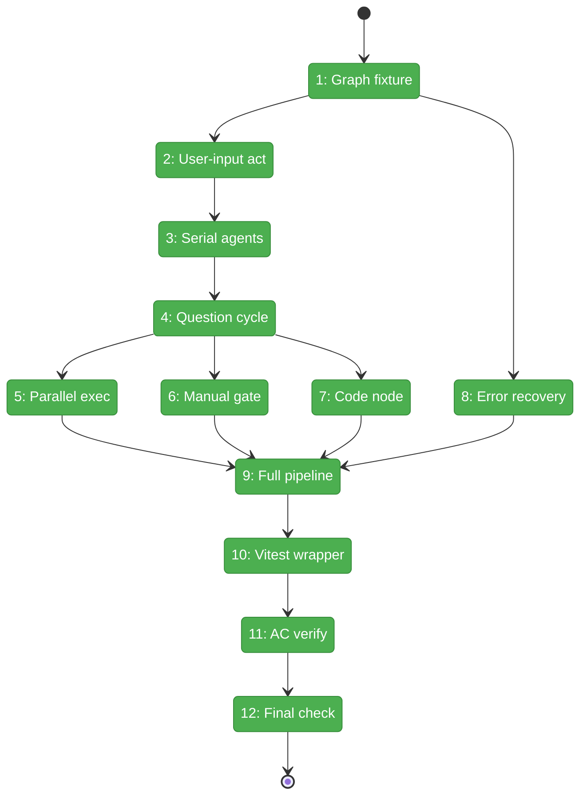
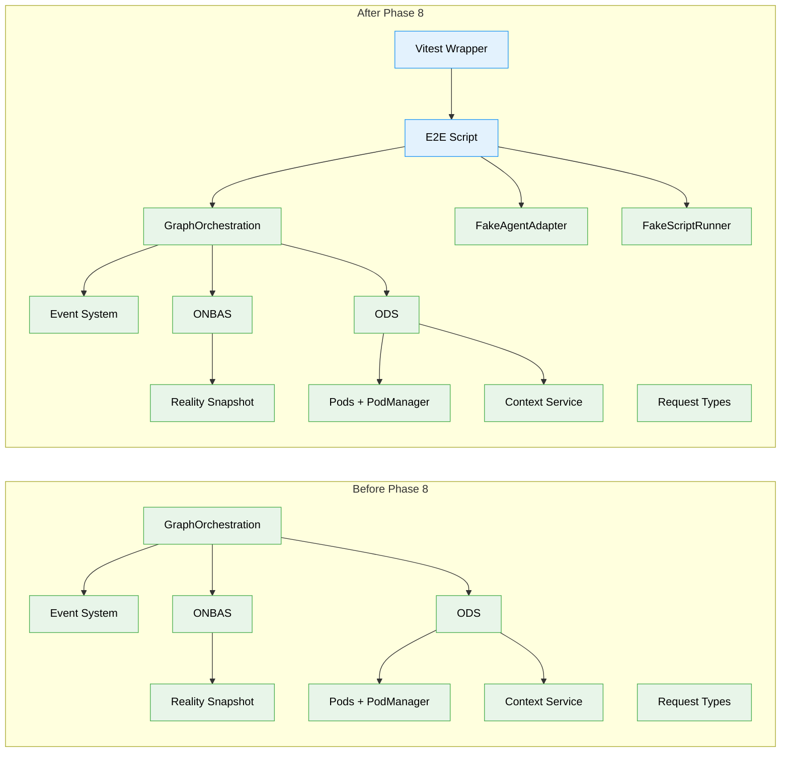

# Flight Plan: Phase 8 — E2E and Integration Testing

**Plan**: [positional-orchestrator-plan.md](../../positional-orchestrator-plan.md)
**Phase**: Phase 8: E2E and Integration Testing
**Generated**: 2026-02-10
**Status**: Landed (all 13 tasks complete) + Subtask 001 complete (upgrade worked example)

---

## Departure -> Destination

**Where we are**: Phases 1-7 built every component of the orchestration system in isolation: the reality snapshot (Phase 1), request types (Phase 2), context service (Phase 3), pods (Phase 4), ONBAS walk algorithm (Phase 5), ODS action handlers (Phase 6), and the orchestration entry point with its settle-decide-act loop (Phase 7). Plan 032 delivered the complete event system. Together, 253 unit tests prove each component works on its own, but nothing proves they work together end-to-end.

**Where we're going**: By the end of this phase, a single `npx tsx test/e2e/positional-graph-orchestration-e2e.ts` drives an 8-node pipeline through 58 steps — user-input, serial agents, question/answer cycles, parallel execution, manual transitions, code nodes, and error recovery — ending with `graph-complete` and exit code 0. A developer can run this script and see every orchestration pattern validated against real services.

---

## Flight Status

<!-- Updated by /plan-6: pending -> active -> done. Use blocked for problems/input needed. -->

**Legend**: grey = pending | yellow = active | red = blocked/needs input | green = done

---

## Stages

<!-- Updated by /plan-6 during implementation: [ ] -> [~] -> [x] -->

- [x] **Stage 1: Build test graph fixture and orchestration stack** — create temp workspace, 8 work unit YAMLs inline, 4-line graph with manual transition, 7 input wirings, orchestration handle with real services + FakeAgentAdapter + FakeScriptRunner (`test/e2e/positional-graph-orchestration-e2e.ts` — new file)
- [x] **Stage 2: User-input flow (ACT 1)** — start get-spec, ODS handles user-input, test provides data via CLI, node completes (`test/e2e/positional-graph-orchestration-e2e.ts`)
- [x] **Stage 3: Serial agent execution (ACT 2)** — spec-builder starts with inherited context, completes; spec-reviewer starts as serial successor, input wiring validated (`test/e2e/positional-graph-orchestration-e2e.ts`)
- [x] **Stage 4: Question/answer cycle (ACT 4)** — coder starts, asks question via CLI, settle finds waiting-question, answer + node:restart event, re-start with answer (`test/e2e/positional-graph-orchestration-e2e.ts`)
- [x] **Stage 5: Parallel execution (ACT 6)** — alignment-tester + pr-preparer both start in one run() call; serial gate blocks pr-creator (`test/e2e/positional-graph-orchestration-e2e.ts`)
- [x] **Stage 6: Manual transition gate (ACT 3)** — line blocked, run() returns no-action, trigger via CLI, next run() starts line 2 nodes (`test/e2e/positional-graph-orchestration-e2e.ts`)
- [x] **Stage 7: Code node execution (ACT 5)** — tester executes via CodePod with FakeScriptRunner, no session tracking (`test/e2e/positional-graph-orchestration-e2e.ts`)
- [x] **Stage 8: Error recovery (ACT E)** — separate 1-line 2-node graph, agent errors, node goes blocked-error, graph reflects failure, cross-graph isolation verified (`test/e2e/positional-graph-orchestration-e2e.ts`)
- [x] **Stage 9: Full pipeline completion (ACTs 7-8)** — pr-creator starts after parallel completes, graph reaches complete with all 8 nodes done, cleanup (`test/e2e/positional-graph-orchestration-e2e.ts`)
- [x] **Stage 10: Vitest wrapper** — CI-friendly test that runs the E2E script, skips when CLI not built, 120s timeout (`test/integration/positional-graph/orchestration-e2e.test.ts` — new file)
- [x] **Stage 11: Acceptance criteria verification** — AC-1 through AC-14 mapped to specific assertions, AC-8 deferred, annotations added to E2E script (`test/e2e/positional-graph-orchestration-e2e.ts`)
- [x] **Stage 12: Final validation** — `just fft` clean: 3730 tests pass, lint clean, format clean

---

## Architecture: Before & After

**Legend**: existing (green, unchanged) | changed (orange, modified) | new (blue, created)

---

## Acceptance Criteria

- [x] E2E tests drive full 8-node workflow without real agents (AC-12)
- [x] All 7 test patterns from Workshop #6 exercised (user-input, serial, Q&A, parallel, manual, code, error)
- [x] Graph reaches `complete` status with all 8 nodes complete
- [x] Question lifecycle flows correctly: ask -> answer -> node:restart -> re-start (AC-9)
- [x] Input wiring flows from user-input to agent nodes (AC-14)
- [x] Reality snapshot validates full graph state at completion (AC-1)
- [x] Two-level entry point exercised: svc.get() -> handle.run() (AC-10, AC-11)
- [x] FakePodManager with real PodManager + fake adapters enables deterministic tests (AC-13)
- [x] `just fft` clean

## Goals & Non-Goals

**Goals**:
- Create 4-line, 8-node test graph fixture exercising all orchestration patterns
- Write act-based E2E script driving orchestration in-process with CLI agent actions
- Validate question lifecycle through event system (5-phase control handoff)
- Verify graph reaches complete with all nodes done
- Write Vitest wrapper for CI integration

**Non-Goals**:
- Web/CLI wiring for `cg wf run` (deferred to follow-on)
- Pod session restart resilience testing (AC-8 -- integration-level, not E2E scope)
- Performance benchmarking
- Modifying any production code from Phases 1-7

---

## Checklist

- [x] T000: Fix ONBAS to skip user-input nodes (CS-2)
- [x] T001: Create test graph fixture and orchestration stack (CS-3)
- [x] T002: Write ACT 1 -- user-input flow (CS-2)
- [x] T003: Write ACT 2 -- serial agent execution (CS-2)
- [x] T004: Write ACT 4 -- question/answer cycle (CS-3)
- [x] T005: Write ACT 6 -- parallel execution (CS-2)
- [x] T006: Write ACT 3 -- manual transition gate (CS-2)
- [x] T007: Write ACT 5 -- code node execution (CS-2)
- [x] T008: Write ACT E -- error recovery (CS-2)
- [x] T009: Write ACTs 7-8 -- full pipeline completion (CS-2)
- [x] T010: Write Vitest wrapper (CS-1)
- [x] T011: Verify acceptance criteria coverage (CS-1)
- [x] T012: Final `just fft` validation (CS-1)

---

## PlanPak

Active -- source files organized under `features/030-orchestration/`. Test files follow project conventions: E2E in `test/e2e/`, integration wrappers in `test/integration/positional-graph/`.
