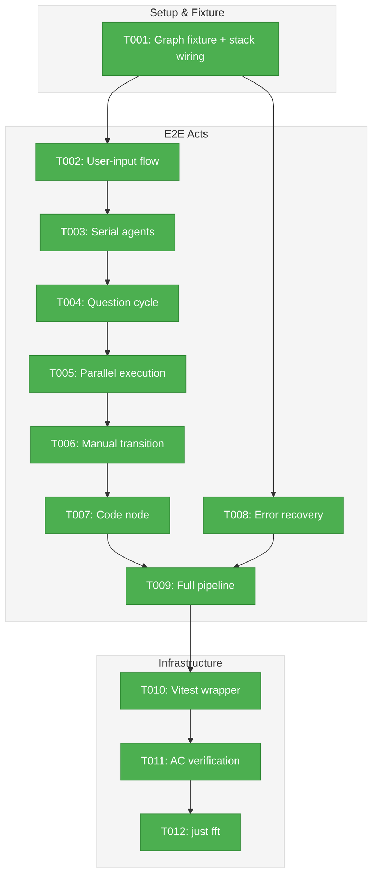

# Phase 8: E2E and Integration Testing — Tasks & Alignment Brief

**Spec**: [positional-orchestrator-spec.md](../../positional-orchestrator-spec.md)
**Plan**: [positional-orchestrator-plan.md](../../positional-orchestrator-plan.md)
**Workshop**: [13-phase-8-e2e-design.md](../../workshops/13-phase-8-e2e-design.md) (authoritative, supersedes Workshop #6)
**Date**: 2026-02-10

---

## Executive Briefing

### Purpose

This phase validates the entire Plan 030 orchestration system end-to-end. Phases 1-7 built the components (reality builder, request types, context service, pods, ONBAS, ODS, orchestration loop); Phase 8 proves they work together by driving a realistic 4-line, 8-node pipeline from start to `graph-complete`.

### What We're Building

A standalone E2E validation script that:
- Constructs a test graph with 8 nodes across 4 lines exercising every orchestration pattern
- Drives orchestration via `handle.run()` in-process (hybrid model — no `cg wf run`)
- Acts as each agent via CLI subprocess (`accept`, `save-output-data`, `end`, `ask`, `answer`)
- Validates the question/answer lifecycle through the event system (`node:restart` flow)
- Exercises user-input, serial agents, parallel execution, manual transitions, code nodes, and error recovery

### User Value

Confidence that the orchestration system works correctly before wiring it to web/CLI entry points. Every acceptance criterion (AC-1 through AC-14) gets test coverage.

### Example

**Before**: Individual unit tests prove each component in isolation (reality builder: 47 tests, ONBAS: 39 tests, etc.) but nothing proves they work together end-to-end.

**After**: A single `npx tsx test/e2e/positional-graph-orchestration-e2e.ts` drives 8 nodes through ~52 steps, ending with `graph-complete` and exit code 0.

---

## Objectives & Scope

### Objective

Validate the complete orchestration system with E2E tests that exercise the hybrid in-process + CLI model, proving all 7 Workshop #6 patterns and spec acceptance criteria AC-1 through AC-14.

### Goals

- Create 4-line, 8-node test graph fixture inline (Workshop #13 Option B)
- Write act-based E2E script driving orchestration via `handle.run()` + CLI agent actions
- Exercise all 7 patterns: user-input, serial agents, Q&A cycle, parallel execution, manual transition, code node, error recovery
- Validate question lifecycle through event system (ask -> answer -> `node:restart` -> re-start)
- Verify graph reaches `complete` with all 8 nodes complete
- Write Vitest wrapper for CI integration
- Confirm `just fft` clean

### Non-Goals

- Web/CLI wiring for `cg wf run` (out of scope — deferred to follow-on)
- Pod session restart resilience testing (AC-8 — integration-level, not E2E scope)
- Performance benchmarking
- FakePodBehavior concept (Workshop #6 assumption — corrected in Workshop #13)
- Modifying any production code from Phases 1-7

---

## Pre-Implementation Audit

### Summary

| File | Action | Origin | Modified By | Recommendation |
|------|--------|--------|-------------|----------------|
| `test/e2e/positional-graph-orchestration-e2e.ts` | Create | New (Phase 8) | — | keep-as-is |
| `test/integration/positional-graph/orchestration-e2e.test.ts` | Create | New (Phase 8) | — | keep-as-is |
| `test/helpers/positional-graph-e2e-helpers.ts` | Modify | Pre-plan (#23, #24), Plan 032 Phase 2 | Plan 032 | keep-as-is |

### Per-File Detail

#### `test/e2e/positional-graph-orchestration-e2e.ts`
- **Duplication check**: Existing E2E scripts found: `positional-graph-e2e.ts` (Plan 028, basic graph ops), `node-event-system-visual-e2e.ts` (Plan 032, 41 steps). No orchestration E2E exists. Name is unique and follows established `*-e2e.ts` convention.
- **Patterns to follow**: Plan 032 E2E uses act-based organization, `[IN-PROCESS]`/`[CLI]` annotations, step counter from shared helpers, try/finally cleanup. Workshop #13 mandates this same approach.

#### `test/integration/positional-graph/orchestration-e2e.test.ts`
- **Duplication check**: Existing wrapper: `node-event-system-visual-e2e.ts` in `test/e2e/`. New Vitest wrapper follows Plan 032 pattern (`skipIf(!cliExists)`, 120s timeout). Name is unique.

#### `test/helpers/positional-graph-e2e-helpers.ts`
- **Provenance**: Created by PR #23/#24, extended by Plan 032 Phase 2. Provides: `createTestServiceStack`, `runCli`, `createTestWorkspaceContext`, `assert`, `unwrap`, `banner`, `createStepCounter`, `cleanup`.
- **Assessment**: Currently has no orchestration-specific helpers (no `OrchestrationService`, `ONBAS`, `ODS` references). The E2E script will import these services directly — no extension needed. Keep as-is.

### Compliance Check

No violations found. Files follow established test conventions (E2E in `test/e2e/`, integration wrappers in `test/integration/`, helpers in `test/helpers/`).

---

## Requirements Traceability

### Coverage Matrix

| AC | Description | Flow Summary | Tasks | Status |
|----|-------------|-------------|-------|--------|
| AC-1 | Reality snapshot captures full state | Reality assertions in ACT 8 | T009 | ✅ Complete |
| AC-2 | OrchestrationRequest closed union | ONBAS produces typed requests, validated in loop | T009 | ✅ Complete |
| AC-3 | ONBAS walks deterministically | Serial/parallel order verified across all ACTs | T003,T005,T006 | ✅ Complete |
| AC-4 | ONBAS pure/synchronous | 39 unit tests + real ONBAS in E2E | T009 | ✅ Complete |
| AC-5 | AgentContextService position-based | Context inheritance in serial chains | T003 | ✅ Complete |
| AC-6 | ODS executes each request type | start-node on agent/code/user-input across ACTs | T002-T008 | ✅ Complete |
| AC-7 | Pods manage lifecycle | FakeAgentAdapter/FakeScriptRunner in E2E | T004,T007 | ✅ Complete |
| AC-8 | Pod sessions survive restarts | Unit-level coverage in Phase 4 | — | ⏭️ Deferred |
| AC-9 | Question lifecycle via events | ask -> answer -> node:restart -> re-start in ACT 3 | T004 | ✅ Complete |
| AC-10 | Two-level entry point | `svc.get()` -> `handle.run()` in all ACTs | T001 | ✅ Complete |
| AC-11 | Loop exercised in-process | All ACTs call `handle.run()` directly | T001-T009 | ✅ Complete |
| AC-12 | E2E without real agents | Full 8-node pipeline, test acts as agents | T009 | ✅ Complete |
| AC-13 | Deterministic integration tests | Real PodManager + fake adapters | T009 | ✅ Complete |
| AC-14 | Input wiring flows through | 12 connections wired in ACT 0, validated in ACTs 2+ | T001,T003 | ✅ Complete |

### Gaps Found

No gaps — all acceptance criteria have complete file coverage in the task table. AC-8 (pod session restart resilience) is deferred as it requires restart simulation beyond E2E scope.

### Orphan Files

All task table files map to at least one acceptance criterion.

---

## Architecture Map

### Component Diagram

<!-- Status: grey=pending, orange=in-progress, green=completed, red=blocked -->
<!-- Updated by plan-6 during implementation -->



### Task-to-Component Mapping

<!-- Status: Pending | In Progress | Complete | Blocked -->

| Task | Component(s) | Files | Status | Comment |
|------|-------------|-------|--------|---------|
| T001 | Graph Fixture + Stack | `test/e2e/positional-graph-orchestration-e2e.ts` | ✅ Complete | ACT 0: temp workspace, 8 unit YAMLs, 4-line graph, 7 input wirings, orchestration stack |
| T002 | User-Input Act | `test/e2e/positional-graph-orchestration-e2e.ts` | ✅ Complete | ACT 1: get-spec user-input node completed via CLI, ONBAS skips |
| T003 | Serial Agent Act | `test/e2e/positional-graph-orchestration-e2e.ts` | ✅ Complete | ACT 2: spec-builder + spec-reviewer serial chain with context inheritance |
| T004 | Question Cycle Act | `test/e2e/positional-graph-orchestration-e2e.ts` | ✅ Complete | ACT 4: coder ask -> answer -> node:restart -> re-start |
| T005 | Parallel Execution Act | `test/e2e/positional-graph-orchestration-e2e.ts` | ✅ Complete | ACT 6: alignment-tester + pr-preparer parallel start |
| T006 | Manual Transition Act | `test/e2e/positional-graph-orchestration-e2e.ts` | ✅ Complete | ACT 3: line-001 manual gate, trigger opens line-002 |
| T007 | Code Node Act | `test/e2e/positional-graph-orchestration-e2e.ts` | ✅ Complete | ACT 5: tester code node, no session tracking |
| T008 | Error Recovery Act | `test/e2e/positional-graph-orchestration-e2e.ts` | ✅ Complete | ACT E: separate graph, blocked-error, cross-graph isolation |
| T009 | Full Pipeline | `test/e2e/positional-graph-orchestration-e2e.ts` | ✅ Complete | ACTs 7-8: serial after parallel, graph-complete, cleanup |
| T010 | Vitest Wrapper | `test/integration/positional-graph/orchestration-e2e.test.ts` | ✅ Complete | skipIf(!cliExists), 120s timeout, follows Plan 032 pattern |
| T011 | AC Verification | `test/e2e/positional-graph-orchestration-e2e.ts` | ✅ Complete | AC-1 through AC-14 mapped (AC-8 deferred), annotations added |
| T012 | Final Validation | — | ✅ Complete | 3730 tests pass, lint clean, format clean |

---

## Tasks

| Status | ID | Task | CS | Type | Dependencies | Absolute Path(s) | Validation | Subtasks | Notes |
|--------|------|------|-----|------|-------------|-------------------|------------|----------|-------|
| [x] | T000 | Fix ONBAS to skip user-input nodes: add `unitType === 'user-input' → return null` in `visitNode()`, add test for user-input skip behavior | 2 | Fix | – | `/home/jak/substrate/030-positional-orchestrator/packages/positional-graph/src/features/030-orchestration/onbas.ts`, `/home/jak/substrate/030-positional-orchestrator/test/unit/positional-graph/onbas.test.ts` | ONBAS returns null for ready user-input nodes; no start-node emitted; existing 39 tests still pass | – | DYK #1: user-input nodes need no orchestration; ODS no-ops them but ONBAS was still emitting start-node |
| [x] | T001 | Create test graph fixture (ACT 0): temp workspace, 8 work unit YAMLs inline, create graph with 4 lines (line-002 manual transition), add 8 nodes (2 parallel), wire all 12 inputs, build orchestration stack with real services + FakeAgentAdapter + FakeScriptRunner; verify FakeAgentAdapter behavior (must not resolve instantly — configure to block/hang for E2E) | 3 | Setup | T000 | `/home/jak/substrate/030-positional-orchestrator/test/e2e/positional-graph-orchestration-e2e.ts` | Graph created with 4 lines, 8 nodes, 12 input wirings; orchestration handle obtained; FakeAgentAdapter configured for E2E; step counter starts | – | Plan 8.1 + 8.9 setup; per Workshop #13 Option B (inline generation); per CF-12 test graph; DYK #4: verify FakeAgentAdapter doesn't race CLI |
| [x] | T002 | Write ACT 1 — user-input flow: complete get-spec via CLI (save-output-data + end), then `handle.run()` advances past completed user-input to next ready node | 2 | E2E | T001 | `/home/jak/substrate/030-positional-orchestrator/test/e2e/positional-graph-orchestration-e2e.ts` | get-spec status `complete` after CLI end; ONBAS skips user-input (T000 fix); next node starts | – | Plan 8.2; Pattern 1; DYK #1: user-input completed via CLI before run() |
| [x] | T003 | Write ACT 2 — serial agent execution: spec-builder starts (inherits from line 0), completes via CLI; spec-reviewer starts as serial successor, completes; input wiring validated | 2 | E2E | T002 | `/home/jak/substrate/030-positional-orchestrator/test/e2e/positional-graph-orchestration-e2e.ts` | Two `run()` calls each produce 1 action; spec-reviewer starts after spec-builder completes; AC-5 context inheritance exercised | – | Plan 8.3; Patterns 2+5 |
| [x] | T004 | Write ACT 3 — question/answer cycle: coder starts, accepts via CLI, asks question via CLI (`question:ask` event), `handle.run()` settles (no-action), answer via CLI, raise `node:restart` event, `handle.run()` re-starts coder, completes | 3 | E2E | T003 | `/home/jak/substrate/030-positional-orchestrator/test/e2e/positional-graph-orchestration-e2e.ts` | Full 5-phase control handoff (A-E); after restart: `result.actions[0].request.type === 'start-node'` for coder; multi-subscriber stamps verified; AC-9 | – | Plan 8.4 + 8.10; Pattern 3; per CF-07 event-based question lifecycle |
| [x] | T005 | Write ACT 6 — parallel execution: alignment-tester + pr-preparer both start in one `run()` call; pr-creator NOT started (serial gate); both complete via CLI | 2 | E2E | T004 | `/home/jak/substrate/030-positional-orchestrator/test/e2e/positional-graph-orchestration-e2e.ts` | `result.actions.length === 2`; both are `start-node`; pr-creator not started | – | Plan 8.5; Pattern 4 |
| [x] | T006 | Write ACT 5 — manual transition gate: line 2 complete, `handle.run()` returns `no-action` (line 3 blocked), trigger via CLI `cg wf trigger`, next `handle.run()` starts line 3 nodes | 2 | E2E | T004 | `/home/jak/substrate/030-positional-orchestrator/test/e2e/positional-graph-orchestration-e2e.ts` | Pre-trigger: `stopReason === 'no-action'`; post-trigger: line 3 nodes start | – | Plan 8.6; Pattern 6 |
| [x] | T007 | Write ACT 4 — code node execution: tester (type=code) starts as serial successor to coder, executes via CodePod (FakeScriptRunner), no session tracking, completes | 2 | E2E | T004 | `/home/jak/substrate/030-positional-orchestrator/test/e2e/positional-graph-orchestration-e2e.ts` | Tester status `complete`; no session ID tracked for code nodes | – | Plan 8.7; Pattern 7 |
| [x] | T008 | Write ACT E — error recovery (separate 1-line 2-node graph): start node, accept via CLI, error via CLI -> `blocked-error`, `handle.run()` returns appropriate stop reason. Run AFTER main pipeline completes. Verify event scoping by graph slug is airtight (no cross-graph event contamination). | 2 | E2E | T009 | `/home/jak/substrate/030-positional-orchestrator/test/e2e/positional-graph-orchestration-e2e.ts` | Node shows `blocked-error`; reality reflects failure; separate graph from main pipeline; no cross-graph event leakage | – | Plan 8.8; Pattern 8; DYK #3: run last to avoid cross-graph event issues |
| [x] | T009 | Write ACTs 7-9 — serial after parallel (pr-creator starts), graph-complete verification (stopReason, 0 actions, all 8 nodes complete, reality.isComplete), cleanup | 2 | E2E | T005,T006,T007 | `/home/jak/substrate/030-positional-orchestrator/test/e2e/positional-graph-orchestration-e2e.ts` | `stopReason === 'graph-complete'`; `reality.completedCount === 8`; `reality.isComplete === true`; AC-12 | – | Plan 8.9 |
| [x] | T010 | Write Vitest wrapper: `skipIf(!cliExists)`, runs E2E script via `execSync`, 120s timeout | 1 | Test | T009 | `/home/jak/substrate/030-positional-orchestrator/test/integration/positional-graph/orchestration-e2e.test.ts` | Vitest wrapper passes when CLI built; skips gracefully otherwise | – | Per Plan 032 Vitest wrapper pattern |
| [x] | T011 | Verify all acceptance criteria have test coverage: map AC-1 through AC-14 to specific assertions in E2E; add any missing assertion comments | 1 | Doc | T009 | `/home/jak/substrate/030-positional-orchestrator/test/e2e/positional-graph-orchestration-e2e.ts` | Each AC-N has at least one test assertion or is documented as deferred (AC-8) | – | Plan 8.11 |
| [x] | T012 | Final `just fft` validation: lint clean, format clean, all tests pass | 1 | Validation | T010,T011 | — | Exit code 0; no regressions in existing 2135+ orchestration tests | – | Plan 8.12 |

---

## Alignment Brief

### Prior Phases Review

#### Phase-by-Phase Summary (Plan 030)

**Phase 1: PositionalGraphReality Snapshot** — Built `buildPositionalGraphReality()` pure function composing `GraphStatusResult` + `State` into an immutable snapshot. 8 interfaces/types, 7 Zod schemas, `PositionalGraphRealityView` with 11 lookup methods. 47 tests. Cross-plan: added `unitType` to `NodeStatusResult` (required), `surfaced_at` to `QuestionSchema` (optional). Key insight: `currentLineIndex === lines.length` means graph complete (past-the-end sentinel).

**Phase 2: OrchestrationRequest Discriminated Union** — Created 4-variant closed union (`start-node`, `resume-node`, `question-pending`, `no-action`) with Zod schemas (`.strict()`), 6 type guards, `NoActionReason` enum (4 values). 37 tests. Key: `StartNodeRequest.inputs` carries full `InputPack`; `NoActionRequest.reason` is optional.

**Phase 3: AgentContextService** — Pure `getContextSource()` function with 5 context rules based on position (not time). 3-variant `ContextSourceResult` (`inherit`, `new`, `not-applicable`). 14 tests including 8 edge cases. Key: cross-line walkback checks ALL previous lines; serial walks past non-agent nodes.

**Phase 4: WorkUnitPods and PodManager** — `AgentPod` (wraps `IAgentAdapter`), `CodePod` (wraps `IScriptRunner`), `PodManager` (in-memory Map + atomic session persistence to `pod-sessions.json`). `FakePodManager` + `FakePod` for testing. 53 tests. Key: PodManager is internal (not in DI); pods don't update state; user-input has no pod.

**Phase 5: ONBAS Walk Algorithm** — `walkForNextAction()` pure synchronous function walking lines by index, nodes by position, first-match semantics. `FakeONBAS` with action queue. `buildFakeReality()` test fixture builder. **Post-remediation (Subtask 001): ONBAS only produces `start-node` and `no-action` — `resume-node` and `question-pending` are vestigial.** 39 tests (reduced from 45 after remediation). Key: `waiting-question` always returns null (skip); question lifecycle is event-driven.

**Phase 6: ODS Action Handlers** — `ODS.execute()` dispatches on request type. `handleStartNode`: validates node ready, calls `startNode()` (`pending`/`restart-pending` -> `starting`), creates pod, resolves context, launches fire-and-forget. User-input: no-op. `no-action`: no-op. `FakeODS` with configurable results. **Concept drift remediation (Subtask 001)** fixed `handleQuestionAnswer` to stamp-only (no status transition), added `node:restart` event + handler, added `restart-pending` status, updated reality builder mapping. 76 ODS tests + remediation tests.

**Phase 7: Orchestration Entry Point** — `OrchestrationService` (singleton, handle caching by slug) and `GraphOrchestration` (settle-decide-act loop). `run()`: `loadGraphState` -> `processGraph` (settle) -> `persistGraphState` -> `buildReality` -> ONBAS -> exit check -> ODS -> record -> repeat. `getReality()` returns fresh snapshot. Max iteration guard (default 100). `FakeOrchestrationService` + `FakeGraphOrchestration`. 24 tests. Container integration via `registerOrchestrationServices()`.

#### Cumulative Deliverables (Phase 8 builds upon)

**Source files** (30 files in `features/030-orchestration/`):
- Types: `reality.types.ts`, `orchestration-request.types.ts`, `agent-context.types.ts`, `pod.types.ts`, `pod-manager.types.ts`, `script-runner.types.ts`, `onbas.types.ts`, `ods.types.ts`, `orchestration-service.types.ts`
- Schemas: `reality.schema.ts`, `orchestration-request.schema.ts`, `agent-context.schema.ts`, `pod.schema.ts`
- Implementation: `reality.builder.ts`, `reality.view.ts`, `orchestration-request.guards.ts`, `agent-context.ts`, `pod.agent.ts`, `pod.code.ts`, `pod-manager.ts`, `onbas.ts`, `ods.ts`, `graph-orchestration.ts`, `orchestration-service.ts`
- Fakes: `fake-agent-context.ts`, `fake-pod-manager.ts`, `fake-onbas.ts`, `fake-ods.ts`, `fake-orchestration-service.ts`
- Barrel: `index.ts`

**Test files** (11 files, 253 total tests):
- `reality.test.ts` (47), `orchestration-request.test.ts` (37), `agent-context.test.ts` (14), `pod.test.ts` (21), `pod-manager.test.ts` (32), `onbas.test.ts` (39), `ods.test.ts` (76+), `graph-orchestration.test.ts` (12), `orchestration-service.test.ts` (3), `fake-orchestration-service.test.ts` (7), `container-orchestration.test.ts` (3)

**Plan 032 deliverables** (event system — all 8 phases complete):
- `NodeEventService`, `EventHandlerService`, `IEventHandlerService`
- 7 core event types: `node:accepted`, `node:started`, `node:completed`, `node:error`, `question:ask`, `question:answer`, `node:restart`
- `processGraph(state, subscriber, contextFilter)` — settles events for a subscriber
- CLI: `cg wf node raise-event`, `cg wf node accept`, `cg wf node end`, `cg wf node ask`, `cg wf node answer`
- E2E: `node-event-system-visual-e2e.ts` (41 steps, exit 0)

#### Reusable Test Infrastructure

From shared helpers (`test/helpers/positional-graph-e2e-helpers.ts`):
- `createTestServiceStack(name)` — real filesystem + service stack
- `runCli(args, workspacePath)` — CLI subprocess wrapper
- `createTestWorkspaceContext(path)` — workspace context factory
- `assert()`, `unwrap()`, `banner()`, `createStepCounter()`, `cleanup()`

From Plan 030 fakes (available via barrel import):
- `buildFakeReality()` — declarative reality fixture builder (Phase 5)
- `FakeONBAS`, `FakeODS`, `FakeOrchestrationService`, `FakeGraphOrchestration`
- `FakePodManager`, `FakePod`, `FakeAgentContextService`, `FakeScriptRunner`

From `@chainglass/shared`:
- `FakeAgentAdapter` — stateless, configurable responses + call history

### Critical Findings Affecting This Phase

| Finding | Impact | Addressed By |
|---------|--------|-------------|
| CF-07: Question lifecycle is event-based | E2E must use `node:restart` event flow, not ONBAS `resume-node` | T004 |
| CF-12: Test graph is 4-line, 8-node | E2E fixture follows Workshop #13 graph structure | T001 |
| CF-13: FakeAgentAdapter already exists | Reuse existing fake; no new adapter needed | T001 |
| CF-04: ONBAS is pure/synchronous | Real ONBAS in E2E; no mock needed | T001 |

### ADR Decision Constraints

- **ADR-0004 (DI)**: Orchestration stack uses `useFactory` registration; E2E wires manually (not via DI container) per Workshop #13
- **ADR-0006 (CLI orchestration)**: Agent actions use CLI subprocess; matches hybrid model
- **ADR-0010 (Central event notification)**: Events raised via `ICentralEventNotifier` token — E2E uses real event system

### Invariants & Guardrails

- **Only 2 fakes**: `FakeAgentAdapter` and `FakeScriptRunner`. Everything else is real.
- **No `cg wf run`**: Orchestration is in-process via `handle.run()`.
- **Settle is automatic**: `GraphOrchestration.run()` calls `processGraph()` at loop start. Test does NOT call it manually.
- **ONBAS only produces `start-node` and `no-action`**: Do not test for `resume-node` or `question-pending`.
- **Fire-and-forget**: ODS calls `pod.execute()` without awaiting. Test acts as agent after ODS returns.
- **Max iterations**: Default 100 guard prevents infinite loops.

### Visual Alignment: E2E Flow

```mermaid
sequenceDiagram
    participant Script as E2E Script
    participant Svc as OrchestrationService
    participant Loop as GraphOrchestration
    participant EHS as EventHandlerService
    participant ONBAS
    participant ODS
    participant CLI as CLI Subprocess

    Script->>Svc: get(ctx, slug)
    Svc-->>Script: handle

    rect rgb(230,245,255)
        Note over Script,CLI: ACT 1: User Input
        Script->>Loop: handle.run()
        Loop->>EHS: processGraph (settle)
        Loop->>ONBAS: getNextAction(reality)
        ONBAS-->>Loop: start-node(get-spec)
        Loop->>ODS: execute(start-node)
        ODS-->>Loop: ok (user-input no-op)
        Loop-->>Script: result {actions: [start-node], stopReason: no-action}
        Script->>CLI: accept, save-output, end
    end

    rect rgb(255,243,224)
        Note over Script,CLI: ACT 3: Question Cycle
        Script->>Loop: handle.run()
        Loop->>ODS: execute(start-node for coder)
        Loop-->>Script: result
        Script->>CLI: accept
        Script->>CLI: ask question
        Script->>Loop: handle.run()
        Note over Loop: Settle finds question:ask
        Loop-->>Script: no-action (waiting-question)
        Script->>CLI: answer question
        Script->>CLI: raise-event node:restart
        Script->>Loop: handle.run()
        Note over Loop: Settle -> restart-pending -> ready
        Loop->>ONBAS: start-node(coder)
        Loop-->>Script: result {start-node}
        Script->>CLI: accept, save-output, end
    end
```

### Test Plan

All tests are E2E using the hybrid in-process + CLI model. No unit tests added (253 existing unit tests provide component-level coverage).

| Test | ACT | Pattern | Key Assertions |
|------|-----|---------|----------------|
| User-input flow | ACT 1 | Pattern 1 | start-node for get-spec; complete after CLI end |
| Serial agents | ACT 2 | Patterns 2+5 | spec-builder then spec-reviewer; context inheritance |
| Question cycle | ACT 3 | Pattern 3 | 5-phase handoff; node:restart; multi-subscriber stamps |
| Code node | ACT 4 | Pattern 7 | CodePod execution; no session tracking |
| Manual transition | ACT 5 | Pattern 6 | no-action before trigger; starts after trigger |
| Parallel execution | ACT 6 | Pattern 4 | 2 actions in one run(); serial gate blocks pr-creator |
| Serial after parallel | ACT 7 | — | pr-creator starts after both parallel complete |
| Graph complete | ACT 8 | — | stopReason=graph-complete; 8/8 nodes complete |
| Error recovery | ACT E | Pattern 8 | blocked-error; graph-failed or no-action |

### Implementation Outline

| Step | Task | Action |
|------|------|--------|
| 1 | T001 | Write ACT 0: temp workspace, inline work unit YAMLs, create graph + lines + nodes + inputs, build orchestration stack |
| 2 | T002 | Write ACT 1: user-input flow |
| 3 | T003 | Write ACT 2: serial agents |
| 4 | T004 | Write ACT 3: question/answer cycle (most complex — 10+ steps) |
| 5 | T007 | Write ACT 4: code node |
| 6 | T006 | Write ACT 5: manual transition gate |
| 7 | T005 | Write ACT 6: parallel execution |
| 8 | T009 | Write ACTs 7-9: serial after parallel, graph-complete, cleanup |
| 9 | T008 | Write ACT E: error recovery (separate graph) |
| 10 | T010 | Write Vitest wrapper |
| 11 | T011 | Verify AC coverage map |
| 12 | T012 | Run `just fft` |

### Commands to Run

```bash
# Build CLI first (required for E2E)
pnpm build --filter=@chainglass/cli --force

# Run E2E script directly
npx tsx test/e2e/positional-graph-orchestration-e2e.ts

# Run via Vitest wrapper
pnpm vitest run test/integration/positional-graph/orchestration-e2e.test.ts

# Full validation
just fft
```

### Risks & Unknowns

| Risk | Severity | Mitigation |
|------|----------|------------|
| CLI binary not built — E2E fails | Medium | Vitest wrapper uses `skipIf(!cliExists)`; build first |
| Turbo cache stale after code changes | Medium | Use `--force` flag: `pnpm build --filter=@chainglass/cli --force` |
| ODS user-input handling may not exist yet | Medium | Workshop #13 says ODS returns ok for user-input; verify in ODS source |
| E2E timing sensitivity with event processing | Low | Settle happens synchronously in loop; no race conditions |
| Test graph complexity (8 nodes, 12 inputs) | Low | Build incrementally; each ACT tested independently |

### Ready Check

- [x] All prior phases reviewed (Phases 1-7 complete, Plan 032 complete)
- [x] Workshop #13 E2E design read (authoritative, supersedes Workshop #6)
- [x] Critical findings mapped to tasks (CF-07, CF-12, CF-13, CF-04)
- [x] ADR constraints identified (ADR-0004, ADR-0006, ADR-0010)
- [x] Pre-implementation audit complete (no conflicts, no compliance issues)
- [x] Requirements traceability complete (all ACs covered, AC-8 deferred)
- [x] Hybrid model understood: in-process `handle.run()` + CLI agent actions
- [x] Question lifecycle understood: ask -> answer -> node:restart -> restart-pending -> ready -> start-node
- [x] Only 2 fakes needed: FakeAgentAdapter, FakeScriptRunner
- [ ] Human GO received

---

## Phase Footnote Stubs

_Reserved for plan-6. No footnotes during planning._

| Footnote | Task | Description |
|----------|------|-------------|
| | | |

---

## Evidence Artifacts

- **Execution log**: `execution.log.md` (created by plan-6)
- **Workshop 13**: `../../workshops/13-phase-8-e2e-design.md` (authoritative E2E design)
- **Workshop 06**: `../../workshops/06-e2e-integration-testing.md` (original, partially superseded)
- **Plan 032 E2E**: `test/e2e/node-event-system-visual-e2e.ts` (pattern reference)
- **Phase 7 Worked Example**: `../phase-7-orchestration-entry-point/examples/worked-example.ts`

---

## Discoveries & Learnings

_Populated during implementation by plan-6. Log anything of interest to your future self._

| Date | Task | Type | Discovery | Resolution | References |
|------|------|------|-----------|------------|------------|
| | | | | | |

**Types**: `gotcha` | `research-needed` | `unexpected-behavior` | `workaround` | `decision` | `debt` | `insight`

**What to log**:
- Things that didn't work as expected
- External research that was required
- Implementation troubles and how they were resolved
- Gotchas and edge cases discovered
- Decisions made during implementation
- Technical debt introduced (and why)
- Insights that future phases should know about

_See also: `execution.log.md` for detailed narrative._

---

## Critical Insights (2026-02-10)

| # | Insight | Decision |
|---|---------|----------|
| 1 | ONBAS emits `start-node` for user-input nodes but ODS no-ops them, causing an infinite loop | Fix ONBAS: add `unitType === 'user-input' → skip` in visitNode (new T000) |
| 2 | `processGraph(state, 'orchestrator', 'cli')` subscriber/context parameters need verification | Verify during build — E2E is a shakedown run, fix issues as they surface |
| 3 | ACT E (error recovery) shares OrchestrationService with main pipeline — risk of cross-graph event contamination | Run ACT E last (after graph-complete); also verify event scoping by graph slug |
| 4 | Fire-and-forget `pod.execute()` means FakeAgentAdapter may race CLI commands if it resolves instantly | Verify FakeAgentAdapter behavior; configure to block/hang for E2E if needed |
| 5 | "~52 steps" is an unverified estimate; real count depends on discoveries | Don't target a step count; build organically, adjust Vitest timeout at end |

Action items: T000 (ONBAS fix) added to task table; T001, T002, T008, T009 updated

---

## Directory Layout

```
docs/plans/030-positional-orchestrator/
  ├── positional-orchestrator-plan.md
  ├── positional-orchestrator-spec.md
  ├── workshops/
  │   ├── 06-e2e-integration-testing.md
  │   └── 13-phase-8-e2e-design.md
  └── tasks/phase-8-e2e-and-integration-testing/
      ├── tasks.md                    # this file
      ├── tasks.fltplan.md            # generated by /plan-5b
      └── execution.log.md            # created by /plan-6
```
