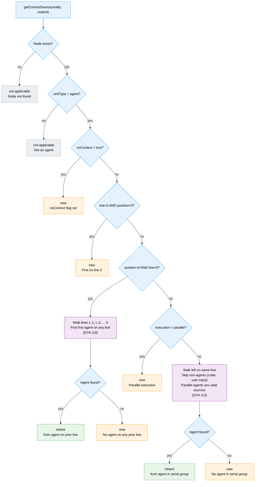

# Workshop: AgentContextService

**Type**: Integration Pattern
**Plan**: 030-positional-orchestrator
**Spec**: [research-dossier.md](../research-dossier.md)
**Created**: 2026-02-05
**Status**: Draft

**Related Documents**:
- [workshops.md](../workshops.md) — Workshop index
- [positional-graph-reality.md](01-positional-graph-reality.md) — Snapshot containing node topology
- [orchestration-request.md](02-orchestration-request.md) — OR does NOT carry context info (resolved)
- [research-dossier.md](../research-dossier.md) — IAgentContextService proposed contract

---

## Purpose

Define the rules and implementation for determining which session context an agent node should inherit (or whether to start fresh). This is the "how to execute" layer that the orchestration system uses when starting agent nodes.

**Separation of Concerns**:
- **ONBAS** answers "what should happen next?" → `OrchestrationRequest`
- **AgentContextService** answers "how should this agent start?" → `ContextSourceResult`
- **ODS** orchestrates both: gets OR from ONBAS, gets context from AgentContextService, executes

This workshop does NOT modify `OrchestrationRequest` — it defines a standalone service that ODS calls when handling `start-node` requests for agent work units.

## Key Questions Addressed

- What are the context inheritance rules for each node position?
- How does `unitType` affect context inheritance (agents only)?
- What is the lookup algorithm for finding the source node?
- How do we handle edge cases (no prior agent, code nodes, user-input)?
- How does this integrate with ODS's `start-node` handler?

---

## Design Principles

### 1. Pure Function on Reality

`AgentContextService.getContextSource()` is a **pure function**. It takes a `PositionalGraphReality` snapshot and a `nodeId`, and returns a `ContextSourceResult`. No side effects, no async, no external lookups.

```typescript
getContextSource(reality: PositionalGraphReality, nodeId: string): ContextSourceResult
```

### 2. Only Agent Nodes Have Context

- **Agent nodes**: May inherit or start fresh
- **Code nodes**: No context concept — they execute and complete
- **User-input nodes**: No context — they're passive data sources

The service still returns a result for non-agent nodes, but it's always `{ source: 'not-applicable', reason: '...' }`.

### 3. Rules Are Positional

Context inheritance is determined by the node's **position** in the graph:
- Which line is it on?
- Where is it in the line (first, middle, last)?
- What execution mode (serial vs parallel)?

### 4. Session ID Lookup is Separate

`AgentContextService` answers "inherit from which node?" — it returns a `fromNodeId`. The actual session ID lookup happens in ODS/PodManager:

```typescript
// In ODS.handleStartNode():
const contextResult = this.contextService.getContextSource(reality, nodeId);

if (contextResult.source === 'inherit') {
  const sessionId = this.podManager.getSessionId(graphSlug, contextResult.fromNodeId!);
  await pod.execute(inputs, sessionId);
} else {
  await pod.execute(inputs); // Fresh session
}
```

---

## Context Inheritance Rules

### Rule Matrix

| Position | Execution Mode | Rule | Source |
|----------|----------------|------|--------|
| First on line 0 | any | **New context** | No predecessor exists |
| First on line N (N>0) | any | **Inherit from first AGENT on ANY previous line** (walk N-1, N-2, ... 0) | Cross-line continuity (DYK-I10) |
| Not first | serial | **Inherit from nearest agent walking left** (skip non-agents; parallel agents are valid sources) | Serial chain (DYK-I13) |
| Not first | parallel | **New context** | Independent execution |

### Why These Rules?

**First node on line 0**: The graph starts here. No prior work exists to inherit from.

**First node on line N (N>0)**: Continues the "main thread" from a previous line. We walk backward through lines N-1, N-2, ... 0 and pick the **first AGENT node** on the first line that has one because:
- It's deterministic (always same source for a given graph)
- Lines with only code/user-input represent processing steps, not context boundaries
- Stopping at N-1 would force users to always put an agent on every line, which is overly restrictive
- If no agent exists on any previous line, the node gets new context

**Serial not-first**: Serial execution means waiting for predecessors to complete. We walk left past non-agent nodes (code, user-input) to find the nearest agent on the same line. Parallel agents are valid inheritance sources — the `parallel` execution mode only affects the parallel node itself (it gets fresh context), not serial nodes to its right. If no agent is found walking left (all non-agents or start of line), the node gets new context.

**Parallel not-first**: Parallel execution means independent work. Each parallel agent gets a fresh context to avoid state conflicts.

### Edge Cases

#### No Agent on ANY Previous Line (DYK-I10)

If no previous line has an agent, the first node on line N gets **new context**. The function walks ALL previous lines, not just N-1.

```
Line 0: [user-prompt] [code-validator]    ← no agents
Line 1: [formatter (code)]               ← no agents
Line 2: [spec-builder (first, agent)]     ← new context (no agent on any previous line)
```

#### Cross-Line Skips Non-Agent Lines (DYK-I10)

If line N-1 has no agents but an earlier line does, the function walks back to find it.

```
Line 0: [prompter (agent)]               ← has agent
Line 1: [validator (code)] [formatter (code)]  ← no agents
Line 2: [builder (agent)]                ← inherits from 'prompter' on line 0
```

#### First Node is Non-Agent

If the first node on a line is a code unit, context lookup is `not-applicable`. If the second node is an agent with serial execution, it walks left — but if no agent is found, it gets **new context**.

```
Line 1: [code-linter (serial)] → [spec-builder (serial, agent)]
                                  ↑ new context (no agent to the left)
```

#### Mixed Agent/Code Serial Chain (DYK-I13)

Serial agents walk left past non-agent nodes to find the nearest agent. Code nodes between agents don't break the inheritance chain.

```
Line 1: [agent-A (serial)] → [code-B (serial)] → [agent-C (serial)]
        ↑ new or inherited   ↑ not-applicable    ↑ inherits from agent-A (walks past code-B)
```

#### Parallel Agent Following Serial Agent

Even though there's a "left neighbor", parallel nodes don't wait and don't inherit.

```
Line 1: [agent-A (serial)] → [agent-B (parallel)] → [agent-C (parallel)]
        ↑ inherits from L0    ↑ new context          ↑ new context
```

#### Serial Agent Following Parallel Agent

A serial node waits for everything to its left to complete. It CAN inherit from a parallel agent — the `parallel` execution mode only affects the parallel node itself (it gets fresh context), not serial nodes to its right.

```
Line 1: [agent-A (parallel)] → [agent-B (parallel)] → [agent-C (serial)]
        ↑ new context          ↑ new context          ↑ inherits from agent-B
                                                        (walks left: B is agent, inherit)
```

#### No-Context Flag (Future)

Nodes may have an `orchestratorSettings.noContext: true` flag that forces new context regardless of position. This overrides all inheritance rules.

---

## Schema Definitions

### TypeScript Types

```typescript
// ============================================
// ContextSourceResult — The Service Return Type
// ============================================

/**
 * Result of context source lookup.
 * Tells ODS where to get session context from (or that it doesn't apply).
 */
export type ContextSourceResult =
  | InheritContextResult
  | NewContextResult
  | NotApplicableResult;

/**
 * Inherit session context from another node's completed execution.
 */
export interface InheritContextResult {
  readonly source: 'inherit';

  /** Node ID to get session from */
  readonly fromNodeId: string;

  /** Human-readable explanation */
  readonly reason: string;
}

/**
 * Start with fresh session context.
 */
export interface NewContextResult {
  readonly source: 'new';

  /** Human-readable explanation */
  readonly reason: string;
}

/**
 * Context concept doesn't apply (code units, user-input, etc.)
 */
export interface NotApplicableResult {
  readonly source: 'not-applicable';

  /** Human-readable explanation */
  readonly reason: string;
}

// ============================================
// Type Guards
// ============================================

export function isInheritContext(result: ContextSourceResult): result is InheritContextResult {
  return result.source === 'inherit';
}

export function isNewContext(result: ContextSourceResult): result is NewContextResult {
  return result.source === 'new';
}

export function isNotApplicable(result: ContextSourceResult): result is NotApplicableResult {
  return result.source === 'not-applicable';
}
```

### Zod Schemas

```typescript
import { z } from 'zod';

// ── InheritContextResult ─────────────────────────
export const InheritContextResultSchema = z.object({
  source: z.literal('inherit'),
  fromNodeId: z.string().min(1),
  reason: z.string().min(1),
}).strict();
export type InheritContextResult = z.infer<typeof InheritContextResultSchema>;

// ── NewContextResult ─────────────────────────────
export const NewContextResultSchema = z.object({
  source: z.literal('new'),
  reason: z.string().min(1),
}).strict();
export type NewContextResult = z.infer<typeof NewContextResultSchema>;

// ── NotApplicableResult ──────────────────────────
export const NotApplicableResultSchema = z.object({
  source: z.literal('not-applicable'),
  reason: z.string().min(1),
}).strict();
export type NotApplicableResult = z.infer<typeof NotApplicableResultSchema>;

// ── ContextSourceResult (Discriminated Union) ───
export const ContextSourceResultSchema = z.discriminatedUnion('source', [
  InheritContextResultSchema,
  NewContextResultSchema,
  NotApplicableResultSchema,
]);
export type ContextSourceResult = z.infer<typeof ContextSourceResultSchema>;
```

---

## Service Interface

```typescript
/**
 * Determines which session context an agent node should inherit.
 * Pure function — no side effects, no async.
 */
export interface IAgentContextService {
  /**
   * Get the context source for a node.
   *
   * @param reality - Graph snapshot
   * @param nodeId - The node to determine context for
   * @returns Context source (inherit, new, or not-applicable)
   */
  getContextSource(
    reality: PositionalGraphReality,
    nodeId: string
  ): ContextSourceResult;
}
```

---

## Implementation

### Algorithm

> **DYK-I9**: Logic is a bare exported function; class is a thin wrapper for interface injection.
> **DYK-I10**: Cross-line walks ALL previous lines, not just N-1.
> **DYK-I13**: Serial walks left past non-agents to find nearest agent (parallel agents are valid sources).

```typescript
import type { PositionalGraphReality, NodeReality, LineReality } from './reality.types.js';
import type { ContextSourceResult } from './context.types.js';
import { PositionalGraphRealityView } from './reality.view.js';

/**
 * Bare exported pure function — the actual implementation.
 * AgentContextService class delegates to this.
 */
export function getContextSource(
  reality: PositionalGraphReality,
  nodeId: string
): ContextSourceResult {
  const view = new PositionalGraphRealityView(reality);
  const node = view.getNode(nodeId);

  if (!node) {
    return {
      source: 'not-applicable',
      reason: `Node '${nodeId}' not found in reality`,
    };
  }

  // ── Rule 0: Only agents have context ────────────
  if (node.unitType !== 'agent') {
    return {
      source: 'not-applicable',
      reason: `Node '${nodeId}' is ${node.unitType}, not an agent`,
    };
  }

  // ── noContext override (Workshop #3 Q2) ────────────
  // Overrides all positional rules. Field is on NodeReality when schema is extended.
  if ('noContext' in node && (node as any).noContext === true) {
    return {
      source: 'new',
      reason: `noContext flag set on '${nodeId}' — forced new context`,
    };
  }

  // ── Rule 1: First node on line 0 ────────────────
  if (node.lineIndex === 0 && node.positionInLine === 0) {
    return {
      source: 'new',
      reason: 'First node on first line — no predecessor exists',
    };
  }

  // ── Rule 2: First node on line N (N>0) ──────────
  // DYK-I10: Walk ALL previous lines (N-1, N-2, ... 0) to find an agent
  if (node.positionInLine === 0 && node.lineIndex > 0) {
    for (let i = node.lineIndex - 1; i >= 0; i--) {
      const line = view.getLineByIndex(i);
      if (!line) continue;
      for (const nid of line.nodeIds) {
        const n = view.getNode(nid);
        if (n && n.unitType === 'agent') {
          return {
            source: 'inherit',
            fromNodeId: n.nodeId,
            reason: `First on line ${node.lineIndex} — inherits from first agent on line ${i}`,
          };
        }
      }
    }
    return {
      source: 'new',
      reason: `First on line ${node.lineIndex} — no agent on any previous line`,
    };
  }

  // ── Rule 3: Parallel execution ──────────────────
  if (node.execution === 'parallel') {
    return {
      source: 'new',
      reason: 'Parallel execution — independent context',
    };
  }

  // ── Rule 4: Serial execution — walk left to find nearest agent ─
  // DYK-I13: Walk left past non-agent nodes; parallel agents are valid sources
  const line = view.getLineByIndex(node.lineIndex);
  if (line) {
    for (let pos = node.positionInLine - 1; pos >= 0; pos--) {
      const leftNode = view.getNode(line.nodeIds[pos]);
      if (!leftNode) continue;

      // Found an agent — inherit regardless of its execution mode
      // (parallel mode only affects the parallel node itself, not serial nodes to its right)
      if (leftNode.unitType === 'agent') {
        return {
          source: 'inherit',
          fromNodeId: leftNode.nodeId,
          reason: `Serial — inherits from '${leftNode.nodeId}' on same line`,
        };
      }
      // Non-agent node (code, user-input) — skip and keep walking left
    }
  }

  return {
    source: 'new',
    reason: `Serial — no agent found in serial group on line ${node.lineIndex}`,
  };
}

/**
 * Thin class wrapper for interface injection (DYK-I9).
 * ODS depends on IAgentContextService; this delegates to the bare function.
 */
export class AgentContextService implements IAgentContextService {
  getContextSource(reality: PositionalGraphReality, nodeId: string): ContextSourceResult {
    return getContextSource(reality, nodeId);
  }
}
```

### Visual Decision Tree



---

## Integration with ODS

### ODS.handleStartNode() Pseudo-Code

```typescript
private async handleStartNode(
  ctx: WorkspaceContext,
  request: StartNodeRequest
): Promise<OrchestrationResult> {
  const { graphSlug, nodeId, inputs } = request;

  // 1. Get the current reality (for context lookup)
  const reality = await this.buildReality(ctx, graphSlug);
  const node = reality.nodes.get(nodeId);

  // 2. Update state: node → running
  await this.graphService.startNode(ctx, graphSlug, nodeId);

  // 3. Get/create pod for node
  const pod = await this.podManager.getPod(ctx, graphSlug, nodeId);

  // 4. Determine context source (only for agents)
  let contextSessionId: string | undefined;

  if (node?.unitType === 'agent') {
    const contextResult = this.contextService.getContextSource(reality, nodeId);

    if (isInheritContext(contextResult)) {
      // Get session ID from source node
      contextSessionId = this.podManager.getSessionId(
        ctx,
        graphSlug,
        contextResult.fromNodeId
      );

      // Log the inheritance for debugging
      this.logger.debug(
        `Node '${nodeId}' inherits context from '${contextResult.fromNodeId}' ` +
        `(session: ${contextSessionId ?? 'not found'})`
      );
    } else if (isNewContext(contextResult)) {
      this.logger.debug(`Node '${nodeId}' starts with new context: ${contextResult.reason}`);
    }
  }

  // 5. Execute pod
  const podResult = await pod.execute(inputs, contextSessionId);

  // 6. Emit event
  this.notifier.emit('workgraphs', 'node-started', { graphSlug, nodeId });

  return {
    ok: true,
    request,
    sessionId: podResult.sessionId,
    newStatus: 'running',
  };
}
```

---

## Examples

### Example 1: Simple Linear Graph

```
Line 0: [user-prompt (user-input)]
Line 1: [spec-builder (agent, serial)]
Line 2: [coder (agent, serial)]
```

| Node | Context Source |
|------|----------------|
| `user-prompt` | not-applicable (user-input) |
| `spec-builder` | new (first agent on L1, L0 has no agents) |
| `coder` | inherit from `spec-builder` (first agent on L1) |

### Example 2: Parallel Agents

```
Line 0: [user-prompt (user-input)]
Line 1: [reviewer-A (agent, serial)] → [reviewer-B (agent, parallel)] → [reviewer-C (agent, parallel)]
```

| Node | Context Source |
|------|----------------|
| `user-prompt` | not-applicable |
| `reviewer-A` | new (first on L1, L0 has no agents) |
| `reviewer-B` | new (parallel execution) |
| `reviewer-C` | new (parallel execution) |

### Example 3: Serial Chain with Code Unit (DYK-I13)

```
Line 0: [prompter (agent, serial)]
Line 1: [linter (code, serial)] → [reviewer (agent, serial)] → [fixer (agent, serial)]
```

| Node | Context Source |
|------|----------------|
| `prompter` | new (first on L0) |
| `linter` | not-applicable (code) |
| `reviewer` | new (walks left: linter is code, no more nodes — no agent in serial group) |
| `fixer` | inherit from `reviewer` (walks left: reviewer is agent) |

### Example 4: Cross-Line Inheritance

```
Line 0: [setup (code)] → [prompter (agent)]
Line 1: [spec-builder (agent)] → [spec-reviewer (agent)]
Line 2: [coder (agent)]
```

| Node | Context Source |
|------|----------------|
| `setup` | not-applicable (code) |
| `prompter` | new (walks left: setup is code, no more nodes — no agent in serial group) |
| `spec-builder` | inherit from `prompter` (walks L0: found `prompter`) |
| `spec-reviewer` | inherit from `spec-builder` (walks left: found agent) |
| `coder` | inherit from `spec-builder` (walks L1: found `spec-builder`) |

### Example 5: Line with No Agents (DYK-I10)

```
Line 0: [user-prompt (user-input)]
Line 1: [validator (code)] → [formatter (code)]
Line 2: [builder (agent)]
```

| Node | Context Source |
|------|----------------|
| `user-prompt` | not-applicable |
| `validator` | not-applicable |
| `formatter` | not-applicable |
| `builder` | new (walks L1→L0: no agents on any previous line) |

### Example 6: Cross-Line Walk-Back Finds Agent (DYK-I10)

```
Line 0: [prompter (agent, serial)]
Line 1: [validator (code)] → [formatter (code)]
Line 2: [builder (agent)]
```

| Node | Context Source |
|------|----------------|
| `prompter` | new (first on L0) |
| `validator` | not-applicable (code) |
| `formatter` | not-applicable (code) |
| `builder` | inherit from `prompter` (walks L1: no agents → L0: found `prompter`) |

### Example 7: Serial Walk-Back Past Non-Agents (DYK-I13)

```
Line 0: [agent-A (serial)] → [code-B (serial)] → [user-input-C (serial)] → [agent-D (serial)]
```

| Node | Context Source |
|------|----------------|
| `agent-A` | new (first on L0) |
| `code-B` | not-applicable (code) |
| `user-input-C` | not-applicable (user-input) |
| `agent-D` | inherit from `agent-A` (walks left: user-input-C skip → code-B skip → agent-A found) |

---

## Testing Patterns

### Unit Testing with Fake Reality

```typescript
import { describe, it, expect } from 'vitest';
import { AgentContextService } from './agent-context.service.js';
import { buildFakeReality, buildFakeNode, buildFakeLine } from './test-helpers.js';

describe('AgentContextService', () => {
  const service = new AgentContextService();

  describe('getContextSource', () => {

    it('returns not-applicable for non-agent nodes', () => {
      const reality = buildFakeReality({
        nodes: [
          buildFakeNode({ nodeId: 'code-001', unitType: 'code', lineIndex: 0, positionInLine: 0 }),
        ],
        lines: [buildFakeLine({ lineId: 'line-0', nodeIds: ['code-001'] })],
      });

      const result = service.getContextSource(reality, 'code-001');

      expect(result.source).toBe('not-applicable');
      expect(result.reason).toContain('code');
    });

    it('returns new context for first agent on line 0', () => {
      const reality = buildFakeReality({
        nodes: [
          buildFakeNode({ nodeId: 'agent-001', unitType: 'agent', lineIndex: 0, positionInLine: 0 }),
        ],
        lines: [buildFakeLine({ lineId: 'line-0', nodeIds: ['agent-001'] })],
      });

      const result = service.getContextSource(reality, 'agent-001');

      expect(result.source).toBe('new');
      expect(result.reason).toContain('First');
    });

    it('inherits from first agent on previous line', () => {
      const reality = buildFakeReality({
        nodes: [
          buildFakeNode({ nodeId: 'prev-agent', unitType: 'agent', lineIndex: 0, positionInLine: 0 }),
          buildFakeNode({ nodeId: 'curr-agent', unitType: 'agent', lineIndex: 1, positionInLine: 0 }),
        ],
        lines: [
          buildFakeLine({ lineId: 'line-0', nodeIds: ['prev-agent'], index: 0 }),
          buildFakeLine({ lineId: 'line-1', nodeIds: ['curr-agent'], index: 1 }),
        ],
      });

      const result = service.getContextSource(reality, 'curr-agent');

      expect(result.source).toBe('inherit');
      expect(result).toHaveProperty('fromNodeId', 'prev-agent');
    });

    it('inherits from left neighbor in serial chain', () => {
      const reality = buildFakeReality({
        nodes: [
          buildFakeNode({ nodeId: 'left-agent', unitType: 'agent', lineIndex: 0, positionInLine: 0, execution: 'serial' }),
          buildFakeNode({ nodeId: 'right-agent', unitType: 'agent', lineIndex: 0, positionInLine: 1, execution: 'serial' }),
        ],
        lines: [
          buildFakeLine({ lineId: 'line-0', nodeIds: ['left-agent', 'right-agent'] }),
        ],
      });

      const result = service.getContextSource(reality, 'right-agent');

      expect(result.source).toBe('inherit');
      expect(result).toHaveProperty('fromNodeId', 'left-agent');
    });

    it('returns new context for parallel node', () => {
      const reality = buildFakeReality({
        nodes: [
          buildFakeNode({ nodeId: 'left-agent', unitType: 'agent', lineIndex: 0, positionInLine: 0, execution: 'serial' }),
          buildFakeNode({ nodeId: 'parallel-agent', unitType: 'agent', lineIndex: 0, positionInLine: 1, execution: 'parallel' }),
        ],
        lines: [
          buildFakeLine({ lineId: 'line-0', nodeIds: ['left-agent', 'parallel-agent'] }),
        ],
      });

      const result = service.getContextSource(reality, 'parallel-agent');

      expect(result.source).toBe('new');
      expect(result.reason).toContain('parallel');
    });

    it('returns new when left neighbor is code', () => {
      const reality = buildFakeReality({
        nodes: [
          buildFakeNode({ nodeId: 'left-code', unitType: 'code', lineIndex: 0, positionInLine: 0, execution: 'serial' }),
          buildFakeNode({ nodeId: 'right-agent', unitType: 'agent', lineIndex: 0, positionInLine: 1, execution: 'serial' }),
        ],
        lines: [
          buildFakeLine({ lineId: 'line-0', nodeIds: ['left-code', 'right-agent'] }),
        ],
      });

      const result = service.getContextSource(reality, 'right-agent');

      expect(result.source).toBe('new');
      expect(result.reason).toContain('code');
    });

    it('returns new when previous line has no agents', () => {
      const reality = buildFakeReality({
        nodes: [
          buildFakeNode({ nodeId: 'code-node', unitType: 'code', lineIndex: 0, positionInLine: 0 }),
          buildFakeNode({ nodeId: 'agent-node', unitType: 'agent', lineIndex: 1, positionInLine: 0 }),
        ],
        lines: [
          buildFakeLine({ lineId: 'line-0', nodeIds: ['code-node'], index: 0 }),
          buildFakeLine({ lineId: 'line-1', nodeIds: ['agent-node'], index: 1 }),
        ],
      });

      const result = service.getContextSource(reality, 'agent-node');

      expect(result.source).toBe('new');
      expect(result.reason).toContain('no agent');
    });

  });
});
```

### Table-Driven Tests

```typescript
describe('AgentContextService (table-driven)', () => {
  const service = new AgentContextService();

  const cases = [
    {
      name: 'non-agent node',
      nodeId: 'code-001',
      setup: { unitType: 'code', lineIndex: 0, positionInLine: 0 },
      expected: { source: 'not-applicable' },
    },
    {
      name: 'first agent on line 0',
      nodeId: 'agent-001',
      setup: { unitType: 'agent', lineIndex: 0, positionInLine: 0 },
      expected: { source: 'new' },
    },
    {
      name: 'parallel agent',
      nodeId: 'parallel-001',
      setup: { unitType: 'agent', lineIndex: 0, positionInLine: 1, execution: 'parallel' },
      expected: { source: 'new' },
    },
    // ... more cases
  ];

  cases.forEach(({ name, nodeId, setup, expected }) => {
    it(name, () => {
      const reality = buildSingleNodeReality(nodeId, setup);
      const result = service.getContextSource(reality, nodeId);
      expect(result.source).toBe(expected.source);
    });
  });
});
```

---

## Open Questions

### Q1: Should context inheritance skip non-agent nodes when looking backward?

**RESOLVED**: Yes — and walk backward until an agent is found (DYK-I10, DYK-I13).

**Cross-line (Rule 2)**: When looking for an agent to inherit from, walk ALL previous lines (N-1, N-2, ... 0). Lines with only code/user-input nodes represent processing steps, not context boundaries. Only return `new` if no agent exists on any previous line.

**Serial left-neighbor (Rule 4)**: Walk left past non-agent nodes (code, user-input) to find the nearest agent in the serial group. Stop at parallel boundaries (different execution group). Only return `new` if no agent is found in the serial group.

**Rationale** (updated from original): The original "single-hop" rule was too restrictive — it forced users to put an agent on every line and never use code processing steps between agents in serial chains. Walk-back is still deterministic and predictable: same graph → same result.

### Q2: Should there be a `noContext` flag to force fresh context?

**RESOLVED**: Yes, but not in v1.

Add to node's `orchestratorSettings`:
```typescript
orchestratorSettings: {
  execution: 'serial' | 'parallel',
  noContext?: boolean, // Force new context regardless of position
}
```

Implementation:
```typescript
// Early return in getContextSource:
if (node.orchestratorSettings?.noContext === true) {
  return { source: 'new', reason: 'noContext flag set' };
}
```

**Deferred**: This adds complexity and isn't needed for basic workflows. Add when use case emerges.

### Q3: How do we handle a source node that failed or never ran?

**RESOLVED**: Return the source node ID anyway; let PodManager handle missing sessions.

If `getContextSource()` returns `inherit from 'node-X'` but `node-X` never ran (or failed before creating a session), the `podManager.getSessionId()` call returns `undefined`. ODS then starts the new node with a fresh context.

This keeps the context service pure — it determines **where** to inherit from, not **whether** the source is valid. Validity is a runtime concern for ODS/PodManager.

### Q4: What about agent nodes that complete but don't persist their session?

**RESOLVED**: Session persistence is PodManager's responsibility, not AgentContextService's.

PodManager must persist session IDs for completed agent nodes (in state.json or a separate file). If a session ID is missing when needed, ODS falls back to new context with a warning.

---

## Relationship to Other Workshops

| Workshop | Relationship |
|----------|--------------|
| **PositionalGraphReality** | Provides the snapshot with `nodes`, `lines`, `unitType`, `positionInLine` |
| **OrchestrationRequest** | Does NOT contain context info; context is ODS's concern |
| **ONBAS** | Produces OR; unaware of context service |
| **ODS** | Calls `contextService.getContextSource()` when handling `start-node` |
| **WorkUnitPods** | PodManager provides `getSessionId(fromNodeId)` |

---

## File Location

```
packages/positional-graph/
└── src/
    └── features/030-orchestration/
        ├── context.types.ts            # ContextSourceResult types
        ├── context.schema.ts           # Zod schemas
        ├── context.service.ts          # AgentContextService implementation
        ├── context.service.interface.ts # IAgentContextService interface
        └── context.service.test.ts     # Unit tests
```

---

## Implementation Checklist

- [ ] Create `context.types.ts` with result types and type guards
- [ ] Create `context.schema.ts` with Zod schemas
- [ ] Create `context.service.interface.ts` with `IAgentContextService`
- [ ] Create `context.service.ts` with `AgentContextService` implementation
- [ ] Add unit tests with fake reality
- [ ] Add table-driven tests for all rule combinations
- [ ] Export from feature index
- [ ] Integrate with ODS `handleStartNode()` (depends on Workshop #6)
- [ ] Document session ID persistence requirements for PodManager

---

## Glossary

| Term | Expansion | Definition |
|------|-----------|------------|
| **OR** | OrchestrationRequest | Discriminated union type representing the next action for the orchestrator. Four variants: `start-node`, `resume-node`, `question-pending`, `no-action`. |
| **ONBAS** | OrchestrationNextBestActionService | Pure-function rules engine that walks a `PositionalGraphReality` snapshot and returns an OR. |
| **ODS** | OrchestrationDoerService | Executor that consumes an OR and performs the action. Calls AgentContextService when handling `start-node` for agent nodes. |
| **Reality** | PositionalGraphReality | Read-only snapshot of the entire graph state. Input to both ONBAS and AgentContextService. |
| **Pod** | WorkUnitPod | Ephemeral execution container for a node. Receives the `contextSessionId` determined by AgentContextService. |
| **PodManager** | IPodManager | Per-graph registry that tracks pod session IDs. Provides the session ID that AgentContextService's `inherit` result points to. |
| **ContextSourceResult** | — | Return type of `getContextSource()`: `{ source: 'inherit' \| 'new' \| 'not-applicable', sourceNodeId?, reason }`. |
| **Session ID** | — | Opaque string identifying an agent conversation session. Enables context continuity when a new node inherits from a prior agent. |
| **NodeReality** | — | Per-node snapshot: status, readiness, unit type, position, execution mode. Used to determine context inheritance rules. |
| **WorkUnit** | — | Declarative definition of what a node does. Only `agent` units have meaningful context inheritance. |
| **InputPack** | — | Collated input data for a node, resolved from upstream outputs. |

---

## Summary

`AgentContextService` answers **"how should this agent start?"** by determining whether to inherit session context from a prior node or start fresh.

**Key Points**:
1. **Pure function** on `PositionalGraphReality` — no side effects (DYK-I9: bare exported function + thin class wrapper)
2. **Three outcomes**: `inherit`, `new`, or `not-applicable`
3. **Rules are positional**: line index, position in line, execution mode
4. **Walk-back**: both cross-line and serial-left rules walk backward to find agents, not just immediate neighbors (DYK-I10, DYK-I13)
5. **Separation**: Context service says "inherit from X", PodManager provides session ID
6. **Integration**: ODS calls context service when handling `start-node` for agents

The rules:
- First on line 0 → new
- First on line N → walk lines N-1, N-2, ... 0 to find first agent (or new if none on any line) (DYK-I10)
- Serial not-first → walk left past non-agents to find nearest agent on same line; parallel agents are valid sources (or new if none found) (DYK-I13)
- Parallel → always new
