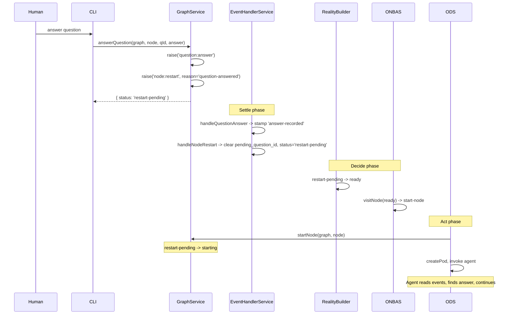
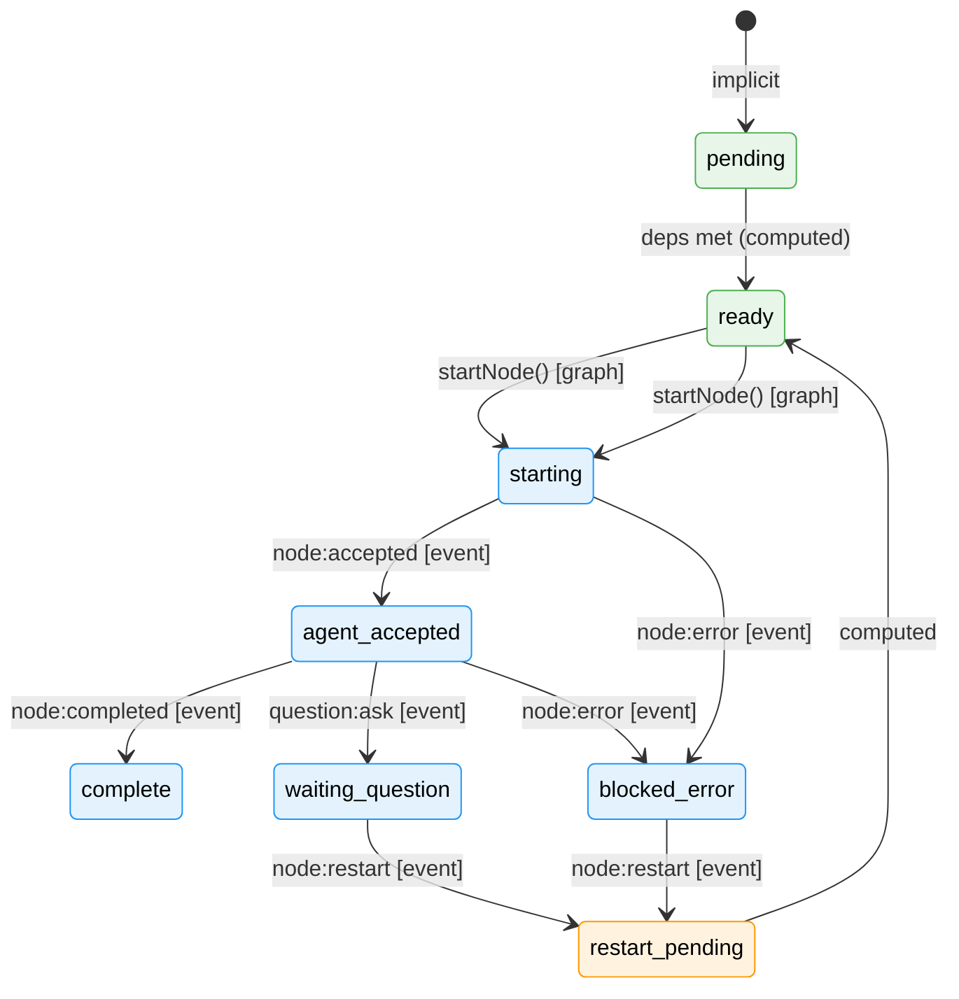

# Workshop 10: The Node Restart Event

**Type**: State Machine / Integration Pattern
**Plan**: 030-positional-orchestrator
**Spec**: [positional-orchestrator-spec.md](../positional-orchestrator-spec.md)
**Created**: 2026-02-09
**Status**: Draft

**Related Documents**:
- [Workshop 09: Concept Drift Remediation](09-concept-drift-remediation.md) — Two-domain boundary, Violation 5
- [Workshop 08: ODS Handover](08-ods-orchestrator-agent-handover.md) — Pod lifecycle, shared transitions
- [Workshop 05: ONBAS](05-onbas.md) — Pure walk algorithm
- [Workshop 02: OrchestrationRequest](02-orchestration-request.md) — 4-variant union
- [Plan 032 Workshop 11: IEventHandlerService and ONBAS Question Ownership](../../032-node-event-system/workshops/11-ieventhandlerservice-and-onbas-question-ownership.md) — EHS settles before ONBAS, ONBAS never reads events
- [Plan 032 Workshop 10: Event Processing in the Orchestration Loop](../../032-node-event-system/workshops/10-event-processing-in-the-orchestration-loop.md) — Settle -> Decide -> Act

---

## Purpose

Workshop 09 fixed `handleQuestionAnswer` to stamp without transitioning — the node stays `waiting-question`. But something still needs to move the node from `waiting-question` back to a startable state. This workshop designs that mechanism: a generic `node:restart` event that transitions blocked nodes to a restartable state. It's not Q&A-specific — any unblocking scenario (error resolution, manual override, timeout retry) uses the same event.

## Key Questions Addressed

- Q1: What event transitions a node from `waiting-question` back to startable?
- Q2: What status does the restart handler set, and how does ONBAS pick it up?
- Q3: How does the agent know it's a restart (not a fresh start)?
- Q4: What happens to `resume-node` in OrchestrationRequest?
- Q5: What other scenarios use `node:restart` beyond Q&A?
- Q6: How does `startNode()` accept restarted nodes?

---

## Part 1: The Problem

After Workshop 09's fix, the answer flow is:

```
answerQuestion() raises question:answer
  -> handleQuestionAnswer stamps 'answer-recorded'
  -> Node stays 'waiting-question'
  -> pending_question_id still set
  -> ???
  -> Node needs to become startable again
```

Three prior designs for `???`:

| Design | Who transitions? | Problem |
|--------|-----------------|---------|
| **Old handler** (pre-Workshop 09) | `handleQuestionAnswer` sets `starting` | Violates two-domain boundary — handler making graph decision |
| **ODS handleResumeNode** (Workshop 09) | ODS transitions `waiting-question -> starting` | ODS owns Q&A flow — ODS should be Q&A-agnostic |
| **ONBAS detects answered question** (Workshop 11) | ONBAS returns `resume-node`, ODS transitions | Still requires Q&A-specific `resume-node` logic in ODS |

The missing piece: a **generic event** that means "unblock this node and make it startable again." The thing that resolves the blocker (answer, error fix, admin override) raises this event. A handler does the transition during Settle. ONBAS and ODS treat it as a regular start.

---

## Part 2: The Status Problem

If the restart handler transitions to `starting`, ONBAS skips it:

```typescript
// onbas.ts visitNode() — lines 83-85
case 'starting':
case 'agent-accepted':
  return null;  // Skip — already being handled
```

ONBAS only returns `start-node` for `ready` nodes. But `ready` is **computed by the reality builder**, not stored:

```
Stored statuses:  starting, agent-accepted, waiting-question, blocked-error, complete
Implicit:         pending (no state entry)
Computed:         ready (pending + all deps met)
```

So the restart handler can't set `ready` directly. And setting `pending` would require deleting the node's state entry — losing all event history, timestamps, and outputs.

**We need a new stored status that the reality builder maps to `ready`.**

---

## Part 3: Design — `restart-pending` Status

### New Status: `restart-pending`

A node that has been unblocked by an event and is ready to be re-started. The reality builder treats it identically to `pending` with deps met — it maps to `ready`.

```
Stored statuses:  starting, agent-accepted, waiting-question, blocked-error,
                  complete, restart-pending  <-- NEW
```

### Reality Builder Mapping

```typescript
// reality.builder.ts — buildNodeReality()
case 'restart-pending':
  // Restart-pending nodes are always ready — their deps were met when
  // they first ran. Map to 'ready' so ONBAS returns start-node.
  return { ...base, status: 'ready' };
```

No ONBAS changes needed. ONBAS already handles `ready` → `start-node`.

### startNode() Accepts `restart-pending`

```typescript
// positional-graph.service.ts — startNode()
const transition = await this.transitionNodeState(
  ctx, graphSlug, nodeId, 'starting',
  ['pending', 'restart-pending']  // <-- add restart-pending
);
```

One-line change. `startNode()` doesn't need to know WHY the node needs starting.

---

## Part 4: Design — `node:restart` Event

### Event Type Registration

```typescript
// Add to core event types (alongside the existing 6)
registry.register({
  event_type: 'node:restart',
  description: 'Request to restart a blocked node',
  stops_execution: false,
  payload_schema: NodeRestartPayloadSchema,
});
```

### Payload Schema

```typescript
const NodeRestartPayloadSchema = z.object({
  reason: z.enum([
    'question-answered',  // Question was answered, resume work
    'error-resolved',     // Error was manually resolved
    'manual',             // Admin/operator override
    'retry',              // Automatic retry (timeout, watchdog)
  ]),
  source_event_id: z.string().optional(),  // Link to the triggering event (e.g., the question:answer event)
});
```

### Valid-From States

```typescript
// raise-event.ts — VALID_FROM_STATES
'node:restart': ['waiting-question', 'blocked-error'],
```

These are the two "blocked" states a node can be in. `starting`, `agent-accepted`, `complete`, and `pending` are not restartable.

### Handler

```typescript
function handleNodeRestart(ctx: HandlerContext): void {
  const payload = ctx.event.payload as { reason: string };

  // Clear blocking state based on current status
  if (ctx.node.status === 'waiting-question') {
    ctx.node.pending_question_id = undefined;
  }
  if (ctx.node.status === 'blocked-error') {
    ctx.node.error = undefined;
  }

  // Transition to restart-pending
  ctx.node.status = 'restart-pending';
  ctx.stamp('restart-executed');
}
```

### Registry Entry

```typescript
registry.on('node:restart', handleNodeRestart, {
  context: 'both',
  name: 'handleNodeRestart',
});
```

---

## Part 5: The Full Answer Flow (After This Design)

```
1. Human answers question via CLI

2. answerQuestion() service method:
   a. raise('question:answer', { question_event_id })
   b. raise('node:restart', { reason: 'question-answered', source_event_id })
   c. Update state.questions[] with answer (backward compat)
   d. Return { status: 'restart-pending' }

3. Settlement (EHS.processGraph):
   a. handleQuestionAnswer:
      - Cross-stamp ask event with 'answer-linked'
      - Stamp 'answer-recorded'
      - Node stays waiting-question
   b. handleNodeRestart:
      - Clear pending_question_id
      - Set status = 'restart-pending'
      - Stamp 'restart-executed'

4. After settlement: node is restart-pending

5. ONBAS walk:
   - Reality builder maps restart-pending -> ready
   - visitNode sees 'ready' -> returns start-node
   - (No resume-node needed. No Q&A knowledge needed.)

6. ODS handles start-node:
   - startNode(graphSlug, nodeId) -> restart-pending -> starting
   - Create pod, resolve agent context, invoke agent
   - Agent reads events/questions from state, discovers the answer
   - Agent continues work with the answer
```

### Sequence Diagram



---

## Part 6: Why This Design Works

### ODS Is Q&A-Agnostic

ODS receives `start-node`. It calls `startNode()`, creates a pod, invokes the agent. It doesn't know or care that this is a restart after a question. The Q&A knowledge stays in:
- The **event system** (records what happened)
- The **agent** (reads its own history and acts accordingly)
- **ONBAS** doesn't need Q&A-specific logic either — it just sees `ready`

### The Event System Owns All Status Transitions (Almost)

After this design, the only status transition NOT done by an event handler is `startNode()`: `pending/restart-pending -> starting`. This is the orchestrator **reservation** — Workshop 09 already established this as the one graph-domain exception.

Every other transition goes through events:
- `starting -> agent-accepted` via `node:accepted` handler
- `agent-accepted -> complete` via `node:completed` handler
- `agent-accepted -> waiting-question` via `question:ask` handler
- `* -> blocked-error` via `node:error` handler
- `waiting-question -> restart-pending` via `node:restart` handler
- `blocked-error -> restart-pending` via `node:restart` handler

### Raise-Time Validation Works

Both events are raised from `waiting-question` before either handler runs:

```
answerQuestion():
  1. raise('question:answer')  // VALID_FROM check: waiting-question ✓
  2. raise('node:restart')     // VALID_FROM check: waiting-question ✓
     (node is still waiting-question — handlers haven't fired yet)

handleEvents():
  3. handleQuestionAnswer fires -> node stays waiting-question
  4. handleNodeRestart fires -> node becomes restart-pending
```

---

## Part 7: Use Cases Beyond Q&A

### Error Recovery

```
Future resolveError() service method:
  1. raise('node:error-resolved', { ... })    // Record the resolution
  2. raise('node:restart', { reason: 'error-resolved' })

Settlement:
  handleErrorResolved -> stamps 'error-resolved'
  handleNodeRestart -> clears error, sets restart-pending

ONBAS: ready -> start-node
ODS: starts node fresh, agent sees error history in events
```

### Manual Restart (CLI Command)

```bash
cg wf node restart <graph> <node> --reason manual
```

```
raiseNodeEvent('node:restart', { reason: 'manual' })

Settlement:
  handleNodeRestart -> clears blocking state, sets restart-pending

ONBAS: ready -> start-node
```

### Timeout/Watchdog Retry

```
Watchdog detects stale waiting-question or blocked-error:
  raise('node:restart', { reason: 'retry' })

Same flow — generic restart.
```

---

## Part 8: Impact on `resume-node`

### Current State

`ResumeNodeRequest` exists in the OrchestrationRequest union:

```typescript
export const ResumeNodeRequestSchema = z.object({
  type: z.literal('resume-node'),
  graphSlug: z.string(),
  nodeId: z.string(),
  questionId: z.string(),
  answer: z.unknown(),
});
```

ONBAS returns `resume-node` when it detects an answered question in `visitWaitingQuestion()`.

### After This Design

With `node:restart`, the answered-question flow goes through `start-node` instead of `resume-node`. ONBAS never sees the answered question — by the time it runs, the node is `restart-pending` (mapped to `ready`).

**`resume-node` is no longer produced by ONBAS for Q&A restarts.**

### Options

| Option | Description | Pros | Cons |
|--------|-------------|------|------|
| **A: Keep `resume-node` but unused** | Leave it in the union, ONBAS never returns it for Q&A | Zero code changes to schema/types | Dead code |
| **B: Remove `resume-node` from ONBAS** | Remove the `isAnswered` branch from `visitWaitingQuestion()` | Cleaner ONBAS | Requires schema change if we want to remove the type entirely |
| **C: Repurpose `resume-node`** | Keep for future use cases (e.g., explicit orchestrator-driven resume) | Preserves extensibility | Unclear when it would be used |
| **D: Defer** | Don't touch `resume-node` in the remediation subtask; address when building Phase 6/7 | Minimal blast radius now | Leaves stale code |

**Recommended: D (Defer).** The remediation subtask is about fixing the handler and establishing the boundary. Removing `resume-node` from ONBAS is a Phase 6/7 concern — when we build ODS and the orchestration loop, we'll know exactly which request types ODS needs.

---

## Part 9: Impact on E2E Test

The E2E test currently has this flow after answer:

```
Step 8:  Assert status === 'starting', pending_question_id cleared
Step 9:  Re-accept (starting -> agent-accepted)
         Progress, save-output, end -> complete
```

After this design:

```
Step 8:  Assert status === 'restart-pending'
         Assert pending_question_id cleared
         (No re-accept needed — node goes through full start cycle)
Step 9:  Note: full restart cycle (restart-pending -> starting -> accept -> work -> complete)
         requires ODS, which doesn't exist yet.
```

### E2E Options

| Option | Description | Step count impact |
|--------|-------------|-------------------|
| **A: Truncate at restart-pending** | Verify answer recorded, restart-pending set. Code-builder story ends here. Spec-writer already proves full lifecycle. | Fewer steps |
| **B: Simulate ODS inline** | Call `startNode()` directly (in-process, not CLI) to advance restart-pending -> starting, then continue re-accept -> complete | Same steps, hybrid |
| **C: Add restart-pending -> starting via CLI** | Would need a new CLI command or use `startNode()` service call | More E2E coverage |

**Recommended: B.** The E2E already uses a hybrid model (in-process service calls for orchestrator territory, CLI for agent actions). Calling `startNode()` in-process after restart-pending simulates what ODS would do. The E2E proves the full chain: answer -> restart event -> settle -> startNode -> accept -> complete.

---

## Part 10: Implementation Scope

### What Changes in the Remediation Subtask (001)

| Change | File | Detail |
|--------|------|--------|
| Add `restart-pending` status | `state.schema.ts` | Add to `NodeExecutionStatusSchema` enum |
| Add `restart-pending` to reality builder | `reality.builder.ts` | Map to `ready` in node status computation |
| Add `restart-pending` to `ExecutionStatus` type | `reality.types.ts` | Add to union |
| Register `node:restart` event type | `event-type-registry.ts` or `registerCoreEventTypes()` | 7th core event type |
| Add `handleNodeRestart` handler | `event-handlers.ts` | Clear blocking state, set `restart-pending` |
| Add `node:restart` to VALID_FROM_STATES | `raise-event.ts` | `['waiting-question', 'blocked-error']` |
| Update `startNode()` valid-from | `positional-graph.service.ts` | Add `restart-pending` to accepted states |
| Update `answerQuestion()` | `positional-graph.service.ts` | Raise `node:restart` after `question:answer` |
| Update `AnswerQuestionResult.status` | `positional-graph-service.interface.ts` | `'restart-pending'` not `'starting'` |

### What Does NOT Change

- ONBAS — already handles `ready` nodes
- ODS — doesn't exist yet, will use `start-node` generically
- OrchestrationRequest schema — `resume-node` stays (deferred)
- Existing 6 event handlers — unchanged
- Existing 6 event types — unchanged (we add a 7th)

---

## Part 11: State Machine (Updated)



**Legend**: Blue = event-driven transitions | Green = graph-domain transitions | Orange = new

---

## Open Questions

### OQ-1: Should `answerQuestion()` return `restart-pending` or `waiting-question`?

If `answerQuestion()` raises both `question:answer` and `node:restart`, but handlers haven't run yet at return time, the node is still technically `waiting-question`. The service method could:

**A)** Return `'waiting-question'` (accurate at call time — handlers haven't fired)
**B)** Return `'restart-pending'` (what the status WILL be after settlement)

Option A is honest. Option B is more useful to the caller. The E2E test and CLI output both want to know "what will happen" not "what is true right now."

**Leaning: B** — return `'restart-pending'` since that's the committed outcome. Both events are raised; settlement is inevitable.

### OQ-2: Should `node:restart` require a `reason`?

The payload schema makes `reason` required with an enum. Should it be optional? A strict enum prevents unknown reasons but limits extensibility.

**Leaning: Required enum.** New reasons can be added to the enum as needed. Unknown restarts are suspicious.

### OQ-3: Should the restart handler preserve any blocking state for audit?

Currently, the handler clears `pending_question_id` and `error`. Should it copy these to an `_previous` field for audit trail? Or is the event log sufficient?

**Leaning: Event log is sufficient.** The `question:ask` event still has the question_id. The `node:error` event still has the error. No need to duplicate in node state.

### OQ-4: Does `restart-pending` belong in the remediation subtask or Phase 6?

The remediation subtask (001) was scoped to "fix handler, update tests, amend docs." Adding a new status and event type is a bigger change.

**Leaning: Remediation subtask.** The handler fix is incomplete without something to transition the node back to startable. `node:restart` IS the fix — not an addition. Without it, the corrected handler creates an orphan node.

### OQ-5: Should `canNodeDoWork()` accept `restart-pending`?

Currently `canNodeDoWork()` returns `true` only for `agent-accepted`. Should `restart-pending` be workable?

**No.** `restart-pending` means "waiting to be re-started." The agent isn't running. No work can be done until after `startNode()` → `accept`.

---

## Summary

| Principle | This Design |
|-----------|------------|
| Events record and react | `node:restart` records the restart request and reacts (transitions status) |
| Graph components read and act | ONBAS sees `ready`, returns `start-node`. ODS starts the node. Neither knows about Q&A. |
| ODS is Q&A-agnostic | ODS receives `start-node` — generic. Agent discovers context from events. |
| Generic restart mechanism | Same event for Q&A, error recovery, manual override, watchdog retry |
| One graph-domain exception | `startNode()` reservation: `pending/restart-pending -> starting` |
| Minimal ONBAS changes | Zero — reality builder maps `restart-pending -> ready`, existing logic handles it |
