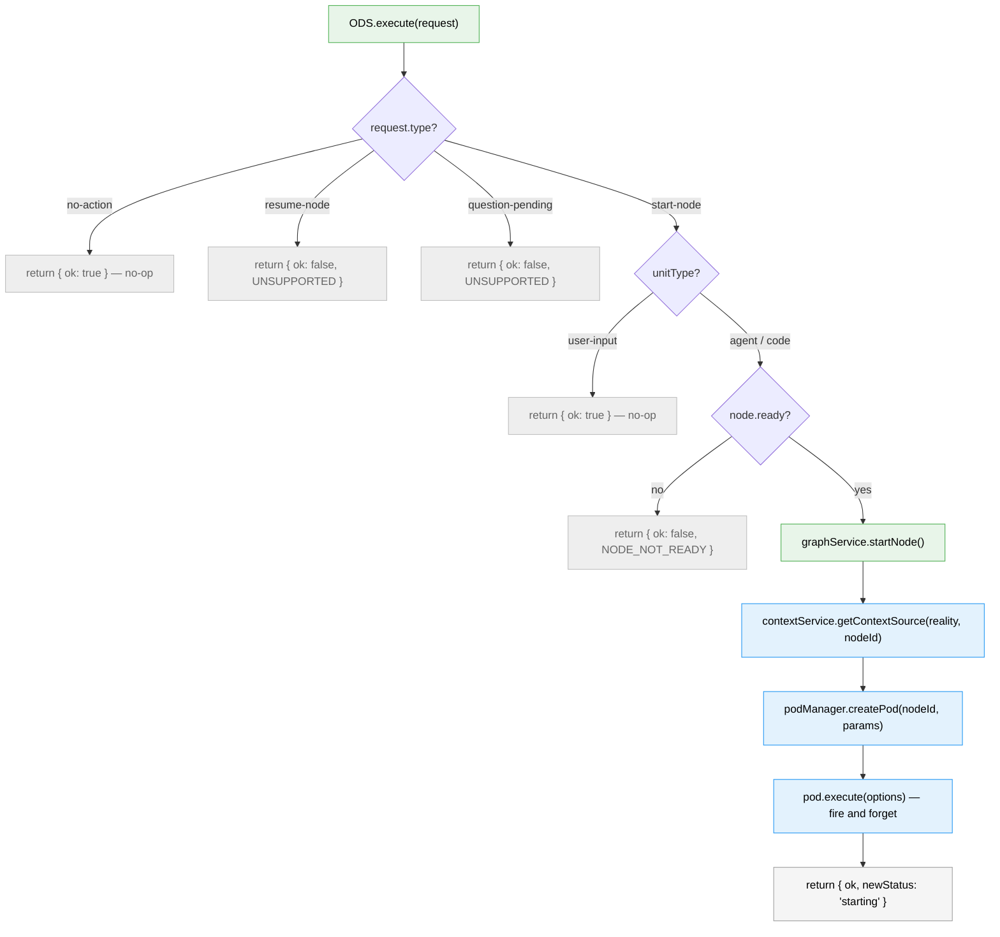
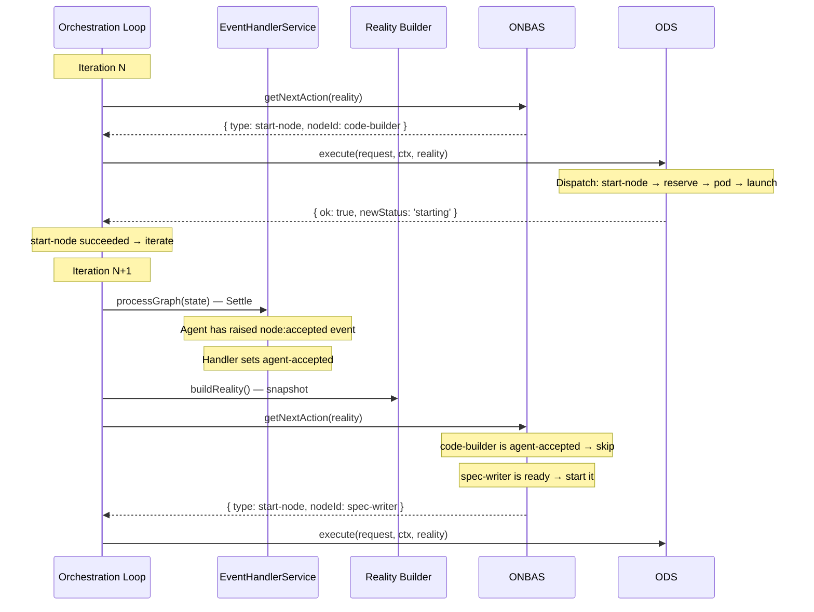

# Workshop 12: ODS — The Orchestration Dispatch Service

**Type**: Integration Pattern
**Plan**: 030-positional-orchestrator
**Spec**: [positional-orchestrator-spec.md](../positional-orchestrator-spec.md)
**Created**: 2026-02-09
**Status**: Draft
**Supersedes**: [Workshop 08: ODS Handover](08-ods-orchestrator-agent-handover.md) (entirely)

**Related Documents**:
- [Workshop 11: Phase 6 Alignment](11-phase-6-alignment.md) — DYK decisions, scope reconciliation
- [Workshop 10: Node Restart Event](10-node-restart-event.md) — `restart-pending` status, convention-based contract
- [Workshop 09: Concept Drift Remediation](09-concept-drift-remediation.md) — Two-domain boundary
- [Workshop 05: ONBAS](05-onbas.md) — Pure walk algorithm
- [Workshop 04: Work Unit Pods](04-work-unit-pods.md) — Pod lifecycle, IWorkUnitPod
- [Workshop 02: OrchestrationRequest](02-orchestration-request.md) — 4-variant union

---

## Purpose

Define the complete design of ODS (Orchestration Dispatch Service) for Phase 6 implementation. This workshop is the **single authoritative reference** for ODS — it incorporates all decisions from Workshops #8-#11, the concept drift remediation (Subtask 001), and the DYK alignment session. Workshop 08 is fully superseded; do not reference it for implementation decisions.

## Key Questions Addressed

- Q1: What is ODS's single responsibility?
- Q2: What interface does ODS expose?
- Q3: What does `handleStartNode` do, step by step?
- Q4: How does ODS handle user-input nodes?
- Q5: Why is ODS fire-and-forget (not blocking on pod execution)?
- Q6: What does FakeODS look like?
- Q7: How does ODS fit into the Settle → Decide → Act loop?
- Q8: What about `agentAcceptNode()` — who needs it, when?

---

## Part 1: What ODS Is

ODS is the **Act** step in the orchestration loop. Its job is simple:

> Given a decision from ONBAS, make it happen.

ONBAS says "start node X." ODS starts node X. That's it.

### What ODS Does

1. Receives an `OrchestrationRequest` from the orchestration loop
2. Dispatches on `request.type` — only `start-node` does real work
3. For `start-node` on agent/code nodes: reserves the node, creates a pod, resolves context, launches execution
4. For `start-node` on user-input nodes: no-op (user-input is a UI concern)
5. For `no-action`: no-op
6. Returns immediately — does NOT wait for the pod to finish

### What ODS Does NOT Do

| Concern | Who Owns It | Why Not ODS |
|---------|-------------|-------------|
| Decide what to start | ONBAS | ODS executes decisions, doesn't make them |
| Start/accept user-input nodes | UI / CLI | User-input data is provided before orchestration |
| Process events after agent runs | EHS (Settle phase) | Agent communicates via events; loop discovers results on next iteration |
| Detect agent failures | Future watchdog | ODS is fire-and-forget; it doesn't monitor execution |
| Surface questions to users | Web layer / UI | Question surfacing is a presentation concern |
| Emit SSE notifications | Future `ICentralEventNotifier` | Domain events are deferred |
| Manage pod lifecycle (destroy) | Future concern | ODS creates pods; cleanup is separate |
| Handle `resume-node` | Dead code | `node:restart` → `start-node` replaced it (Workshop 10) |
| Handle `question-pending` | Loop exit / dead code | Never reaches ODS; ONBAS won't produce it after Subtask 002 |

### The Mental Model

Think of ODS as **the ignition key, not the driver**. It turns the engine on. The agent drives. The orchestration loop checks the dashboard on each pass.

---

## Part 2: The IODS Interface

```typescript
/**
 * Orchestration Dispatch Service — executes ONBAS decisions.
 *
 * ODS receives the full OrchestrationRequest from ONBAS and dispatches
 * on request.type. Today only start-node does real work; the rest are
 * no-ops or defensive errors. Fire-and-forget for start-node: reserve
 * the node, launch the pod, return immediately.
 */
interface IODS {
  execute(
    request: OrchestrationRequest,
    ctx: WorkspaceContext,
    reality: PositionalGraphReality,
  ): Promise<OrchestrationExecuteResult>;
}
```

### Why `OrchestrationRequest` (The Full Union)

ODS is a general-purpose dispatcher. The orchestration loop gets an `OrchestrationRequest` from ONBAS and passes it straight to ODS — the loop doesn't inspect or narrow the type. ODS owns the dispatch table:

- `start-node` → real work (reserve, create pod, launch)
- `no-action` → return `{ ok: true }` (no-op)
- `resume-node` → defensive error (dead code — ONBAS never produces it)
- `question-pending` → defensive error (dead code after Subtask 002)

This keeps the loop simple (it just calls `ods.execute(request)`) and makes ODS the single owner of request-type dispatch logic.

### Constructor Dependencies

```typescript
interface ODSDependencies {
  readonly graphService: IPositionalGraphService;
  readonly podManager: IPodManager;
  readonly contextService: IAgentContextService;
}
```

Three dependencies. That's all.

| Dependency | What ODS Uses It For |
|------------|---------------------|
| `graphService` | `startNode()` to reserve the node |
| `podManager` | `createPod()` to create execution container |
| `contextService` | `getContextSource()` to resolve session inheritance |

**Removed from Workshop 08's design:**

| Removed | Why |
|---------|-----|
| `notifier: ICentralEventNotifier` | Domain events deferred — ODS is graph domain, notification is event domain |
| `buildReality: (...) => Promise<...>` | ODS is fire-and-forget — no post-execute state read |

---

## Part 3: The Dispatch Table

ODS receives the full `OrchestrationRequest` and dispatches on `request.type`. The dispatch table today has one active handler; the rest are no-ops or defensive errors.

### Flow Diagram



### Step-by-Step: Agent/Code Nodes

```
1. Look up node in reality
     → node = reality.nodes.get(request.nodeId)
     → Verify node exists (defensive — ONBAS already checked)

2. Check unitType
     → user-input → return { ok: true } (no-op — see below)
     → agent / code → continue

3. Check readiness
     → node.ready must be true
     → If not ready: return { ok: false, NODE_NOT_READY }
     → ODS validates this itself — does not blindly trust ONBAS

4. Reserve the node
     → graphService.startNode(ctx, graphSlug, nodeId)
     → Transitions: pending → starting  OR  restart-pending → starting
     → If fails (wrong status): return { ok: false, error }

5. Resolve context (agents only)
     → contextService.getContextSource(reality, nodeId)
     → Result: 'inherit' (fromNodeId → look up session) or 'new' (no session)
     → If inherit: contextSessionId = podManager.getSessionId(fromNodeId)

6. Create pod
     → podManager.createPod(nodeId, { unitType, unitSlug, adapter/runner })
     → For agents: adapter comes from DI (IAgentAdapter)
     → For code: runner comes from DI (IScriptRunner)
     → PodManager reuses existing pod if one is active

7. Launch pod — FIRE AND FORGET
     → pod.execute({ inputs: request.inputs, contextSessionId, ctx, graphSlug })
     → DO NOT await the result
     → The agent communicates through events (node:accepted, question:ask, etc.)
     → The loop discovers what happened on the next iteration via Settle

8. Return immediately
     → { ok: true, request, newStatus: 'starting' }
```

### User-Input Nodes Are a No-Op

User-input nodes hold data that users provide through the UI or CLI **before orchestration runs**. By the time ONBAS walks the graph, user-input nodes should already be in a terminal state (their data is saved, they're effectively complete). ODS does not start, reserve, or accept user-input nodes — that's a UI/CLI concern, not an orchestration concern. If ONBAS somehow produces `start-node` for a user-input node, ODS returns `{ ok: true }` and moves on.

---

## Part 4: What Happens After ODS Returns

ODS returns. The orchestration loop continues. On the next iteration:



The key insight: **the agent communicates through events**. When the agent calls CLI commands (`cg wf node start`, `cg wf node ask`, etc.), those commands raise events (`node:accepted`, `question:ask`, etc.). The Settle phase on the next loop iteration processes those events into state changes. ONBAS then reads the settled state and decides what to do next.

ODS never needs to know what the agent did. It just starts things.

---

## Part 5: Agent Acceptance Is Not an ODS Concern

ODS does **not** handle agent acceptance. The agent accepts itself by raising a `node:accepted` event through the CLI (`cg wf node start`). The Settle phase on the next loop iteration processes that event into the `agent-accepted` status.

This is consistent with the two-domain boundary: the agent communicates through events, the event system records state changes, and the orchestration loop discovers results via Settle. ODS never needs to know whether the agent accepted — it just starts things.

`agentAcceptNode()` as a service method is an agent CLI concern, not a Phase 6 deliverable.

---

## Part 6: Error Handling

ODS is deliberately simple about errors. There are exactly three failure modes:

### 1. Node Not Ready

ODS checks `node.ready` before attempting to start the node. If the node isn't ready (inputs unresolved, preceding lines incomplete, etc.), ODS returns an error without calling `startNode()`.

```typescript
if (!node.ready) {
  return {
    ok: false,
    error: { code: 'NODE_NOT_READY', message: `Node ${nodeId} is not ready`, nodeId },
    request,
  };
}
```

### 2. `startNode()` Fails

The node isn't in a valid starting state (`pending` or `restart-pending`). This shouldn't happen if the readiness check passed, but races or bugs could cause it.

```typescript
const startResult = await this.deps.graphService.startNode(ctx, graphSlug, nodeId);
if (startResult.errors.length > 0) {
  return {
    ok: false,
    error: {
      code: 'START_NODE_FAILED',
      message: startResult.errors[0].message,
      nodeId,
    },
    request,
  };
}
```

### 3. Pod Creation Fails

PodManager can't create the pod (invalid unit type, adapter not available, etc.).

```typescript
try {
  const pod = this.deps.podManager.createPod(nodeId, params);
} catch (err) {
  return {
    ok: false,
    error: {
      code: 'POD_CREATION_FAILED',
      message: err instanceof Error ? err.message : 'Unknown error',
      nodeId,
    },
    request,
  };
}
```

### What About Pod Execution Errors?

ODS doesn't care. If the pod throws, the agent's process handles it. If the agent raises a `node:error` event, the Settle phase processes it. If the agent crashes silently, a future watchdog detects stale `starting` or `agent-accepted` nodes. None of this is ODS's problem.

---

## Part 7: FakeODS

```typescript
interface FakeODSCall {
  request: OrchestrationRequest;
  ctx: WorkspaceContext;
  reality: PositionalGraphReality;
}

class FakeODS implements IODS {
  private calls: FakeODSCall[] = [];
  private nextResult: OrchestrationExecuteResult | undefined;

  // ── Test Helpers ────────────────────────
  getHistory(): readonly FakeODSCall[] { return this.calls; }
  setNextResult(result: OrchestrationExecuteResult): void { this.nextResult = result; }
  reset(): void { this.calls = []; this.nextResult = undefined; }

  // ── Interface ───────────────────────────
  async execute(
    request: OrchestrationRequest,
    ctx: WorkspaceContext,
    reality: PositionalGraphReality,
  ): Promise<OrchestrationExecuteResult> {
    this.calls.push({ request, ctx, reality });

    if (this.nextResult) {
      const result = this.nextResult;
      this.nextResult = undefined;
      return result;
    }

    // Default: success for start-node, no-op for others
    return { ok: true, request, newStatus: request.type === 'start-node' ? 'starting' : undefined };
  }
}
```

### What FakeODS Tests Verify

Phase 7 (orchestration loop) will use FakeODS to test the loop's behavior:
- Loop calls ODS with the request from ONBAS
- Loop handles ODS success (continues iterating)
- Loop handles ODS failure (stops with error)
- Loop passes correct reality and context

### What FakeODS Does NOT Need

- `onExecute` callback (Workshop 08 required this — ODS is now fire-and-forget)
- Pod simulation (real ODS tests use FakePodManager, not FakeODS)
- State mutation (FakeODS records calls, it doesn't change graph state)

---

## Part 8: Real ODS Implementation Sketch

```typescript
class ODS implements IODS {
  constructor(private readonly deps: ODSDependencies) {}

  async execute(
    request: OrchestrationRequest,
    ctx: WorkspaceContext,
    reality: PositionalGraphReality,
  ): Promise<OrchestrationExecuteResult> {
    // ── Dispatch on request type ──────────────────────
    switch (request.type) {
      case 'start-node':
        return this.handleStartNode(request, ctx, reality);

      case 'no-action':
        return { ok: true, request };

      case 'resume-node':
      case 'question-pending':
        // Dead code — ONBAS never produces these after Subtask 002
        return {
          ok: false,
          error: { code: 'UNSUPPORTED_REQUEST_TYPE', message: `ODS does not handle '${request.type}'` },
          request,
        };

      default: {
        const _exhaustive: never = request;
        return {
          ok: false,
          error: { code: 'UNKNOWN_REQUEST_TYPE', message: `Unknown request type` },
          request: _exhaustive,
        };
      }
    }
  }

  private async handleStartNode(
    request: StartNodeRequest,
    ctx: WorkspaceContext,
    reality: PositionalGraphReality,
  ): Promise<OrchestrationExecuteResult> {
    const node = reality.nodes.get(request.nodeId);
    if (!node) {
      return {
        ok: false,
        error: { code: 'NODE_NOT_FOUND', message: `Node ${request.nodeId} not in reality`, nodeId: request.nodeId },
        request,
      };
    }

    // User-input nodes are a UI concern — ODS does not start them
    if (node.unitType === 'user-input') {
      return { ok: true, request };
    }

    // ODS validates readiness itself — does not blindly trust ONBAS
    if (!node.ready) {
      return {
        ok: false,
        error: { code: 'NODE_NOT_READY', message: `Node ${request.nodeId} is not ready`, nodeId: request.nodeId },
        request,
      };
    }

    return this.handleAgentOrCode(request, ctx, reality, node);
  }

  private async handleAgentOrCode(
    request: StartNodeRequest,
    ctx: WorkspaceContext,
    reality: PositionalGraphReality,
    node: NodeReality,
  ): Promise<OrchestrationExecuteResult> {
    // 1. Reserve
    const startResult = await this.deps.graphService.startNode(ctx, request.graphSlug, node.nodeId);
    if (startResult.errors.length > 0) {
      return { ok: false, error: { code: 'START_NODE_FAILED', message: startResult.errors[0].message, nodeId: node.nodeId }, request };
    }

    // 2. Resolve context
    const contextResult = this.deps.contextService.getContextSource(reality, node.nodeId);
    let contextSessionId: string | undefined;
    if (contextResult.source === 'inherit') {
      contextSessionId = this.deps.podManager.getSessionId(contextResult.fromNodeId);
    }

    // 3. Create pod
    const params = this.buildPodParams(node);
    const pod = this.deps.podManager.createPod(node.nodeId, params);

    // 4. Fire and forget
    pod.execute({
      inputs: request.inputs,
      contextSessionId,
      ctx: { worktreePath: ctx.worktreePath },
      graphSlug: request.graphSlug,
    });
    // NOT awaited — agent communicates through events

    return { ok: true, request, newStatus: 'starting', sessionId: pod.sessionId };
  }
}
```

This is a sketch — the real implementation will follow TDD (interface → fake → tests → implementation → contract tests).

---

## Part 9: The Settle → Decide → Act Contract

ODS exists within a loop that Phase 7 will implement. Here's how they interact:

```
┌──────────────────────────────────────────────────┐
│              Orchestration Loop                    │
│                                                    │
│  ┌─── SETTLE ───┐                                 │
│  │ EHS.process   │  Events → state changes         │
│  │ Graph()       │  (agent-accepted, error, etc.)  │
│  └──────┬────────┘                                 │
│         ▼                                          │
│  ┌─── DECIDE ───┐                                  │
│  │ buildReality  │  Snapshot the settled state      │
│  │ ONBAS.get     │  Walk graph, pick next action    │
│  │ NextAction()  │  Returns OrchestrationRequest    │
│  └──────┬────────┘                                 │
│         ▼                                          │
│  ┌─── ACT ──────┐                                  │
│  │ ODS.execute   │  Dispatches on request.type      │
│  │ (full OR)     │  start-node: launch pod + return │
│  │               │  no-action: return (no-op)       │
│  └──────┬────────┘                                 │
│         ▼                                          │
│  ┌─── CONTINUE? ┐                                  │
│  │ Loop checks   │  no-action → exit loop           │
│  │ ODS result    │  start-node ok → iterate again   │
│  └───────────────┘                                 │
└──────────────────────────────────────────────────┘
```

### What ODS Checks (Pre-Conditions)

1. **Node exists in reality**: ODS looks up `reality.nodes.get(request.nodeId)` and returns an error if missing
2. **Node is ready**: ODS checks `node.ready === true` before proceeding — does NOT blindly trust ONBAS
3. **Reality is a recent snapshot**: Built after Settle, before ODS runs
4. **`request.inputs` are populated**: ONBAS resolved them from the reality's inputPack
5. **PodManager sessions are loaded**: The loop loaded them before the first iteration
6. **`graphSlug` is correct**: Comes from the per-graph orchestration handle

### What ODS Guarantees (Post-Conditions)

1. **Node is reserved** (`starting`) OR error is returned
2. **Pod is created and launched** (agent/code) OR no-op returned (user-input) OR error is returned
3. **Return is immediate** — ODS does not block on pod execution
4. **No side effects beyond startNode/createPod/execute**: No event emission, no notification, no state reads

---

## Part 10: State Transitions Owned by Each Actor

This table shows who owns each transition in the system. ODS owns exactly two (via service method calls):

```
Actor               Transition                        Via
─────────────────── ───────────────────────────────── ──────────────────────────
ODS                 pending → starting                 graphService.startNode()
ODS                 restart-pending → starting         graphService.startNode()

Agent (via CLI)     starting → agent-accepted          node:accepted event
Agent (via CLI)     agent-accepted → waiting-question  question:ask event
Agent (via CLI)     * → complete                       node:completed event
Agent (via CLI)     * → blocked-error                  node:error event

UI / CLI            user-input lifecycle               Outside orchestration

Event System        waiting-question → restart-pending node:restart event
Event System        blocked-error → restart-pending    node:restart event

Reality Builder     restart-pending → ready            Computed (not stored)
Reality Builder     pending → ready                    Computed (not stored)
```

ODS is responsible for the **reservation** (`startNode()`) only. Everything else belongs to the event system, the agent, or the UI.

---

## Part 11: What Workshop 08 Got Wrong

For posterity, here's what Workshop 08 designed that we've since learned is incorrect:

| Workshop 08 Design | Why It's Wrong | What Replaced It |
|--------------------|---------------|-----------------|
| ODS blocks on `pod.execute()` | Events + Settle handle post-execution; blocking ties up the loop | Fire-and-forget (Workshop 11 DYK #5) |
| 5-way post-execute switch | No post-execute state read exists | Deleted entirely |
| `buildReality` as ODS dependency | ODS doesn't read state after execution | Removed (Workshop 11) |
| `notifier` as ODS dependency | Notification is event domain, not graph domain | Deferred |
| `handleResumeNode` handler | `node:restart` makes `resume-node` dead code | Not implemented (Workshop 10/11 DYK #1) |
| `handleQuestionPending` handler | Loop exits before ODS; ONBAS won't produce it | Not implemented (Workshop 11 DYK #2) |
| FakePod `onExecute` callback | ODS doesn't read pod results | Not needed (Workshop 11 DYK #5) |
| `failNode()` service method | Error detection is a watchdog concern | Deferred (Workshop 11 DYK #5) |
| ODS calls `surfaceQuestion()` | Question surfacing is a web-layer concern | Out of scope |
| ODS calls `pod.destroyPod()` | Pod cleanup is a lifecycle concern | Out of scope |
| ODS starts + accepts user-input nodes | User-input is a UI concern, not orchestration | No-op in ODS |

The fundamental mistake was treating ODS as a **supervisor** (start work, wait, react to results). The correct model is ODS as a **launcher** (start work, return, let the loop discover results via events).

---

## Part 12: Implementation Checklist (Phase 6 Scope)

| # | What | Files | Notes |
|---|------|-------|-------|
| 1 | `IODS` interface | `ods.types.ts` (new) | Dispatch-table pattern, `OrchestrationRequest` input |
| 2 | `FakeODS` test double | `fake-ods.ts` (new) | Call history + configurable results |
| 3 | `handleStartNode` (agent/code) | `ods.ts` (new) | Reserve → resolve context → create pod → launch |
| 4 | User-input no-op branch | `ods.ts` (new) | Return `{ ok: true }` — user-input is a UI concern |
| 5 | Input wiring through ODS | `ods.ts` | `request.inputs` → `pod.execute({ inputs })` |
| 6 | Unit tests | `test/unit/positional-graph/` | TDD: RED → GREEN → REFACTOR |

### What Is NOT In Phase 6

- Orchestration loop (`IGraphOrchestration.run()`) — Phase 7
- `handleResumeNode` — dead code, not implemented
- `handleQuestionPending` — dead code, not implemented
- Post-execute state read — not ODS's job
- `failNode()` — deferred, watchdog concern
- `surfaceQuestion()` — deferred, web-layer concern
- `ICentralEventNotifier` — deferred, domain events
- Stale node detection — deferred, monitoring concern
- `PodOutcome: 'question'` cleanup — deferred, dead code

---

## Part 13: Open Questions

### OQ-1: Should the interface accept `OrchestrationRequest` or a narrower type?

**RESOLVED**: `OrchestrationRequest`. ODS is a general-purpose dispatcher — the loop passes the full ONBAS output straight through without inspecting the type. ODS dispatches on `request.type` internally. This keeps the loop simple and makes ODS the single owner of request-type dispatch logic.

### OQ-2: How does ODS get the adapter/runner for pod creation?

**RESOLVED**: ODS receives the adapter/runner through its constructor dependencies or through a factory pattern. The exact mechanism depends on how agents are wired (Plan 019 IAgentAdapter). For Phase 6 tests, FakeAgentAdapter and FakeScriptRunner are used. The real wiring is deferred to production integration.

### OQ-3: Should `pod.execute()` be called without `await`?

**RESOLVED**: Yes. The fire-and-forget model means ODS calls `pod.execute()` and does not await the returned Promise. In tests with FakePod, `execute()` resolves immediately so there's no unhandled promise concern. In production, the agent process runs independently. If we need to track the Promise for cleanup, that's a lifecycle concern handled outside ODS.

### OQ-4: Does `agentAcceptNode()` need to exist for Phase 6?

**RESOLVED**: No. `agentAcceptNode()` is an agent CLI concern — the agent raises a `node:accepted` event through `cg wf node start`. ODS never calls it. Phase 6 does not implement this method; it belongs to the CLI/agent layer.

### OQ-5: What if `startNode()` succeeds but pod creation fails?

**RESOLVED**: The node is now `starting` with no pod running — an orphan. ODS returns `{ ok: false, error }`. The orchestration loop can log the error. A future watchdog would detect the stale `starting` node. For Phase 6, this is an edge case that we log but don't automatically recover from.

---

## Summary

| Aspect | ODS Design |
|--------|-----------|
| **Role** | Execute ONBAS decisions — start nodes, launch pods |
| **Input** | `OrchestrationRequest` — dispatches on `request.type`; only `start-node` does real work today |
| **Execution model** | Fire-and-forget: reserve, launch, return immediately |
| **Dependencies** | 3: graphService, podManager, contextService |
| **Handlers** | 1 active: `handleStartNode` (agent/code launch; user-input no-op) |
| **State transitions owned** | `pending/restart-pending → starting` (reservation only) |
| **Error strategy** | Return `{ ok: false, error }` — loop handles it; no automatic recovery |
| **Post-execution** | None — loop discovers agent results via Settle on next iteration |
| **Testing** | FakeODS for loop tests; real ODS tested with FakePodManager + FakeGraphService |
