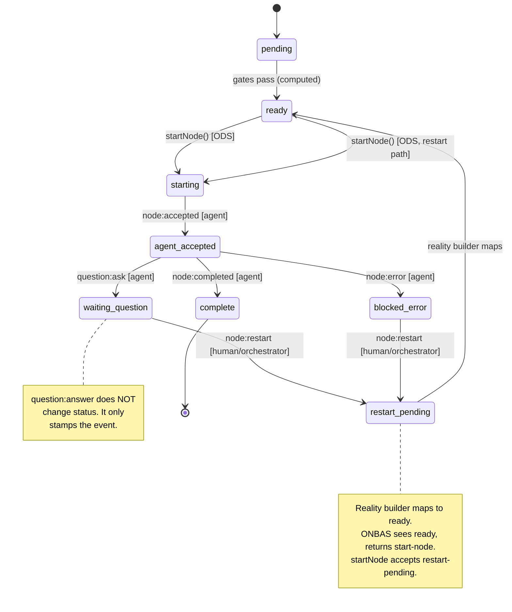

# Workshop 14: Worked Example Upgrade

**Type**: Integration Pattern
**Plan**: 030-positional-orchestrator
**Spec**: [positional-orchestrator-spec.md](../positional-orchestrator-spec.md)
**Created**: 2026-02-10
**Status**: Draft

**Related Documents**:
- [Workshop 09: Concept Drift Remediation](./09-concept-drift-remediation.md)
- [Workshop 10: Node Restart Event](./10-node-restart-event.md)
- [Workshop 11: Phase 6 Alignment](./11-phase-6-alignment.md)
- [Workshop 12: ODS Design](./12-ods-design.md)
- [Workshop 13: Phase 8 E2E Design](./13-phase-8-e2e-design.md)
- [Current worked example](../tasks/phase-8-e2e-and-integration-testing/examples/worked-example.ts)
- [Current walkthrough](../tasks/phase-8-e2e-and-integration-testing/examples/worked-example.walkthrough.md)

---

## Purpose

The current worked example demonstrates the settle-decide-act loop with a 2-node serial graph — the happy path only. A gap analysis against Workshops 09-13 revealed 8 high/medium gaps: no question lifecycle, no restart, no parallel execution, no manual transitions, no user-input/code nodes, no input wiring, no event stamp visibility, and no processGraph transparency. This workshop designs the upgrade that closes those gaps while preserving the progressive, teaching-oriented structure that makes the current example valuable.

## Key Questions Addressed

- How should the graph fixture expand to exercise all orchestration patterns?
- What is the exact event sequence for question/answer/restart?
- How should parallel execution and manual transitions be demonstrated?
- How do we make multi-subscriber event stamps visible without CLI subprocesses?
- What is the right balance between completeness and readability?

---

## Part 1: Current State Assessment

### What the Current Example Covers

| Pattern | Status | Notes |
|---------|--------|-------|
| Stack wiring (7 collaborators) | Covered | Real/fake boundary correct |
| Serial agent execution | Covered | researcher -> writer |
| Settle-Decide-Act loop | Covered | 3 run() calls |
| Fire-and-forget ODS | Covered | FakeAgentAdapter resolves immediately |
| Graph-complete detection | Covered | stopReason, reality inspection |
| `raiseNodeEvent()` vs `nes.raise()` | Covered | Walkthrough explains the distinction |
| Two event system instances | Covered | Walkthrough describes, not demonstrated in code |

### What's Missing (High + Medium Gaps)

| # | Gap | Severity | Source |
|---|-----|----------|--------|
| G1 | Question/answer lifecycle | High | W09, W10, W13 |
| G2 | `node:restart` and `restart-pending` | High | W10 |
| G3 | Only 2 of 6+ event types exercised | High | W13 (030), W13 (032) |
| G4 | No parallel execution | Medium | W13 (030) |
| G5 | No manual transition gate | Medium | W13 (030) |
| G6 | No user-input or code node types | Medium | W11, W12 |
| G7 | No input wiring | Medium | W13 (030) |
| G8 | Event stamps not visible in code | Medium | W13 (030), W13 (032) |
| G9 | `processGraph()` settlement invisible | Medium | W13 (032) |
| G10 | `restart-pending -> starting` ODS path | Medium | W12 |

---

## Part 2: Design Decision — Structure

### D1: Extend the Existing Example vs. New File

**Decision**: Create a **new file** (`worked-example-full.ts`) alongside the existing one. The current 2-node example remains as the "quick start" introduction. The new file is the comprehensive demonstration.

**Rationale**:
- The current example's value is its simplicity — 300 lines, 7 sections, easy to follow
- Adding 6 more patterns would triple the size, destroying readability
- Two examples serve different audiences: quick orientation vs. deep understanding
- The walkthrough document can reference both

### D2: All In-Process (No CLI Subprocesses)

**Decision**: Stay fully in-process using `service.raiseNodeEvent()`.

**Rationale**:
- The worked example is a teaching artifact, not the E2E test
- The E2E test (`test/e2e/positional-graph-orchestration-e2e.ts`) already validates the hybrid CLI path
- In-process calls exercise the same code path as CLI commands (both call `raiseNodeEvent()`)
- Removing the CLI dependency makes the example runnable anywhere without building the CLI first

### D3: Section-Based Progressive Narrative

**Decision**: Use numbered sections (like the current example) rather than the act-based structure from the E2E test. Each section introduces one new pattern, building on the previous sections.

---

## Part 3: Graph Fixture Design

### The Upgraded Graph

```
Line 0 (auto):     [get-spec]         user-input node
                        |
Line 1 (manual):   [researcher] ----> [reviewer]     serial agents
                        |
                   (manual gate)
                        |
Line 2 (auto):     [coder]       ----> [tester]      agent + code node
                        |                  |
                   (asks question)    (FakeScriptRunner)
                        |
Line 3 (auto):     [par-a]  [par-b]  [final]         parallel + serial successor
```

**4 lines, 8 nodes** — matches the E2E test's scope:

| Line | Transition | Nodes | Patterns Exercised |
|------|-----------|-------|--------------------|
| 0 | auto | get-spec (user-input) | G6: user-input type |
| 1 | manual | researcher (agent), reviewer (agent) | G5: manual gate, G7: input wiring |
| 2 | auto | coder (agent), tester (code) | G1: question, G2: restart, G6: code type |
| 3 | auto | par-a (agent, parallel), par-b (agent, parallel), final (agent, serial) | G4: parallel execution |

### Input Wirings (5 connections)

```
get-spec.spec         -> researcher.spec           (cross-line, user-input to agent)
researcher.research   -> reviewer.research         (same-line serial)
researcher.research   -> coder.research            (cross-line)
coder.code            -> tester.code               (same-line, agent to code)
coder.code            -> par-a.code                (cross-line fan-out)
```

### Work Unit Definitions (Inline)

The example creates minimal work unit YAML files in the temp directory. Each unit declares inputs and outputs matching the wiring above:

```typescript
const units = {
  'get-spec': {
    slug: 'get-spec', type: 'user-input', inputs: [],
    outputs: [{ name: 'spec', type: 'data', data_type: 'text', required: true }],
  },
  'researcher': {
    slug: 'researcher', type: 'agent',
    inputs: [{ name: 'spec', type: 'data', data_type: 'text', required: true }],
    outputs: [{ name: 'research', type: 'data', data_type: 'text', required: true }],
  },
  'reviewer': {
    slug: 'reviewer', type: 'agent',
    inputs: [{ name: 'research', type: 'data', data_type: 'text', required: true }],
    outputs: [{ name: 'review', type: 'data', data_type: 'text', required: true }],
  },
  'coder': {
    slug: 'coder', type: 'agent',
    inputs: [{ name: 'research', type: 'data', data_type: 'text', required: true }],
    outputs: [{ name: 'code', type: 'data', data_type: 'text', required: true }],
  },
  'tester': {
    slug: 'tester', type: 'code',
    inputs: [{ name: 'code', type: 'data', data_type: 'text', required: true }],
    outputs: [{ name: 'test_results', type: 'data', data_type: 'text', required: true }],
  },
  'par-a': {
    slug: 'par-a', type: 'agent',
    inputs: [{ name: 'code', type: 'data', data_type: 'text', required: true }],
    outputs: [{ name: 'result_a', type: 'data', data_type: 'text', required: true }],
  },
  'par-b': {
    slug: 'par-b', type: 'agent', inputs: [], outputs: [
      { name: 'result_b', type: 'data', data_type: 'text', required: true },
    ],
  },
  'final': {
    slug: 'final', type: 'agent', inputs: [], outputs: [],
  },
};
```

---

## Part 4: Section-by-Section Design

### Section 1: Wire the Full Stack (same as current)

No changes needed. The existing wiring code already creates the complete orchestration stack with real services + FakeAgentAdapter + FakeScriptRunner.

**Addition**: Also create a `FakeNodeEventRegistry` with `registerCoreEventTypes()` — already present in the current example.

### Section 2: Create the Graph Fixture

**New**: Replaces the current 1-line, 2-node setup with the 4-line, 8-node graph described above.

```typescript
// Create graph
const SLUG = 'full-example';
await service.create(ctx, SLUG);

// Line 0: user-input (auto transition, created by service.create)
const line0Id = /* from create result */;
const getSpec = await service.addNode(ctx, SLUG, line0Id, 'get-spec');

// Line 1: serial agents (manual transition gates line 2)
const line1 = await service.addLine(ctx, SLUG, {
  orchestratorSettings: { transition: 'manual' },
});
const researcher = await service.addNode(ctx, SLUG, line1.lineId, 'researcher');
const reviewer = await service.addNode(ctx, SLUG, line1.lineId, 'reviewer');

// Line 2: agent + code (auto)
const line2 = await service.addLine(ctx, SLUG);
const coder = await service.addNode(ctx, SLUG, line2.lineId, 'coder');
const tester = await service.addNode(ctx, SLUG, line2.lineId, 'tester');

// Line 3: parallel pair + serial successor
const line3 = await service.addLine(ctx, SLUG);
const parA = await service.addNode(ctx, SLUG, line3.lineId, 'par-a', {
  orchestratorSettings: { execution: 'parallel' },
});
const parB = await service.addNode(ctx, SLUG, line3.lineId, 'par-b', {
  orchestratorSettings: { execution: 'parallel' },
});
const final = await service.addNode(ctx, SLUG, line3.lineId, 'final');

// Wire inputs (5 connections)
await service.setInput(ctx, SLUG, researcherId, 'spec', {
  from_node: getSpecId, from_output: 'spec',
});
await service.setInput(ctx, SLUG, reviewerId, 'research', {
  from_node: researcherId, from_output: 'research',
});
await service.setInput(ctx, SLUG, coderId, 'research', {
  from_node: researcherId, from_output: 'research',
});
await service.setInput(ctx, SLUG, testerId, 'code', {
  from_node: coderId, from_output: 'code',
});
await service.setInput(ctx, SLUG, parAId, 'code', {
  from_node: coderId, from_output: 'code',
});
```

**Console output**: Graph topology diagram, node IDs, wiring summary.

### Section 3: User-Input Node (G6 — user-input type)

**Demonstrates**: ONBAS skips user-input nodes, user completes via service API.

```typescript
// run() does NOT start get-spec — ONBAS skips user-input nodes
const run1 = await handle.run();
// stopReason = 'no-action' (all-waiting — user-input is ready but ONBAS skips it)

// User completes get-spec manually (simulating CLI: start, accept, save-output, end)
await service.startNode(ctx, SLUG, getSpecId);
await service.raiseNodeEvent(ctx, SLUG, getSpecId, 'node:accepted', {}, 'agent');
// Save output data so downstream wiring resolves
await service.saveNodeOutputData(ctx, SLUG, getSpecId, 'spec', 'Build a TODO app');
await service.raiseNodeEvent(
  ctx, SLUG, getSpecId, 'node:completed', { message: 'User provided spec' }, 'agent'
);
```

**Key insight to log**: The difference between `ready` (computed from gates) and "ONBAS will start it" — user-input nodes are `ready` but ONBAS returns `null` for them.

### Section 4: Serial Agents + Input Wiring (G7)

**Demonstrates**: Orchestrator starts researcher (input wiring from get-spec resolves), researcher completes, reviewer starts as serial successor with inherited input.

```typescript
// run() starts researcher (spec input from get-spec is now available)
const run2 = await handle.run();
// 1 action: start-node(researcher)

// Complete researcher
await service.raiseNodeEvent(ctx, SLUG, researcherId, 'node:accepted', {}, 'agent');
await service.saveNodeOutputData(ctx, SLUG, researcherId, 'research', 'Research findings...');
await service.raiseNodeEvent(
  ctx, SLUG, researcherId, 'node:completed', { message: 'Research done' }, 'agent'
);

// run() starts reviewer (research input from researcher resolves)
const run3 = await handle.run();
// 1 action: start-node(reviewer)
```

**Key insight to log**: Input wiring feeds into Gate 4 of `canRun()`. The reviewer cannot become `ready` until the researcher's output data is persisted.

### Section 5: Manual Transition Gate (G5)

**Demonstrates**: Line 1 complete, but line 2 blocked by manual transition on line 1.

```typescript
// Complete reviewer
await service.raiseNodeEvent(ctx, SLUG, reviewerId, 'node:accepted', {}, 'agent');
await service.saveNodeOutputData(ctx, SLUG, reviewerId, 'review', 'Looks good');
await service.raiseNodeEvent(
  ctx, SLUG, reviewerId, 'node:completed', { message: 'Review done' }, 'agent'
);

// run() returns no-action — line 2 blocked by manual transition on line 1
const run4 = await handle.run();
// stopReason = 'no-action', reason likely 'transition-blocked'

// Trigger the manual transition
await service.triggerTransition(ctx, SLUG, line1Id);

// run() now starts coder on line 2
const run5 = await handle.run();
// 1 action: start-node(coder)
```

**Key insight to log**: The `transition: 'manual'` on line N gates entry to line N+1. ONBAS walks lines in order and returns `no-action` with reason `transition-blocked` immediately when it hits a closed gate.

### Section 6: Question/Answer/Restart Lifecycle (G1, G2, G3, G8, G9, G10)

This is the largest section — it exercises the most complex pattern in the system.

**Demonstrates**: The full 8-step mega-lifecycle from Workshop 10.

```typescript
// Coder accepts and starts working
await service.raiseNodeEvent(ctx, SLUG, coderId, 'node:accepted', {}, 'agent');

// ── Step 1: Agent asks a question ──
// question:ask requires agent-accepted, transitions to waiting-question
await service.raiseNodeEvent(ctx, SLUG, coderId, 'question:ask', {
  question_id: 'q-001',
  type: 'text',
  text: 'Should I use TypeScript or JavaScript?',
}, 'agent');

// ── Step 2: Orchestration loop observes waiting-question ──
const run6 = await handle.run();
// stopReason = 'no-action' (all-waiting — coder is waiting-question)

// ── Step 3: Inspect settlement results (G9) ──
// Load state and call processGraph explicitly to see what happened
const stateBeforeAnswer = await service.loadGraphState(ctx, SLUG);
const settleResult1 = ehs.processGraph(stateBeforeAnswer, 'example-verifier', 'cli');
await service.persistGraphState(ctx, SLUG, stateBeforeAnswer);
// settleResult1.eventsProcessed shows how many events were newly stamped
// for subscriber 'example-verifier'

// ── Step 4: Inspect event stamps (G8) ──
const coderEvents = stateBeforeAnswer.nodes?.[coderId]?.events ?? [];
// Each event now has stamps from both 'cli' (inline) and 'orchestrator' (from run())
// and 'example-verifier' (from our explicit processGraph above)

// ── Step 5: Human answers the question ──
// question:answer requires waiting-question, does NOT transition status
const askEventId = coderEvents.find(
  e => e.event_type === 'question:ask'
)?.event_id;
await service.raiseNodeEvent(ctx, SLUG, coderId, 'question:answer', {
  question_event_id: askEventId,
  answer: 'Use TypeScript',
}, 'human');
// Node is STILL waiting-question — answer does not change status

// ── Step 6: Raise node:restart ──
// node:restart requires waiting-question, transitions to restart-pending
await service.raiseNodeEvent(ctx, SLUG, coderId, 'node:restart', {
  reason: 'Question answered',
}, 'orchestrator');
// Node is now restart-pending on disk

// ── Step 7: Orchestration loop restarts the node (G10) ──
const run7 = await handle.run();
// Reality builder maps restart-pending -> ready
// ONBAS sees ready, returns start-node
// ODS calls startNode(restart-pending -> starting)
// 1 action: start-node(coder)

// ── Step 8: Agent re-accepts and completes ──
await service.raiseNodeEvent(ctx, SLUG, coderId, 'node:accepted', {}, 'agent');
await service.saveNodeOutputData(ctx, SLUG, coderId, 'code', 'console.log("Hello")');
await service.raiseNodeEvent(
  ctx, SLUG, coderId, 'node:completed', { message: 'Code written' }, 'agent'
);
```

**Console output for this section**:

```
━━━ Section 6: Question/Answer/Restart ━━━
→ Coder accepted, status: agent-accepted
→ Raised question:ask (q-001: "Should I use TypeScript or JavaScript?")
→ Coder status: waiting-question
→ run() returned: no-action (all-waiting)

→ Settlement inspection (subscriber='example-verifier'):
    nodesVisited=8  eventsProcessed=5  handlerInvocations=5

→ Event stamps for coder (6 events):
    EVENT ID             TYPE                  SOURCE        STAMPS
    evt_xxxx             node:accepted         agent         cli, orchestrator, example-verifier
    evt_xxxx             question:ask          agent         cli, orchestrator, example-verifier
    evt_xxxx             question:answer       human         cli
    evt_xxxx             node:restart          orchestrator  cli
    evt_xxxx             node:accepted         agent         cli
    evt_xxxx             node:completed        agent         cli

→ Answered question (answer: "Use TypeScript")
→ Coder status: still waiting-question (answer does NOT transition)

→ Raised node:restart (reason: "Question answered")
→ Coder status: restart-pending
→ pending_question_id: cleared

→ run() returned: 1 action (start-node for coder)
→ ODS: restart-pending -> starting (same startNode path, accepts restart-pending)

→ Coder re-accepted, completed with code output
```

**Key insights to log**:
1. `question:answer` does NOT change node status — this is by design (Workshop 09: "graph-domain decisions belong to ONBAS/ODS")
2. The restart is a 3-layer convention: handler sets `restart-pending`, reality builder maps to `ready`, `startNode()` accepts `restart-pending` as valid from-state
3. All 6 event types exercised in this section alone: `node:accepted`, `question:ask`, `question:answer`, `node:restart`, `node:accepted` (again), `node:completed`
4. Multi-subscriber stamps are visible: `'cli'` (from `raiseNodeEvent` inline settlement), `'orchestrator'` (from `handle.run()` settle phase), `'example-verifier'` (from our explicit `processGraph`)

### Section 7: Code Node (G6 — code type)

**Demonstrates**: Tester (type=code) starts as serial successor to coder, uses FakeScriptRunner.

```typescript
// run() starts tester (code input from coder resolves)
const run8 = await handle.run();
// 1 action: start-node(tester)
// ODS: unitType='code', creates CodePod with FakeScriptRunner (not AgentPod)

// Complete tester via events (same lifecycle, different pod type)
await service.raiseNodeEvent(ctx, SLUG, testerId, 'node:accepted', {}, 'agent');
await service.saveNodeOutputData(ctx, SLUG, testerId, 'test_results', 'All tests pass');
await service.raiseNodeEvent(
  ctx, SLUG, testerId, 'node:completed', { message: 'Tests passed' }, 'agent'
);
```

**Key insight to log**: ONBAS makes no distinction between agent and code nodes — both return `start-node` when ready. The difference is in ODS's `buildPodParams()`: `unitType === 'code'` passes `FakeScriptRunner` instead of `FakeAgentAdapter`.

### Section 8: Parallel Execution + Serial Gate (G4)

**Demonstrates**: par-a and par-b both start in one `run()` call; final waits for both.

```typescript
// run() starts both parallel nodes (2 actions in one call)
const run9 = await handle.run();
// actions.length >= 2: start-node(par-a), start-node(par-b)
// final is NOT started (serial, left neighbor par-b not complete)

// Complete par-a
await service.raiseNodeEvent(ctx, SLUG, parAId, 'node:accepted', {}, 'agent');
await service.saveNodeOutputData(ctx, SLUG, parAId, 'result_a', 'Alignment OK');
await service.raiseNodeEvent(
  ctx, SLUG, parAId, 'node:completed', { message: 'Done' }, 'agent'
);

// run() — final still blocked (par-b not complete)
const run10 = await handle.run();
// 0 actions, no-action

// Complete par-b
await service.raiseNodeEvent(ctx, SLUG, parBId, 'node:accepted', {}, 'agent');
await service.saveNodeOutputData(ctx, SLUG, parBId, 'result_b', 'PR prepared');
await service.raiseNodeEvent(
  ctx, SLUG, parBId, 'node:completed', { message: 'Done' }, 'agent'
);

// run() starts final (serial successor, left neighbor par-b now complete)
const run11 = await handle.run();
// 1 action: start-node(final)
```

**Key insight to log**: Parallel nodes bypass Gate 3 (serial left neighbor). The orchestration loop runs iteratively — ONBAS returns one action per call, the loop starts one node, re-settles, and asks again. Two `ready` nodes → two iterations → two `start-node` actions in one `run()`.

### Section 9: Graph Complete + Final Reality

**Demonstrates**: All 8 nodes complete, reality snapshot, full event log.

```typescript
// Complete final
await service.raiseNodeEvent(ctx, SLUG, finalId, 'node:accepted', {}, 'agent');
await service.raiseNodeEvent(
  ctx, SLUG, finalId, 'node:completed', { message: 'Done' }, 'agent'
);

// Final run — graph complete
const run12 = await handle.run();
// stopReason = 'graph-complete', actions = 0

const reality = await handle.getReality();
// graphStatus=complete, totalNodes=8, completedCount=8, isComplete=true
// currentLineIndex=4 (past-the-end sentinel)
```

**Console output includes full reality table**:

```
━━━ Section 9: Graph Complete ━━━
→ Stop reason:      graph-complete
→ Graph status:     complete
→ Total nodes:      8
→ Completed:        8
→ isComplete:       true
→ Current line idx: 4 (past-the-end sentinel)

→ Reality snapshot:
    NODE              TYPE         STATUS     LINE  POS   EXEC      READY
    get-spec          user-input   complete   0     0     serial    true
    researcher        agent        complete   1     0     serial    true
    reviewer          agent        complete   1     1     serial    true
    coder             agent        complete   2     0     serial    true
    tester            code         complete   2     1     serial    true
    par-a             agent        complete   3     0     parallel  true
    par-b             agent        complete   3     1     parallel  true
    final             agent        complete   3     2     serial    true

→ Agent adapter called 7 times (all nodes except get-spec)
→ Script runner called 1 time (tester only)
```

### Section 10: Settlement Idempotency Proof

**Demonstrates**: Calling `processGraph()` after all events are settled returns `eventsProcessed: 0`.

```typescript
// All events already settled by run() and raiseNodeEvent()
const finalState = await service.loadGraphState(ctx, SLUG);
const idempotencyCheck = ehs.processGraph(finalState, 'idempotency-check', 'cli');
// eventsProcessed > 0 — because 'idempotency-check' is a new subscriber, it stamps everything

// Now call again with the same subscriber
await service.persistGraphState(ctx, SLUG, finalState);
const finalState2 = await service.loadGraphState(ctx, SLUG);
const idempotencyProof = ehs.processGraph(finalState2, 'idempotency-check', 'cli');
// eventsProcessed = 0 — all events already stamped for this subscriber
```

**Key insight to log**: Idempotency is per-subscriber. The first `processGraph` call with a new subscriber name will process all events (stamping them). The second call finds zero unstamped events. This is how the multi-subscriber model ensures each consumer processes every event exactly once.

---

## Part 5: Event Types Exercised

The upgraded example exercises all 6 core event types plus the restart event:

| Event Type | Section | From State | To State | Source |
|-----------|---------|-----------|----------|--------|
| `node:accepted` | 3, 4, 5, 6, 7, 8, 9 | starting | agent-accepted | agent |
| `node:completed` | 3, 4, 5, 6, 7, 8, 9 | agent-accepted | complete | agent |
| `question:ask` | 6 | agent-accepted | waiting-question | agent |
| `question:answer` | 6 | waiting-question | waiting-question (no change) | human |
| `node:restart` | 6 | waiting-question | restart-pending | orchestrator |
| `progress:update` | — | — | — (no state change) | agent |

**Note**: `progress:update` and `node:error` are not exercised. `progress:update` is a no-op stamp (`progress-recorded`) with no state transition. `node:error` is covered by the E2E test's ACT E (error recovery). Adding both would make the example longer without teaching new architectural patterns. If desired, `node:error` could be a bonus Section 11 showing the `blocked-error -> node:restart -> restart-pending -> ready -> start-node` path.

---

## Part 6: Multi-Subscriber Stamp Visibility Design

### The Three Subscribers

The example uses three subscriber names to demonstrate the multi-subscriber model:

| Subscriber | Who Creates It | When |
|------------|---------------|------|
| `'cli'` | `service.raiseNodeEvent()` (inline settlement) | Every time an event is raised |
| `'orchestrator'` | `handle.run()` -> `processGraph(state, 'orchestrator', 'cli')` | Every settle phase |
| `'example-verifier'` | Explicit `ehs.processGraph(state, 'example-verifier', 'cli')` in Section 6 | Manual inspection |

### How to Display Stamps

After the question lifecycle (Section 6), load state and print a table:

```typescript
const state = await service.loadGraphState(ctx, SLUG);
const events = state.nodes?.[coderId]?.events ?? [];

console.log('→ Event stamps for coder:');
console.log('    EVENT ID             TYPE                  SOURCE        STAMPS');
for (const event of events) {
  const stamps = event.stamps ?? {};
  const subscriberNames = Object.keys(stamps).join(', ') || '(none)';
  console.log(
    `    ${event.event_id.substring(0, 18).padEnd(20)}` +
    `${event.event_type.padEnd(22)}` +
    `${event.source.padEnd(14)}` +
    `${subscriberNames}`
  );
}
```

### Why Not All Events Have All 3 Stamps

Events raised after the last `handle.run()` call will only have the `'cli'` stamp (from inline settlement). The `'orchestrator'` stamp is added by the next `handle.run()` call's settle phase. The `'example-verifier'` stamp is only added when we explicitly call `processGraph`. This asymmetry is itself instructive — it shows that each subscriber processes events at its own pace.

---

## Part 7: processGraph Visibility Design

### Explicit Settlement Inspection

Rather than modifying the orchestration loop (which would break the production API), the example calls `processGraph` explicitly at a strategic point:

```typescript
// After question:ask but before answer, inspect what settlement looks like
const state = await service.loadGraphState(ctx, SLUG);
const result = ehs.processGraph(state, 'example-verifier', 'cli');
await service.persistGraphState(ctx, SLUG, state);

console.log(`→ processGraph result:`);
console.log(`    nodesVisited:       ${result.nodesVisited}`);
console.log(`    eventsProcessed:    ${result.eventsProcessed}`);
console.log(`    handlerInvocations: ${result.handlerInvocations}`);
```

This shows exactly what happens inside `handle.run()`'s settle phase, without modifying the production loop. The `'example-verifier'` subscriber acts as an observer — it stamps events independently of `'orchestrator'`.

### What the Numbers Mean

| Field | Meaning | Expected in Section 6 |
|-------|---------|----------------------|
| `nodesVisited` | Count of ALL nodes in graph (8) | 8 |
| `eventsProcessed` | Count of events unstamped for this subscriber | Varies — first call sees all events since last inspection |
| `handlerInvocations` | Approximation: equals eventsProcessed | Same as eventsProcessed |

---

## Part 8: Complete Section Map

| Section | Title | Patterns Covered | Gaps Closed |
|---------|-------|-----------------|-------------|
| 1 | Wire the Full Stack | Stack wiring | — |
| 2 | Create the Graph | 4-line, 8-node fixture, input wiring | G7 |
| 3 | User-Input Node | ONBAS skip, manual completion | G6 (user-input) |
| 4 | Serial Agents + Wiring | Input resolution, serial chain | G7 |
| 5 | Manual Transition Gate | Blocked line, trigger, resume | G5 |
| 6 | Question/Answer/Restart | Full Q&A lifecycle, stamps, settlement | G1, G2, G3, G8, G9, G10 |
| 7 | Code Node | Code pod, FakeScriptRunner | G6 (code) |
| 8 | Parallel + Serial Gate | 2 parallel actions, serial successor | G4 |
| 9 | Graph Complete | Reality snapshot, full state | — |
| 10 | Settlement Idempotency | processGraph double-call proof | G9 |

---

## Part 9: try/finally Cleanup

Workshop 13 (030) noted the current example leaks the temp directory on failure. The upgrade wraps `main()` in try/finally:

```typescript
async function main() {
  const tmpDir = await fs.mkdtemp(path.join(os.tmpdir(), 'orch-full-'));

  try {
    // ... all sections ...
  } finally {
    await fs.rm(tmpDir, { recursive: true, force: true });
  }
}
```

---

## Part 10: Walkthrough Upgrade

The walkthrough document (`worked-example.walkthrough.md`) should be extended (or a new `worked-example-full.walkthrough.md` created) with:

1. Updated architecture diagram showing all 8 nodes across 4 lines
2. Sequence diagram for the question/answer/restart lifecycle (Sections 6)
3. Event stamp table showing multi-subscriber stamps after Section 6
4. State machine diagram showing the full node lifecycle including `restart-pending`
5. Comparison table showing which workshop concepts each section validates

### State Machine Diagram for Walkthrough



---

## Part 11: Relationship to Other Test Artifacts

| Artifact | Scope | Uses CLI? | Node Count |
|----------|-------|-----------|------------|
| `worked-example.ts` (current) | Loop mechanics intro | No | 2 |
| `worked-example-full.ts` (this design) | All orchestration patterns | No | 8 |
| `test/e2e/positional-graph-orchestration-e2e.ts` | Full validation with CLI | Yes (hybrid) | 8 |
| `test/e2e/node-event-system-visual-e2e.ts` | Event system validation | Yes (CLI) | 2 |

The full worked example sits between the simple intro and the E2E test: it exercises all patterns but stays in-process for portability and readability.

---

## Open Questions

### OQ-1: Should progress:update be included?

**RESOLVED**: No. It adds lines without teaching a new architectural pattern (stamps `progress-recorded`, no state transition). Mention in the walkthrough that it exists but is omitted for brevity.

### OQ-2: Should node:error be a bonus section?

**OPEN**: The error recovery path (`blocked-error -> node:restart -> restart-pending -> ready`) reuses the restart mechanism from Section 6 with a different entry state. It could be a concise Section 11 (~20 lines). The E2E test already covers this in ACT E.

Options:
- **A**: Include as Section 11 (demonstrates the generic restart mechanism)
- **B**: Omit and note in walkthrough that the same `node:restart` mechanism handles errors

### OQ-3: Should we modify the current simple example?

**RESOLVED**: No. Keep it as-is. It serves its purpose as a 5-minute orientation. Add a note at the top pointing to `worked-example-full.ts` for the comprehensive demonstration.

### OQ-4: Should `saveNodeOutputData` be exercised?

**RESOLVED**: Yes. Input wiring (G7) requires source nodes to have saved output data. Without it, downstream nodes fail Gate 4 (inputs unavailable). The example must call `service.saveNodeOutputData()` for any node whose outputs are wired to downstream inputs.

### OQ-5: File name?

**RESOLVED**: `worked-example-full.ts` with companion `worked-example-full.walkthrough.md`. Located in the same `examples/` directory as the current files.

---

## Implementation Checklist

- [ ] Create `worked-example-full.ts` in `examples/` directory
- [ ] Create inline work unit YAML files for all 8 units
- [ ] Wire 4-line, 8-node graph with 5 input connections
- [ ] Implement Sections 1-10 following the designs above
- [ ] Add try/finally cleanup
- [ ] Add `saveNodeOutputData` calls for nodes with downstream wiring
- [ ] Print event stamp table in Section 6
- [ ] Print processGraph result in Section 6
- [ ] Print full reality table in Section 9
- [ ] Print idempotency proof in Section 10
- [ ] Create `worked-example-full.walkthrough.md` with diagrams
- [ ] Add cross-reference note to existing `worked-example.ts`
- [ ] Verify `npx tsx` runs clean (exit 0)
- [ ] Run `just fft` to confirm no regressions

---

## Summary

The upgraded worked example closes all 10 high/medium gaps from the workshop comparison by expanding from 2 nodes to 8 across 4 lines, exercising user-input nodes, serial agents with input wiring, manual transition gates, the full question/answer/restart lifecycle, code nodes, parallel execution with serial successors, and multi-subscriber event stamp visibility. The progressive section structure preserves readability while the explicit `processGraph` inspection and stamp table make the event system's internals visible.
