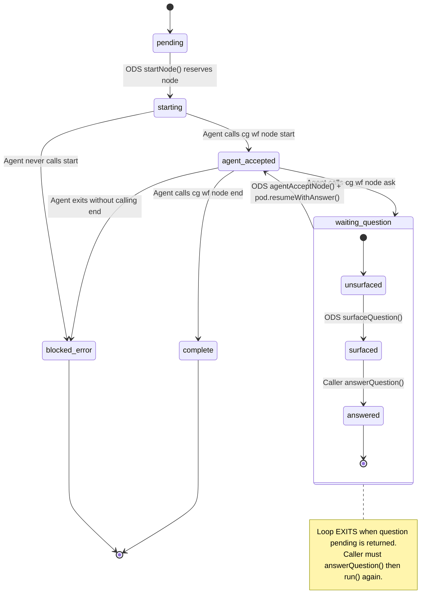
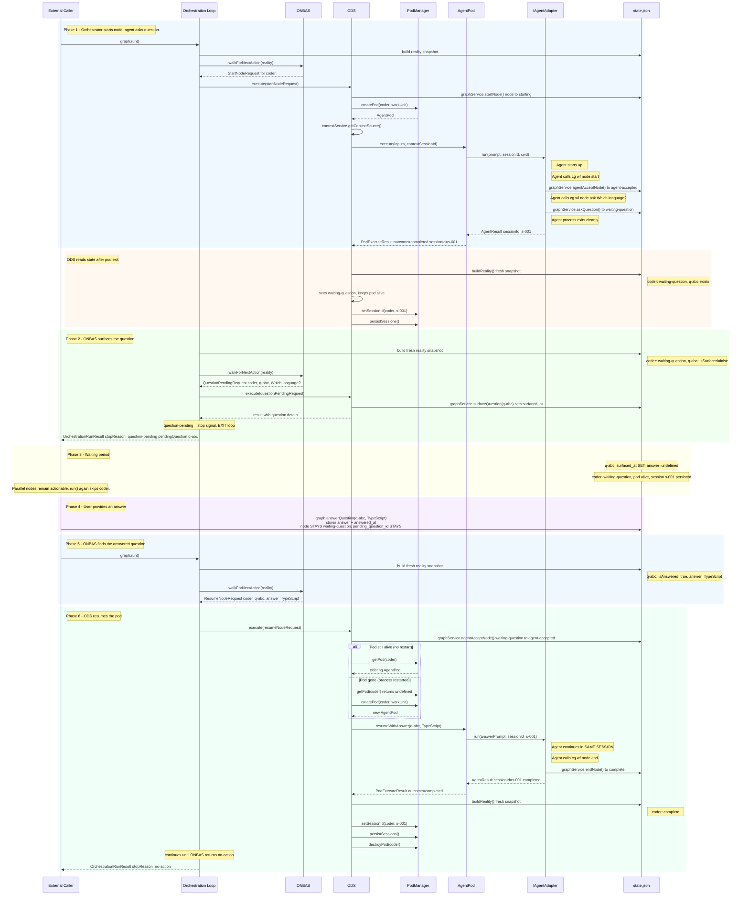

# Workshop: Orchestrator-Pod Question Lifecycle

**Type**: Integration Pattern / State Machine
**Plan**: 031-pods-that-work
**Research**: [research-dossier.md](../research-dossier.md)
**Upstream Workshops**: [04-work-unit-pods](../../030-positional-orchestrator/workshops/04-work-unit-pods.md), [05-onbas](../../030-positional-orchestrator/workshops/05-onbas.md), [08-ods-handover](../../030-positional-orchestrator/workshops/08-ods-orchestrator-agent-handover.md), [two-phase-handshake tasks](../../030-positional-orchestrator/tasks/phase-6-ods-action-handlers/subtask-two-phase-handshake/tasks.md)
**Created**: 2026-02-06
**Revised**: 2026-02-07
**Status**: Draft

**Related Documents**:
- Plan 030 Workshop 08 -- ODS Orchestrator-Agent Handover Protocol (SOURCE OF TRUTH)
- Plan 030 Workshop 04 -- WorkUnitPods and PodManager
- Plan 030 Workshop 05 -- ONBAS Rules Engine
- Plan 030 Workshop 07 -- Orchestration Entry Point
- Plan 030 Phase 6 Subtask Flight Plan -- Two-Phase Handshake Schema Migration

---

## Purpose

This workshop traces the full lifecycle of a question from the moment an agent asks it to the moment the agent receives the answer and continues working. It uses the **agent-owns-transitions** model from Workshop #8: the agent writes state changes via CLI commands during execution, and ODS reads the resulting state after the pod exits.

## Key Questions Addressed

- Q1: When an agent asks a question, how does it propagate through the system?
- Q2: What does "surfacing" a question mean and who does it?
- Q3: Where does the orchestration loop pause and how does it resume after the user answers?
- Q4: What happens to the pod while waiting for an answer? Does it stay alive?
- Q5: How does ODS get the answer back into the pod via `resumeWithAnswer`?
- Q6: What if the agent asks multiple questions? What if it asks another question after resuming?
- Q7: What does the external caller (CLI/Web) actually see and do?

---

## The Cast

| Actor | Role | Persistence |
|-------|------|-------------|
| **Agent** | Calls `cg wf node ask` via CLI to ask questions | External process |
| **AgentPod** | Wraps adapter, returns process exit status (PodExecuteResult) | In-memory only |
| **ODS** | Executes orchestration requests, reads state after pod exits | Stateless service |
| **PositionalGraphService** | Reads/writes state.json, manages node statuses | Disk-backed |
| **PodManager** | Tracks pods and sessions | In-memory (sessions persisted) |
| **ONBAS** | Pure function, decides next action from reality snapshot | Stateless |
| **Orchestration Loop** | `graph.run()` -- snapshot/decide/execute cycle | Per-invocation |
| **External Caller** | CLI or Web UI -- triggers `run()`, provides answers | External |

---

## The State Machine

A node involved in a question goes through these states. Note the **two-phase handshake**: `starting` (orchestrator reserves) then `agent-accepted` (agent picks up).



### Two Failure Diagnostics

| Post-Exit State | Meaning | ODS Response |
|----------------|---------|--------------|
| `starting` | Agent never called `start` -- never accepted | `AGENT_NEVER_ACCEPTED`, mark `blocked-error` |
| `agent-accepted` | Agent accepted but exited without `end` | `AGENT_EXIT_WITHOUT_END`, mark `blocked-error` |

### Three Question Sub-States in ONBAS

| # | `isSurfaced` | `isAnswered` | ONBAS Returns | What Happens |
|---|:---:|:---:|---|---|
| 1 | false | false | `question-pending` | ODS surfaces the question, loop **exits** |
| 2 | true | false | `null` (skip) | Node skipped, loop continues to other nodes |
| 3 | true | true | `resume-node` | ODS resumes pod with answer, loop continues |

---

## The Complete Lifecycle -- Step by Step

### Scenario: Agent "coder" asks which language to use



**Key principle: Agent owns transitions, ODS reads state.** The agent calls `cg wf node start`, `cg wf node ask`, and `cg wf node end` during execution. These CLI commands write directly to state.json via `graphService`. When the pod exits, ODS calls `buildReality()` to discover what the agent did. ODS never calls `askQuestion()`, `endNode()`, or `agentAcceptNode()` on behalf of the agent (except during resume, where `agentAcceptNode()` re-transitions waiting-question to agent-accepted before re-invoking the agent).

**Why two loop iterations for the question?** The first iteration starts the node and the agent asks a question during execution. After the pod exits, ODS reads state and sees `waiting-question`. The second iteration sees the unsurfaced question and surfaces it. ONBAS is a pure function that reads reality snapshots -- it discovers questions by reading the fresh snapshot.

**Why does `question-pending` exit the loop?** Because the orchestration system cannot proceed without user input. Unlike `start-node` and `resume-node` (which execute work and loop again), `question-pending` means "hand control back to the caller so the question can be presented to the user."

**The node stays `waiting-question` until ODS resumes it.** The `answerQuestion()` call stores the answer but does NOT transition the node or clear `pending_question_id`. ONBAS sees the answered question (four gates pass) and returns `resume-node`. ODS calls `agentAcceptNode()` (waiting-question to agent-accepted) then `pod.resumeWithAnswer()`.

---

## The Four ONBAS Gates for Resume

ONBAS produces a `resume-node` request only when ALL four gates pass:

```
walkForNextAction(reality)
  visitNode(reality, node)
    node.status === 'waiting-question'         GATE 1: node must be waiting-question
  visitWaitingQuestion(reality, node)
    node.pendingQuestionId exists               GATE 2: must have a pendingQuestionId
    reality.questions.find(q.questionId match)  GATE 3: question record must exist
    question.isAnswered === true                GATE 4: question must have answer stored
  returns: { type: 'resume-node', nodeId, questionId, answer }
```

**Why `answerQuestion()` must be store-only:** Current `answerQuestion()` transitions the node out of `waiting-question` and clears `pending_question_id`. This breaks Gates 1 and 2 -- ONBAS never enters `visitWaitingQuestion` and the `resume-node` request is never produced. The orchestration loop stalls forever.

**Fix (per Workshop #8):** `answerQuestion()` stores the answer + `answered_at` and nothing else. The node stays in `waiting-question` with `pending_question_id` intact.

---

## The surfaceQuestion Method

Workshop #8 established the method name as `surfaceQuestion()` (not `markQuestionSurfaced`).

### What Must Exist

```typescript
// On IPositionalGraphService
async surfaceQuestion(
  ctx: WorkspaceContext,
  graphSlug: string,
  nodeId: string,
  questionId: string
): Promise<void> {
  // 1. Read state.json
  // 2. Find question by questionId
  // 3. Set question.surfaced_at = new Date().toISOString()
  // 4. Atomic write state.json
}
```

### Who Calls It

ODS calls it when handling a `question-pending` OrchestrationRequest:

```typescript
async handleQuestionPending(
  request: QuestionPendingRequest,
  ctx: WorkspaceContext,
): Promise<OrchestrationExecuteResult> {
  await this.deps.graphService.surfaceQuestion(
    ctx, request.graphSlug, request.nodeId, request.questionId
  );
  this.deps.notifier.emit('workgraphs', 'question-surfaced', {
    graphSlug: request.graphSlug,
    nodeId: request.nodeId,
    questionId: request.questionId,
    questionText: request.questionText,
  });
  return { ok: true, request };
}
```

### Why It Matters

Without `surfaceQuestion`, the orchestration loop would re-surface the same question every `graph.run()` call instead of progressing to other nodes. Marking surfaced ensures ONBAS skips the surfaced-but-unanswered question and continues walking.

---

## Pod Lifecycle During Questions

### The Pod Stays Alive

When ODS reads state after pod exit and finds `waiting-question`, it does NOT destroy the pod:

```typescript
// ODS post-execute state read (from Workshop #8)
const fresh = await this.deps.buildReality(ctx, graphSlug);
const freshNode = fresh.nodes.get(nodeId)!;

switch (freshNode.status) {
  case 'complete':
    this.deps.podManager.destroyPod(nodeId);     // destroyed
    break;

  case 'waiting-question':
    // Pod stays alive -- session needed for resumption
    break;

  case 'agent-accepted':
    // Agent accepted but exited without 'end' -- error
    await this.deps.graphService.failNode(ctx, graphSlug, nodeId, {
      code: 'AGENT_EXIT_WITHOUT_END', message: '...',
    });
    this.deps.podManager.destroyPod(nodeId);
    break;

  case 'starting':
    // Agent never accepted -- error
    await this.deps.graphService.failNode(ctx, graphSlug, nodeId, {
      code: 'AGENT_NEVER_ACCEPTED', message: '...',
    });
    this.deps.podManager.destroyPod(nodeId);
    break;
}
```

**Why keep the pod alive?** Because `resumeWithAnswer()` needs to call `adapter.run()` with the same sessionId. If the pod is alive, it already has the sessionId internally. If the process restarts and the pod is gone, ODS recreates it and the session ID is recovered from AgentManagerService (per Workshop 02).

### Process Restart Recovery

```
Before restart:
  PodManager (in-memory):
    pods: { coder: AgentPod(sessionId='s-001') }

  AgentManagerService:
    agent-2: AgentInstance(sessionId='s-001')

After restart:
  PodManager (in-memory):
    pods: {}                           empty, all pods gone

  AgentManagerService.initialize():
    Hydrates agent-2 with sessionId='s-001' from storage

Recovery flow (when graph.run() is called):
  1. ONBAS finds answered question -> resume-node
  2. ODS.handleResumeNode():
     - calls agentAcceptNode() (waiting-question -> agent-accepted)
     - pod = podManager.getPod('coder') -> undefined (pod gone)
     - recreates pod; resolves AgentInstance from AgentManagerService
     - pod.resumeWithAnswer() resumes session 's-001'
```

---

## Sequential Questions (Agent Asks Again After Resume)

An agent can ask multiple questions. Each follows the same lifecycle. After `resumeWithAnswer()`, the agent may call `cg wf node ask` again instead of `cg wf node end`:

```
Iteration 1: start-node -> pod.execute()
             Agent calls: start (starting -> agent-accepted)
             Agent calls: ask q-001 "Which language?" (agent-accepted -> waiting-question)
             Agent exits cleanly
             ODS reads state: waiting-question, keeps pod

Iteration 2: question-pending (q-001)
             ODS: surfaceQuestion
             Loop exits.

             User answers: "TypeScript"

Iteration 3: resume-node (q-001, answer: "TypeScript")
             ODS: agentAcceptNode() (waiting-question -> agent-accepted)
             ODS: pod.resumeWithAnswer()
             Agent continues in same session
             Agent calls: ask q-002 "Which framework?" (agent-accepted -> waiting-question)
             Agent exits cleanly
             ODS reads state: waiting-question, keeps pod

Iteration 4: question-pending (q-002)
             ODS: surfaceQuestion
             Loop exits.

             User answers: "Next.js"

Iteration 5: resume-node (q-002, answer: "Next.js")
             ODS: agentAcceptNode() (waiting-question -> agent-accepted)
             ODS: pod.resumeWithAnswer()
             Agent calls: end (agent-accepted -> complete)
             Agent exits cleanly
             ODS reads state: complete, destroys pod
```

Each cycle is identical. The pod maintains session continuity throughout, so the agent has full conversational context across all questions.

### State Accumulation

After the first question is answered and the second is asked, `state.json.questions` contains BOTH:

```json
{
  "questions": [
    {
      "question_id": "q-001",
      "node_id": "coder",
      "text": "Which language?",
      "asked_at": "...",
      "surfaced_at": "...",
      "answer": "TypeScript",
      "answered_at": "..."
    },
    {
      "question_id": "q-002",
      "node_id": "coder",
      "text": "Which framework?",
      "asked_at": "...",
      "surfaced_at": null,
      "answer": null,
      "answered_at": null
    }
  ]
}
```

ONBAS only cares about the question referenced by `node.pending_question_id`. Old answered questions are historical records.

---

## Parallel Nodes and Questions

When parallel nodes are on the same line, a question from one does not block the others:

```
Line 2: [coder (parallel)] [tester (parallel)] [reviewer (parallel)]

Iteration 1: ONBAS starts coder
             Agent accepts, asks question, exits
             ODS reads state: waiting-question

Iteration 2: ONBAS sees coder waiting-question (unsurfaced)
             question-pending, surfaces it, loop exits

             External caller triggers run() again:

Iteration 3: ONBAS visits coder: surfaced, unanswered -> skip
             ONBAS visits tester: ready -> start-node
             ODS starts tester

Iteration 4: ONBAS visits coder: surfaced, unanswered -> skip
             ONBAS visits tester: agent-accepted -> skip
             ONBAS visits reviewer: ready -> start-node
             ODS starts reviewer

             User answers coder's question:

Iteration 5: ONBAS visits coder: answered -> resume-node
             ODS resumes coder
```

The key behavior: ONBAS's forward walk continues past question-waiting nodes when they are surfaced and unanswered. Only unsurfaced questions trigger `question-pending` (which exits the loop).

---

## What the External Caller Sees

### CLI Flow

```bash
# 1. Start orchestration
$ cg wf run my-graph
# Output: Started node 'coder'. Question pending:
#   [q-abc] Which programming language? (single)
#   Options: TypeScript, Python
# Orchestration paused -- waiting for answer.

# 2. Answer the question
$ cg wf node answer my-graph coder q-abc '"TypeScript"'
# Output: Answer recorded for question q-abc.

# 3. Resume orchestration
$ cg wf run my-graph
# Output: Resumed node 'coder' with answer.
#   Node 'coder' completed.
#   Started node 'tester'...
```

### Web UI Flow

```
1. Web calls graph.run()
   -> receives OrchestrationRunResult with pendingQuestion
   -> displays question card in UI

2. User clicks "TypeScript" option
   -> Web calls graph.answerQuestion('q-abc', 'TypeScript')
   -> Web calls graph.run()
   -> receives next result

3. SSE/polling picks up state changes for live updates
```

### IGraphOrchestration API Surface

```typescript
interface IGraphOrchestration {
  readonly graphSlug: string;

  /** Run the orchestration loop until it pauses or completes */
  run(): Promise<OrchestrationRunResult>;

  /** Get current state without executing */
  getReality(): Promise<PositionalGraphReality>;

  /** Answer a pending question (stores answer only, does NOT resume) */
  answerQuestion(questionId: string, answer: unknown): Promise<void>;
}
```

The external caller's contract is simple: `run()`, check result, optionally `answerQuestion()`, then `run()` again.

---

## Open Questions

### Q1: Should `answerQuestion` automatically trigger `run()`?

**RESOLVED: No.** Keep them separate. The caller explicitly controls when the loop runs. This matches the non-blocking `cg wf run` design from Workshop 06 and avoids surprising side effects.

### Q2: Who generates questionId -- the agent or the pod?

**RESOLVED: The graph service generates questionId.** The agent calls `cg wf node ask` which invokes `graphService.askQuestion()`. The service generates the questionId using a timestamp + random suffix. The pod has no involvement in question detection or ID generation.

### Q3: What if the process restarts between "question asked" and "question surfaced"?

**RESOLVED: No problem.** The question is already persisted in state.json (the agent called `askQuestion()` via CLI during execution). When the process restarts and `graph.run()` is called, ONBAS builds a fresh reality, sees the unsurfaced question, and returns `question-pending` again. ODS surfaces it. The surfacing is idempotent from the caller's perspective.

### Q4: Should ODS.handleQuestionPending do anything beyond surfacing?

**RESOLVED: Yes -- emit an event.** Per Workshop #8, ODS emits a `question-surfaced` event via the notifier when handling question-pending. This feeds into the web UI's SSE stream for real-time notification.

### Q5: How does the pod handle a question during `resumeWithAnswer` itself?

**RESOLVED: Same flow.** `resumeWithAnswer()` returns a `PodExecuteResult` (process exit status). ODS re-reads state. If the agent called `cg wf node ask` again during the resumed execution, state shows `waiting-question` and the lifecycle repeats. ODS is stateless with respect to question depth.

---

## Summary: Who Does What

| Step | Actor | Action | State Change |
|------|-------|--------|-------------|
| 1 | ODS | Calls `startNode()` | pending -> `starting` |
| 2 | ODS | Creates pod, calls `pod.execute()` | subprocess launched |
| 3 | Agent | Calls `cg wf node start` | `starting` -> `agent-accepted` |
| 4 | Agent | Calls `cg wf node ask` | `agent-accepted` -> `waiting-question`, question stored |
| 5 | Agent | Process exits cleanly | (no change) |
| 6 | ODS | Re-reads state via `buildReality()` | (reads `waiting-question`) |
| 7 | ODS | Persists session, keeps pod alive | session recorded |
| 8 | ONBAS | Sees unsurfaced question -> `question-pending` | (pure function) |
| 9 | ODS | Calls `surfaceQuestion()` | question.surfaced_at set |
| 10 | Loop | Exits, returns result to caller | (none) |
| 11 | Caller | Displays question to user | (UI concern) |
| 12 | User | Provides answer | (human action) |
| 13 | Caller | Calls `answerQuestion()` | answer + answered_at stored (node stays `waiting-question`) |
| 14 | Caller | Calls `graph.run()` | (triggers loop) |
| 15 | ONBAS | Sees answered question (4 gates pass) -> `resume-node` | (pure function) |
| 16 | ODS | Calls `agentAcceptNode()` | `waiting-question` -> `agent-accepted` |
| 17 | ODS | Gets/recreates pod, calls `resumeWithAnswer()` | agent process re-invoked |
| 18 | Agent | Continues work in same session | agent has full context |
| 19 | ODS | Re-reads state via `buildReality()` | discovers outcome |

The answer to the workshop's central question: **The agent owns its own state transitions.** The agent calls `start`, `ask`, and `end` via CLI during execution. ODS never writes state on behalf of the agent -- it reads what the agent did after the pod exits. The state is the communication medium. The loop is the clock. ONBAS discovers the question by reading the fresh reality snapshot, not by being told about it.
