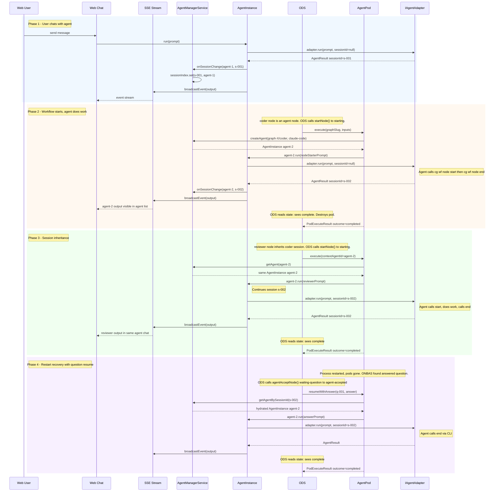

# Workshop: Agent Adapter Session Identity and Lifecycle

**Type**: Integration Pattern
**Plan**: 031-pods-that-work
**Research**: [research-dossier.md](../research-dossier.md)
**Upstream Workshops**: [04-work-unit-pods](../../030-positional-orchestrator/workshops/04-work-unit-pods.md), [08-ods-handover](../../030-positional-orchestrator/workshops/08-ods-orchestrator-agent-handover.md), [two-phase-handshake tasks](../../030-positional-orchestrator/tasks/phase-6-ods-action-handlers/subtask-two-phase-handshake/tasks.md), [01-question-lifecycle](./01-orchestrator-pod-question-lifecycle.md)
**Created**: 2026-02-06
**Revised**: 2026-02-07
**Status**: Draft

**Related Documents**:
- Plan 030 Workshop 08 -- ODS Orchestrator-Agent Handover Protocol (SOURCE OF TRUTH for state transitions)
- Plan 030 Workshop 04 -- WorkUnitPods and PodManager
- Plan 019 -- AgentInstance and AgentManagerService
- Plan 031 Workshop 01 -- Orchestrator-Pod Question Lifecycle

---

## Purpose

This workshop resolves a key design question: **Should orchestrated pods build their own parallel agent lifecycle, or reuse AgentManagerService (Plan 019)?** The answer is reuse. AgentManagerService becomes the single source of truth for all agent instances -- whether created by the web chat UI, the CLI, or the orchestration system. A new `getAgentBySessionId()` method enables any part of the system to get the same AgentInstance object for a given session, ensuring events, session state, and adapter access are unified.

## Key Questions Addressed

- Q1: Do pods need their own adapter lifecycle, or can they reuse AgentManagerService?
- Q2: How does AgentManagerService support session-based lookup?
- Q3: How does AgentPod use AgentManagerService instead of a raw adapter?
- Q4: What happens when two pods share a session (context inheritance)?
- Q5: What happens on server restart?
- Q6: How does this connect web chat sessions to orchestrated workflow output?

---

## The Problem: Two Disconnected Worlds

Today the codebase has two independent systems that both use IAgentAdapter but never intersect:

```
Plan 019 World (Web Agent Chat)          Plan 030 World (Orchestration)
 +--------------------------+             +----------------------------+
 | AgentManagerService      |             | PodManager                 |
 |   agents: Map<id, inst>  |             |   pods: Map<nodeId, pod>   |
 |                          |             |   sessions: Map<nodeId,sid>|
 | AgentInstance             |             |                            |
 |   _adapter: IAgentAdapter|             | AgentPod                   |
 |   _sessionId: string     |             |   agentAdapter: IAgentAdapter
 |   _events: AgentEvent[]  |             |   _sessionId: string       |
 +--------------------------+             +----------------------------+
```

Both systems independently solve: adapter creation, session tracking, session persistence, restart recovery. The orchestration side (Plan 030) hasn't built the real-agent integration yet -- it's all been fakes and workshops. This is the right moment to unify rather than build a parallel system.

---

## The Design Decision: AgentManagerService as Single Source of Truth

**Every agent interaction goes through AgentManagerService.** Pods don't hold raw IAgentAdapter instances. They hold AgentInstance references obtained from AgentManagerService. This gives us:

1. **Unified session tracking** -- one system, one persistence format
2. **Unified event broadcasting** -- every agent run broadcasts via SSE, whether triggered by web chat or orchestration
3. **Session-based lookup** -- any component can get the canonical AgentInstance for a session ID
4. **Restart recovery** -- AgentManagerService's proven `hydrate()` pattern handles everything
5. **Web chat visibility** -- orchestrated agent output appears in the web UI's agent chat view automatically

```
Unified World
 +---------------------------------------------+
 | AgentManagerService                          |
 |   _agents: Map<agentId, AgentInstance>       |
 |   _sessionIndex: Map<sessionId, AgentInstance> <-- NEW
 |                                              |
 |   getAgent(agentId) -> AgentInstance         |
 |   getAgentBySessionId(sid) -> AgentInstance  | <-- NEW
 |   createAgent(params) -> AgentInstance       |
 +---------------------------------------------+
          |
          | Used by BOTH:
          |
    +-----+------+
    |            |
  Web Chat    AgentPod
  (Plan 019)  (Plan 030)
```

---

## Change 1: Extend IAgentManagerService with Session Lookup

### Interface Addition

```typescript
// agent-manager.interface.ts -- additions
export interface IAgentManagerService {
  // ... existing methods ...

  /**
   * Get an agent by its current session ID.
   *
   * Returns the AgentInstance that owns this session. This enables
   * any part of the system to get the same object for a given conversation,
   * ensuring events, state, and adapter access are unified.
   *
   * @param sessionId - Agent adapter session ID
   * @returns The agent instance or null if no agent owns this session
   */
  getAgentBySessionId(sessionId: string): IAgentInstance | null;
}
```

### Implementation: Secondary Index

```typescript
// agent-manager.service.ts -- additions
export class AgentManagerService implements IAgentManagerService {
  private readonly _agents = new Map<string, IAgentInstance>();
  private readonly _sessionIndex = new Map<string, IAgentInstance>();  // NEW

  createAgent(params: CreateAgentParams): IAgentInstance {
    // ... existing code ...
    const instance = new AgentInstance(/* ... */);
    this._agents.set(id, instance);
    // No session index entry yet -- session assigned on first run()
    return instance;
  }

  getAgentBySessionId(sessionId: string): IAgentInstance | null {
    return this._sessionIndex.get(sessionId) ?? null;
  }

  // Called by AgentInstance after each run() completes
  updateSessionIndex(agentId: string, sessionId: string): void {
    const instance = this._agents.get(agentId);
    if (instance) {
      this._sessionIndex.set(sessionId, instance);
    }
  }

  async initialize(): Promise<void> {
    // ... existing hydration code ...
    // After hydrating all agents, rebuild session index
    for (const agent of this._agents.values()) {
      if (agent.sessionId) {
        this._sessionIndex.set(agent.sessionId, agent);
      }
    }
  }

  async terminateAgent(agentId: string): Promise<boolean> {
    const agent = this._agents.get(agentId);
    if (!agent) return false;

    // Remove from session index
    if (agent.sessionId) {
      this._sessionIndex.delete(agent.sessionId);
    }

    // ... existing termination code ...
  }
}
```

### Session Index Update Mechanism

The session index must stay in sync when AgentInstance acquires or changes its sessionId. Two approaches:

**Option A: Callback from AgentInstance** -- AgentInstance calls a callback after each `run()` that updates the index. Requires passing the callback at construction.

**Option B: Observer on AgentInstance.run()** -- AgentManagerService wraps or observes AgentInstance.run() to capture the sessionId change.

**Option C: Explicit sync in AgentManagerService** -- After any operation that might change a session (create, run, hydrate), AgentManagerService rebuilds the index entry.

**Recommended: Option A.** Pass a lightweight `onSessionChange` callback to AgentInstance:

```typescript
// In AgentInstance.run(), after storing sessionId:
this._sessionId = result.sessionId;
this._onSessionChange?.(this.id, result.sessionId);  // notifies manager
```

```typescript
// In AgentManagerService.createAgent():
const onSessionChange = (agentId: string, sessionId: string) => {
  this._sessionIndex.set(sessionId, this._agents.get(agentId)!);
};
const instance = new AgentInstance(config, adapterFactory, notifier, storage, onSessionChange);
```

---

## Change 2: AgentPod Uses AgentManagerService

AgentPod no longer receives a raw IAgentAdapter. It receives AgentManagerService and creates/resolves its own AgentInstance.

### Updated PodCreateParams

```typescript
// pod-manager.types.ts
export type PodCreateParams =
  | {
      readonly unitType: 'agent';
      readonly unitSlug: string;
      readonly agentManager: IAgentManagerService;
      readonly agentType: AgentType;
    }
  | {
      readonly unitType: 'code';
      readonly unitSlug: string;
      readonly runner: IScriptRunner;
    };
```

**What changed:** `adapter: IAgentAdapter` is replaced by `agentManager: IAgentManagerService` + `agentType: AgentType`. The pod creates its own AgentInstance through the service.

### Updated AgentPod

```typescript
export class AgentPod implements IWorkUnitPod {
  readonly unitType = 'agent' as const;
  private _agentInstance: IAgentInstance | undefined;

  constructor(
    readonly nodeId: string,
    private readonly agentManager: IAgentManagerService,
    private readonly agentType: AgentType,
  ) {}

  get sessionId(): string | undefined {
    return this._agentInstance?.sessionId ?? undefined;
  }

  async execute(options: PodExecuteOptions): Promise<PodExecuteResult> {
    // Resolve or create the agent instance
    this.ensureAgentInstance(options);

    const prompt = loadStarterPrompt();
    try {
      const result = await this._agentInstance!.run({
        prompt,
        cwd: options.ctx.worktreePath,
      });
      return this.mapAgentResult(result);
    } catch (err) {
      return {
        outcome: 'error',
        error: {
          code: 'POD_AGENT_EXECUTION_ERROR',
          message: err instanceof Error ? err.message : String(err),
        },
      };
    }
  }

  async resumeWithAnswer(
    questionId: string,
    answer: unknown,
    options: PodExecuteOptions,
  ): Promise<PodExecuteResult> {
    // On restart, agent instance may be gone -- re-resolve by session
    this.ensureAgentInstance(options);

    if (!this._agentInstance?.sessionId) {
      return {
        outcome: 'error',
        error: { code: 'POD_NO_SESSION', message: `No session for node '${this.nodeId}'` },
      };
    }

    const answerStr = typeof answer === 'string' ? answer : JSON.stringify(answer);
    const prompt = `Answer to question ${questionId}: ${answerStr}`;

    try {
      const result = await this._agentInstance.run({
        prompt,
        cwd: options.ctx.worktreePath,
      });
      return this.mapAgentResult(result);
    } catch (err) {
      return {
        outcome: 'error',
        error: {
          code: 'POD_AGENT_RESUME_ERROR',
          message: err instanceof Error ? err.message : String(err),
        },
      };
    }
  }

  async terminate(): Promise<void> {
    if (this._agentInstance) {
      await this._agentInstance.terminate();
    }
  }

  private ensureAgentInstance(options: PodExecuteOptions): void {
    if (this._agentInstance) return;

    // Try to resolve by contextAgentId (session inheritance)
    if (options.contextAgentId) {
      const existing = this.agentManager.getAgent(options.contextAgentId);
      if (existing) {
        this._agentInstance = existing;
        return;
      }
    }

    // Try to resolve by session ID (restart recovery)
    if (options.contextSessionId) {
      const existing = this.agentManager.getAgentBySessionId(options.contextSessionId);
      if (existing) {
        this._agentInstance = existing;
        return;
      }
    }

    // Create a new agent instance
    this._agentInstance = this.agentManager.createAgent({
      name: `${options.graphSlug}/${this.nodeId}`,
      type: this.agentType,
      workspace: options.ctx.worktreePath,
    });
  }

  private mapAgentResult(result: AgentResult): PodExecuteResult {
    // ... same mapping as current code ...
  }
}
```

### What This Eliminates

| Removed From | What | Why |
|-------------|------|-----|
| **ODS** | Adapter factory resolution | AgentPod handles it via AgentManagerService |
| **PodCreateParams** | `adapter: IAgentAdapter` field | Replaced by `agentManager` + `agentType` |
| **PodManager** | Session tracking for agent pods | AgentInstance handles sessionId |
| **PodManager** | `pod-sessions.json` for agent nodes | AgentManagerService persists sessions |
| **DYK-P4#4** | "PodManager does NOT resolve adapters" | No longer relevant -- pod resolves its own agent |

**PodManager still exists** for: pod lifecycle (create/get/destroy), nodeId -> pod mapping, and CodePod management. It just stops duplicating agent session concerns.

**Note on agent-owns-transitions (Workshop #8):** Under the two-phase handshake model, ODS never calls `askQuestion()`, `endNode()`, or `agentAcceptNode()` on behalf of the agent during initial execution. The agent calls these via CLI (`cg wf node start`, `cg wf node ask`, `cg wf node end`) during pod execution. ODS reads the resulting state after the pod exits. The only ODS-initiated state transition is `agentAcceptNode()` during resume (waiting-question -> agent-accepted before re-invoking the agent).

---

## Change 3: Session Inheritance = Same AgentInstance

Currently, AgentContextService says "node-B should inherit session from node-A" and passes a `contextSessionId`. With the new design, session inheritance means **the same AgentInstance crosses node boundaries**.

```
Line 1: [planner (agent)]  -->  AgentInstance 'graph-X/planner'  (session s-001)
Line 2: [coder (agent)]    -->  same AgentInstance               (session s-001)
```

AgentContextService returns `{ source: 'inherit', fromNodeId: 'planner' }`. ODS looks up planner's AgentInstance ID. AgentPod for coder resolves that same AgentInstance via `agentManager.getAgent(plannerAgentId)`. One agent, continuous conversation, sequential nodes.

### Updated PodExecuteOptions

```typescript
export interface PodExecuteOptions {
  readonly inputs: { readonly inputs: Record<string, unknown>; readonly ok: boolean };
  readonly contextSessionId?: string;      // for restart recovery (lookup by session)
  readonly contextAgentId?: string;        // NEW: for session inheritance (lookup by agent ID)
  readonly ctx: { readonly worktreePath: string };
  readonly graphSlug: string;
  readonly onEvent?: PodEventHandler;
}
```

### Resolution Priority in ensureAgentInstance()

1. **contextAgentId** -- session inheritance: reuse the prior node's AgentInstance
2. **contextSessionId** -- restart recovery: find the AgentInstance that owns this session
3. **Create new** -- first agent on a line, or no inheritance

---

## Sequence Diagram: Unified Flow



---

## Server Restart: Unified Recovery

```
Before restart:
  AgentManagerService._agents: {
    agent-1: AgentInstance(sessionId='s-001', name='chat-assistant'),
    agent-2: AgentInstance(sessionId='s-002', name='graph-X/coder'),
  }
  AgentManagerService._sessionIndex: {
    s-001: agent-1,
    s-002: agent-2,
  }
  PodManager.pods: {
    coder: AgentPod(_agentInstance=agent-2),
  }

After restart:
  AgentManagerService.initialize():
    Hydrates agent-1 with sessionId='s-001'  (new adapter, same session)
    Hydrates agent-2 with sessionId='s-002'  (new adapter, same session)
    Rebuilds _sessionIndex from hydrated agents

  PodManager.pods: {}  (empty, all pods gone)

Recovery when graph.run() is called:
  1. ONBAS walks graph, finds answered question (4 gates pass) -> resume-node
  2. ODS calls agentAcceptNode() (waiting-question -> agent-accepted)
  3. ODS creates new AgentPod (pod gone, must recreate)
  4. Pod.ensureAgentInstance() with contextSessionId='s-002'
  5. Calls agentManager.getAgentBySessionId('s-002')
  6. Gets back hydrated AgentInstance agent-2
  7. Pod resumes through agent-2, events flow via SSE
  8. ODS reads state after pod exits to discover outcome
```

**Key insight:** `pod-sessions.json` is no longer needed for agent pods. AgentManagerService persists agent state (including sessionId) in its own storage. PodManager can still persist session IDs as a lightweight backup/index, but the source of truth is AgentManagerService.

---

## Web Chat Visibility

With this design, every orchestrated agent automatically appears in the web UI:

| Scenario | What the User Sees |
|----------|-------------------|
| User starts a chat agent | Agent appears in agent list, events stream via SSE |
| Workflow creates an agent node | Agent "graph-X/coder" appears in agent list, events stream via SSE |
| Workflow node inherits session | Same agent shows continued conversation |
| User opens agent "graph-X/coder" | Sees all workflow events as a chat history |
| Workflow asks a question | Question appears as an event in the agent's chat |

The web UI doesn't need to know about orchestration. It just shows agents and their events. Orchestrated agents are first-class agents.

---

## What PodManager Becomes

PodManager is still needed but simplified for agent pods:

```typescript
export class PodManager implements IPodManager {
  private readonly pods = new Map<string, IWorkUnitPod>();
  // sessions map removed for agent pods -- AgentManagerService handles it

  createPod(nodeId: string, params: PodCreateParams): IWorkUnitPod {
    const existing = this.pods.get(nodeId);
    if (existing) return existing;

    let pod: IWorkUnitPod;
    switch (params.unitType) {
      case 'agent':
        pod = new AgentPod(nodeId, params.agentManager, params.agentType);
        break;
      case 'code':
        pod = new CodePod(nodeId, params.runner);
        break;
    }

    this.pods.set(nodeId, pod);
    return pod;
  }

  getPod(nodeId: string): IWorkUnitPod | undefined {
    return this.pods.get(nodeId);
  }

  destroyPod(nodeId: string): void {
    this.pods.delete(nodeId);
    // Note: agent instance is NOT terminated -- it persists in AgentManagerService
    // The agent can be reused if the node restarts or another node inherits the session
  }
}
```

**PodManager's responsibilities narrow to:**
- Pod lifecycle (create/get/destroy) per graph
- nodeId -> IWorkUnitPod mapping
- CodePod management (unchanged)

**Moved to AgentManagerService:**
- Agent session tracking
- Session persistence
- Session-based lookup
- Event broadcasting
- Restart recovery

---

## Open Questions

### Q1: When are orchestration-created agents cleaned up?

**OPEN**: When a graph completes, ODS destroys pods. But the AgentInstance persists in AgentManagerService. Should ODS also call `agentManager.terminateAgent()` for agents it created? Or should they persist so the user can review the conversation history?

**Leaning toward:** Keep agents alive after graph completion. The user can review them in the web UI. Add a cleanup mechanism (e.g., `agentManager.getAgents({ workspace, stale: true })`) for batch cleanup later.

### Q2: Should the CLI also use AgentManagerService for orchestration?

**OPEN**: The CLI currently uses the stateless `AgentService` (fire-and-forget). For orchestration, should the CLI use `AgentManagerService` too? This would mean CLI-triggered workflows create persistent agents visible in the web UI (if the web server is running on the same workspace).

**Leaning toward yes** -- unified behavior regardless of entry point. The CLI just doesn't have SSE, so events are logged to stdout instead.

### Q3: Does the double-run guard in AgentInstance conflict with pod execution?

**RESOLVED: No.** The orchestration loop is sequential. ONBAS produces one request at a time, ODS executes it, the loop continues. Two pods never call `agentInstance.run()` concurrently. The double-run guard is protective against bugs, not a limitation.

### Q4: How does the session index handle session ID changes?

**RESOLVED:** When an adapter returns a new sessionId (different from the one passed in), AgentInstance stores the new one and calls `onSessionChange()`. AgentManagerService updates the index: removes the old entry, adds the new one. In practice, session IDs are stable (Claude Code reuses the same session directory), but the mechanism handles changes.

### Q5: Should `onSessionChange` be a method on IAgentManagerService or a constructor callback?

**OPEN**: A constructor callback is simpler (AgentInstance doesn't need to know about IAgentManagerService). But it requires passing the callback through to AgentInstance, which means either changing the constructor signature or using a setter.

**Leaning toward:** Constructor parameter on AgentInstance. It's a one-time setup at creation, and the callback is a simple `(agentId: string, sessionId: string) => void`.

---

## Summary

| Before (Two Worlds) | After (Unified) |
|---------------------|-----------------|
| AgentManagerService for web chat only | AgentManagerService for all agent interactions |
| PodManager tracks agent sessions separately | PodManager delegates agent sessions to AgentManagerService |
| AgentPod holds raw IAgentAdapter | AgentPod holds IAgentInstance from AgentManagerService |
| No session-based lookup | `getAgentBySessionId()` on AgentManagerService |
| Web UI sees chat agents only | Web UI sees all agents (chat + orchestrated) |
| Pod events invisible to web UI | All agent events broadcast via SSE |
| Two restart recovery paths | One recovery path via AgentManagerService.initialize() |
| `pod-sessions.json` for agent sessions | AgentManagerService storage (agent sessions) |

The answer to the workshop's central question: **Don't build a parallel agent lifecycle. Reuse AgentManagerService. Add `getAgentBySessionId()` so any component can get the canonical AgentInstance for a session. The AgentInstance is the shared object that unifies web chat, orchestration, event broadcasting, and session management.**
