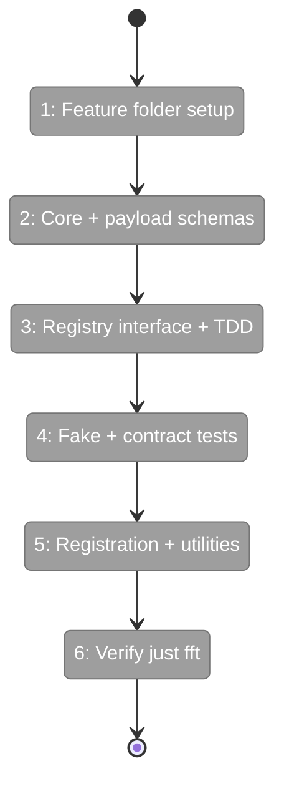
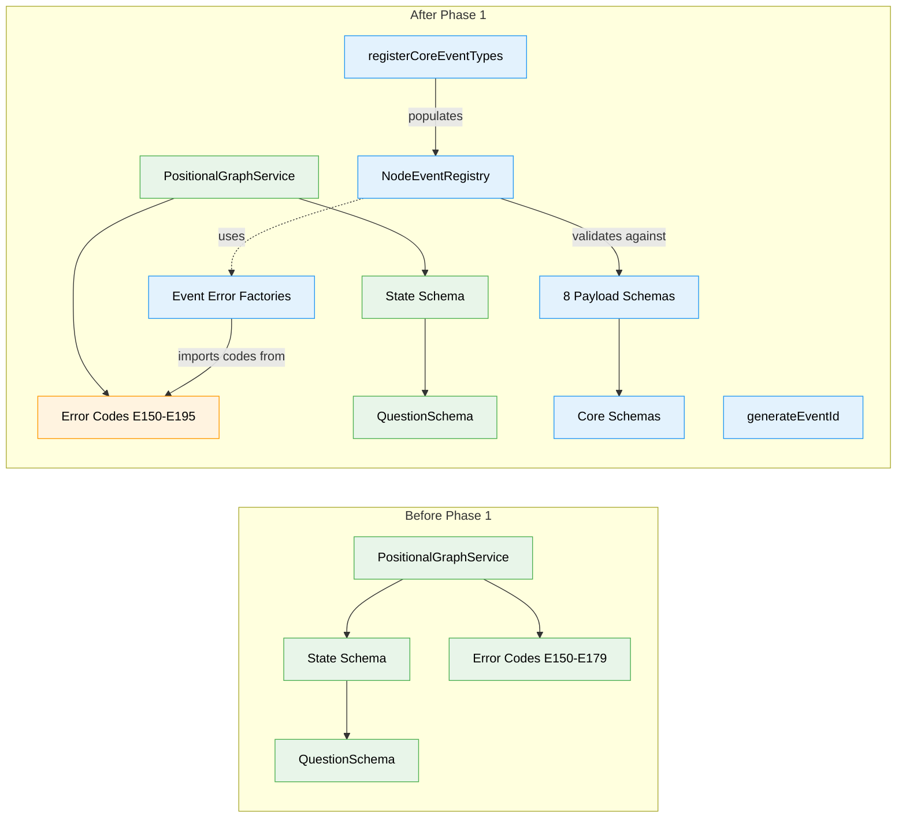

# Flight Plan: Phase 1 — Event Types, Schemas, and Registry

**Plan**: [node-event-system-plan.md](../../node-event-system-plan.md)
**Phase**: Phase 1: Event Types, Schemas, and Registry
**Generated**: 2026-02-07
**Status**: Ready for takeoff

---

## Departure → Destination

**Where we are**: Plan 030 Phases 1-5 delivered the orchestration core (Reality snapshots, OrchestrationRequests, AgentContext, Pods, ONBAS walk algorithm), but Phase 6 (ODS action handlers) is blocked because nodes still communicate through bespoke service methods (`askQuestion`, `endNode`, `saveOutputData`) — each with its own validation, storage, and CLI command. There is no unified event protocol. Plan 032 has a spec, two workshops with resolved design questions, and a validated 8-phase plan. No code has been written yet.

**Where we're going**: By the end of this phase, the data model for the entire Node Event System exists: 8 event payload schemas validated by Zod, a `NodeEventRegistry` that registers types and validates payloads at runtime, error codes E190-E195 with actionable diagnostics, and a `generateEventId()` utility. A developer can instantiate a registry, call `registerCoreEventTypes(registry)`, and immediately validate payloads, list event types, and discover schemas — all in isolation with no state changes or service dependencies.

---

## Flight Status

<!-- Updated by /plan-6: pending → active → done. Use blocked for problems/input needed. -->

**Legend**: grey = pending | yellow = active | red = blocked/needs input | green = done

---

## Stages

<!-- Updated by /plan-6 during implementation: [ ] → [~] → [x] -->

- [ ] **Stage 1: Create feature folder and barrel** — set up `features/032-node-event-system/` with an empty `index.ts` barrel that compiles (`features/032-node-event-system/index.ts` — new file)
- [ ] **Stage 2: Define core and payload schemas** — create `EventSourceSchema`, `EventStatusSchema`, `NodeEventSchema` plus all 8 payload schemas with `.strict()` and unit tests (`event-source.schema.ts`, `event-status.schema.ts`, `node-event.schema.ts`, `event-payloads.schema.ts`, `event-payloads.test.ts` — new files)
- [ ] **Stage 3: Define interfaces and TDD the registry** — create `EventTypeRegistration` and `INodeEventRegistry` interfaces, write failing registry tests (RED), then implement `NodeEventRegistry` to make them pass (GREEN) (`event-type-registration.ts`, `node-event-registry.interface.ts`, `node-event-registry.ts`, `node-event-registry.test.ts` — new files)
- [ ] **Stage 4: Fake registry and contract tests** — implement `FakeNodeEventRegistry` with test helpers, then write parameterized contract tests proving fake and real behave identically (`fake-node-event-registry.ts` — new file, `node-event-registry.test.ts` — updated)
- [ ] **Stage 5: Core registration, event IDs, and error codes** — implement `registerCoreEventTypes()` populating all 8 types, `generateEventId()` with `evt_<hex_ts>_<hex4>` format, and E190-E195 error factories (`core-event-types.ts`, `event-id.ts`, `event-errors.ts`, `event-errors.test.ts` — new files; `positional-graph-errors.ts`, `errors/index.ts` — modified)
- [ ] **Stage 6: Final verification** — update barrel exports, run `just fft`, fix any issues (all files)

---

## Architecture: Before & After

**Legend**: existing (green, unchanged) | changed (orange, modified) | new (blue, created)

---

## Acceptance Criteria

- [ ] All 8 event types registered with correct metadata (AC-1)
- [ ] Payload validation works for all 8 schemas (AC-3 partial)
- [ ] Registry rejects unknown types, invalid payloads, unauthorized sources (AC-1, AC-3, AC-4 partial)
- [ ] Contract tests pass on fake and real registry
- [ ] Error codes E190-E195 with actionable messages
- [ ] `just fft` clean

## Goals & Non-Goals

**Goals**:
- Create all foundational schemas (EventSource, EventStatus, NodeEvent, 8 payloads)
- Implement NodeEventRegistry with full CRUD + validation
- Implement FakeNodeEventRegistry with test helpers
- Deliver registerCoreEventTypes() populating all 8 types per Workshop #01
- Deliver generateEventId() with monotonic hex timestamp format
- Define error codes E190-E195 with factory functions per existing error pattern
- Contract tests proving fake/real registry parity
- All work under `features/032-node-event-system/` (PlanPak)

**Non-Goals**:
- State schema changes (Phase 2)
- Status enum migration from `running` to `starting`/`agent-accepted` (Phase 2)
- `raiseEvent()` write path (Phase 3)
- Event handlers and state transitions (Phase 4)
- Service method wrappers (Phase 5)
- CLI commands (Phase 6)
- ONBAS adaptation (Phase 7)
- `isNodeActive()` / `canNodeDoWork()` predicates (Phase 2)
- Package-level barrel re-export from `src/index.ts` (not needed until Phase 6)

---

## Checklist

- [ ] T001: Create feature folder `032-node-event-system/` with barrel `index.ts` (CS-1)
- [ ] T002: Define EventSourceSchema, EventStatusSchema, NodeEventSchema Zod schemas (CS-2)
- [ ] T003: Define all 8 payload schemas with unit tests (CS-2)
- [ ] T004: Define EventTypeRegistration interface and INodeEventRegistry interface (CS-1)
- [ ] T005: Write tests for NodeEventRegistry (CS-2)
- [ ] T006: Implement NodeEventRegistry (CS-2)
- [ ] T007: Implement FakeNodeEventRegistry with test helpers (CS-1)
- [ ] T008: Write contract tests (fake vs real registry parity) (CS-2)
- [ ] T009: Implement registerCoreEventTypes() function (CS-1)
- [ ] T010: Implement generateEventId() utility (CS-1)
- [ ] T011: Add E190-E195 error codes and factory functions (CS-2)
- [ ] T012: Refactor, update barrel exports, verify `just fft` clean (CS-1)

---

## PlanPak

Active — files organized under `features/032-node-event-system/`.
