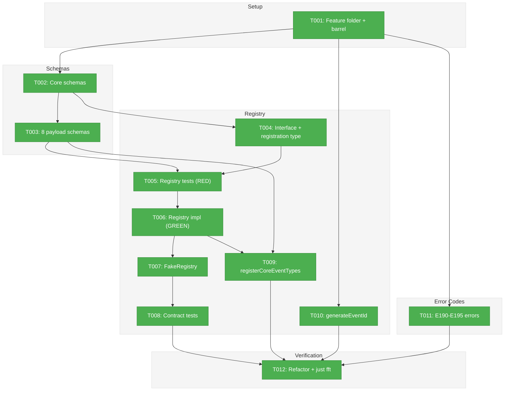
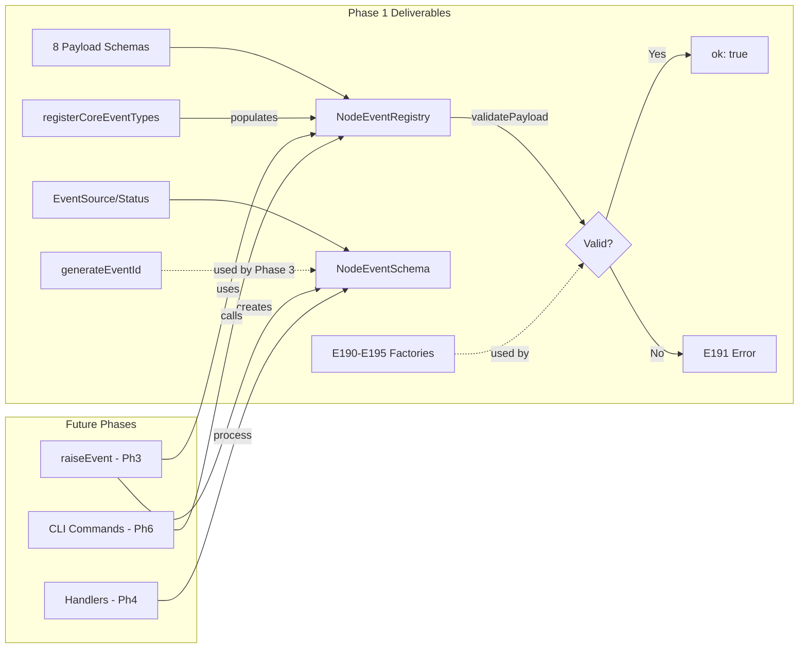
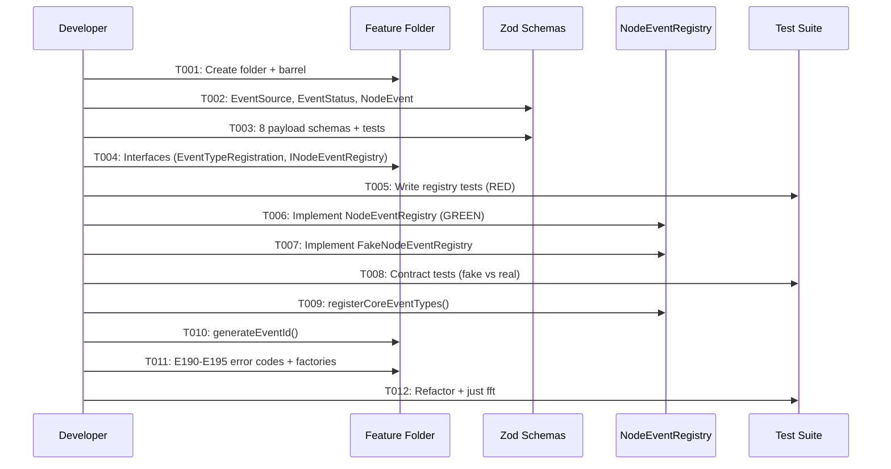

# Phase 1: Event Types, Schemas, and Registry -- Tasks & Alignment Brief

**Spec**: [node-event-system-spec.md](../../node-event-system-spec.md)
**Plan**: [node-event-system-plan.md](../../node-event-system-plan.md)
**Date**: 2026-02-07

---

## Executive Briefing

### Purpose

This phase creates the typed, extensible data model that underpins the entire Node Event System. It delivers Zod schemas for all 8 event types, the `NodeEventRegistry` class that validates payloads and tracks metadata, and the error codes that will drive actionable diagnostics throughout the system.

### What We're Building

- **8 event payload schemas** (Zod `.strict()`) covering node lifecycle, Q&A, output persistence, and progress
- **EventSourceSchema** and **EventStatusSchema** enums for the event object
- **NodeEventSchema** defining the full event record stored per-node
- **INodeEventRegistry** interface with register/get/list/listByDomain/validatePayload
- **NodeEventRegistry** implementation and **FakeNodeEventRegistry** test double
- **`registerCoreEventTypes()`** function that populates the registry with all 8 types
- **`generateEventId()`** utility producing monotonic `evt_<hex_ts>_<hex4>` IDs
- **Error codes E190-E195** with factory functions producing `ResultError` with actionable messages

### User Value

Agents and future phases can validate event payloads before any state changes occur. The registry provides runtime self-discovery (`list()`, `get()`) that CLI commands will expose in Phase 6. Invalid payloads are rejected with field-level Zod errors and concrete guidance ("Run `cg wf node event schema <type>` to see the required payload schema").

### Example

```typescript
const registry = new NodeEventRegistry();
registerCoreEventTypes(registry);

registry.list().length;               // 8
registry.get('question:ask');          // { type: 'question:ask', displayName: 'Ask Question', ... }
registry.get('nonexistent');           // undefined
registry.validatePayload('question:ask', { type: 'single', text: 'Which framework?' });
  // { ok: true, errors: [] }
registry.validatePayload('question:ask', { type: 'invalid' });
  // { ok: false, errors: [{ code: 'E191', message: '...', action: '...' }] }
```

---

## Objectives & Scope

### Objective

Implement the event type data model, Zod schemas for all 8 event payloads, the NodeEventRegistry, and event error codes -- all testable in isolation with no service or state changes.

### Goals

- Create all foundational schemas (EventSource, EventStatus, NodeEvent, 8 payloads)
- Implement NodeEventRegistry with full CRUD + validation
- Implement FakeNodeEventRegistry with test helpers
- Deliver registerCoreEventTypes() populating all 8 types per Workshop #01
- Deliver generateEventId() with monotonic hex timestamp format
- Define error codes E190-E195 with factory functions per existing error pattern
- Contract tests proving fake/real registry parity
- All work under `features/032-node-event-system/` (PlanPak)

### Non-Goals

- State schema changes (Phase 2)
- Status enum migration from `running` to `starting`/`agent-accepted` (Phase 2)
- `raiseEvent()` write path (Phase 3)
- Event handlers and state transitions (Phase 4)
- Service method wrappers (Phase 5)
- CLI commands (Phase 6)
- ONBAS adaptation (Phase 7)
- `isNodeActive()` / `canNodeDoWork()` predicates (Phase 2 tasks 2.3a/2.3b)
- Package-level barrel re-export from `src/index.ts` (not needed until Phase 6 CLI)

---

## Pre-Implementation Audit

### Summary

| # | File | Action | Origin | Modified By | Recommendation |
|---|------|--------|--------|-------------|----------------|
| 1 | `features/032-node-event-system/index.ts` | Create | Plan 032 | N/A | keep-as-is |
| 2 | `features/032-node-event-system/event-source.schema.ts` | Create | Plan 032 | N/A | keep-as-is |
| 3 | `features/032-node-event-system/event-status.schema.ts` | Create | Plan 032 | N/A | keep-as-is |
| 4 | `features/032-node-event-system/node-event.schema.ts` | Create | Plan 032 | N/A | keep-as-is |
| 5 | `features/032-node-event-system/event-payloads.schema.ts` | Create | Plan 032 | N/A | keep-as-is |
| 6 | `features/032-node-event-system/event-type-registration.ts` | Create | Plan 032 | N/A | keep-as-is |
| 7 | `features/032-node-event-system/node-event-registry.interface.ts` | Create | Plan 032 | N/A | keep-as-is |
| 8 | `features/032-node-event-system/node-event-registry.ts` | Create | Plan 032 | N/A | keep-as-is |
| 9 | `features/032-node-event-system/fake-node-event-registry.ts` | Create | Plan 032 | N/A | keep-as-is |
| 10 | `features/032-node-event-system/core-event-types.ts` | Create | Plan 032 | N/A | keep-as-is |
| 11 | `features/032-node-event-system/event-id.ts` | Create | Plan 032 | N/A | keep-as-is |
| 12 | `features/032-node-event-system/event-errors.ts` | Create | Plan 032 | N/A | keep-as-is |
| 13 | `errors/positional-graph-errors.ts` | Modify | Plan 026 | Plan 028 (E172-E179) | cross-plan-edit |
| 14 | `errors/index.ts` | Modify | Plan 026 | Plan 028 | cross-plan-edit |
| 15 | `test/.../032-node-event-system/node-event-registry.test.ts` | Create | Plan 032 | N/A | keep-as-is |
| 16 | `test/.../032-node-event-system/event-payloads.test.ts` | Create | Plan 032 | N/A | keep-as-is |
| 17 | `test/.../032-node-event-system/event-errors.test.ts` | Create | Plan 032 | N/A | keep-as-is |
| 18 | `test/.../032-node-event-system/event-id.test.ts` | Create | Plan 032 | N/A | keep-as-is |

All paths relative to `packages/positional-graph/src/` unless prefixed with `test/`.

### Per-File Detail

#### `event-errors.ts` (file #12)

- **Duplication check**: Plan 029 established a feature-scoped error pattern (`workunit-errors.ts` with its own `WORKUNIT_ERROR_CODES`). However, the plan explicitly classifies E190-E195 as a cross-plan-edit to `positional-graph-errors.ts`. **Decision**: Follow plan as written -- add E190-E195 code constants to `POSITIONAL_GRAPH_ERROR_CODES` in the central file (consistent with the plan's File Placement Manifest and Workshop code referencing `POSITIONAL_GRAPH_ERROR_CODES.E191`). Factory functions live in feature-scoped `event-errors.ts` and import the constants.
- **Compliance**: No violations after the design decision above.

#### `positional-graph-errors.ts` (file #13)

- **Provenance**: Created by Plan 026, modified by Plan 028 (added E172-E179). Plan 030 Phase 6 subtask also plans to modify this file (rename `nodeNotRunningError`) but is BLOCKED on this plan. No conflict.
- **Compliance**: No violations. Named export list in `errors/index.ts` must be updated (file #14).

#### `event-payloads.schema.ts` (file #5)

- **Duplication check**: Existing `QuestionSchema` in `state.schema.ts` has overlapping field names (`type`, `text`, `options`, `default`) with the new `QuestionAskPayloadSchema`. This is intentional: old schema is the flat state representation; new schemas are event payloads. Workshop #01 provides exact shapes.

### Compliance Check

No violations found.

---

## Requirements Traceability

### Coverage Matrix

| AC | Description | Flow Summary | Files in Flow | Tasks | Status |
|----|-------------|--------------|---------------|-------|--------|
| AC-1 | Registry registers, validates, lists 8 types | `registerCoreEventTypes()` -> `registry.register()` x8; `list()`/`get()`/`validatePayload()` | registration, interface, impl, fake, core-event-types, payloads, source schema | T001-T009 | Complete |
| AC-3 (partial) | Payload validation rejects invalid data | `validatePayload()` -> Zod `.safeParse()` -> E191 factory | registry impl, payloads, event-errors | T003, T005-T006, T011 | Complete |
| AC-4 (partial) | Source validation metadata defined | `allowedSources` in registrations; E192 factory defined | core-event-types, source schema, event-errors | T002, T009, T011 | Complete (enforcement deferred to Phase 3) |
| Phase AC | Contract tests pass on fake and real | Parameterized test factory runs identical assertions | registry, fake-registry, test file | T006-T008 | Complete |
| Phase AC | Error codes E190-E195 with actionable messages | 6 factories following existing pattern | positional-graph-errors, event-errors, test | T011 | Complete |
| Phase AC | `just fft` clean | All files compile, lint, format, tests pass | All | T012 | Complete |

### Gaps Found

None after resolution: `errors/index.ts` added to T011 file list; `event-helpers.ts` deferred to Phase 2; `event-id.test.ts` added to T010; `zodToResultErrors()` helper noted in T006.

### Orphan Files

None. All files map to at least one AC.

---

## Architecture Map

### Component Diagram

<!-- Status: grey=pending, orange=in-progress, green=completed, red=blocked -->
<!-- Updated by plan-6 during implementation -->



### Task-to-Component Mapping

<!-- Status: Pending | In Progress | Complete | Blocked -->

| Task | Component(s) | Files | Status | Comment |
|------|-------------|-------|--------|---------|
| T001 | Feature folder | `features/032-node-event-system/index.ts` | ✅ Complete | PlanPak setup, barrel exports |
| T002 | Core schemas | `event-source.schema.ts`, `event-status.schema.ts`, `node-event.schema.ts` | ✅ Complete | Foundation Zod schemas |
| T003 | Payload schemas | `event-payloads.schema.ts`, `event-payloads.test.ts` | ✅ Complete | All 8 types with `.strict()`, 38 tests |
| T004 | Interface | `event-type-registration.ts`, `node-event-registry.interface.ts` | ✅ Complete | Type shape + service contract |
| T005 | Registry tests | `node-event-registry.test.ts` | ✅ Complete | RED: 12 tests failed as expected |
| T006 | Registry impl | `node-event-registry.ts` | ✅ Complete | GREEN: 12 tests pass |
| T007 | Fake registry | `fake-node-event-registry.ts` | ✅ Complete | Test double with helpers |
| T008 | Contract tests | `node-event-registry.test.ts` | ✅ Complete | Fake/real parity, 33 tests total |
| T009 | Core registration | `core-event-types.ts` | ✅ Complete | All 8 types registered, 43 tests total |
| T010 | Event ID gen | `event-id.ts`, `event-id.test.ts` | ✅ Complete | `evt_<hex_ts>_<hex4>`, 5 tests |
| T011 | Error codes | `positional-graph-errors.ts`, `event-errors.ts`, `event-errors.test.ts` | ✅ Complete | E190-E195 + 6 factories, 8 tests. `errors/index.ts` NOT modified (auto-exports). |
| T012 | Verification | All | ✅ Complete | `just fft` clean: 3523 tests, 0 failures |

---

## Tasks

| Status | ID | Task | CS | Type | Dependencies | Absolute Path(s) | Validation | Subtasks | Notes |
|--------|------|------|-----|------|--------------|-------------------|------------|----------|-------|
| [x] | T001 | Create feature folder `032-node-event-system/` with barrel `index.ts` | 1 | Setup | -- | `/home/jak/substrate/030-positional-orchestrator/packages/positional-graph/src/features/032-node-event-system/index.ts` | Directory exists, empty barrel compiles with `pnpm typecheck` | -- | plan-scoped; PlanPak T000 |
| [x] | T002 | Define `EventSourceSchema`, `EventStatusSchema`, `NodeEventSchema` Zod schemas with derived types | 2 | Core | T001 | `/home/jak/substrate/030-positional-orchestrator/packages/positional-graph/src/features/032-node-event-system/event-source.schema.ts`, `/home/jak/substrate/030-positional-orchestrator/packages/positional-graph/src/features/032-node-event-system/event-status.schema.ts`, `/home/jak/substrate/030-positional-orchestrator/packages/positional-graph/src/features/032-node-event-system/node-event.schema.ts` | Schemas validate sample events from Workshop #02 walkthroughs; types derived via `z.infer<>` | -- | plan-scoped; Per Workshop #01 |
| [x] | T003 | Define all 8 payload schemas with unit tests | 2 | Core | T001 | `/home/jak/substrate/030-positional-orchestrator/packages/positional-graph/src/features/032-node-event-system/event-payloads.schema.ts`, `/home/jak/substrate/030-positional-orchestrator/test/unit/positional-graph/features/032-node-event-system/event-payloads.test.ts` | Each schema accepts valid payloads and rejects invalid; `.strict()` rejects extra fields; positive and negative tests per schema | -- | plan-scoped; Per Workshop #01 Payload Schemas |
| [x] | T004 | Define `EventTypeRegistration` interface and `INodeEventRegistry` interface | 1 | Core | T002 | `/home/jak/substrate/030-positional-orchestrator/packages/positional-graph/src/features/032-node-event-system/event-type-registration.ts`, `/home/jak/substrate/030-positional-orchestrator/packages/positional-graph/src/features/032-node-event-system/node-event-registry.interface.ts` | Interfaces compile; includes register/get/list/listByDomain/validatePayload methods | -- | plan-scoped |
| [x] | T005 | Write tests for `NodeEventRegistry` | 2 | Test | T003, T004 | `/home/jak/substrate/030-positional-orchestrator/test/unit/positional-graph/features/032-node-event-system/node-event-registry.test.ts` | Tests cover: register type, get type, get unknown returns undefined, list all, listByDomain, validatePayload valid, validatePayload invalid with Zod errors, duplicate registration throws. All tests FAIL (RED). 5-field Test Doc per test. | -- | plan-scoped; RED |
| [x] | T006 | Implement `NodeEventRegistry` | 2 | Core | T005 | `/home/jak/substrate/030-positional-orchestrator/packages/positional-graph/src/features/032-node-event-system/node-event-registry.ts` | All tests from T005 pass (GREEN); `validatePayload()` includes `zodToResultErrors()` helper (inline or imported from `event-errors.ts`) to convert ZodIssue[] to ResultError[] per Workshop #01 | -- | plan-scoped; GREEN |
| [x] | T007 | Implement `FakeNodeEventRegistry` with test helpers | 1 | Core | T004 | `/home/jak/substrate/030-positional-orchestrator/packages/positional-graph/src/features/032-node-event-system/fake-node-event-registry.ts` | Fake has: `addEventType()`, `getValidationHistory()`, `reset()` test helpers; implements `INodeEventRegistry` | -- | plan-scoped |
| [x] | T008 | Write contract tests (fake vs real registry parity) | 2 | Test | T006, T007 | `/home/jak/substrate/030-positional-orchestrator/test/unit/positional-graph/features/032-node-event-system/node-event-registry.test.ts` | Parameterized test factory runs same assertions on both `NodeEventRegistry` and `FakeNodeEventRegistry`; all pass | -- | plan-scoped |
| [x] | T009 | Implement `registerCoreEventTypes()` function | 1 | Core | T003, T006 | `/home/jak/substrate/030-positional-orchestrator/packages/positional-graph/src/features/032-node-event-system/core-event-types.ts` | All 8 types registered with correct metadata per Workshop #01; `registry.list().length === 8`; each has correct displayName, allowedSources, stopsExecution, domain | -- | plan-scoped; Per ADR-0008 registration pattern |
| [x] | T010 | Implement `generateEventId()` utility | 1 | Core | T001 | `/home/jak/substrate/030-positional-orchestrator/packages/positional-graph/src/features/032-node-event-system/event-id.ts`, `/home/jak/substrate/030-positional-orchestrator/test/unit/positional-graph/features/032-node-event-system/event-id.test.ts` | Format: `evt_<timestamp_hex>_<random_4hex>`; monotonic ordering; tested with regex pattern match and uniqueness assertion | -- | plan-scoped; Per Workshop #01 Q3 |
| [x] | T011 | Add E190-E195 error codes to central file and factory functions to feature folder | 2 | Core | T001 | `/home/jak/substrate/030-positional-orchestrator/packages/positional-graph/src/errors/positional-graph-errors.ts`, `/home/jak/substrate/030-positional-orchestrator/packages/positional-graph/src/errors/index.ts`, `/home/jak/substrate/030-positional-orchestrator/packages/positional-graph/src/features/032-node-event-system/event-errors.ts`, `/home/jak/substrate/030-positional-orchestrator/test/unit/positional-graph/features/032-node-event-system/event-errors.test.ts` | 6 error codes added to `POSITIONAL_GRAPH_ERROR_CODES`; 6 factory functions in `event-errors.ts` following existing pattern (code, message, action fields); each factory tested; `errors/index.ts` barrel updated | -- | cross-plan-edit for codes; plan-scoped for factories; Finding 06 |
| [x] | T012 | Refactor, update barrel exports, verify `just fft` clean | 1 | Integration | T008, T009, T010, T011 | All files | `just fft` passes; barrel `index.ts` exports all public types/schemas/functions; all tests green | -- | -- |

---

## Alignment Brief

### Critical Findings Affecting This Phase

| Finding | Constraint/Requirement | Tasks |
|---------|----------------------|-------|
| Finding 06: Error Code Range E190-E195 | E190-E195 unallocated. Add 6 factory functions following existing `xxxError(params): ResultError` pattern. Each includes code, message, action. | T011 |
| Finding 10: Plan 027 Central Event Notifier Is Orthogonal | Do NOT integrate with `ICentralEventNotifier`. NodeEvents are separate concept. | All (informational) |

### ADR Decision Constraints

- **ADR-0008**: Module Registration Function Pattern. `registerCoreEventTypes(registry)` follows this pattern (function receives a registry/container, populates it with known entries). Per plan ADR Ledger row 3.
  - **Constrains**: T009 (`registerCoreEventTypes` must accept a registry parameter, not create its own)
  - **Addressed by**: T009

### PlanPak Placement Rules

- **Plan-scoped files**: All 12 new source files go in `features/032-node-event-system/`
- **Cross-plan-edit files**: `errors/positional-graph-errors.ts` (add E190-E195 codes), `errors/index.ts` (update barrel)
- **Test location**: `test/unit/positional-graph/features/032-node-event-system/` per project conventions
- **Package barrel**: NOT updated in Phase 1 (no external consumers; follows `030-orchestration` precedent)

### Design Decisions

**Error code placement**: The plan explicitly classifies E190-E195 as cross-plan-edit to `positional-graph-errors.ts`. This deviates from the Plan 029 precedent where `workunit-errors.ts` is fully self-contained. We follow the plan as written: code constants in the central file, factory functions in feature-scoped `event-errors.ts`.

**NodeEventSchema payload field**: The `payload` field uses `z.record(z.unknown())` (open shape) rather than a discriminated union. This is intentional -- the registry validates payloads against type-specific schemas; the NodeEventSchema itself accepts any valid record. This keeps the schema backward-compatible when new event types are added.

**`event-helpers.ts` deferred**: Listed in the plan's project structure but contains Phase 2 predicates (`isNodeActive()`, `canNodeDoWork()`). Not created in Phase 1 to avoid scope creep.

### Invariants & Guardrails

- All Zod schemas use `.strict()` for payload schemas (no extra fields)
- `NodeEventRegistry.register()` throws on duplicate type names
- No `vi.mock`/`jest.mock` -- fakes only
- Every test includes 5-field Test Doc comment block
- Types derived via `z.infer<>`, never defined separately

### Inputs to Read

| File | Purpose |
|------|---------|
| `docs/plans/032-node-event-system/workshops/01-node-event-system.md` | Exact payload schemas, registry API, registration data |
| `docs/plans/032-node-event-system/workshops/02-event-schema-and-storage.md` | NodeEvent object structure, event ID format, lifecycle states |
| `packages/positional-graph/src/errors/positional-graph-errors.ts` | Existing error pattern to follow |
| `packages/positional-graph/src/features/029-agentic-work-units/workunit-errors.ts` | Feature-scoped error factory pattern |
| `packages/positional-graph/src/schemas/state.schema.ts` | Existing schema patterns, QuestionSchema overlap awareness |
| `packages/positional-graph/src/features/030-orchestration/index.ts` | Barrel export pattern for feature folders |

### Visual Alignment: System Flow



### Visual Alignment: Implementation Sequence



### Test Plan (Full TDD)

| Test | Rationale | Fixtures | Expected Output |
|------|-----------|----------|-----------------|
| Payload schemas: valid inputs accepted | Ensure each schema validates Workshop #01 examples | 8 valid payload objects per Workshop #01 | `safeParse().success === true` |
| Payload schemas: invalid inputs rejected | Ensure `.strict()` catches extra/missing fields | Missing required fields, extra fields, wrong types | `safeParse().success === false` with field-level errors |
| Registry: register and get | Core CRUD contract | One `EventTypeRegistration` | `get(type)` returns the registration |
| Registry: list and listByDomain | Enumeration contract | 3+ registrations across 2 domains | `list()` returns all; `listByDomain('x')` filters |
| Registry: validatePayload (valid) | Validation happy path | Valid payload for registered type | `{ ok: true, errors: [] }` |
| Registry: validatePayload (invalid) | Validation error path | Invalid payload | `{ ok: false, errors: [{code, message, action}] }` |
| Registry: duplicate registration throws | Guard against accidental overwrite | Two registrations with same type | Throws Error |
| Contract: fake and real pass same assertions | Fake/real parity | Parameterized factory | All shared assertions pass |
| registerCoreEventTypes: all 8 types | Registration completeness | Empty registry | `list().length === 8`; each has correct metadata |
| generateEventId: format and uniqueness | ID generation contract | None | Matches `/^evt_[0-9a-f]+_[0-9a-f]{4}$/`; 100 IDs are unique |
| Error factories: all 6 produce ResultError | Error contract | Various inputs | Each has code, message, action fields |

### Step-by-Step Implementation Outline

1. **T001**: `mkdir -p features/032-node-event-system/`, create `index.ts` with placeholder exports
2. **T002**: Create 3 schema files with Zod enums and object schema, export types via `z.infer<>`
3. **T003**: Create `event-payloads.schema.ts` with all 8 schemas using `.strict()`. Write `event-payloads.test.ts` with positive/negative tests per schema.
4. **T004**: Create `event-type-registration.ts` (data shape) and `node-event-registry.interface.ts` (service contract with `INodeEventRegistry`)
5. **T005**: Write failing tests in `node-event-registry.test.ts` covering register/get/list/validate/duplicate
6. **T006**: Implement `NodeEventRegistry` class to make all tests pass
7. **T007**: Implement `FakeNodeEventRegistry` with `addEventType()`, `getValidationHistory()`, `reset()`
8. **T008**: Add contract test factory in same test file; run against both impl and fake
9. **T009**: Implement `registerCoreEventTypes(registry)` with all 8 types per Workshop #01
10. **T010**: Implement `generateEventId()` using `Date.now().toString(16)` + random hex 4. Write `event-id.test.ts` with regex format match and uniqueness assertion.
11. **T011**: Add E190-E195 to `POSITIONAL_GRAPH_ERROR_CODES`, update `errors/index.ts` barrel, create `event-errors.ts` with 6 factories, write `event-errors.test.ts`
12. **T012**: Update barrel `index.ts` with all public exports, run `just fft`, fix any issues

### Commands to Run

```bash
# During development
pnpm typecheck                    # After each file creation
pnpm test -- --filter 032         # Run only event system tests

# Before marking phase complete
just fft                          # Fix, format, test (MANDATORY)
```

### Risks & Unknowns

| Risk | Severity | Mitigation |
|------|----------|------------|
| Payload schema too strict/loose | Medium | Workshop #01 provides exact schemas; tests validate positive and negative cases |
| Error code conflict with future plans | Low | E190-E195 range documented in error file; E186-E189 gap left for workunit expansion |
| QuestionAskPayloadSchema overlap with existing QuestionSchema | Low | Different purpose (event payload vs flat state); Workshop #01 defines exact fields |

### Ready Check

- [ ] ADR constraints mapped to tasks: ADR-0008 -> T009 (Per ADR-0008)
- [ ] Critical findings mapped: Finding 06 -> T011, Finding 10 -> informational
- [ ] PlanPak placement verified: all new files in `features/032-node-event-system/`
- [ ] Cross-plan-edit files identified: `positional-graph-errors.ts`, `errors/index.ts`
- [ ] TDD ordering verified: T005 (RED) before T006 (GREEN); T003 includes tests
- [ ] No time estimates present: confirmed (CS scores only)

---

## Phase Footnote Stubs

| Footnote | Phase | Task | Description |
|----------|-------|------|-------------|
| [^1] | Phase 1 | T001-T012 | Phase 1 complete — 12 source files, 1 modified, 4 test files, 94 tests |

_Populated by plan-6 during implementation._

---

## Evidence Artifacts

- **Execution log**: `docs/plans/032-node-event-system/tasks/phase-1-event-types-schemas-and-registry/execution.log.md`
- **Test output**: Captured in execution log during `just fft` runs

---

## Discoveries & Learnings

_Populated during implementation by plan-6. Log anything of interest to your future self._

| Date | Task | Type | Discovery | Resolution | References |
|------|------|------|-----------|------------|------------|
| 2026-02-07 | T011 | insight | `errors/index.ts` barrel did NOT need modification — `POSITIONAL_GRAPH_ERROR_CODES` is exported as an object, and adding new keys to the const definition automatically includes them via `keyof typeof` | Removed `errors/index.ts` from T011 cross-plan-edit scope | `positional-graph-errors.ts`, `errors/index.ts` |
| 2026-02-07 | T012 | gotcha | Biome flagged 11 non-null assertions (`!`) in test file and `as any` in error test — the `--unsafe` auto-fix converted `result!.type` to `result?.type` which changes assertion semantics | Manual fix: added `expect(reg).toBeDefined()` before `reg?.prop` access for the 3 cases biome couldn't auto-fix | `node-event-registry.test.ts`, `event-errors.test.ts` |
| 2026-02-07 | T006 | decision | Registry uses inline E190/E191 error codes in `validatePayload()` rather than importing factory functions from `event-errors.ts` | Intentional: registry is self-contained for Phase 1; factories exist for Phase 3+ `raiseEvent()` | `node-event-registry.ts`, `event-errors.ts` |

**Types**: `gotcha` | `research-needed` | `unexpected-behavior` | `workaround` | `decision` | `debt` | `insight`

**What to log**:
- Things that didn't work as expected
- External research that was required
- Implementation troubles and how they were resolved
- Gotchas and edge cases discovered
- Decisions made during implementation
- Technical debt introduced (and why)
- Insights that future phases should know about

_See also: `execution.log.md` for detailed narrative._

---

## Directory Layout

```
docs/plans/032-node-event-system/
  ├── node-event-system-spec.md
  ├── node-event-system-plan.md
  ├── workshops/
  │   ├── 01-node-event-system.md
  │   └── 02-event-schema-and-storage.md
  └── tasks/phase-1-event-types-schemas-and-registry/
      ├── tasks.md                  # This file
      ├── tasks.fltplan.md          # Generated by /plan-5b (Flight Plan summary)
      └── execution.log.md          # Created by /plan-6
```
