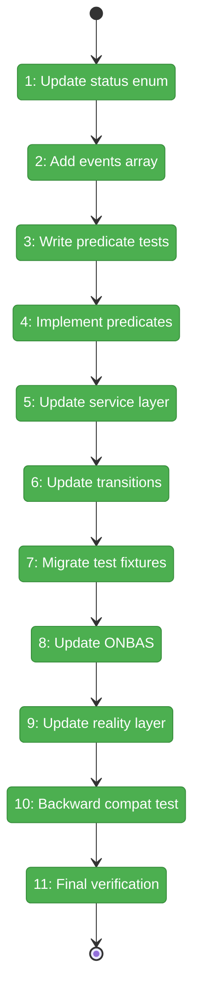
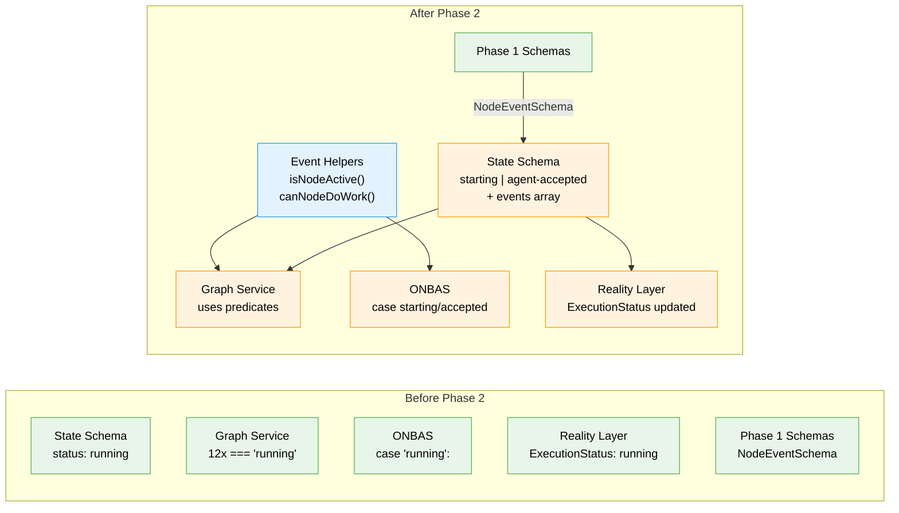

# Flight Plan: Phase 2 — State Schema Extension and Two-Phase Handshake

**Plan**: [node-event-system-plan.md](../../node-event-system-plan.md)
**Phase**: Phase 2: State Schema Extension and Two-Phase Handshake
**Generated**: 2026-02-07
**Status**: Landed

---

## Departure → Destination

**Where we are**: Phase 1 delivered the complete event type data model — 8 payload schemas, the NodeEventRegistry, event ID generation, and error codes E190-E195. All 94 Phase 1 tests pass (3523 total). The codebase still uses the single `'running'` status for all in-progress nodes, and there is no event log on node state entries.

**Where we're going**: By the end of this phase, the `'running'` status will be replaced by `'starting'` (orchestrator reserved) and `'agent-accepted'` (agent working). Every source file and test file that referenced `'running'` will use the new statuses. Node state entries will have an optional `events` array ready for Phase 3's `raiseEvent()`. A developer running `just fft` will see the full test suite pass with the new two-phase handshake model.

---

## Flight Status

<!-- Updated by /plan-6: pending → active → done. Use blocked for problems/input needed. -->

**Legend**: grey = pending | yellow = active | red = blocked/needs input | green = done

---

## Stages

<!-- Updated by /plan-6 during implementation: [ ] → [~] → [x] -->

- [x] **Stage 1: Update status enum** — remove `'running'`, add `'starting'` + `'agent-accepted'` to `NodeExecutionStatusSchema` (`schemas/state.schema.ts`)
- [x] **Stage 2: Add events array** — add `events: z.array(NodeEventSchema).optional()` to `NodeStateEntrySchema` (`schemas/state.schema.ts`)
- [x] **Stage 3: Write predicate tests** — TDD red phase for `isNodeActive()` and `canNodeDoWork()` (`test/.../032-node-event-system/event-helpers.test.ts` — new file)
- [x] **Stage 4: Implement predicates** — create `isNodeActive()` and `canNodeDoWork()` in feature folder (`features/032-node-event-system/event-helpers.ts` — new file)
- [x] **Stage 5: Update service layer** — replace 12 `'running'` references with predicates and new statuses (`services/positional-graph.service.ts`)
- [x] **Stage 6: Update transitions** — rewrite valid-transitions map for `starting` and `agent-accepted` (`services/positional-graph.service.ts`)
- [x] **Stage 7: Migrate test fixtures** — update `'running'` references across ~12 positional-graph test files to use `'starting'` or `'agent-accepted'`
- [x] **Stage 8: Update ONBAS** — replace `case 'running':` with `case 'starting': case 'agent-accepted':` (`features/030-orchestration/onbas.ts`)
- [x] **Stage 9: Update reality layer** — update type unions, schema enum, builder filter, fake ONBAS, and interface types (5 files in `features/030-orchestration/` + `interfaces/`)
- [x] **Stage 10: Backward compat test** — verify old state.json without events parses correctly (`test/.../032-node-event-system/backward-compat.test.ts` — new file)
- [x] **Stage 11: Final verification** — run `just fft`, confirm full test suite green

---

## Architecture: Before & After

**Legend**: existing (green, unchanged) | changed (orange, modified) | new (blue, created)

---

## Acceptance Criteria

- [x] Two new statuses (`starting`, `agent-accepted`) replace `running` (AC-6)
- [x] `events` array on NodeStateEntry is optional (AC-17)
- [x] All existing tests updated and passing
- [x] Old state.json files parse without error (AC-17)
- [x] `just fft` clean

## Goals & Non-Goals

**Goals**:
- Replace `'running'` with `'starting'` + `'agent-accepted'` in all schemas and code
- Add optional `events` array to node state entries
- Create `isNodeActive()` and `canNodeDoWork()` predicate helpers
- Update ONBAS, reality layer, and all service references
- Migrate all test fixtures to new status values
- Verify backward compatibility with existing state files

**Non-Goals**:
- `raiseEvent()` write path (Phase 3)
- Event handlers and state transitions via events (Phase 4)
- Service method wrappers routing through events (Phase 5)
- CLI commands (Phase 6)
- ONBAS reading event log (Phase 7 — this phase only updates status switch)
- Web UI / E2E test updates (outside Plan 032 scope)

---

## Checklist

- [x] T001: Update `NodeExecutionStatusSchema` enum (CS-2)
- [x] T002: Add events array to `NodeStateEntrySchema` (CS-1)
- [x] T003: Write predicate tests — RED (CS-1)
- [x] T004: Implement predicates — GREEN (CS-1)
- [x] T005: Update service layer — replace `'running'` refs (CS-3)
- [x] T006: Update `transitionNodeState()` valid-states map (CS-2)
- [x] T007: Migrate test fixtures (CS-2)
- [x] T008: Update ONBAS switch cases (CS-2)
- [x] T009: Update FakeONBAS, reality, interfaces (CS-1)
- [x] T010: Backward compatibility test (CS-1)
- [x] T011: `just fft` verification (CS-1)

---

## PlanPak

Active — new files organized under `features/032-node-event-system/`. Cross-plan edits to 7 files in `schemas/`, `services/`, `interfaces/`, and `features/030-orchestration/`.
