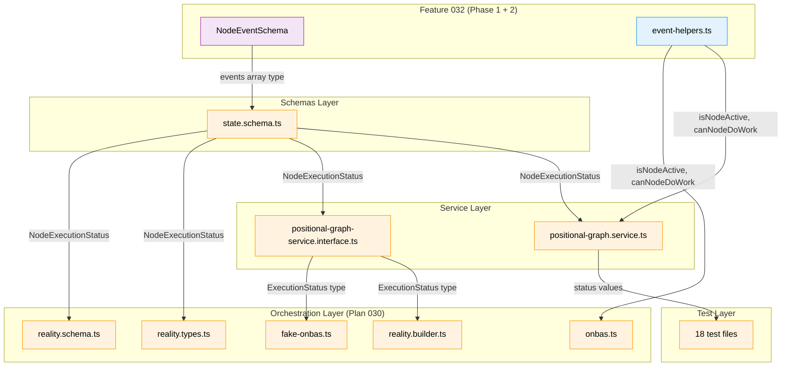

# Phase 2: State Schema Extension and Two-Phase Handshake -- Tasks & Alignment Brief

**Spec**: [node-event-system-spec.md](../../node-event-system-spec.md)
**Plan**: [node-event-system-plan.md](../../node-event-system-plan.md)
**Date**: 2026-02-07

---

## Executive Briefing

### Purpose

This phase performs the breaking schema change that all downstream phases depend on. It replaces the single `'running'` node status with the two-phase handshake statuses (`'starting'`, `'agent-accepted'`), adds the optional `events` array to `NodeStateEntrySchema`, and updates every reference to the old status across the codebase. After this phase, the state model is ready for Phase 3's `raiseEvent()` write path.

### What We're Building

- **Updated `NodeExecutionStatusSchema`**: remove `'running'`, add `'starting'` and `'agent-accepted'`
- **Events array on `NodeStateEntrySchema`**: `events: z.array(NodeEventSchema).optional()` for backward compatibility
- **Helper predicates**: `isNodeActive(status)` and `canNodeDoWork(status)` in `features/032-node-event-system/event-helpers.ts`
- **Service layer updates**: All 12 `=== 'running'` references in `positional-graph.service.ts` replaced with predicate helpers
- **Updated valid transitions map**: New transition rules for `starting` and `agent-accepted`
- **ONBAS / reality layer updates**: Switch cases, type unions, and builder logic for new statuses
- **Test fixture migration**: All 49 test references to `'running'` across 18 test files updated
- **Backward compatibility test**: Old `state.json` without `events` parses without error

### User Value

Agents get a clearer lifecycle signal: `'starting'` means the orchestrator reserved the node (don't work yet), `'agent-accepted'` means the agent acknowledged and can proceed. This replaces the ambiguous `'running'` which conflated reservation with active work. The `events` array enables Phase 3's audit trail without breaking existing state files.

### Example

```typescript
// Before Phase 2
nodeState.status === 'running'  // ambiguous: reserved or working?

// After Phase 2
nodeState.status === 'starting'        // orchestrator reserved — agent should accept
nodeState.status === 'agent-accepted'  // agent acknowledged — work in progress

// Predicates replace raw status checks
isNodeActive('starting')        // true — node is in-flight
isNodeActive('agent-accepted')  // true — node is in-flight
isNodeActive('complete')        // false — done
canNodeDoWork('starting')       // false — must accept first
canNodeDoWork('agent-accepted') // true — can save output, ask questions, complete
```

---

## Objectives & Scope

### Objective

Extend `state.schema.ts` with the events array and new node statuses (`starting`, `agent-accepted`), then update all existing code that references the old `running` status. This is the breaking change — everything downstream adapts.

### Goals

- Replace `'running'` with `'starting'` + `'agent-accepted'` in `NodeExecutionStatusSchema`
- Add optional `events` array to `NodeStateEntrySchema` using Phase 1's `NodeEventSchema`
- Create `isNodeActive()` and `canNodeDoWork()` predicate helpers (TDD)
- Update all 12 `'running'` references in `positional-graph.service.ts`
- Update valid transition states in `transitionNodeState()`
- Update ONBAS (`case 'running':` to `case 'starting':` + `case 'agent-accepted':`)
- Update FakeONBAS, reality types, reality schema, reality builder
- Update interface types (`ExecutionStatus`, `StartNodeResult`, `AnswerQuestionResult`)
- Update all 49 test references across 18 test files
- Verify backward compatibility: old `state.json` without events parses correctly
- `just fft` clean

### Non-Goals

- `raiseEvent()` write path (Phase 3)
- Event handlers and state transitions via events (Phase 4)
- Service method wrappers routing through events (Phase 5)
- CLI commands (Phase 6)
- ONBAS reading event log instead of flat fields (Phase 7 — this phase only updates the status switch)
- Renaming `runningNodeIds` accessors to `activeNodeIds` (can be done but low priority — comment what it means)
- Web UI test updates (`test/unit/web/`) — these reference `'running'` but are outside Plan 032 scope
- E2E test updates (`test/e2e/`) — tracked but may be deferred if they require full integration

---

## Pre-Implementation Audit

### Summary

| # | File | Action | Origin | Modified By | Recommendation |
|---|------|--------|--------|-------------|----------------|
| 1 | `schemas/state.schema.ts` | Modify | Plan 026 | Plan 028 | cross-plan-edit: update enum + add events field |
| 2 | `services/positional-graph.service.ts` | Modify | Plan 026 | Plan 028, Plan 029 | cross-plan-edit: 12 sites, use predicates |
| 3 | `interfaces/positional-graph-service.interface.ts` | Modify | Plan 026 | Plan 028, Plan 029 | cross-plan-edit: update type unions |
| 4 | `features/030-orchestration/onbas.ts` | Modify | Plan 030 | N/A | cross-plan-edit: switch cases |
| 5 | `features/030-orchestration/fake-onbas.ts` | Modify | Plan 030 | N/A | cross-plan-edit: status filter |
| 6 | `features/030-orchestration/reality.types.ts` | Modify | Plan 030 | N/A | cross-plan-edit: type union |
| 7 | `features/030-orchestration/reality.schema.ts` | Modify | Plan 030 | N/A | cross-plan-edit: Zod enum |
| 8 | `features/030-orchestration/reality.builder.ts` | Modify | Plan 030 | N/A | cross-plan-edit: node filtering |
| 9 | `features/032-node-event-system/event-helpers.ts` | Create | Plan 032 | N/A | new file |
| 10 | `features/032-node-event-system/index.ts` | Modify | Plan 032 P1 | N/A | add predicate exports |

All paths relative to `packages/positional-graph/src/`.

### Phase 1 Dependency Verification

All Phase 1 deliverables verified present and operational:

| Dependency | Status | Location |
|------------|--------|----------|
| `NodeEventSchema` | PASS | `features/032-node-event-system/node-event.schema.ts` L13-43 |
| `NodeEvent` type | PASS | Same file L45 (via `z.infer`) |
| Barrel export of `NodeEvent` | PASS | `features/032-node-event-system/index.ts` L17 |
| 94 Phase 1 tests | PASS | 3523 total tests, 0 failures |

### Blast Radius

**Source files**: 7 files, 21 `'running'` references
**Test files**: 18 files, 49 `'running'` references
**Total**: 25 files, 70 references

The enum change is the highest-impact single change in this plan. TypeScript `never` exhaustiveness checks in switch statements will catch most missing cases at compile time.

---

## Requirements Traceability

| Spec AC | Requirement | Task(s) | Verification |
|---------|-------------|---------|--------------|
| AC-6 | Two-phase handshake: `starting` → `agent-accepted` | T001, T003-T004, T005, T006 | Unit tests for predicates + transition map + service behavior |
| AC-17 | State schema backward compatible (events optional) | T002, T010 | Backward compat test: old state.json parses |
| Finding 01 | Status enum replacement cascades | T001, T005, T007, T008, T009 | `pnpm typecheck` + all tests green |
| Finding 02 | Service guards on `agent-accepted` not `starting` | T003-T004, T005 | `canNodeDoWork()` predicate tests |
| Finding 09 | Test fixtures must migrate | T007 | All 18 test files updated |

---

## Architecture Map



**Legend**: new (blue, created) | changed (orange, modified) | Phase 1 (purple, existing from P1) | existing (green, unchanged)

### Task-to-Component Mapping

| Component | Tasks | Change Description |
|-----------|-------|-------------------|
| `state.schema.ts` | T001, T002 | Remove `'running'`, add `'starting'` + `'agent-accepted'`, add `events` array |
| `event-helpers.ts` | T003, T004 | New file: `isNodeActive()` + `canNodeDoWork()` predicates |
| `positional-graph.service.ts` | T005 | Replace 12 `'running'` refs with predicates; `startNode()` → `'starting'` |
| `transitionNodeState()` | T006 | New valid-transitions map for `starting`, `agent-accepted` |
| ~12 positional-graph test files | T007 | Migrate `'running'` → `'starting'` / `'agent-accepted'` (web/CLI tests deferred) |
| `onbas.ts` | T008 | `case 'starting':` + `case 'agent-accepted':` fall-through |
| `fake-onbas.ts`, `reality.*` | T009 | Update type unions, schema enum, builder filter |
| Backward compat | T010 | Old state.json without events parses correctly |
| Final verification | T011 | `just fft` clean |

---

## Tasks

| # | Status | Task | CS | Abs. Path(s) | Subtasks | Success Criteria |
|---|--------|------|----|-------------|----------|------------------|
| T001+T002 | [x] | Update `state.schema.ts`: new status enum + events array | 2 | `packages/positional-graph/src/schemas/state.schema.ts` | 1. Remove `'running'` from enum, add `'starting'` and `'agent-accepted'` 2. Import `NodeEventSchema` from Phase 1 feature 3. Add `events: z.array(NodeEventSchema).optional()` to `NodeStateEntrySchema` 4. Run `pnpm typecheck` to identify cascading errors (will fail — expected) | Schema compiles; old `'running'` rejected; new values accepted; events field optional; old state shapes still parse (DYK #5: batch both changes) |
| T003 | [x] | Write tests for `isNodeActive()` and `canNodeDoWork()` predicates | 1 | `test/unit/positional-graph/features/032-node-event-system/event-helpers.test.ts` | 1. Test `isNodeActive` for each status value 2. Test `canNodeDoWork` for each status value 3. Include edge cases: `'starting'` is active but cannot do work | RED: Tests fail (file doesn't exist yet). `isNodeActive(starting)` true, `isNodeActive(agent-accepted)` true, `isNodeActive(complete)` false; `canNodeDoWork(agent-accepted)` true, `canNodeDoWork(starting)` false, `canNodeDoWork(waiting-question)` false (DYK #4: agent is stopped) |
| T004 | [x] | Implement `isNodeActive()` and `canNodeDoWork()` predicates | 1 | `packages/positional-graph/src/features/032-node-event-system/event-helpers.ts`, `packages/positional-graph/src/features/032-node-event-system/index.ts` | 1. Create `event-helpers.ts` with both predicates 2. Export from barrel `index.ts` | GREEN: All tests from T003 pass |
| T005 | [x] | Update `positional-graph.service.ts`: replace all `=== 'running'` with predicates + new statuses | 3 | `packages/positional-graph/src/services/positional-graph.service.ts` | 1. Import predicates from 032 feature 2. `startNode()` transitions to `'starting'` (was `'running'`) 3. `saveOutputData/File` guard: `canNodeDoWork(status)` 4. `endNode` guard: `canNodeDoWork(status)` 5. `askQuestion` guard: `canNodeDoWork(status)`; also fix dead-code fallback at line 2002 `{ status: 'running' }` → delete or change to `'agent-accepted'` (DYK #3) 6. `answerQuestion`: set status to `'starting'` (was `'running'`) — agent must re-accept after answer (DYK #1) 7. `getLineStatus/getStatus`: use `isNodeActive()` for running-node counts 8. Run `pnpm typecheck` — must be clean | `startNode()` produces `'starting'`; `answerQuestion()` produces `'starting'`; guards use `canNodeDoWork()`; graph status uses `isNodeActive()`; typecheck clean |
| T006 | [x] | Update `transitionNodeState()` valid-states map | 2 | `packages/positional-graph/src/services/positional-graph.service.ts` | 1. Add `pending→starting` transition 2. Add `starting→agent-accepted` transition 3. Add `starting→blocked-error` transition 4. Add `agent-accepted→waiting-question` transition 5. Add `agent-accepted→complete` transition 6. Add `agent-accepted→blocked-error` transition 7. Add `waiting-question→starting` transition (DYK #1: answer resumes via two-phase handshake) 8. Remove old `pending→running` and `running→*` transitions 9. Set `started_at` on `pending→starting` (was on `pending→running`) | New transitions compile and match Workshop #01 event-state mapping + DYK #1 resume path |
| T007 | [x] | Update all test fixtures from `'running'` to `'starting'`/`'agent-accepted'` | 2 | See blast radius (~12 positional-graph test files + integration tests) | 1. `test/unit/positional-graph/` files: update status literals (~9 files) 2. `test/unit/positional-graph/features/030-orchestration/` files: update (~2 files) 3. `test/integration/` files: update status literals (~1-2 files) 4. Decide per-test whether `'starting'` or `'agent-accepted'` is correct (most will be `'agent-accepted'` since tests exercise work-in-progress behavior) 5. Web/CLI/E2E test files: update only if they compile-fail from the enum change; defer string-literal-only references | All `test/unit/positional-graph/` and `test/integration/positional-graph/` tests compile and pass |
| T008 | [x] | Update ONBAS: replace `case 'running':` with new status cases | 2 | `packages/positional-graph/src/features/030-orchestration/onbas.ts` | 1. `visitNode` switch: add `case 'starting': case 'agent-accepted': return null;` 2. `diagnoseStuckLine`: add `case 'starting': case 'agent-accepted': hasRunning = true;` 3. Remove old `case 'running':` lines | ONBAS treats `'starting'` and `'agent-accepted'` nodes as in-progress (skip in walk, count as running in diagnosis) |
| T009 | [x] | Update FakeONBAS, reality types, schema, builder, and interface types | 1 | `packages/positional-graph/src/features/030-orchestration/fake-onbas.ts`, `packages/positional-graph/src/features/030-orchestration/reality.types.ts`, `packages/positional-graph/src/features/030-orchestration/reality.schema.ts`, `packages/positional-graph/src/features/030-orchestration/reality.builder.ts`, `packages/positional-graph/src/interfaces/positional-graph-service.interface.ts` | 1. `reality.types.ts`: replace `'running'` with `'starting' \| 'agent-accepted'` in ExecutionStatus 2. `reality.schema.ts`: update ExecutionStatusSchema enum 3. `reality.builder.ts`: update `runningNodeIds` filter to use `isNodeActive()` or match both new statuses 4. `fake-onbas.ts`: update `buildFakeReality` status filter 5. Interface: update `ExecutionStatus` comment, `StartNodeResult.status` to `'starting'`, `AnswerQuestionResult.status` to `'starting'` (DYK #1: orchestrator must not set agent-accepted) | All type unions and schemas use new statuses; typecheck clean |
| T010 | [x] | Write backward compatibility test: old state.json without events | 1 | `test/unit/positional-graph/features/032-node-event-system/backward-compat.test.ts` | 1. Parse old-format state.json (no events array) through StateSchema 2. Parse new-format state.json (with events array) through StateSchema 3. Verify both succeed | Old state.json parses without error; nodes without events work correctly (AC-17) |
| T011 | [x] | Run `just fft` and verify full test suite | 1 | N/A | 1. Run `just fft` 2. All tests green 3. No lint errors 4. No typecheck errors | Full suite green; `just fft` clean |

---

## Alignment Brief

### Open Decisions

1. **`runningNodeIds` rename**: The `PositionalGraphReality` type has `runningNodeIds`. Should this be renamed to `activeNodeIds` to match the new semantics? **Recommendation**: Keep `runningNodeIds` for now with a comment explaining it includes both `starting` and `agent-accepted`. Rename is cosmetic and can be done in a later phase to minimize blast radius.

2. **Web/CLI/E2E test files**: 7 test files outside `test/unit/positional-graph/` and `test/integration/positional-graph/` reference `'running'`. These are in `test/unit/web/`, `test/unit/cli/`, `test/contracts/`, and `test/e2e/`. **Recommendation**: Update them in T007 if they compile-fail due to the enum change. If they only use string literals (not the enum), defer to avoid scope creep.

3. **`StartNodeResult.status` return value**: Currently returns `'running'`. After Phase 2 it should return `'starting'` since `startNode()` transitions to `starting`. The agent then calls `node:accepted` (Phase 3+) to move to `agent-accepted`. **Decision**: Return `'starting'` in T005/T009.

4. **`answerQuestion()` post-answer status** (DYK #1 — Decided): The orchestrator must NOT set `agent-accepted` — only the agent can. After answering, `answerQuestion()` sets status to `'starting'`, reusing the two-phase handshake for the resume path: `waiting-question → starting → agent-accepted`. This means the agent must re-accept after a question is answered. Transition `waiting-question→starting` added to T006.

### Known Risks

| Risk | Likelihood | Impact | Mitigation |
|------|------------|--------|------------|
| Cascading breakage from enum change | High | High | TypeScript `never` exhaustiveness checks + `pnpm typecheck`; T001 intentionally creates errors that T005-T009 resolve |
| Test file count is large (18 files, 49 refs) | Medium | Medium | Systematic search-and-replace with per-test review of whether `starting` or `agent-accepted` is correct |
| Cross-plan file edits (7 source files from Plans 026/028/029/030) | Medium | Medium | Each change is minimal (status literal swap or predicate call); no behavioral changes beyond status values |
| Old state.json incompatibility | Low | High | `events` field is `.optional()`; T010 explicitly tests backward compat |

### Constitution Compliance

- **Interface-first**: `isNodeActive()` and `canNodeDoWork()` signatures defined before implementation (T003 before T004)
- **Fakes over mocks**: No `vi.mock`/`jest.mock` — predicates are pure functions tested directly
- **TDD**: RED (T003) → GREEN (T004) for predicates; schema changes verified by existing test suite
- **Test Doc**: All new test files include 5-field comment blocks
- **`just fft`**: Mandatory final verification in T011

### Phase Boundary Checklist

**Entering Phase 2**:
- [x] Phase 1 all tasks complete (12/12)
- [x] Phase 1 test suite: 94 tests, 0 failures (3523 total)
- [x] `NodeEventSchema` and `NodeEvent` type exported and available
- [x] No blocking TODOs in Phase 1 files
- [x] Pre-Implementation Audit: all files verified present

**Exiting Phase 2** (success criteria):
- [x] `NodeExecutionStatusSchema` has `'starting'` + `'agent-accepted'`, no `'running'`
- [x] `NodeStateEntrySchema` has optional `events` array
- [x] `isNodeActive()` and `canNodeDoWork()` predicates tested and exported
- [x] All 12 service.ts references updated
- [x] Valid-transitions map updated for new statuses
- [x] ONBAS, FakeONBAS, reality layer updated
- [x] All test fixtures migrated
- [x] Backward compat test passes
- [x] `just fft` clean

---

## Phase Footnote Stubs

[^2]: Phase 2 complete (2026-02-07). Replaced `'running'` with `'starting'` + `'agent-accepted'` across 7 source files and 13 test files. New files: `event-helpers.ts` (predicates), `event-helpers.test.ts` (10 tests), `backward-compat.test.ts` (6 tests). Key discovery: two-phase handshake requires `simulateAgentAccept()` test helpers until Phase 3-4 delivers `acceptNode()`. DYK #1 enforced: `answerQuestion()` returns `'starting'`, not `'agent-accepted'`.
  - `file:packages/positional-graph/src/schemas/state.schema.ts` — enum + events array
  - `function:packages/positional-graph/src/features/032-node-event-system/event-helpers.ts:isNodeActive`
  - `function:packages/positional-graph/src/features/032-node-event-system/event-helpers.ts:canNodeDoWork`
  - `file:packages/positional-graph/src/services/positional-graph.service.ts` — 10 sites updated
  - `file:packages/positional-graph/src/features/030-orchestration/onbas.ts` — switch cases
  - `file:packages/positional-graph/src/features/030-orchestration/fake-onbas.ts` — status filter
  - `file:packages/positional-graph/src/features/030-orchestration/reality.types.ts` — type union
  - `file:packages/positional-graph/src/features/030-orchestration/reality.schema.ts` — Zod enum
  - `file:packages/positional-graph/src/interfaces/positional-graph-service.interface.ts` — result types

---

## Requirements Flow

### Coverage Matrix

| AC | Description | Flow Summary | Files in Flow | Tasks | Status |
|----|-------------|-------------|---------------|-------|--------|
| AC-6 | Two-phase handshake (`starting` / `agent-accepted`) | state.schema → service (startNode, guards, getLineStatus) → ONBAS → reality layer | 8 | T001,T005,T006,T008,T009 | Complete |
| AC-17 | State schema backward compat (events optional) | state.schema → service (loadState/safeParse) | 2 | T002,T010 | Complete |
| Tests | All existing tests updated and passing | 12 positional-graph test files | 12 | T007,T011 | Complete |

### Gaps Found

**Gap 1**: Test file count was estimated at 18 — actual core scope is ~12 positional-graph/integration files. Web/CLI/E2E files (~9) use string literals not the enum type and can be deferred. **Resolved**: T007 scoped to positional-graph tests with fallback for compile-failing external tests.

**Gap 2**: `getLineStatus()` line 1148 filters `nodes.filter(n => n.status === 'running')` for the `runningNodes` bucket used in graph status computation. If missed, graphs with `starting`/`agent-accepted` nodes would not show as `in_progress`. **Resolved**: T005 subtask 7 explicitly covers `getLineStatus/getStatus` using `isNodeActive()`.

**Gap 3**: Barrel re-export files (`schemas/index.ts`, `interfaces/index.ts`, `features/030-orchestration/index.ts`) propagate changed types but need no code changes — they use `export *` patterns. **No action needed**.

### Orphan Files

All task table files map to at least one acceptance criterion. No orphans detected.

---

## Evidence Artifacts

- **Pre-Implementation Audit**: Verified 2026-02-07 — all Phase 1 deliverables present, all target files accessible
- **Blast Radius Analysis**: 7 source files (21 refs), 18 test files (49 refs), 70 total `'running'` references
- **Workshop Reference**: [02-event-schema-and-storage.md](../../workshops/02-event-schema-and-storage.md) — concrete data shapes for new schema
- **ADR Note**: Plan references "ADR-0008" for module registration but actual ADR is ADR-0009 (documentation-only discrepancy)

---

## Discoveries & Learnings

1. **`transitionNodeState()` is not a centralized map** — it's a generic helper that accepts `validFromStates` from each caller. The "valid transitions map" is distributed, not centralized. T006 required no additional changes beyond what T005 already did.

2. **Two-phase handshake creates a systematic test gap** — every test that calls `startNode()` then does work now needs a `simulateAgentAccept()` step to transition `'starting' → 'agent-accepted'`. This is because `canNodeDoWork()` only returns true for `'agent-accepted'`, and there's no `acceptNode()` API yet (Phase 3-4). Four test files needed this helper: execution-lifecycle, output-storage, input-retrieval, question-answer.

3. **DYK #1 is a recurring trap for subagents** — parallel subagents updating test fixtures independently set `answerQuestion()` result status to `'agent-accepted'` instead of `'starting'`. This is the most common error pattern. The `answerQuestion() → 'starting'` rule (orchestrator must not set agent-accepted) should be prominent in any Phase 3+ task briefs.

4. **Multi-question test requires re-accept** — in `question-answer.test.ts`, the "stores multiple questions from same node" test needs a re-accept after `answerQuestion()` because the answer transitions the node back to `'starting'`, and the second `askQuestion()` requires `canNodeDoWork()` (i.e., `'agent-accepted'`).

5. **Test file count was overestimated** — plan estimated 18 test files with 49 references. Actual core scope was 9 positional-graph + integration + E2E files. Web/CLI test files use string literals not the enum type and didn't need updating.

---

## Critical Insights (2026-02-07)

| # | Insight | Decision |
|---|---------|----------|
| 1 | `answerQuestion()` sets status — orchestrator must not set `agent-accepted`, only agents can | Set to `'starting'`; resume reuses two-phase handshake: `waiting-question → starting → agent-accepted`. Added `waiting-question→starting` to T006. |
| 2 | `AnswerQuestionResult.status` type must match DYK #1 | Changed T009 subtask 5 from `'agent-accepted'` to `'starting'` |
| 3 | `askQuestion()` line 2002 has dead-code fallback `{ status: 'running' }` | Delete or change in T005; flagged for reviewer |
| 4 | `canNodeDoWork('waiting-question')` must return false — agent is stopped | Added explicit test case to T003 success criteria |
| 5 | T001 and T002 both edit `state.schema.ts` — batch them | Merged into single T001+T002 task |

Action items: Concept drift audit found plan deliverables missing DYK #1 — updated `node-event-system-plan.md` Phase 2 deliverables.
