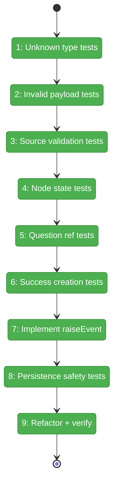
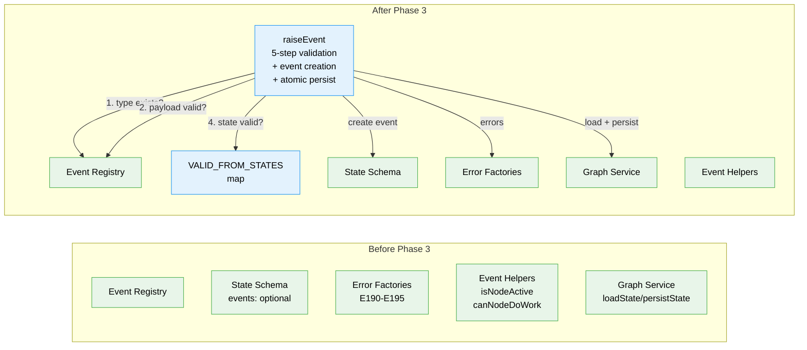

# Flight Plan: Phase 3 — raiseEvent Core Write Path

**Plan**: [node-event-system-plan.md](../../node-event-system-plan.md)
**Phase**: Phase 3: raiseEvent Core Write Path
**Generated**: 2026-02-07
**Status**: Landed

---

## Departure → Destination

**Where we are**: Phases 1 and 2 delivered the complete event data model and the two-phase handshake. The registry knows about 8 event types with Zod-validated payload schemas. The state schema has an optional `events` array on every node entry. Nodes now transition through `starting` and `agent-accepted` instead of `running`. Six error factories (E190-E195) are ready to use. But nothing actually writes events yet — the `events` array sits empty in every node.

**Where we're going**: By the end of this phase, any caller can raise a validated event on a node and have it persisted atomically. The `raiseEvent()` function will accept an event type, payload, and source, run a 5-step validation pipeline (type exists, payload valid, source allowed, node in correct state, question references valid), create a `NodeEvent` record with a unique ID and `status: 'new'`, append it to the node's event log, and persist state. A developer can call `raiseEvent(deps, 'my-graph', 'node-1', 'node:accepted', {}, 'agent')` and get back the created event — or a clear error explaining exactly what went wrong.

---

## Flight Status

<!-- Updated by /plan-6: pending → active → done. Use blocked for problems/input needed. -->

**Legend**: grey = pending | yellow = active | red = blocked/needs input | green = done

---

## Stages

<!-- Updated by /plan-6 during implementation: [ ] → [~] → [x] -->

- [x] **Stage 1: Unknown type validation tests** — write tests asserting E190 error when `raiseEvent` receives an unregistered event type (`raise-event.test.ts` — new file)
- [x] **Stage 2: Invalid payload validation tests** — write tests asserting E191 error with field-level Zod details for bad payloads (`raise-event.test.ts`)
- [x] **Stage 3: Source validation tests** — write tests asserting E192 error when source is not in `allowedSources` (`raise-event.test.ts`)
- [x] **Stage 4: Node state validation tests** — write tests asserting E193 error per the Workshop #02 Valid States table, including implicit-pending nodes (`raise-event.test.ts`)
- [x] **Stage 5: Question reference tests** — write tests asserting E194 for nonexistent questions and E195 for already-answered questions (`raise-event.test.ts`)
- [x] **Stage 6: Success creation tests** — write tests verifying event ID format, `status: 'new'`, timestamps, `stops_execution` flag, append to events array, and state persistence (`raise-event.test.ts`)
- [x] **Stage 7: Implement raiseEvent** — create `raiseEvent()` function with `RaiseEventDeps` parameter bag, `VALID_FROM_STATES` map, 5-step validation pipeline, event creation, and barrel export (`raise-event.ts` — new file, `index.ts` — modify)
- [x] **Stage 8: Persistence safety tests** — prove that validation failures leave the events array unchanged and never call `persistState` (`raise-event.test.ts`)
- [x] **Stage 9: Refactor and verify** — run `just fft`, confirm full test suite green

---

## Architecture: Before & After

**Legend**: existing (green, unchanged) | changed (orange, modified) | new (blue, created)

---

## Acceptance Criteria

- [x] 5-step validation catches all invalid events (AC-3, AC-4, AC-5)
- [x] Valid events create NodeEvent records with correct fields (AC-2)
- [x] Events appended to node's events array in state.json
- [x] Invalid events never persisted
- [x] Error messages include actionable guidance (AC-3)
- [x] `just fft` clean

## Goals & Non-Goals

**Goals**:
- Create the `raiseEvent()` function with 5-step validation
- Define the `VALID_FROM_STATES` constant mapping event types to allowed node states
- Create `NodeEvent` records with all required fields
- Append events to node's `events` array and persist atomically
- Return actionable errors (E190-E195) on validation failure
- Prove that invalid events never reach persistence

**Non-Goals**:
- Event handlers / side effects (Phase 4)
- `deriveBackwardCompatFields()` backward-compat projections (Phase 4)
- Service method wrappers (Phase 5)
- CLI commands (Phase 6)
- Integration with `IPositionalGraphService` (Phase 5 — `raiseEvent` is standalone)

---

## Checklist

- [x] T001: Write tests for unknown type validation — E190 (CS-1)
- [x] T002: Write tests for invalid payload validation — E191 (CS-2)
- [x] T003: Write tests for unauthorized source validation — E192 (CS-1)
- [x] T004: Write tests for wrong node state — E193 + VALID_FROM_STATES (CS-2)
- [x] T005: Write tests for question reference validation — E194/E195 (CS-2)
- [x] T006: Write tests for successful event creation and persistence (CS-2)
- [x] T007: Implement `raiseEvent()` with VALID_FROM_STATES and barrel export (CS-3)
- [x] T008: Write tests proving validation fails before persistence (CS-1)
- [x] T009: Refactor and verify with `just fft` (CS-1)

---

## PlanPak

Active — new files organized under `features/032-node-event-system/`. Cross-plan edits to 0 files in this phase (all changes within feature folder + barrel export).
