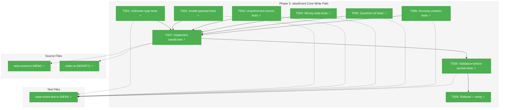

# Phase 3: raiseEvent Core Write Path — Tasks & Alignment Brief

**Spec**: [node-event-system-spec.md](../../node-event-system-spec.md)
**Plan**: [node-event-system-plan.md](../../node-event-system-plan.md)
**Date**: 2026-02-07

---

## Executive Briefing

### Purpose
This phase implements `raiseEvent()` — the single write path through which all node state changes will eventually flow. After this phase, any caller can raise a validated event on a node, have it appended to the node's event log in `state.json`, and receive the created event back. Validation catches bad events before they touch persistence.

### What We're Building
A standalone `raiseEvent()` function that:
- Validates in 5 ordered steps: type exists (E190) → payload valid (E191) → source allowed (E192) → node in valid state (E193) → question references valid (E194/E195)
- Creates a `NodeEvent` record with a unique ID, `status: 'new'`, `stops_execution` from registry, and ISO-8601 timestamp
- Appends the event to the node's `events` array in `state.json`
- Persists state atomically
- Returns the created event on success, or actionable errors on failure

### User Value
This is infrastructure — no direct user-facing change. It unblocks Phase 4 (event handlers that apply side effects), Phase 5 (service method wrappers), and ultimately the CLI event commands that agents will use.

### Example
```
// Success: event created and persisted
const result = await raiseEvent(deps, graphSlug, 'node-1', 'node:accepted', {}, 'agent');
// → { ok: true, event: { event_id: 'evt_18d5a3b2c00_a3f1', event_type: 'node:accepted', status: 'new', ... } }

// Failure: node in wrong state
const result = await raiseEvent(deps, graphSlug, 'node-1', 'node:accepted', {}, 'agent');
// → { ok: false, errors: [{ code: 'E193', message: "Event 'node:accepted' cannot be raised when node is in 'complete' state..." }] }
```

---

## Objectives & Scope

### Objective
Implement the `raiseEvent()` core write path as specified in the plan, covering the 5-step validation pipeline and event creation/persistence. This phase delivers the write path skeleton — handlers (Phase 4) will plug in later.

### Goals

- Create the `raiseEvent()` function with 5-step validation
- Define the `VALID_FROM_STATES` constant mapping event types to allowed node states
- Create `NodeEvent` records with all required fields
- Append events to node's `events` array and persist atomically
- Return actionable errors (E190-E195) on validation failure
- Prove that invalid events never reach persistence

### Non-Goals

- Event handlers / side effects (Phase 4 — `raiseEvent` creates events but does NOT apply status transitions, output writes, or timestamp updates)
- `deriveBackwardCompatFields()` (Phase 4 — backward-compat projections are NOT computed in Phase 3)
- Service method wrappers (Phase 5 — `endNode()`, `askQuestion()`, etc. are NOT modified)
- CLI commands (Phase 6)
- Integration with `IPositionalGraphService` (Phase 5 — `raiseEvent` is standalone, receives dependencies as parameters)

---

## Pre-Implementation Audit

### Summary
| File | Action | Origin | Modified By | Recommendation |
|------|--------|--------|-------------|----------------|
| `packages/positional-graph/src/features/032-node-event-system/raise-event.ts` | Create | N/A | N/A | keep-as-is |
| `packages/positional-graph/src/features/032-node-event-system/index.ts` | Modify | Plan 032 Phase 1 | Plan 032 Phase 2 | keep-as-is |
| `test/unit/positional-graph/features/032-node-event-system/raise-event.test.ts` | Create | N/A | N/A | keep-as-is |

### Compliance Check
No violations found. All files follow constitution mandates (TDD, fakes over mocks, kebab-case, Test Doc 5-field blocks).

### Key Finding
No existing function writes to the `.events` array on `NodeStateEntry`. This is the first write path for node events. The `events` field was added in Phase 2 but remains unused until this phase.

---

## Requirements Traceability

### Coverage Matrix
| AC | Description | Flow Summary | Files in Flow | Tasks | Status |
|----|-------------|--------------|---------------|-------|--------|
| AC-2 | NodeEvent created with correct lifecycle state | raiseEvent → validate → create event (generateEventId, status='new', stops_execution, timestamps) → append to events[] → persist | raise-event.ts, event-id.ts, node-event-registry.ts, state.schema.ts | T006, T007 | Planned |
| AC-3 (E190) | Unknown event type rejected | raiseEvent → registry.get(type) → undefined → eventTypeNotFoundError | raise-event.ts, node-event-registry.ts, event-errors.ts | T001, T007 | Planned |
| AC-3 (E191) | Invalid payload rejected with field-level errors | raiseEvent → registry.validatePayload() → Zod fail → eventPayloadValidationError | raise-event.ts, node-event-registry.ts, event-errors.ts | T002, T007, T008 | Planned |
| AC-4 (E192) | Unauthorized source rejected | raiseEvent → registration.allowedSources check → eventSourceNotAllowedError | raise-event.ts, event-errors.ts | T003, T007 | Planned |
| AC-5 (E193) | Wrong node state rejected | raiseEvent → loadState → VALID_FROM_STATES[type] → state mismatch → eventStateTransitionError | raise-event.ts, event-errors.ts | T004, T007 | Planned |
| AC-5 (E194/E195) | Question reference validation | raiseEvent → find ask event in log → E194 if missing, E195 if answered | raise-event.ts, event-errors.ts | T005, T007 | Planned |

### Gaps Found
None — all acceptance criteria have complete file coverage after incorporating the `VALID_FROM_STATES` map into `raise-event.ts`.

### Orphan Files
None.

---

## Architecture Map

### Component Diagram
<!-- Status: grey=pending, orange=in-progress, green=completed, red=blocked -->
<!-- Updated by plan-6 during implementation -->



### Task-to-Component Mapping

<!-- Status: Pending | In Progress | Complete | Blocked -->

| Task | Component(s) | Files | Status | Comment |
|------|-------------|-------|--------|---------|
| T001 | Validation: type lookup | raise-event.test.ts | ✅ Complete | 2 tests: E190 error + available types listed |
| T002 | Validation: payload | raise-event.test.ts | ✅ Complete | 3 tests: missing fields, extra fields (.strict), schema hint |
| T003 | Validation: source | raise-event.test.ts | ✅ Complete | 2 tests: unauthorized source, valid source acceptance |
| T004 | Validation: node state | raise-event.test.ts | ✅ Complete | 5 tests: complete node, starting node, waiting-question, implicit pending, undefined nodes |
| T005 | Validation: question refs | raise-event.test.ts | ✅ Complete | 3 tests: nonexistent ask, undefined events, already answered |
| T006 | Event creation | raise-event.test.ts | ✅ Complete | 5 tests: fields, stops_execution, append, updated_at, init events array |
| T007 | Core implementation | raise-event.ts, index.ts | ✅ Complete | 22 tests GREEN; barrel export added |
| T008 | Persistence safety | raise-event.test.ts | ✅ Complete | 2 tests: no persist on failure, events unchanged |
| T009 | Quality gate | all | ✅ Complete | 3563 tests pass, `just fft` clean |

---

## Tasks

| Status | ID | Task | CS | Type | Dependencies | Absolute Path(s) | Validation | Subtasks | Notes |
|--------|------|------|-----|------|-------------|------------------|-----------|----------|-------|
| [x] | T001 | Write tests for `raiseEvent` validation: unknown type (E190) | 1 | Test | – | `/home/jak/substrate/030-positional-orchestrator/test/unit/positional-graph/features/032-node-event-system/raise-event.test.ts` | Returns E190 error with available types listed; event not persisted | – | RED [^3] |
| [x] | T002 | Write tests for `raiseEvent` validation: invalid payload (E191) | 2 | Test | – | `/home/jak/substrate/030-positional-orchestrator/test/unit/positional-graph/features/032-node-event-system/raise-event.test.ts` | Returns E191 error with field-level Zod details and schema hint; event not persisted | – | RED [^3] |
| [x] | T003 | Write tests for `raiseEvent` validation: unauthorized source (E192) | 1 | Test | – | `/home/jak/substrate/030-positional-orchestrator/test/unit/positional-graph/features/032-node-event-system/raise-event.test.ts` | Returns E192 error listing allowed sources; event not persisted | – | RED [^3] |
| [x] | T004 | Write tests for `raiseEvent` validation: wrong node state (E193) including VALID_FROM_STATES map | 2 | Test | – | `/home/jak/substrate/030-positional-orchestrator/test/unit/positional-graph/features/032-node-event-system/raise-event.test.ts` | Returns E193 error listing valid states for event type; tests per Workshop #02 §Valid States table; includes implicit-pending node test | – | RED [^3] |
| [x] | T005 | Write tests for `raiseEvent` validation: question refs (E194, E195) | 2 | Test | – | `/home/jak/substrate/030-positional-orchestrator/test/unit/positional-graph/features/032-node-event-system/raise-event.test.ts` | E194 for nonexistent question, E195 for already-answered question; event not persisted | – | RED [^3] |
| [x] | T006 | Write tests for successful event creation and persistence | 2 | Test | – | `/home/jak/substrate/030-positional-orchestrator/test/unit/positional-graph/features/032-node-event-system/raise-event.test.ts` | Event created with correct ID format, status `new`, timestamps, stops_execution flag; appended to events array; state persisted with updated_at | – | RED [^3] |
| [x] | T007 | Implement `raiseEvent()` function with VALID_FROM_STATES map and barrel export | 3 | Core | T001, T002, T003, T004, T005, T006 | `/home/jak/substrate/030-positional-orchestrator/packages/positional-graph/src/features/032-node-event-system/raise-event.ts`, `/home/jak/substrate/030-positional-orchestrator/packages/positional-graph/src/features/032-node-event-system/index.ts` | All tests from T001-T006 pass | – | GREEN [^3] |
| [x] | T008 | Write tests proving validation fails before persistence | 1 | Test | T007 | `/home/jak/substrate/030-positional-orchestrator/test/unit/positional-graph/features/032-node-event-system/raise-event.test.ts` | When validation fails, events array unchanged, state not persisted | – | AC-3 safety proof [^3] |
| [x] | T009 | Refactor and verify with `just fft` | 1 | Integration | T008 | All files | `just fft` clean; all existing 3541+ tests still pass | – | [^3] |

---

## Alignment Brief

### Prior Phases Review

#### Phase 1: Event Types, Schemas, and Registry (COMPLETE)

**Deliverables available to Phase 3**:
- `INodeEventRegistry` interface with `register()`, `get()`, `list()`, `listByDomain()`, `validatePayload()`
- `NodeEventRegistry` implementation (Map-backed) and `FakeNodeEventRegistry` test double
- `registerCoreEventTypes(registry)` — populates 6 event types with metadata (output events removed)
- `generateEventId()` — returns `evt_<hex_ts>_<hex4>` format IDs
- 8 payload Zod schemas (all `.strict()`)
- 6 error factories: E190-E195 (`eventTypeNotFoundError`, `eventPayloadValidationError`, `eventSourceNotAllowedError`, `eventStateTransitionError`, `eventQuestionNotFoundError`, `eventAlreadyAnsweredError`)
- `EventTypeRegistration<T>` interface (7 fields: `type`, `displayName`, `description`, `payloadSchema`, `allowedSources`, `stopsExecution`, `domain`)
- `NodeEventSchema` with 11 fields (event_id, event_type, source, payload, status, stops_execution, created_at, acknowledged_at, handled_at, handler_notes)

**Key patterns**:
- Registry returns `PayloadValidationResult { ok, errors }` — Result-style, not exceptions
- `validatePayload()` checks both type existence (E190) and payload validity (E191)
- Registry uses inline E190/E191 strings (not factory imports) — Phase 3 uses the factory functions from `event-errors.ts` instead
- Contract test pattern: `registryContractTests(name, factory)` runs identical assertions on real and fake

**Technical debt from Phase 1**:
- `FakeNodeEventRegistry` duplicates validation logic from `NodeEventRegistry` — contract tests catch drift
- No cross-field validation in `QuestionAskPayloadSchema` (e.g., options required for single/multi) — deferred

**Gotcha**: Biome `--unsafe` changes `!` to `?.` in tests, changing assertion semantics. Use `expect(x).toBeDefined()` before optional chaining.

#### Phase 2: State Schema Extension and Two-Phase Handshake (COMPLETE)

**Deliverables available to Phase 3**:
- `NodeExecutionStatusSchema` now: `'starting' | 'agent-accepted' | 'waiting-question' | 'blocked-error' | 'complete'`
- `NodeStateEntrySchema` has `events: z.array(NodeEventSchema).optional()`
- `isNodeActive(status)` — true for `starting`, `agent-accepted`
- `canNodeDoWork(status)` — true only for `agent-accepted`
- `StartNodeResult.status: 'starting'`, `AnswerQuestionResult.status: 'starting'`
- `simulateAgentAccept()` test helper pattern (direct state.json mutation in 4 test files)

**DYK #1 (CRITICAL for Phase 3)**: `answerQuestion()` returns `'starting'`, NOT `'agent-accepted'`. Only agents can set `agent-accepted`. The resume path reuses the full two-phase handshake: `waiting-question → starting → agent-accepted`.

**Key discovery**: `transitionNodeState()` is a generic helper — each caller passes its own `validFromStates` array. There is no centralized state machine map. Phase 3 introduces the first centralized map: `VALID_FROM_STATES`.

**Technical debt from Phase 2**:
- 6 stale JSDoc comments in `positional-graph.service.ts` still reference `'running'` (DOC-001, deliberately unfixed)
- `simulateAgentAccept()` duplicated in 4 test files — should be extracted to shared helper before Phase 3 adds more tests
- `runningNodeIds` accessor retains old name despite covering two states

**Review findings left unfixed**: DOC-001 (MEDIUM), FN-001 (MEDIUM), PRED-001 (LOW), DOC-002 (LOW) — all documentation/consistency, no behavioral impact.

### Critical Findings Affecting This Phase

| Finding | Impact | How It Affects Phase 3 |
|---------|--------|----------------------|
| **08: Atomic State Persistence Handles Event Appends** | Medium | `raiseEvent()` uses existing `loadState()`/`persistState()` pattern. No new persistence infrastructure needed. Each call loads state, appends to events array, persists atomically. |
| **01: Status Enum Replacement** | Critical | Already resolved in Phase 2. Phase 3 uses the new status values in `VALID_FROM_STATES` map. |
| **02: Service Methods Guard on agent-accepted** | Critical | Already resolved in Phase 2. Phase 3's `VALID_FROM_STATES` encodes the same rules: most events require `agent-accepted`. |
| **04: State Schema Migration** | High | Already resolved in Phase 2. The optional `events` array exists. Phase 3 writes to it. |

### ADR Decision Constraints

| ADR | Decision | Constraint on Phase 3 |
|-----|----------|----------------------|
| ADR-0004 | DI with `useFactory`, no decorators | `raiseEvent` is a standalone function, not a class. No DI token. Dependencies passed as parameters. |
| ADR-0009 | Module registration function pattern | `registerCoreEventTypes(registry)` follows this — Phase 3 caller constructs registry using this function. |

### Design Decision: `raiseEvent` Function Signature

`raiseEvent` is a **standalone pure function** (not a service method). It receives its dependencies through a `RaiseEventDeps` parameter bag:

```typescript
interface RaiseEventDeps {
  readonly registry: INodeEventRegistry;
  readonly loadState: (graphSlug: string) => Promise<State>;
  readonly persistState: (graphSlug: string, state: State) => Promise<void>;
}

interface RaiseEventResult {
  readonly ok: boolean;
  readonly event?: NodeEvent;
  readonly errors: ResultError[];
}

async function raiseEvent(
  deps: RaiseEventDeps,
  graphSlug: string,
  nodeId: string,
  eventType: string,
  payload: unknown,
  source: EventSource,
): Promise<RaiseEventResult>;
```

**Why standalone, not a service method?**
- `raiseEvent` is the Phase 3 core — it validates and persists. Phase 5 wires it into the service.
- Standalone function is easier to test (inject fakes for `loadState`/`persistState`)
- Follows the existing pattern where `registerCoreEventTypes()` is a standalone function

**Why `RaiseEventDeps`?**
- Decouples from `IPositionalGraphService` — Phase 3 tests don't need the full service
- The service will construct `RaiseEventDeps` from its own methods when Phase 5 wires it in
- Registry is passed in, not constructed internally — caller controls registry lifecycle

### Design Decision: `VALID_FROM_STATES` Map

The valid-from-states map lives inside `raise-event.ts` as a module-level constant:

```typescript
const VALID_FROM_STATES: Record<string, readonly string[]> = {
  'node:accepted': ['starting'],
  'node:completed': ['agent-accepted'],
  'node:error': ['starting', 'agent-accepted'],
  'question:ask': ['agent-accepted'],
  'question:answer': ['waiting-question'],
  'progress:update': ['starting', 'agent-accepted', 'waiting-question'],
  // output:save-data and output:save-file removed — orchestrator handles output persistence directly
};
```

Source: Workshop #02 §Validation Rules, §Valid States table.

**Implicit pending handling**: Nodes without a state entry are treated as status `'pending'`. Since `'pending'` is not in any event type's valid-from-states, `raiseEvent` returns E193 for nodes that haven't been started. This is correct — the orchestrator must call `startNode()` before any events can be raised.

### Phase 3 Scope Boundary (Important)

Phase 3 creates events with `status: 'new'` and persists them. It does NOT:
- Change node status (no `starting → agent-accepted` transitions)
- Write output data/files
- Set `completed_at`, `pending_question_id`, or `error` fields
- Compute backward-compat projections
- Call event handlers

Phase 4 wires handlers into `raiseEvent()` to apply all side effects. The Phase 3 `raiseEvent()` function will be extended (not replaced) in Phase 4 to call handlers after event creation.

### Test Plan (Full TDD)

**Test file**: `test/unit/positional-graph/features/032-node-event-system/raise-event.test.ts`

**Test infrastructure**:
- `FakeNodeEventRegistry` from Phase 1 (already has `addEventType()`, `getValidationHistory()`, `reset()`)
- Fake `loadState`/`persistState` functions (simple in-memory state store)
- `registerCoreEventTypes()` to populate registry with real event type metadata
- `simulateAgentAccept()` pattern from Phase 2 (or inline state setup) to put nodes in correct states

**Test structure** (one `describe` block per validation step):

| Test Block | Tests | Error Code | Key Assertions |
|-----------|-------|------------|----------------|
| Unknown type | 2 | E190 | Unknown type returns error with available types; event not in state |
| Invalid payload | 3 | E191 | Missing required field; extra field (.strict()); error includes field names and schema hint |
| Unauthorized source | 2 | E192 | Source not in allowedSources; error lists allowed sources |
| Wrong node state | 4+ | E193 | Per Workshop #02 table: node:accepted on complete, question:ask on starting, implicit pending (no entry) |
| Question refs | 3 | E194/E195 | question:answer with nonexistent ask ID; question:answer with already-answered ask; valid question:answer succeeds |
| Success creation | 4 | — | Event has correct ID format; status='new'; stops_execution from registry; created_at is ISO-8601; appended to events[]; state.updated_at set; previous events preserved |
| Persistence safety | 2 | — | Failed validation → events array unchanged; failed validation → persistState never called |

**Estimated test count**: ~20 tests

### Implementation Outline (mapped to tasks)

1. **T001-T006**: Write all test cases (RED phase). All tests fail because `raise-event.ts` doesn't exist.
2. **T007**: Implement `raiseEvent()` in `raise-event.ts`:
   - Define `RaiseEventDeps`, `RaiseEventResult` interfaces
   - Define `VALID_FROM_STATES` map
   - Implement 5-step validation pipeline
   - Implement event creation (ID, status, timestamps, stops_execution)
   - Implement event append and state persistence
   - Export from `index.ts`
   - Run tests — all GREEN.
3. **T008**: Add persistence safety tests proving no writes on validation failure.
4. **T009**: `just fft` — lint, format, full test suite.

### Commands to Run

```bash
# Run Phase 3 tests only
pnpm vitest run test/unit/positional-graph/features/032-node-event-system/raise-event.test.ts

# Run all 032 tests (Phase 1 + 2 + 3)
pnpm vitest run test/unit/positional-graph/features/032-node-event-system/

# Typecheck
pnpm typecheck

# Full quality gate
just fft
```

### Risks & Unknowns

| Risk | Likelihood | Impact | Mitigation |
|------|------------|--------|------------|
| Validation ordering matters for UX | Low | Medium | Tests assert that validation stops at first failure (fail-fast) per spec |
| Phase 4 integration — handler wiring point | Low | Low | `raiseEvent()` is designed to be extended with a handler callback in Phase 4 |
| `loadState`/`persistState` callback types | Low | Low | Types inferred from service; if mismatch, Phase 5 adapter handles it |

### Ready Check

- [x] Prior phases reviewed (Phase 1 + Phase 2) — deliverables, discoveries, patterns understood
- [x] Critical findings mapped to tasks — Finding 08 (atomic persistence), Finding 01/02 (status enum)
- [x] ADR constraints mapped to tasks — ADR-0004 (no DI token), ADR-0009 (registration function pattern)
- [x] `VALID_FROM_STATES` map matches Workshop #02 §Valid States table (6 entries; output events removed)
- [x] Test plan covers all 5 validation steps + success + persistence safety
- [x] `raiseEvent` signature agreed (deps bag pattern)
- [x] Phase 3 scope boundary clear (no handlers, no side effects)

---

## Phase Footnote Stubs

[^3]: Phase 3 complete (2026-02-07). Created `raise-event.ts` with `raiseEvent()` function, `RaiseEventDeps`/`RaiseEventResult` interfaces, and `VALID_FROM_STATES` map. Updated `index.ts` barrel export. 22 tests in `raise-event.test.ts`.
  - `function:packages/positional-graph/src/features/032-node-event-system/raise-event.ts:raiseEvent`
  - `file:packages/positional-graph/src/features/032-node-event-system/index.ts`

---

## Evidence Artifacts

- **Execution log**: `phase-3-raiseevent-core-write-path/execution.log.md` (created by plan-6)
- **Test output**: Captured in execution log per task

---

## Discoveries & Learnings

_Populated during implementation by plan-6. Log anything of interest to your future self._

| Date | Task | Type | Discovery | Resolution | References |
|------|------|------|-----------|------------|------------|
| 2026-02-07 | T007 | insight | `registry.validatePayload()` returns inline error strings, not factory-produced errors; need to re-run `safeParse()` for Zod issues | Call `validatePayload()` for quick boolean check, then `safeParse()` for issues to pass to factory. Minor redundancy but consistent errors. | log#task-t007-implement-raiseevent |
| 2026-02-07 | T009 | gotcha | Biome `noNonNullAssertion` applies to test files — `!` rejected even after `expect().toBeDefined()` | Use `as NonNullable<typeof x>` pattern after `expect().toBeDefined()` guard | log#task-t009-refactor-and-verify |

**Types**: `gotcha` | `research-needed` | `unexpected-behavior` | `workaround` | `decision` | `debt` | `insight`

**What to log**:
- Things that didn't work as expected
- External research that was required
- Implementation troubles and how they were resolved
- Gotchas and edge cases discovered
- Decisions made during implementation
- Technical debt introduced (and why)
- Insights that future phases should know about

_See also: `execution.log.md` for detailed narrative._

---

## Directory Layout

```
docs/plans/032-node-event-system/
  ├── node-event-system-plan.md
  ├── node-event-system-spec.md
  └── tasks/
      ├── phase-1-event-types-schemas-and-registry/
      ├── phase-2-state-schema-extension-and-two-phase-handshake/
      └── phase-3-raiseevent-core-write-path/
          ├── tasks.md              # This file
          ├── tasks.fltplan.md      # Generated by /plan-5b (Flight Plan)
          └── execution.log.md      # Created by /plan-6
```

---

## Critical Insights (2026-02-07)

| # | Insight | Decision |
|---|---------|----------|
| 1 | Registry's `validatePayload()` returns inline E190/E191 strings, not the factory functions from `event-errors.ts` that the spec requires | `raiseEvent` uses `registry.get()` + `registry.validatePayload()` separately, maps results through factory functions |
| 2 | Step 5 (question refs) must handle `events: undefined` on nodes that predate the event system | Treat `undefined`/`[]` as "no ask found" → E194. No new states needed. |
| 3 | `errors: ResultError[]` is an array but Phase 3 validation is fail-fast (one error per failure) | Array stays for forward compat (informational agent errors). Phase 3 returns exactly 1 error on failure. |
| 4 | Fake `loadState`/`persistState` shape is the most important test infrastructure decision | Build local `createFakeStateStore()` in test file with load/persist/inspect. Not shared. |
| 5 | `VALID_FROM_STATES` has no entry for future custom event types | Missing entry → E193 "No valid states defined". Safe default blocks unknown transitions. |

Action items: None — all decisions are implementation guidance captured here for Phase 3 execution.
