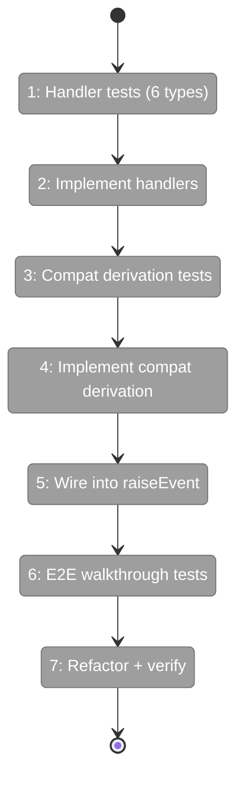
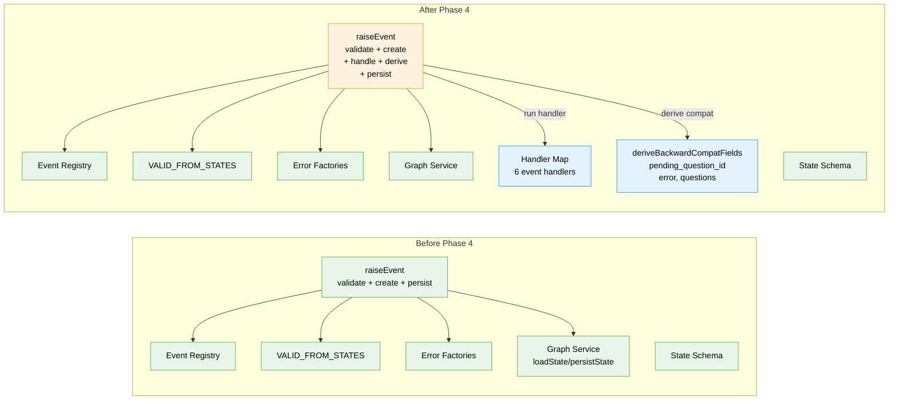

# Flight Plan: Phase 4 — Event Handlers and State Transitions

**Plan**: [node-event-system-plan.md](../../node-event-system-plan.md)
**Phase**: Phase 4: Event Handlers and State Transitions
**Generated**: 2026-02-07
**Status**: Ready for takeoff

---

## Departure → Destination

**Where we are**: Phases 1-3 delivered the complete event data model, the two-phase handshake, and the `raiseEvent()` write path. The registry knows about 6 event types with Zod-validated payload schemas. Nodes transition through `starting` and `agent-accepted`. Any caller can raise a validated event on a node — but the event just sits there with `status: 'new'`. Nothing actually happens: no status transitions, no question lifecycle management. The events are recorded but inert.

**Where we're going**: By the end of this phase, raising an event actually *does something*. `raiseEvent('g', 'n1', 'node:accepted', {}, 'agent')` will transition the node from `starting` to `agent-accepted` and mark the event `handled`. Asking a question will move the node to `waiting-question` and set `pending_question_id`. Completing a node will set `completed_at`. A backward-compatibility projection (`deriveBackwardCompatFields`) will recompute `pending_question_id`, `error`, and `questions[]` from the event log after every handler. A developer can replay the Workshop #02 walkthroughs — happy path, Q&A, error, progress — and see the exact state transitions described in the design.

---

## Flight Status

<!-- Updated by /plan-6: pending → active → done. Use blocked for problems/input needed. -->

**Legend**: grey = pending | yellow = active | red = blocked/needs input | green = done

---

## Stages

<!-- Updated by /plan-6 during implementation: [ ] → [~] → [x] -->

- [ ] **Stage 1: Write handler tests for all 6 event types** — one describe block per type covering status transitions, event lifecycle, timestamps, and type-specific side effects like `completed_at`, `pending_question_id`, and error fields (`event-handlers.test.ts` — new file)
- [ ] **Stage 2: Implement all 6 event handlers** — a `Map<string, EventHandler>` where each handler mutates state in-place: status transitions, timestamp updates, and question lifecycle (`event-handlers.ts` — new file)
- [ ] **Stage 3: Write backward-compat derivation tests** — verify `pending_question_id` from latest unanswered ask, `error` from latest error event, and `questions[]` reconstructed from ask+answer pairs (`derive-compat-fields.test.ts` — new file)
- [ ] **Stage 4: Implement deriveBackwardCompatFields** — recompute derived fields from the event log after every handler call (`derive-compat-fields.ts` — new file)
- [ ] **Stage 5: Wire handlers and compat into raiseEvent** — change the flow to validate → create event → append → run handler → derive compat → persist, and update barrel exports (`raise-event.ts`, `index.ts`)
- [ ] **Stage 6: End-to-end walkthrough tests** — replay all 4 Workshop #02 scenarios (happy path, Q&A, error, progress) through the full `raiseEvent()` pipeline and verify literal state matches (`event-handlers.test.ts`)
- [ ] **Stage 7: Refactor and verify** — run `just fft`, confirm full test suite green

---

## Architecture: Before & After

**Legend**: existing (green, unchanged) | changed (orange, modified) | new (blue, created)

---

## Acceptance Criteria

- [ ] All 6 event types have working handlers (AC-6, AC-7)
- [ ] `node:accepted` drives two-phase handshake: `starting` → `agent-accepted` (AC-6)
- [ ] Question lifecycle flows through events: ask → `waiting-question`, answer → mark handled (AC-7)
- [ ] Backward-compat fields (`pending_question_id`, `error`, `questions[]`) derived from event log (AC-15)
- [ ] `just fft` clean

## Goals & Non-Goals

**Goals**:
- Create handler functions for all 6 event types with correct side effects
- `node:accepted` drives the two-phase handshake
- Question lifecycle (ask/answer) managed through event handlers
- `deriveBackwardCompatFields()` computes derived fields from the event log
- Wire handlers into `raiseEvent()`: validate → create → handle → derive compat → persist
- End-to-end handler tests matching all 4 Workshop #02 walkthroughs

**Non-Goals**:
- Service method wrappers (`endNode()`, `askQuestion()` calling `raiseEvent()`) — Phase 5
- CLI commands — Phase 6
- ONBAS adaptation — Phase 7
- Output persistence (`output:save-data`, `output:save-file`) — removed from event system; orchestrator handles directly
- Event acknowledgment (`new` → `acknowledged`) — that's ODS's responsibility (Plan 030 Phase 6)

---

## Checklist

- [ ] T001: Write `node:accepted` handler tests (CS-2)
- [ ] T002: Write `node:completed` handler tests (CS-2)
- [ ] T003: Write `node:error` handler tests (CS-2)
- [ ] T004: Write `question:ask` handler tests (CS-2)
- [ ] T005: Write `question:answer` handler tests (CS-2)
- [ ] T006: Write `progress:update` handler tests (CS-1)
- [ ] T007: Implement all 6 event handlers (CS-3)
- [ ] T008: Write `deriveBackwardCompatFields()` tests (CS-2)
- [ ] T009: Implement `deriveBackwardCompatFields()` (CS-2)
- [ ] T010: Wire handlers and compat into `raiseEvent()` (CS-2)
- [ ] T011: Write end-to-end Workshop #02 walkthrough tests (CS-2)
- [ ] T012: Refactor and verify with `just fft` (CS-1)

---

## PlanPak

Active — new files organized under `features/032-node-event-system/`. Cross-plan edits to 0 files in this phase (all changes within feature folder + barrel export).
