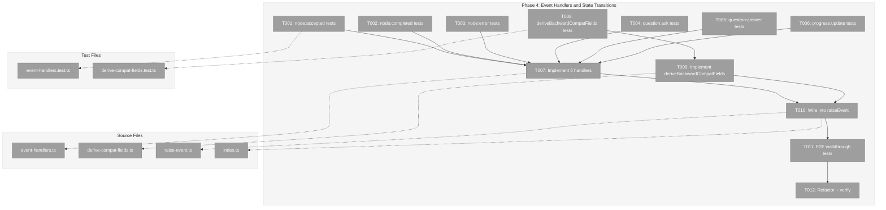

# Phase 4: Event Handlers and State Transitions — Tasks & Alignment Brief

**Spec**: [node-event-system-spec.md](../../node-event-system-spec.md)
**Plan**: [node-event-system-plan.md](../../node-event-system-plan.md)
**Date**: 2026-02-07

---

## Executive Briefing

### Purpose
This phase implements the handler for each of the 6 event types and the backward-compatibility projection function. After this phase, `raiseEvent()` becomes a complete engine: validate the event, create the record, run the handler (which applies side effects like status transitions), derive backward-compat fields, and persist state atomically.

### What We're Building
- **6 event handlers** — one per event type — each applying the correct side effects:
  - `node:accepted`: `starting` → `agent-accepted`
  - `node:completed`: `agent-accepted` → `complete` + set `completed_at`
  - `node:error`: → `blocked-error` + populate error field from payload
  - `question:ask`: → `waiting-question` + set `pending_question_id`
  - `question:answer`: mark ask event `handled` + clear `pending_question_id`
  - `progress:update`: no state change, event marked `handled` immediately
- **`deriveBackwardCompatFields()`** — computes `pending_question_id`, `error`, and top-level `questions[]` from the event log after every handler
- **Wiring** — integrate handlers and compat derivation into the existing `raiseEvent()` flow

### User Value
After this phase, raising an event actually *does something*: transitions node status, persists output data, manages question lifecycle. The event system moves from "records events" to "drives the node lifecycle."

### Example
**Before** (Phase 3): `raiseEvent('g', 'n1', 'node:accepted', {}, 'agent')` → creates event with `status: 'new'`, node stays in `starting`
**After** (Phase 4): Same call → creates event with `status: 'handled'`, node transitions to `agent-accepted`, event has `handled_at` timestamp

---

## Objectives & Scope

### Objective
Implement all 6 event handlers and the backward-compat projection, then wire them into `raiseEvent()` so that the event system drives real state changes. Verify with end-to-end walkthrough tests matching Workshop #02 scenarios.

### Goals

- Create handler functions for all 6 event types with correct side effects
- `node:accepted` drives the two-phase handshake (AC-6)
- Question lifecycle flows through events: ask → waiting-question, answer → mark handled (AC-7)
- `deriveBackwardCompatFields()` computes `pending_question_id`, `error`, `questions[]` from the event log (AC-15 prep)
- Wire handlers into `raiseEvent()`: validate → create → handle → derive compat → persist
- End-to-end handler tests matching all 4 Workshop #02 walkthroughs

### Non-Goals

- Service method wrappers (`endNode()`, `askQuestion()` etc. calling `raiseEvent()`) — Phase 5
- CLI commands — Phase 6
- ONBAS adaptation — Phase 7
- Output persistence (`output:save-data`, `output:save-file`) — removed from the event system entirely; the orchestrator handles output persistence directly
- Event acknowledgment (`new` → `acknowledged` transition) — that's ODS's responsibility (Plan 030 Phase 6)

---

## Pre-Implementation Audit

### Summary
| File | Action | Origin | Modified By | Recommendation |
|------|--------|--------|-------------|----------------|
| `/home/jak/substrate/030-positional-orchestrator/packages/positional-graph/src/features/032-node-event-system/event-handlers.ts` | Create | New | — | keep-as-is |
| `/home/jak/substrate/030-positional-orchestrator/packages/positional-graph/src/features/032-node-event-system/derive-compat-fields.ts` | Create | New | — | keep-as-is |
| `/home/jak/substrate/030-positional-orchestrator/packages/positional-graph/src/features/032-node-event-system/raise-event.ts` | Modify | Phase 3 | — | keep-as-is |
| `/home/jak/substrate/030-positional-orchestrator/packages/positional-graph/src/features/032-node-event-system/index.ts` | Modify | Phase 1 | Phase 3 | keep-as-is |
| `/home/jak/substrate/030-positional-orchestrator/test/unit/positional-graph/features/032-node-event-system/event-handlers.test.ts` | Create | New | — | keep-as-is |
| `/home/jak/substrate/030-positional-orchestrator/test/unit/positional-graph/features/032-node-event-system/derive-compat-fields.test.ts` | Create | New | — | keep-as-is |

### Compliance Check
No violations found. All new files are plan-scoped within `features/032-node-event-system/`. The only modifications are to files already owned by this plan (Phase 3's `raise-event.ts` and Phase 1's `index.ts`). No cross-plan edits in this phase.

---

## Requirements Traceability

### Coverage Matrix
| AC | Description | Flow Summary | Files in Flow | Tasks | Status |
|----|-------------|-------------|---------------|-------|--------|
| AC-6 | Two-phase handshake transitions | `raiseEvent` → `node:accepted` handler → status update | raise-event.ts, event-handlers.ts | T001, T009, T012 | Covered |
| AC-7 | Question lifecycle through events | `raiseEvent` → `question:ask`/`question:answer` handlers → status + pending_question_id | raise-event.ts, event-handlers.ts, derive-compat-fields.ts | T004, T005, T009, T010, T011, T012 | Covered |
| AC-8 | Removed — orchestrator handles output persistence directly | N/A | N/A | N/A | Removed |
| AC-15 | Backward-compat fields derived | `deriveBackwardCompatFields()` after every handler | derive-compat-fields.ts, raise-event.ts | T010, T011, T012 | Covered |

### Gaps Found
No gaps — all acceptance criteria for this phase have complete file coverage.

### Orphan Files
None — all files map to acceptance criteria.

---

## Architecture Map

### Component Diagram
<!-- Status: grey=pending, orange=in-progress, green=completed, red=blocked -->
<!-- Updated by plan-6 during implementation -->



### Task-to-Component Mapping

<!-- Status: Pending | In Progress | Complete | Blocked -->

| Task | Component(s) | Files | Status | Comment |
|------|-------------|-------|--------|---------|
| T001 | Handler Tests | event-handlers.test.ts | Pending | `node:accepted`: starting → agent-accepted |
| T002 | Handler Tests | event-handlers.test.ts | Pending | `node:completed`: agent-accepted → complete |
| T003 | Handler Tests | event-handlers.test.ts | Pending | `node:error`: → blocked-error |
| T004 | Handler Tests | event-handlers.test.ts | Pending | `question:ask`: → waiting-question |
| T005 | Handler Tests | event-handlers.test.ts | Pending | `question:answer`: mark ask handled, clear pending |
| T006 | Handler Tests | event-handlers.test.ts | Pending | `progress:update`: no state change |
| T007 | Event Handlers | event-handlers.ts | Pending | Implement all 6 handlers |
| T008 | Compat Tests | derive-compat-fields.test.ts | Pending | Test backward-compat derivation |
| T009 | Compat Impl | derive-compat-fields.ts | Pending | Implement deriveBackwardCompatFields |
| T010 | Wiring | raise-event.ts, index.ts | Pending | Wire handlers + compat into raiseEvent |
| T011 | E2E Tests | event-handlers.test.ts | Pending | Workshop #02 walkthroughs |
| T012 | Quality | All | Pending | just fft clean |

---

## Tasks

| Status | ID | Task | CS | Type | Dependencies | Absolute Path(s) | Validation | Subtasks | Notes |
|--------|------|------|-----|------|-------------|-------------------|------------|----------|-------|
| [ ] | T001 | Write tests for `node:accepted` handler: status transitions `starting` → `agent-accepted`, event marked `handled` with `handled_at` | 2 | Test | – | `/home/jak/substrate/030-positional-orchestrator/test/unit/positional-graph/features/032-node-event-system/event-handlers.test.ts` | Tests fail (RED) | – | Per Workshop #02 Walkthrough 1; plan task 4.1 |
| [ ] | T002 | Write tests for `node:completed` handler: status → `complete`, `completed_at` set, event `handled` | 2 | Test | – | `/home/jak/substrate/030-positional-orchestrator/test/unit/positional-graph/features/032-node-event-system/event-handlers.test.ts` | Tests fail (RED) | – | Plan task 4.2 |
| [ ] | T003 | Write tests for `node:error` handler: status → `blocked-error`, error field populated from payload (`code`, `message`, `details`), event `handled` | 2 | Test | – | `/home/jak/substrate/030-positional-orchestrator/test/unit/positional-graph/features/032-node-event-system/event-handlers.test.ts` | Tests fail (RED) | – | Per Workshop #02 Walkthrough 3; plan task 4.3 |
| [ ] | T004 | Write tests for `question:ask` handler: status → `waiting-question`, `pending_question_id` set to event_id, event stays `new` (deferred processing) | 2 | Test | – | `/home/jak/substrate/030-positional-orchestrator/test/unit/positional-graph/features/032-node-event-system/event-handlers.test.ts` | Tests fail (RED) | – | Per Workshop #02 Walkthrough 2; plan task 4.4. Note: event stays `new` because external action is required |
| [ ] | T005 | Write tests for `question:answer` handler: ask event marked `handled` with `handler_notes`, `pending_question_id` cleared, answer event `handled`, node status stays `waiting-question` | 2 | Test | – | `/home/jak/substrate/030-positional-orchestrator/test/unit/positional-graph/features/032-node-event-system/event-handlers.test.ts` | Tests fail (RED) | – | Per Workshop #02 Q&A lifecycle; plan task 4.5. Node status does NOT change on answer — ONBAS detects the answer on next walk |
| [ ] | T006 | Write tests for `progress:update` handler: no state change, event `handled` immediately | 1 | Test | – | `/home/jak/substrate/030-positional-orchestrator/test/unit/positional-graph/features/032-node-event-system/event-handlers.test.ts` | Tests fail (RED) | – | Plan task 4.6 |
| [ ] | T007 | Implement all 6 event handlers as a handler map: `Map<string, (state, nodeId, event) => void>` | 3 | Core | T001, T002, T003, T004, T005, T006 | `/home/jak/substrate/030-positional-orchestrator/packages/positional-graph/src/features/032-node-event-system/event-handlers.ts` | All T001-T006 tests pass (GREEN) | – | Plan task 4.7. Handlers mutate state in-place (pre-persist). Output handlers removed — orchestrator handles output persistence directly. |
| [ ] | T008 | Write tests for `deriveBackwardCompatFields()`: `pending_question_id` from latest unanswered ask, `error` from latest error event, `questions[]` reconstructed from ask+answer pairs | 2 | Test | – | `/home/jak/substrate/030-positional-orchestrator/test/unit/positional-graph/features/032-node-event-system/derive-compat-fields.test.ts` | Tests fail (RED) | – | Finding 03; plan task 4.8 |
| [ ] | T009 | Implement `deriveBackwardCompatFields()` | 2 | Core | T008 | `/home/jak/substrate/030-positional-orchestrator/packages/positional-graph/src/features/032-node-event-system/derive-compat-fields.ts` | All T008 tests pass (GREEN) | – | Plan task 4.9 |
| [ ] | T010 | Wire handlers and compat derivation into `raiseEvent()`: validate → create event → run handler → derive compat → persist state. Update barrel exports. | 2 | Core | T007, T009 | `/home/jak/substrate/030-positional-orchestrator/packages/positional-graph/src/features/032-node-event-system/raise-event.ts`, `/home/jak/substrate/030-positional-orchestrator/packages/positional-graph/src/features/032-node-event-system/index.ts` | raiseEvent now applies side effects; existing Phase 3 tests still pass | – | Plan task 4.10. Must not break Phase 3's 22 existing tests |
| [ ] | T011 | Write end-to-end handler tests matching Workshop #02 walkthroughs: Walkthrough 1 (happy path), 2 (Q&A), 3 (error), 4 (progress) | 2 | Test | T010 | `/home/jak/substrate/030-positional-orchestrator/test/unit/positional-graph/features/032-node-event-system/event-handlers.test.ts` | All 4 walkthroughs produce expected state per Workshop #02 | – | Plan task 4.11. Verify literal state matches workshop JSON |
| [ ] | T012 | Refactor and verify with `just fft` | 1 | Quality | T011 | All files | `just fft` clean, all tests green | – | Plan task 4.12 |

---

## Alignment Brief

### Prior Phases Review

#### Phase 1: Event Types, Schemas, and Registry (Complete)
**Deliverables available to Phase 4:**
- `NodeEventRegistry` + `FakeNodeEventRegistry` — registry with register/get/list/validatePayload
- `registerCoreEventTypes()` — registers all 6 types with Zod schemas, allowedSources, stopsExecution, domain (output events removed)
- `generateEventId()` — `evt_<hex_timestamp>_<hex_random>` format
- 6 payload schemas: `NodeAcceptedPayloadSchema`, `NodeCompletedPayloadSchema`, `NodeErrorPayloadSchema`, `QuestionAskPayloadSchema`, `QuestionAnswerPayloadSchema`, `ProgressUpdatePayloadSchema` (output payload schemas removed)
- `EventSource`, `EventStatus`, `NodeEvent` types
- Error factories E190-E195 in `event-errors.ts`
- All exported via barrel `index.ts`
- 94 tests across 4 test files
- **Discovery**: `errors/index.ts` auto-exports via `keyof typeof` — no modification needed

#### Phase 2: State Schema Extension and Two-Phase Handshake (Complete)
**Deliverables available to Phase 4:**
- `NodeExecutionStatusSchema` updated: `starting`, `agent-accepted`, `waiting-question`, `blocked-error`, `complete`
- `NodeStateEntrySchema` with optional `events: z.array(NodeEventSchema).optional()`
- `isNodeActive(status)` and `canNodeDoWork(status)` predicates in `event-helpers.ts`
- `simulateAgentAccept()` test helpers (temporary — Phase 4 handlers will provide the real `node:accepted` handler)
- All `=== 'running'` references updated across codebase (7 source files, 13 test files)
- `answerQuestion()` now transitions to `starting` (not `agent-accepted`) — two-phase handshake resume path
- **Discovery (DYK #1)**: `answerQuestion()` returns `'starting'`, not `'agent-accepted'` — agents must re-accept after question answer
- 18 new tests, 3541 total

#### Phase 3: raiseEvent Core Write Path (Complete)
**Deliverables available to Phase 4:**
- `raiseEvent(deps, graphSlug, nodeId, eventType, payload, source)` — 5-step validation pipeline
- `RaiseEventDeps` interface: `{ registry, loadState, persistState }`
- `RaiseEventResult` interface: `{ ok, event?, errors[] }`
- `VALID_FROM_STATES` map (8 entries matching Workshop #02)
- `createFakeStateStore()` test helper (in-memory state with persist tracking)
- `createDeps()` and `makeState()` test helpers
- 22 tests covering all validation steps + success + persistence safety
- **Critical context**: Currently `raiseEvent()` creates events with `status: 'new'` and does NOT apply side effects. Phase 4 adds the handler call between event creation and state persistence.
- **Discovery**: `registry.validatePayload()` returns inline errors; `raiseEvent()` re-runs `payloadSchema.safeParse()` to get Zod issues for the factory function (minor redundancy, kept for consistency)

### Cumulative Dependencies for Phase 4
Phase 4 builds directly on Phase 3's `raiseEvent()` function. The handler map will be called by `raiseEvent()` between event creation and state persistence. The `deriveBackwardCompatFields()` function runs after the handler. All 6 event type schemas and registrations from Phase 1 define what each handler receives as payload.

### Critical Findings Affecting This Phase

**Finding 03: Backward-Compat Fields Are Derived Projections**
- `pending_question_id`, `error`, and top-level `questions[]` are computed from the event log
- No dual-write — these are read-only projections computed after every `raiseEvent()` call
- Addressed by: T010, T011 (`deriveBackwardCompatFields()`)

**Finding 08: Atomic State Persistence Handles Event Appends**
- All state.json writes use `atomicWriteFile()` (temp-then-rename)
- Each `raiseEvent()` loads state, appends event, runs handler, derives compat, persists atomically
- Addressed by: T012 (wiring ensures single atomic persist after handler + compat derivation)

### Handler Behavior Reference (from Workshops)

| Event Type | Status Transition | Event Lifecycle | Key Side Effect |
|------------|-------------------|-----------------|-----------------|
| `node:accepted` | `starting` → `agent-accepted` | `new` → `handled` immediately | None beyond status change |
| `node:completed` | `agent-accepted` → `complete` | `new` → `handled` immediately | Set `completed_at` |
| `node:error` | → `blocked-error` | `new` → `handled` immediately | Populate `error` field from payload |
| `question:ask` | `agent-accepted` → `waiting-question` | Stays `new` (deferred) | Set `pending_question_id` to event_id |
| `question:answer` | No status change | Both ask and answer → `handled` | Clear `pending_question_id`, set `handler_notes` on ask |
| `progress:update` | No status change | `new` → `handled` immediately | No side effects |

**Key insight**: `question:ask` is the ONLY event (of 6 types) that stays `new` after the handler. All others go to `handled` immediately. This is because `question:ask` requires external action (someone needs to surface and answer the question). The `acknowledged` transition is done by ODS (Plan 030 Phase 6), not by the handler.

### Handler Signature Design

```typescript
// Each handler receives the state (mutable), nodeId, and the event (mutable).
// Handlers mutate state and event in-place. raiseEvent() persists after.
type EventHandler = (
  state: State,
  nodeId: string,
  event: NodeEvent
) => void;

// Handler map — one handler per event type
const EVENT_HANDLERS: Map<string, EventHandler>;

// Factory function to create the handler map
function createEventHandlers(): Map<string, EventHandler>;
```

### deriveBackwardCompatFields Design

```typescript
// Called after every handler, before persist.
// Recomputes derived fields from the event log.
function deriveBackwardCompatFields(state: State, nodeId: string): void;
```

Derivation rules (from Workshop #02 §Migration Strategy):
- `pending_question_id`: Latest `question:ask` event without a matching `question:answer` → set to ask event's `event_id`; clear when answered
- `error`: Latest `node:error` event → copy `code`, `message`, `details` from payload
- `questions[]` (top-level): Reconstruct from all `question:ask` + `question:answer` event pairs

### raiseEvent Wiring Change

Current flow (Phase 3):
```
validate → create event (status: 'new') → append to events[] → persist
```

New flow (Phase 4):
```
validate → create event (status: 'new') → run handler (may change event status + node state) → derive compat fields → append to events[] → persist
```

**Important**: The event is appended to the array AFTER the handler runs, so the handler can modify the event's status (e.g., set `handled_at`). But `deriveBackwardCompatFields` needs to see ALL events including the new one, so the event must be in the array before compat derivation runs.

Revised flow:
```
validate → create event → append to events[] → run handler → derive compat → persist
```

### Test Plan (Full TDD)

**Test file 1: `event-handlers.test.ts`**

Handler tests (T001-T006) — each handler tested in isolation:
- `node:accepted` handler: 2 tests (status transition, event handled_at)
- `node:completed` handler: 3 tests (status transition, completed_at set, event handled)
- `node:error` handler: 3 tests (status transition, error field populated, event handled)
- `question:ask` handler: 3 tests (status transition, pending_question_id set, event stays `new`)
- `question:answer` handler: 4 tests (ask event handled, handler_notes, pending cleared, answer event handled, status unchanged)
- `progress:update` handler: 2 tests (no state change, event handled)

E2E walkthrough tests (T011):
- Walkthrough 1: Happy path (accept → save data → complete)
- Walkthrough 2: Q&A lifecycle (ask → answer)
- Walkthrough 3: Error path (accept → error)
- Walkthrough 4: Progress update (accept → progress → progress)

**Test file 2: `derive-compat-fields.test.ts`**

Compat derivation tests (T008):
- `pending_question_id` from latest unanswered ask
- `pending_question_id` cleared when answered
- `pending_question_id` null when no asks
- `error` from latest error event
- `error` null when no errors
- `questions[]` reconstructed from ask+answer pairs
- `questions[]` empty when no asks
- Multiple questions (one answered, one pending)

### Implementation Outline

1. **T001-T006** (parallel — all handler tests, RED): Write all handler tests in `event-handlers.test.ts`. Tests call handlers directly with pre-built state, assert state mutations and event field changes. Use `makeState()` pattern from Phase 3 tests.

2. **T007** (GREEN): Implement `event-handlers.ts` with `createEventHandlers()` returning a `Map<string, EventHandler>`. Each handler is a pure function mutating state in-place.

3. **T008** (RED): Write `deriveBackwardCompatFields()` tests in `derive-compat-fields.test.ts`.

4. **T009** (GREEN): Implement `derive-compat-fields.ts`.

5. **T010** (wiring): Modify `raiseEvent()` to call handler + compat after event creation. Update `index.ts` barrel exports.

6. **T011** (integration): Write Workshop #02 walkthrough tests exercising the full `raiseEvent()` pipeline.

7. **T012** (verify): `just fft` clean.

### Commands to Run

```bash
# Run Phase 4 tests only
pnpm test -- --reporter=verbose test/unit/positional-graph/features/032-node-event-system/event-handlers.test.ts
pnpm test -- --reporter=verbose test/unit/positional-graph/features/032-node-event-system/derive-compat-fields.test.ts

# Run all 032 tests
pnpm test -- --reporter=verbose test/unit/positional-graph/features/032-node-event-system/

# Full quality check
just fft
```

### Risks & Unknowns

| Risk | Severity | Mitigation |
|------|----------|------------|
| Phase 3 tests break when handlers are wired in | Medium | Handlers change event status from `new` to `handled` and mutate node status — Phase 3 tests assert `status: 'new'` and unchanged node status. Must update or restructure Phase 3 tests. Output handlers no longer a concern (removed). |
| `question:answer` handler complexity (marking ask event + clearing pending) | Low | Workshop #02 Walkthrough 2 provides exact expected state at every stage |
| `deriveBackwardCompatFields` computing `questions[]` array reconstruction | Low | Well-specified: each ask event → Question object, answer events add `answer` + `answered_at` fields |

### Ready Check

- [ ] Handler behavior clear from Workshop #02 walkthroughs
- [ ] `raiseEvent()` wiring flow decided (append → handle → derive → persist)
- [ ] Phase 3 test impact understood (will need updates after T010 wiring)
- [ ] ADR constraints mapped to tasks — N/A (no new ADRs for this phase)

---

## Phase Footnote Stubs

_Populated by plan-6a during implementation._

---

## Evidence Artifacts

Implementation evidence will be written to:
- `docs/plans/032-node-event-system/tasks/phase-4-event-handlers-and-state-transitions/execution.log.md`

---

## Discoveries & Learnings

_Populated during implementation by plan-6. Log anything of interest to your future self._

| Date | Task | Type | Discovery | Resolution | References |
|------|------|------|-----------|------------|------------|
| | | | | | |

**Types**: `gotcha` | `research-needed` | `unexpected-behavior` | `workaround` | `decision` | `debt` | `insight`

**What to log**:
- Things that didn't work as expected
- External research that was required
- Implementation troubles and how they were resolved
- Gotchas and edge cases discovered
- Decisions made during implementation
- Technical debt introduced (and why)
- Insights that future phases should know about

_See also: `execution.log.md` for detailed narrative._

---

## Directory Layout

```
docs/plans/032-node-event-system/
  ├── node-event-system-plan.md
  ├── node-event-system-spec.md
  └── tasks/phase-4-event-handlers-and-state-transitions/
      ├── tasks.md                # This file
      ├── tasks.fltplan.md        # Generated by /plan-5b
      └── execution.log.md       # Created by /plan-6
```
