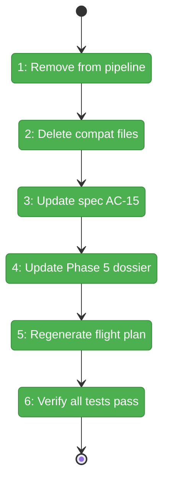
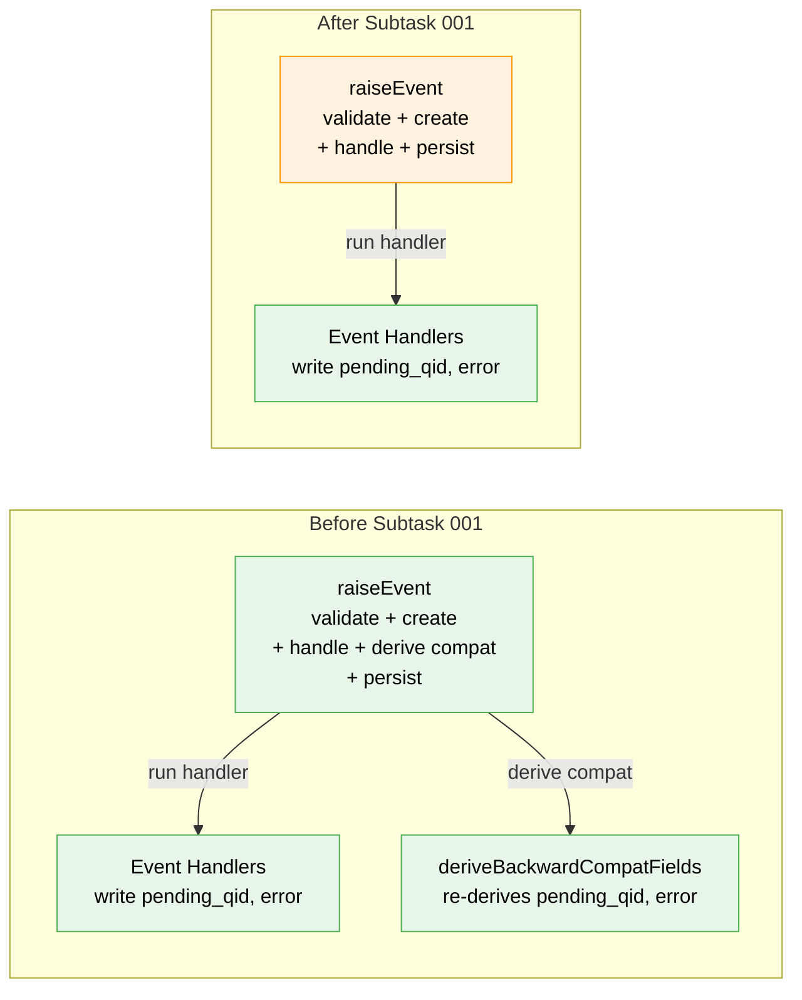

# Flight Plan: Subtask 001 — Drop Backward Compatibility Layer

**Plan**: [node-event-system-plan.md](../../node-event-system-plan.md)
**Phase**: Phase 5: Service Method Wrappers
**Subtask**: 001-subtask-drop-backward-compat
**Generated**: 2026-02-07
**Status**: Landed

---

## Departure → Destination

**Where we are**: Phases 1-4 delivered the complete node event system engine. The raiseEvent pipeline currently runs a 6-step flow: validate → create event → append → run handler → derive backward-compat fields → persist. The "derive compat" step (`deriveBackwardCompatFields()`) re-computes `pending_question_id` and `error` from the event log — but the handlers in the previous step already wrote those exact same fields directly. The compat layer is redundant belt-and-suspenders code maintained for zero production consumers. Phase 5's task dossier includes T001-T002 to *extend* this compat layer for `questions[]` reconstruction — adding more complexity to an unnecessary function.

**Where we're going**: By the end of this subtask, the raiseEvent pipeline is simplified to 5 steps: validate → create event → append → run handler → persist. The `deriveBackwardCompatFields()` function and its test file are deleted. The spec and Phase 5 dossier are updated to reflect that `pending_question_id` and `error` are handler-written fields, not derived projections. T001-T002 are eliminated from the Phase 5 task table. A developer running `just fft` will see all tests pass, proving the compat layer was doing nothing the handlers don't already do.

---

## Flight Status

<!-- Updated by /plan-6: pending → active → done. Use blocked for problems/input needed. -->

**Legend**: grey = pending | yellow = active | red = blocked/needs input | green = done

---

## Stages

<!-- Updated by /plan-6 during implementation: [ ] → [~] → [x] -->

- [x] **Stage 1: Remove compat from raiseEvent pipeline** — delete the import and function call from the event write path, reducing the pipeline from 6 steps to 5 (`raise-event.ts`)
- [x] **Stage 2: Delete compat source and tests** — remove `derive-compat-fields.ts`, its test file, and the barrel export (`derive-compat-fields.ts`, `derive-compat-fields.test.ts`, `index.ts`)
- [x] **Stage 3: Update spec AC-15 wording** — change "derived projections computed from the event log" to "written directly by event handlers" (`node-event-system-spec.md`)
- [x] **Stage 4: Update Phase 5 dossier** — eliminate T001-T002 rows, update dependencies, simplify architecture map and alignment brief (`tasks.md`)
- [x] **Stage 5: Regenerate Phase 5 flight plan** — update to reflect the simplified 9-task structure (`tasks.fltplan.md`)
- [x] **Stage 6: Verify all tests pass** — run `just fft` to prove the compat layer was redundant; zero test failures expected

---

## Architecture: Before & After

**Legend**: existing (green, unchanged) | changed (orange, modified) | new (blue, created)

---

## Acceptance Criteria

- [ ] `deriveBackwardCompatFields()` no longer called in the raiseEvent pipeline
- [ ] Source file and test file deleted, barrel export removed
- [ ] Spec AC-15 reflects handler-written fields (not "derived projections")
- [ ] Phase 5 dossier updated: T001-T002 eliminated, dependencies corrected
- [ ] `just fft` clean — all existing tests pass without the compat layer

## Goals & Non-Goals

**Goals**:
- Remove `deriveBackwardCompatFields()` call from raiseEvent pipeline
- Delete compat source file and test file
- Remove barrel export from index.ts
- Update spec AC-15 to reflect reality
- Update Phase 5 dossier to eliminate T001-T002
- Prove compat layer was redundant via full test suite

**Non-Goals**:
- Refactoring getAnswer() to read from events (deferred)
- Changing ONBAS or reality builder (Phase 7)
- Removing `state.questions[]` from schema (service methods still write it)
- Adding `questions[]` writing to event handlers (Phase 5 wrapper concern)

---

## Checklist

- [x] ST001: Remove deriveBackwardCompatFields from raiseEvent pipeline (CS-1)
- [x] ST002: Delete compat source + test files, remove barrel export (CS-1)
- [x] ST003: Update spec AC-15 wording (CS-1)
- [x] ST004: Update Phase 5 parent dossier (CS-2)
- [x] ST005: Regenerate Phase 5 flight plan (CS-1)
- [x] ST006: Verify all tests pass with just fft (CS-1)

---

## PlanPak

Active — files organized under `features/032-node-event-system/`. This subtask deletes files from the feature folder and modifies planning documents.
