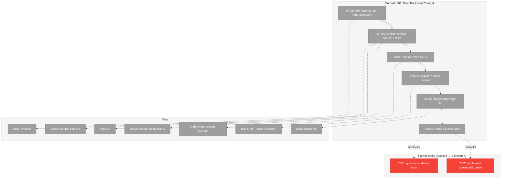

# Subtask 001: Drop Backward Compatibility Layer

**Plan**: [node-event-system-plan.md](../../node-event-system-plan.md)
**Phase**: Phase 5: Service Method Wrappers
**Parent Task(s)**: [T001](./tasks.md), [T002](./tasks.md)
**Workshop**: [04-do-we-need-backward-compat.md](../../workshops/04-do-we-need-backward-compat.md)
**Date**: 2026-02-07

---

## Parent Context

**Parent Plan:** [View Plan](../../node-event-system-plan.md)
**Parent Phase:** Phase 5: Service Method Wrappers
**Parent Task(s):** [T001: Write questions[] derivation tests](./tasks.md), [T002: Implement questions[] derivation](./tasks.md)

**Why This Subtask:**
Workshop 04 demonstrated that `deriveBackwardCompatFields()` is redundant — event handlers already write `pending_question_id` and `error` directly, then the compat function re-derives and overwrites the same values. Nothing in the orchestration stack has shipped to real users (ONBAS not wired, ODS not built, question CLI commands unused). Rather than extending the compat layer for `questions[]` (T001-T002), we should remove the entire compat derivation pass from the raiseEvent pipeline. This is Option C from Workshop 04.

---

## Executive Briefing

### Purpose
Remove the redundant `deriveBackwardCompatFields()` function from the raiseEvent pipeline. Event handlers already write `pending_question_id` and `error` directly — the derivation pass overwrites them with identical values re-computed from the event log. This subtask eliminates dead complexity before Phase 5 implementation begins.

### What We're Building
Nothing new — this is a removal subtask:
- Delete `derive-compat-fields.ts` and its test file
- Remove the `deriveBackwardCompatFields()` call from `raise-event.ts`
- Remove barrel exports
- Update spec AC-15 to remove "derived projections" language
- Update Phase 5 parent dossier: eliminate T001-T002 and update affected tasks

### Unblocks
- **T001/T002 elimination**: No longer need to build O(nodes * events) questions[] derivation
- **Phase 5 simplification**: 9 tasks instead of 11; no compat layer for wrappers to consider
- **Mental model**: Handlers write state, period. No separate derivation pass.

### Example
```
BEFORE (raiseEvent pipeline):
  validate → create event → append → run handler → derive compat → persist
                                           ↑              ↑
                                    writes pending_qid   overwrites with
                                    writes error         identical values

AFTER (raiseEvent pipeline):
  validate → create event → append → run handler → persist
                                           ↑
                                    writes pending_qid
                                    writes error
                                    (trusted — tested)
```

---

## Objectives & Scope

### Objective
Remove `deriveBackwardCompatFields()` from the raiseEvent pipeline and delete the source/test files. Verify that all existing tests pass without the compat layer (proving it was redundant). Update planning documents to reflect the simplified architecture.

### Goals

- Remove `deriveBackwardCompatFields()` call from `raise-event.ts` pipeline
- Delete `derive-compat-fields.ts` source file
- Delete `derive-compat-fields.test.ts` test file
- Remove barrel export from `index.ts`
- Verify all existing Phase 1-4 tests pass (handlers already write correct state)
- Update spec AC-15 wording (remove "derived projections" framing)
- Update parent Phase 5 dossier (eliminate T001-T002, update dependencies and architecture)

### Non-Goals

- Refactoring `getAnswer()` to read from events — deferred, still reads `state.questions[]` written by service methods
- Changing ONBAS or reality builder — Phase 7 scope
- Removing `state.questions[]` from schema — consumers still exist, service methods still write it
- Removing `pending_question_id` or `error` from node state — handlers still write these directly
- Adding `questions[]` writing to event handlers — the service wrappers (T008, T009) will handle this when they replace the direct write path

---

## Pre-Implementation Audit

### Summary
| File | Action | Origin | Modified By | Recommendation |
|------|--------|--------|-------------|----------------|
| `packages/positional-graph/src/features/032-node-event-system/derive-compat-fields.ts` | Delete | Phase 4 (T009) | — | DELETE — redundant with handler writes |
| `packages/positional-graph/src/features/032-node-event-system/raise-event.ts` | Modify | Phase 3, Phase 4 | — | Remove import + call (line 4, line 172) |
| `packages/positional-graph/src/features/032-node-event-system/index.ts` | Modify | Phase 1 | Phase 3, Phase 4 | Remove export (line 63) |
| `test/unit/positional-graph/features/032-node-event-system/derive-compat-fields.test.ts` | Delete | Phase 4 (T008) | — | DELETE — tests a deleted function |
| `docs/plans/032-node-event-system/node-event-system-spec.md` | Modify | Pre-plan | — | Update AC-15 wording |
| `docs/plans/032-node-event-system/node-event-system-plan.md` | Modify | Pre-plan | — | Update Phase 5 tasks, Critical Finding 03 |
| `docs/plans/032-node-event-system/tasks/phase-5-service-method-wrappers/tasks.md` | Modify | Phase 5 dossier | — | Eliminate T001-T002, update architecture |
| `docs/plans/032-node-event-system/tasks/phase-5-service-method-wrappers/tasks.fltplan.md` | Modify | Phase 5 fltplan | — | Remove stages 1-2, update checklist |

### Compliance Check
No violations. All deleted files are within `features/032-node-event-system/` (plan-scoped). Spec and plan doc updates are standard planning maintenance.

---

## Requirements Traceability

### Coverage Matrix
| AC | Description | Impact | Status |
|----|-------------|--------|--------|
| AC-15 | raiseEvent is single write path, compat fields are derived projections | Wording changes — "derived projections" becomes "handler-written fields" | Planned |
| AC-6 | Two-phase handshake | No impact — handlers still drive transitions | N/A |
| AC-7 | Question lifecycle through events | No impact — handlers still write pending_question_id | N/A |

### Gaps Found
None — removing the compat layer does not affect any acceptance criterion's behavior. The handlers already produce the correct state.

---

## Architecture Map

### Component Diagram
<!-- Status: grey=pending, orange=in-progress, green=completed, red=blocked -->



### Task-to-Component Mapping

| Task | Component(s) | Files | Status | Comment |
|------|-------------|-------|--------|---------|
| ST001 | raiseEvent Pipeline | raise-event.ts | ⬜ Pending | Remove import + call to deriveBackwardCompatFields |
| ST002 | Compat Layer Deletion | derive-compat-fields.ts, derive-compat-fields.test.ts, index.ts | ⬜ Pending | Delete source + test, remove barrel export |
| ST003 | Spec Update | node-event-system-spec.md | ⬜ Pending | AC-15 wording: "derived projections" → "handler-written fields" |
| ST004 | Dossier Update | tasks.md (Phase 5) | ⬜ Pending | Eliminate T001-T002, update deps/architecture/findings |
| ST005 | Flight Plan | tasks.fltplan.md | ⬜ Pending | Regenerate via /plan-5b-flightplan |
| ST006 | Verification | All test files | ⬜ Pending | `just fft` proves compat layer was redundant |

---

## Tasks

| Status | ID | Task | CS | Type | Dependencies | Absolute Path(s) | Validation | Subtasks | Notes |
|--------|------|------|-----|------|-------------|-------------------|------------|----------|-------|
| [ ] | ST001 | Remove `deriveBackwardCompatFields` from raiseEvent pipeline: delete import (line 4) and call (line 172) from `raise-event.ts`. The pipeline becomes: validate → create → append → handle → persist. | 1 | Core | – | `/home/jak/substrate/030-positional-orchestrator/packages/positional-graph/src/features/032-node-event-system/raise-event.ts` | raiseEvent no longer calls deriveBackwardCompatFields; pipeline flow verified by reading code | – | 2 lines removed. Handlers already write pending_question_id and error directly. |
| [ ] | ST002 | Delete `derive-compat-fields.ts` source file, delete `derive-compat-fields.test.ts` test file, remove export from `index.ts` (line 63). | 1 | Core | ST001 | `/home/jak/substrate/030-positional-orchestrator/packages/positional-graph/src/features/032-node-event-system/derive-compat-fields.ts`, `/home/jak/substrate/030-positional-orchestrator/test/unit/positional-graph/features/032-node-event-system/derive-compat-fields.test.ts`, `/home/jak/substrate/030-positional-orchestrator/packages/positional-graph/src/features/032-node-event-system/index.ts` | Files deleted; barrel export removed; TypeScript compiles | – | ~62 lines source + ~238 lines test removed. |
| [ ] | ST003 | Update spec AC-15: change "Backward-compat fields (pending_question_id, error, top-level questions[]) are derived projections computed from the event log after each raise" to "pending_question_id and error are written directly by event handlers. No separate derivation pass." Remove `questions[]` from the compat fields list. | 1 | Doc | ST002 | `/home/jak/substrate/030-positional-orchestrator/docs/plans/032-node-event-system/node-event-system-spec.md` | AC-15 reflects reality: handler-written, not derived | – | Workshop 04 Q3 resolved. |
| [ ] | ST004 | Update Phase 5 parent dossier (`tasks.md`): (a) eliminate T001 and T002 rows, (b) update T005/T006 dependencies (remove T002), (c) update architecture map (remove T001/T002 nodes), (d) update Alignment Brief Finding 03 ("handler-written, not derived"), (e) update Executive Briefing (remove questions[] reconstruction mention), (f) update Objectives (remove questions[] goal), (g) renumber if needed. | 2 | Doc | ST003 | `/home/jak/substrate/030-positional-orchestrator/docs/plans/032-node-event-system/tasks/phase-5-service-method-wrappers/tasks.md` | Dossier reflects Option C from Workshop 04; no references to deriveBackwardCompatFields, T001, or T002 remain | – | Parent plan task table (§ 8) should also be updated. |
| [ ] | ST005 | Regenerate Phase 5 flight plan to reflect the simplified task list (9 tasks instead of 11, no compat stages). | 1 | Doc | ST004 | `/home/jak/substrate/030-positional-orchestrator/docs/plans/032-node-event-system/tasks/phase-5-service-method-wrappers/tasks.fltplan.md` | Flight plan stages match updated dossier | – | Run /plan-5b-flightplan or update manually. |
| [ ] | ST006 | Run `just fft` to verify all existing tests pass without the compat layer. This proves the layer was redundant — handlers already produce correct state. | 1 | Test | ST002 | All test files | `just fft` clean; all Phase 1-4 tests pass; E2E walkthrough tests pass | – | Key validation: if any test fails, it means the compat layer was doing something the handlers don't. Workshop 04 predicts zero failures. |

---

## Alignment Brief

### Objective
Remove the redundant backward-compat derivation layer before Phase 5 implementation begins, simplifying the raiseEvent pipeline and eliminating 2 tasks (T001, T002) from the parent dossier.

### Critical Findings Affecting This Subtask

**Finding 03 (from plan): "Backward-Compat Fields Are Derived Projections"**
This finding is being superseded by Workshop 04's analysis. The handlers already write the fields directly. The "derived projections" framing was a belt-and-suspenders approach for zero production consumers. After this subtask, Finding 03 should be annotated as resolved/superseded.

### Why This Is Safe

Evidence from Workshop 04 and source code audit:

1. **`handleQuestionAsk`** (event-handlers.ts:50): `nodes[nodeId].pending_question_id = _event.event_id` — handler writes it
2. **`handleQuestionAnswer`** (event-handlers.ts:69): `nodes[nodeId].pending_question_id = undefined` — handler clears it
3. **`handleNodeError`** (event-handlers.ts:39-42): `entry.error = { code, message, details }` — handler writes it
4. **`deriveBackwardCompatFields`** then re-derives and overwrites with identical values
5. **E2E walkthrough tests** verify the final state (they don't care which mechanism wrote it)
6. **Zero production consumers** depend on the compat layer

### What About `state.questions[]`?

`state.questions[]` is currently written directly by `askQuestion()` and `answerQuestion()` in the service. The compat layer was going to add a SECOND write path (derive from events). By dropping the compat layer, `state.questions[]` continues to be written by the service methods until Phase 5 wrappers replace them. No gap.

After Phase 5 wrappers are complete (T008 `askQuestion`, T009 `answerQuestion`), the wrappers delegate to `raiseEvent()` which doesn't write `state.questions[]`. At that point, `getAnswer()` will need to read from events or the handlers need to write `questions[]`. This is addressed in the parent dossier's T008/T009 design — the wrapper can write `state.questions[]` after raiseEvent returns, or `getAnswer()` can be refactored to read events. Either way, it's a Phase 5 concern for T008/T009, not this subtask.

### Test Plan

**No new tests needed.** This subtask is a removal — the validation is that existing tests continue to pass without the removed code. Specifically:

- All 23 handler unit tests (event-handlers.test.ts)
- All 4 E2E walkthrough tests (event-handlers.test.ts)
- All 22 raiseEvent pipeline tests (raise-event.test.ts)
- All other Phase 1-4 tests
- Full `just fft` suite

If ANY test fails after removing `deriveBackwardCompatFields()`, it proves the compat layer was doing something handlers don't, and we need to investigate. Workshop 04 analysis predicts zero failures.

### Implementation Outline

1. **ST001**: Edit `raise-event.ts` — remove import and call (2 lines)
2. **ST002**: Delete `derive-compat-fields.ts`, delete `derive-compat-fields.test.ts`, edit `index.ts` to remove export
3. **ST003**: Edit spec `AC-15` wording
4. **ST004**: Major edit to Phase 5 `tasks.md` dossier
5. **ST005**: Regenerate or update `tasks.fltplan.md`
6. **ST006**: Run `just fft` — the proof

### Commands to Run

```bash
# After ST001-ST002: verify TypeScript compiles
pnpm typecheck

# After ST002: verify no broken imports
pnpm test -- --reporter=verbose test/unit/positional-graph/features/032-node-event-system/

# ST006: full verification
just fft
```

### Risks & Unknowns

| Risk | Severity | Mitigation |
|------|----------|------------|
| A test depends on compat derivation producing a specific value | Low | E2E walkthrough tests verify final state, not mechanism. Handler writes are tested independently. |
| raise-event.test.ts has assertions about compat being called | Low | Audit shows no direct assertions — compat is tested indirectly via state assertions. |
| Future "replay from events" need | Low | YAGNI — build it if/when needed. Handlers can be replayed. |

### Ready Check

- [x] Workshop 04 analysis complete (Option C recommended)
- [x] Handler writes verified in source: pending_question_id (line 50, 69), error (lines 39-42)
- [x] Compat derivation identified as redundant (overwrites identical values)
- [x] All files to modify/delete identified
- [x] Impact on downstream phases assessed (Phase 7 ONBAS: no impact)
- [x] Zero production consumers confirmed

---

## Phase Footnote Stubs

_Populated during implementation by plan-6._

---

## Evidence Artifacts

Implementation evidence will be written to:
- `docs/plans/032-node-event-system/tasks/phase-5-service-method-wrappers/001-subtask-drop-backward-compat.execution.log.md`

---

## Discoveries & Learnings

_Populated during implementation by plan-6. Log anything of interest to your future self._

| Date | Task | Type | Discovery | Resolution | References |
|------|------|------|-----------|------------|------------|
| | | | | | |

**Types**: `gotcha` | `research-needed` | `unexpected-behavior` | `workaround` | `decision` | `debt` | `insight`

_See also: `001-subtask-drop-backward-compat.execution.log.md` for detailed narrative._

---

## After Subtask Completion

**This subtask resolves a blocker for:**
- Parent Task: [T001: Write questions[] derivation tests](./tasks.md)
- Parent Task: [T002: Implement questions[] derivation](./tasks.md)

**When all ST### tasks complete:**

1. **T001 and T002 are eliminated** — they no longer exist in the dossier. The compat layer they were going to extend has been removed.

2. **Parent dossier updated** (done in ST004):
   - T001/T002 rows removed from task table
   - Dependencies updated (T005, T006 no longer depend on T002)
   - Architecture map simplified
   - Finding 03 annotated as superseded

3. **Resume parent phase work:**
   ```bash
   /plan-6-implement-phase --phase "Phase 5: Service Method Wrappers" \
     --plan "/home/jak/substrate/030-positional-orchestrator/docs/plans/032-node-event-system/node-event-system-plan.md"
   ```

**Quick Links:**
- Parent Dossier: [tasks.md](./tasks.md)
- Parent Plan: [node-event-system-plan.md](../../node-event-system-plan.md)
- Workshop 04: [04-do-we-need-backward-compat.md](../../workshops/04-do-we-need-backward-compat.md)
