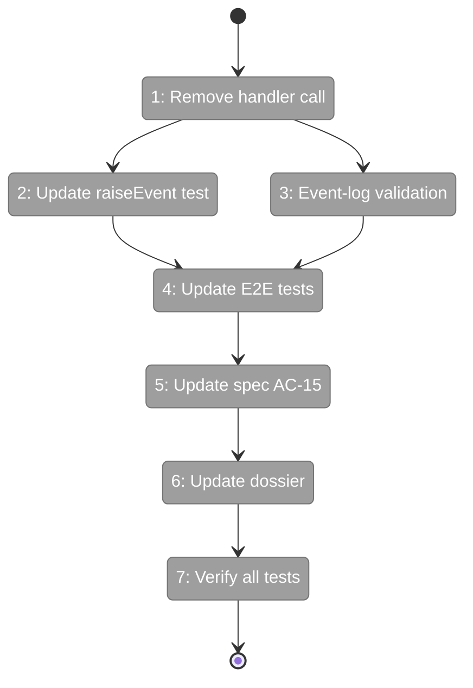
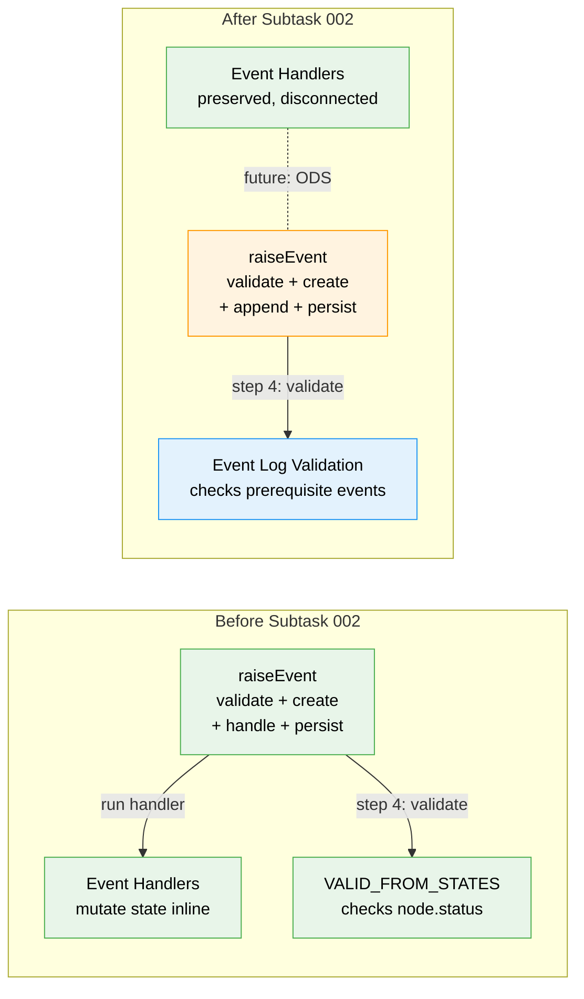

# Flight Plan: Subtask 002 — Remove Inline Handlers from raiseEvent

**Plan**: [node-event-system-plan.md](../../node-event-system-plan.md)
**Phase**: Phase 5: Service Method Wrappers
**Subtask**: 002-subtask-remove-inline-handlers
**Generated**: 2026-02-07
**Status**: Ready for takeoff

---

## Departure → Destination

**Where we are**: Subtask 001 removed the redundant `deriveBackwardCompatFields()` from the raiseEvent pipeline, reducing it from 6 steps to 5. The pipeline is now: validate → create event → append → run handler → persist. The inline handlers mutate node state synchronously (status transitions, field writes) as a side effect of recording an event. Workshop 05 identified this as an architectural problem: agents raise events and hand back to the orchestrator, so processing should happen in the orchestration loop (ODS), not in the write path.

**Where we're going**: By the end of this subtask, `raiseEvent()` is a pure 4-step recording function: validate → create event → append → persist. No state mutations. Events are always recorded with `status: 'new'`. The handler module (`event-handlers.ts`) is preserved but disconnected — it becomes reference logic for ODS (Plan 030 Phase 6). State validation is rewritten to check the event log for prerequisite events instead of checking `node.status`. A developer running `just fft` will see all tests pass, proving the handlers were correctly disconnected.

---

## Flight Status

<!-- Updated by /plan-6: pending → active → done. Use blocked for problems/input needed. -->

**Legend**: grey = pending | yellow = active | red = blocked/needs input | green = done

---

## Stages

<!-- Updated by /plan-6 during implementation: [ ] → [~] → [x] -->

- [ ] **Stage 1: Remove handler invocation from raiseEvent** — delete handler map import, constant, and call from the write path (`raise-event.ts`)
- [ ] **Stage 2: Update raiseEvent test** — change assertion from `event.status === 'handled'` to `event.status === 'new'` (`raise-event.test.ts`)
- [ ] **Stage 3: Rewrite state validation to event-log-based** — replace `VALID_FROM_STATES` (checks `node.status`) with prerequisite event checks (checks event log) (`raise-event.ts`)
- [ ] **Stage 4: Update E2E walkthrough tests** — convert 10 tests from asserting state mutations to asserting event recording (`event-handlers.test.ts`)
- [ ] **Stage 5: Update spec AC-15 (second pass)** — remove "event handler IS the implementation" language, describe recording-only raiseEvent (`node-event-system-spec.md`)
- [ ] **Stage 6: Update Phase 5 dossier** — eliminate T003, update T004-T006 scope, revise T007-T009 wrapper design (`tasks.md`)
- [ ] **Stage 7: Verify all tests pass** — run `just fft` to prove handlers were cleanly disconnected

---

## Architecture: Before & After

**Legend**: existing (green, unchanged) | changed (orange, modified) | new (blue, created)

---

## Acceptance Criteria

- [ ] `raiseEvent()` no longer imports or calls event handlers
- [ ] Events are always recorded with `status: 'new'` (never `'handled'`)
- [ ] State validation uses event log prerequisites, not `node.status`
- [ ] All 28 event-handler tests pass (18 standalone unchanged, 10 E2E updated)
- [ ] All 22 raise-event tests pass (1 updated, rest unchanged)
- [ ] Spec AC-15 describes recording-only raiseEvent
- [ ] `just fft` clean

## Goals & Non-Goals

**Goals**:
- Remove handler invocation from raiseEvent pipeline
- Rewrite VALID_FROM_STATES to event-log-based validation
- Update 11 tests that assert handler-produced state changes
- Update spec AC-15 (second pass)
- Update Phase 5 dossier (T003 elimination, T004-T009 scope changes)

**Non-Goals**:
- Deleting event-handlers.ts (preserved for ODS)
- Building ODS event processing (Plan 030 Phase 6)
- Modifying service method wrappers (parent Phase 5 T007-T009)
- Changing ONBAS (Phase 7)

---

## Checklist

- [ ] ST001: Remove handler call from raiseEvent (CS-1)
- [ ] ST002: Update raiseEvent test assertion (CS-1)
- [ ] ST003: Rewrite VALID_FROM_STATES to event-log-based (CS-2)
- [ ] ST004: Update 10 E2E walkthrough tests (CS-2)
- [ ] ST005: Update spec AC-15 second pass (CS-1)
- [ ] ST006: Update Phase 5 parent dossier (CS-2)
- [ ] ST007: Verify all tests pass with just fft (CS-1)

---

## PlanPak

Active — files organized under `features/032-node-event-system/`. This subtask modifies files in the feature folder and updates planning documents.
