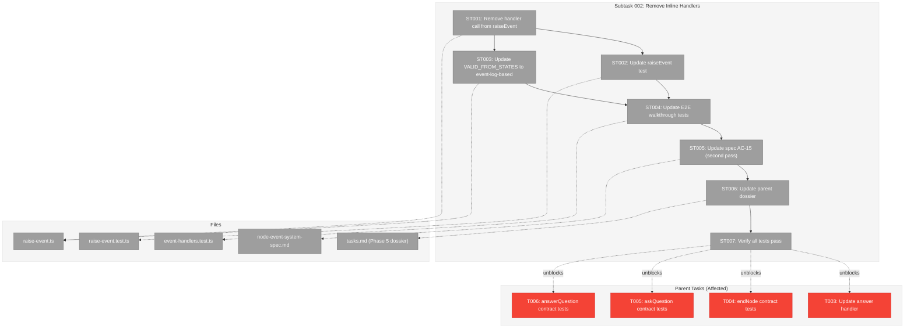

# Subtask 002: Remove Inline Handlers from raiseEvent Pipeline

**Plan**: [node-event-system-plan.md](../../node-event-system-plan.md)
**Phase**: Phase 5: Service Method Wrappers
**Parent Task(s)**: [T003](./tasks.md), [T004](./tasks.md), [T005](./tasks.md), [T006](./tasks.md)
**Workshop**: [05-event-raise-not-handle.md](../../workshops/05-event-raise-not-handle.md)
**Depends On**: [001-subtask-drop-backward-compat](./001-subtask-drop-backward-compat.md)
**Date**: 2026-02-07

---

## Parent Context

**Parent Plan:** [View Plan](../../node-event-system-plan.md)
**Parent Phase:** Phase 5: Service Method Wrappers
**Parent Task(s):**
- [T003: Update answer handler + tests](./tasks.md) — modifies a handler that will no longer be called inline
- [T004: endNode contract tests](./tasks.md) — tests assume raiseEvent mutates state
- [T005: askQuestion contract tests](./tasks.md) — tests assume raiseEvent mutates state
- [T006: answerQuestion contract tests](./tasks.md) — tests assume raiseEvent mutates state

**Why This Subtask:**
Workshop 05 established that `raiseEvent()` should record events, not process them. The agent raises events via CLI and hands back to the orchestrator (pod exits, ODS re-reads state). ONBAS/ODS should process events later. Since we're only building the event system now and nothing picks up events yet, baking processing into the write path means building orchestration logic twice — once in handlers, once in ODS. The CLI should just raise events, not handle them.

This subtask must run AFTER Subtask 001 (drop backward compat). Subtask 001 simplifies the pipeline from 6 steps to 5 (removing compat derivation). This subtask simplifies it from 5 steps to 4 (removing handler invocation).

---

## Executive Briefing

### Purpose
Remove event handler invocation from the `raiseEvent()` pipeline. After this change, `raiseEvent()` is a pure recording function: validate the event, create it, append it to the log, persist. No state mutations. Event processing (status transitions, field writes) becomes the responsibility of the orchestration loop (ODS, Plan 030 Phase 6).

### What We're Building
This is a simplification, not an addition:
- **Modified `raise-event.ts`** — remove handler map import, handler lookup, and handler call
- **Updated 11 tests** — 1 in raise-event.test.ts and 10 E2E walkthroughs in event-handlers.test.ts that currently assert handler-produced state changes
- **Preserved `event-handlers.ts`** — handler functions remain as a module (future ODS processing logic), but are no longer wired into raiseEvent

### Unblocks
- **T003 elimination**: No need to modify `handleQuestionAnswer` to add `starting` transition — handlers don't run inline
- **T004-T006 simplification**: Contract tests verify that raiseEvent records events correctly, not that state was mutated
- **T007-T009 redesign**: Service wrappers must handle state mutations themselves (or delegate to handlers explicitly), not rely on raiseEvent side effects
- **Clean architecture**: raiseEvent is a write path. Processing is a separate concern.

### Example
```
AFTER SUBTASK 001 (5-step pipeline):
  validate → create event → append → run handler → persist
                                          ↑
                                   mutates node.status,
                                   pending_question_id,
                                   completed_at, error

AFTER SUBTASK 002 (4-step pipeline):
  validate → create event → append → persist

  Events are recorded with status: 'new'.
  No state mutations. No handler invocation.
  Processing deferred to ODS (Plan 030 Phase 6).
```

---

## Objectives & Scope

### Objective
Remove handler invocation from `raiseEvent()` and update the 11 tests that assert handler-produced side effects. The handler module is preserved but disconnected from the write path.

### Goals

- Remove handler map creation and handler call from `raise-event.ts`
- Update 1 raise-event.test.ts test that asserts `event.status === 'handled'`
- Update 10 E2E walkthrough tests in event-handlers.test.ts that assert state transitions via raiseEvent
- Verify 18 standalone handler unit tests still pass (they call handlers directly)
- Verify 13 validation-only raiseEvent tests still pass
- Preserve `event-handlers.ts` as a module (not deleted, just disconnected)
- Run `just fft` clean

### Non-Goals

- Deleting `event-handlers.ts` or handler unit tests — handlers are valid logic for ODS to use later
- Changing event validation (VALID_FROM_STATES still applies)
- Changing the event schema or stopsExecution flag
- Building ODS event processing — Plan 030 Phase 6
- Modifying service method wrappers — parent Phase 5 tasks (T007-T009)
- Changing ONBAS — Phase 7

---

## Pre-Implementation Audit

### Summary
| File | Action | Origin | Modified By | Recommendation |
|------|--------|--------|-------------|----------------|
| `packages/positional-graph/src/features/032-node-event-system/raise-event.ts` | Modify | Phase 3, Phase 4 | Subtask 001 | Remove handler import + call |
| `packages/positional-graph/src/features/032-node-event-system/event-handlers.ts` | Keep | Phase 4 | — | Preserve as-is (future ODS logic) |
| `test/unit/positional-graph/features/032-node-event-system/raise-event.test.ts` | Modify | Phase 3, Phase 4 | — | Update 1 test asserting event.status = 'handled' |
| `test/unit/positional-graph/features/032-node-event-system/event-handlers.test.ts` | Modify | Phase 4 | — | Update 10 E2E walkthrough tests |

### Compliance Check
No violations. All changes are within `features/032-node-event-system/` and its test files.

### Key Finding: VALID_FROM_STATES Impact

`raiseEvent()` validates node status before accepting events (Step 4). With handlers removed, the node status never changes via raiseEvent. This means:

- Agent raises `node:accepted` on a `starting` node — **accepted** (node stays `starting`)
- Agent raises `node:completed` — **rejected** (requires `agent-accepted`, but node is still `starting`)

This is a problem: without handlers, the validation pipeline would reject subsequent events because the node status never transitions.

**Resolution**: The state validation step must be updated alongside handler removal. Two options:

**Option A**: Remove `VALID_FROM_STATES` entirely — events are always accepted if the node exists. ODS validates state transitions when it processes events.

**Option B**: Keep validation but based on event log, not node status — check that the event sequence is valid (e.g., can't raise `node:completed` without a prior `node:accepted` event in the log).

**Recommendation**: Option B is safer — it prevents nonsensical event sequences at write time while not depending on handler-mutated state. This is implemented in ST003.

---

## Requirements Traceability

### Coverage Matrix
| AC | Description | Impact | Status |
|----|-------------|--------|--------|
| AC-15 | raiseEvent is single write path | raiseEvent becomes recording-only; "event handler IS the implementation" language needs updating | Planned |
| AC-6 | Two-phase handshake | Transitions still valid; applied by ODS instead of inline handlers | N/A for this subtask |
| AC-7 | Question lifecycle | Event recording unchanged; processing deferred to ODS | N/A for this subtask |

### Gaps Found
**Gap 1 (ADDRESSED)**: AC-15 says "the event handler IS the implementation" — after this subtask, handlers are preserved but disconnected. The spec needs a second update (first was Subtask 001 removing "derived projections").

---

## Architecture Map

### Component Diagram
<!-- Status: grey=pending, orange=in-progress, green=completed, red=blocked -->



### Task-to-Component Mapping

| Task | Component(s) | Files | Status | Comment |
|------|-------------|-------|--------|---------|
| ST001 | raiseEvent Pipeline | raise-event.ts | ⬜ Pending | Remove handler map + handler call |
| ST002 | raiseEvent Tests | raise-event.test.ts | ⬜ Pending | Update test asserting event.status = 'handled' |
| ST003 | State Validation | raise-event.ts | ⬜ Pending | Rewrite VALID_FROM_STATES to check event log instead of node.status |
| ST004 | E2E Walkthrough Tests | event-handlers.test.ts | ⬜ Pending | Update 10 tests to assert event recording, not state mutation |
| ST005 | Spec Update | node-event-system-spec.md | ⬜ Pending | AC-15: remove "event handler IS the implementation" language |
| ST006 | Dossier Update | tasks.md (Phase 5) | ⬜ Pending | T003 elimination, T004-T006 scope change, wrapper redesign notes |
| ST007 | Verification | All test files | ⬜ Pending | `just fft` clean |

---

## Tasks

| Status | ID | Task | CS | Type | Dependencies | Absolute Path(s) | Validation | Subtasks | Notes |
|--------|------|------|-----|------|-------------|-------------------|------------|----------|-------|
| [ ] | ST001 | Remove handler invocation from `raiseEvent()`: delete import of `createEventHandlers` (line 13), delete handler map constant `EVENT_HANDLERS` (line 35), delete handler lookup and call (lines 165-169). The pipeline becomes: validate → create → append → persist. | 1 | Core | – | `/home/jak/substrate/030-positional-orchestrator/packages/positional-graph/src/features/032-node-event-system/raise-event.ts` | raiseEvent no longer imports or calls handlers; TypeScript compiles | – | ~7 lines removed. Handler module preserved but disconnected. |
| [ ] | ST002 | Update raise-event.test.ts: the test at line ~426 ("creates a NodeEvent with correct fields") asserts `event.status === 'handled'` and `event.handled_at` is defined. Change to assert `event.status === 'new'` and `event.handled_at` is undefined. | 1 | Test | ST001 | `/home/jak/substrate/030-positional-orchestrator/test/unit/positional-graph/features/032-node-event-system/raise-event.test.ts` | Test passes with updated assertions | – | Events always remain 'new' after raiseEvent. |
| [ ] | ST003 | Rewrite `VALID_FROM_STATES` validation to check the event log instead of `node.status`. Current: `node.status must be in VALID_FROM_STATES[eventType]`. New: check that prerequisite events exist in the node's event log (e.g., `node:completed` requires a prior `node:accepted` event). This prevents nonsensical event sequences without depending on handler-mutated state. | 2 | Core | ST001 | `/home/jak/substrate/030-positional-orchestrator/packages/positional-graph/src/features/032-node-event-system/raise-event.ts` | Validation rejects events without prerequisites; accepts events with correct prerequisites | – | Option B from Pre-Implementation Audit. Event-log-based validation is more robust than status-based. |
| [ ] | ST004 | Update 10 E2E walkthrough tests in event-handlers.test.ts. These tests go through `raiseEvent()` and assert handler-produced state changes (node.status, pending_question_id, completed_at, error, event.status). Change assertions to verify: (a) events are recorded with correct type/payload/status='new', (b) node.status is unchanged, (c) event.status is 'new' (not 'handled'). The 18 standalone handler tests (which call handlers directly) should pass without changes. | 2 | Test | ST002, ST003 | `/home/jak/substrate/030-positional-orchestrator/test/unit/positional-graph/features/032-node-event-system/event-handlers.test.ts` | All 28 tests pass: 18 standalone handler tests unchanged, 10 E2E tests updated | – | Walkthrough tests become "event recording verification" tests. Handler tests remain as reference for ODS. |
| [ ] | ST005 | Update spec AC-15 (second pass after Subtask 001): remove "The event handler IS the implementation" and "event handler applies the status transition" language. Replace with: "raiseEvent() records the event to the node's event log. State transitions are applied by the orchestration loop when it processes unhandled events." | 1 | Doc | ST004 | `/home/jak/substrate/030-positional-orchestrator/docs/plans/032-node-event-system/node-event-system-spec.md` | AC-15 describes recording-only raiseEvent with deferred processing | – | Builds on Subtask 001 ST003 changes. |
| [ ] | ST006 | Update Phase 5 parent dossier: (a) T003 eliminated — handler no longer called inline, no need to modify it; (b) T004-T006 contract test scope simplified — tests verify raiseEvent records events, not that state was mutated; (c) T007-T009 wrapper design updated — wrappers must apply state mutations themselves (call handlers explicitly or inline the logic); (d) update architecture map and alignment brief. | 2 | Doc | ST005 | `/home/jak/substrate/030-positional-orchestrator/docs/plans/032-node-event-system/tasks/phase-5-service-method-wrappers/tasks.md` | Dossier reflects recording-only raiseEvent; wrapper design accounts for state mutations | – | Major dossier revision. Wrapper Mapping Reference table needs rethinking. |
| [ ] | ST007 | Run `just fft` to verify all tests pass. Expected: 18 standalone handler tests pass (unchanged), 13 validation tests pass (unchanged), 1 updated raise-event test passes, 10 updated E2E tests pass. | 1 | Test | ST004 | All test files | `just fft` clean | – | Can run in parallel with ST005-ST006 (doc changes). |

---

## Alignment Brief

### Objective
Disconnect event handlers from the `raiseEvent()` write path, converting it into a pure recording function. This aligns the implementation with Workshop 05's architectural insight: agents raise events and hand back; the orchestration loop (ODS) processes them later.

### Critical Findings Affecting This Subtask

**Workshop 05: Events Should Be Raised, Not Handled Inline**
The current design conflates recording ("agent raised node:completed") with processing ("therefore status becomes complete"). The agent raises events via CLI and exits (pod handback). ODS should discover and process events on its next walk. Building processing into the write path means building it twice — once in handlers, once in ODS.

**Workshop 08 (Plan 030): Agent Handback Protocol**
"ODS never tells the graph service what the agent did — it reads what the agent did." If raiseEvent already processed the event (via inline handlers), ODS is just reading the aftermath. The raise-only model lets ODS be the discoverer and processor.

### VALID_FROM_STATES Redesign (ST003)

This is the most architecturally significant task in this subtask. The current validation checks `node.status`:

```typescript
// Current: status-based validation
const VALID_FROM_STATES: Record<string, readonly string[]> = {
  'node:accepted': ['starting'],
  'node:completed': ['agent-accepted'],
  'node:error': ['starting', 'agent-accepted'],
  'question:ask': ['agent-accepted'],
  'question:answer': ['waiting-question'],
  'progress:update': ['starting', 'agent-accepted', 'waiting-question'],
};
```

Without handlers, `node.status` never changes, so the second event would fail validation (e.g., `node:completed` requires `agent-accepted` but status is still `starting`).

The replacement checks the event log for prerequisite events:

```typescript
// New: event-log-based validation
const VALID_PREREQUISITES: Record<string, { requires: string[] }> = {
  'node:accepted': { requires: [] },  // starting node can always accept
  'node:completed': { requires: ['node:accepted'] },  // must have accepted first
  'node:error': { requires: [] },  // can error from starting or accepted
  'question:ask': { requires: ['node:accepted'] },  // must have accepted first
  'question:answer': { requires: ['question:ask'] },  // must have asked first
  'progress:update': { requires: [] },  // always allowed
};
```

The validation becomes: "does the event log contain the prerequisite events?" instead of "is the node in the right status?". This is actually MORE robust — it can't be fooled by manually editing `node.status` in state.json.

Additional validation for `question:answer` (referencing the specific ask event by `question_event_id`) already exists in raiseEvent Step 5 and is unchanged.

### Impact on Parent Phase 5 Tasks

| Parent Task | Current Assumption | After Subtask 002 |
|---|---|---|
| T003 | Modify `handleQuestionAnswer` to add `starting` transition | **ELIMINATED** — handler not called inline, no point modifying it |
| T004-T006 | Contract tests verify raiseEvent produces state changes | Tests verify raiseEvent records events; wrappers test state changes |
| T007-T009 | Wrappers delegate to raiseEvent which handles everything | Wrappers must: call raiseEvent (recording) + apply state mutations |

The wrapper pattern shifts from:
```typescript
// Current Phase 5 plan: wrapper delegates everything
async endNode(ctx, graphSlug, nodeId) {
  const deps = this.createRaiseEventDeps(ctx);
  const result = await raiseEvent(deps, graphSlug, nodeId, 'node:completed', {}, 'agent');
  return { nodeId, status: 'complete', completedAt: result.event?.handled_at };
}
```

To:
```typescript
// After Subtask 002: wrapper records event + applies state
async endNode(ctx, graphSlug, nodeId) {
  const deps = this.createRaiseEventDeps(ctx);
  const result = await raiseEvent(deps, graphSlug, nodeId, 'node:completed', {}, 'agent');
  if (!result.ok) return mapErrors(result);
  // Apply state transition (same logic as handleNodeCompleted)
  const state = await this.loadState(ctx, graphSlug);
  state.nodes[nodeId].status = 'complete';
  state.nodes[nodeId].completed_at = new Date().toISOString();
  await this.persistState(ctx, graphSlug, state);
  return { nodeId, status: 'complete', completedAt: state.nodes[nodeId].completed_at };
}
```

Or the wrapper could call the handler function explicitly:
```typescript
// Alternative: wrapper uses existing handler
const handler = createEventHandlers().get('node:completed');
handler(state, nodeId, result.event!);
await this.persistState(ctx, graphSlug, state);
```

This design decision is for the parent Phase 5 tasks (T007-T009), not this subtask.

### Test Plan

**No new test files.** This subtask modifies existing tests:

**raise-event.test.ts** — 1 test updated (ST002):
- Change `event.status === 'handled'` → `event.status === 'new'`
- Change `event.handled_at` defined → undefined

**event-handlers.test.ts** — 10 E2E walkthrough tests updated (ST004):
- Walkthrough 1 (happy path): Remove assertions about node.status after accept/complete; assert events recorded with correct types
- Walkthrough 2 (Q&A): Remove assertions about pending_question_id, node.status after ask/answer; assert question events recorded
- Walkthrough 3 (error): Remove assertions about node.status = 'blocked-error'; assert error event recorded with payload
- Walkthrough 4 (progress): Remove assertions about event.status = 'handled'; assert progress events recorded

**18 standalone handler tests** — UNCHANGED (they call handlers directly, not through raiseEvent)

**13 validation tests** — UNCHANGED (they fail before reaching handler stage)

### Implementation Outline

1. **ST001**: Edit `raise-event.ts` — remove import, handler map, handler call (~7 lines)
2. **ST002**: Edit `raise-event.test.ts` — update 1 test assertion
3. **ST003**: Edit `raise-event.ts` — rewrite VALID_FROM_STATES to event-log-based validation
4. **ST004**: Edit `event-handlers.test.ts` — update 10 E2E walkthrough tests
5. **ST005**: Edit spec AC-15 — update "handler IS the implementation" language
6. **ST006**: Major edit to Phase 5 `tasks.md` — T003 elimination, T004-T009 scope changes
7. **ST007**: Run `just fft` — the proof

### Commands to Run

```bash
# After ST001: verify TypeScript compiles
pnpm typecheck

# After ST002-ST004: verify all 032 tests pass
pnpm test -- --reporter=verbose test/unit/positional-graph/features/032-node-event-system/

# ST007: full verification
just fft
```

### Risks & Unknowns

| Risk | Severity | Mitigation |
|------|----------|------------|
| VALID_FROM_STATES rewrite introduces validation bugs | Medium | ST003 is the most complex task; existing validation tests cover the cases; event-log-based validation is testable with existing fixtures |
| E2E walkthrough test rewrites lose coverage of handler logic | Low | 18 standalone handler tests continue to test handlers directly; handler coverage is preserved |
| Double state load in future wrappers (raiseEvent loads + wrapper loads again) | Low | Same risk existed in the original Phase 5 plan (noted in tasks.md Risks); acceptable for correctness |
| Parent Phase 5 tasks need significant redesign after this subtask | Medium | ST006 captures the redesign in the dossier; the wrapper pattern is straightforward |

### Ready Check

- [x] Workshop 05 analysis complete (recording-only raiseEvent recommended)
- [x] Test impact assessed: 11 tests break, 31 tests unchanged
- [x] VALID_FROM_STATES problem identified and solution designed (event-log-based validation)
- [x] Handler module preservation strategy clear (keep as-is, disconnect from raiseEvent)
- [x] Impact on parent tasks assessed (T003 eliminated, T004-T009 redesigned)
- [x] Depends on Subtask 001 completing first (pipeline: 6→5→4)

---

## Phase Footnote Stubs

_Populated during implementation by plan-6._

---

## Evidence Artifacts

Implementation evidence will be written to:
- `docs/plans/032-node-event-system/tasks/phase-5-service-method-wrappers/002-subtask-remove-inline-handlers.execution.log.md`

---

## Discoveries & Learnings

_Populated during implementation by plan-6. Log anything of interest to your future self._

| Date | Task | Type | Discovery | Resolution | References |
|------|------|------|-----------|------------|------------|
| | | | | | |

**Types**: `gotcha` | `research-needed` | `unexpected-behavior` | `workaround` | `decision` | `debt` | `insight`

_See also: `002-subtask-remove-inline-handlers.execution.log.md` for detailed narrative._

---

## After Subtask Completion

**This subtask resolves a blocker for:**
- Parent Task: [T003: Update answer handler + tests](./tasks.md) — **ELIMINATED** (handler no longer called inline)
- Parent Task: [T004: endNode contract tests](./tasks.md) — **SCOPE CHANGED** (tests verify recording, not mutation)
- Parent Task: [T005: askQuestion contract tests](./tasks.md) — **SCOPE CHANGED**
- Parent Task: [T006: answerQuestion contract tests](./tasks.md) — **SCOPE CHANGED**

**When all ST### tasks complete:**

1. **T003 is eliminated** — no need to modify `handleQuestionAnswer` since handlers don't run inline.

2. **T004-T006 contract tests redesigned** — tests verify that raiseEvent records events. State mutation testing moves to the wrapper tests (T007-T009).

3. **T007-T009 wrapper design updated** — wrappers must apply state mutations themselves after calling raiseEvent. Can call handler functions explicitly or inline the logic.

4. **Parent dossier updated** (done in ST006):
   - T003 eliminated
   - T004-T006 scope simplified
   - T007-T009 wrapper pattern revised
   - Architecture map updated
   - Alignment brief revised

5. **Resume parent phase work:**
   ```bash
   /plan-6-implement-phase --phase "Phase 5: Service Method Wrappers" \
     --plan "/home/jak/substrate/030-positional-orchestrator/docs/plans/032-node-event-system/node-event-system-plan.md"
   ```

**Quick Links:**
- Parent Dossier: [tasks.md](./tasks.md)
- Parent Plan: [node-event-system-plan.md](../../node-event-system-plan.md)
- Workshop 05: [05-event-raise-not-handle.md](../../workshops/05-event-raise-not-handle.md)
- Subtask 001: [001-subtask-drop-backward-compat.md](./001-subtask-drop-backward-compat.md)
