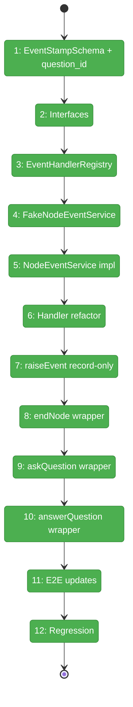
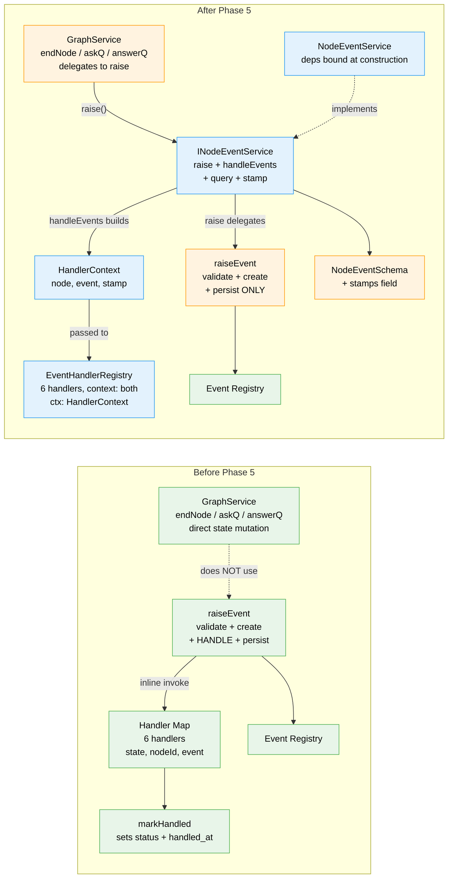

# Flight Plan: Phase 5 — INodeEventService + HandlerContext

**Plan**: [node-event-system-plan.md](../../node-event-system-plan.md)
**Phase**: Phase 5: Service Method Wrappers
**Generated**: 2026-02-08
**Status**: Complete

---

## Departure → Destination

**Where we are**: Phases 1-4 built the complete event infrastructure: a registry with 6 validated event types, the two-phase handshake state model, a `raiseEvent()` write path with 5-step validation, and 6 inline event handlers that transition node state. Subtask 001 removed the redundant backward-compat derivation layer. The system works — but it's held together by standalone functions. Consumers import `raiseEvent()`, `createEventHandlers()`, and `markHandled()` individually, wire them with raw parameters, and cast state objects in every handler. There is no service, no interface to fake, and no way to have multiple subscribers process the same event independently. Handlers are invoked inline during `raiseEvent()`, so recording an event and processing it are inseparable.

**Where we're going**: By the end of this phase, all node event operations live behind `INodeEventService` — a first-class domain service with an interface, a fake, and contract tests (ADR-0011). `raise()` becomes record-only: validate, create, append, persist. Processing moves to a separate `handleEvents(state, nodeId, subscriber, context)` call where handlers are resolved from an `EventHandlerRegistry` filtered by context (`'cli' | 'web'`), and each subscriber stamps events independently. Handlers receive a structured `HandlerContext` instead of raw `(state, nodeId, event)` — no casting, no plumbing, just business logic. `ctx.stamp()` writes only to `event.stamps[subscriber]` (not `event.status`/`handled_at`). Service methods (`endNode`, `askQuestion`, `answerQuestion`) become thin wrappers that call `eventService.raise()`. The CLI (Phase 6) gets a clean service to call, and the Event Handler Service (Plan 030) can process the graph as a second subscriber in the orchestration loop's settle phase.

---

## Flight Status

<!-- Updated by /plan-6: pending → active → done. Use blocked for problems/input needed. -->

**Legend**: grey = pending | yellow = active | red = blocked/needs input | green = done

---

## Stages

<!-- Updated by /plan-6 during implementation: [ ] → [~] → [x] -->

- [x] **Stage 1: EventStampSchema + stamps field + question_id** — add `EventStampSchema` Zod schema (`stamped_at`, `action`, `data?`) and an optional `stamps: Record<string, EventStamp>` field on `NodeEventSchema`. Add `question_id: z.string()` to `QuestionAskPayloadSchema` (DYK #3). Existing event parsing must still work without stamps. (`event-stamp.schema.ts` — new, `node-event.schema.ts` — modified, `event-payloads.schema.ts` — modified)
- [x] **Stage 2: INodeEventService + HandlerContext interfaces** — define `INodeEventService` with 6 methods (`raise`, `handleEvents(state, nodeId, subscriber, context)`, `getEventsForNode`, `findEvents`, `getUnstampedEvents`, `stamp`) and `HandlerContext` with `node`, `event`, `events`, `subscriber`, `nodeId`, `stamp(action, data?)`, `stampEvent(event, action, data?)`, `findEvents(predicate)`. Change `EventHandler` type to `(ctx: HandlerContext) => void`. (`node-event-service.interface.ts`, `handler-context.interface.ts` — new)
- [x] **Stage 3: EventHandlerRegistry** — `EventHandlerRegistry` class with `on(eventType, handler, { context, name })` and `getHandlers(eventType, context)` methods. Types: `EventHandlerRegistration`, `EventHandlerContextTag = 'cli' | 'web' | 'both'`. `createEventHandlerRegistry()` factory registers all 6 handlers as `context: 'both'`. Unit tests for registration, context filtering, ordering. (`event-handler-registry.ts` — new)
- [x] **Stage 4: FakeNodeEventService** — implement fake with test helpers (`addEvent`, `getRaiseHistory`, `getHandleEventsHistory`, `getStampHistory`, `reset`). Unit tests verify fake behavior. (`fake-node-event-service.ts` — new)
- [x] **Stage 5: NodeEventService implementation** — real service: `raise()` delegates to existing raiseEvent logic with constructor-bound deps, `handleEvents()` scans unstamped events + filters handlers by context via `registry.getHandlers(eventType, context)` + constructs HandlerContext + runs handlers + stamps. JSDoc warns "state must be loaded AFTER raise() returns" (DYK #2). Stale-state no-op test. Query methods read from state. `stamp()` writes to `event.stamps[subscriber]`. Full unit tests. (`node-event-service.ts` — new, `node-event-service.test.ts` — new)
- [x] **Stage 6: Refactor handlers to HandlerContext** — change all 6 handlers from `(state, nodeId, event)` to `(ctx: HandlerContext)`. `markHandled()` REMOVED — `ctx.stamp('state-transition')` writes ONLY to `event.stamps[subscriber]`, not to `event.status`/`handled_at` (DYK #4). Fix `handleQuestionAnswer` to add `ctx.node.status = 'starting'` (DYK #1b), read `question_id` from payload (DYK #3), use `ctx.findEvents()` to locate original ask event by `question_event_id`, and call `ctx.stampEvent(askEvent, 'answer-linked')` to cross-stamp it (DYK5 #1). `createEventHandlerRegistry()` replaces `createEventHandlers()`. Handler tests updated. (`event-handlers.ts` — modified, `event-handlers.test.ts` — modified)
- [x] **Stage 7: Make raiseEvent record-only** — remove handler invocation (lines 163-167) and `createEventHandlers` import from `raise-event.ts`. Events stay `'new'` after raise. Update Phase 3 tests (status expectations change). (`raise-event.ts` — modified, `raise-event.test.ts` — modified)
- [x] **Stage 8: endNode wrapper** — `endNode()` validates canEnd (pre-flight guard, DYK #1), then calls `eventService.raise(graphSlug, nodeId, 'node:completed', {}, 'agent')`. Contract test: verify correct node status, `completed_at`, events recorded, stamps present after raise + handleEvents. (`positional-graph.service.ts` — modified, `service-wrapper-contracts.test.ts` — new)
- [x] **Stage 9: askQuestion wrapper** — `askQuestion()` builds payload (includes `question_id`), calls `eventService.raise()`. `state.questions[]` still written by service (DD-6). Contract test: verify node status (`waiting-question`), `pending_question_id` set, event recorded with stamps. (`positional-graph.service.ts` — modified)
- [x] **Stage 10: answerQuestion wrapper** — `answerQuestion()` builds payload, calls `eventService.raise()`. Node transitions to `'starting'` via handler (DYK #1b). Contract test: verify node status (`starting`), `pending_question_id` cleared, original ask event cross-stamped, answer event recorded with stamps. (`positional-graph.service.ts` — modified)
- [x] **Stage 11: E2E walkthrough updates** — Phase 4 E2E tests updated to use raise + handleEvents (with context param) sequence. `simulateAgentAccept()` helpers updated. All 4 walkthroughs pass. (`raise-event-e2e.test.ts` — modified, `event-handlers.test.ts` — walkthroughs rewritten for two-phase flow)
- [x] **Stage 12: Regression verification** — `just fft` clean. 241 test files, 3634 tests passed. No new lint errors.

---

## Architecture: Before & After

**Legend**: existing (green, unchanged) | changed (orange, modified) | new (blue, created)

---

## Acceptance Criteria

- [ ] Subscriber stamps model: events carry `stamps: Record<string, EventStamp>` (AC-17)
- [ ] Two-phase handshake via handlers: `starting` → `agent-accepted`, `answerQuestion` → `starting` (AC-6)
- [ ] Question lifecycle via events: ask → `waiting-question`, answer → `starting` + clear `pending_question_id` (AC-7)
- [ ] `raiseEvent()` is the single write path for all node state changes (AC-15)
- [ ] Schema backward compatible: events without stamps still parse (AC-17)
- [ ] `handleEvents()` accepts `context: 'cli' | 'web'` param, filters handlers via `EventHandlerRegistry` (WS10)
- [ ] `ctx.stamp()` writes ONLY to `event.stamps[subscriber]`; does NOT write `event.status`/`handled_at` (DYK #4)
- [ ] `QuestionAskPayloadSchema` includes `question_id` field (DYK #3)
- [ ] `just fft` clean

## Goals & Non-Goals

**Goals**:
- Elevate node event operations into `INodeEventService` with interface, fake, and contract tests
- Separate recording (`raise`) from processing (`handleEvents`) — Workshop 06 principle
- Introduce `HandlerContext` for handler ergonomics — no casting, no plumbing
- Replace `markHandled()` with subscriber stamps via `ctx.stamp()`
- Fix `handleQuestionAnswer` to transition to `starting` (DYK #1)
- Make `endNode()`, `askQuestion()`, `answerQuestion()` thin wrappers delegating to `eventService.raise()`
- All existing tests pass after refactoring

**Non-Goals**:
- CLI commands wiring (`cg wf node end`, etc.) — Phase 6
- ONBAS adaptation to event-based flow — Phase 8
- Event Handler Service / graph-wide processing — Plan 030 Phase 7
- Public DI token for `INodeEventService` — internal to positional-graph
- Removing `event.status`/`handled_at`/`handler_notes` fields from schema — preserved for schema backward compat but no longer written by handlers (DYK #4)
- Migrating `state.questions[]` to event-based queries — Phase 6+ scope

---

## Checklist

- [x] T001: EventStampSchema + stamps field + question_id payload (CS-1)
- [x] T002: INodeEventService interface + HandlerContext interface (CS-1)
- [x] T003: EventHandlerRegistry + context tags (CS-2)
- [x] T004: FakeNodeEventService + test helpers (CS-2)
- [x] T005: NodeEventService implementation + unit tests (CS-3)
- [x] T006: Refactor handlers to HandlerContext signature (CS-2)
- [x] T007: Make raiseEvent record-only (CS-2)
- [x] T008: Service wrapper: endNode() delegates to eventService.raise() (CS-2)
- [x] T009: Service wrapper: askQuestion() delegates to eventService.raise() (CS-2)
- [x] T010: Service wrapper: answerQuestion() delegates to eventService.raise() (CS-2)
- [x] T011: Update E2E walkthrough tests (CS-2)
- [x] T012: Regression verification (CS-1)

---

## PlanPak

Active — new files organized under `features/032-node-event-system/`. Cross-plan edits to 1 file outside feature folder (`positional-graph.service.ts` for service wrapper delegation in T007-T009).
