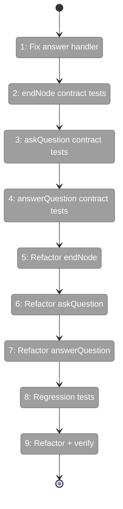
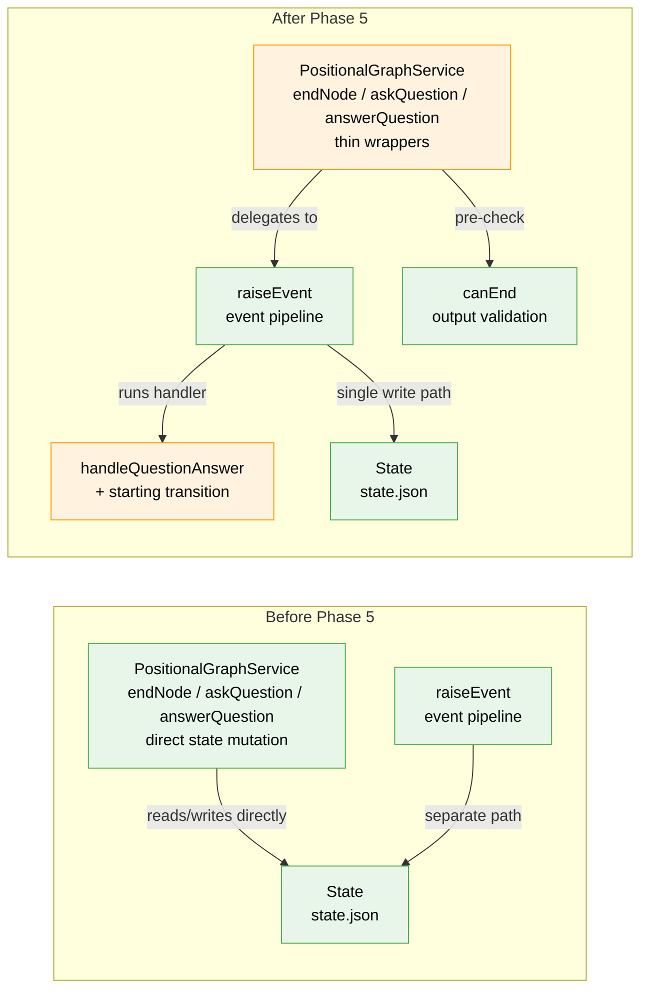

# Flight Plan: Phase 5 — Service Method Wrappers

**Plan**: [node-event-system-plan.md](../../node-event-system-plan.md)
**Phase**: Phase 5: Service Method Wrappers
**Generated**: 2026-02-07
**Status**: Ready for takeoff

---

## Departure → Destination

**Where we are**: Phases 1-4 delivered the complete node event system engine. Subtask 001 removed the redundant `deriveBackwardCompatFields()` from the pipeline — handlers write `pending_question_id` and `error` directly. The raiseEvent pipeline is now: validate → create event → append → handle → persist. But the three service methods that agents actually call — `endNode()`, `askQuestion()`, `answerQuestion()` — still mutate state directly, bypassing the event system entirely. Two write paths coexist. A replacement subtask (per Workshop 06) will separate raiseEvent into record-only and add handleEvents() with subscriber stamps for processing.

**Where we're going**: By the end of this phase, there is exactly one write path. `endNode()`, `askQuestion()`, and `answerQuestion()` become thin wrappers that construct an event payload and call `raiseEvent()`. A developer calling `service.endNode(ctx, 'my-graph', 'node-1')` will get back the same `EndNodeResult` as before, but under the hood an event is created, persisted atomically, and the wrapper applies the necessary state mutations — with a complete audit trail.

---

## Flight Status

<!-- Updated by /plan-6: pending → active → done. Use blocked for problems/input needed. -->

**Legend**: grey = pending | yellow = active | red = blocked/needs input | green = done

---

## Stages

<!-- Updated by /plan-6 during implementation: [ ] → [~] → [x] -->

- [x] ~~**Stage 1: questions[] derive tests**~~ — Eliminated by Subtask 001 (T001)
- [x] ~~**Stage 2: Implement questions[] derive**~~ — Eliminated by Subtask 001 (T002)
- [ ] **Stage 3: Fix answer handler status transition** — update `handleQuestionAnswer` to set node status to `starting` after answer, matching current `answerQuestion()` behavior (`event-handlers.ts`, `event-handlers.test.ts`)
- [ ] **Stage 4: Write endNode contract tests** — happy path completion, missing output rejection, wrong state error, return type verification (`service-wrappers.test.ts` — new file)
- [ ] **Stage 5: Write askQuestion contract tests** — happy path with question in `questions[]`, event_id as questionId, wrong state error (`service-wrappers.test.ts`)
- [ ] **Stage 6: Write answerQuestion contract tests** — happy path with `starting` status, question-not-found error, already-answered error (`service-wrappers.test.ts`)
- [ ] **Stage 7: Refactor endNode** — keep `canEnd()` pre-check, delegate to `raiseEvent('node:completed')`, map result to `EndNodeResult` (`positional-graph.service.ts`)
- [ ] **Stage 8: Refactor askQuestion** — construct `question:ask` payload from options, delegate to raiseEvent, return event_id as questionId (`positional-graph.service.ts`)
- [ ] **Stage 9: Refactor answerQuestion** — construct `question:answer` payload, delegate to raiseEvent, map to `AnswerQuestionResult` (`positional-graph.service.ts`)
- [ ] **Stage 10: Run regression tests** — verify all existing E2E, integration, and unit tests still pass after the refactor (`test/e2e/`, `test/integration/`)
- [ ] **Stage 11: Refactor and verify** — run `just fft`, confirm full test suite green

---

## Architecture: Before & After

**Legend**: existing (green, unchanged) | changed (orange, modified) | new (blue, created)

---

## Acceptance Criteria

- [ ] All service methods delegate to `raiseEvent()` (AC-15)
- [ ] No separate write path exists for node lifecycle and question events (AC-15)
- [ ] `pending_question_id` and `error` written directly by event handlers (AC-15)
- [ ] Contract tests prove behavioral parity between old and new paths
- [ ] Two-phase handshake preserved: answerQuestion resumes to `starting` (AC-6)
- [ ] Question lifecycle flows through events: ask → waiting-question, answer → starting (AC-7)
- [ ] All existing E2E/integration tests still pass
- [ ] `just fft` clean

## Goals & Non-Goals

**Goals**:
- Update `handleQuestionAnswer` to transition node status to `starting` (DYK #1)
- Write contract tests comparing old-path vs new-path for all 3 methods
- Refactor `endNode()` to delegate to `raiseEvent('node:completed')` (keeping `canEnd()` pre-check)
- Refactor `askQuestion()` to delegate to `raiseEvent('question:ask')`
- Refactor `answerQuestion()` to delegate to `raiseEvent('question:answer')`
- Create `RaiseEventDeps` factory closing over `WorkspaceContext`
- Verify all existing tests still pass

**Non-Goals**:
- CLI commands (Phase 6)
- ONBAS adaptation (Phase 7)
- Output persistence refactoring — orchestrator handles directly, not through events
- Event acknowledgment (`new` → `acknowledged`) — ODS responsibility (Plan 030 Phase 6)
- Adding `message` parameter to `endNode()` — Phase 6 CLI concern
- Adding `source` parameter to service method interfaces — internal detail

---

## Checklist

- [—] T001: ~~Write questions[] derivation tests~~ — Eliminated by Subtask 001
- [—] T002: ~~Implement questions[] derivation~~ — Eliminated by Subtask 001
- [ ] T003: Update handleQuestionAnswer to transition to starting (CS-2)
- [ ] T004: Write endNode contract tests (CS-2)
- [ ] T005: Write askQuestion contract tests (CS-2)
- [ ] T006: Write answerQuestion contract tests (CS-2)
- [ ] T007: Refactor endNode to delegate to raiseEvent (CS-2)
- [ ] T008: Refactor askQuestion to delegate to raiseEvent (CS-2)
- [ ] T009: Refactor answerQuestion to delegate to raiseEvent (CS-2)
- [ ] T010: Verify all existing tests pass (CS-2)
- [ ] T011: Refactor and verify with just fft (CS-1)

---

## PlanPak

Active — new files organized under `features/032-node-event-system/`. Cross-plan edit to 1 file (`positional-graph.service.ts`) in this phase.
