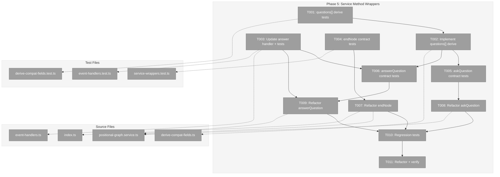

# Phase 5: Service Method Wrappers — Tasks & Alignment Brief

**Spec**: [node-event-system-spec.md](../../node-event-system-spec.md)
**Plan**: [node-event-system-plan.md](../../node-event-system-plan.md)
**Date**: 2026-02-07

---

## Executive Briefing

### Purpose
This phase refactors `endNode()`, `askQuestion()`, and `answerQuestion()` from direct state-mutation methods into thin wrappers that construct event payloads and delegate to `raiseEvent()`. After this phase, there is no separate write path for node lifecycle and question events — the event system IS the implementation.

### What We're Building
- **3 refactored service methods** — each becomes a wrapper that validates preconditions, constructs an event payload, calls `raiseEvent()`, and maps the result back to the original return type
- **Extended `deriveBackwardCompatFields()`** — adds `questions[]` reconstruction from event pairs (deferred from Phase 4 per DYK #4)
- **Updated `handleQuestionAnswer`** — adds `starting` status transition (resolving the Phase 4 design tension per DYK #1)
- **Contract tests** — proving behavioral parity between old direct path and new event path
- **`RaiseEventDeps` factory** — closure pattern to adapt `WorkspaceContext`-based service methods to the `raiseEvent` dependency bag

### User Value
No direct user-facing change. This is a structural refactoring that unifies all node state mutations through the event system. After this phase, every node state change produces an auditable event trail, and `state.json` can be reconstructed from events alone.

### Example
```typescript
// BEFORE: endNode() directly mutates state
async endNode(ctx, graphSlug, nodeId) {
  const state = await this.loadState(ctx, graphSlug);
  state.nodes[nodeId].status = 'complete';
  state.nodes[nodeId].completed_at = new Date().toISOString();
  await this.persistState(ctx, graphSlug, state);
  return { nodeId, status: 'complete', completedAt: ... };
}

// AFTER: endNode() delegates to raiseEvent()
async endNode(ctx, graphSlug, nodeId) {
  const canEndResult = await this.canEnd(ctx, graphSlug, nodeId);
  if (!canEndResult.canEnd) return missingOutputError(...);
  const deps = this.createRaiseEventDeps(ctx);
  const result = await raiseEvent(deps, graphSlug, nodeId, 'node:completed', {}, 'agent');
  return { nodeId, status: 'complete', completedAt: result.event?.handled_at };
}
```

---

## Objectives & Scope

### Objective
Refactor `endNode()`, `askQuestion()`, and `answerQuestion()` to delegate to `raiseEvent()` while maintaining behavioral parity verified by contract tests. Extend backward-compat derivation to cover `questions[]` array reconstruction.

### Goals

- Extend `deriveBackwardCompatFields()` to reconstruct top-level `questions[]` from event pairs
- Update `handleQuestionAnswer` to transition node status to `starting` (DYK #1 compliance)
- Write contract tests comparing old-path vs new-path behavior for all 3 methods
- Refactor `endNode()` to delegate to `raiseEvent('node:completed')` (keeping `canEnd()` pre-check)
- Refactor `askQuestion()` to delegate to `raiseEvent('question:ask')`
- Refactor `answerQuestion()` to delegate to `raiseEvent('question:answer')`
- Create `RaiseEventDeps` factory closing over `WorkspaceContext`
- Verify all existing E2E/integration tests still pass

### Non-Goals

- CLI commands — Phase 6
- ONBAS adaptation — Phase 7
- Output persistence refactoring (`saveOutputData`, `saveOutputFile`) — orchestrator handles directly, not through events
- Event acknowledgment (`new` → `acknowledged`) — ODS responsibility (Plan 030 Phase 6)
- Adding `message` parameter to `endNode()` — CLI Phase 6 concern
- Adding `source` parameter to service method interfaces — internal detail, hardcoded defaults

---

## Pre-Implementation Audit

### Summary
| File | Action | Origin | Modified By | Recommendation |
|------|--------|--------|-------------|----------------|
| `packages/positional-graph/src/features/032-node-event-system/derive-compat-fields.ts` | Modify | Phase 4 | — | Extend for questions[] |
| `packages/positional-graph/src/features/032-node-event-system/event-handlers.ts` | Modify | Phase 4 | — | Add starting transition to question:answer |
| `packages/positional-graph/src/services/positional-graph.service.ts` | Modify | Plan 026 | Plans 028, 029, 030, 032-P2 | Cross-plan edit: refactor 3 methods |
| `packages/positional-graph/src/features/032-node-event-system/index.ts` | Modify | Phase 1 | Phase 3, Phase 4 | Update barrel exports |
| `test/unit/positional-graph/features/032-node-event-system/derive-compat-fields.test.ts` | Modify | Phase 4 | — | Add questions[] tests |
| `test/unit/positional-graph/features/032-node-event-system/event-handlers.test.ts` | Modify | Phase 4 | — | Update question:answer status assertion |
| `test/unit/positional-graph/features/032-node-event-system/service-wrappers.test.ts` | Create | New | — | Contract tests for 3 wrappers |

### Compliance Check
One cross-plan edit to `positional-graph.service.ts` — this is expected and documented in the plan's Deviation Ledger. All other changes are within `features/032-node-event-system/` or test files owned by this plan.

### Key Findings

1. **Export verification**: ALL Phase 4 exports confirmed available — `raiseEvent`, `RaiseEventDeps`, `RaiseEventResult`, `createEventHandlers`, `EventHandler`, `deriveBackwardCompatFields`, `FakeNodeEventRegistry`, `registerCoreEventTypes`, all schema types.

2. **`RaiseEventDeps` signature mismatch**: `RaiseEventDeps.loadState` takes `(graphSlug: string)` but the service's `loadState` takes `(ctx: WorkspaceContext, graphSlug: string)`. Solution: closure pattern `loadState: (slug) => this.loadState(ctx, slug)`.

3. **`INodeEventRegistry` not on service**: The service has no registry field. Must be constructed internally (matches plan's "no public DI token" decision from Deviation Ledger).

4. **`canEnd()` is business logic**: Output validation via `canEnd()` must remain in the `endNode()` wrapper as a pre-flight check — `raiseEvent` has no concept of output completeness.

---

## Requirements Traceability

### Coverage Matrix
| AC | Description | Flow Summary | Files in Flow | Tasks | Status |
|----|-------------|-------------|---------------|-------|--------|
| AC-15 | raiseEvent is single write path | Service methods → construct payload → raiseEvent() → handler → derive compat → persist | positional-graph.service.ts, raise-event.ts, event-handlers.ts, derive-compat-fields.ts | T001–T012 | Planned |
| AC-6 | Two-phase handshake preserved | endNode guards on agent-accepted via VALID_FROM_STATES; answerQuestion resumes to starting | event-handlers.ts (updated), positional-graph.service.ts | T003, T005, T008 | Planned |
| AC-7 | Question lifecycle through events | askQuestion → question:ask event → waiting-question; answerQuestion → question:answer → starting + questions[] updated | event-handlers.ts, derive-compat-fields.ts, positional-graph.service.ts | T002, T003, T004, T005, T007, T008 | Planned |

### Gaps Found

**Gap 1 (RESOLVED IN THIS PHASE)**: `deriveBackwardCompatFields()` does not reconstruct `questions[]` — Phase 4 explicitly deferred this (DYK #4). Tasks T001–T002 add tests and implementation.

**Gap 2 (RESOLVED IN THIS PHASE)**: `handleQuestionAnswer` does not transition node status to `starting` — contradicts DYK #1 and current `answerQuestion()` behavior. Task T003 updates the handler. Resolution: the plan (line 406) explicitly states answerQuestion transitions to `starting`. The Workshop #02 "status does NOT change" note describes the future ONBAS-driven pattern (Phase 7). For Phase 5, the handler must match current behavior.

**Gap 3 (ACCEPTED)**: Error codes shift from E172/E176/E177/E173 to E193/E194/E195. This is intentional — the event error codes are canonical. Contract tests verify behavior, not specific error codes.

**Gap 4 (ACCEPTED)**: Question ID format changes from `YYYY-MM-DDTHH:mm:ss.sssZ_xxxxxx` to `evt_<hex>_<hex>`. This is simpler than it appears — `question_event_id` is just a regular `NodeEvent.event_id` used as a foreign key. One ID value flows through five aliases: `event_id` → `questionId` → `question_event_id` → `questions[].question_id` → `pending_question_id`. All production consumers treat question IDs as opaque strings (`z.string().min(1)`). One test regex at `question-answer.test.ts:114` needs updating. See [Workshop 03](../workshops/03-question-id-migration.md).

### Orphan Files
None.

---

## Architecture Map

### Component Diagram
<!-- Status: grey=pending, orange=in-progress, green=completed, red=blocked -->
<!-- Updated by plan-6 during implementation -->



### Task-to-Component Mapping

<!-- Status: Pending | In Progress | Complete | Blocked -->

| Task | Component(s) | Files | Status | Comment |
|------|-------------|-------|--------|---------|
| T001 | Compat Derive Tests | derive-compat-fields.test.ts | ⬜ Pending | Add questions[] reconstruction tests |
| T002 | Compat Derive Impl | derive-compat-fields.ts | ⬜ Pending | Extend for questions[] from event pairs |
| T003 | Answer Handler | event-handlers.ts, event-handlers.test.ts | ⬜ Pending | Add starting transition, update tests |
| T004 | Contract Tests | service-wrappers.test.ts | ⬜ Pending | endNode old-path vs new-path |
| T005 | Contract Tests | service-wrappers.test.ts | ⬜ Pending | askQuestion old-path vs new-path |
| T006 | Contract Tests | service-wrappers.test.ts | ⬜ Pending | answerQuestion old-path vs new-path |
| T007 | Service Refactor | positional-graph.service.ts, index.ts | ⬜ Pending | endNode → raiseEvent wrapper |
| T008 | Service Refactor | positional-graph.service.ts | ⬜ Pending | askQuestion → raiseEvent wrapper |
| T009 | Service Refactor | positional-graph.service.ts | ⬜ Pending | answerQuestion → raiseEvent wrapper |
| T010 | Regression | Existing test files | ⬜ Pending | E2E + integration tests green |
| T011 | Quality | All | ⬜ Pending | just fft clean |

---

## Tasks

| Status | ID | Task | CS | Type | Dependencies | Absolute Path(s) | Validation | Subtasks | Notes |
|--------|------|------|-----|------|-------------|-------------------|------------|----------|-------|
| [ ] | T001 | Write tests for `deriveBackwardCompatFields()` questions[] reconstruction: single ask → question entry, ask+answer → answered question, multiple nodes → aggregated questions[], empty events → empty questions[] | 2 | Test | – | `/home/jak/substrate/030-positional-orchestrator/test/unit/positional-graph/features/032-node-event-system/derive-compat-fields.test.ts` | Tests fail (RED) | 001-subtask-drop-backward-compat | Prerequisite: Phase 4 deferred questions[] to Phase 5 (DYK #4); plan task 5.2 prep. **BLOCKED: Subtask 001 will eliminate this task per Workshop 04 Option C.** |
| [ ] | T002 | Extend `deriveBackwardCompatFields()` to reconstruct top-level `questions[]` array from `question:ask` + `question:answer` event pairs across all nodes in state. Map ask event payload to `Question` schema fields, populate `answer`/`answered_at` from matching answer events. | 2 | Core | T001 | `/home/jak/substrate/030-positional-orchestrator/packages/positional-graph/src/features/032-node-event-system/derive-compat-fields.ts` | All T001 tests pass (GREEN) | 001-subtask-drop-backward-compat | Plan task 5.2 prep. questions[] is a graph-level field derived from per-node events. Event `event_id` becomes `question_id` in the Question object. **BLOCKED: Subtask 001 will eliminate this task per Workshop 04 Option C.** |
| [ ] | T003 | Update `handleQuestionAnswer` to transition node status to `'starting'` (two-phase handshake resume per DYK #1). Update Phase 4 tests that assert status stays `waiting-question` after answer. | 2 | Core | – | `/home/jak/substrate/030-positional-orchestrator/packages/positional-graph/src/features/032-node-event-system/event-handlers.ts`, `/home/jak/substrate/030-positional-orchestrator/test/unit/positional-graph/features/032-node-event-system/event-handlers.test.ts` | Handler transitions to starting; Phase 4 tests updated and pass | 002-subtask-remove-inline-handlers | Resolves Phase 4/5 design tension. Plan line 406: "answerQuestion() transitions to starting." DYK #1: agent must re-accept after answer. Workshop #02's "no status change" pattern deferred to Phase 7 ONBAS. **BLOCKED: Subtask 002 will eliminate this task per Workshop 05 — handlers no longer called inline.** |
| [ ] | T004 | Write contract tests for `endNode()` via events: (a) happy path — agent-accepted node completes, `status='complete'`, `completed_at` set, event in log; (b) missing outputs — `canEnd()` rejects before raiseEvent; (c) wrong state — non-agent-accepted node returns error; (d) return type matches `EndNodeResult` | 2 | Test | – | `/home/jak/substrate/030-positional-orchestrator/test/unit/positional-graph/features/032-node-event-system/service-wrappers.test.ts` | Tests fail (RED) | 002-subtask-remove-inline-handlers | Plan task 5.1. AC-15. canEnd() pre-check must remain in wrapper. **SCOPE CHANGE: Subtask 002 simplifies — raiseEvent records only, wrapper tests verify state mutations.** |
| [ ] | T005 | Write contract tests for `askQuestion()` via events: (a) happy path — agent-accepted node asks question, `status='waiting-question'`, question in questions[], event_id returned as questionId; (b) wrong state — returns error; (c) payload maps AskQuestionOptions to question:ask payload; (d) return type matches `AskQuestionResult` | 2 | Test | T002 | `/home/jak/substrate/030-positional-orchestrator/test/unit/positional-graph/features/032-node-event-system/service-wrappers.test.ts` | Tests fail (RED) | 002-subtask-remove-inline-handlers | Plan task 5.2. AC-15, AC-7. Depends on T002 because questions[] derivation must work. **SCOPE CHANGE: Subtask 002 simplifies — raiseEvent records only, wrapper tests verify state mutations.** |
| [ ] | T006 | Write contract tests for `answerQuestion()` via events: (a) happy path — waiting-question node answers, ask event handled, status='starting', pending cleared, questions[] updated with answer; (b) question not found → error; (c) already answered → error (E195, new validation); (d) return type matches `AnswerQuestionResult` | 2 | Test | T002, T003 | `/home/jak/substrate/030-positional-orchestrator/test/unit/positional-graph/features/032-node-event-system/service-wrappers.test.ts` | Tests fail (RED) | 002-subtask-remove-inline-handlers | Plan task 5.3. AC-15, AC-7. Depends on T002 (questions[] derive) and T003 (starting transition). **SCOPE CHANGE: Subtask 002 simplifies — raiseEvent records only, wrapper tests verify state mutations.** |
| [ ] | T007 | Refactor `endNode()` to delegate to `raiseEvent('node:completed')`: keep `canEnd()` pre-check, create `RaiseEventDeps` via closure pattern, call raiseEvent, map `RaiseEventResult` to `EndNodeResult`. Remove direct state mutation. Update barrel exports if needed. | 2 | Core | T004 | `/home/jak/substrate/030-positional-orchestrator/packages/positional-graph/src/services/positional-graph.service.ts`, `/home/jak/substrate/030-positional-orchestrator/packages/positional-graph/src/features/032-node-event-system/index.ts` | Contract test T004 passes (GREEN); return type unchanged | – | Plan task 5.6. Wrapper pattern: pre-validate → construct deps → raiseEvent → map result. Source: 'agent'. |
| [ ] | T008 | Refactor `askQuestion()` to delegate to `raiseEvent('question:ask')`: construct payload from `AskQuestionOptions`, call raiseEvent, extract `event.event_id` as questionId, map to `AskQuestionResult`. Remove direct state mutation and question ID generation. | 2 | Core | T005 | `/home/jak/substrate/030-positional-orchestrator/packages/positional-graph/src/services/positional-graph.service.ts` | Contract test T005 passes (GREEN); return type unchanged | – | Plan task 5.7. `event.event_id` returned directly as `questionId` — no translation needed (D6). `generateQuestionId()` removed. Source: 'agent'. |
| [ ] | T009 | Refactor `answerQuestion()` to delegate to `raiseEvent('question:answer')`: construct payload with `{ question_event_id, answer }`, call raiseEvent, map to `AnswerQuestionResult`. Remove direct state mutation. | 2 | Core | T006, T003 | `/home/jak/substrate/030-positional-orchestrator/packages/positional-graph/src/services/positional-graph.service.ts` | Contract test T006 passes (GREEN); return type unchanged, status='starting' | – | Plan task 5.8. Source: 'human'. Caller's `questionId` passed directly as `question_event_id` — no translation needed (D6). Same `event_id` value, different field name. |
| [ ] | T010 | Verify all existing CLI/integration/E2E tests pass with refactored methods. Run `positional-graph-execution-e2e.test.ts` and all integration tests. Fix any regressions. | 2 | Test | T007, T008, T009 | `/home/jak/substrate/030-positional-orchestrator/test/e2e/`, `/home/jak/substrate/030-positional-orchestrator/test/integration/positional-graph/` | All existing tests green | – | Plan task 5.11. Regression check — critical because this is a cross-plan edit to the service. |
| [ ] | T011 | Refactor and verify with `just fft` | 1 | Quality | T010 | All files | `just fft` clean, all tests green | – | Plan task 5.12 |

---

## Alignment Brief

### Prior Phases Review

#### Phase 1: Event Types, Schemas, and Registry (Complete)
**Deliverables available to Phase 5:**
- `NodeEventRegistry` + `FakeNodeEventRegistry` — registry with register/get/list/validatePayload
- `registerCoreEventTypes()` — registers all 6 types with Zod schemas, allowedSources, stopsExecution, domain
- `generateEventId()` — `evt_<hex_timestamp>_<hex_random>` format
- 6 payload schemas: `NodeAcceptedPayloadSchema`, `NodeCompletedPayloadSchema`, `NodeErrorPayloadSchema`, `QuestionAskPayloadSchema`, `QuestionAnswerPayloadSchema`, `ProgressUpdatePayloadSchema`
- `EventSource`, `EventStatus`, `NodeEvent` types
- Error factories E190-E195 in `event-errors.ts`
- All exported via barrel `index.ts`
- 94 tests across 4 test files
- **Discovery**: `errors/index.ts` auto-exports via `keyof typeof` — no modification needed

#### Phase 2: State Schema Extension and Two-Phase Handshake (Complete)
**Deliverables available to Phase 5:**
- `NodeExecutionStatusSchema` updated: `starting`, `agent-accepted`, `waiting-question`, `blocked-error`, `complete`
- `NodeStateEntrySchema` with optional `events: z.array(NodeEventSchema).optional()`
- `isNodeActive(status)` and `canNodeDoWork(status)` predicates in `event-helpers.ts`
- `simulateAgentAccept()` test helpers
- All `=== 'running'` references updated across codebase (7 source files, 13 test files)
- `answerQuestion()` now transitions to `starting` (not `agent-accepted`) — DYK #1
- 18 new tests, 3541 total

#### Phase 3: raiseEvent Core Write Path (Complete)
**Deliverables available to Phase 5:**
- `raiseEvent(deps, graphSlug, nodeId, eventType, payload, source)` — 5-step validation pipeline
- `RaiseEventDeps`: `{ registry: INodeEventRegistry, loadState, persistState }`
- `RaiseEventResult`: `{ ok: boolean, event?: NodeEvent, errors: ResultError[] }`
- `VALID_FROM_STATES` map: `node:completed → ['agent-accepted']`, `question:ask → ['agent-accepted']`, `question:answer → ['waiting-question']`
- `createFakeStateStore()`, `createDeps()`, `makeState()` test helpers
- 22 tests covering all validation steps
- **Critical context**: raiseEvent Step 5 validates question references for `question:answer` — finds ask event by `question_event_id` in node events, returns E194 (not found) or E195 (already answered)

#### Phase 4: Event Handlers and State Transitions (Complete)
**Deliverables available to Phase 5:**
- 6 event handlers via `createEventHandlers()` factory returning `Map<string, EventHandler>`
- `handleNodeCompleted`: `agent-accepted` → `complete`, sets `completed_at`, marks event `handled`
- `handleQuestionAsk`: `agent-accepted` → `waiting-question`, sets `pending_question_id` to event_id, event stays `new`
- `handleQuestionAnswer`: marks ask event `handled` with `handler_notes`, clears `pending_question_id`, marks answer `handled`, **does NOT change node status** (must be updated in T003)
- `handleProgressUpdate`: no state change, marks event `handled`
- `deriveBackwardCompatFields()`: derives `pending_question_id` (latest unanswered ask) and `error` (latest error payload); **does NOT derive `questions[]`** (deferred to Phase 5 per DYK #4)
- Wired into raiseEvent: validate → create → append → handle → derive compat → persist
- 36 new tests (23 handler + 9 compat + 4 E2E walkthroughs), 3588 total

### Cumulative Dependencies for Phase 5

Phase 5 builds on the complete Phases 1-4 stack. The key integration points:
1. **raiseEvent()** — the write path through which all 3 wrappers will delegate
2. **Event handlers** — `handleNodeCompleted`, `handleQuestionAsk`, `handleQuestionAnswer` drive state transitions
3. **deriveBackwardCompatFields()** — must be extended for `questions[]` before wrappers can remove direct `questions[]` writes
4. **`canEnd()` on PositionalGraphService** — output validation that endNode() must preserve
5. **Test infrastructure** — `createFakeStateStore()`, `createDeps()`, `makeState()` from Phase 3/4

### Critical Findings Affecting This Phase

**Finding 01: Status Enum Replacement Cascades (Critical)**
All service methods that manipulate node state gate on `canNodeDoWork(status)` which returns true only for `'agent-accepted'`. The wrappers inherit this behavior from `VALID_FROM_STATES` in raiseEvent — no manual guard needed.

**Finding 02: Service Methods Must Guard on agent-accepted, Not starting (Critical)**
`endNode()`, `askQuestion()` require `agent-accepted`. `answerQuestion()` requires `waiting-question`. All three are encoded in `VALID_FROM_STATES` and enforced by raiseEvent Step 4.

**Finding 03: Backward-Compat Fields Are Derived Projections (Critical)**
After Phase 5, `pending_question_id`, `error`, and `questions[]` are all computed from the event log after every `raiseEvent()` call. No dual-write. The wrappers must NOT write these fields directly — `deriveBackwardCompatFields()` handles them.

### Design Decisions

**D1: handleQuestionAnswer transitions to `starting`**
The plan (line 406) explicitly states `answerQuestion()` transitions to `starting` via two-phase handshake resume. DYK #1 (Phase 2) established this behavior. Workshop #02's "status does NOT change" note describes the future ONBAS-driven pattern for Phase 7. For Phase 5, the handler must match current observable behavior. This is implemented in T003.

**D2: canEnd() remains as pre-flight check in endNode() wrapper**
Output validation is business logic (checks filesystem for saved outputs). This cannot move into raiseEvent or the event handler. The wrapper calls `canEnd()` before `raiseEvent()`. If outputs are missing, it returns E175 without raising an event.

**D3: EventSource hardcoded per wrapper**
- `endNode()` → `source: 'agent'` (completion initiated by agent)
- `askQuestion()` → `source: 'agent'` (agents ask questions)
- `answerQuestion()` → `source: 'human'` (humans answer questions)
The service interface signatures do not change — source is an internal detail.

**D4: RaiseEventDeps via closure pattern**
The service creates `RaiseEventDeps` by closing over `WorkspaceContext`:
```typescript
const deps: RaiseEventDeps = {
  registry: this.eventRegistry,
  loadState: (slug) => this.loadState(ctx, slug),
  persistState: (slug, state) => this.persistState(ctx, slug, state),
};
```
The registry is constructed once during service initialization (no DI token per plan Deviation Ledger).

**D5: Error codes shift is intentional**
E172/E176/E177 → E193 (generic state transition error). E173 → E194 (question event not found). New E195 (already answered) is additional validation. Contract tests verify behavioral correctness (errors returned for invalid inputs), not specific error codes.

**D6: Question ID is just a regular event_id**
`question_event_id` is not a special type — it's a regular `NodeEvent.event_id` (generated by `generateEventId()`) that happens to point to a `question:ask` event. One ID value flows through five context-dependent names: `event_id` (on the event), `questionId` (in API return types and CLI), `question_event_id` (in the answer payload, as a foreign key), `question_id` (in derived `questions[]`), and `pending_question_id` (on node state). All consumers treat it as an opaque string. The format change from ISO timestamp to `evt_<hex>_<hex>` has zero impact on production code — only one test regex needs updating. No translation layer needed in the wrappers: `askQuestion` returns `event.event_id` as `questionId`; `answerQuestion` passes the caller's `questionId` directly as `question_event_id`. See [Workshop 03](../workshops/03-question-id-migration.md).

### Wrapper Mapping Reference

| Current Step | endNode Wrapper | askQuestion Wrapper | answerQuestion Wrapper |
|---|---|---|---|
| Load node config (existence check) | Keep (better DX) | Keep | Keep |
| Status guard | Removed — raiseEvent handles via VALID_FROM_STATES | Removed | Removed |
| Pre-flight validation | `canEnd()` — keep | None | None |
| Generate question ID | N/A | Removed — event_id is the ID | N/A |
| Push to questions[] | N/A | Removed — derive-compat handles | Removed — derive-compat handles |
| Write answer to questions[] | N/A | N/A | Removed — answer lives in event payload |
| Set node status | Removed — handler does it | Removed — handler does it | Removed — handler does it |
| Set completed_at | Removed — handler does it | N/A | N/A |
| Set pending_question_id | N/A | Removed — handler + derive-compat | Removed — handler + derive-compat |
| Persist state | Removed — raiseEvent does it | Removed — raiseEvent does it | Removed — raiseEvent does it |
| Map return type | RaiseEventResult → EndNodeResult | RaiseEventResult → AskQuestionResult | RaiseEventResult → AnswerQuestionResult |

### Test Plan (Full TDD)

**Test file 1: `derive-compat-fields.test.ts` (MODIFY)**

New describe block for questions[] reconstruction (T001):
- Single question:ask event → `questions[]` contains one Question object with correct fields
- ask + answer pair → Question has `answer` and `answered_at`
- Multiple nodes with questions → all aggregated into single `questions[]` array
- Empty events → empty `questions[]`
- Mixed: one answered + one pending → both in `questions[]`, only answered has `answer`

**Test file 2: `event-handlers.test.ts` (MODIFY)**

Update question:answer handler tests (T003):
- Change assertion: status transitions from `waiting-question` → `starting` (was: no change)
- Update E2E walkthrough test for Q&A lifecycle if it asserts post-answer status

**Test file 3: `service-wrappers.test.ts` (NEW)**

Contract tests using `createFakeStateStore` pattern (T004-T006):
- `endNode` describe: happy path, missing outputs, wrong state, return type
- `askQuestion` describe: happy path, wrong state, return type, event_id as questionId
- `answerQuestion` describe: happy path, question not found, already answered, return type

**Regression: existing tests (T010)**
- `test/e2e/positional-graph-execution-e2e.test.ts`
- All integration tests in `test/integration/positional-graph/`
- All existing 032-node-event-system tests

### Implementation Outline

1. **T001** (RED): Add questions[] derivation tests to `derive-compat-fields.test.ts`
2. **T002** (GREEN): Extend `deriveBackwardCompatFields()` to reconstruct questions[]
3. **T003** (FIX): Update `handleQuestionAnswer` to set `starting`, update Phase 4 tests
4. **T004** (RED): Write endNode contract tests in `service-wrappers.test.ts`
5. **T005** (RED): Write askQuestion contract tests
6. **T006** (RED): Write answerQuestion contract tests
7. **T007** (GREEN): Refactor endNode() to delegate to raiseEvent
8. **T008** (GREEN): Refactor askQuestion() to delegate to raiseEvent
9. **T009** (GREEN): Refactor answerQuestion() to delegate to raiseEvent
10. **T010** (REGRESSION): Run all existing tests, fix any breakage
11. **T011** (VERIFY): `just fft` clean

### Commands to Run

```bash
# Run Phase 5 derive-compat tests
pnpm test -- --reporter=verbose test/unit/positional-graph/features/032-node-event-system/derive-compat-fields.test.ts

# Run Phase 5 handler tests
pnpm test -- --reporter=verbose test/unit/positional-graph/features/032-node-event-system/event-handlers.test.ts

# Run Phase 5 contract tests
pnpm test -- --reporter=verbose test/unit/positional-graph/features/032-node-event-system/service-wrappers.test.ts

# Run all 032 tests
pnpm test -- --reporter=verbose test/unit/positional-graph/features/032-node-event-system/

# Run E2E regression
pnpm test -- --reporter=verbose test/e2e/

# Full quality check
just fft
```

### Risks & Unknowns

| Risk | Severity | Mitigation |
|------|----------|------------|
| Cross-plan edit to service.ts breaks existing behavior | High | Contract tests (T004-T006) + regression tests (T010) verify parity |
| Phase 4 tests break when handler is updated (T003) | Medium | Only the question:answer status assertion changes; update explicitly |
| E2E tests rely on specific question ID format | Medium | E2E tests should only assert ID is a string, not its format |
| Double state load (service pre-check + raiseEvent internal load) | Low | Acceptable for correctness; performance optimization is Phase 7+ |
| canEnd() race condition (outputs change between check and raiseEvent) | Low | Same risk existed before; atomic persistence mitigates |

### Ready Check

- [ ] Phase 4 exports verified (raiseEvent, handlers, compat derivation)
- [ ] Service method signatures documented (endNode, askQuestion, answerQuestion + return types)
- [ ] RaiseEventDeps closure pattern designed
- [ ] questions[] derivation approach clear (reconstruct from event pairs)
- [ ] handleQuestionAnswer update approach clear (add starting transition)
- [ ] Contract test strategy defined (old-path vs new-path comparison)
- [ ] Error code migration impact assessed (E172→E193, etc.)
- [ ] Cross-plan edit impact understood (service.ts owned by Plan 026+)

---

## Phase Footnote Stubs

_Populated during implementation by plan-6._

---

## Evidence Artifacts

Implementation evidence will be written to:
- `docs/plans/032-node-event-system/tasks/phase-5-service-method-wrappers/execution.log.md`

---

## Discoveries & Learnings

_Populated during implementation by plan-6. Log anything of interest to your future self._

| Date | Task | Type | Discovery | Resolution | References |
|------|------|------|-----------|------------|------------|
| | | | | | |

**Types**: `gotcha` | `research-needed` | `unexpected-behavior` | `workaround` | `decision` | `debt` | `insight`

**What to log**:
- Things that didn't work as expected
- External research that was required
- Implementation troubles and how they were resolved
- Gotchas and edge cases discovered
- Decisions made during implementation
- Technical debt introduced (and why)
- Insights that future phases should know about

_See also: `execution.log.md` for detailed narrative._

---

## Directory Layout

```
docs/plans/032-node-event-system/
  ├── node-event-system-plan.md
  ├── node-event-system-spec.md
  └── tasks/phase-5-service-method-wrappers/
      ├── tasks.md                # This file
      ├── tasks.fltplan.md        # Generated by /plan-5b
      └── execution.log.md       # Created by /plan-6
```
