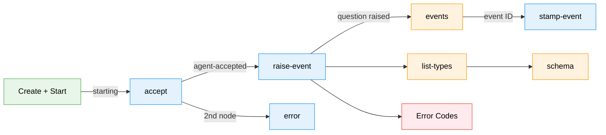
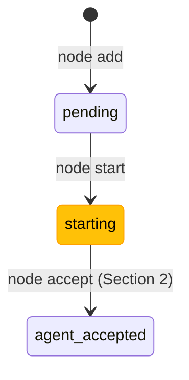
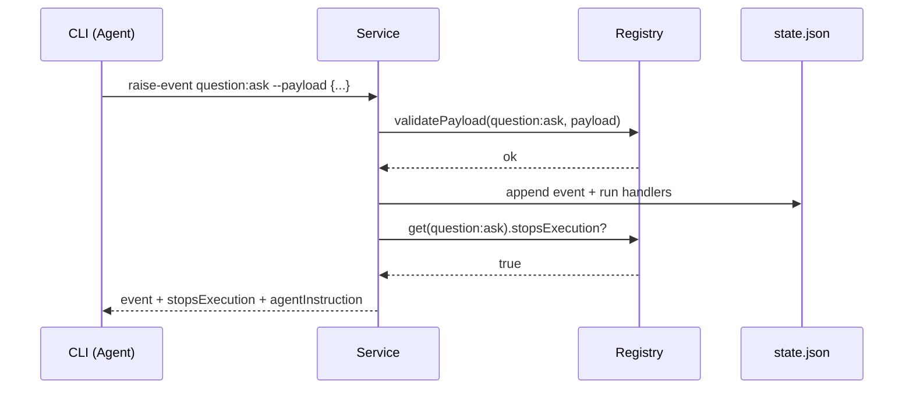
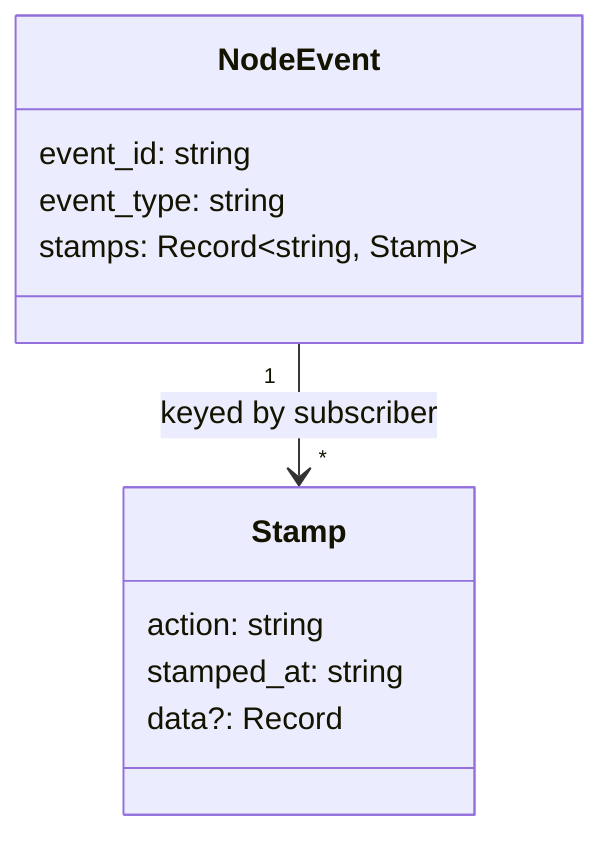
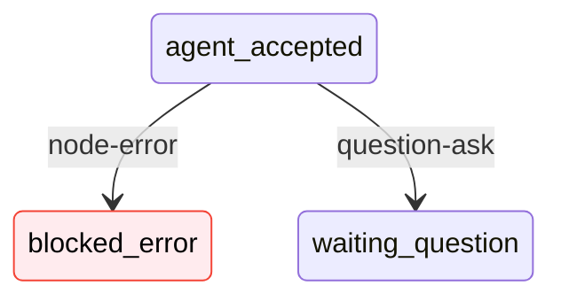

# Worked Example Walkthrough: Node Event CLI Commands

> **Script**: [`worked-example-cli.sh`](./worked-example-cli.sh)
> **Run**: `bash docs/plans/032-node-event-system/tasks/phase-6-cli-commands/examples/worked-example-cli.sh`

## What This Demonstrates

After reading this walkthrough, you'll understand how an LLM agent interacts with the node event system entirely through CLI commands. You'll see the full lifecycle — from accepting a task, through raising structured events and stamping them as processed, to discovering event types at runtime — and know which error codes to expect when things go wrong.

---

## High-Level Flow

**Legend**: green = setup | blue = core commands | orange = inspection | red = error paths

---

## Section-by-Section

### 1. Setup -- Create Graph, Add Node, Start

Every event command operates on a node that already exists in a graph. This section creates the scaffolding: a graph named `worked-example-<pid>` (using the process ID for uniqueness), a single line, and a node backed by the `sample-coder` work unit. After `node start`, the node enters `starting` state — the first half of the two-phase handshake introduced in Phase 2. The node is _alive_ but not yet _working_; no events can be raised except `node:accepted`.

**What to watch in output**: The `node start` response shows `"status": "starting"` — not `running`. This is the handshake state that requires explicit acceptance.

---

### 2. accept -- Agent Accepts the Node

The `accept` shortcut is syntactic sugar for `raise-event node:accepted`. It's the first command an agent runs after receiving a task assignment. Internally it calls `raiseNodeEvent('node:accepted', {}, 'agent')`, which records the event, runs `handleEvents` (triggering the state transition to `agent-accepted`), and persists. The response includes `stopsExecution: false` — the agent should continue working.

**What to watch in output**: The response includes the full event object with `event_id`, `event_type`, `source`, and `stopsExecution: false`. The `event_type` is `node:accepted` even though the command was just `accept` — the shortcut maps to the underlying event.

---

### 3. raise-event -- Agent Asks a Question

This is the core command. `raise-event` takes an event type and optional `--payload` JSON, validates the payload against the registered schema (here `QuestionAskPayloadSchema` requires `question_id`, `type`, and `text`), records the event, runs handlers, and persists state. The `question:ask` event is special: it has `stopsExecution: true`, which triggers the `[AGENT INSTRUCTION]` message in the response telling the agent to halt and wait for an answer.

**What to watch in output**: Two critical fields in the response: `"stopsExecution": true` and the `"agentInstruction"` string. An agent parsing this JSON should stop processing the node when it sees either of these. Also notice the `payload` echoed back contains the validated, structured question data.

---

### 4. events -- Inspect the Event Log

Three variations of the same command. First, a bare `events` lists everything recorded for the node — you'll see both the `node:accepted` event from Section 2 and the `question:ask` from Section 3. Second, `--type question:ask` filters to only question events. Third, `--id <eventId>` fetches a single event by its ID, useful for checking stamp status after processing.

Notice each event in the list carries a `stamps` object. Even before Section 5, there's already a `cli` stamp with action `state-transition` — this was added automatically by `handleEvents` when the event handler processed the state change.

**What to watch in output**: The full event list shows `stamps.cli` on every event, proving that handlers ran during raise. The `--type` filter returns only `question:ask`. The `--id` filter returns exactly one event matching the ID extracted in Section 3.

---

### 5. stamp-event -- Mark Event as Processed

Stamps are the subscriber acknowledgment protocol. When an orchestrator forwards a question to Slack, it stamps the event with `--subscriber orchestrator --action forwarded` and optional `--data` recording delivery metadata. Multiple subscribers can stamp the same event independently — each gets its own key in the `stamps` object. The stamp includes an automatic `stamped_at` timestamp.

**What to watch in output**: The response shows `subscriber: "orchestrator"`, `action: "forwarded"`, and the `data` object with `channel` and `thread`. If you re-ran `events --id` after this, the event would now show both the `cli` stamp (from handlers) and the `orchestrator` stamp (from this command).

---

### 6. event list-types -- Discovery

Agents shouldn't need to hardcode event type names. `list-types` returns every registered event type with its `displayName`, `description`, `domain`, `stopsExecution` flag, and `allowedSources`. The 6 core types span three domains: `node` (accepted, completed, error), `question` (ask, answer), and `progress` (update). An agent can call this once at startup and cache the result.

**What to watch in output**: The `types` array contains 6 entries. Look for the `stopsExecution` flag — `node:completed`, `node:error`, and `question:ask` are all `true`. Also note `allowedSources`: `question:answer` only allows `human` and `orchestrator`, not `agent` — an agent can't answer its own questions.

---

### 7. event schema -- Introspect a Type

Before constructing a payload, an agent can introspect a specific event type with `event schema`. The response includes all metadata from `list-types` plus a `fields` object describing the payload schema. Field values show the Zod type (`ZodString`, `ZodEnum`, `ZodOptional`). This is enough for an agent to construct a valid payload without documentation.

**What to watch in output**: The `fields` object for `question:ask` shows `question_id: "ZodString"`, `type: "ZodEnum"`, `text: "ZodString"`, and two optional fields. Compare this to the payload sent in Section 3 — every required field was present, which is why validation passed.

---

### 8. error -- Report an Error

The `error` shortcut raises `node:error` with a structured payload built from flags: `--code`, `--message`, `--details` (JSON), and `--recoverable`. The script uses a second node for this because the first node is in `waiting-question` state (from the question:ask in Section 3), and `node:error` requires `agent-accepted`. This is the state machine enforcing valid transitions — you can't report an error while waiting for a question answer.

**What to watch in output**: The payload contains `code`, `message`, and `recoverable: true` — all constructed from CLI flags, not raw JSON. The response shows `stopsExecution: true` and the `[AGENT INSTRUCTION]` message, same as any stop event.

---

### 9. Error Codes

Two deliberate failures. First, `raise-event bogus:event` returns **E190** (unknown event type) with a helpful message listing all available types. Second, `stamp-event nonexistent-id` returns **E196** (event not found) with guidance to check the event list. Both responses use the standard error envelope: `success: false` with `error.code`, `error.message`, and `error.action`.

**What to watch in output**: Both errors return `"success": false` with structured details. The E190 message includes the full list of valid event types — an agent could parse this to self-correct. The E196 action suggests running `events` to find valid IDs.

---

## Key Takeaways

| Concept | Why It Matters |
|---------|---------------|
| Two-phase handshake (`starting` -> `accept`) | Agents must explicitly accept work before events can be raised; prevents accidental state changes on unacknowledged nodes |
| `stopsExecution` + `[AGENT INSTRUCTION]` | The CLI tells agents when to halt — they don't need to know which event types stop execution, the response says so |
| Payload schema validation | Invalid payloads are rejected at raise time (E191), not silently accepted; agents can call `event schema` first |
| Stamp protocol | Multi-subscriber acknowledgment without coordination — each subscriber stamps independently, stamps accumulate |
| Discovery commands | Agents learn the event system at runtime — no hardcoded type names, no stale documentation |
| State machine enforcement (E193) | Invalid transitions fail with a clear error and the required states; you can't `error` from `waiting-question` |
| `--json` everywhere | Every command supports `--json` for agent consumption; the same command without `--json` gives human-readable output |
