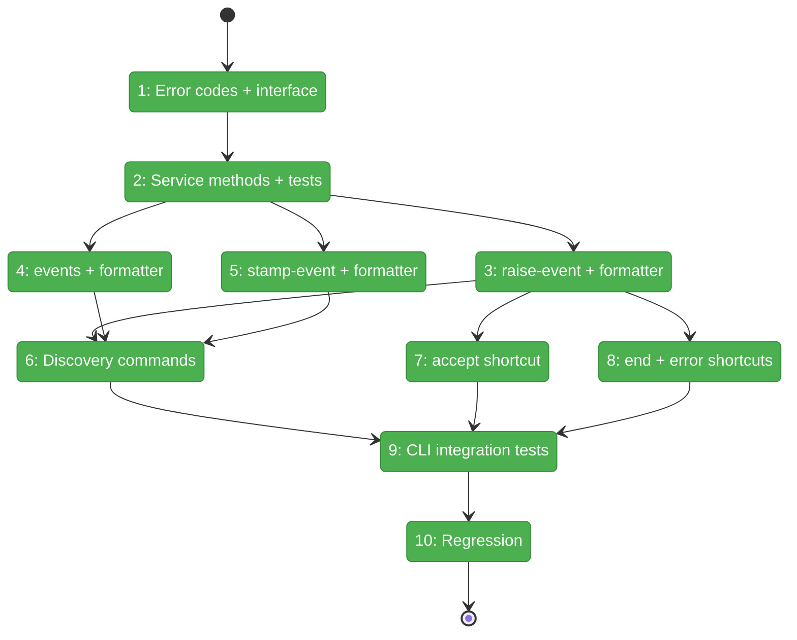
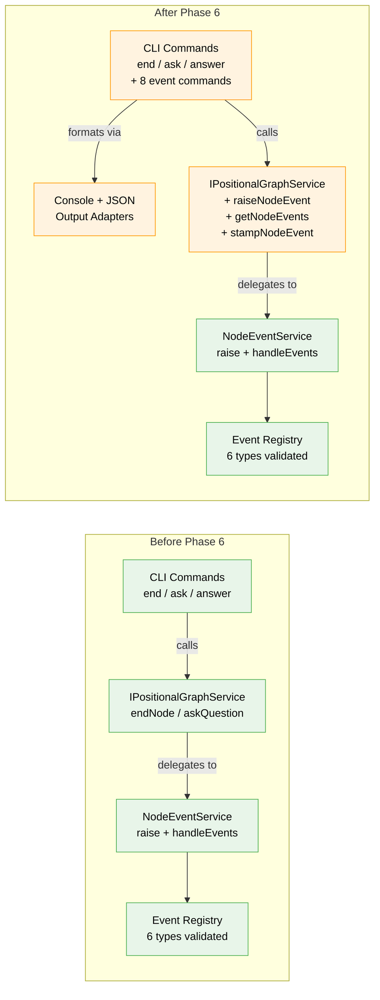

# Flight Plan: Phase 6 — CLI Commands

**Plan**: [node-event-system-plan.md](../../node-event-system-plan.md)
**Phase**: Phase 6: CLI Commands
**Generated**: 2026-02-08
**Status**: Complete

---

## Departure → Destination

**Where we are**: Phases 1-5 built a complete node event system: a registry with 6 validated event types, a record-only `raiseEvent()` pipeline, 6 inline handlers that transition node state, and `INodeEventService` as the hub connecting raise + handleEvents + stamps. Service wrappers (`endNode`, `askQuestion`, `answerQuestion`) already route through events internally. The system works — but it's only accessible through internal service calls. There are no CLI commands to raise events, inspect the event log, or stamp events as processed. Agents and humans have no direct access.

**Where we're going**: By the end of this phase, agents and humans can interact with the event system through 8 CLI commands. An agent can `cg wf --json node raise-event my-graph task-1 node:accepted` and get back JSON with the event ID, stamps, and whether execution should stop. A human can `cg wf node events my-graph task-1` and see a table of all events. Tools can stamp events with `stamp-event`. Discovery commands (`event list-types`, `event schema`) let agents learn the system at runtime. Three shortcuts (`accept`, updated `end`, `error`) make common operations ergonomic.

---

## Flight Status

<!-- Updated by /plan-6: pending → active → done. Use blocked for problems/input needed. -->

**Legend**: grey = pending | yellow = active | red = blocked/needs input | green = done

---

## Stages

<!-- Updated by /plan-6 during implementation: [ ] → [~] → [x] -->

- [x] **Stage 1: Error codes and interface additions** — add E196/E197 error factories, new result types (`RaiseNodeEventResult` includes `stopsExecution`), and three method signatures to `IPositionalGraphService` (`event-errors.ts`, `index.ts`, `positional-graph-service.interface.ts`)
- [x] **Stage 2: Service method implementations** — implement `raiseNodeEvent` (raise + handleEvents + persist + registry lookup for stopsExecution), `getNodeEvents` (load + filter), and `stampNodeEvent` (load + stamp + persist) with unit tests (`positional-graph.service.ts` — modified, `service-event-methods.test.ts` — new)
- [x] **Stage 3: raise-event command + formatter** — CLI handler + Commander registration for `cg wf node raise-event`; JSON payload parsing; `[AGENT INSTRUCTION]` for stop-execution events; console formatter (`positional-graph.command.ts`, `console-output.adapter.ts` — modified)
- [x] **Stage 4: events command + formatter** — CLI handler for `cg wf node events` with list table and detail via `--id`; variadic `--type` and `--status` filters; console formatter (`positional-graph.command.ts`, `console-output.adapter.ts` — modified)
- [x] **Stage 5: stamp-event command + formatter** — CLI handler for `cg wf node stamp-event` with required `--subscriber` and `--action`; E196 for missing events; console formatter (`positional-graph.command.ts`, `console-output.adapter.ts` — modified)
- [x] **Stage 6: Discovery commands** — `cg wf node event list-types` (grouped by domain) and `cg wf node event schema` (fields + example) under a new `event` subcommand group; `getJsonFlag(cmd)` helper for parent-chain walking (`positional-graph.command.ts`, `console-output.adapter.ts` — modified)
- [x] **Stage 7: accept shortcut** — `cg wf node accept` as thin wrapper calling `raiseNodeEvent('node:accepted')` (`positional-graph.command.ts`, `console-output.adapter.ts` — modified)
- [x] **Stage 8: end routing and error shortcut** — add `--message` to `end` command; implement `cg wf node error` with `--code` and `--message` flags (`positional-graph.command.ts`, `console-output.adapter.ts` — modified)
- [x] **Stage 9: CLI integration tests** — test all 8 commands with `--json` output; verify error codes and agent instruction message (`cli-event-commands.test.ts` — new)
- [x] **Stage 10: Regression verification** — `just fft` clean, 3634+ tests pass

---

## Architecture: Before & After

**Legend**: existing (green, unchanged) | changed (orange, modified) | new (blue, created)

---

## Acceptance Criteria

- [x] Core event commands work: raise-event, events, stamp-event (AC-12, AC-13)
- [x] Discovery commands work: event list-types, event schema (AC-10, AC-11)
- [x] Shortcut commands route through event system: accept, end, error (AC-14)
- [x] Stop-execution events show `[AGENT INSTRUCTION]` message (AC-9)
- [x] All commands support `--json` output (agent-first)
- [x] `just fft` clean (3 pre-existing lint errors in scratch/ only)

## Goals & Non-Goals

**Goals**:
- Add `raiseNodeEvent()`, `getNodeEvents()`, `stampNodeEvent()` to `IPositionalGraphService`
- Implement 3 core CLI commands with JSON + human-readable output
- Implement 3 shortcut commands routing through the event system
- Implement 2 discovery commands for event type introspection
- Add E196 (event not found) and E197 (invalid JSON payload) error codes

**Non-Goals**:
- Web-only event handlers (Plan 030 Phase 7)
- `IEventHandlerService` for graph-wide processing (Plan 030 Phase 7)
- ONBAS adaptation to event-based flow (Phase 7)
- `--all-nodes` graph-wide event listing (deferred)
- Migrating `state.questions[]` to event-based queries (deferred)

---

## Checklist

- [x] T001: Error codes E196/E197 + interface additions (CS-2)
- [x] T002: Service method implementations + unit tests (CS-3)
- [x] T003: raise-event command + console formatter (CS-3)
- [x] T004: events command + console formatter (CS-2)
- [x] T005: stamp-event command + console formatter (CS-2)
- [x] T006: Discovery commands — list-types + schema + getJsonFlag helper (CS-2)
- [x] T007: accept shortcut + console formatter (CS-1)
- [x] T008: end routing + error shortcut + console formatters (CS-2)
- [x] T009: CLI integration tests (CS-2)
- [x] T010: Regression verification (CS-1)

---

## PlanPak

Active — event system files under `features/032-node-event-system/`. Cross-plan edits to 4 files outside feature folder (`positional-graph-service.interface.ts`, `positional-graph.service.ts`, `positional-graph.command.ts`, `console-output.adapter.ts`).
