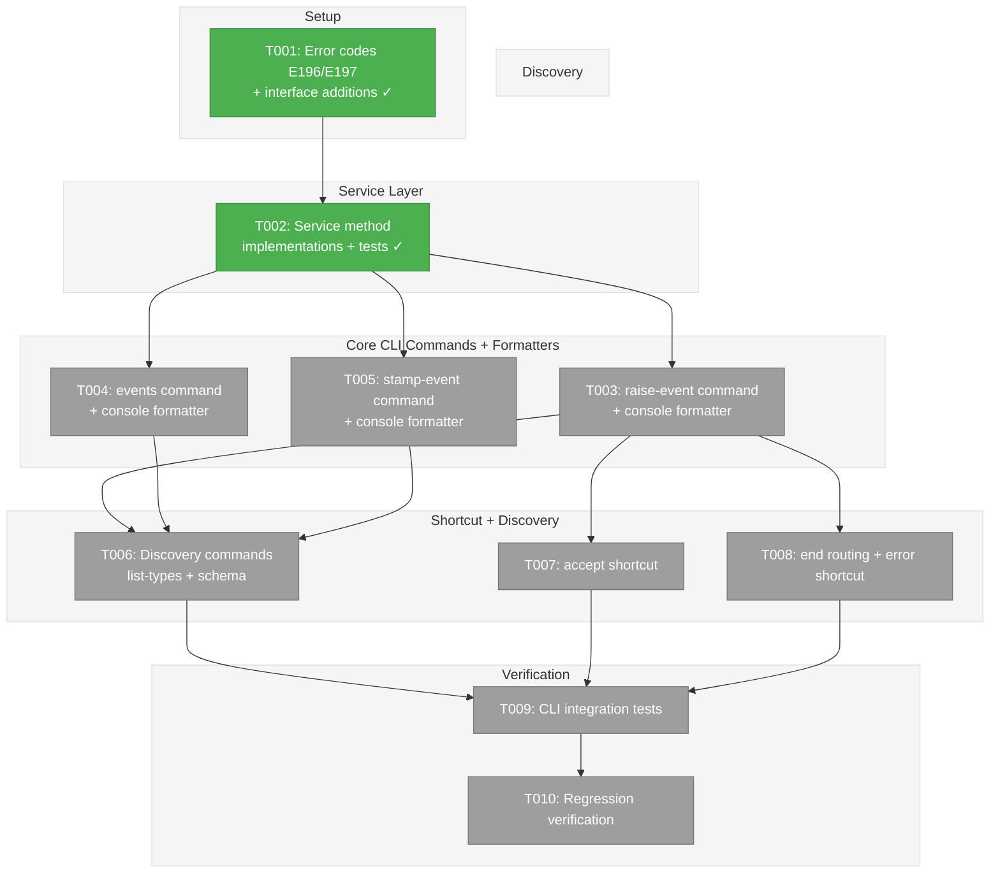
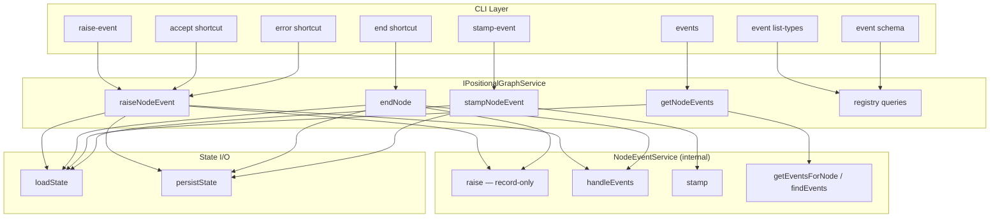
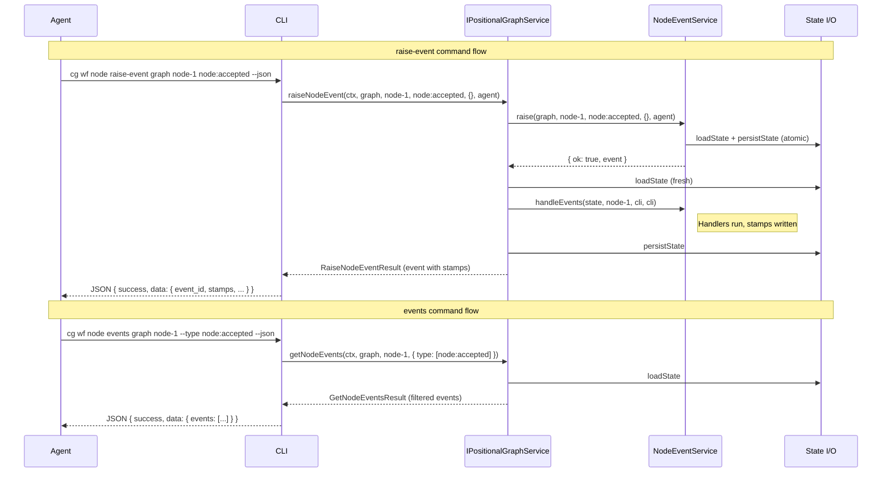

# Phase 6: CLI Commands – Tasks & Alignment Brief

**Spec**: [node-event-system-spec.md](../../node-event-system-spec.md)
**Plan**: [node-event-system-plan.md](../../node-event-system-plan.md)
**Phase**: Phase 6: CLI Commands
**Date**: 2026-02-08
**Status**: Complete

---

## Executive Briefing

### Purpose

This phase exposes the node event system (Phases 1-5) to CLI consumers — both human operators and LLM agents. Without CLI commands, the event system is only accessible through internal service calls. Agents need a JSON-primary interface to raise events, inspect the event log, stamp events as processed, and discover available event types.

### What We're Building

Three core CLI commands, three shortcut commands, and two discovery commands:

- **`cg wf node raise-event`** — raise an event on a node (validate + record + process + persist in one shot)
- **`cg wf node events`** — list or inspect events for a node (with filtering by type, status)
- **`cg wf node stamp-event`** — stamp an event as processed by a named subscriber
- **`cg wf node accept`** — shortcut for `raise-event node:accepted`
- **`cg wf node end`** — updated to pass `--message` as event payload
- **`cg wf node error`** — shortcut for `raise-event node:error`
- **`cg wf node event list-types`** — show all registered event types grouped by domain
- **`cg wf node event schema`** — show payload schema and example for a specific event type

Plus three new service methods on `IPositionalGraphService` (`raiseNodeEvent`, `getNodeEvents`, `stampNodeEvent`) and two new error codes (E196, E197).

### User Value

Agents can raise events, inspect the event log, and participate in the subscriber stamp protocol — all via `--json` output. Humans get readable table and detail output. The event system becomes a first-class CLI surface.

### Example

```bash
# Agent raises an event
$ cg wf --json node raise-event my-graph task-1 node:accepted --source agent
{"success":true,"command":"wf.node.raise-event","data":{"node_id":"task-1","event_id":"evt_18e6a1b2_c3d4","event_type":"node:accepted","source":"agent","stops_execution":false}}

# Human inspects events
$ cg wf node events my-graph task-1
Events for node 'task-1' (2 events):
  ID               Type              Source   Status   Created
  evt_18e6a1b2..   node:accepted     agent    new      2026-02-08 10:00
  evt_18e6a1c4..   question:ask      agent    new      2026-02-08 10:05

# Agent stamps an event
$ cg wf --json node stamp-event my-graph task-1 evt_18e6a1c4_e5f6 --subscriber my-agent --action forwarded
{"success":true,"command":"wf.node.stamp-event","data":{"event_id":"evt_18e6a1c4_e5f6","subscriber":"my-agent","stamp":{"action":"forwarded","stamped_at":"..."}}}
```

---

## Objectives & Scope

### Objective

Implement the CLI command surface for the node event system per spec AC-9 through AC-14, plan task table 6.1-6.10, and Workshop 07 design. All commands support `--json` for agent consumption.

### Behavior Checklist

- [ ] Core event commands work: raise-event, events, stamp-event (AC-12, AC-13)
- [ ] Discovery commands work: list-types, schema (AC-10, AC-11)
- [ ] Shortcut commands route through event system (AC-14)
- [ ] Stop-execution events show `[AGENT INSTRUCTION]` (AC-9)
- [ ] All commands support `--json` output (agent-first)
- [ ] `just fft` clean

### Goals

- Add `raiseNodeEvent()`, `getNodeEvents()`, `stampNodeEvent()` to `IPositionalGraphService`
- Implement 3 core CLI commands with JSON + human-readable output
- Implement 3 shortcut commands routing through the event system
- Implement 2 discovery commands for event type introspection
- Add E196 (event not found) and E197 (invalid JSON payload) error codes
- All commands follow existing `wrapAction()` + `createOutputAdapter()` patterns

### Non-Goals

- Web-only event handlers (future: Plan 030 Phase 7)
- `IEventHandlerService` for graph-wide processing (Plan 030 Phase 7)
- ONBAS adaptation to event-based flow (Phase 7)
- `--all-nodes` graph-wide event listing (deferred per WS07 open question)
- `--not-stamped-by` filter (deferred per WS07 open question)
- Migrating `state.questions[]` to event-based queries (DD-6 deferred)
- Public DI token for `INodeEventService` (remains internal)
- `--set-status` on stamp-event (legacy field writes; deferred unless trivial)

---

## Pre-Implementation Audit

### Summary

| File | Action | Origin | Modified By | Recommendation |
|------|--------|--------|-------------|----------------|
| `features/032-node-event-system/event-errors.ts` | Modify | Plan 032 Phase 1 | — | keep-as-is |
| `features/032-node-event-system/index.ts` | Modify | Plan 032 Phase 1 | Phases 3,4,5 | keep-as-is |
| `interfaces/positional-graph-service.interface.ts` | Modify | Plan 026 | Plans 028,029,030,032 P2 | keep-as-is |
| `services/positional-graph.service.ts` | Modify | Plan 026 | Plans 028,029,030,032 P2,P5 | keep-as-is |
| `apps/cli/src/commands/positional-graph.command.ts` | Modify | Plan 026 | Plans 028,029,030 | keep-as-is |
| `packages/shared/src/adapters/console-output.adapter.ts` | Modify | Pre-plan | Plans 026-030 | keep-as-is |

### Compliance Check

No violations. All modifications follow established patterns:
- Error factories follow the `xxxError()` pattern in `event-errors.ts` (ADR-0008)
- Service methods follow `BaseResult` pattern (ADR-0011)
- CLI commands follow `wrapAction()` + `createOutputAdapter()` + Commander registration pattern (ADR-0006)
- No new DI tokens (Phase 6 scope is internal to `positional-graph`)

---

## Requirements Traceability

### Coverage Matrix

| AC | Description | Flow Summary | Files in Flow | Tasks | Status |
|----|-------------|-------------|---------------|-------|--------|
| AC-9 | Stop-execution events show agent instruction | raise-event handler checks `stops_execution` on event type registration, appends instruction text | command.ts → service.ts → event-type-registration | T003, T006 | Complete |
| AC-10 | `event list-types` lists registered types | CLI handler queries registry for all types, groups by domain | command.ts → service.ts → core-event-types.ts → registry | T007 | Complete |
| AC-11 | `event schema` shows payload schema | CLI handler queries registry for type, formats schema + example | command.ts → service.ts → event-payloads.schema.ts → registry | T007 | Complete |
| AC-12 | `raise-event` creates and persists events | CLI handler calls raiseNodeEvent → raise + handleEvents + persist | command.ts → service.ts → raise-event.ts → event-handlers.ts | T003, T006 | Complete |
| AC-13 | `events` reads event log | CLI handler calls getNodeEvents → loads state, filters events | command.ts → service.ts → state I/O | T004 | Complete |
| AC-14 | Shortcut commands route through events | accept/error call raiseNodeEvent; end calls endNode with message | command.ts → service.ts | T008, T009 | Complete |

### Gaps Found

No gaps. All acceptance criteria have complete file coverage.

### Orphan Files

| File | Tasks | Assessment |
|------|-------|------------|
| `console-output.adapter.ts` | T003-T009 | Formatters for all new commands — required for human-readable output |
| Test files | T002, T010 | Test infrastructure — validates AC-9 through AC-14 |

---

## Architecture Map

### Component Diagram

<!-- Status: grey=pending, orange=in-progress, green=completed, red=blocked -->
<!-- Updated by plan-6 during implementation -->



### Task-to-Component Mapping

<!-- Status: Pending | In Progress | Complete | Blocked -->

| Task | Component(s) | Files | Status | Comment |
|------|-------------|-------|--------|---------|
| T001 | Error factories + Interface | event-errors.ts, index.ts, interface.ts | ✅ Complete | Setup: E196/E197 + new method signatures + result types |
| T002 | Service implementation | service.ts + new test file | ✅ Complete | raiseNodeEvent + getNodeEvents + stampNodeEvent + unit tests |
| T003 | raise-event CLI + formatter | command.ts, adapter.ts | ✅ Complete | Handler + registration + console formatter; [AGENT INSTRUCTION] for stops_execution |
| T004 | events CLI + formatter | command.ts, adapter.ts | ✅ Complete | List table + detail via --id; filters; console formatter |
| T005 | stamp-event CLI + formatter | command.ts, adapter.ts | ✅ Complete | Write subscriber stamp; E196 on missing event; console formatter |
| T006 | Discovery CLI + formatters | command.ts, adapter.ts | ✅ Complete | `event list-types` + `event schema` under node event subgroup; console formatters |
| T007 | accept shortcut + formatter | command.ts, adapter.ts | ✅ Complete | Thin wrapper → raiseNodeEvent(node:accepted); console formatter |
| T008 | end + error shortcuts + formatters | command.ts, adapter.ts, service.ts | ✅ Complete | end: add --message, route via endNode; error: raiseNodeEvent; console formatters |
| T009 | Integration tests | new test file | ✅ Complete | 11 tests: lifecycle, error codes (E190/E193/E196), stop events, shortcuts, multi-event sequence |
| T010 | Regression | (all) | ✅ Complete | 3660 tests pass (243 files); 3 pre-existing lint errors in scratch/ |

---

## Tasks

| Status | ID | Task | CS | Type | Dependencies | Absolute Path(s) | Validation | Subtasks | Notes |
|--------|------|-------------------------------------------------------|-----|------|--------------|-----------------------------------------------|----------------------------------|----------|------|
| [x] | T001 | Add E196/E197 error factories; add `RaiseNodeEventResult` (includes `stopsExecution: boolean` per DYK #3), `GetNodeEventsResult`, `StampNodeEventResult` types and `raiseNodeEvent`, `getNodeEvents`, `stampNodeEvent` method signatures to `IPositionalGraphService` | 2 | Setup | – | `/home/jak/substrate/030-positional-orchestrator/packages/positional-graph/src/features/032-node-event-system/event-errors.ts`, `/home/jak/substrate/030-positional-orchestrator/packages/positional-graph/src/features/032-node-event-system/index.ts`, `/home/jak/substrate/030-positional-orchestrator/packages/positional-graph/src/interfaces/positional-graph-service.interface.ts` | E196/E197 factories follow existing pattern; interface compiles; result types extend BaseResult; RaiseNodeEventResult includes stopsExecution | – | Plan 6.1; Finding 06; DYK #3 |
| [x] | T002 | Implement `raiseNodeEvent` (raise + load + handleEvents + persist, returns event with stamps), `getNodeEvents` (load state + filter events, returns list or single), `stampNodeEvent` (load state + find event + stamp + persist, E196 if not found) on `PositionalGraphService`; write unit tests | 3 | Core | T001 | `/home/jak/substrate/030-positional-orchestrator/packages/positional-graph/src/services/positional-graph.service.ts`, `/home/jak/substrate/030-positional-orchestrator/test/unit/positional-graph/features/032-node-event-system/service-event-methods.test.ts` | All 3 methods work; E196 on missing event; E197 on invalid JSON; filters work; raiseNodeEvent returns event with stamps after handleEvents | – | Plan 6.1; cross-plan-edit |
| [x] | T003 | Implement `raise-event` CLI handler + Commander registration (`cg wf node raise-event <graph> <nodeId> <eventType> [--payload <json>] [--source <source>]`); parse JSON payload (E197); default source `agent`; show `[AGENT INSTRUCTION]` when `stops_execution` is true (AC-9); add console formatter (success + failure) | 3 | Core | T002 | `/home/jak/substrate/030-positional-orchestrator/apps/cli/src/commands/positional-graph.command.ts`, `/home/jak/substrate/030-positional-orchestrator/packages/shared/src/adapters/console-output.adapter.ts` | JSON output matches WS07 schema; human output shows event ID + type + source; [AGENT INSTRUCTION] shown for stop events; E197 on bad JSON | – | Plan 6.2; AC-9, AC-12; cross-plan-edit; DYK #5 merged formatter |
| [x] | T004 | Implement `events` CLI handler + registration (`cg wf node events <graph> <nodeId> [--id <eventId>] [--type <type>...] [--status <status>]`); list mode (table) + detail mode (--id with stamps); variadic --type filter; add console formatter (list + detail, success + failure) | 2 | Core | T002 | `/home/jak/substrate/030-positional-orchestrator/apps/cli/src/commands/positional-graph.command.ts`, `/home/jak/substrate/030-positional-orchestrator/packages/shared/src/adapters/console-output.adapter.ts` | List shows table; detail shows payload + stamps; --type and --status filters work; --json output matches WS07 schema | – | Plan 6.3; AC-13; cross-plan-edit; DYK #5 merged formatter |
| [x] | T005 | Implement `stamp-event` CLI handler + registration (`cg wf node stamp-event <graph> <nodeId> <eventId> --subscriber <sub> --action <act> [--data <json>]`); E196 for missing event; parse --data as JSON; add console formatter (success + failure) | 2 | Core | T002 | `/home/jak/substrate/030-positional-orchestrator/apps/cli/src/commands/positional-graph.command.ts`, `/home/jak/substrate/030-positional-orchestrator/packages/shared/src/adapters/console-output.adapter.ts` | Stamp written; JSON output includes stamp details; E196 on missing event | – | Plan 6.4; cross-plan-edit; DYK #5 merged formatter |
| [x] | T006 | Implement discovery commands: `cg wf node event list-types <graph> <nodeId> [--domain <domain>]` and `cg wf node event schema <graph> <nodeId> <eventType>`; create `node event` Commander subgroup; add console formatters; extract `getJsonFlag(cmd)` helper for parent-chain walking (DYK #2) | 2 | Core | T003 | `/home/jak/substrate/030-positional-orchestrator/apps/cli/src/commands/positional-graph.command.ts`, `/home/jak/substrate/030-positional-orchestrator/packages/shared/src/adapters/console-output.adapter.ts` | Types grouped by domain; schema shows fields + example; E190 for unknown type; --json works at 4-level nesting | – | Plan 6.8; AC-10, AC-11; cross-plan-edit; DYK #2 getJsonFlag helper; DYK #4 keep <graph> <nodeId> pattern; DYK #5 merged formatter |
| [x] | T007 | Implement `accept` shortcut command (`cg wf node accept <graph> <nodeId>`); calls `raiseNodeEvent('node:accepted', {}, 'agent')`; add console formatter | 1 | Core | T003 | `/home/jak/substrate/030-positional-orchestrator/apps/cli/src/commands/positional-graph.command.ts`, `/home/jak/substrate/030-positional-orchestrator/packages/shared/src/adapters/console-output.adapter.ts` | Equivalent to raise-event node:accepted; shows status transition | – | Plan 6.5; AC-14; cross-plan-edit; DYK #5 merged formatter |
| [x] | T008 | Update `end` command: add `--message <msg>` option, thread to `endNode()` as event payload; implement `error` shortcut (`cg wf node error <graph> <nodeId> --code <code> --message <msg> [--details <json>] [--recoverable]`); calls `raiseNodeEvent('node:error', payload, 'agent')`; add console formatters | 2 | Core | T003 | `/home/jak/substrate/030-positional-orchestrator/apps/cli/src/commands/positional-graph.command.ts`, `/home/jak/substrate/030-positional-orchestrator/packages/positional-graph/src/services/positional-graph.service.ts`, `/home/jak/substrate/030-positional-orchestrator/packages/shared/src/adapters/console-output.adapter.ts` | `end --message "Done"` passes message in payload; `error --code X --message Y` equivalent to raise-event node:error | – | Plan 6.6, 6.7; AC-14; cross-plan-edit; DYK #5 merged formatter |
| [x] | T009 | Write CLI integration tests: all 8 commands with --json output verification; error code tests (E190, E193, E196, E197); [AGENT INSTRUCTION] for stop events; filter verification | 2 | Test | T006, T007, T008 | `/home/jak/substrate/030-positional-orchestrator/test/integration/positional-graph/cli-event-commands.test.ts` | All commands return correct JSON structure; error codes match spec; agent instruction present for stop events | – | Plan 6.9 |
| [x] | T010 | Regression verification: `just fft` clean | 1 | Test | T009 | (all) | 3634+ tests pass; no new lint errors | – | Plan 6.10 |

---

## Alignment Brief

### Prior Phases Review

#### Phase 1: Event Types, Schemas, and Registry

**Deliverables**: 12 source files + 4 test files (94 tests) in `features/032-node-event-system/`. Core: `NodeEventRegistry`, `registerCoreEventTypes()`, 6 payload schemas, `generateEventId()`, E190-E195 error factories. One cross-plan edit to `positional-graph-errors.ts`.

**Key for Phase 6**: `registerCoreEventTypes()` populates the registry that discovery commands (T007) will query. The 6 event type registrations include `displayName`, `description`, `domain`, `stopsExecution`, and `allowedSources` — all metadata that `list-types` and `schema` commands will surface. Error factories E190-E195 provide the pattern for E196/E197.

**Lesson**: `errors/index.ts` auto-exports via `keyof typeof` — adding E196/E197 to the factory file automatically makes them available.

#### Phase 2: State Schema Extension and Two-Phase Handshake

**Deliverables**: Replaced `'running'` with `'starting'` + `'agent-accepted'` across 7 source files and 13 test files. Created `isNodeActive()` and `canNodeDoWork()` predicates. Added optional `events` array to `NodeStateEntrySchema`.

**Key for Phase 6**: The two-phase handshake means: after `startNode()` returns `'starting'`, an agent must raise `node:accepted` to begin work. The `accept` shortcut command (T008) exposes this. `answerQuestion()` also returns `'starting'` — the agent must re-accept.

**Lesson**: `simulateAgentAccept()` test helpers were needed in 4 test files. Phase 6 CLI tests may need similar patterns. The `canNodeDoWork()` predicate returns true only for `'agent-accepted'`.

#### Phase 3: raiseEvent Core Write Path

**Deliverables**: `raiseEvent()` function (160 lines) with 5-step validation pipeline, `VALID_FROM_STATES` map. 22 tests. `createFakeStateStore()` test helper.

**Key for Phase 6**: `raiseNodeEvent()` service method (T002) will delegate to `raiseEvent()` internally. The validation pipeline (type → payload → source → state → question refs) produces E190-E195 errors that CLI commands must surface. The `createFakeStateStore()` pattern is reusable in integration tests.

**Lesson**: Validation is fail-fast — state is loaded lazily at step 4.

#### Phase 4: Event Handlers and State Transitions

**Deliverables**: 6 handlers, `createEventHandlers()` factory, `markHandled()`, E2E walkthrough tests. The backward-compat `deriveBackwardCompatFields()` was built then deleted by Subtask 001.

**Key for Phase 6**: The 6 handlers define the state transitions that CLI commands trigger. `raise-event` CLI (T003) shows the resulting status transition after `handleEvents()` runs. Workshop 02 walkthroughs provide test patterns for Phase 6 CLI tests.

**Lesson**: `handleQuestionAnswer` was missing the `'starting'` transition — fixed in Phase 5.

#### Phase 5: Service Method Wrappers (INodeEventService + HandlerContext)

**Deliverables**: 6 new source files (EventStampSchema, INodeEventService, HandlerContext, EventHandlerRegistry, NodeEventService, FakeNodeEventService). Handlers refactored to `HandlerContext` signature. `markHandled()` replaced by `ctx.stamp()`. `raiseEvent()` made record-only. Service wrappers (`endNode`, `askQuestion`, `answerQuestion`) delegate to `eventService.raise()`. 203 event system tests, 3634 total.

**Key for Phase 6**: `NodeEventService` is the hub that Phase 6 service methods create internally. The two-phase pattern (raise → load fresh state → handleEvents → persist) is the exact flow that `raiseNodeEvent()` must follow. `EventHandlerRegistry` with context tags (`'cli'`/`'web'`/`'both'`) controls which handlers fire — CLI commands pass `'cli'` as context.

**Patterns to maintain**:
- `raise()` persists internally; `handleEvents()` does NOT persist — caller persists
- State must be loaded AFTER `raise()` returns (stale-state trap, DYK #2)
- `ctx.stamp()` writes to `event.stamps[subscriber]` — NOT to `event.status`/`handled_at`
- `endNode()` retains `canEnd()` pre-flight guard before raising events

**Reusable infrastructure**: `FakeNodeEventService`, `createFakeStateStore()`, `createEventHandlerRegistry()`, `registerCoreEventTypes()`.

### Critical Findings Affecting This Phase

| Finding | Constraint | Tasks |
|---------|-----------|-------|
| **07: CLI Commands Follow Established Pattern** | Use `wrapAction()` + `createOutputAdapter()`. `--json` is primary output mode. Reuse Commander registration pattern. New error codes E196, E197. | T003-T009 |
| **01: Status Enum Replacement** | `accept` shortcut transitions `starting` → `agent-accepted` (not `running`). All CLI output reflects new statuses. | T008 |
| **02: Service Guards on agent-accepted** | `endNode()` pre-flight guard (`canEnd`) remains when `end` command routes through events. | T009 |

### ADR Decision Constraints

- **ADR-0006: CLI-Based Agent Orchestration** — All commands designed for `--json` agent consumption. Agent instruction messages for stop events. Constrains: T003-T009; Addressed by: JSON output on all commands.
- **ADR-0008: Module Registration Pattern** — `registerCoreEventTypes()` pattern for event type registration. Constrains: T007 (discovery reads from registry). Addressed by: T007 queries existing registry.
- **ADR-0011: First-Class Domain Concepts** — `INodeEventService` is the internal hub. Service methods on `IPositionalGraphService` delegate to it. Constrains: T001-T002; Addressed by: new methods on public interface delegate to internal `NodeEventService`.

### PlanPak Placement Rules

- **Plan-scoped edits**: `event-errors.ts`, `index.ts` in `features/032-node-event-system/`
- **Cross-plan edits**: `positional-graph-service.interface.ts`, `positional-graph.service.ts`, `positional-graph.command.ts`, `console-output.adapter.ts`
- **Test files**: Per project conventions (`test/unit/...`, `test/integration/...`)

### Invariants & Guardrails

- No public DI token for `INodeEventService` — CLI accesses via `IPositionalGraphService`
- `raise()` persists internally → always load fresh state before `handleEvents()`
- All handlers registered as `context: 'both'` — CLI passes `'cli'` to `handleEvents()`
- `endNode()` pre-flight guard (`canEnd`) preserved — `end` command routes through `endNode()`, NOT directly through `raiseNodeEvent()`
- `state.questions[]` still written by service (DD-6) — not migrated in this phase

### Inputs to Read

| File | Purpose |
|------|---------|
| `packages/positional-graph/src/features/032-node-event-system/index.ts` | Current barrel exports |
| `packages/positional-graph/src/features/032-node-event-system/event-errors.ts` | E190-E195 pattern |
| `packages/positional-graph/src/interfaces/positional-graph-service.interface.ts` | Existing interface + result types |
| `packages/positional-graph/src/services/positional-graph.service.ts` | Service implementation (endNode, askQuestion, answerQuestion pattern) |
| `apps/cli/src/commands/positional-graph.command.ts` | CLI registration pattern + existing handlers |
| `apps/cli/src/commands/command-helpers.ts` | `wrapAction()`, `createOutputAdapter()`, `resolveOrOverrideContext()`, `noContextError()` |
| `packages/shared/src/adapters/console-output.adapter.ts` | Formatter dispatch pattern |
| `packages/shared/src/adapters/json-output.adapter.ts` | JSON envelope format |
| `docs/plans/032-node-event-system/workshops/07-event-system-cli-commands.md` | Full CLI design spec |

### Visual Alignment: System Flow



### Visual Alignment: Command Sequence



### Test Plan

**Approach**: TDD per constitution. Interface → fake → tests → implementation → contract tests.

**Service method tests** (`service-event-methods.test.ts`):

| Test | Rationale |
|------|-----------|
| `raiseNodeEvent returns event with stamps after handleEvents` | Core flow: raise + handle + persist |
| `raiseNodeEvent returns E193 for invalid state transition` | Validation propagates from raiseEvent |
| `raiseNodeEvent returns E197 for non-object payload` | JSON parsing guard |
| `raiseNodeEvent shows stops_execution flag` | AC-9 |
| `getNodeEvents returns all events` | Basic query |
| `getNodeEvents filters by type` | Filter support |
| `getNodeEvents filters by status` | Filter support |
| `getNodeEvents returns single event by id` | Detail mode |
| `getNodeEvents returns E196 for unknown event id` | Error case |
| `stampNodeEvent writes stamp and persists` | Core stamp flow |
| `stampNodeEvent returns E196 for unknown event` | Error case |

**CLI integration tests** (`cli-event-commands.test.ts`):

| Test | Rationale |
|------|-----------|
| `raise-event returns JSON with event details` | AC-12 |
| `raise-event shows AGENT INSTRUCTION for stop events` | AC-9 |
| `raise-event defaults source to agent` | WS07 |
| `events lists events as table` | AC-13 |
| `events --id shows single event with stamps` | AC-13 detail mode |
| `events --type filters correctly` | AC-13 filters |
| `stamp-event writes stamp and returns result` | WS07 |
| `stamp-event returns E196 for missing event` | Error handling |
| `accept is equivalent to raise-event node:accepted` | AC-14 |
| `end --message passes payload` | AC-14 |
| `error --code --message constructs payload` | AC-14 |
| `event list-types groups by domain` | AC-10 |
| `event schema shows fields and example` | AC-11 |

### Step-by-Step Implementation Outline

1. **T001**: Add E196/E197 to `event-errors.ts` + export from `index.ts`. Add 3 result types (RaiseNodeEventResult includes `stopsExecution: boolean`) + 3 method signatures to `IPositionalGraphService`. Verify compile.
2. **T002**: Write failing tests for raiseNodeEvent, getNodeEvents, stampNodeEvent. Implement in `positional-graph.service.ts` following endNode/askQuestion pattern. raiseNodeEvent does registry lookup for stopsExecution. Make tests pass.
3. **T003**: Write `handleNodeRaiseEvent()` handler function + console formatter. Parse `--payload` JSON (E197 on failure). Call `service.raiseNodeEvent()`. Check `stopsExecution` on result for `[AGENT INSTRUCTION]`. Register `node.command('raise-event')`. Add success/failure formatters to ConsoleOutputAdapter.
4. **T004**: Write `handleNodeEvents()` handler + console formatter. List mode: table output. Detail mode (`--id`): full event with stamps. Filters: variadic `--type`, `--status`. Register `node.command('events')`. Add formatters.
5. **T005**: Write `handleNodeStampEvent()` handler + console formatter. Required `--subscriber` and `--action`. Optional `--data` (parse JSON). Register `node.command('stamp-event')`. Add formatters.
6. **T006**: Create `node.command('event')` subgroup. Add `list-types` and `schema` subcommands. Query registry for metadata. Add console formatters. Extract `getJsonFlag(cmd)` helper for robust parent-chain walking.
7. **T007**: Register `node.command('accept')`. Handler calls `service.raiseNodeEvent(ctx, graph, nodeId, 'node:accepted', {}, 'agent')`. Add console formatter.
8. **T008**: Update `end` registration to add `--message` option. Thread to `endNode()`. Register `node.command('error')`. Handler calls `service.raiseNodeEvent(ctx, graph, nodeId, 'node:error', payload, 'agent')`. Add console formatters.
9. **T009**: Write integration tests using real service + test workspace. Verify all --json outputs. Verify error codes. Verify agent instruction.
10. **T010**: Run `just fft`. Fix any issues. Verify 3634+ tests pass.

### Commands to Run

```bash
# Run event system tests only
pnpm vitest run test/unit/positional-graph/features/032-node-event-system/

# Run integration tests
pnpm vitest run test/integration/positional-graph/

# Type check
pnpm typecheck

# Full quality check
just fft
```

### Risks & Unknowns

| Risk | Severity | Mitigation |
|------|----------|------------|
| `positional-graph.command.ts` is 2020 lines — adding ~200 more | Low | Follow established section pattern; consider extract to `event-commands.ts` if it becomes unwieldy |
| `console-output.adapter.ts` is 2205 lines — adding ~100 more formatters | Low | Follow existing dispatch pattern; formatters are mechanical |
| `--json` flag threading at 4-level nesting (`cg wf node event list-types`) | Medium | Extract `getJsonFlag(cmd)` helper that walks parent chain (DYK #2) |
| `endNode()` pre-flight guard vs raw `raise-event node:completed` | Low | `end` shortcut keeps guard via `endNode()`; `raise-event` is lower-level — this is by design |
| `raiseNodeEvent()` needs registry + handler wiring internally | Medium | Follow exact pattern from endNode/askQuestion — they already create NodeEventService |

### Command Name Deviation

The spec uses `cg wf node event raise` / `cg wf node event log` (AC-12, AC-13). The plan and Workshop 07 use `cg wf node raise-event` / `cg wf node events` (flat under `node`). **Workshop 07 design takes precedence** — the flat naming was an explicit design decision (WS07 D2, D3). Discovery commands use nested `cg wf node event` subgroup.

### Ready Check

- [ ] ADR constraints mapped to tasks (ADR-0006 → T003-T008, ADR-0008 → T006, ADR-0011 → T001-T002)
- [ ] Workshop 07 design reviewed and incorporated
- [ ] Phase 5 deliverables understood (INodeEventService, handleEvents, stamps model)
- [ ] CLI registration pattern understood (wrapAction, createOutputAdapter, parent opts threading)
- [ ] await explicit GO/NO-GO

---

## Phase Footnote Stubs

_Populated by plan-6 during implementation. Do not create stubs during planning._

---

## Evidence Artifacts

Implementation will write:
- `docs/plans/032-node-event-system/tasks/phase-6-cli-commands/execution.log.md` — detailed implementation narrative

---

## Discoveries & Learnings

_Populated during implementation by plan-6. Log anything of interest to your future self._

| Date | Task | Type | Discovery | Resolution | References |
|------|------|------|-----------|------------|------------|
| | | | | | |

**Types**: `gotcha` | `research-needed` | `unexpected-behavior` | `workaround` | `decision` | `debt` | `insight`

**What to log**:
- Things that didn't work as expected
- External research that was required
- Implementation troubles and how they were resolved
- Gotchas and edge cases discovered
- Decisions made during implementation
- Technical debt introduced (and why)
- Insights that future phases should know about

_See also: `execution.log.md` for detailed narrative._

---

## Critical Insights (2026-02-08)

| # | Insight | Decision |
|---|---------|----------|
| 1 | `end` routes through `endNode()` (with canEnd guard), not `raiseNodeEvent()` — `raise-event node:completed` bypasses the guard | Non-issue: by design, different abstraction levels |
| 2 | `--json` flag threading breaks at 4-level Commander nesting (`cg wf node event list-types`) — needs `parent?.parent?.parent?.opts()` | Extract `getJsonFlag(cmd)` helper that walks parent chain regardless of depth |
| 3 | `eventService.raise()` result doesn't include `stops_execution` — that flag lives on the registry entry, not the event object | `RaiseNodeEventResult` includes `stopsExecution: boolean`, service does registry lookup |
| 4 | Discovery commands (`list-types`, `schema`) don't need graph/nodeId — they query the registry, not state | Keep `<graph> <nodeId>` pattern for consistency with all other node commands; ignore unused params |
| 5 | T006 (console formatters) was a bottleneck blocking T007-T009 — but formatters are mechanical and naturally belong with their command | Dissolved T006: each command task (T003-T008) adds its own console formatter inline. 11 tasks → 10 tasks. |

Action items: None — all decisions applied to tasks.md and tasks.fltplan.md.

---

## Directory Layout

```
docs/plans/032-node-event-system/
  ├── node-event-system-plan.md
  ├── node-event-system-spec.md
  └── tasks/
      ├── phase-5-service-method-wrappers/
      │   ├── tasks.md
      │   ├── tasks.fltplan.md
      │   └── execution.log.md
      └── phase-6-cli-commands/
          ├── tasks.md              ← this file
          ├── tasks.fltplan.md      ← generated by /plan-5b
          └── execution.log.md      ← created by /plan-6
```
