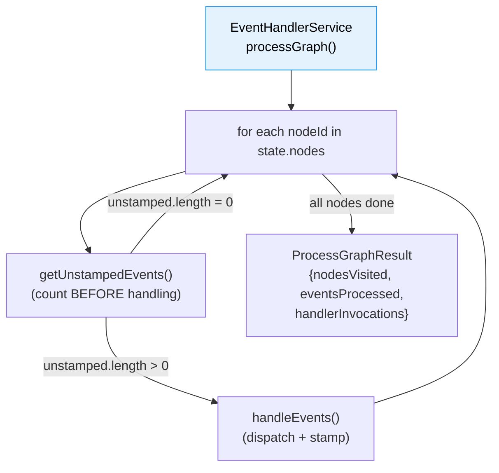
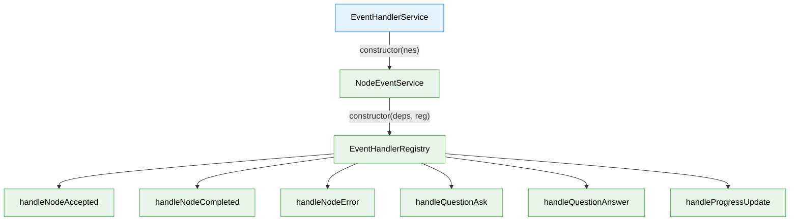
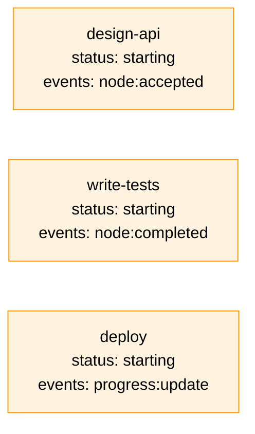
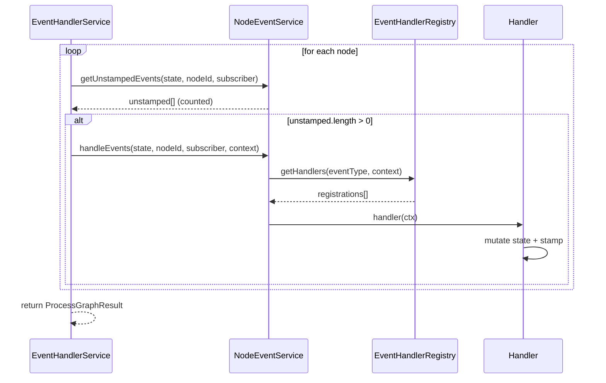
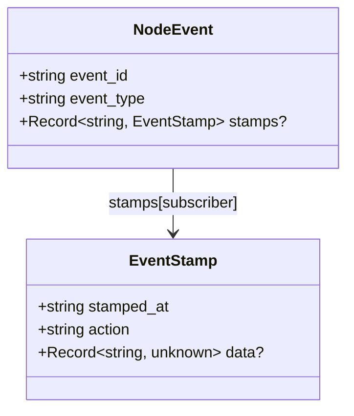
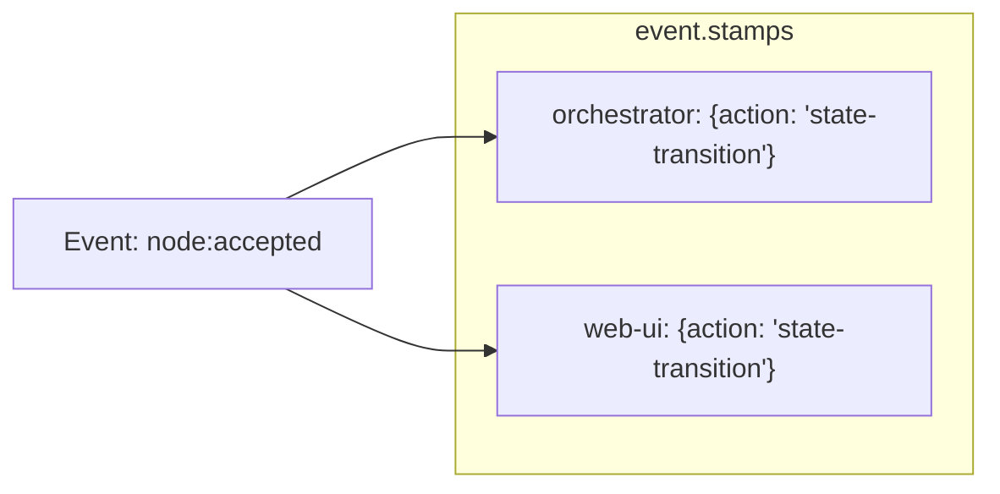

# Worked Example Walkthrough: EventHandlerService — Settling a Graph in One Call

> **Script**: [`worked-example.ts`](./worked-example.ts)
> **Run**: `npx tsx docs/plans/032-node-event-system/tasks/phase-7-onbas-adaptation-and-backward-compat-projections/examples/worked-example.ts`
> **Phase**: Phase 7: IEventHandlerService — Graph-Wide Event Processor

## What This Demonstrates

EventHandlerService is the "Settle" phase of the orchestration loop (Settle, Decide, Act). A single `processGraph()` call iterates every node in a graph, finds unprocessed events, fires the appropriate handlers, stamps them as processed, and returns aggregate counts. This example shows the full pipeline with real handlers, real state mutations, and real idempotency guarantees.

---

## High-Level Flow

---

## Section-by-Section

### 1. Build the Component Stack

The example constructs the real production wiring: `EventHandlerService` wraps `NodeEventService`, which wraps `EventHandlerRegistry` with 6 core handlers. EHS has a single constructor dependency — `INodeEventService` — and doesn't know about the registry or individual handlers at all. This layering is deliberate: EHS is responsible for graph-wide iteration; NES owns per-node dispatch.

**What to watch in output**: The three lines listing each component confirm the stack is wired with real implementations.

---

### 2. Construct a Multi-Node Graph with Pending Events

The example builds a 3-node graph that models a realistic orchestration snapshot: `design-api` was just accepted by an agent, `write-tests` was completed, and `deploy` has a progress update. Each node starts with status `"starting"` and one unstamped event.

**What to watch in output**: Three nodes printed with their initial `"starting"` status and event types.

---

### 3. Settle — One Call Processes Every Node

This is the core of Phase 7. `processGraph(state, 'orchestrator', 'cli')` walks every node in insertion order, calls `getUnstampedEvents()` to count pending events *before* handling (Critical Insight #1 — handlers stamp during the loop, so counting must precede handling), then delegates to `handleEvents()`. The result is a `ProcessGraphResult` with three fields.

The count-before-stamp ordering is subtle but essential: if you counted *after* handling, you'd always get zero because the handlers just stamped everything. The implementation calls `getUnstampedEvents()` first, records the count, then calls `handleEvents()`.

**What to watch in output**: `nodesVisited: 3`, `eventsProcessed: 3`, `handlerInvocations: 3`. All three events found and processed.

---

### 4. Verify State Mutations

Handlers mutate node state through the `HandlerContext`. The `node:accepted` handler sets status to `"agent-accepted"`. The `node:completed` handler sets status to `"complete"` and writes `completed_at`. The `progress:update` handler stamps but doesn't change status — progress events are informational.

**What to watch in output**: `design-api` is now `"agent-accepted"`, `write-tests` is `"complete"` with a `completed_at` timestamp, `deploy` remains `"starting"`.

---

### 5. Inspect Subscriber Stamps

Every handler calls `ctx.stamp('state-transition')`, which writes an `EventStamp` to `event.stamps[subscriber]`. Stamps are the authoritative record that an event has been processed by a given subscriber. The `getUnstampedEvents()` method filters events by checking whether `stamps[subscriber]` exists.

**What to watch in output**: Three stamps, one per event, all with `action="state-transition"` and the `"orchestrator"` subscriber name.

---

### 6. Idempotency — Second Call Is a No-Op

Calling `processGraph()` again with the same subscriber proves idempotency. Since all events now have stamps for `"orchestrator"`, `getUnstampedEvents()` returns empty arrays for every node. The method still visits all 3 nodes (it has to check), but processes zero events. This is how the orchestration loop knows settlement is complete.

**What to watch in output**: `nodesVisited: 3` (nodes are always visited), `eventsProcessed: 0`, `handlerInvocations: 0`.

---

### 7. Subscriber Isolation — Different Subscriber Sees All Events

Stamps are keyed by subscriber name, so different subscribers maintain independent views. When `"web-ui"` calls `processGraph()`, it sees all 3 events as unprocessed because none of them have `stamps["web-ui"]`. This is how CLI and web can each process the same events independently.

**What to watch in output**: `"web-ui"` subscriber sees 3 unprocessed events — same graph, independent processing.

---

## Key Takeaways

| Concept | Why It Matters |
|---------|---------------|
| Single `processGraph()` call | The orchestration loop calls one method to settle all events — no per-node orchestration needed |
| Count-before-stamp ordering | `getUnstampedEvents()` before `handleEvents()` avoids counting zero after handlers stamp |
| Idempotency via stamps | Second call returns `eventsProcessed: 0` — safe to call repeatedly |
| Subscriber isolation | CLI and web maintain independent event views through per-subscriber stamps |
| State mutations through handlers | Handlers own the business logic (status transitions); EHS just iterates |
| `handlerInvocations` approximation | Equals `eventsProcessed` because `handleEvents()` returns void — true count unavailable |
