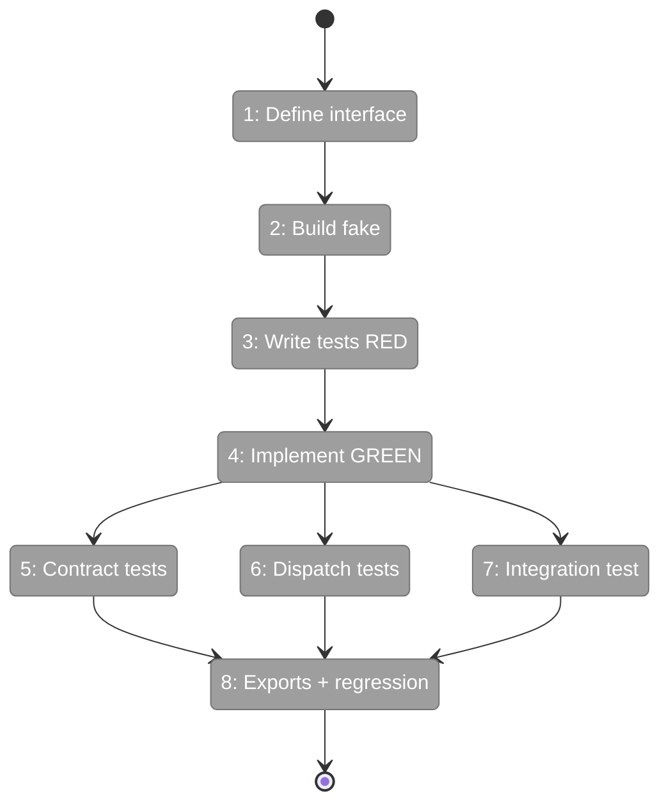
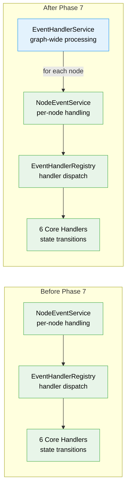

# Flight Plan: Phase 7 — IEventHandlerService

**Plan**: [node-event-system-plan.md](../../node-event-system-plan.md)
**Phase**: Phase 7: IEventHandlerService — Graph-Wide Event Processor
**Generated**: 2026-02-08
**Status**: Ready for takeoff

---

## Departure → Destination

**Where we are**: Phases 1-6 of Plan 032 are complete. The node event system has schemas, a registry, the core write path (`raiseEvent`), six event handlers for state transitions, a first-class per-node service (`INodeEventService` with `handleEvents`), and CLI commands for event discovery, raising, and inspection. Events can be raised, validated, handled, and stamped on individual nodes. But there's no way to process events across an entire graph in one call — the missing piece for the orchestration loop.

**Where we're going**: By the end of this phase, a single `processGraph(state, subscriber, context)` call will iterate every node, find unstamped events, delegate per-node handling to `INodeEventService`, and return a `ProcessGraphResult` with counts of nodes visited, events processed, and handler invocations. Plan 030's orchestration loop can then use this as its Settle phase: one call settles the entire graph before ONBAS decides what to do next.

---

## Flight Status

<!-- Updated by /plan-6: pending → active → done. Use blocked for problems/input needed. -->

**Legend**: grey = pending | yellow = active | red = blocked/needs input | green = done

---

## Stages

<!-- Updated by /plan-6 during implementation: [ ] → [~] → [x] -->

- [ ] **Stage 1: Define IEventHandlerService interface** — `ProcessGraphResult` type with three count fields and `IEventHandlerService` with single `processGraph()` method (`event-handler-service.interface.ts` — new file)
- [ ] **Stage 2: Build FakeEventHandlerService** — test double with `getHistory()`, `setResult()`, `reset()` following the `FakeNodeEventService` pattern (`fake-event-handler-service.ts` — new file)
- [ ] **Stage 3: Write unit tests RED** — orchestration logic tests using `FakeNodeEventService`: empty graph, single node, multiple nodes, stamped-events-skipped, correct counts (`event-handler-service.test.ts` — new file)
- [ ] **Stage 4: Implement EventHandlerService GREEN** — single-dep constructor taking `INodeEventService`, iterates `state.nodes`, calls `getUnstampedEvents()` + `handleEvents()` per node (`event-handler-service.ts` — new file)
- [ ] **Stage 5: Contract tests** — shared contract verifying empty-graph result and return type shape, run against both fake and real implementations (`test/contracts/event-handler-service.contract.ts`, `.contract.test.ts` — new files)
- [ ] **Stage 6: Handler dispatch tests** — real EHS + real NES + spy handler functions proving dispatch pipeline: matching events fire handlers, stamped events skipped, context filtering works (`event-handler-service-handlers.test.ts` — new file)
- [ ] **Stage 7: Integration test** — real EHS + real NES + real handlers, multi-node graph with mixed event types, verify state mutations and idempotency (`test/integration/positional-graph/event-handler-service.integration.test.ts` — new file)
- [ ] **Stage 8: Update barrel exports and regression** — add `IEventHandlerService`, `ProcessGraphResult`, `EventHandlerService`, `FakeEventHandlerService` to `index.ts`; `just fft` clean

---

## Architecture: Before & After

**Legend**: existing (green, unchanged) | changed (orange, modified) | new (blue, created)

---

## Acceptance Criteria

- [ ] IEventHandlerService processes all unhandled events across the graph before ONBAS walks (AC-16 revised)
- [ ] processGraph() returns correct counts: nodesVisited, eventsProcessed, handlerInvocations
- [ ] Second processGraph() call with same subscriber returns eventsProcessed: 0 (idempotent)
- [ ] FakeEventHandlerService passes same contract tests as real implementation
- [ ] Barrel exports enable Plan 030 to import IEventHandlerService
- [ ] `just fft` clean

## Goals & Non-Goals

**Goals**:
- Define IEventHandlerService interface and ProcessGraphResult return type
- Implement EventHandlerService with single dependency on INodeEventService
- Implement FakeEventHandlerService with call history and pre-configured results
- Test coverage at three levels: orchestration, dispatch, contract
- Update barrel exports for downstream consumption

**Non-Goals**:
- ONBAS changes (not needed — EHS settles before ONBAS runs)
- Web-specific handlers (deferred to Plan 030 web integration)
- DI container registration (internal collaborator, not public DI token)
- Reality builder changes (NodeReality does not need events field)

---

## Checklist

- [ ] T001: Define IEventHandlerService interface + ProcessGraphResult (CS-1)
- [ ] T002: Implement FakeEventHandlerService with test helpers (CS-1)
- [ ] T003: Write unit tests RED — orchestration logic (CS-2)
- [ ] T004: Implement EventHandlerService GREEN (CS-2)
- [ ] T005: Write contract tests — fake/real parity (CS-2)
- [ ] T006: Write handler dispatch tests — spy handlers (CS-2)
- [ ] T007: Write integration test — multi-node graph processing (CS-2)
- [ ] T008: Update barrel exports + regression verification (CS-1)

---

## PlanPak

Not active for this plan.
