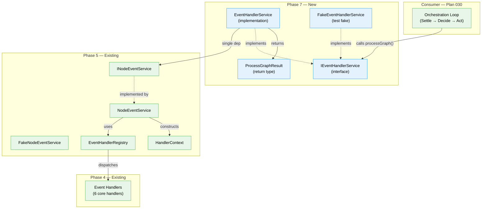

# Phase 7: IEventHandlerService — Graph-Wide Event Processor

> **Plan**: [node-event-system-plan.md](../../node-event-system-plan.md)
> **Spec**: [node-event-system-spec.md](../../node-event-system-spec.md)
> **Phase**: Phase 7 (originally "ONBAS Adaptation and Backward-Compat Projections", redesigned per Workshops 11 + 12)
> **Feature folder**: `packages/positional-graph/src/features/032-node-event-system/`

---

## Executive Briefing

### Purpose

Build `IEventHandlerService` — the graph-wide event processor that iterates all nodes in a graph, finds unstamped events, and delegates per-node processing to `INodeEventService.handleEvents()`. This is the **Settle** phase of the Settle → Decide → Act orchestration loop (Plan 030 Phase 7).

### What We're Building

A single-method service (`processGraph`) that takes a graph's `State`, a `subscriber` identifier, and a context tag (`'cli'` | `'web'`), then walks every node and processes unstamped events. The return value (`ProcessGraphResult`) reports `nodesVisited`, `eventsProcessed`, and `handlerInvocations` — the orchestration loop uses this to decide whether another iteration is needed.

### User Value

The orchestration loop (Plan 030) needs a clean seam between "settle all pending events" and "decide what to do next". Without IEventHandlerService, the loop would need to manually iterate nodes, filter events, and call handlers — duplicating the coordination logic that belongs in a dedicated service. This service makes the loop's Settle phase a single function call.

### Example

```typescript
const result = eventHandlerService.processGraph(state, 'orchestrator', 'cli');
// → { nodesVisited: 5, eventsProcessed: 3, handlerInvocations: 3 }
// Three unstamped events across 5 nodes were processed. Handlers fired.
// Call again: eventsProcessed === 0 (idempotent — all events now stamped).
```

---

## Objectives & Scope

### Goals

- Define `IEventHandlerService` interface and `ProcessGraphResult` return type
- Implement `EventHandlerService` with single dependency on `INodeEventService`
- Implement `FakeEventHandlerService` with call history and pre-configured results
- Achieve test coverage at three levels: orchestration (FakeNES), dispatch (spy handlers), contract (fake/real parity)
- Update barrel exports for downstream consumption (Plan 030)
- Verify full regression with `just fft`

### Non-Goals

- **ONBAS changes** — ONBAS does not need to read events; EHS settles before ONBAS runs (Workshop 11)
- **Reality builder changes** — NodeReality does not need an events field (Workshop 11)
- **Web-specific handlers** (e.g., `pushQuestionToUI`) — deferred to Plan 030 web integration; core handlers are context `'both'` (Workshop 12 Part 10)
- **DI container registration** — IEventHandlerService is an internal collaborator, not a public DI token (Plan 030 architecture: internal collaborators not in DI)
- **Property tests for event-based vs flat-field parity** — no longer relevant since ONBAS continues reading flat fields

---

## Pre-Implementation Audit

### Key Design Decisions (from Workshops 11 + 12)

| Decision | Choice | Source |
|----------|--------|--------|
| EHS dependency count | **Single dep**: `INodeEventService` only | Workshop 12 Part 6 |
| Handler registry ownership | EHS delegates to `NES.handleEvents()` which owns the registry | Workshop 12 Part 10 |
| Testing strategy | Three levels: orchestration (FakeNES), dispatch (spy handlers), contract | Workshop 12 Parts 3-7 |
| FakeEventHandlerService pattern | History array + pre-configured `ProcessGraphResult` | Workshop 12 Part 4 |
| ONBAS impact | None — EHS settles events before ONBAS walks | Workshop 11 Part 4 |
| AC-16 revision | "EHS processes events before ONBAS" replaces "ONBAS reads events" | Workshop 11 Part 4 |

### Architecture Pattern

IEventHandlerService follows ADR-0011 (First-Class Domain Concepts):
- **Interface** → **Fake** → **Tests** → **Implementation** → **Contract Tests**
- Single `processGraph()` method (like `INodeEventService` has focused methods)
- Internal service — no public DI token needed (per Plan 030 architecture)

### Prior Phase Dependencies

| Phase | What It Provides | Status |
|-------|-----------------|--------|
| Phase 1 | Event types, schemas, NodeEventRegistry | Complete |
| Phase 2 | State schema with events array, two-phase handshake | Complete |
| Phase 3 | `raiseEvent()` core write path | Complete |
| Phase 4 | Event handlers (`handleNodeAccepted`, etc.), EventHandlerRegistry concept | Complete |
| Phase 5 | `INodeEventService`, `HandlerContext`, `EventHandlerRegistry`, `FakeNodeEventService`, `NodeEventService` | Complete |
| Phase 6 | CLI commands (event raise, list-types, schema, accept, error, etc.) | Complete |

---

## Requirements Traceability

### Acceptance Criteria Coverage

| AC | Description | Phase 7 Coverage | Verification |
|----|-------------|-------------------|--------------|
| AC-16 (revised) | IEventHandlerService processes all unhandled events across the graph before ONBAS walks | T001 (interface), T003-T004 (unit tests + impl), T006 (dispatch), T007 (integration) | `event-handler-service.test.ts`, `event-handler-service-handlers.test.ts` |
| AC-15 | raiseEvent() is the single write path | Already satisfied (Phase 5) — EHS delegates to NES which uses raiseEvent internally | No new coverage needed |
| AC-17 | State schema backward compatible | Already satisfied (Phase 2) | No new coverage needed |

### Cross-Plan Dependencies

| Consumer | What It Needs from Phase 7 | Interface |
|----------|---------------------------|-----------|
| Plan 030 Phase 7 (Orchestration Loop) | `IEventHandlerService.processGraph()` as the Settle phase | Import from `features/032-node-event-system/` |
| Plan 030 Phase 8 (E2E) | Full EHS integration in the loop | Transitive via orchestration loop |

---

## Architecture Map



**Legend**: green = existing (unchanged) | blue = new (this phase)

### Task-to-Component Mapping

| Component | Tasks | Type |
|-----------|-------|------|
| `IEventHandlerService` + `ProcessGraphResult` | T001 | Interface |
| `FakeEventHandlerService` | T002 | Test fake |
| Unit tests (orchestration) | T003 | Tests (RED) |
| `EventHandlerService` | T004 | Implementation (GREEN) |
| Contract tests | T005 | Contract |
| Handler dispatch tests | T006 | Tests |
| Integration test | T007 | Integration test |
| Barrel exports + regression | T008 | Wiring |

---

## Tasks

| # | Status | Task | CS | Type | Files (absolute paths) | Dependencies | Validation |
|---|--------|------|----|------|------------------------|--------------|------------|
| T001 | [ ] | Define `IEventHandlerService` interface and `ProcessGraphResult` type | 1 | Interface | `packages/positional-graph/src/features/032-node-event-system/event-handler-service.interface.ts` [NEW] | None | TypeScript compiles; interface exports `processGraph(state, subscriber, context)` returning `ProcessGraphResult`; `ProcessGraphResult` has `nodesVisited`, `eventsProcessed`, `handlerInvocations` (all `number`) |
| T002 | [ ] | Implement `FakeEventHandlerService` with test helpers | 1 | Fake | `packages/positional-graph/src/features/032-node-event-system/fake-event-handler-service.ts` [NEW] | T001 | Implements `IEventHandlerService`; has `ProcessGraphHistoryEntry[]` via `getHistory()`; `setResult(result)` for pre-configured returns; `reset()` clears state |
| T003 | [ ] | Write unit tests for EHS orchestration logic (RED) | 2 | Tests | `test/unit/positional-graph/features/032-node-event-system/event-handler-service.test.ts` [NEW] | T001, T002 | Tests use `FakeNodeEventService`; cover: empty graph → 0 events, single node with unstamped events, multiple nodes, already-stamped events skipped, `ProcessGraphResult` counts correct; all tests RED |
| T004 | [ ] | Implement `EventHandlerService` (GREEN) | 2 | Implementation | `packages/positional-graph/src/features/032-node-event-system/event-handler-service.ts` [NEW] | T001, T003 | All T003 tests pass GREEN; constructor takes `INodeEventService`; `processGraph()` iterates `state.nodes`, calls `nodeEventService.getUnstampedEvents()` for each, calls `nodeEventService.handleEvents()` for nodes with unstamped events, counts results |
| T005 | [ ] | Write contract tests for fake/real parity | 2 | Contract | `test/contracts/event-handler-service.contract.ts` [NEW], `test/contracts/event-handler-service.contract.test.ts` [NEW] | T002, T004 | Contract covers: empty graph returns `{ nodesVisited: 0, eventsProcessed: 0, handlerInvocations: 0 }`; return type shape has all three number fields; both `FakeEventHandlerService` and `EventHandlerService` pass identical contract |
| T006 | [ ] | Write handler dispatch tests with spy handlers | 2 | Tests | `test/unit/positional-graph/features/032-node-event-system/event-handler-service-handlers.test.ts` [NEW] | T004 | Uses real `EventHandlerService` + real `NodeEventService` + spy handler functions (real functions matching `EventHandler` type that record invocations); tests: spy called for matching event type, spy NOT called for stamped events, context filtering (`cli` vs `web`), multiple handlers fire in registration order |
| T007 | [ ] | Write integration test: multi-node graph processing | 2 | Integration | `test/integration/positional-graph/event-handler-service.integration.test.ts` [NEW] | T004 | Real `EventHandlerService` + real `NodeEventService` + real handlers; build state with 2+ nodes each with unstamped events; `processGraph()` processes all; second call returns `eventsProcessed: 0` (idempotency); state mutations verified (status transitions applied) |
| T008 | [ ] | Update barrel exports and verify regression | 1 | Wiring | `packages/positional-graph/src/features/032-node-event-system/index.ts` [MODIFIED] | T004, T005 | `IEventHandlerService`, `ProcessGraphResult`, `EventHandlerService`, `FakeEventHandlerService` exported; `just fft` passes clean |

---

## Alignment Brief

### Constitution Compliance

| Principle | How This Phase Complies |
|-----------|------------------------|
| Interface-first (Principle 2) | T001 defines interface before any implementation |
| Fakes over mocks (Principle 4) | T002 builds `FakeEventHandlerService`; T003/T006 use `FakeNodeEventService` and spy handlers; no `vi.mock` anywhere |
| TDD RED-GREEN-REFACTOR (Principle 3) | T003 writes failing tests, T004 makes them pass |
| useFactory DI (ADR-0004) | EHS takes `INodeEventService` via constructor; no decorators |
| First-class domain concepts (ADR-0011) | Interface → Fake → Tests → Implementation → Contract is the golden path |
| Contract tests (Critical Discovery 08) | T005 ensures fake/real parity |
| Test Doc (5-field block) | All test files include Why, Contract, Usage Notes, Quality Contribution, Worked Example |

### Established Patterns Being Followed

| Pattern | Source | How Phase 7 Uses It |
|---------|--------|---------------------|
| `FakeXxx` with history + helpers | `FakeNodeEventService` (Phase 5) | `FakeEventHandlerService` mirrors: `getHistory()`, `setResult()`, `reset()` |
| Contract test structure | `test/contracts/` (44 existing files) | New contract follows same pattern: shared contract function, two describe blocks (fake + real) |
| Barrel exports in `index.ts` | Phase 5 additions to `index.ts` | Add interface, impl, fake, types in same section pattern |
| Spy handler testing | Workshop 12 Part 3 | Real functions matching `EventHandler` type that record calls — not mocks |
| Single-dep constructor | Workshop 12 Part 6 | `EventHandlerService(nodeEventService: INodeEventService)` |

### What Changed from the Original Phase 7

| Original Phase 7 | New Phase 7 | Reason |
|-------------------|-------------|--------|
| Extend `NodeReality` with events | Not needed | EHS settles events before ONBAS; flat fields are truth-after-settlement (WS11) |
| Update reality builder | Not needed | No `NodeReality` changes needed (WS11) |
| Rewrite ONBAS `visitWaitingQuestion()` | Not needed | ONBAS continues reading flat fields; EHS handles events upstream (WS11) |
| Property tests (event-based vs flat-field parity) | Not needed | The parity question dissolves when ONBAS doesn't read events (WS11) |
| Build `IEventHandlerService` | **This is the new Phase 7** | Graph-wide event processor, the Settle phase of the orchestration loop (WS11 Part 5, WS12) |

---

## Discoveries

| # | Discovery | Impact | Source |
|---|-----------|--------|--------|
| D01 | EHS has single dependency on `INodeEventService`, NOT a separate `EventHandlerRegistry` | Simplifies constructor; NES owns handler dispatch internally | Workshop 12 Part 6 |
| D02 | ONBAS does NOT need to read events — EHS settles events before ONBAS runs | Eliminates original Phase 7 scope entirely | Workshop 11 Part 1-4 |
| D03 | `question-pending` is kept as a stop signal, not removed | Semantic shift: "question needs attention" not "surface this question" | Workshop 11 Part 2 |
| D04 | AC-16 should be revised from "ONBAS reads events" to "EHS processes events before ONBAS" | Spec update needed after Phase 7 implementation | Workshop 11 Part 4 |
| D05 | Spy handler pattern: real functions matching `EventHandler` type that record invocations | Not mocks — real function-typed test doubles for the dispatch pipeline | Workshop 12 Part 3 |
| D06 | Three testing levels: orchestration (FakeNES), dispatch (spy handlers), contract (fake/real parity) | Each level uses different combination of real and fake components | Workshop 12 conclusion |
| D07 | `processGraph()` must count `handlerInvocations` separately from `eventsProcessed` | An event with 2 handlers = 1 eventsProcessed + 2 handlerInvocations | Workshop 12 Part 2 |
| D08 | Web-specific handlers deferred — all 6 core handlers are context `'both'` | Phase 7 exercises context filtering via spy handlers but doesn't add new web handlers | Workshop 12 Part 10, Workshop 11 Part 6 |

---

## Evidence Artifacts

### Workshop References

| Workshop | Relevant Sections | How It Informs Phase 7 |
|----------|-------------------|------------------------|
| [Workshop 11](../../workshops/11-ieventhandlerservice-and-onbas-question-ownership.md) | Parts 1-5, 7 | Redesigns Phase 7 scope; proves ONBAS doesn't need events; defines IEventHandlerService interface |
| [Workshop 12](../../workshops/12-testable-event-handler-service-design.md) | Parts 2-7, 9-10 | Testability design; spy handlers; FakeEHS; contract tests; DI wiring; file manifest |

### ADR References

| ADR | How It Applies |
|-----|----------------|
| [ADR-0011](../../../../docs/adr/adr-0011-first-class-domain-concepts.md) | Interface → Fake → Tests → Impl → Contract pattern; INodeEventService as golden example |
| [ADR-0004](../../../../docs/adr/adr-0004-di-with-use-factory.md) | Constructor injection with useFactory; no decorators |

### Key Source Files (Dependencies)

| File | Role in Phase 7 |
|------|-----------------|
| `packages/positional-graph/src/features/032-node-event-system/node-event-service.interface.ts` | `INodeEventService` — the single dependency of `EventHandlerService` |
| `packages/positional-graph/src/features/032-node-event-system/node-event-service.ts` | `NodeEventService` — used in integration and dispatch tests |
| `packages/positional-graph/src/features/032-node-event-system/fake-node-event-service.ts` | `FakeNodeEventService` — used in orchestration unit tests (T003) |
| `packages/positional-graph/src/features/032-node-event-system/handler-context.interface.ts` | `HandlerContext`, `EventHandler` type — spy handlers must match this |
| `packages/positional-graph/src/features/032-node-event-system/event-handler-registry.ts` | `EventHandlerRegistry` — used by real NES for dispatch; spy handlers registered here |
| `packages/positional-graph/src/features/032-node-event-system/event-handlers.ts` | `createEventHandlerRegistry()` — factory for real handlers; used in integration tests |
| `packages/positional-graph/src/features/032-node-event-system/index.ts` | Barrel exports — T008 adds new exports here |
