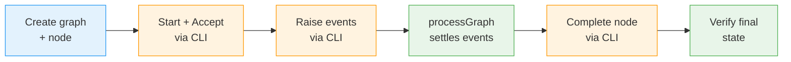
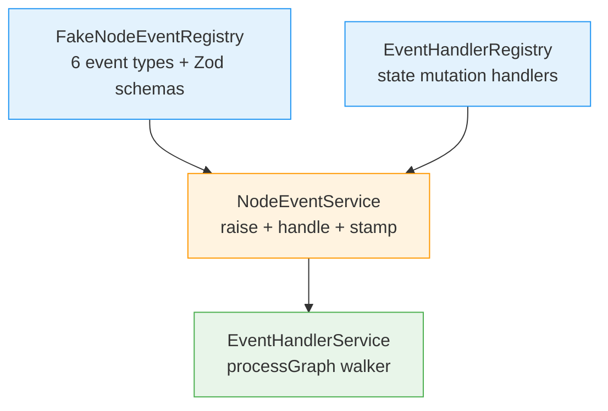
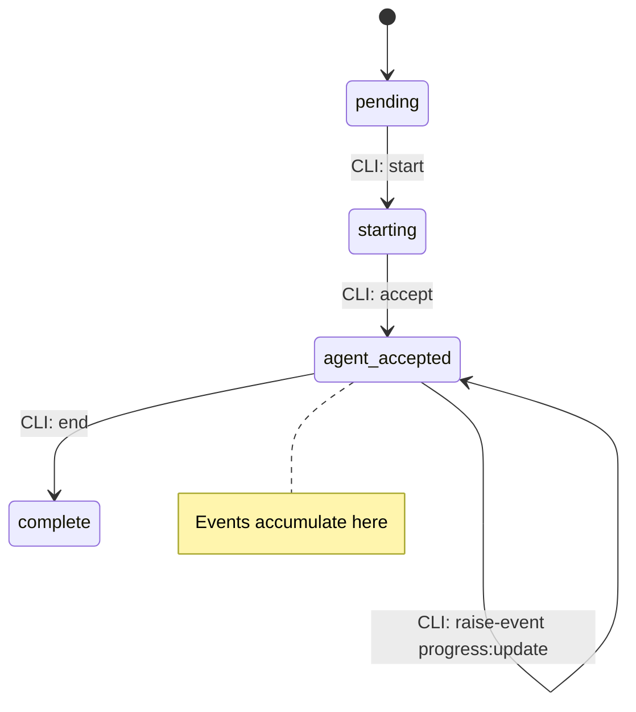
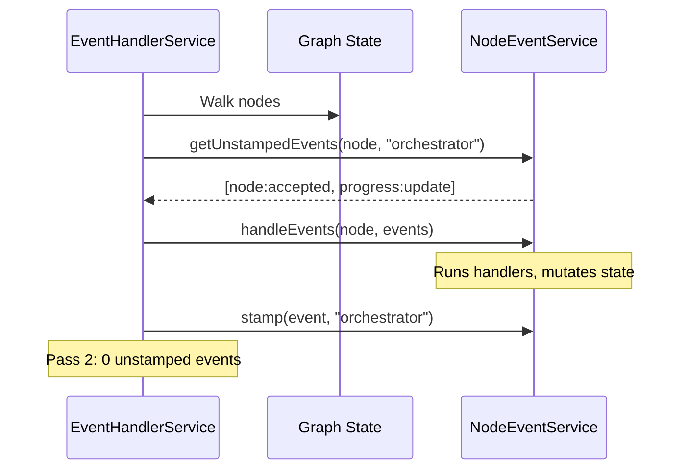

# Worked Example Walkthrough: Node Event System

> **Script**: [`worked-example.ts`](./worked-example.ts)
> **Run**: `pnpm build --filter=@chainglass/cli && npx tsx docs/plans/032-node-event-system/tasks/phase-8-e2e-validation-script/examples/worked-example.ts`
> **Phase**: Phase 8: E2E Validation Script (Plan 032)

## What This Demonstrates

The node event system lets agents, humans, and the orchestrator communicate through typed events on graph nodes. This worked example walks one node through its full lifecycle — creation, accepting work, reporting progress, settling events, and completing — in 11 steps. It's the miniature version of the full 41-step E2E at `test/e2e/node-event-system-visual-e2e.ts`.

---

## High-Level Flow

The two colors show the hybrid architecture: **orange** = CLI subprocess (how agents/humans interact), **green** = in-process (how the orchestrator settles).

---

## Section-by-Section

### 1. Wire the Orchestrator Stack

The event system is built from three layers that compose together. The registry knows *which* event types exist and validates payloads against their Zod schemas. The handler registry knows *what to do* when an event fires (state mutations). The `EventHandlerService` ties them together, walking a graph to find and process unstamped events.

**What to watch in output**: The 6 registered event types with their allowed sources. Notice `question:answer` only allows `human` and `orchestrator` — an agent can't answer its own question.

### 2. Create a Graph With One Node

A graph is the container. A node represents a work unit. The key surprise here is that node IDs include a random hex suffix (e.g., `greeter-38b`), so you can't hardcode them — you must capture the ID from `addNode()`.

The script also writes a minimal `unit.yaml` file to the temp workspace. This is required because the CLI's `end` command checks the work unit definition to verify required outputs are saved.

**What to watch in output**: The actual node ID with its hex suffix, and the line ID.

### 3. Walk a Node Through Its Lifecycle via CLI

This is the hybrid model in action. The CLI is the boundary between agents/humans and the event system. Commands like `start`, `accept`, and `raise-event` go through the CLI subprocess, which writes events to the graph state on disk.

**What to watch in output**: Three CLI calls, each advancing the node's status. The `raise-event` command takes an event type and `--payload` JSON — the payload must match the Zod schema exactly (e.g., `percent` not `percentage`).

### 4. Inspect the Event Log

Every event raised on a node is persisted in its event log. The `events` CLI command reads it back. Each event has a stamps map — subscribers that have processed it get a stamp entry.

**What to watch in output**: Two events (`node:accepted` and `progress:update`), each with 1 stamp from the `cli` subscriber (the CLI stamps events it raises). The `orchestrator` subscriber hasn't stamped them yet — that happens in processGraph.

### 5. processGraph — The Orchestrator Settles Events

This is the core mechanism. `processGraph()` walks every node in the graph, finds events without a stamp from this subscriber, runs the appropriate handler, and stamps them. Running it twice proves idempotency — the second pass finds 0 unstamped events.

**What to watch in output**: Pass 1 processes 2 events with 2 handler invocations. Pass 2 processes 0 — idempotency confirmed.

### 6. Complete the Node

Save output data (not an event — it's direct state mutation), then use the `end` CLI shortcut which internally raises a `node:completed` event and transitions the node to `complete`. The final verification reads state in-process to confirm `status=complete` and `completed_at` is set.

**What to watch in output**: The `completed_at` timestamp proves the node completed with a real timestamp, not just a status string.

---

## Key Takeaways

| Concept | Why It Matters |
|---------|---------------|
| Hybrid model (CLI + in-process) | Agents interact through CLI subprocess; orchestrator settles in-process. Same boundary as production. |
| Node IDs have hex suffixes | `greeter-38b` not `greeter`. Always capture the ID from `addNode()`. |
| Zod strict schemas | Extra fields rejected. `percent` not `percentage`. `answer` not `text`. |
| processGraph idempotency | Run it twice — second pass returns 0. Safe to call repeatedly. |
| Work unit YAML required | CLI's `end` command validates required outputs against `unit.yaml`. Must exist in workspace. |
| Stamps track subscribers | Each subscriber stamps events independently. The orchestrator, CLI, and custom subscribers all maintain separate stamps. |

---

## Next Steps

- **Full E2E**: `npx tsx test/e2e/node-event-system-visual-e2e.ts` — 41 steps covering all 6 event types, 5 error codes, question/answer flow, and multi-node pipeline
- **Unit tests**: `pnpm test` — 287+ event system tests across unit/integration suites
