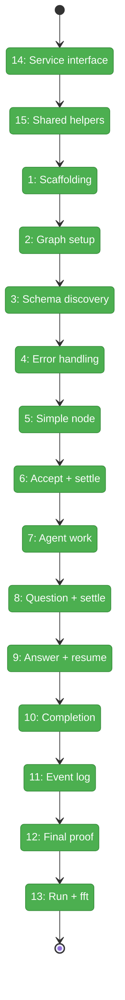
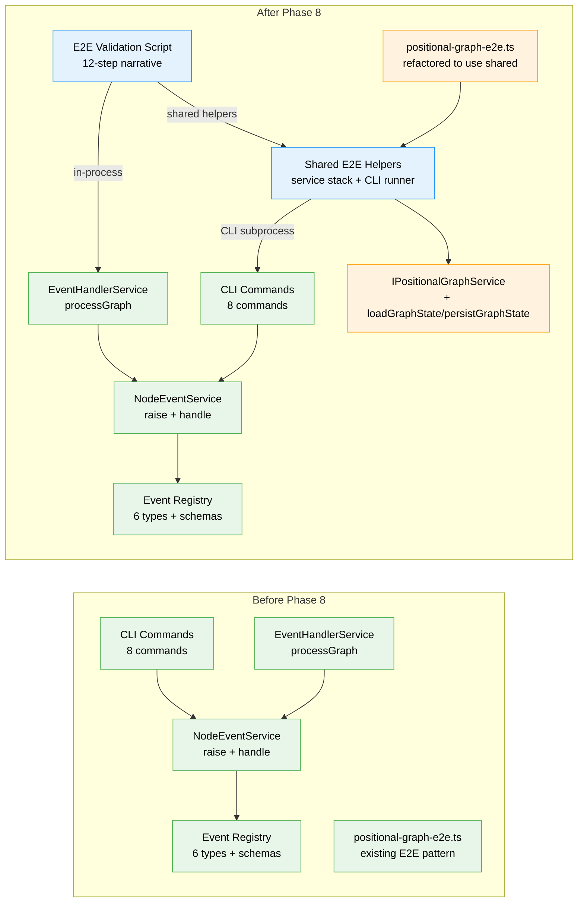

# Flight Plan: Phase 8 — E2E Validation Script

**Plan**: [node-event-system-plan.md](../../node-event-system-plan.md)
**Phase**: Phase 8: E2E Validation Script
**Generated**: 2026-02-08
**Status**: Landed

---

## Departure → Destination

**Where we are**: Phases 1-7 of Plan 032 are complete. The node event system is fully built: 6 event types with Zod-validated schemas, a type registry, the `raiseEvent()` write path, 6 event handlers with state mutations, `INodeEventService` with `HandlerContext` and subscriber stamps, 8 CLI commands (`raise-event`, `events`, `stamp-event`, `accept`, `end`, `error`, `event list-types`, `event schema`), and the graph-wide `EventHandlerService.processGraph()` Settle phase. There are 3689 passing tests across 287+ event system tests. Everything works individually — but nothing yet proves the entire system works together end-to-end.

**Where we're going**: A developer runs `npx tsx test/e2e/node-event-system-visual-e2e.ts` and watches the complete node event lifecycle play out: graph creation, schema discovery, error handling, a simple node completing, an agent node accepting work, asking a question, receiving a human answer, resuming, and completing — all with `processGraph()` settlement between steps. The script exits 0, proving Plan 032 is done. Plan 030 Phase 6 (ODS) can resume.

---

## Flight Status

<!-- Updated by /plan-6: pending → active → done. Use blocked for problems/input needed. -->

**Legend**: grey = pending | yellow = active | red = blocked/needs input | green = done

---

## Stages

<!-- Updated by /plan-6 during implementation: [ ] → [~] → [x] -->

- [x] **Stage 14: Expose service state methods** — add public `loadGraphState`/`persistGraphState` to `IPositionalGraphService` and implementation, wrapping existing private methods (`positional-graph-service.interface.ts`, `positional-graph.service.ts` — modified)
- [x] **Stage 15: Extract shared E2E helpers** — create `test/helpers/positional-graph-e2e-helpers.ts` with `createTestServiceStack`, `runCli`, `step`, `assert`, `banner`, `unwrap`; refactor existing `positional-graph-e2e.ts` to import from shared (`test/helpers/` — new file, `test/e2e/positional-graph-e2e.ts` — modified)
- [x] **Stage 1: Create script scaffolding** — import shared helpers, add orchestrator component stack (EventHandlerService), main() with try/catch and exit 0/1 (`test/e2e/node-event-system-visual-e2e.ts` — new file)
- [x] **Stage 2: Create graph and add nodes** — in-process service creates graph and adds 2 nodes: `spec-writer` (user-input) and `code-builder` (agent)
- [x] **Stage 3: Schema self-discovery** — `event list-types` returns 6 types, `event schema question:ask` returns payload fields
- [x] **Stage 4: Error handling section** — throwaway node exercises all 5 error codes (E190, E191, E193, E196, E197) plus `error` shortcut
- [x] **Stage 5: Complete simple node** — `spec-writer` saves output and completes via `end` shortcut, status -> complete
- [x] **Stage 6: Accept and settle** — orchestrator starts `code-builder`, agent accepts via CLI shortcut, `processGraph()` settles with `eventsProcessed: 5`
- [x] **Stage 7: Agent does work** — raise `progress:update` via generic `raise-event`, save partial output via `save-output-data`
- [x] **Stage 8: Agent asks question** — raise `question:ask` (stops execution), `processGraph()` settles, status -> `waiting-question`
- [x] **Stage 9: Human answers and agent resumes** — human raises `question:answer --source human`, `processGraph()` settles, agent reads answer via CLI
- [x] **Stage 10: Agent completes** — final progress, save output, `end` shortcut, status -> complete with `completed_at`
- [x] **Stage 11: Event log inspection** — `events` command prints full log, `stamp-event` adds third subscriber, 3 stamps visible
- [x] **Stage 12: Final proof** — `processGraph()` settles remaining + returns `eventsProcessed: 0` (idempotency), both nodes complete, banner: ALL 41 STEPS PASSED
- [x] **Stage 13: Run and validate** — build CLI, run script end-to-end (exit 0), run `just fft` (3689 tests pass)

---

## Architecture: Before & After

**Legend**: existing (green, unchanged) | changed (orange, modified) | new (blue, created)

---

## Acceptance Criteria

- [x] Script runs fully automatically with zero manual intervention
- [x] Every step prints human-readable output showing what happened
- [x] Script plays all roles: orchestrator, agent, and human
- [x] Event log inspected and printed as a table
- [x] Schema self-discovery demonstrated (list-types, schema)
- [x] Both shortcut commands and generic event raise used
- [x] Script exits 0 on success, 1 on failure
- [x] `just fft` clean

## Goals & Non-Goals

**Goals**:
- Create a standalone `tsx` E2E script with hybrid CLI + in-process architecture
- Exercise all 8 CLI commands and all 6 event types
- Demonstrate `processGraph()` settlement, idempotency, and subscriber isolation
- Demonstrate error handling across 5 error codes
- Print human-readable output with `[CLI]`/`[IN-PROCESS]` boundary tags

**Non-Goals**:
- Not a vitest test — standalone script with exit 0/1 contract
- Not part of `just fft` — requires separate CLI build step
- No parallel execution — deliberately sequential for readability
- No real agents or pods — everything simulated via CLI
- No new test framework — shared helpers extracted from existing patterns

---

## Checklist

- [x] T014: Expose loadGraphState/persistGraphState on IPositionalGraphService (CS-1)
- [x] T015: Extract shared E2E helpers + refactor existing positional-graph-e2e.ts (CS-2)
- [x] T001: Create E2E script scaffolding with shared helpers and orchestrator stack (CS-2)
- [x] T002: Implement Step 1 — Create graph and add 2 nodes (CS-1)
- [x] T003: Implement Step 2 — Schema self-discovery via list-types + schema (CS-1)
- [x] T004: Implement Step 2e — Error handling section with all 5 error codes (CS-2)
- [x] T005: Implement Step 3 — Direct output on spec-writer + end (CS-1)
- [x] T006: Implement Steps 4a-4c — Start + accept shortcut + processGraph settle (CS-2)
- [x] T007: Implement Step 5 — Agent progress + save-output-data (CS-1)
- [x] T008: Implement Steps 6a-6b — Question:ask + processGraph settle (CS-2)
- [x] T009: Implement Steps 7-8 — Human answer + processGraph settle + agent resume (CS-2)
- [x] T010: Implement Step 9 — Agent completes via end shortcut (CS-1)
- [x] T011: Implement Step 10 — Event log inspection + stamp-event demo (CS-2)
- [x] T012: Implement Steps 11-12 — Final processGraph idempotency + validation (CS-1)
- [x] T013: Run complete script + just fft (CS-1)

---

## PlanPak

Active — E2E script at `test/e2e/node-event-system-visual-e2e.ts` (plan-scoped, test conventions). Source files under `features/032-node-event-system/`.
