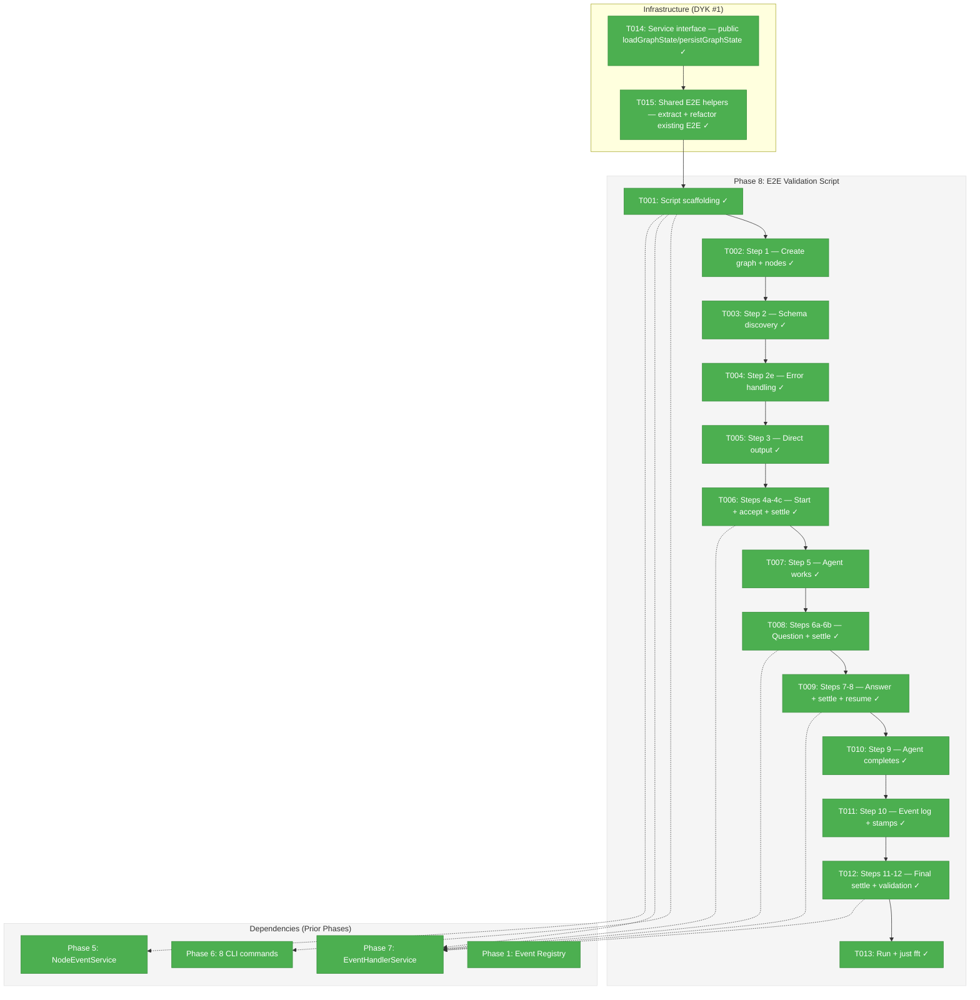
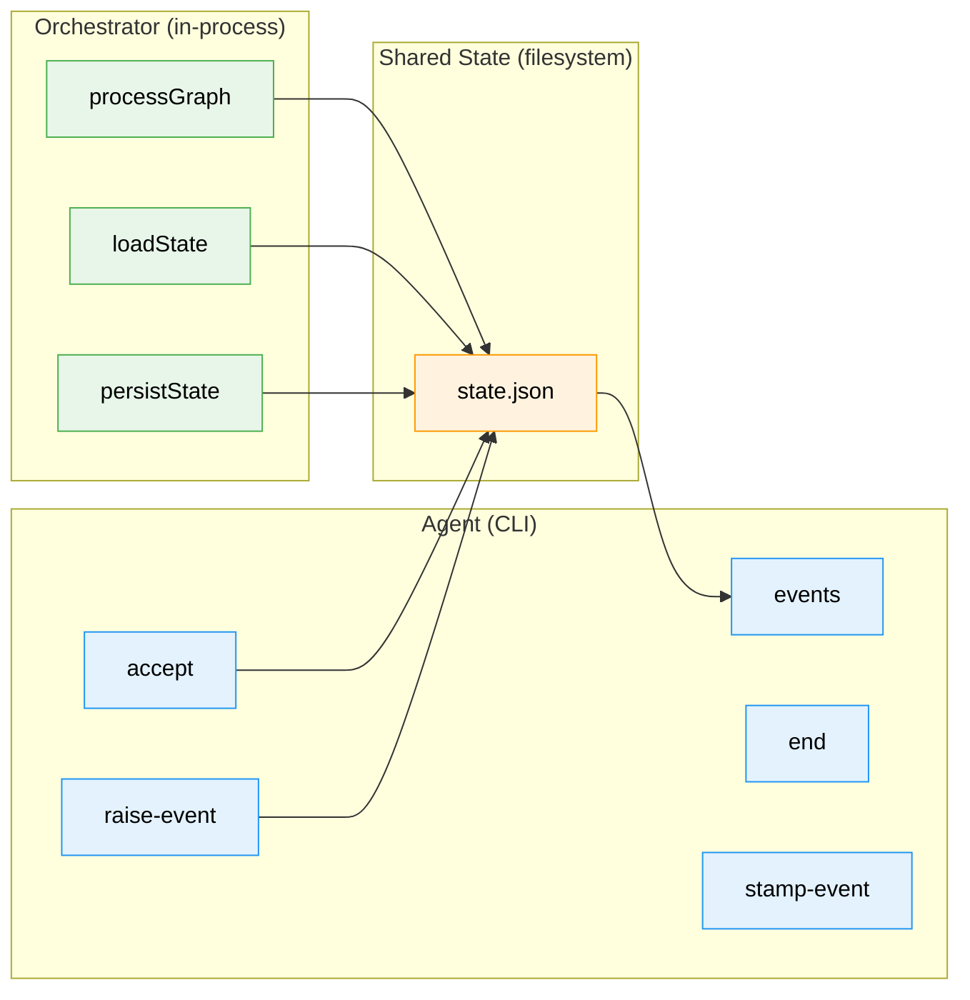
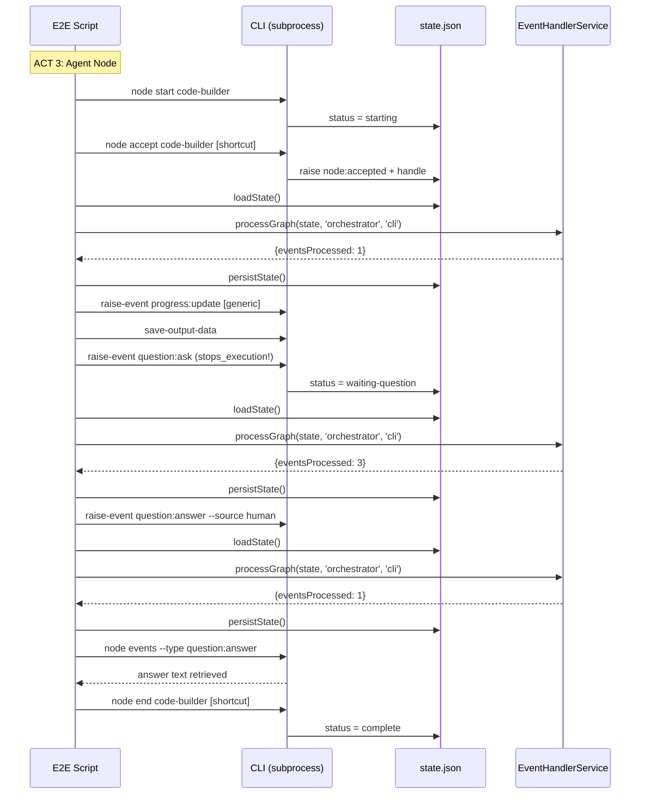

# Phase 8: E2E Validation Script — Tasks & Alignment Brief

**Spec**: [node-event-system-spec.md](../../node-event-system-spec.md)
**Plan**: [node-event-system-plan.md](../../node-event-system-plan.md)
**Workshop**: [13-e2e-validation-script-design.md](../../workshops/13-e2e-validation-script-design.md)
**Date**: 2026-02-08

---

## Executive Briefing

### Purpose

This phase delivers the culminating artifact of Plan 032: a fully automatic E2E validation script that exercises the entire node event system end-to-end. When this script exits 0, Plan 032 is complete and the event system is ready for Plan 030's orchestration loop to consume. It is the only place where CLI commands, event handlers, stamps, state transitions, and the graph-wide `processGraph()` Settle phase converge in a single runnable narrative.

### What We're Building

A standalone `tsx` script (`test/e2e/node-event-system-visual-e2e.ts`) that tells the story of a 2-node pipeline executing from start to finish using events. The script uses a **hybrid model** mirroring production architecture:
- **Agent/Human actions** go through CLI (`cg wf node accept`, `raise-event`, `end`, etc.)
- **Orchestrator actions** call services in-process (`processGraph()`, `loadState()`)

The script walks through 12 steps across 4 acts: Setup, Simple Node, Agent Node (the main story with questions, answers, and resumption), and Inspection + Proof (event log, idempotency, final validation).

### User Value

A developer or LLM agent reading the script output understands the entire event system without reading any other documentation. A code reviewer can point to the E2E script as evidence that the event system contract is exercised and passing. Plan 030's developer sees exactly how ODS action handlers should raise events.

### Example

**Run**:
```bash
pnpm build --filter=@chainglass/cli && npx tsx test/e2e/node-event-system-visual-e2e.ts
```

**Output** (abbreviated):
```
======================================================================
  E2E: Node Event System — Full Lifecycle Demo
======================================================================
Mode: Hybrid (CLI for agent, in-process for orchestrator)

STEP 1: Create graph and add nodes
  + Created graph: event-system-e2e
  + Added node: spec-writer (user-input)
  + Added node: code-builder (agent)

STEP 4b: Agent accepts code-builder                              [CLI]
  + Agent accepts via shortcut: cg wf node accept
  + Status: starting -> agent-accepted

STEP 4c: Orchestrator settles                              [IN-PROCESS]
  + processGraph(): nodesVisited=2, eventsProcessed=1
...
======================================================================
  ALL STEPS PASSED
======================================================================
Exit: 0
```

---

## Objectives & Scope

### Objective

Implement the E2E validation script as specified in the plan (AC-18). The script must exercise all 8 CLI commands, all 6 event types, processGraph() settlement, stamps, state transitions, schema discovery, error handling, and idempotency — all in a single linear narrative with human-readable console output.

### Goals

- Create `test/e2e/node-event-system-visual-e2e.ts` with hybrid CLI + in-process architecture
- Exercise all 8 CLI commands: `raise-event`, `events`, `stamp-event`, `accept`, `end`, `error`, `event list-types`, `event schema`
- Exercise all 6 event types: `node:accepted`, `node:completed`, `node:error`, `question:ask`, `question:answer`, `progress:update`
- Demonstrate `EventHandlerService.processGraph()` as the Settle phase (4 calls: after accept, after question, after answer, final idempotency proof)
- Demonstrate error handling (E190, E191, E193, E196, E197 + error shortcut)
- Demonstrate schema self-discovery (`list-types`, `schema`)
- Demonstrate manual stamp via `stamp-event`
- Print human-readable output at every step with `[CLI]`/`[IN-PROCESS]` tags
- Exit 0 on success, 1 on failure
- `just fft` clean

### Non-Goals (Scope Boundaries)

- Not a vitest test — standalone `tsx` script with its own exit code contract
- Not part of `just fft` — requires CLI build (`pnpm build --filter=@chainglass/cli`)
- No parallel node execution — deliberately sequential for readability
- No real agents or pods — everything simulated via CLI commands
- No web-specific handler testing — all handlers use `context: 'cli'`
- No `just` recipe creation — manual `npx tsx` invocation is sufficient
- No Vitest test wrapper — the script IS the test
- No new test framework — shared helpers extracted from existing patterns, not invented

---

## Pre-Implementation Audit

### Summary

| File | Action | Origin | Modified By | Recommendation |
|------|--------|--------|-------------|----------------|
| `packages/positional-graph/src/interfaces/positional-graph-service.interface.ts` | Modified | Plan 026 | Plans 028-032 | cross-plan-edit: add `loadGraphState`/`persistGraphState` public methods |
| `packages/positional-graph/src/services/positional-graph.service.ts` | Modified | Plan 026 | Plans 028-032 | cross-plan-edit: expose existing private `loadState`/`persistState` as public |
| `test/helpers/positional-graph-e2e-helpers.ts` | Created | Plan 032 Phase 8 | N/A | shared E2E test helpers (service stack, CLI runner, assertions) |
| `test/e2e/positional-graph-e2e.ts` | Modified | Plan 026 | Plan 029 | refactor: import shared helpers instead of local definitions |
| `test/e2e/node-event-system-visual-e2e.ts` | Created | Plan 032 Phase 8 | N/A | keep-as-is |

### Per-File Detail

#### `test/e2e/node-event-system-visual-e2e.ts`

- **Duplication check**: Two reference scripts exist:
  - `test/e2e/positional-graph-e2e.ts` — existing E2E pattern with `step()`, `assert()`, `unwrap()` helpers, temp workspace, exit 0/1. Reusable patterns: step counter, assertion style, cleanup.
  - `docs/plans/032-node-event-system/e2e-event-system-sample-flow.ts` — design document (pre-implementation). Shows intended CLI surface but command names differ from Phase 6 implementation. Reusable patterns: `runCli()` helper, banner formatting.
  - `docs/plans/032-node-event-system/tasks/phase-7-onbas-adaptation-and-backward-compat-projections/examples/worked-example.ts` — Phase 7 in-process demo. Shows `EventHandlerService` construction and `processGraph()` usage.
  - **Assessment**: New file is warranted. It combines CLI (from design doc) and in-process (from worked example) patterns that no existing file provides. Follow the existing `positional-graph-e2e.ts` style for helpers.
- **Provenance**: N/A (new file)
- **Compliance**: No violations. Correct naming (kebab-case, `-e2e.ts` suffix), correct location (`test/e2e/`), follows ADR-0006 CLI-based agent pattern.

### Compliance Check

No violations found.

---

## Requirements Traceability

### Coverage Matrix

| AC | Description | Flow Summary | Files in Flow | Tasks | Status |
|----|-------------|-------------|---------------|-------|--------|
| AC-18 | E2E script runs fully automatically with visual output | Script creates graph via CLI, walks lifecycle with hybrid CLI+in-process, inspects events, validates state | `test/e2e/node-event-system-visual-e2e.ts` (new), `apps/cli/src/commands/positional-graph.command.ts` (existing, 8 commands), `packages/positional-graph/src/features/032-node-event-system/event-handler-service.ts` (existing), `packages/positional-graph/src/features/032-node-event-system/node-event-service.ts` (existing) | T001-T013 | Complete |

### Gaps Found

No gaps. All 8 CLI commands verified present (Phase 6 complete). All in-process components verified exported (Phase 5+7 complete). State loading/persistence available via `PositionalGraphService.loadState()` pattern.

### Orphan Files

None. The single deliverable (`node-event-system-visual-e2e.ts`) maps directly to AC-18.

---

## Architecture Map

### Component Diagram

<!-- Status: grey=pending, orange=in-progress, green=completed, red=blocked -->
<!-- Updated by plan-6 during implementation -->



### Task-to-Component Mapping

<!-- Status: Pending | In Progress | Complete | Blocked -->

| Task | Component(s) | Files | Status | Comment |
|------|-------------|-------|--------|---------|
| T014 | Service interface | `positional-graph-service.interface.ts`, `positional-graph.service.ts` | ✅ Complete | Expose loadGraphState/persistGraphState as public methods |
| T015 | Shared E2E helpers | `test/helpers/positional-graph-e2e-helpers.ts`, `test/e2e/positional-graph-e2e.ts` | ✅ Complete | Extract helpers from existing E2E, refactor existing to import shared |
| T001 | Script scaffolding | `test/e2e/node-event-system-visual-e2e.ts` | ✅ Complete | Import shared helpers, add orchestrator stack, main() shell |
| T002 | ACT 1: Setup | `test/e2e/node-event-system-visual-e2e.ts` | ✅ Complete | Step 1: create graph, add 2 nodes (in-process) |
| T003 | ACT 1: Discovery | `test/e2e/node-event-system-visual-e2e.ts` | ✅ Complete | Step 2: list-types + schema |
| T004 | ACT 1: Error handling | `test/e2e/node-event-system-visual-e2e.ts` | ✅ Complete | Step 2e: all error dimensions on throwaway node |
| T005 | ACT 2: Simple node | `test/e2e/node-event-system-visual-e2e.ts` | ✅ Complete | Step 3: save-output-data + end on Node 1 |
| T006 | ACT 3: Start + accept | `test/e2e/node-event-system-visual-e2e.ts` | ✅ Complete | Steps 4a-4c: start, accept shortcut, processGraph settle |
| T007 | ACT 3: Agent work | `test/e2e/node-event-system-visual-e2e.ts` | ✅ Complete | Step 5: progress event + save-output-data |
| T008 | ACT 3: Question | `test/e2e/node-event-system-visual-e2e.ts` | ✅ Complete | Steps 6a-6b: question:ask + processGraph settle |
| T009 | ACT 3: Answer + resume | `test/e2e/node-event-system-visual-e2e.ts` | ✅ Complete | Steps 7-8: human answer + processGraph settle + agent resume |
| T010 | ACT 3: Completion | `test/e2e/node-event-system-visual-e2e.ts` | ✅ Complete | Step 9: progress + save-output-data + end shortcut |
| T011 | ACT 4: Inspection | `test/e2e/node-event-system-visual-e2e.ts` | ✅ Complete | Step 10: events command + stamp-event demo |
| T012 | ACT 4: Proof | `test/e2e/node-event-system-visual-e2e.ts` | ✅ Complete | Steps 11-12: final processGraph idempotency + state validation |
| T013 | Quality gate | N/A | ✅ Complete | Script exits 0, just fft 3689 passed |

---

## Tasks

| Status | ID | Task | CS | Type | Dependencies | Absolute Path(s) | Validation | Subtasks | Notes |
|--------|------|-----------------------------------|-----|------|--------------|-------------------------------|-------------------------------|----------|-------|
| [x] | T014 | Expose `loadGraphState(ctx, graphSlug)` and `persistGraphState(ctx, graphSlug, state)` as public methods on `IPositionalGraphService` and `PositionalGraphService`. These wrap the existing private `loadState`/`persistState` with `WorkspaceContext`. | 1 | Setup | – | `/home/jak/substrate/030-positional-orchestrator/packages/positional-graph/src/interfaces/positional-graph-service.interface.ts`, `/home/jak/substrate/030-positional-orchestrator/packages/positional-graph/src/services/positional-graph.service.ts` | Methods callable, return `State` object, `just fft` clean | – | DYK #1 decision. Cross-plan-edit. Reusable for Plan 030. |
| [x] | T015 | Extract shared E2E test helpers to `test/helpers/positional-graph-e2e-helpers.ts`: `createTestServiceStack(workspacePath)` (wires adapters + service, returns `{service, ctx}`), `runCli<T>(args, workspacePath)` (spawns CLI subprocess, parses JSON), `step()`, `assert()`, `banner()`, `unwrap()`, `cleanup()`. Refactor existing `positional-graph-e2e.ts` to import from shared helpers instead of defining locally. | 2 | Setup | T014 | `/home/jak/substrate/030-positional-orchestrator/test/helpers/positional-graph-e2e-helpers.ts`, `/home/jak/substrate/030-positional-orchestrator/test/e2e/positional-graph-e2e.ts` | Existing E2E still passes after refactor (`pnpm build --filter=@chainglass/cli && npx tsx test/e2e/positional-graph-e2e.ts` exits 0), shared helpers importable, `just fft` clean | – | DYK #1+#3 decision. Shared infrastructure for Plan 030+. Old E2E refactored properly, not left behind. |
| [x] | T001 | Create E2E script scaffolding: shebang, imports (shared E2E helpers + in-process EventHandlerService stack), orchestrator component stack construction (FakeNodeEventRegistry + createEventHandlerRegistry + NodeEventService + EventHandlerService), main() with try/catch and exit 0/1, cleanup at start. Use `createTestServiceStack()` and `loadGraphState()`/`persistGraphState()` from shared helpers for state access. | 2 | Setup | T014, T015 | `/home/jak/substrate/030-positional-orchestrator/test/e2e/node-event-system-visual-e2e.ts` | Script compiles (`npx tsc --noEmit`), helpers callable, orchestrator stack constructed, cleanup deletes stale graph | – | Plan 8.1. Import shared helpers from `test/helpers/`. In-process imports per Workshop 13 skeleton. |
| [x] | T002 | Implement Step 1 — Create graph and add 2 nodes (spec-writer as user-input, code-builder as agent wired to spec-writer.spec). Use CLI commands: `cg wf create`, `cg wf node add-after`. Assert graph created, 2 nodes present. Print node IDs and wiring. | 1 | Core | T001 | `/home/jak/substrate/030-positional-orchestrator/test/e2e/node-event-system-visual-e2e.ts` | Graph exists with 2 nodes, CLI JSON output parsed correctly | – | Plan 8.2 |
| [x] | T003 | Implement Step 2 — Schema self-discovery. Call `cg wf node event list-types` and assert all 6+ types returned. Call `cg wf node event schema question:ask` and assert fields include `text`, `question_id`. Print formatted type list and schema fields. Tag as `[CLI]`. | 1 | Core | T002 | `/home/jak/substrate/030-positional-orchestrator/test/e2e/node-event-system-visual-e2e.ts` | list-types returns 6+ types, schema returns fields for question:ask | – | Plan 8.3. AC-18 schema discovery. |
| [x] | T004 | Implement Step 2e — Error handling section. Create throwaway node. Exercise all error dimensions: E190 (unknown type), E191 (invalid payload), E193 (invalid state), E196 (event not found), E197 (invalid JSON). Demonstrate `cg wf node error` shortcut (raises node:error, status -> blocked-error). Assert each error code in JSON response. Remove throwaway node. Tag as `[CLI]`. | 2 | Core | T003 | `/home/jak/substrate/030-positional-orchestrator/test/e2e/node-event-system-visual-e2e.ts` | All 5 error codes asserted + error shortcut demonstrated | – | Plan 8.3 (extended). Workshop 13 Q4. |
| [x] | T005 | Implement Step 3 — Direct output on spec-writer (Node 1). Call `cg wf node save-output-data` to save spec output. Call `cg wf node end` to complete. Assert status -> complete. Tag as `[CLI]`. Note: save-output-data is a direct service call, not an event. | 1 | Core | T004 | `/home/jak/substrate/030-positional-orchestrator/test/e2e/node-event-system-visual-e2e.ts` | spec-writer status = complete, output saved | – | Plan 8.4. Workshop 13 Q5. |
| [x] | T006 | Implement Steps 4a-4c — Orchestrator starts code-builder [IN-PROCESS: start via CLI], Agent accepts [CLI: `cg wf node accept` shortcut], Orchestrator settles [IN-PROCESS: `processGraph(state, 'orchestrator', 'cli')`]. Load state from disk, call processGraph, persist state back. Assert status transitions: pending -> starting -> agent-accepted. Assert processGraph result: nodesVisited=2, eventsProcessed >= 1. Print boundary tags. | 2 | Core | T005 | `/home/jak/substrate/030-positional-orchestrator/test/e2e/node-event-system-visual-e2e.ts` | Status = agent-accepted, processGraph eventsProcessed >= 1, stamps visible | – | Plan 8.5. Two-phase handshake. Hybrid model: CLI for accept, in-process for settle. |
| [x] | T007 | Implement Step 5 — Agent does work. Raise `progress:update` via `raise-event` (generic, not shortcut). Call `save-output-data` for partial output. Assert progress event in log. Note in output that save-output-data is NOT an event. Tag as `[CLI]`. | 1 | Core | T006 | `/home/jak/substrate/030-positional-orchestrator/test/e2e/node-event-system-visual-e2e.ts` | progress event raised, output saved, event visible in log | – | Plan 8.6. Uses generic raise-event (AC-18 "both shortcuts and generic"). |
| [x] | T008 | Implement Steps 6a-6b — Agent asks question via `raise-event question:ask` with payload `{question_id, text, type}` [CLI]. Assert stops_execution=true and AGENT INSTRUCTION in output. Orchestrator settles [IN-PROCESS: processGraph]. Assert question detected, node in waiting-question state. Print dramatic boundary crossing. | 2 | Core | T007 | `/home/jak/substrate/030-positional-orchestrator/test/e2e/node-event-system-visual-e2e.ts` | question:ask raised, stops_execution=true, processGraph eventsProcessed >= 1, status=waiting-question | – | Plan 8.7. Workshop 13 "the dramatic moment." |
| [x] | T009 | Implement Steps 7-8 — Human answers question via `raise-event question:answer --source human` [CLI]. Orchestrator settles [IN-PROCESS: processGraph]. Assert answer event stamped, status back to starting (DYK #1: answer returns to starting, not agent-accepted). Agent resumes: read events via `cg wf node events --type question:answer` [CLI], retrieve answer text. | 2 | Core | T008 | `/home/jak/substrate/030-positional-orchestrator/test/e2e/node-event-system-visual-e2e.ts` | Answer raised, processGraph eventsProcessed >= 1, status=starting, agent retrieves answer | – | Plan 8.8-8.9. DYK #1: answerQuestion returns 'starting'. Agent must re-accept for further work but can complete directly. |
| [x] | T010 | Implement Step 9 — Agent completes. Raise `progress:update` (final progress). Save final output via `save-output-data`. Complete via `cg wf node end` shortcut [CLI]. Assert status -> complete, completed_at set. | 1 | Core | T009 | `/home/jak/substrate/030-positional-orchestrator/test/e2e/node-event-system-visual-e2e.ts` | code-builder status = complete with completed_at | – | Plan 8.9 (completion part). Uses end shortcut. |
| [x] | T011 | Implement Step 10 — Event log inspection. Call `cg wf node events` [CLI] for code-builder, print full event table (event_id, type, source, stops_execution, stamps). Demonstrate `stamp-event` [CLI]: add manual stamp from `e2e-verifier` subscriber. Verify event now has 3 subscribers (cli, orchestrator, e2e-verifier). | 2 | Core | T010 | `/home/jak/substrate/030-positional-orchestrator/test/e2e/node-event-system-visual-e2e.ts` | Event log printed as table, stamp-event adds subscriber, 3 stamps visible | – | Plan 8.10. AC-18 event log inspection. |
| [x] | T012 | Implement Steps 11-12 — Orchestrator final settle [IN-PROCESS: processGraph returns eventsProcessed=0, proving idempotency]. Validate final state: both nodes complete. Print summary. Banner: ALL STEPS PASSED. Exit 0. | 1 | Core | T011 | `/home/jak/substrate/030-positional-orchestrator/test/e2e/node-event-system-visual-e2e.ts` | processGraph eventsProcessed=0 (idempotency), both nodes complete, exit 0 | – | Plan 8.11. Idempotency proof per Phase 7 design. |
| [x] | T013 | Run complete script end-to-end: `pnpm build --filter=@chainglass/cli && npx tsx test/e2e/node-event-system-visual-e2e.ts`. Verify exit 0. Run `just fft` and verify all tests pass. Fix any issues. | 1 | Integration | T012 | `/home/jak/substrate/030-positional-orchestrator/test/e2e/node-event-system-visual-e2e.ts` | Script exits 0, `just fft` clean | – | Plan 8.12-8.13. |

---

## Alignment Brief

### Prior Phases Review

#### Phase-by-Phase Summary

**Phase 1 (Event Types, Schemas, Registry)**: Built the foundation — 12 source files in `features/032-node-event-system/` creating `NodeEventSchema`, `INodeEventRegistry`, `FakeNodeEventRegistry`, 8 payload schemas (`.strict()`), `generateEventId()`, `registerCoreEventTypes()`, and E190-E195 error factories. 94 tests. Discovery: `errors/index.ts` auto-exports via `keyof typeof`.

**Phase 2 (State Schema Extension + Two-Phase Handshake)**: The breaking change — replaced `'running'` with `'starting'` + `'agent-accepted'` across 7 source files and 13 test files. Added `events: z.array(NodeEventSchema).optional()` to `NodeStateEntrySchema`. Created `isNodeActive()` and `canNodeDoWork()` predicates. Key rule: `answerQuestion()` returns `'starting'`, NOT `'agent-accepted'` (DYK #1). 3541 total tests.

**Phase 3 (raiseEvent Core Write Path)**: Created the single write path — `raiseEvent()` standalone function with 5-step validation (type check, payload validation, source authorization, state transition check, question reference check). `VALID_FROM_STATES` map is the authoritative state transition guard. Made record-only (no handler invocation). 22 tests, 3563 total.

**Phase 4 (Event Handlers + State Transitions)**: Built 6 handlers (`handleNodeAccepted`, `handleNodeCompleted`, `handleNodeError`, `handleQuestionAsk`, `handleQuestionAnswer`, `handleProgressUpdate`) + `createEventHandlerRegistry()` factory. Handlers mutate state in-place. Backward-compat layer built then deleted in Phase 5. 36 tests added.

**Phase 5 (Service Method Wrappers — INodeEventService + HandlerContext)**: The major architectural phase. Created `INodeEventService`, `NodeEventService`, `FakeNodeEventService`, `EventHandlerRegistry` with context tags, `HandlerContext` interface, `EventStampSchema`. Refactored handlers to use `ctx.stamp()` instead of `markHandled()`. Service wrappers (`endNode`, `askQuestion`, `answerQuestion`) delegate to `eventService.raise()` + `handleEvents()`. 203 event system tests, 3634 total. Two registries: `INodeEventRegistry` (type validation) and `EventHandlerRegistry` (handler dispatch).

**Phase 6 (CLI Commands)**: Delivered all 8 CLI commands: `raise-event`, `events`, `stamp-event`, `accept`, `end` (updated with `--message`), `error`, `event list-types`, `event schema`. Added E196+E197 error codes. `getJsonFlag()` parent chain walker for deep nesting. 3 service methods on `IPositionalGraphService`: `raiseNodeEvent`, `getNodeEvents`, `stampNodeEvent`. 55 tests added, 3689 total.

**Phase 7 (IEventHandlerService — Graph-Wide Processor)**: The Settle phase. `EventHandlerService.processGraph(state, subscriber, context)` iterates all nodes, counts unstamped events before handling (Critical Insight #1), delegates to NES. Returns `ProcessGraphResult { nodesVisited, eventsProcessed, handlerInvocations }`. Synchronous. Idempotent. 29 tests added, 3689 total.

#### Cumulative Deliverables

**Source files** (features/032-node-event-system/): `node-event.schema.ts`, `event-source.schema.ts`, `event-status.schema.ts`, `event-payloads.schema.ts`, `event-stamp.schema.ts`, `event-type-registration.ts`, `node-event-registry.interface.ts`, `node-event-registry.ts`, `fake-node-event-registry.ts`, `core-event-types.ts`, `event-id.ts`, `event-errors.ts`, `event-helpers.ts`, `raise-event.ts`, `event-handlers.ts`, `event-handler-registry.ts`, `handler-context.interface.ts`, `node-event-service.interface.ts`, `node-event-service.ts`, `fake-node-event-service.ts`, `event-handler-service.interface.ts`, `event-handler-service.ts`, `fake-event-handler-service.ts`, `index.ts`

**Cross-plan edits**: `state.schema.ts` (enum + events), `positional-graph.service.ts` (status guards + 3 event methods), `positional-graph.command.ts` (8 CLI commands), `positional-graph-errors.ts` (E190-E197), `console-output.adapter.ts` (formatters), ONBAS + FakeONBAS + reality types/schema (status migration)

**Test infrastructure**: 287+ event system tests across unit, integration, contract, and E2E test files. Key helpers: `FakeNodeEventRegistry`, `FakeNodeEventService`, `FakeEventHandlerService`, `createEventHandlerRegistry()`, spy handler pattern, `createFakeStateStore()`.

#### Pattern Evolution

- Phase 1-3: Standalone functions (`raiseEvent()`, `registerCoreEventTypes()`)
- Phase 4: Handler map pattern (`Map<string, EventHandler>`)
- Phase 5: First-class service pattern (`INodeEventService` with HandlerContext), stamps replace `markHandled()`
- Phase 6: CLI delegation pattern (Commander handlers -> service methods -> event pipeline)
- Phase 7: Single-dep delegation pattern (`EventHandlerService` wraps `INodeEventService`)

#### Key Construction Recipe for Phase 8

The E2E orchestrator stack (from Phase 7 worked example):
```typescript
const eventRegistry = new FakeNodeEventRegistry();
registerCoreEventTypes(eventRegistry);  // from Phase 1
const handlerRegistry = createEventHandlerRegistry();  // from Phase 4
const nes = new NodeEventService(
  { registry: eventRegistry, loadState, persistState },
  handlerRegistry
);  // from Phase 5
const ehs = new EventHandlerService(nes);  // from Phase 7
// Call: ehs.processGraph(state, 'orchestrator', 'cli')
```

### Critical Findings Affecting This Phase

| Finding | Constraint | Tasks |
|---------|-----------|-------|
| #01: Status enum replacement | Use `'starting'`, `'agent-accepted'`, never `'running'` | T006, T009, T010, T012 |
| #02: Service guards on agent-accepted | `canNodeDoWork()` only true for `'agent-accepted'`; DYK #1: `answerQuestion()` returns `'starting'` | T009 |
| #07: CLI follows established pattern | All commands use `--json` flag, JSON envelope: `{success, command, data/errors}` | T002-T011 |

### ADR Decision Constraints

- **ADR-0006**: CLI-based workflow agent orchestration. Agents are external processes communicating via CLI. The E2E hybrid model mirrors this: agent actions go through CLI subprocess, orchestrator actions call services directly. Constrains: T002-T011 agent steps must use `runCli()`, not direct service calls. Addressed by: T001 (runCli helper), T002-T011 (CLI usage).

- **ADR-0011**: First-class domain concepts. `INodeEventService` is the exemplar. The E2E script imports the real service implementation, not a fake. Addressed by: T001 (orchestrator stack construction).

### PlanPak Placement Rules

- E2E script: `test/e2e/node-event-system-visual-e2e.ts` (plan-scoped, test conventions)
- No other files created or modified

### Invariants & Guardrails

- **No mocks**: Constitution prohibits `vi.mock`/`jest.mock`. The E2E uses real services + real CLI.
- **Assertions verify data, not formatting**: Assert on JSON output (`.data.status`, `.data.event_type`), never on human-readable console strings (Workshop 13 D3).
- **Cleanup before, not after**: Delete test graph at start, not end. Failed runs leave state for debugging (Workshop 13 D4).
- **CLI must be built**: `pnpm build --filter=@chainglass/cli` required before script runs.

### Inputs to Read

- Existing E2E pattern: `/home/jak/substrate/030-positional-orchestrator/test/e2e/positional-graph-e2e.ts`
- Design document: `/home/jak/substrate/030-positional-orchestrator/docs/plans/032-node-event-system/e2e-event-system-sample-flow.ts`
- Phase 7 worked example: `/home/jak/substrate/030-positional-orchestrator/docs/plans/032-node-event-system/tasks/phase-7-onbas-adaptation-and-backward-compat-projections/examples/worked-example.ts`
- Workshop 13: `/home/jak/substrate/030-positional-orchestrator/docs/plans/032-node-event-system/workshops/13-e2e-validation-script-design.md`
- CLI commands source: `/home/jak/substrate/030-positional-orchestrator/apps/cli/src/commands/positional-graph.command.ts` (lines 1234-2555 for event commands)

### Visual Alignment Aids

#### System Flow Diagram



#### Sequence Diagram — The Main Story (Steps 4-9)



### Test Plan

This phase creates a **standalone script**, not a vitest test. The script itself IS the test — it has assertions at every step and exits 0/1. No separate test file needed.

**Assertion strategy per Workshop 13 D3**: Assert on JSON data (`result.data.status`, `result.data.event.event_type`), never on console formatting.

**Key assertions**:
1. Graph creation returns `success: true` with graph slug
2. list-types returns 6+ event types
3. schema returns fields for `question:ask`
4. Error codes E190, E191, E193, E196, E197 returned in JSON errors
5. accept shortcut: status transitions `starting` -> `agent-accepted`
6. processGraph after accept: `eventsProcessed: 1`
7. question:ask: `stops_execution: true`, status `waiting-question`
8. processGraph after question: `eventsProcessed: 3` (accepted + progress + question)
9. human answer: event raised with `source: 'human'`
10. processGraph after answer: `eventsProcessed: 1`
11. end shortcut: status -> `complete`, `completed_at` set
12. Full event log: 6+ events for code-builder
13. stamp-event: 3 subscribers on stamped event
14. Final processGraph: `eventsProcessed: 0` (idempotency)
15. Both nodes complete

### Step-by-Step Implementation Outline

1. **T001**: Create file with shebang, imports, helpers, orchestrator stack, main() shell
2. **T002**: Step 1 — cleanup + create graph + add 2 nodes via CLI
3. **T003**: Step 2 — list-types + schema via CLI
4. **T004**: Step 2e — add throwaway node, exercise all error codes + error shortcut, remove node
5. **T005**: Step 3 — save output + end on spec-writer via CLI
6. **T006**: Steps 4a-4c — start via CLI, accept via CLI shortcut, loadState + processGraph + persistState
7. **T007**: Step 5 — raise-event progress:update + save-output-data via CLI
8. **T008**: Steps 6a-6b — raise-event question:ask via CLI, loadState + processGraph + persistState
9. **T009**: Steps 7-8 — raise-event question:answer --source human via CLI, processGraph settle, agent reads events via CLI
10. **T010**: Step 9 — progress + save-output-data + end shortcut via CLI
11. **T011**: Step 10 — events command + stamp-event demo via CLI
12. **T012**: Steps 11-12 — final processGraph (idempotency), assert both nodes complete, banner + exit 0
13. **T013**: Build CLI, run script, verify exit 0, run `just fft`

### Commands to Run

```bash
# Build CLI (required for E2E)
pnpm build --filter=@chainglass/cli

# Run E2E script
npx tsx test/e2e/node-event-system-visual-e2e.ts

# Full quality check
just fft

# Type check (optional, for scaffolding verification)
npx tsc --noEmit -p packages/positional-graph/tsconfig.json
```

### Risks & Unknowns

| Risk | Likelihood | Impact | Mitigation |
|------|------------|--------|------------|
| CLI command JSON output format doesn't match expectations | Low | Medium | Phase 6 integration tests verify JSON envelope. Read actual CLI source for exact shapes. |
| `loadState`/`persistState` file path resolution differs from CLI | Low | High | Use the same workspace context pattern as `positional-graph-e2e.ts`. CLI and service share the same path resolver. |
| `processGraph` event counts differ from Workshop 13 predictions | Medium | Low | Counts are advisory. Assert on ranges or minimums rather than exact numbers if needed. |
| Stale CLI build masks code changes | Low | Medium | Always rebuild CLI before running script. T013 explicitly rebuilds. |
| `node start` not available as standalone CLI command | Low | High | Verify command exists. If not, use direct service call for start (consistent with Workshop 13 Step 4a note). |

### Ready Check

- [x] ADR constraints mapped to tasks — ADR-0006 (CLI agent pattern) constrains T002-T011; ADR-0011 (first-class concepts) constrains T001
- [x] All prior phases complete (Phases 1-7, 3689 tests, `just fft` clean)
- [x] All 8 CLI commands verified present in `positional-graph.command.ts`
- [x] All in-process components verified exported from `032-node-event-system/index.ts`
- [x] Workshop 13 design decisions incorporated (hybrid model, linear narrative, cleanup before, no vitest)
- [x] Pre-Implementation Audit: no violations, no duplication concerns
- [x] Requirements Traceability: AC-18 fully covered, no gaps
- [ ] **AWAITING GO**

---

## Phase Footnote Stubs

_Empty — populated by plan-6 after implementation._

| Phase | Footnote | Files | Summary |
|-------|----------|-------|---------|
| 8 | [^16] | _(to be filled)_ | _(to be filled)_ |

---

## Evidence Artifacts

- **Execution log**: `docs/plans/032-node-event-system/tasks/phase-8-e2e-validation-script/execution.log.md`
- **Script output**: Captured during T013 run (copy/paste or redirect)
- **just fft output**: Captured during T013

---

## Discoveries & Learnings

_Populated during implementation by plan-6. Log anything of interest to your future self._

| Date | Task | Type | Discovery | Resolution | References |
|------|------|------|-----------|------------|------------|
| 2026-02-09 | T015 | gotcha | Old `positional-graph-e2e.ts` was broken — `setNodeExecution` and `setLineTransition` were renamed in Plan 026 Subtask 001 but E2E not updated | Fixed to use `updateNodeOrchestratorSettings` and `updateLineOrchestratorSettings` | log#task-t015 |
| 2026-02-09 | T001 | gotcha | CLI `endNode` calls `canEnd` → `workUnitLoader.load()` which reads `.chainglass/units/<slug>/unit.yaml`. Temp dir has no unit definitions | Create minimal YAML files for each unit slug (spec-writer, code-builder, throwaway) in temp workspace | log#t001-t012 |
| 2026-02-09 | T001 | gotcha | `user-input` type requires `user_input` section, `agent` type requires `agent` section in YAML — E182 validation error if missing | Include all type-specific sections in YAML templates | log#t001-t012 |
| 2026-02-09 | T007 | gotcha | `progress:update` schema uses field `percent` not `percentage`, `question:answer` uses `answer` not `text`. All schemas `.strict()` | Match exact schema field names | log#t001-t012 |
| 2026-02-09 | T012 | insight | Idempotency requires two-pass: after agent completes, events from re-accept/progress/completed need one more processGraph settle before true idempotency (0 events) | Added settle + idempotency check as two separate processGraph calls | log#t001-t012 |
| 2026-02-09 | T002 | insight | Node IDs generated as `{slug}-{hex3}` by `generateNodeId()`, not the slug directly. All CLI calls must use actual generated IDs from addNode results | Capture nodeId from service.addNode() return value | log#t001-t012 |

**Types**: `gotcha` | `research-needed` | `unexpected-behavior` | `workaround` | `decision` | `debt` | `insight`

**What to log**:
- Things that didn't work as expected
- External research that was required
- Implementation troubles and how they were resolved
- Gotchas and edge cases discovered
- Decisions made during implementation
- Technical debt introduced (and why)
- Insights that future phases should know about

_See also: `execution.log.md` for detailed narrative._

---

## Critical Insights (2026-02-08)

| # | Insight | Decision |
|---|---------|----------|
| 1 | `PositionalGraphService.loadState()` is private — E2E script can't access `State` object for `processGraph()` | Expose `loadGraphState`/`persistGraphState` publicly (T014). Extract shared E2E helpers to `test/helpers/` (T015). Refactor existing E2E to import shared. |
| 2 | Workshop 13's predicted `eventsProcessed` counts assume cumulative unstamped events — exact values depend on settlement timing | Assert minimums (`>= 1`) not exact counts. T012 idempotency (`= 0`) stays exact. |
| 3 | Refactoring old `positional-graph-e2e.ts` to use shared helpers risks silent breakage (not in `just fft`) | Do it properly: T015 validation explicitly runs old E2E and verifies exit 0 after refactor. |
| 4 | `cg wf node start` might not exist as standalone CLI command | Verified: exists at line 2170 of `positional-graph.command.ts`. No issue. |
| 5 | Script creates real files in temp dirs — crash leaves orphans | Acceptable: OS handles temp cleanup, cleanup-before pattern ensures clean starts. No change needed. |

Action items: T014 and T015 added to task table. T006/T008/T009 updated to use `>= 1` assertions.

---

## Directory Layout

```
docs/plans/032-node-event-system/
  ├── node-event-system-plan.md
  ├── node-event-system-spec.md
  └── tasks/phase-8-e2e-validation-script/
      ├── tasks.md                    # this file
      ├── tasks.fltplan.md            # generated by /plan-5b
      └── execution.log.md            # created by /plan-6
```
