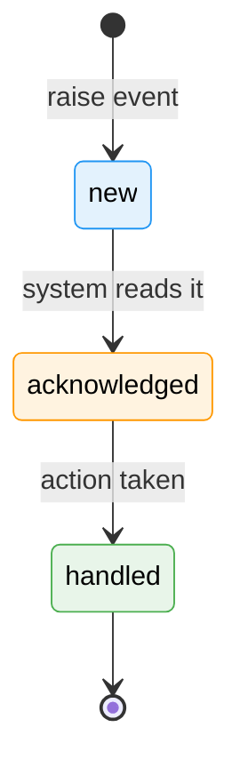

# Workshop: Node Event System

**Type**: Data Model / CLI Flow / State Machine
**Plan**: 032-node-event-system
**Spec**: (pending — to be created via /plan-1b-specify)
**Created**: 2026-02-07
**Status**: Draft

**Predecessor Plan**: [030-positional-orchestrator](../../030-positional-orchestrator/positional-orchestrator-plan.md) — Phase 6 (ODS Action Handlers) is paused pending this plan's completion. Resume Phase 6 after this plan lands.

**Related Documents**:
- [Workshop #8: ODS Orchestrator-Agent Handover](../../030-positional-orchestrator/workshops/08-ods-orchestrator-agent-handover.md) — Shared transition ownership model this builds on
- [Workshop #4: WorkUnitPods](../../030-positional-orchestrator/workshops/04-work-unit-pods.md) — Pod execution and PodExecuteResult
- [Workshop #5: ONBAS](../../030-positional-orchestrator/workshops/05-onbas.md) — Walk algorithm (must adapt to event-based node state)
- [e2e-sample-flow.ts](../../../docs/how/dev/workgraph-run/e2e-sample-flow.ts) — Current agent interaction pattern

---

## Purpose

Design a **typed, extensible, schema-validated event system** for node communication. NodeEvents replace the current bespoke methods (`askQuestion`, `answerQuestion`, `saveOutputData`, etc.) with a unified protocol where all node interactions are events — raised by any source, validated at creation, tracked in a log, and handled through a common lifecycle.

This workshop answers:
- What is a NodeEvent and how does it work?
- What event types ship initially, and how are new types added?
- How does the CLI surface events to agents in an extensible, self-documenting way?
- How do events interact with node state transitions and the orchestration loop?
- What does the event lifecycle (new → acknowledged → handled) look like?
- Which events require the agent to stop, and how is that communicated?

---

## Key Questions Addressed

- What are NodeEvents and how do they relate to the existing question/error/output mechanisms?
- What event types do we need initially, and what's the extension story?
- How does the CLI expose events so agents can discover and use them?
- How do events flow between agents, orchestrator, and external actors?
- Which events block the agent (require stop-after-raise)?
- How does the event log work, and where is it stored?

---

## Conceptual Model

### NodeEvents vs Central Event System (Plan 027)

A separate central event notification system exists (Plan 027, `ICentralEventNotifier`) for SSE-based UI notifications. That system is out of scope for this plan — we acknowledge its existence but do not integrate with or modify it here. NodeEvents are a distinct concept: **intra-node communication** with full structured data, persisted in state, and consumed by agents, orchestrator, and humans via CLI/API.

### Event Sources

Every event has a source identifying who raised it:

| Source | Value | Who |
|--------|-------|-----|
| `agent` | `'agent'` | An LLM agent interacting via CLI during execution |
| `executor` | `'executor'` | A code unit executor, script runner, or non-agent automation that plays the agent role but isn't an LLM |
| `orchestrator` | `'orchestrator'` | The orchestration system (ODS, ONBAS, or the orchestration loop) |
| `human` | `'human'` | A human interacting via CLI or UI (e.g., answering a question) |

**Why `executor` and not just `agent`?** Code work units run scripts that interact with the node the same way agents do — they save outputs, may report errors, and signal completion. But they aren't agents. Having a distinct source lets the orchestrator apply different policies (e.g., auto-accept for executors, timeout differently for agents).

```typescript
export const EventSourceSchema = z.enum(['agent', 'executor', 'orchestrator', 'human']);
export type EventSource = z.infer<typeof EventSourceSchema>;
```

---

## Event Types

### Initial Event Types

| Event Type | Source(s) | Direction | Stops Agent? | Description |
|------------|-----------|-----------|--------------|-------------|
| `node:accepted` | agent, executor | inbound | No | Agent/executor acknowledges the node and begins work |
| `node:completed` | agent, executor | inbound | Yes | Agent/executor signals work is done |
| `node:error` | agent, executor, orchestrator | inbound | Yes | Structured error report |
| `question:ask` | agent, executor | outbound | Yes | Ask a question that needs an external answer |
| `question:answer` | human, orchestrator | inbound | No | Provide an answer to a pending question |
| `output:save-data` | agent, executor | inbound | No | Save a named data output |
| `output:save-file` | agent, executor | inbound | No | Save a named file output |
| `progress:update` | agent, executor | inbound | No | Informational progress update |

**Naming convention**: `<domain>:<action>` using lowercase with colons. Domains group related events. Actions are verbs.

### Event Type Registry

Event types are registered in a central registry that maps type names to Zod schemas and metadata. This is the extensibility mechanism — adding a new event type means adding one registry entry.

```typescript
export interface EventTypeRegistration<T extends z.ZodType = z.ZodType> {
  /** Event type identifier, e.g. 'question:ask' */
  readonly type: string;

  /** Display name for CLI listing */
  readonly displayName: string;

  /** Short description for agents */
  readonly description: string;

  /** Zod schema for the event payload */
  readonly payloadSchema: T;

  /** Which sources can raise this event */
  readonly allowedSources: readonly EventSource[];

  /** Whether the agent/executor should stop after raising this event */
  readonly stopsExecution: boolean;

  /** Domain grouping for CLI display */
  readonly domain: string;
}
```

```typescript
export class NodeEventRegistry {
  private readonly types = new Map<string, EventTypeRegistration>();

  register(registration: EventTypeRegistration): void {
    if (this.types.has(registration.type)) {
      throw new Error(`Event type '${registration.type}' already registered`);
    }
    this.types.set(registration.type, registration);
  }

  get(type: string): EventTypeRegistration | undefined {
    return this.types.get(type);
  }

  list(): EventTypeRegistration[] {
    return [...this.types.values()];
  }

  listByDomain(domain: string): EventTypeRegistration[] {
    return [...this.types.values()].filter(t => t.domain === domain);
  }

  /** Validate payload against the registered schema. Returns actionable errors. */
  validatePayload(type: string, payload: unknown): { ok: boolean; errors: ResultError[] } {
    const reg = this.types.get(type);
    if (!reg) {
      return {
        ok: false,
        errors: [eventTypeNotFoundError(type, [...this.types.keys()])],
      };
    }
    const result = reg.payloadSchema.safeParse(payload);
    if (!result.success) {
      return {
        ok: false,
        errors: zodToResultErrors(result.error, type),
      };
    }
    return { ok: true, errors: [] };
  }
}
```

### Payload Schemas (Initial Types)

```typescript
// ── node:accepted ────────────────────────────
export const NodeAcceptedPayloadSchema = z.object({}).strict();
// No payload needed — the act of raising the event IS the acceptance.

// ── node:completed ───────────────────────────
export const NodeCompletedPayloadSchema = z.object({
  message: z.string().optional(),
}).strict();

// ── node:error ───────────────────────────────
export const NodeErrorPayloadSchema = z.object({
  code: z.string().min(1),
  message: z.string().min(1),
  details: z.unknown().optional(),
  recoverable: z.boolean().default(false),
}).strict();

// ── question:ask ─────────────────────────────
export const QuestionAskPayloadSchema = z.object({
  type: z.enum(['text', 'single', 'multi', 'confirm']),
  text: z.string().min(1),
  options: z.array(z.string()).optional(),
  default: z.union([z.string(), z.boolean()]).optional(),
}).strict();

// ── question:answer ──────────────────────────
export const QuestionAnswerPayloadSchema = z.object({
  question_event_id: z.string().min(1),
  answer: z.unknown(),
}).strict();

// ── output:save-data ─────────────────────────
export const OutputSaveDataPayloadSchema = z.object({
  name: z.string().min(1),
  value: z.unknown(),
}).strict();

// ── output:save-file ─────────────────────────
export const OutputSaveFilePayloadSchema = z.object({
  name: z.string().min(1),
  source_path: z.string().min(1),
}).strict();

// ── progress:update ──────────────────────────
export const ProgressUpdatePayloadSchema = z.object({
  message: z.string().min(1),
  percent: z.number().min(0).max(100).optional(),
}).strict();
```

### Registration

```typescript
export function registerCoreEventTypes(registry: NodeEventRegistry): void {
  registry.register({
    type: 'node:accepted',
    displayName: 'Accept Node',
    description: 'Acknowledge the node and begin work',
    payloadSchema: NodeAcceptedPayloadSchema,
    allowedSources: ['agent', 'executor'],
    stopsExecution: false,
    domain: 'node',
  });

  registry.register({
    type: 'node:completed',
    displayName: 'Complete Node',
    description: 'Signal that work on this node is done',
    payloadSchema: NodeCompletedPayloadSchema,
    allowedSources: ['agent', 'executor'],
    stopsExecution: true,
    domain: 'node',
  });

  registry.register({
    type: 'node:error',
    displayName: 'Report Error',
    description: 'Report a structured error on this node',
    payloadSchema: NodeErrorPayloadSchema,
    allowedSources: ['agent', 'executor', 'orchestrator'],
    stopsExecution: true,
    domain: 'node',
  });

  registry.register({
    type: 'question:ask',
    displayName: 'Ask Question',
    description: 'Ask a question that needs an external answer before work can continue',
    payloadSchema: QuestionAskPayloadSchema,
    allowedSources: ['agent', 'executor'],
    stopsExecution: true,
    domain: 'question',
  });

  registry.register({
    type: 'question:answer',
    displayName: 'Answer Question',
    description: 'Provide an answer to a pending question',
    payloadSchema: QuestionAnswerPayloadSchema,
    allowedSources: ['human', 'orchestrator'],
    stopsExecution: false,
    domain: 'question',
  });

  registry.register({
    type: 'output:save-data',
    displayName: 'Save Output Data',
    description: 'Save a named data output (JSON value)',
    payloadSchema: OutputSaveDataPayloadSchema,
    allowedSources: ['agent', 'executor'],
    stopsExecution: false,
    domain: 'output',
  });

  registry.register({
    type: 'output:save-file',
    displayName: 'Save Output File',
    description: 'Save a named file output (copy from source path)',
    payloadSchema: OutputSaveFilePayloadSchema,
    allowedSources: ['agent', 'executor'],
    stopsExecution: false,
    domain: 'output',
  });

  registry.register({
    type: 'progress:update',
    displayName: 'Progress Update',
    description: 'Report informational progress (does not affect state)',
    payloadSchema: ProgressUpdatePayloadSchema,
    allowedSources: ['agent', 'executor'],
    stopsExecution: false,
    domain: 'progress',
  });
}
```

---

## The NodeEvent Object

Every raised event becomes a `NodeEvent` record stored in the node's event log:

```typescript
export const NodeEventSchema = z.object({
  /** Unique event ID (generated on creation) */
  event_id: z.string().min(1),

  /** Event type from the registry */
  event_type: z.string().min(1),

  /** Who raised this event */
  source: EventSourceSchema,

  /** Validated payload (shape depends on event_type) */
  payload: z.record(z.unknown()),

  /** Lifecycle state */
  status: z.enum(['new', 'acknowledged', 'handled']),

  /** Whether the raiser should stop execution after this event */
  stops_execution: z.boolean(),

  /** ISO-8601 timestamps */
  created_at: z.string().datetime(),
  acknowledged_at: z.string().datetime().optional(),
  handled_at: z.string().datetime().optional(),

  /** Optional handler notes (who handled it, what happened) */
  handler_notes: z.string().optional(),
});

export type NodeEvent = z.infer<typeof NodeEventSchema>;
```

### Event Lifecycle



| Status | Meaning | Who Sets It |
|--------|---------|-------------|
| `new` | Just raised, nobody has seen it yet | Set automatically on creation |
| `acknowledged` | System has read it and is aware of it | Set by ODS/orchestrator when processing the event |
| `handled` | Action has been taken (question answered, error logged, etc.) | Set by the handler that processes the event |

**Not all events need all three states.** A `progress:update` may go straight from `new` to `handled` since no action is required. A `question:ask` goes `new` → `acknowledged` (surfaced to user) → `handled` (answer provided). An `output:save-data` goes `new` → `handled` (data persisted).

---

## Event Log Storage

Events are stored in `state.json` in a new `events` array on the node state entry:

### Schema Change

```typescript
// BEFORE (current)
export const NodeStateEntrySchema = z.object({
  status: NodeExecutionStatusSchema,
  started_at: z.string().datetime().optional(),
  completed_at: z.string().datetime().optional(),
  pending_question_id: z.string().optional(),
  error: NodeStateEntryErrorSchema.optional(),
});

// AFTER (with events)
export const NodeStateEntrySchema = z.object({
  status: NodeExecutionStatusSchema,
  started_at: z.string().datetime().optional(),
  completed_at: z.string().datetime().optional(),
  pending_question_id: z.string().optional(),   // KEPT for backward compat during migration
  error: NodeStateEntryErrorSchema.optional(),   // KEPT for backward compat during migration
  events: z.array(NodeEventSchema).optional(),   // NEW — the event log
});
```

The `events` array is optional (empty/absent = no events). Backward compatible: existing `state.json` files without `events` parse without error.

### Migration Path for Questions and Errors

The current `pending_question_id` and `error` fields on `NodeStateEntry` are **retained during the migration period** as derived state computed from the event log. Long-term, they become redundant:

| Current Field | Event Equivalent | Migration |
|---------------|-----------------|-----------|
| `pending_question_id` | Latest `question:ask` event without a matching `question:answer` | Keep field, populate from events |
| `error` | Latest `node:error` event | Keep field, populate from events |
| `questions[]` (on State) | `question:ask` + `question:answer` event pairs | Keep array, populate from events |

### Example Event Log

```json
{
  "nodes": {
    "spec-builder": {
      "status": "waiting-question",
      "started_at": "2026-02-07T10:00:00Z",
      "pending_question_id": "evt_003",
      "events": [
        {
          "event_id": "evt_001",
          "event_type": "node:accepted",
          "source": "agent",
          "payload": {},
          "status": "handled",
          "stops_execution": false,
          "created_at": "2026-02-07T10:00:01Z",
          "handled_at": "2026-02-07T10:00:01Z"
        },
        {
          "event_id": "evt_002",
          "event_type": "output:save-data",
          "source": "agent",
          "payload": { "name": "draft_spec", "value": "..." },
          "status": "handled",
          "stops_execution": false,
          "created_at": "2026-02-07T10:01:00Z",
          "handled_at": "2026-02-07T10:01:00Z"
        },
        {
          "event_id": "evt_003",
          "event_type": "question:ask",
          "source": "agent",
          "payload": {
            "type": "single",
            "text": "Which framework should the spec target?",
            "options": ["React", "Vue", "Angular"]
          },
          "status": "acknowledged",
          "stops_execution": true,
          "created_at": "2026-02-07T10:02:00Z",
          "acknowledged_at": "2026-02-07T10:02:05Z"
        }
      ]
    }
  }
}
```

---

## Event → State Transition Mapping

Events drive state transitions. The event handler (inside the service layer) validates the event, persists it, and applies the corresponding state change atomically:

| Event Type | State Before | State After | Side Effects |
|------------|-------------|-------------|--------------|
| `node:accepted` | `starting` | `agent-accepted` | — |
| `node:completed` | `agent-accepted` | `complete` | Set `completed_at` |
| `node:error` | `starting`, `agent-accepted` | `blocked-error` | Set `error` field |
| `question:ask` | `agent-accepted` | `waiting-question` | Set `pending_question_id` to event ID |
| `question:answer` | `waiting-question` | `waiting-question` (no change) | Store answer on matching ask event; clear `pending_question_id` once handled. Note: does NOT change node status — ONBAS detects the answered question and issues a `resume-node` request |
| `output:save-data` | `agent-accepted` | `agent-accepted` (no change) | Persist data to `data/data.json` |
| `output:save-file` | `agent-accepted` | `agent-accepted` (no change) | Copy file to `data/outputs/` |
| `progress:update` | any active state | no change | Append to log only |

### Key Design Decision: Events Are Writes, Not Commands

An event says "this happened" — it is a fact that gets recorded. The handler validates it, persists it, and applies side effects. This is different from a command ("do this") because:

1. The event is always recorded in the log, even if the side effect fails
2. Failed side effects put the event in an error state but don't lose the data
3. The log provides a full audit trail of everything that happened on a node

---

## CLI Design

### Extensible Command Surface

The event system needs exactly **three CLI commands** for the generic event interface, plus optional shortcuts for common operations:

#### Generic Event Commands

```
cg wf node event list-types [--domain <domain>]
cg wf node event schema <eventType>
cg wf node event raise <graph> <nodeId> <eventType> <payloadJson> [--source <source>]
cg wf node event log <graph> <nodeId> [--type <eventType>] [--status <status>]
```

#### Shortcuts (Convenience Aliases)

Common events get shortcuts so agents don't need to construct JSON for every interaction:

```
cg wf node accept <graph> <nodeId>
cg wf node end <graph> <nodeId> [--message <msg>]
cg wf node error <graph> <nodeId> --code <code> --message <msg> [--details <json>] [--recoverable]
```

**Q&A does NOT get shortcuts.** The user explicitly said Q&A may expand in future, so agents use the generic `event raise` path for questions and answers. This forces agents to check the schema first, which is the correct pattern for extensible events.

### Command Details

#### `event list-types`

Lists all registered event types with their metadata.

```
$ cg wf node event list-types

Node Events:

  node
  ├── node:accepted      Accept Node          Acknowledge the node and begin work
  ├── node:completed     Complete Node         Signal that work on this node is done (stops execution)
  └── node:error         Report Error          Report a structured error on this node (stops execution)

  question
  ├── question:ask       Ask Question          Ask a question that needs an external answer (stops execution)
  └── question:answer    Answer Question        Provide an answer to a pending question

  output
  ├── output:save-data   Save Output Data      Save a named data output (JSON value)
  └── output:save-file   Save Output File      Save a named file output (copy from source path)

  progress
  └── progress:update    Progress Update        Report informational progress

Use 'cg wf node event schema <type>' to see the payload schema for an event type.
```

```
$ cg wf node event list-types --json

{
  "types": [
    {
      "type": "node:accepted",
      "displayName": "Accept Node",
      "description": "Acknowledge the node and begin work",
      "domain": "node",
      "stopsExecution": false,
      "allowedSources": ["agent", "executor"]
    },
    ...
  ]
}
```

#### `event schema`

Shows the Zod schema for a specific event type in a format agents can use to construct payloads.

```
$ cg wf node event schema question:ask

Event: question:ask (Ask Question)
Domain: question
Stops Execution: yes
Allowed Sources: agent, executor

Payload Schema:
{
  "type": "text | single | multi | confirm",     // required
  "text": "string (min 1 char)",                  // required
  "options": ["string", "..."],                   // optional (required for single/multi)
  "default": "string | boolean"                   // optional
}

Example:
{
  "type": "single",
  "text": "Which framework should the spec target?",
  "options": ["React", "Vue", "Angular"]
}
```

```
$ cg wf node event schema question:ask --json

{
  "type": "question:ask",
  "displayName": "Ask Question",
  "description": "Ask a question that needs an external answer before work can continue",
  "domain": "question",
  "stopsExecution": true,
  "allowedSources": ["agent", "executor"],
  "schema": {
    "type": "object",
    "required": ["type", "text"],
    "properties": {
      "type": { "type": "string", "enum": ["text", "single", "multi", "confirm"] },
      "text": { "type": "string", "minLength": 1 },
      "options": { "type": "array", "items": { "type": "string" } },
      "default": { "oneOf": [{ "type": "string" }, { "type": "boolean" }] }
    },
    "additionalProperties": false
  },
  "example": {
    "type": "single",
    "text": "Which framework should the spec target?",
    "options": ["React", "Vue", "Angular"]
  }
}
```

#### `event raise`

Raise an event on a node. Validates the payload against the registered schema before persisting.

```
$ cg wf node event raise my-graph spec-builder question:ask \
    '{"type":"single","text":"Which framework?","options":["React","Vue"]}'

Event raised: evt_003 (question:ask)
Status: new
Stops execution: yes

[AGENT INSTRUCTION] This event requires you to stop. Exit now and wait for the orchestrator.
```

On validation failure, the error is actionable:

```
$ cg wf node event raise my-graph spec-builder question:ask \
    '{"type":"single","text":"Which framework?"}'

Error (E190): Invalid payload for event type 'question:ask'

  Field 'options' is required when type is 'single' or 'multi'.

  Expected schema:
    {
      "type": "single",
      "text": "string",
      "options": ["string", "..."]   <-- missing
    }

  Run 'cg wf node event schema question:ask' to see the full schema.
```

The `--source` flag defaults to `'agent'`. Orchestrator-sourced events use `--source orchestrator`.

#### `event log`

Read the event log for a node.

```
$ cg wf node event log my-graph spec-builder

Events for spec-builder (3 events):

  #  Event ID   Type              Source   Status        Created
  1  evt_001    node:accepted     agent    handled       2026-02-07T10:00:01Z
  2  evt_002    output:save-data  agent    handled       2026-02-07T10:01:00Z
  3  evt_003    question:ask      agent    acknowledged  2026-02-07T10:02:00Z
```

```
$ cg wf node event log my-graph spec-builder --type question:ask --json

{
  "events": [
    {
      "event_id": "evt_003",
      "event_type": "question:ask",
      "source": "agent",
      "payload": {
        "type": "single",
        "text": "Which framework should the spec target?",
        "options": ["React", "Vue", "Angular"]
      },
      "status": "acknowledged",
      "stops_execution": true,
      "created_at": "2026-02-07T10:02:00Z",
      "acknowledged_at": "2026-02-07T10:02:05Z"
    }
  ]
}
```

### Shortcut Commands

These are thin wrappers that construct the event payload and call the generic raise path internally:

#### `accept` (shortcut for `node:accepted`)

```
$ cg wf node accept my-graph spec-builder

Node accepted: spec-builder
Status: starting -> agent-accepted
```

Equivalent to: `cg wf node event raise my-graph spec-builder node:accepted '{}'`

#### `end` (shortcut for `node:completed`)

```
$ cg wf node end my-graph spec-builder

Node completed: spec-builder
Status: agent-accepted -> complete
```

Equivalent to: `cg wf node event raise my-graph spec-builder node:completed '{}'`

#### `error` (shortcut for `node:error`)

```
$ cg wf node error my-graph spec-builder \
    --code AGENT_TIMEOUT \
    --message "Failed to generate spec within time limit" \
    --details '{"elapsed_seconds": 300}'

Error reported on spec-builder: AGENT_TIMEOUT
Status: agent-accepted -> blocked-error

[AGENT INSTRUCTION] This event requires you to stop. Exit now.
```

Equivalent to: `cg wf node event raise my-graph spec-builder node:error '{"code":"AGENT_TIMEOUT","message":"Failed to generate spec within time limit","details":{"elapsed_seconds":300}}'`

### Agent Flow — The Complete Picture

An agent's CLI interaction with the event system:

```
┌─────────────────────────────────────────────────────────────────────────┐
│ STEP 1: Agent is invoked by orchestrator with bootstrap prompt         │
│                                                                         │
│ The bootstrap prompt tells the agent:                                   │
│   - Your graph slug and node ID                                         │
│   - To run 'cg wf node event list-types' to see available events       │
│   - To run 'cg wf node event schema <type>' for payload schemas        │
│   - That some events stop execution (agent must exit after raising)     │
└─────────────────────────────────────────────────────────────────────────┘
                                    │
                                    ▼
┌─────────────────────────────────────────────────────────────────────────┐
│ STEP 2: Agent accepts the node                                          │
│                                                                         │
│   $ cg wf node accept my-graph spec-builder                            │
│                                                                         │
│   → Event raised: node:accepted                                         │
│   → State: starting -> agent-accepted                                   │
└─────────────────────────────────────────────────────────────────────────┘
                                    │
                                    ▼
┌─────────────────────────────────────────────────────────────────────────┐
│ STEP 3: Agent does work — reads inputs, generates outputs               │
│                                                                         │
│   $ cg wf node get-input-data my-graph spec-builder main-prompt        │
│   $ cg wf node event raise my-graph spec-builder output:save-data \    │
│       '{"name":"draft","value":"..."}'                                  │
│                                                                         │
│   Or using existing shortcuts:                                          │
│   $ cg wf node save-output-data my-graph spec-builder draft "..."      │
│                                                                         │
│   → Both paths go through the event system internally                   │
└─────────────────────────────────────────────────────────────────────────┘
                                    │
                                    ▼
┌─────────────────────────────────────────────────────────────────────────┐
│ STEP 4a: Agent needs to ask a question                                  │
│                                                                         │
│   First, check the schema:                                              │
│   $ cg wf node event schema question:ask --json                        │
│                                                                         │
│   Then raise the event:                                                 │
│   $ cg wf node event raise my-graph spec-builder question:ask \        │
│       '{"type":"single","text":"Which framework?","options":[...]}'     │
│                                                                         │
│   → Event raised: question:ask                                          │
│   → State: agent-accepted -> waiting-question                           │
│   → [AGENT INSTRUCTION] Stop and exit now.                              │
│   → Agent exits.                                                        │
└─────────────────────────────────────────────────────────────────────────┘
                                    │
                                    ▼
┌─────────────────────────────────────────────────────────────────────────┐
│ STEP 4b: Human answers the question (external)                          │
│                                                                         │
│   $ cg wf node event raise my-graph spec-builder question:answer \     │
│       '{"question_event_id":"evt_003","answer":"React"}'               │
│       --source human                                                    │
│                                                                         │
│   → Event raised: question:answer                                       │
│   → Answer stored on the question event                                 │
│   → ONBAS detects answered question on next walk → resume-node          │
└─────────────────────────────────────────────────────────────────────────┘
                                    │
                                    ▼
┌─────────────────────────────────────────────────────────────────────────┐
│ STEP 5: Agent completes the node                                        │
│                                                                         │
│   $ cg wf node end my-graph spec-builder                               │
│                                                                         │
│   → Event raised: node:completed                                        │
│   → State: agent-accepted -> complete                                   │
│   → Agent exits.                                                        │
└─────────────────────────────────────────────────────────────────────────┘
```

---

## Interaction with ONBAS and ODS

### ONBAS Changes

ONBAS reads the event log to determine node sub-state. This replaces the current approach of checking individual fields:

```typescript
// BEFORE: ONBAS checks specific fields
if (node.status === 'waiting-question') {
  const question = findPendingQuestion(node);
  if (question && !question.surfaced_at) return 'question-pending';
  if (question && question.answer) return 'resume-node';
  // surfaced but unanswered → skip
}

// AFTER: ONBAS checks event log
if (node.status === 'waiting-question') {
  const askEvent = findLatestEventByType(node.events, 'question:ask');
  const answerEvent = findMatchingAnswer(node.events, askEvent.event_id);
  if (askEvent.status === 'new') return 'question-pending';
  if (answerEvent) return 'resume-node';
  // acknowledged (surfaced) but no answer → skip
}
```

The walk algorithm structure does not change — only the data it reads. Events provide richer sub-state information than the current flat fields.

### ODS Changes

ODS becomes an event processor. Instead of calling bespoke service methods, it processes events:

| ODS Handler | Before | After |
|-------------|--------|-------|
| `handleStartNode` | Call `startNode()` directly | Raise `node:accepted` event (or: call `startNode` to reserve, then pod calls `accept` event) |
| `handleResumeNode` | Call `answerQuestion()` + `agentAcceptNode()` | Already done: `question:answer` event stored, raise `node:accepted` to resume |
| `handleQuestionPending` | Call `surfaceQuestion()` | Acknowledge the `question:ask` event (set `acknowledged_at`) |
| `handleNoAction` | No-op | No-op |

### Post-Execute State Read (Unchanged)

The post-execute pattern from Workshop #8 is unchanged. After pod.execute() returns:

1. ODS builds fresh reality (reads state.json)
2. Discovers what events the agent raised during execution
3. Processes unhandled events if needed (e.g., if agent exited without `node:completed`, check for unhandled `node:error` events)
4. If no terminal event found (no `completed`, no `error`), ODS raises `node:error` with `code: 'AGENT_EXIT_WITHOUT_END'`

---

## Error Handling

### Event-Specific Error Codes

New error codes for the event system (E190+ range):

| Code | Factory | Trigger |
|------|---------|---------|
| E190 | `eventTypeNotFoundError(type, available)` | Unknown event type in `event raise` or `event schema` |
| E191 | `eventPayloadValidationError(type, zodErrors)` | Payload fails Zod validation |
| E192 | `eventSourceNotAllowedError(type, source, allowed)` | Source not in `allowedSources` for this event type |
| E193 | `eventStateTransitionError(type, currentState, requiredStates)` | Node not in valid state for this event |
| E194 | `eventQuestionNotFoundError(questionEventId)` | `question:answer` references nonexistent `question:ask` event |
| E195 | `eventAlreadyAnsweredError(questionEventId)` | Question already has an answer |

### Actionable Error Messages

Every error includes an `action` field telling the agent what to do:

```typescript
export function eventPayloadValidationError(
  type: string,
  zodErrors: z.ZodIssue[]
): ResultError {
  const fields = zodErrors.map(e => e.path.join('.')).join(', ');
  return {
    code: POSITIONAL_GRAPH_ERROR_CODES.E191,
    message: `Invalid payload for event type '${type}': validation failed on fields: ${fields}`,
    action: `Run 'cg wf node event schema ${type}' to see the required payload schema. Fix the JSON and retry.`,
  };
}
```

---

## Extensibility Story

### Adding a New Event Type

To add a new event type (e.g., `file:request` — an agent requests a file from the user):

**Step 1**: Define the payload schema:
```typescript
export const FileRequestPayloadSchema = z.object({
  path_pattern: z.string().min(1),
  reason: z.string().min(1),
}).strict();
```

**Step 2**: Register it:
```typescript
registry.register({
  type: 'file:request',
  displayName: 'Request File',
  description: 'Request a file from the user or external system',
  payloadSchema: FileRequestPayloadSchema,
  allowedSources: ['agent'],
  stopsExecution: true,
  domain: 'file',
});
```

**Step 3**: Add a handler (optional — if the event needs special processing):
```typescript
eventHandlers.set('file:request', async (event, ctx) => {
  // Custom handling logic
});
```

That's it. The CLI automatically picks up the new type in `list-types` and `schema`. No CLI code changes needed.

### Future Event Types (Not Shipped Initially)

| Type | Purpose | Notes |
|------|---------|-------|
| `file:request` | Agent requests a file or resource | Stops execution, human provides file |
| `approval:request` | Agent requests human approval before proceeding | Stops execution, human approves/rejects |
| `tool:invoke` | Agent invokes a registered tool | Could be sync or async |
| `dependency:notify` | Cross-node dependency notification | Node A tells Node B something changed |
| `metric:report` | Agent reports a metric (tokens used, time elapsed, etc.) | Informational, no state change |

The registry pattern makes these trivial to add — define schema, register, optionally add handler.

---

## Backward Compatibility

### Migration Strategy

`raiseEvent()` is the single write path. Existing service methods become thin wrappers:

| Current Method | Becomes | What It Does |
|----------------|---------|--------------|
| `startNode()` | Orchestrator-internal (no event) | Sets status to `starting`, no event raised |
| `endNode()` | Wrapper → `raiseEvent('node:completed', ...)` | Constructs payload, delegates to raiseEvent |
| `askQuestion()` | Wrapper → `raiseEvent('question:ask', ...)` | Constructs payload from args, delegates |
| `answerQuestion()` | Wrapper → `raiseEvent('question:answer', ...)` | Constructs payload, delegates |
| `saveOutputData()` | Wrapper → `raiseEvent('output:save-data', ...)` | Constructs payload, delegates |
| `saveOutputFile()` | Wrapper → `raiseEvent('output:save-file', ...)` | Constructs payload, delegates |

The event handler inside `raiseEvent()` contains all state transition logic. Existing CLI commands (`cg wf node end`, `cg wf node ask`, etc.) continue to work — they call the same service methods, which now construct events internally. The generic `cg wf node event raise` command is the new primary interface.

### Phase Boundary

The event system should be introduced **after the two-phase handshake** (subtask currently in planning) and **before or as part of Phase 6 ODS implementation**. The two-phase handshake establishes `starting`/`agent-accepted` states that events build upon. ODS becomes the primary event processor.

Possible phasing:
1. Two-phase handshake subtask (schema migration: `running` → `starting`/`agent-accepted`)
2. Event system core (registry, NodeEvent schema, event log storage, raise/validate)
3. Event-ify existing methods (endNode, askQuestion, etc. route through events internally)
4. ODS as event processor (Phase 6 implementation)
5. CLI commands (event list-types, schema, raise, log)

---

## Relationship to PodEvents

The existing `PodEvent` types (`PodOutputEvent`, `PodQuestionEvent`, `PodProgressEvent`) in `pod.types.ts` are **internal pod-level events** that happen during in-process execution. NodeEvents are **persisted node-level events** that cross process boundaries.

| Concern | PodEvents | NodeEvents |
|---------|-----------|------------|
| **Scope** | Within a pod execution call | Across the node lifecycle |
| **Persistence** | Ephemeral (callback during execute) | Persisted in state.json |
| **Transport** | In-process callback (`onEvent`) | File system + CLI |
| **Who sees them** | ODS (the pod caller) | Everyone (agents, orchestrator, humans, UI) |

For **code work units** where the executor runs in-process: PodEvents from the code pod's `onEvent` callback get translated into NodeEvents by ODS after execution. For **agent work units** where the agent runs out-of-process via CLI: the agent raises NodeEvents directly through CLI commands.

---

## Open Questions

### Q1: Should `output:save-data` and `output:save-file` validate against declared outputs?

**RESOLVED: Yes, but with a warning not an error.**

The work unit declares its outputs (`NarrowWorkUnitOutput[]`). When an agent saves an output that isn't declared, the event system should:
1. Accept and persist the data (don't lose agent work)
2. Add a warning to the event's `handler_notes`
3. `can-end` still checks against declared required outputs

This matches the current behavior where `saveOutputData` doesn't validate against declarations — it just stores whatever is given.

### Q2: Should the event log grow unbounded?

**RESOLVED: Bounded per node, with archival.**

A practical limit of 1000 events per node covers any realistic scenario. Beyond that, older handled events can be archived to a separate file (`events-archive.json`). The current `questions[]` array has no bound either, so this is consistent.

### Q3: How do event IDs work?

**RESOLVED: Monotonic prefix + random suffix.**

Format: `evt_<timestamp_hex>_<random_4hex>` — same pattern as the current `question_id` generation. Monotonic prefix ensures ordering; random suffix prevents collisions.

```typescript
function generateEventId(): string {
  const timestamp = Date.now().toString(16);
  const random = Math.random().toString(16).slice(2, 6);
  return `evt_${timestamp}_${random}`;
}
```

### Q4: What happens to the existing `cg wf node ask` command?

**RESOLVED: Kept as alias, routed through events.**

`cg wf node ask <graph> <nodeId> --type single --text "..." --options a b c` continues to work. Internally, it constructs a `question:ask` event payload from the flags and calls the event raise path. This gives backward compatibility while the event system is the canonical path.

### Q5: How do shortcuts (`accept`, `end`, `error`) know the source?

**RESOLVED: Shortcuts default to `agent` source.** The orchestrator never uses shortcuts — it calls service methods directly. Humans answering questions use `event raise` with `--source human`.

### Q6: Should events replace the current bespoke methods on `IPositionalGraphService`?

**RESOLVED: Option B — Events as the implementation.**

`raiseEvent()` is the single write path for all node state changes. Service methods (`askQuestion`, `endNode`, `saveOutputData`, etc.) become thin wrappers that construct event payloads and call `raiseEvent()`. The event handler contains all state transition logic. One path, one source of truth.

Existing CLI commands (`cg wf node end`, `cg wf node ask`, etc.) still work — they call the same service methods, which now construct events internally. If the generic event CLI proves cumbersome during development, convenience helpers can be added at the CLI layer without changing the underlying single-path architecture.

---

## Summary

NodeEvents unify all node communication under one extensible protocol:
- **Typed**: Zod schemas validated at creation with actionable errors
- **Extensible**: Registry pattern — add schema + register = new event type
- **Observable**: Full event log per node, queryable by type/status
- **Self-documenting**: `event list-types` and `event schema` let agents discover capabilities at runtime
- **Backward compatible**: Existing CLI commands and service methods continue to work
- **Clean ownership**: Event sources (agent/executor/orchestrator/human) make transition ownership explicit

The event system builds on the two-phase handshake model from Workshop #8, providing the communication layer that agents, executors, and the orchestrator use to interact with nodes.
