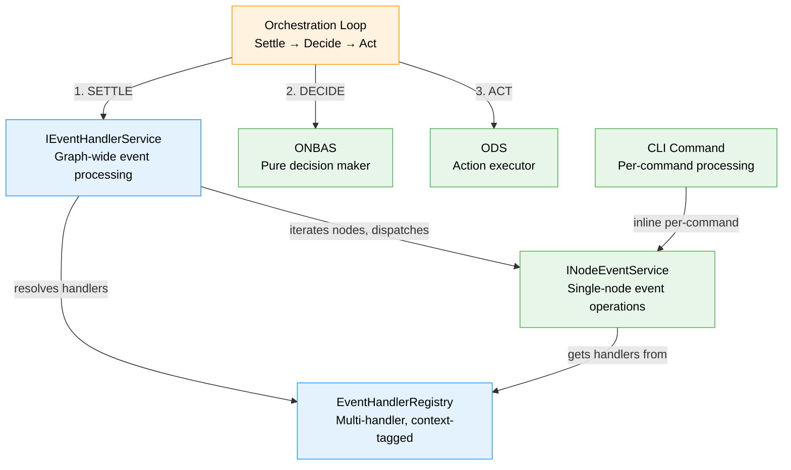
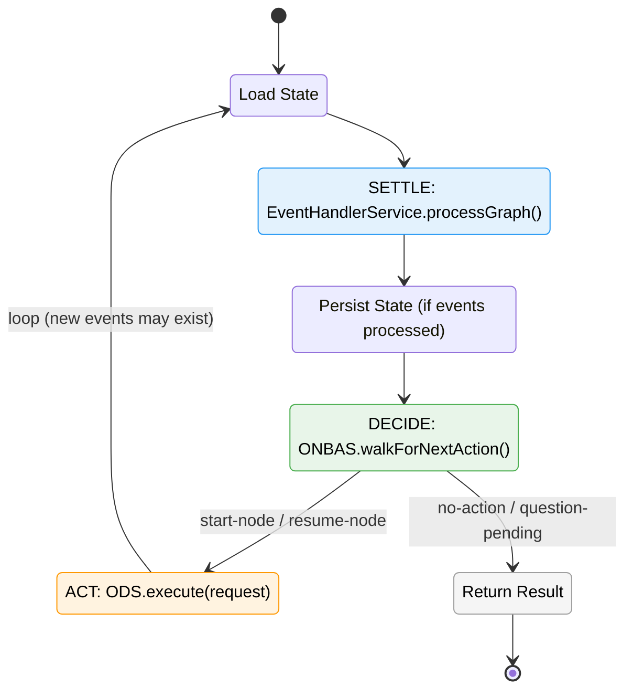
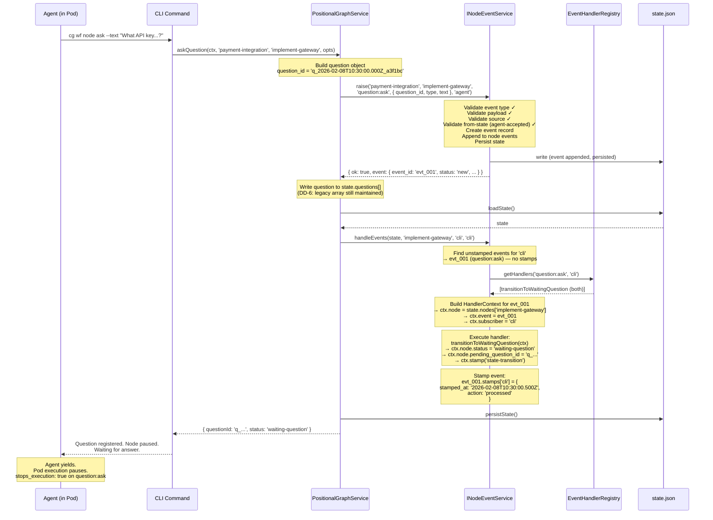
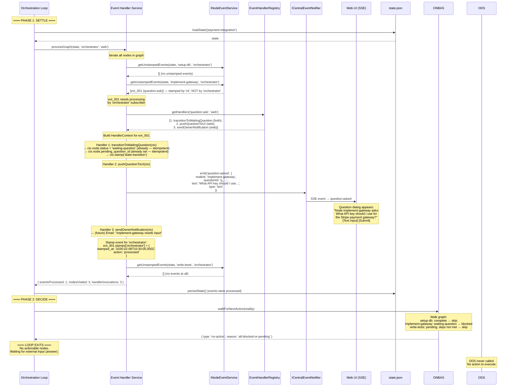
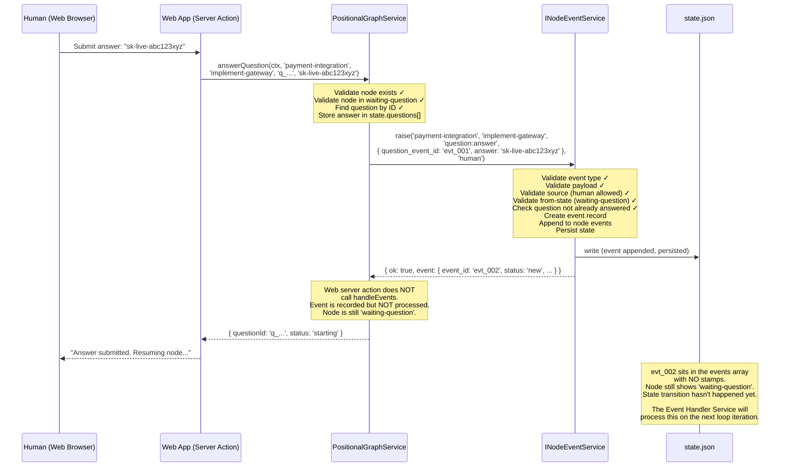
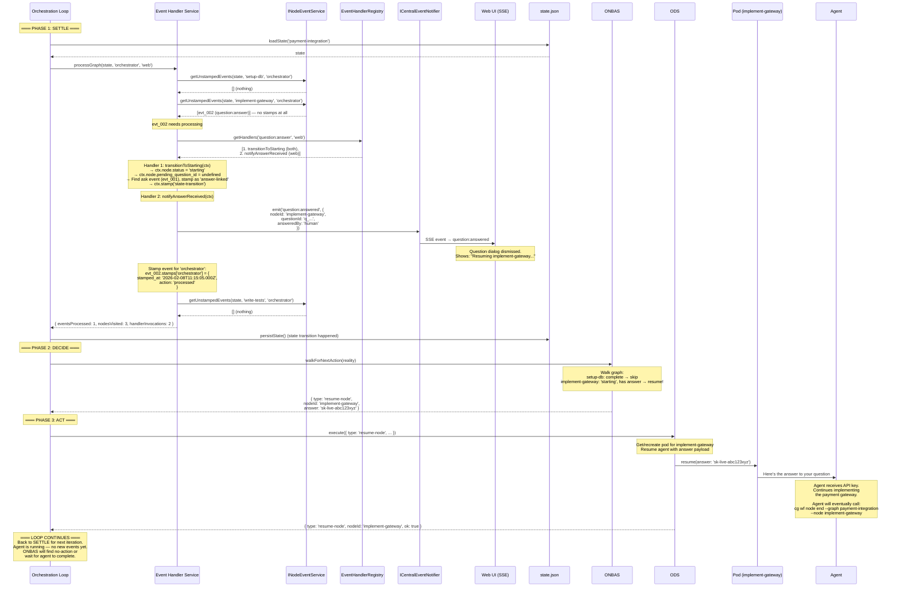
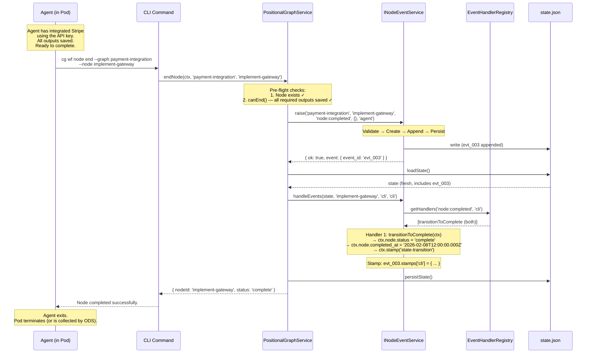
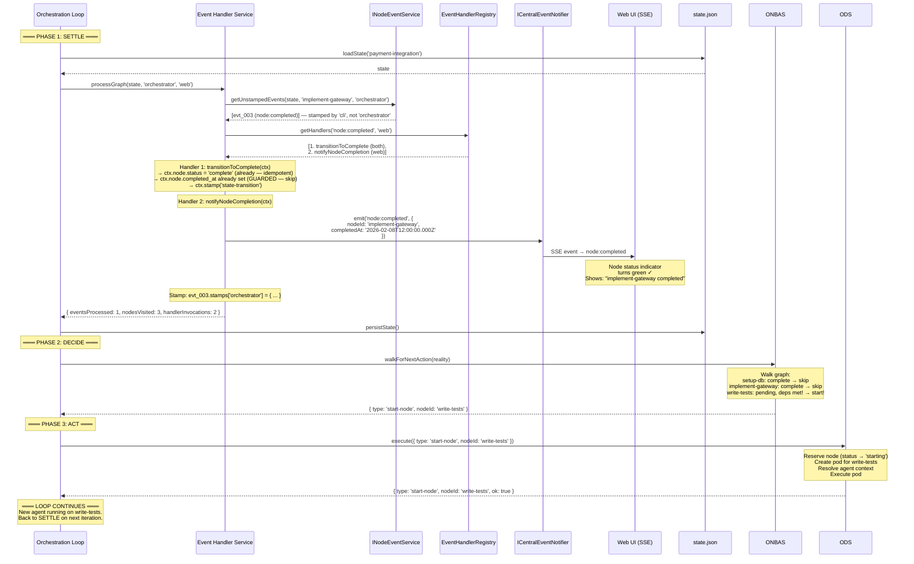

# Workshop: Event Processing in the Orchestration Loop

**Type**: Integration Pattern / Mental Model Alignment
**Plan**: 032-node-event-system
**Spec**: [node-event-system-spec.md](../node-event-system-spec.md)
**Created**: 2026-02-08
**Status**: Draft

**Related Documents**:
- [Workshop 06: raiseEvent/handleEvents Separation](./06-inline-handlers-and-subscriber-stamps.md) — Subscriber stamps, CLI vs ODS handlers
- [Workshop 09: INodeEventService](./09-first-class-node-event-service.md) — Service interface
- [Plan 030 Workshop 05: ONBAS](../../030-positional-orchestrator/workshops/05-onbas.md) — Graph walker, pure decisions
- [Plan 030 Workshop 07: Orchestration Entry Point](../../030-positional-orchestrator/workshops/07-orchestration-entry-point.md) — The loop
- [Plan 030 Workshop 08: ODS Handover](../../030-positional-orchestrator/workshops/08-ods-orchestrator-agent-handover.md) — Pod lifecycle
- [ADR-0010: Central Domain Event Notification Architecture](../../../../adr/adr-0010-central-domain-event-notification-architecture.md) — SSE notifications
- [ADR-0011: First-Class Domain Concepts Over Diffuse Functions](../../../../adr/adr-0011-first-class-domain-concepts.md) — Service elevation criteria

---

## Purpose

Align mental models on **what event handlers actually are**, how they differ from the systems that invoke them, and how event processing works across CLI (stateless) and web/orchestrator (long-lived) contexts. This workshop establishes the conceptual architecture so Phase 5's handler registration model doesn't paint us into a corner.

**Three core realizations**:

1. **Handlers are behaviors, not systems.** A handler is a function that reacts to an event — state transition, UI notification, analytics, terminal display. Multiple handlers fire for the same event. The systems that invoke handlers (CLI, orchestration loop) are execution contexts, not handlers.

2. **Event processing is a first-class concept.** Processing events across a graph — iterating nodes, finding unprocessed events, dispatching to registered handlers, stamping — is its own responsibility. It is not ODS. It is not ONBAS. It is the **Event Handler Service** (or Event Processing Service).

3. **The orchestration loop has three phases: Settle → Decide → Act.** The Event Handler Service settles the graph (processes all pending events). ONBAS decides what to do next. ODS executes the decision. These are distinct concerns with distinct owners.

## Key Questions Addressed

- Q1: What is an event handler, really?
- Q2: How do handlers differ from the systems that invoke them?
- Q3: Can multiple handlers fire for the same event type?
- Q4: How do handlers declare which contexts they run in?
- Q5: What is the Event Handler Service and why is it first-class?
- Q6: Who calls event processing in the server orchestration loop?
- Q7: What does the full lifecycle look like end-to-end?
- Q8: Does this change Phase 5's INodeEventService design?

---

## Part 1: What Is an Event Handler?

### The Wrong Mental Model

Phase 4 has one handler per event type in a flat map:

```typescript
Map<string, EventHandler>
  'node:completed' → handleNodeCompleted   // sets status, timestamp
  'question:ask'   → handleQuestionAsk     // sets pending_question_id
```

This makes it look like "handler = state transition function." But that's just what the current CLI-only implementation needs. It's not what handlers ARE.

### The Right Mental Model

An **event handler** is any function that **reacts to an event and does something meaningful**. Multiple handlers can react to the same event. Each handler has a single responsibility.

#### Example: What Happens When `question:ask` Fires

```
Event: question:ask
  │
  ├─ Handler 1: transitionToWaitingQuestion      [context: both]
  │    → node.status = 'waiting-question'
  │    → node.pending_question_id = question_id
  │    → ctx.stamp('state-transition')
  │
  └─ (future web-only handlers registered here — notifications, etc.)
```

#### Example: What Happens When `question:answer` Fires

```
Event: question:answer
  │
  ├─ Handler 1: transitionToStarting              [context: both]
  │    → node.status = 'starting'
  │    → node.pending_question_id = undefined
  │    → Find & stamp original ask event ('answer-linked')
  │    → ctx.stamp('state-transition')
  │
  └─ (future web-only handlers registered here — notifications, etc.)
```

#### Example: What Happens When `node:completed` Fires

```
Event: node:completed
  │
  ├─ Handler 1: transitionToComplete              [context: both]
  │    → node.status = 'complete'
  │    → node.completed_at = now (guarded: only if not already set)
  │    → ctx.stamp('state-transition')
  │
  └─ (future web-only handlers registered here — notifications, etc.)
```

**Note**: There is no `checkGraphCompletion` handler. Graph completion is not an event — it's the absence of work. ONBAS returns `no-action` when all nodes are complete or blocked. The orchestration loop exits. Handlers do not make orchestration decisions.

### What Handlers Do NOT Do

Handlers are thin reactions. They do not make orchestration decisions or contain business logic that belongs elsewhere:

| Don't put this in a handler | It belongs in... | Why |
|---|---|---|
| Check if graph is "complete" | ONBAS (`no-action` return) | Graph completion is absence of work, not an event. ONBAS already does this. |
| Decide which node to start next | ONBAS (`start-node` return) | That's the graph walk algorithm. |
| Start or resume pods | ODS | Side-effect execution is ODS's job. |
| Check if downstream nodes are unblocked | ONBAS | ONBAS evaluates readiness on every walk. |
| Complex validation of state consistency | `raiseEvent` validation pipeline | Validation happens before the event is recorded, not when it's handled. |

Handlers should be **2-5 lines of business logic** (ADR-0011 POS-004): set a status, set a timestamp, stamp the event, maybe emit a notification. If a handler needs to load state, query other nodes, or make decisions, it's doing too much.

### The Three Orthogonal Concerns

| Concept | What It Is | Examples |
|---------|-----------|---------|
| **Event handler** | A function that reacts to an event and does meaningful work | State transition, UI push, email notification, terminal display, analytics logging |
| **Execution context** | The environment that invokes event processing | CLI command (`'cli'`), orchestration loop settle phase (`'web'`) |
| **Subscriber** | The identity that stamps events as "I have dispatched this to handlers" | `'cli'`, `'orchestrator'` |

Handlers are **behaviors**. Contexts are **environments**. Subscribers are **identities**. These are three orthogonal concerns that must not be conflated.

---

## Part 2: Handler Registration Model

### Multi-Handler Per Event Type with Context Tags

```typescript
type EventHandlerContextTag = 'cli' | 'web' | 'both';

interface EventHandlerRegistration {
  readonly eventType: string;
  readonly handler: EventHandler;          // (ctx: HandlerContext) => void
  readonly context: EventHandlerContextTag;
  readonly name: string;                   // For debugging/logging
}
```

### The Registry

```typescript
interface IEventHandlerRegistry {
  /** Register a handler for an event type with context affinity. */
  on(
    eventType: string,
    handler: EventHandler,
    options: { context: EventHandlerContextTag; name: string }
  ): void;

  /** Get all handlers for an event type, filtered by execution context. */
  getHandlers(eventType: string, context: 'cli' | 'web'): EventHandlerRegistration[];
}
```

### Handler Resolution Logic

When `getHandlers('question:ask', 'web')` is called:
- Returns handlers where `context === 'both'` OR `context === 'web'`
- Excludes handlers where `context === 'cli'`
- Returns in registration order (state transitions first, side-effects after)

When `getHandlers('question:ask', 'cli')` is called:
- Returns handlers where `context === 'both'` OR `context === 'cli'`
- Excludes handlers where `context === 'web'`

### Registration: Full Example

```typescript
function createEventHandlerRegistry(): EventHandlerRegistry {
  const registry = new EventHandlerRegistry();

  // ── State transitions (run in ALL contexts) ────────────────────
  // These MUST be registered first — they set the state that
  // subsequent handlers may reference.

  registry.on('node:accepted',   transitionToAgentAccepted,   { context: 'both', name: 'transitionToAgentAccepted' });
  registry.on('node:completed',  transitionToComplete,        { context: 'both', name: 'transitionToComplete' });
  registry.on('node:error',      transitionToBlockedError,    { context: 'both', name: 'transitionToBlockedError' });
  registry.on('question:ask',    transitionToWaitingQuestion, { context: 'both', name: 'transitionToWaitingQuestion' });
  registry.on('question:answer', transitionToStarting,        { context: 'both', name: 'transitionToStarting' });
  registry.on('progress:update', recordProgress,              { context: 'both', name: 'recordProgress' });

  // ── Web-specific handlers (run only in web/server context) ─────
  // These react to events with side-effects: notifications, UI
  // updates, analytics. They run AFTER state transitions.

  // (Future — not Phase 5 scope, but the model supports them)
  // registry.on('question:ask',    pushQuestionToUI,          { context: 'web', name: 'pushQuestionToUI' });
  // registry.on('question:ask',    sendOwnerNotification,     { context: 'web', name: 'sendOwnerNotification' });
  // registry.on('question:answer', notifyAnswerReceived,      { context: 'web', name: 'notifyAnswerReceived' });
  // registry.on('node:completed',  notifyNodeCompletion,      { context: 'web', name: 'notifyNodeCompletion' });
  // registry.on('node:error',      alertOnError,              { context: 'web', name: 'alertOnError' });

  // ── CLI-specific handlers (run only in CLI context) ────────────
  // (Future — not Phase 5 scope)
  // registry.on('question:ask',    displayQuestionInTerminal, { context: 'cli', name: 'displayQuestionInTerminal' });
  // registry.on('node:completed',  printCompletionMessage,    { context: 'cli', name: 'printCompletionMessage' });
  // registry.on('node:error',      printErrorToStderr,        { context: 'cli', name: 'printErrorToStderr' });

  return registry;
}
```

### What Changes From Phase 4

| Aspect | Phase 4 (Current) | After This Workshop |
|--------|-------------------|---------------------|
| Handlers per event type | 1 | Multiple (ordered by registration) |
| Handler storage | `Map<string, EventHandler>` | `EventHandlerRegistry` with context tags |
| Context awareness | None | `'cli' \| 'web' \| 'both'` per handler |
| `handleEvents` call | `(state, nodeId, subscriber)` | `(state, nodeId, subscriber, context)` |
| Registration | `handlers.set('node:completed', fn)` | `registry.on('node:completed', fn, { context, name })` |
| Handler execution | Single function call | Loop over matching registrations |

---

## Part 3: The Event Handler Service (First-Class Concept)

### Why It's a Service, Not a Loop Step

The Event Handler Service processes events across a graph. It:

1. **Iterates all nodes** in the graph
2. **Finds unprocessed events** for a given subscriber
3. **Resolves handlers** from the registry filtered by context
4. **Dispatches events to handlers** (builds HandlerContext, invokes each handler)
5. **Stamps events** after processing
6. **(Future)** Maintains an in-memory cache of dispatched events to avoid redundant work

This meets ADR-0011's litmus test:
- Multiple operations (iterate, resolve, dispatch, stamp, cache)
- Multiple callers (orchestration loop, tests, potentially CLI batch)
- Named concept in domain language ("the event processing service")
- Will grow (caching, ordering, batching, error handling for side-effect handlers)
- Crosses multiple concerns (registry, state, stamps, dispatching)

> "If I'm explaining this concept to a new developer, do I say 'write a for loop over the nodes' or 'use the event handler service'?"

### Interface (Conceptual — Future Plan, Not Phase 5)

```typescript
interface IEventHandlerService {
  /**
   * Process all pending events on all nodes in the graph.
   * Iterates nodes, finds unstamped events, dispatches to registered
   * handlers filtered by context, stamps events.
   *
   * Mutates state in-place. Caller persists.
   */
  processGraph(
    state: State,
    subscriber: string,
    context: 'cli' | 'web'
  ): ProcessGraphResult;
}

interface ProcessGraphResult {
  readonly eventsProcessed: number;
  readonly nodesVisited: number;
  readonly handlerInvocations: number;
}
```

### Relationship to INodeEventService

The Event Handler Service is **not** the same as `INodeEventService`. They have distinct responsibilities:

| Service | Responsibility | Scope |
|---------|---------------|-------|
| `INodeEventService` | Single-node event operations: raise, handleEvents, query, stamp | One node at a time |
| `IEventHandlerService` | Graph-wide event processing: iterate nodes, dispatch to handlers | All nodes in a graph |

The Event Handler Service *uses* `INodeEventService` internally:

```
IEventHandlerService.processGraph(state, 'orchestrator', 'web')
  │
  ├─ for each nodeId in state.nodes:
  │    │
  │    ├─ eventService.getUnstampedEvents(state, nodeId, 'orchestrator')
  │    │    → returns events this subscriber hasn't processed
  │    │
  │    ├─ for each unstamped event:
  │    │    │
  │    │    ├─ registry.getHandlers(event.event_type, 'web')
  │    │    │    → returns [transitionHandler, notificationHandler, ...]
  │    │    │
  │    │    ├─ build HandlerContext for this event
  │    │    │
  │    │    ├─ for each handler: handler(ctx)
  │    │    │
  │    │    └─ eventService.stamp(event, 'orchestrator', 'processed')
  │    │
  │    └─ (next node)
  │
  └─ return { eventsProcessed, nodesVisited, handlerInvocations }
```

### System Map



---

## Part 4: The Three-Phase Orchestration Loop

### Overview

```
┌─────────────────────────────────────────────────────────────────┐
│                      ORCHESTRATION LOOP                          │
│                                                                 │
│  ┌───────────────┐   ┌───────────────┐   ┌───────────────┐     │
│  │    SETTLE     │   │    DECIDE     │   │     ACT       │     │
│  │               │   │               │   │               │     │
│  │  Event        │   │    ONBAS      │   │     ODS       │     │
│  │  Handler      │ → │    walks      │ → │   executes    │ → ↻ │
│  │  Service      │   │    graph      │   │   action      │     │
│  │  processes    │   │    finds next │   │   (pods,      │     │
│  │  all pending  │   │    best       │   │    handshake) │     │
│  │  events       │   │    action     │   │               │     │
│  └───────────────┘   └───────────────┘   └───────────────┘     │
│                                                                 │
└─────────────────────────────────────────────────────────────────┘
```

### State Diagram: Loop Control Flow



### Pseudocode

```typescript
// IGraphOrchestration.run() — Plan 030 Phase 7
async run(): Promise<OrchestrationRunResult> {
  const actions: OrchestrationAction[] = [];

  while (true) {
    // ── 1. SETTLE ──────────────────────────────────────
    // Event Handler Service processes ALL pending events
    // on ALL nodes. State transitions happen here.
    // Web-specific handlers (notifications) also fire here.
    const state = await this.loadState(this.graphSlug);
    const settleResult = this.eventHandlerService.processGraph(
      state, 'orchestrator', 'web'
    );
    if (settleResult.eventsProcessed > 0) {
      await this.persistState(this.graphSlug, state);
    }

    // ── 2. DECIDE ──────────────────────────────────────
    // ONBAS reads clean, settled state.
    // Pure function: no side effects, no mutations.
    const reality = this.buildReality(state);
    const request = this.onbas.walkForNextAction(reality);

    if (request.type === 'no-action' || request.type === 'question-pending') {
      return { actions, finalRequest: request };
    }

    // ── 3. ACT ─────────────────────────────────────────
    // ODS executes ONBAS's decision.
    // May start pods, resume agents. Does NOT process events.
    const actionResult = await this.ods.execute(request);
    actions.push(actionResult);

    // Loop — next iteration will settle any events
    // raised by the action (agent acceptance, completion, etc.)
  }
}
```

---

## Part 5: Full Roleplay — Question/Answer Lifecycle

### The Scenario

Graph `"payment-integration"` has three nodes:
- `setup-db` — complete
- `implement-gateway` — running (agent-accepted), agent is working
- `write-tests` — pending (depends on implement-gateway)

The agent working on `implement-gateway` needs to ask the human a question about which API key to use.

### Act 1: Agent Asks a Question

The agent, running inside a pod, executes a CLI command:

```bash
cg wf node ask --graph payment-integration --node implement-gateway \
  --type text --text "What API key should I use for the Stripe payment gateway?"
```



#### State After Act 1

```json
{
  "nodes": {
    "implement-gateway": {
      "status": "waiting-question",
      "pending_question_id": "q_2026-02-08T10:30:00.000Z_a3f1bc",
      "events": [
        {
          "event_id": "evt_001",
          "event_type": "question:ask",
          "source": "agent",
          "payload": {
            "question_id": "q_2026-02-08T10:30:00.000Z_a3f1bc",
            "type": "text",
            "text": "What API key should I use for the Stripe payment gateway?"
          },
          "status": "new",
          "stops_execution": true,
          "created_at": "2026-02-08T10:30:00.000Z",
          "stamps": {
            "cli": {
              "stamped_at": "2026-02-08T10:30:00.500Z",
              "action": "processed"
            }
          }
        }
      ]
    }
  }
}
```

Note: The event is stamped by `'cli'` but NOT yet by `'orchestrator'`. The web-specific handlers (push question to UI) have NOT fired yet.

---

### Act 2: Server Event Handler Service Processes the Graph

The orchestration loop runs (triggered by pod yielding or periodic tick). The Event Handler Service is the first phase.



#### State After Act 2

```json
{
  "nodes": {
    "implement-gateway": {
      "status": "waiting-question",
      "pending_question_id": "q_2026-02-08T10:30:00.000Z_a3f1bc",
      "events": [
        {
          "event_id": "evt_001",
          "event_type": "question:ask",
          "stamps": {
            "cli": {
              "stamped_at": "2026-02-08T10:30:00.500Z",
              "action": "processed"
            },
            "orchestrator": {
              "stamped_at": "2026-02-08T10:30:05.000Z",
              "action": "processed"
            }
          }
        }
      ]
    }
  }
}
```

Note: Event now has stamps from BOTH subscribers. The state transition was idempotent (no harm from double-processing). The web-specific handlers (push to UI, notification) fired only in the orchestrator's pass — they were `context: 'web'` and didn't run in the CLI pass.

---

### Act 3: Human Answers the Question

The human sees the question in the web UI and types their answer.



#### State After Act 3

```json
{
  "nodes": {
    "implement-gateway": {
      "status": "waiting-question",
      "pending_question_id": "q_2026-02-08T10:30:00.000Z_a3f1bc",
      "events": [
        {
          "event_id": "evt_001",
          "event_type": "question:ask",
          "stamps": { "cli": { "..." }, "orchestrator": { "..." } }
        },
        {
          "event_id": "evt_002",
          "event_type": "question:answer",
          "source": "human",
          "payload": {
            "question_event_id": "evt_001",
            "answer": "sk-live-abc123xyz"
          },
          "status": "new",
          "stops_execution": false,
          "created_at": "2026-02-08T11:15:00.000Z",
          "stamps": {}
        }
      ]
    }
  }
}
```

Note: `evt_002` has **no stamps**. Nobody has processed it. The node is still `'waiting-question'`. The state transition to `'starting'` hasn't happened. This is by design — the web server action only records, it does not process.

---

### Act 4: Event Handler Service Processes the Answer

The orchestration loop runs again (triggered by state change detection — the answer was persisted).



#### State After Act 4 (Settle + Decide + Act)

```json
{
  "nodes": {
    "implement-gateway": {
      "status": "starting",
      "pending_question_id": null,
      "events": [
        {
          "event_id": "evt_001",
          "event_type": "question:ask",
          "stamps": {
            "cli": { "stamped_at": "...", "action": "processed" },
            "orchestrator": { "stamped_at": "...", "action": "processed" }
          }
        },
        {
          "event_id": "evt_002",
          "event_type": "question:answer",
          "source": "human",
          "payload": { "question_event_id": "evt_001", "answer": "sk-live-abc123xyz" },
          "stamps": {
            "orchestrator": { "stamped_at": "2026-02-08T11:15:05.000Z", "action": "processed" }
          }
        }
      ]
    }
  }
}
```

Note: `evt_002` only has an `'orchestrator'` stamp — no `'cli'` stamp. This event was raised from the web, not CLI. The CLI never processed it. This is correct.

---

### Act 5: Agent Completes the Node

The agent finishes its work and calls end from inside the pod.



---

### Act 6: Event Handler Service Settles, ONBAS Advances the Graph

The orchestration loop runs after the pod exits.



---

### Complete Event Flow — All Six Acts

```mermaid
stateDiagram-v2
    classDef agent fill:#E3F2FD,stroke:#2196F3,color:#000
    classDef server fill:#FFF3E0,stroke:#FF9800,color:#000
    classDef human fill:#E8F5E9,stroke:#4CAF50,color:#000
    classDef system fill:#F5F5F5,stroke:#9E9E9E,color:#000

    state "Act 1: Agent Asks Question" as A1
    state "Act 2: EHS Processes (question:ask)" as A2
    state "Act 3: Human Answers" as A3
    state "Act 4: EHS Processes (question:answer)" as A4
    state "Act 5: Agent Completes Node" as A5
    state "Act 6: EHS Processes (node:completed)" as A6

    state A1 {
        [*] --> CLI_ask: Agent: cg wf node ask
        CLI_ask --> raise_ask: raise('question:ask')
        raise_ask --> handle_cli: handleEvents('cli', 'cli')
        handle_cli --> transition_wq: node → waiting-question
        transition_wq --> agent_yields: Agent yields (stops_execution)
    }

    state A2 {
        [*] --> ehs_settle1: EHS.processGraph('orchestrator', 'web')
        ehs_settle1 --> find_ask: getUnstampedEvents → evt_001
        find_ask --> run_handlers1: Run handlers (web context)
        run_handlers1 --> idempotent1: transitionToWaitingQuestion (idempotent)
        idempotent1 --> push_q: pushQuestionToUI → SSE to browser
        push_q --> stamp_orch1: stamp as 'orchestrator'
        stamp_orch1 --> onbas1: ONBAS → no-action (blocked)
    }

    state A3 {
        [*] --> human_answer: Human submits answer in web UI
        human_answer --> raise_answer: raise('question:answer')
        raise_answer --> no_handle: No handleEvents (web only records)
        no_handle --> waiting: Event sits unprocessed
    }

    state A4 {
        [*] --> ehs_settle2: EHS.processGraph('orchestrator', 'web')
        ehs_settle2 --> find_answer: getUnstampedEvents → evt_002
        find_answer --> run_handlers2: Run handlers (web context)
        run_handlers2 --> transition_starting: transitionToStarting → 'starting'
        transition_starting --> notify_answer: notifyAnswerReceived → SSE
        notify_answer --> stamp_orch2: stamp as 'orchestrator'
        stamp_orch2 --> onbas2: ONBAS → resume-node
        onbas2 --> ods_resume: ODS resumes pod with answer
    }

    state A5 {
        [*] --> CLI_end: Agent: cg wf node end
        CLI_end --> raise_complete: raise('node:completed')
        raise_complete --> handle_cli2: handleEvents('cli', 'cli')
        handle_cli2 --> transition_complete: node → complete
        transition_complete --> agent_exits: Agent exits, pod terminates
    }

    state A6 {
        [*] --> ehs_settle3: EHS.processGraph('orchestrator', 'web')
        ehs_settle3 --> find_complete: getUnstampedEvents → evt_003
        find_complete --> run_handlers3: Run handlers (web context)
        run_handlers3 --> idempotent2: transitionToComplete (idempotent)
        idempotent2 --> notify_complete: notifyNodeCompletion → SSE
        notify_complete --> stamp_orch3: stamp as 'orchestrator'
        stamp_orch3 --> onbas3: ONBAS → start-node (write-tests)
        onbas3 --> ods_start: ODS starts new pod for write-tests
    }

    A1 --> A2: server loop runs
    A2 --> A3: human sees question
    A3 --> A4: server loop runs
    A4 --> A5: agent resumes, works, finishes
    A5 --> A6: server loop runs

    class A1,A5 agent
    class A2,A4,A6 server
    class A3 human
```



---

## Part 6: The Double-Stamping Pattern

### Why It's Correct, Not a Bug

Events raised by CLI commands get stamped by `'cli'` immediately. When the Event Handler Service processes the graph, it stamps them again as `'orchestrator'`. This is correct because:

1. **State transition handlers are idempotent.** Setting `status = 'complete'` when it's already `'complete'` is a no-op. Guarded timestamps (`if (!node.completed_at)`) prevent overwrites.

2. **Web-specific handlers NEED to run.** The CLI doesn't push notifications to the web UI. The orchestrator's pass fires `notifyNodeCompletion`, `pushQuestionToUI`, etc. These only exist in `context: 'web'` and never ran during the CLI pass.

3. **The audit trail is valuable.** Two stamps prove that both contexts processed the event:
   ```
   stamps: {
     "cli": { "stamped_at": "T10:30:00", "action": "processed" },
     "orchestrator": { "stamped_at": "T10:30:05", "action": "processed" }
   }
   ```

4. **Events from web have no CLI stamp.** When the human answers via web UI, the event only gets an `'orchestrator'` stamp. No double-processing occurs.

### When Double-Processing Happens

| Event Source | CLI Stamp? | Orchestrator Stamp? | Double-Processed? |
|-------------|-----------|--------------------|--------------------|
| Agent via CLI (in pod) | Yes — inline | Yes — settle phase | Yes (idempotent + web handlers fire) |
| Human via Web UI | No | Yes — settle phase | No |
| External API | No | Yes — settle phase | No |

Double-processing only occurs for events raised via CLI. It's the price of running web-specific handlers (notifications, UI pushes) — and it's a feature, not a cost.

---

## Part 7: Workshop 06 Overrides

This workshop overrides the following Workshop 06 decisions:

| Workshop 06 Decision | Override | Rationale |
|---------------------|----------|-----------|
| ODS calls `handleEvents('ods')` with ODS-specific handlers | ODS does NOT process events. Event Handler Service processes graph before ONBAS. | Separates event processing from orchestration execution. ODS acts on ONBAS decisions, not on events. |
| Two handler maps (CLI handlers, ODS handlers) | One handler registry with context tags (`'cli'`, `'web'`, `'both'`). Multiple handlers per event type. | Handlers are behaviors, not tied to who invokes them. A `question:ask` might need state transition + notification + analytics — these are separate handlers, not one monolithic function. |
| `'ods'` subscriber name | `'orchestrator'` subscriber in Event Handler Service | ODS doesn't process events. The Event Handler Service does, using subscriber name `'orchestrator'`. |
| `Map<string, EventHandler>` (one handler per type) | `EventHandlerRegistry` (multiple handlers per type, context-tagged, ordered) | Real-world events trigger multiple reactions. One handler per type forces monolithic handler functions. |
| `handleEvents(state, nodeId, subscriber)` | `handleEvents(state, nodeId, subscriber, context)` | Context determines which handlers fire. CLI context skips web-only handlers and vice versa. |

These overrides do **NOT** change:

| Workshop 06 Decision | Status |
|---------------------|--------|
| raiseEvent is record-only (no handler invocation) | **Unchanged** |
| handleEvents is node-scoped | **Unchanged** |
| Subscriber stamps model (`stamps: Record<string, EventStamp>`) | **Unchanged** |
| CLI calls handleEvents per command (inline, immediate) | **Unchanged** (now also passes context: `'cli'`) |
| handleEvents mutates in-place, caller persists | **Unchanged** |
| ONBAS is read-only (no stamps, no mutations) | **Unchanged** |
| raise() persists internally, handleEvents() caller persists | **Unchanged** |

---

## Part 8: Impact on Phase 5 Design

### What Changes for Phase 5

| Aspect | Original Phase 5 Design | After This Workshop |
|--------|------------------------|---------------------|
| Handler storage | `Map<string, EventHandler>` passed to `NodeEventService` | `EventHandlerRegistry` (or `IEventHandlerRegistry`) passed to `NodeEventService` |
| Handlers per event | 1 | Multiple (ordered by registration) |
| `handleEvents` signature | `(state, nodeId, subscriber)` | `(state, nodeId, subscriber, context)` |
| Handler context | None | `'cli' \| 'web' \| 'both'` tag on each registration |
| Handler registration | `createEventHandlers()` returns `Map` | `createEventHandlerRegistry()` returns registry |

### What Does NOT Change for Phase 5

- `INodeEventService` interface (just add `context` param to `handleEvents`)
- `raise()` — still record-only, persists internally
- `HandlerContext` — still provides `node`, `event`, `stamp()`, etc.
- Handler function signature — still `(ctx: HandlerContext) => void`
- Subscriber stamps model — unchanged
- `FakeNodeEventService` — still records calls

### Phase 5 Deliverables (Revised)

1. **`EventHandlerRegistry`** with `on()` and `getHandlers()` methods, context filtering
2. **All 6 handlers** register as `context: 'both'` (no CLI-only or web-only handlers yet)
3. **`handleEvents`** takes a `context` parameter and filters handlers through registry
4. **Guard timestamp writes** in handlers (idempotent for double-processing)
5. The model is **ready** for web-only handlers without retrofit

### What Is NOT Phase 5

- `IEventHandlerService` (graph-wide processing) — Plan 030 Phase 7
- Web-specific handlers (`pushQuestionToUI`, `notifyNodeCompletion`) — future
- CLI-specific handlers (`displayQuestionInTerminal`) — future
- In-memory event dispatch cache — future optimization

---

## Open Questions

### Q1: Should CLI stamp as 'cli' or 'orchestrator'?

**RESOLVED**: CLI stamps as `'cli'`. Orchestrator stamps as `'orchestrator'`. Double-processing is correct — web-specific handlers need to run even after CLI handled the state transition.

### Q2: What triggers the orchestration loop in the web process?

**OPEN (deferred to Plan 030 Phase 7)**: Options include API endpoint, domain event, polling, pod exit callback.

### Q3: Should EventHandlerRegistry have an interface + fake?

**OPEN**: It has multiple operations, will grow, and is a named concept. Likely meets ADR-0011 threshold. For Phase 5, it can start as a concrete class and be elevated when web handlers arrive.

### Q4: Handler execution order — state transitions before side-effects?

**RESOLVED**: Yes. Registration order is execution order. State transition handlers register first (`context: 'both'`), then web-specific handlers. State transition must happen before a notification handler reads `ctx.node.status`.

### Q5: What if a web-only handler fails?

**OPEN (deferred)**: Options: (a) run state transitions first in a separate pass, then side-effects in a second pass; (b) catch and log side-effect errors without propagating. Phase 5 only has `context: 'both'` handlers, so this is future scope.

### Q6: Should the Event Handler Service have in-memory caching?

**OPEN (deferred)**: Future optimization. On each processGraph call, it could track "last processed event index per node" in memory and skip already-dispatched events. This avoids re-reading the full events array. Not needed for Phase 5 or even Plan 030 Phase 7 initial implementation.

---

## Summary: Concept Map

```
┌──────────────────────────────────────────────────────────────────┐
│                        EVENT SYSTEM                              │
│                                                                  │
│  ┌─────────────────┐  ┌──────────────────────────────────────┐   │
│  │ INodeEventService│  │ EventHandlerRegistry                 │   │
│  │                  │  │                                      │   │
│  │ • raise()        │  │ 'question:ask':                      │   │
│  │ • handleEvents() │←─│   1. transitionToWaitingQ    [both]  │   │
│  │ • stamp()        │  │                                      │   │
│  │ • query methods  │  │ 'question:answer':                   │   │
│  └────────┬─────────┘  │   1. transitionToStarting    [both]  │   │
│           │             │                                      │   │
│           │             │ 'node:completed':                    │   │
│           │             │   1. transitionToComplete    [both]  │   │
│           │             │                                      │   │
│           │             │ (web-only handlers added later)      │   │
│           │             └──────────────────────────────────────┘   │
│           │                                                       │
└───────────┼───────────────────────────────────────────────────────┘
            │
    ┌───────┴───────────────────────────────────────────────────┐
    │                                                           │
    │  CONSUMERS                                                │
    │                                                           │
    │  ┌──────────────────┐  ┌──────────────────────────────┐   │
    │  │ CLI Command       │  │ IEventHandlerService          │   │
    │  │ (per-command)     │  │ (graph-wide, server loop)     │   │
    │  │                   │  │                                │   │
    │  │ raise()           │  │ processGraph(state,            │   │
    │  │ handleEvents(     │  │   'orchestrator', 'web')       │   │
    │  │   state, nodeId,  │  │                                │   │
    │  │   'cli', 'cli')   │  │ Iterates all nodes.            │   │
    │  │                   │  │ Dispatches to handlers.         │   │
    │  │ Immediate,        │  │ Stamps as 'orchestrator'.      │   │
    │  │ single node.      │  │                                │   │
    │  └──────────────────┘  └──────────────────────────────┘   │
    │                                                           │
    │  ┌──────────────────────────────────────────────────────┐ │
    │  │ Orchestration Loop (Settle → Decide → Act)            │ │
    │  │                                                        │ │
    │  │  SETTLE: IEventHandlerService.processGraph()           │ │
    │  │  DECIDE: ONBAS.walkForNextAction()                     │ │
    │  │  ACT:    ODS.execute()                                 │ │
    │  │                                                        │ │
    │  │  ODS does NOT process events.                          │ │
    │  │  ONBAS does NOT process events.                        │ │
    │  │  Only the Event Handler Service processes events.      │ │
    │  └──────────────────────────────────────────────────────┘ │
    │                                                           │
    └───────────────────────────────────────────────────────────┘
```

### One-Sentence Summary

**Event handlers are behaviors (not systems), multiple handlers fire per event type filtered by context, event processing is a first-class service separate from ODS, and the orchestration loop is Settle (process events) → Decide (ONBAS) → Act (ODS).**
