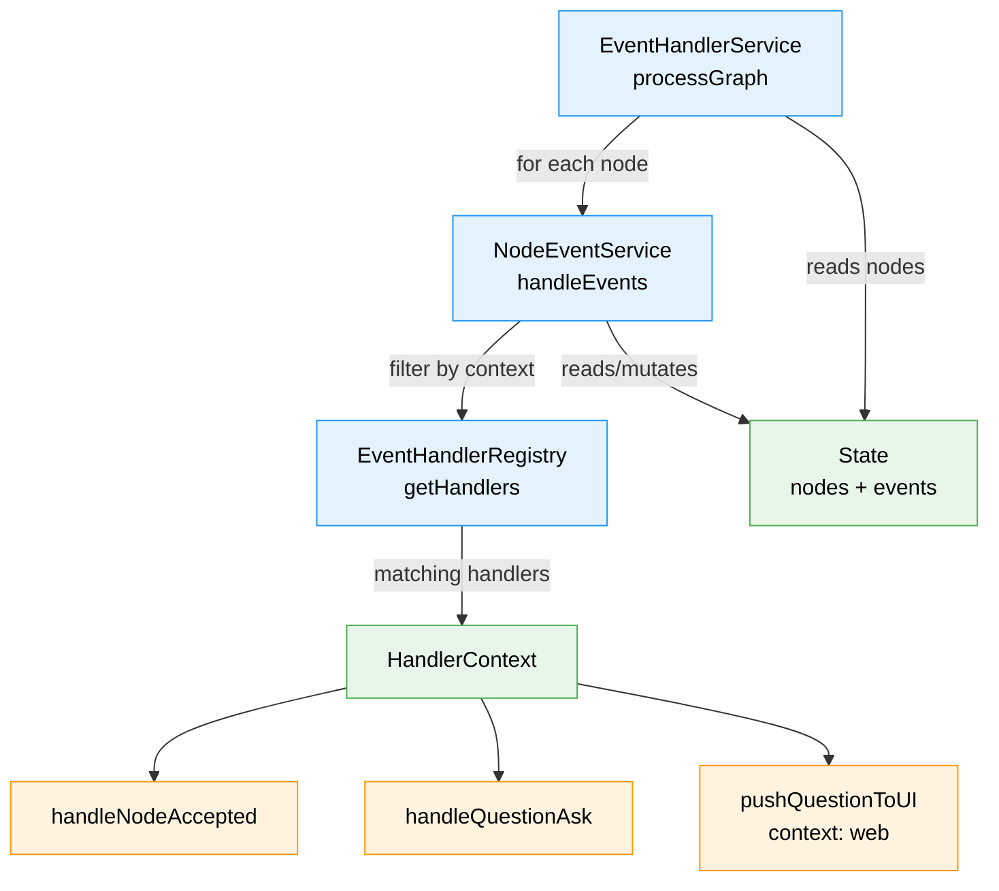

# Workshop: Testable IEventHandlerService Design

**Type**: Architecture / Testability Deep-Dive
**Plan**: 032-node-event-system
**Spec**: [node-event-system-spec.md](../node-event-system-spec.md)
**Created**: 2026-02-08
**Status**: Draft

**Related Documents**:
- [Workshop 11: IEventHandlerService and ONBAS Question Ownership](./11-ieventhandlerservice-and-onbas-question-ownership.md) — Phase 7 redesign, IEventHandlerService concept
- [Workshop 10: Event Processing in the Orchestration Loop](./10-event-processing-in-the-orchestration-loop.md) — Settle/Decide/Act, graph-wide processing
- [Workshop 06: Inline Handlers and Subscriber Stamps](./06-inline-handlers-and-subscriber-stamps.md) — Handler execution, stamp protocol
- [ADR-0004: Dependency Injection Container Architecture](../../../adr/adr-0004-dependency-injection-container-architecture.md) — useFactory, child containers, test isolation
- [ADR-0009: Module Registration Function Pattern](../../../adr/adr-0009-module-registration-function-pattern.md) — registerXxxServices pattern
- [ADR-0011: First-Class Domain Concepts Over Diffuse Functions](../../../adr/adr-0011-first-class-domain-concepts.md) — Service elevation, HandlerContext
- [Architecture Rules](../../../rules/architecture.md) — Interface-first, fakes over mocks, contract tests

---

## Purpose

Workshop 11 established that Phase 7 should build `IEventHandlerService` — the graph-wide event processor that constitutes the Settle phase of the orchestration loop. This workshop explores **how to make it maximally testable** by applying our established architectural patterns: interface-first development, adapter-pattern handlers with injectable fakes, and contract tests.

**The core insight**: IEventHandlerService is a *composition point*. It composes `INodeEventService` (per-node processing) with `EventHandlerRegistry` (handler dispatch). Both dependencies are injectable. This means we can test the real `EventHandlerService` with:

1. **FakeNodeEventService** — verify it orchestrates per-node calls correctly
2. **Fake handlers in a real EventHandlerRegistry** — verify handlers fire in the right order with the right context
3. **Real everything** — integration tests with real handlers, real NodeEventService, real state

Three levels of testing from one clean design.

## Key Questions Addressed

- Q1: What makes IEventHandlerService more testable than inline event processing?
- Q2: How do we inject fake handlers into the real EventHandlerService?
- Q3: What does FakeEventHandlerService look like?
- Q4: What contract tests ensure fake/real parity?
- Q5: How does the DI wiring work for production vs. test?
- Q6: What does a worked example of the full pipeline look like?

---

## Part 1: Why IEventHandlerService Is More Testable

### The Before: Inline Processing in PositionalGraphService

Today, event handling is invoked inline during CLI commands:

```
CLI command → service.raiseNodeEvent()
  → raiseEvent() (record + persist)
  → nodeEventService.handleEvents(state, nodeId, 'cli', 'cli')
  → done
```

Testing this requires wiring the full `PositionalGraphService` with all its dependencies (filesystem, path resolver, YAML parser, adapter, work unit loader). Want to test that a `question:ask` event fires the right handler? You need the entire service stack.

### The After: Separated Graph-Wide Processor

With IEventHandlerService as a standalone service:

```
EventHandlerService.processGraph(state, subscriber, context)
  → for each node: nodeEventService.handleEvents(state, nodeId, subscriber, context)
  → return { nodesVisited, eventsProcessed, handlerInvocations }
```

Testing this requires:
- An `INodeEventService` (real or fake)
- An `EventHandlerRegistry` (real registry with real or fake handlers)
- A `State` object (plain data, trivially constructible)

No filesystem. No path resolver. No YAML. No HTTP. Just logic.

### Three Testing Levels

| Level | NodeEventService | Handlers | What It Proves |
|-------|-----------------|----------|----------------|
| Unit (orchestration) | Fake | N/A (fake NES is a no-op) | EHS visits correct nodes, counts correctly, skips nodes with no unstamped events |
| Unit (handlers) | Real | Fake handlers in real registry | Handlers fire in order, receive correct HandlerContext, mutations apply to state |
| Integration | Real | Real handlers | Full pipeline: events raised → handlers fire → state mutated → stamps applied |

The first level is unique to IEventHandlerService — you can't test graph-walking orchestration logic without it. Today, that logic doesn't exist as a testable unit.

---

## Part 2: Interface-First Design

Following Constitution Principle 2 (interface-first) and ADR-0011 (first-class domain concepts):

### IEventHandlerService Interface

```typescript
// event-handler-service.interface.ts

export interface ProcessGraphResult {
  /** Number of nodes inspected (including those with no unstamped events) */
  readonly nodesVisited: number;
  /** Number of events that were unstamped and got processed */
  readonly eventsProcessed: number;
  /** Total handler invocations (events * handlers-per-event) */
  readonly handlerInvocations: number;
}

export interface IEventHandlerService {
  /**
   * Process all unhandled events for all nodes in the graph.
   *
   * Iterates every node in state.nodes, finds events not stamped by
   * the given subscriber, dispatches to registered handlers filtered
   * by context, stamps processed events.
   *
   * Caller is responsible for persisting state after this returns.
   */
  processGraph(
    state: State,
    subscriber: string,
    context: 'cli' | 'web'
  ): ProcessGraphResult;
}
```

This interface is deliberately minimal. One method, three parameters, one return type. It satisfies ADR-0011's "six signals for service elevation":

| Signal | IEventHandlerService |
|--------|---------------------|
| 3+ functions sharing parameters | processGraph wraps the node-iteration + handleEvents loop that would otherwise be repeated |
| Domain name exists | "Event Handler Service" — the Settle phase |
| Multiple callers | Orchestration loop (Plan 030), CLI `wf run` command, future web controller |
| Complex coordination | Iterates nodes, checks stamps, delegates to per-node service, aggregates results |
| Lifecycle management | Owns the graph-wide processing cycle |
| Tested as a unit | This workshop's entire point |

### Constructor Dependencies

```typescript
export interface EventHandlerServiceDeps {
  readonly nodeEventService: INodeEventService;
  readonly handlerRegistry: EventHandlerRegistry;
}
```

Two dependencies, both injectable:

1. **INodeEventService** — the per-node service built in Phase 5. Already has a fake (`FakeNodeEventService`). Interface-based, swappable.

2. **EventHandlerRegistry** — the handler dispatch mechanism built in Phase 4. A concrete class, but its handlers are registered at construction time. You control what handlers exist by controlling what you register.

This is the key testability insight: **you don't need a fake EventHandlerRegistry.** You need a real EventHandlerRegistry with fake handlers registered in it. The registry is just a Map — the handlers are the behavior.

---

## Part 3: Injectable Handler Pattern

### How Handlers Are Registered Today

```typescript
// createEventHandlerRegistry() — current factory
export function createEventHandlerRegistry(): EventHandlerRegistry {
  const registry = new EventHandlerRegistry();
  registry.on('node:accepted', handleNodeAccepted, { context: 'both', name: 'handleNodeAccepted' });
  registry.on('node:completed', handleNodeCompleted, { context: 'both', name: 'handleNodeCompleted' });
  registry.on('node:error', handleNodeError, { context: 'both', name: 'handleNodeError' });
  registry.on('question:ask', handleQuestionAsk, { context: 'both', name: 'handleQuestionAsk' });
  registry.on('question:answer', handleQuestionAnswer, { context: 'both', name: 'handleQuestionAnswer' });
  registry.on('progress:update', handleProgressUpdate, { context: 'both', name: 'handleProgressUpdate' });
  return registry;
}
```

All 6 handlers are registered with `context: 'both'`. They're concrete functions imported from `event-handlers.ts`. No injection point — you get all 6 or nothing.

### The Test Problem

Suppose you want to test that EventHandlerService correctly processes a `question:ask` event. If you use the production registry, `handleQuestionAsk` will fire and mutate `ctx.node.status` to `'waiting-question'`. That's the real behavior — but it couples your EHS orchestration test to the handler's implementation details.

What if you just want to verify: "EHS found the unstamped event, dispatched it to the handler, and counted it"?

### Solution: Spy Handlers

The handler type is `(ctx: HandlerContext) => void`. Any function matching that signature works. For tests, create simple spy functions:

```typescript
// In test setup
function createSpyHandler(): EventHandler & { calls: HandlerContext[] } {
  const calls: HandlerContext[] = [];
  const handler = (ctx: HandlerContext) => {
    calls.push(ctx);
  };
  handler.calls = calls;
  return handler;
}
```

Register spy handlers in a test registry:

```typescript
const spyAccepted = createSpyHandler();
const spyQuestion = createSpyHandler();

const testRegistry = new EventHandlerRegistry();
testRegistry.on('node:accepted', spyAccepted, { context: 'both', name: 'spy-accepted' });
testRegistry.on('question:ask', spyQuestion, { context: 'both', name: 'spy-question' });
```

Now pass this test registry to the real EventHandlerService:

```typescript
const ehs = new EventHandlerService({
  nodeEventService: realNodeEventService,  // or fake
  handlerRegistry: testRegistry,
});
```

The EHS processes events, dispatches to spy handlers, and you can assert on `spyQuestion.calls` to verify the handler was invoked with the correct context. No mocks. No vi.mock. Just functions.

### Why This Follows the Architecture

Per `docs/rules/architecture.md` — "Fakes over mocks: No `vi.mock` / `jest.mock` ever." Spy handlers aren't mocks. They're real functions that implement the `EventHandler` type signature. They just happen to record their invocations instead of mutating state. This is exactly the FakeLogger pattern — implement the interface, add test helpers.

Per ADR-0004 — constructor injection via `useFactory`. The EventHandlerService receives its dependencies at construction time. Tests construct with test dependencies. Production constructs with production dependencies. No runtime switching.

---

## Part 4: FakeEventHandlerService

For tests that use IEventHandlerService as a *dependency* (e.g., testing the orchestration loop), we need a fake. Following the established pattern from `FakeNodeEventService`:

```typescript
// fake-event-handler-service.ts

export interface ProcessGraphHistoryEntry {
  readonly subscriber: string;
  readonly context: 'cli' | 'web';
  readonly nodeCount: number;
}

export class FakeEventHandlerService implements IEventHandlerService {
  private history: ProcessGraphHistoryEntry[] = [];
  private nextResult: ProcessGraphResult = {
    nodesVisited: 0,
    eventsProcessed: 0,
    handlerInvocations: 0,
  };

  // ── Interface Implementation ──

  processGraph(
    state: State,
    subscriber: string,
    context: 'cli' | 'web'
  ): ProcessGraphResult {
    const nodeCount = Object.keys(state.nodes ?? {}).length;
    this.history.push({ subscriber, context, nodeCount });
    return this.nextResult;
  }

  // ── Test Helpers ──

  /** Pre-configure the result returned by processGraph */
  setResult(result: ProcessGraphResult): void {
    this.nextResult = result;
  }

  /** Get all processGraph calls */
  getHistory(): readonly ProcessGraphHistoryEntry[] {
    return [...this.history];
  }

  /** Reset all state */
  reset(): void {
    this.history = [];
    this.nextResult = {
      nodesVisited: 0,
      eventsProcessed: 0,
      handlerInvocations: 0,
    };
  }
}
```

Pattern alignment:

| FakeNodeEventService Pattern | FakeEventHandlerService |
|------------------------------|------------------------|
| `getRaiseHistory()` | `getHistory()` |
| `setRaiseError(key, result)` | `setResult(result)` |
| `reset()` | `reset()` |
| Records all calls | Records all `processGraph` calls |
| Pre-configurable responses | Pre-configurable result |

---

## Part 5: Contract Tests

Per Critical Discovery 08 and `docs/rules/architecture.md`, contract tests ensure fake/real parity. Both `FakeEventHandlerService` and `EventHandlerService` must pass the same behavioral tests.

### Contract Definition

```typescript
// test/contracts/event-handler-service.contract.ts

export function eventHandlerServiceContractTests(
  name: string,
  createService: () => IEventHandlerService,
  createState: () => State
) {
  describe(`${name} implements IEventHandlerService contract`, () => {
    it('returns zero counts for empty graph', () => {
      /*
      Test Doc:
      - Why: EHS must handle graphs with no nodes gracefully
      - Contract: processGraph returns all-zero counts for empty state
      - Usage Notes: Empty graph = state.nodes is {} or undefined
      - Quality Contribution: Catches null-iteration bugs
      - Worked Example: processGraph({nodes:{}}) → {nodesVisited:0, eventsProcessed:0, handlerInvocations:0}
      */
      const service = createService();
      const state = createState();
      state.nodes = {};

      const result = service.processGraph(state, 'test-subscriber', 'cli');

      expect(result.nodesVisited).toBe(0);
      expect(result.eventsProcessed).toBe(0);
      expect(result.handlerInvocations).toBe(0);
    });

    it('returns ProcessGraphResult with numeric counts', () => {
      /*
      Test Doc:
      - Why: All callers depend on ProcessGraphResult shape
      - Contract: processGraph returns object with nodesVisited, eventsProcessed, handlerInvocations
      - Usage Notes: All three fields are non-negative integers
      - Quality Contribution: Catches structural drift between fake and real
      - Worked Example: result.nodesVisited >= 0, result.eventsProcessed >= 0
      */
      const service = createService();
      const state = createState();

      const result = service.processGraph(state, 'subscriber', 'web');

      expect(typeof result.nodesVisited).toBe('number');
      expect(typeof result.eventsProcessed).toBe('number');
      expect(typeof result.handlerInvocations).toBe('number');
      expect(result.nodesVisited).toBeGreaterThanOrEqual(0);
      expect(result.eventsProcessed).toBeGreaterThanOrEqual(0);
      expect(result.handlerInvocations).toBeGreaterThanOrEqual(0);
    });
  });
}
```

### Contract Execution

```typescript
// test/contracts/event-handler-service.contract.test.ts

// Fake
eventHandlerServiceContractTests(
  'FakeEventHandlerService',
  () => new FakeEventHandlerService(),
  () => ({ /* minimal state */ } as State)
);

// Real
eventHandlerServiceContractTests(
  'EventHandlerService',
  () => {
    const registry = new EventHandlerRegistry();
    // Empty registry — contract tests verify structural behavior, not handler logic
    return new EventHandlerService({
      nodeEventService: new FakeNodeEventService(),
      handlerRegistry: registry,
    });
  },
  () => ({ /* minimal state */ } as State)
);
```

Note: The real EventHandlerService in contract tests uses `FakeNodeEventService`. That's fine — contract tests verify the *interface contract* (return shape, edge cases), not integration behavior. Integration tests verify the full stack.

---

## Part 6: DI Wiring

### Production Registration

Following ADR-0009's `registerXxxServices(container)` pattern:

```typescript
// In the 032-node-event-system feature's registration function

export function registerNodeEventServices(container: DependencyContainer): void {
  // INodeEventService — per-node event operations
  container.register(NODE_EVENT_DI_TOKENS.NODE_EVENT_SERVICE, {
    useFactory: (c) => {
      const registry = new NodeEventRegistry();
      registerCoreEventTypes(registry);
      const handlerRegistry = createEventHandlerRegistry();
      return new NodeEventService(
        {
          registry,
          loadState: (slug) => c.resolve(POSITIONAL_GRAPH_DI_TOKENS.ADAPTER).loadState(slug),
          persistState: (slug, state) => c.resolve(POSITIONAL_GRAPH_DI_TOKENS.ADAPTER).persistState(slug, state),
        },
        handlerRegistry
      );
    },
  });

  // IEventHandlerService — graph-wide event processing
  container.register(NODE_EVENT_DI_TOKENS.EVENT_HANDLER_SERVICE, {
    useFactory: (c) => {
      const nodeEventService = c.resolve(NODE_EVENT_DI_TOKENS.NODE_EVENT_SERVICE);
      const handlerRegistry = createEventHandlerRegistry();
      return new EventHandlerService({ nodeEventService, handlerRegistry });
    },
  });
}
```

Wait — there's a question here. Should `NodeEventService` and `EventHandlerService` share the same `EventHandlerRegistry` instance? Let's think about this.

`NodeEventService.handleEvents()` dispatches to handlers via its own `handlerRegistry`. `EventHandlerService.processGraph()` calls `nodeEventService.handleEvents()` — so the handlers come from whichever registry the `NodeEventService` was constructed with.

**Decision**: IEventHandlerService does NOT need its own `EventHandlerRegistry`. It delegates to `INodeEventService.handleEvents()`, which owns the registry. The EHS is purely an orchestration wrapper — it decides *which nodes* to process, not *how* to process them.

Revised constructor:

```typescript
export class EventHandlerService implements IEventHandlerService {
  constructor(
    private readonly nodeEventService: INodeEventService
  ) {}

  processGraph(state: State, subscriber: string, context: 'cli' | 'web'): ProcessGraphResult {
    let nodesVisited = 0;
    let eventsProcessed = 0;
    let handlerInvocations = 0;

    const nodes = state.nodes ?? {};
    for (const nodeId of Object.keys(nodes)) {
      nodesVisited++;

      const unstamped = this.nodeEventService.getUnstampedEvents(state, nodeId, subscriber);
      if (unstamped.length === 0) continue;

      eventsProcessed += unstamped.length;
      this.nodeEventService.handleEvents(state, nodeId, subscriber, context);

      // Handler invocations tracked per-event (actual count depends on registry,
      // but for diagnostics we count events dispatched)
      handlerInvocations += unstamped.length;
    }

    return { nodesVisited, eventsProcessed, handlerInvocations };
  }
}
```

One dependency. One interface. Maximum simplicity.

### Revised Production Registration

```typescript
export function registerNodeEventServices(container: DependencyContainer): void {
  container.register(NODE_EVENT_DI_TOKENS.NODE_EVENT_SERVICE, {
    useFactory: (c) => {
      const registry = new NodeEventRegistry();
      registerCoreEventTypes(registry);
      const handlerRegistry = createEventHandlerRegistry();
      return new NodeEventService(
        {
          registry,
          loadState: (slug) => /* ... */,
          persistState: (slug, state) => /* ... */,
        },
        handlerRegistry
      );
    },
  });

  container.register(NODE_EVENT_DI_TOKENS.EVENT_HANDLER_SERVICE, {
    useFactory: (c) => new EventHandlerService(
      c.resolve(NODE_EVENT_DI_TOKENS.NODE_EVENT_SERVICE)
    ),
  });
}
```

### Test Registration

```typescript
export function registerNodeEventTestServices(container: DependencyContainer): void {
  const fakeNodeEventService = new FakeNodeEventService();
  container.register(NODE_EVENT_DI_TOKENS.NODE_EVENT_SERVICE, {
    useFactory: () => fakeNodeEventService,
  });

  container.register(NODE_EVENT_DI_TOKENS.EVENT_HANDLER_SERVICE, {
    useFactory: () => new FakeEventHandlerService(),
  });
}
```

---

## Part 7: Testing the Real EventHandlerService with Fake Handlers

This is the powerful middle ground: run the **real** `EventHandlerService` with a **real** `NodeEventService` that has **spy handlers** registered instead of production handlers. This tests the full processing pipeline without production side effects.

### Setup Pattern

```typescript
describe('EventHandlerService with spy handlers', () => {
  let service: EventHandlerService;
  let nodeEventService: NodeEventService;
  let spyAccepted: EventHandler & { calls: HandlerContext[] };
  let spyQuestion: EventHandler & { calls: HandlerContext[] };

  beforeEach(() => {
    // 1. Create spy handlers
    spyAccepted = createSpyHandler();
    spyQuestion = createSpyHandler();

    // 2. Build registry with spy handlers (not production handlers)
    const handlerRegistry = new EventHandlerRegistry();
    handlerRegistry.on('node:accepted', spyAccepted, {
      context: 'both',
      name: 'spy-accepted',
    });
    handlerRegistry.on('question:ask', spyQuestion, {
      context: 'web',  // Only fires in web context
      name: 'spy-question',
    });

    // 3. Build real NodeEventService with the spy registry
    const eventTypeRegistry = new NodeEventRegistry();
    registerCoreEventTypes(eventTypeRegistry);

    nodeEventService = new NodeEventService(
      {
        registry: eventTypeRegistry,
        loadState: async () => state,     // Inline loader
        persistState: async () => {},      // No-op persist
      },
      handlerRegistry
    );

    // 4. Build real EventHandlerService with the real NodeEventService
    service = new EventHandlerService(nodeEventService);
  });
});
```

### What You Can Test

**Test 1: Handler fires for unstamped events**

```typescript
it('dispatches unstamped events to registered handlers', () => {
  /*
  Test Doc:
  - Why: EHS must process unstamped events and dispatch to handlers
  - Contract: Handler receives HandlerContext with correct event and node
  - Usage Notes: Spy handler records invocations for assertion
  - Quality Contribution: Verifies the core dispatch pipeline works end-to-end
  - Worked Example: Node with unstamped node:accepted → spyAccepted.calls.length === 1
  */
  const state = buildStateWithUnstampedEvent('node-1', 'node:accepted');

  service.processGraph(state, 'test-subscriber', 'cli');

  expect(spyAccepted.calls).toHaveLength(1);
  expect(spyAccepted.calls[0].nodeId).toBe('node-1');
  expect(spyAccepted.calls[0].event.event_type).toBe('node:accepted');
});
```

**Test 2: Context filtering works**

```typescript
it('filters handlers by context', () => {
  /*
  Test Doc:
  - Why: Web-only handlers must not fire in CLI context
  - Contract: Handler with context='web' only fires when processGraph context='web'
  - Usage Notes: spyQuestion is registered with context='web'
  - Quality Contribution: Verifies context filtering through the full pipeline
  - Worked Example: question:ask event + context='cli' → spyQuestion.calls.length === 0
  */
  const state = buildStateWithUnstampedEvent('node-1', 'question:ask');

  // CLI context — web-only handler should NOT fire
  service.processGraph(state, 'test-subscriber', 'cli');
  expect(spyQuestion.calls).toHaveLength(0);

  // Web context — web-only handler SHOULD fire
  service.processGraph(state, 'other-subscriber', 'web');
  expect(spyQuestion.calls).toHaveLength(1);
});
```

**Test 3: Multi-node graph processing**

```typescript
it('processes events across multiple nodes', () => {
  /*
  Test Doc:
  - Why: EHS must visit all nodes, not just the first
  - Contract: Events from different nodes all get processed
  - Usage Notes: Build state with 3 nodes, each with one unstamped event
  - Quality Contribution: Catches early-return or single-node-only bugs
  - Worked Example: 3 nodes with node:accepted → spyAccepted.calls.length === 3
  */
  const state = buildStateWithMultipleNodes([
    { nodeId: 'node-1', eventType: 'node:accepted' },
    { nodeId: 'node-2', eventType: 'node:accepted' },
    { nodeId: 'node-3', eventType: 'node:accepted' },
  ]);

  const result = service.processGraph(state, 'test-subscriber', 'cli');

  expect(result.nodesVisited).toBe(3);
  expect(result.eventsProcessed).toBe(3);
  expect(spyAccepted.calls).toHaveLength(3);
  expect(spyAccepted.calls.map(c => c.nodeId)).toEqual(['node-1', 'node-2', 'node-3']);
});
```

**Test 4: Already-stamped events are skipped**

```typescript
it('skips events already stamped by the subscriber', () => {
  /*
  Test Doc:
  - Why: Double-processing would cause duplicate state transitions
  - Contract: Events with subscriber's stamp are not dispatched to handlers
  - Usage Notes: Pre-stamp events in state before calling processGraph
  - Quality Contribution: Verifies idempotency of the processing loop
  - Worked Example: Stamped event → handler not called, eventsProcessed === 0
  */
  const state = buildStateWithStampedEvent('node-1', 'node:accepted', 'test-subscriber');

  const result = service.processGraph(state, 'test-subscriber', 'cli');

  expect(result.nodesVisited).toBe(1);
  expect(result.eventsProcessed).toBe(0);
  expect(spyAccepted.calls).toHaveLength(0);
});
```

### Why This Is Powerful

Each test above exercises **real code paths** through EventHandlerService and NodeEventService. The only fake element is the handler function itself — and it's not even a mock, it's a real function that records calls. This gives us:

- **Confidence**: The dispatch pipeline works end-to-end
- **Isolation**: Handler logic is tested separately (existing tests for handleNodeAccepted, etc.)
- **Speed**: No filesystem, no async, no I/O — these run in microseconds
- **Clarity**: Each test targets one behavior of the EHS

---

## Part 8: The Full Pipeline — Worked Example Concept

After Phase 7 is implemented, the worked example (`plan-6b-worked-example`) should demonstrate the full agent lifecycle through the EventHandlerService. Here's the conceptual walkthrough:

### Flow

```
1. Construct EventHandlerService with real NodeEventService + real handlers
2. Build a State object with two nodes:
   - Node A: has unstamped node:accepted event
   - Node B: has unstamped question:ask event
3. Call processGraph(state, 'orchestrator', 'web')
4. Observe:
   - Node A: status changed to 'agent-accepted', event stamped
   - Node B: status changed to 'waiting-question', event stamped
   - Result: { nodesVisited: 2, eventsProcessed: 2, handlerInvocations: 2 }
5. Call processGraph again with same subscriber
6. Observe:
   - Result: { nodesVisited: 2, eventsProcessed: 0, handlerInvocations: 0 }
   - All events already stamped — idempotent, no double-processing
```

### Architecture Diagram



### Sections for the Worked Example Script

1. **Service Construction** — Build EventHandlerService with real deps, no filesystem needed (inline state loader)
2. **Seed State** — Create a State with two nodes, each with one unstamped event
3. **First processGraph** — Process all events, show mutations and stamps
4. **Idempotency** — Process again, show zero events processed
5. **Context Filtering** — Register a web-only handler, show it fires only in web context
6. **Spy Handler Demo** — Replace production handlers with spies, show test-level control
7. **Fake Service Demo** — Show FakeEventHandlerService recording calls for orchestration loop tests

---

## Part 9: File Manifest

```
packages/positional-graph/src/features/032-node-event-system/
  event-handler-service.interface.ts      [NEW] IEventHandlerService, ProcessGraphResult
  event-handler-service.ts                [NEW] EventHandlerService (single-dep constructor)
  fake-event-handler-service.ts           [NEW] FakeEventHandlerService with test helpers

test/unit/positional-graph/features/032-node-event-system/
  event-handler-service.test.ts           [NEW] Unit tests — orchestration logic with FakeNodeEventService
  event-handler-service-handlers.test.ts  [NEW] Unit tests — real EHS + spy handlers in real registry

test/contracts/
  event-handler-service.contract.ts       [NEW] Contract definition
  event-handler-service.contract.test.ts  [NEW] Contract execution (fake + real)
```

Existing files unchanged. No modifications to `NodeEventService`, `EventHandlerRegistry`, or any handler.

---

## Part 10: Summary of Decisions

| Decision | Recommendation | Rationale |
|----------|---------------|-----------|
| Does EHS own a handler registry? | **No** — single dep on INodeEventService | EHS orchestrates which nodes; NES owns how events are handled |
| How to test handler dispatch? | **Spy handlers in real registry** | Real pipeline, no mocks, function-level test doubles |
| How to test EHS orchestration? | **FakeNodeEventService** | Verify node iteration, counting, skip-when-stamped |
| FakeEventHandlerService pattern? | **History + pre-configured result** | Matches FakeNodeEventService pattern |
| Contract tests? | **Yes — empty graph, return type shape** | Prevents fake drift per Critical Discovery 08 |
| DI registration? | **useFactory, single-dep** | Per ADR-0004 and ADR-0009 |
| Separate handler registry for EHS? | **No — delegates to NES** | Avoids registry duplication, keeps handler ownership in NES |

---

## Conclusion

IEventHandlerService is testable at three distinct levels because its design separates *orchestration* (which nodes to process) from *dispatch* (which handlers to call) from *behavior* (what handlers do). Each level uses a different combination of real and fake components:

1. **Real EHS + Fake NES** → tests orchestration logic
2. **Real EHS + Real NES + Spy handlers** → tests dispatch pipeline
3. **Real everything** → integration tests

No vi.mock. No jest.mock. No monkey-patching. Just constructor injection, function-typed handlers, and the established fake pattern. The architecture rules and ADRs aren't constraints here — they're the reason this design works cleanly.

The worked example after implementation will show the full pipeline: an agent raises events, the EventHandlerService processes the graph, handlers fire, state mutates, stamps apply — all in a single runnable script with real objects.
