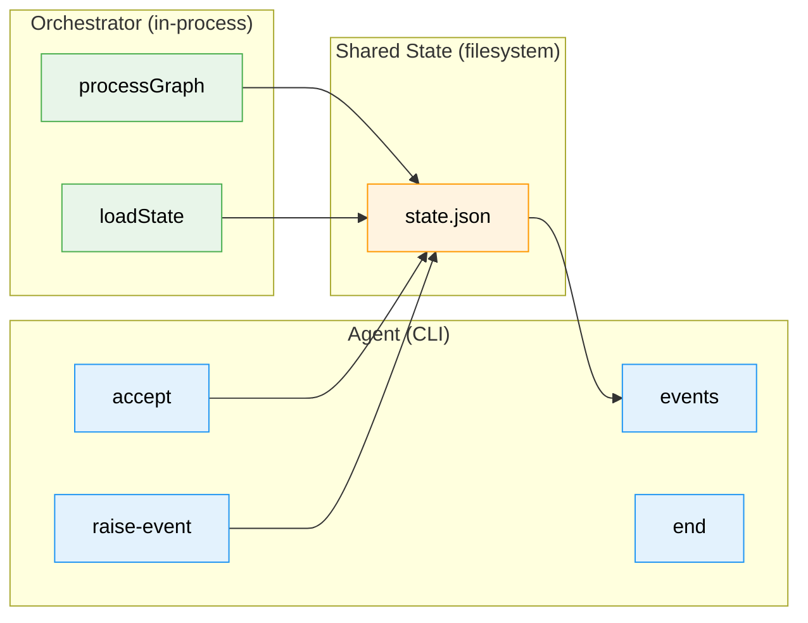
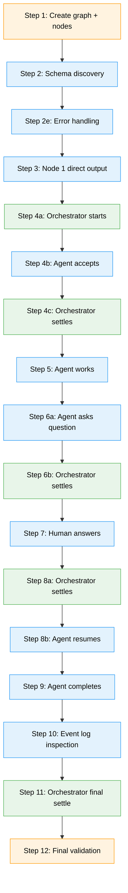

# Workshop: E2E Validation Script — What It Shows, Who It Serves, How It Bridges to Plan 030

**Type**: Integration Pattern / Exemplar Design
**Plan**: 032-node-event-system
**Spec**: [node-event-system-spec.md](../node-event-system-spec.md)
**Created**: 2026-02-08
**Status**: Draft

**Related Documents**:
- [Workshop 07: Event System CLI Commands](./07-event-system-cli-commands.md) — the 8 CLI commands exercised
- [Workshop 10: Event Processing in the Orchestration Loop](./10-event-processing-in-the-orchestration-loop.md) — Settle/Decide/Act pattern
- [Workshop 12: Testable IEventHandlerService Design](./12-testable-event-handler-service-design.md) — Phase 7's graph-wide processor
- [Design Document: e2e-event-system-sample-flow.ts](../e2e-event-system-sample-flow.ts) — original CLI surface design (pre-implementation, partially outdated)
- [Phase 7 Worked Example](../tasks/phase-7-onbas-adaptation-and-backward-compat-projections/examples/worked-example.ts) — in-process EventHandlerService demo

---

## Purpose

Define what the Phase 8 E2E validation script should demonstrate, who its audiences are, what story it tells, and how it positions the codebase for Plan 030 resumption. The E2E script is the culminating artifact of Plan 032 — the proof that the event system works end-to-end from CLI commands through schemas, handlers, stamps, and state transitions. It is also the first thing a new contributor (human or agent) should run to understand how events work.

## Key Questions Addressed

- Q1: What is the script's primary purpose — testing, documentation, or both?
- Q2: Who are the audiences, and what does each audience take away?
- Q3: What does the script exercise that unit/integration tests don't?
- Q4: How does the script relate to the e2e-event-system-sample-flow.ts design doc?
- Q5: What story does the script tell about the node event system?
- Q6: How does it bridge to Plan 030's orchestration loop?
- Q7: Should it use the CLI (external process), in-process calls, or both?

---

## Q1: Purpose — Not a Test Suite, an Exemplar

The E2E script is **not primarily a test**. Unit tests (Phases 1-7: 287+ tests) already verify correctness. The E2E script is an **executable exemplar** — a narrative demonstration that proves the entire event system works as a coherent whole, while teaching the reader how to use it.

Three purposes, in priority order:

| Priority | Purpose | Success Measure |
|----------|---------|-----------------|
| 1 | **Prove integration** | Single script exercises all 8 CLI commands + all 6 event types + stamps + state transitions. Exits 0. |
| 2 | **Teach by showing** | A developer or agent reads the script and console output, and understands the event system without reading any other docs. |
| 3 | **Gate Plan 030** | If this script passes, Plan 032 is done. The event system is ready for Plan 030's orchestration loop to consume. |

### What "Exemplar" Means

An exemplar is a self-contained, runnable narrative. It differs from a test suite in several ways:

| Aspect | Test Suite | Exemplar |
|--------|-----------|----------|
| Structure | Independent test cases | Sequential narrative (Step 1 → Step 2 → ...) |
| Output | PASS/FAIL summary | Narrated console output showing every state change |
| Reader | CI system | Developer learning the system |
| Assertions | Verify correctness | Verify correctness AND explain what happened |
| Isolation | Each test isolated | Steps build on each other (graph created in Step 1 used throughout) |
| Failure mode | Specific test fails | Script stops with context about what step failed and why |

---

## Q2: Audiences

### Audience 1: The Plan 030 Developer (Primary)

**Who**: The developer (human or LLM agent) who will implement Plan 030 Phase 6 (ODS Action Handlers). This is the most important audience.

**What they need to know**:
- What CLI commands exist and how to call them
- What events to raise when ODS executes an action (node:accepted, question:ask, node:completed, etc.)
- How the two-phase handshake works (starting → agent-accepted)
- How questions pause execution and answers resume it
- How stamps work and why idempotency matters
- What IEventHandlerService.processGraph() does to a graph full of pending events

**What they take away**: After reading the script output, they can write ODS action handlers that raise events correctly and trust the event system to handle state transitions.

### Audience 2: The Agent (First-Run Consumer)

**Who**: An LLM agent bootstrapping into this codebase for the first time.

**What they need to know**:
- The complete event lifecycle in one linear story
- The JSON output contract of each CLI command
- The relationship between raising events, handling events, and stamping events
- Error handling patterns (what happens when you use the wrong event type, wrong state, etc.)

**What they take away**: After running the script, they have a mental model of the event system that maps 1:1 to the code they'll interact with.

### Audience 3: The Code Reviewer

**Who**: Anyone reviewing a Plan 030 PR that uses the event system.

**What they need to know**:
- Proof that the event system works end-to-end
- Confidence that the CLI surface is stable
- Regression protection — if someone breaks the event pipeline, this script catches it

**What they take away**: They can point to the E2E script as evidence that the event system contract is exercised and passing.

### Audience 4: Future Maintainer

**Who**: Someone modifying the event system 6 months from now.

**What they need to know**:
- What the expected behavior is for each event type
- What the full lifecycle looks like from graph creation to completion
- Where to look when something breaks

**What they take away**: A living specification they can run to verify their changes don't break the event contract.

---

## Q3: What It Exercises That Tests Don't

Unit and integration tests in Phases 1-7 test each component in isolation or in small combinations. The E2E script is the only place where:

| Gap | What E2E Proves |
|-----|----------------|
| **Full CLI → service → state round-trip** | CLI commands actually call the service layer, which calls raiseEvent, which calls handlers, which persist state — and the next CLI command reads the mutated state correctly |
| **Multi-node graph lifecycle** | Node 1 completes, Node 2 starts, goes through acceptance → work → question → answer → completion. The graph as a whole progresses. |
| **Cross-role interaction** | Orchestrator starts a node, agent accepts and works, agent asks question and stops, human answers, orchestrator resumes, agent completes. Three roles, one graph. |
| **Event type variety in sequence** | 5 of 6 event types in the happy path (accepted → progress → question:ask → question:answer → progress → completed), plus `node:error` demonstrated in the error handling section |
| **Stamp accumulation** | After the full lifecycle, events have stamps from the `cli` subscriber. The stamp-event command adds a manual stamp. Both coexist on the same event. |
| **Schema self-discovery** | An agent can call `event list-types` and `event schema` to learn the system at runtime — no hardcoded knowledge needed |
| **Idempotency of processGraph** | (If exercised) Calling processGraph twice shows second call returns 0 events processed |

---

## Q4: Relationship to the Design Document

The `e2e-event-system-sample-flow.ts` was written **before Phase 6 implementation**. It shows the *intended* CLI surface, which has since been implemented with some differences:

| Design Doc | Actual Implementation | Impact on E2E |
|-----------|----------------------|---------------|
| `cg wf node event list-types` | `cg wf node event list-types <graph> <nodeId>` | Add graph/nodeId args |
| `cg wf node event schema question:ask` | `cg wf node event schema <graph> <nodeId> <eventType>` | Add graph/nodeId args |
| `cg wf node event raise <graph> <nodeId> <type> <payload>` | `cg wf node raise-event <graph> <nodeId> <type> --payload <json>` | Flat command name, payload via option |
| `cg wf node event log <graph> <nodeId>` | `cg wf node events <graph> <nodeId>` | Different command name |
| `cg wf node accept <graph> <nodeId>` | Same | Matches |
| `cg wf node end <graph> <nodeId>` | Same (+ `--message` option) | Matches |
| No stamp command in main flow | `cg wf node stamp-event <graph> <nodeId> <eventId>` | Add stamp demonstration |
| No error shortcut | `cg wf node error <graph> <nodeId>` | Can optionally demonstrate |

**Decision**: The E2E script should use the **actual implemented CLI surface** (Workshop 07 + Phase 6 commands), not the design document's planned surface. The design document is a historical artifact showing intent; the script shows reality.

---

## Q5: The Story — A Complete Node Lifecycle in 11 Steps

The script tells a single, linear story: "Watch a 2-node pipeline execute from start to finish using only events."

### The Cast

| Actor | Role | Interface | Identity |
|-------|------|-----------|----------|
| **Orchestrator** | Starts nodes, settles events, detects resume conditions | **In-process** (`processGraph()`, `loadState()`) | Calls services directly |
| **Agent** | Accepts work, does work, asks questions, completes | **CLI** (`cg wf node ...`) | `--source agent` (default) |
| **Human** | Answers questions | **CLI** (`cg wf node ... --source human`) | `--source human` |

The key insight: the orchestrator and the agent never share a process. The agent writes state via CLI. The orchestrator reads it in-process, decides, and writes back. The agent reads the result via CLI. **The E2E script makes this boundary visible.**

### The Plot

```
ACT 1: Setup
  Step 1  — Create graph, add 2 nodes (spec-writer → code-builder)
  Step 2  — Schema self-discovery (agent learns the event vocabulary)    [CLI]
  Step 2e — Error handling (negative paths on a throwaway node)          [CLI]

ACT 2: Simple Node (spec-writer)
  Step 3  — Direct output + complete (no agent needed)                   [CLI]

ACT 3: Agent Node (code-builder) — The Main Story
  Step 4a — Orchestrator starts node                                     [IN-PROCESS]
  Step 4b — Agent accepts (two-phase handshake)                          [CLI]
  Step 4c — Orchestrator settles (processGraph)                          [IN-PROCESS]
  Step 5  — Agent does work (progress events, saves output)              [CLI]
  Step 6a — Agent asks question (STOPS — the dramatic moment)            [CLI]
  Step 6b — Orchestrator settles, detects question, sees stops_execution [IN-PROCESS]
  Step 7  — Human answers question                                       [CLI]
  Step 8a — Orchestrator settles, detects answer → resume condition      [IN-PROCESS]
  Step 8b — Agent resumes, retrieves answer                              [CLI]
  Step 9  — Agent completes (shortcut command)                           [CLI]

ACT 4: Inspection + Proof
  Step 10 — Event log with stamps (the full audit trail)                 [CLI]
  Step 11 — Orchestrator settles one final time: eventsProcessed = 0     [IN-PROCESS]
  Step 12 — Final state validation (all nodes complete)
```

The `[CLI]` / `[IN-PROCESS]` tags make the boundary explicit. Every time control passes between the two, the reader sees the handoff.

### Why This Story Matters for Plan 030

This is exactly the sequence that Plan 030's orchestration loop will orchestrate:

```
Plan 030's ODS.handleStartNode()    → Step 4a (in-process: start node)
Plan 030's EventHandlerService      → Step 4c, 6b, 8a, 11 (in-process: processGraph)
Plan 030's ONBAS                    → Implicit between settle steps (decides next action)
Plan 030's ODS.handleResumeNode()   → Step 8a (in-process: detect resume condition)
Plan 030's ODS.handleQuestionPending() → Step 6b (in-process: detect question)
Agent via CLI                       → Steps 4b, 5, 6a, 8b, 9 (CLI: agent does work)
```

The E2E script is a **manual rehearsal** of what Plan 030 will automate. The in-process steps ARE the orchestrator's perspective. The CLI steps ARE the agent's perspective. Together they tell the complete story.

---

## Q6: Bridging to Plan 030

### What Plan 030 Phase 6 Needs from the Event System

Plan 030 Phase 6 (ODS Action Handlers) will implement 4 handlers:

| ODS Handler | Events It Raises | What E2E Proves |
|-------------|-----------------|-----------------|
| `handleStartNode` | `node:accepted` (via agent after pod starts) | Step 4: accept works, status transitions |
| `handleResumeNode` | `question:answer` (before pod resume) | Steps 7-8: answer works, agent can retrieve it |
| `handleQuestionPending` | reads `question:ask` events | Step 6: question lifecycle correct |
| `handleNoAction` | (none) | N/A — no-op |

### The Settle Phase

Plan 030's orchestration loop runs `EventHandlerService.processGraph()` (Phase 7) between each ONBAS decision. The E2E script should demonstrate that all events raised by CLI commands have been handled and stamped by the `cli` subscriber. This proves the pipeline that Plan 030's Settle phase will rely on.

### The Exemplar Contract

After Phase 8, Plan 030 can rely on these guarantees:
1. `raise-event <type>` creates a validated, schema-checked event
2. Handlers fire automatically and mutate node state
3. Events are stamped by the `cli` subscriber
4. `events` command returns the full audit trail
5. `stamp-event` lets external subscribers record their processing
6. The whole thing is idempotent — processing an already-stamped event is a no-op

---

## Q7: CLI vs. In-Process — The Hybrid Model

**Decision: Hybrid — CLI for agent actions, in-process for orchestrator actions**

In production, two distinct actors interact with the event system through two distinct interfaces:

| Actor | Production Interface | Why |
|-------|---------------------|-----|
| **Agent** | CLI (`cg wf node accept`, `cg wf node raise-event`, etc.) | Agents are external processes that communicate via CLI commands |
| **Orchestrator** | In-process (`processGraph()`, `loadState()`, ONBAS walk) | The orchestration loop is a server-side process calling services directly |

The E2E script should mirror this reality. Agent actions go through CLI. Orchestrator actions call services directly. This is not a compromise between two pure approaches — it's the *accurate* representation of how the system works.

### What Goes Through CLI (Agent + Human Side)

These are the actions that agents and humans perform via external CLI commands:

| Step | CLI Command | Actor |
|------|------------|-------|
| Step 2 | `cg wf node event list-types`, `event schema` | Agent (discovery) |
| Step 3 | `cg wf node save-output-data`, `cg wf node end` | Human (direct output) |
| Step 4 | `cg wf node accept` | Agent (shortcut) |
| Step 5 | `cg wf node raise-event progress:update` | Agent (generic) |
| Step 6 | `cg wf node raise-event question:ask` | Agent (generic) |
| Step 7 | `cg wf node raise-event question:answer --source human` | Human |
| Step 8 | Agent retrieves answer via `cg wf node events` | Agent |
| Step 9 | `cg wf node end` | Agent (shortcut) |
| Step 10 | `cg wf node events`, `cg wf node stamp-event` | Inspection |

### What Goes In-Process (Orchestrator Side)

These are the actions the orchestration loop performs directly:

| Step | In-Process Call | What It Demonstrates |
|------|----------------|---------------------|
| Step 1 | `loadState()` + direct state setup or graph service calls | Graph/node creation (orchestrator bootstraps the graph) |
| Step 4 | `processGraph(state, 'orchestrator', 'cli')` | **Settle phase** — orchestrator settles events after agent accepts |
| Step 6 | `processGraph(state, 'orchestrator', 'cli')` | **Settle phase** — orchestrator detects question:ask, sees stops_execution |
| Step 7-8 | `processGraph(state, 'orchestrator', 'cli')` | **Settle phase** — orchestrator settles the answer, detects resume condition |
| Step 11 | `processGraph()` returns `eventsProcessed: 0` | **Idempotency** — graph is fully settled, nothing left to do |

### Why This Is Better Than Pure CLI or Pure In-Process



The CLI writes state to disk. The orchestrator reads it back in-process and processes it. This is the exact production data flow: agent CLI → state file → orchestrator in-process → state file → agent CLI.

### Practical Implication

The script needs both:
1. **CLI built** — for agent-side `runCli()` calls:
   ```bash
   pnpm build --filter=@chainglass/cli
   ```
2. **Direct imports** — for orchestrator-side in-process calls:
   ```typescript
   import { EventHandlerService } from '...032-node-event-system/event-handler-service.js';
   import { NodeEventService } from '...032-node-event-system/node-event-service.js';
   import { createEventHandlerRegistry } from '...032-node-event-system/event-handlers.js';
   ```

The `runCli()` helper handles agent commands. A `loadGraphState()` helper reads the same state file the CLI wrote, and orchestrator calls operate on it in-process.

---

## Script Structure

### Architecture



**Legend**: blue = CLI (agent/human) | green = in-process (orchestrator) | orange = both/setup

### Console Output Design

The script's output is its most important artifact. It should be readable by a human watching in a terminal and by an LLM reading a log file.

```
======================================================================
  E2E: Node Event System — Full Lifecycle Demo
======================================================================
Mode: Hybrid (CLI for agent, in-process for orchestrator)

STEP 1: Create graph and add nodes
  + Created graph: event-system-e2e
  + Added node: spec-writer (user-input)
  + Added node: code-builder (agent, depends on spec-writer.spec)

STEP 2: Schema self-discovery                                    [CLI]
  i Agent discovers available event types:
    node:accepted     (lifecycle)  — Agent acknowledges node assignment
    node:completed    (lifecycle)  — Agent reports work complete
    node:error        (lifecycle)  — Agent reports error
    question:ask      (question)   — Agent asks a question
    question:answer   (question)   — Human or system answers
    progress:update   (progress)   — Agent reports progress
  i Agent inspects schema for question:ask:
    text     string  (required)  — The question text
    type     string  (required)  — Question type: text, single, multi
    options  array   (optional)  — Choices for single/multi questions

STEP 2e: Error handling (negative paths)                         [CLI]
  i Using throwaway node 'error-demo' to exercise error cases
  + E190: raise-event bogus:type -> "Unknown event type 'bogus:type'"
  + E191: raise-event question:ask --payload '{}' -> "Missing: text"
  + E197: raise-event node:accepted --payload 'not-json' -> "Invalid JSON"
  + E193: raise-event node:completed (node in 'starting') -> "Invalid state"
  + E196: stamp-event evt_nonexistent -> "No event with ID"
  + Error shortcut: cg wf node error --code DEMO --message "test"
    node:error raised, status -> blocked-error, stops_execution: true
  + All 5 error codes verified. Removing throwaway node.

STEP 3: Execute spec-writer (direct output, no agent)           [CLI]
  + Output saved: spec = "Write a TypeScript fibonacci(n) function"
  + Node completed: spec-writer -> complete

STEP 4a: Orchestrator starts code-builder                  [IN-PROCESS]
  + startNode(): pending -> starting

STEP 4b: Agent accepts code-builder                              [CLI]
  + Agent accepts via shortcut: cg wf node accept
  + Status: starting -> agent-accepted
  + Event logged: node:accepted (source: agent)

STEP 4c: Orchestrator settles                              [IN-PROCESS]
  + processGraph(state, 'orchestrator', 'cli')
  + nodesVisited: 2, eventsProcessed: 1, handlerInvocations: 1
  i node:accepted event settled by orchestrator subscriber

STEP 5: Agent does work                                          [CLI]
  + Progress event via raise-event: "Analyzing spec..." (25%)
  + Output saved via save-output-data: language = "typescript"
  i (save-output-data is a direct service call, not an event)

STEP 6a: Agent asks question (execution stops)                   [CLI]
  + Question raised via raise-event: "Which algorithm for fibonacci?"
  + stops_execution: true
  + [AGENT INSTRUCTION] This event requires you to stop.
  --- Agent has exited. Control returns to orchestrator. ---

STEP 6b: Orchestrator settles, detects question              [IN-PROCESS]
  + processGraph(state, 'orchestrator', 'cli')
  + nodesVisited: 2, eventsProcessed: 3
  i Orchestrator sees question:ask with stops_execution — node is blocked

STEP 7: Human answers question                                   [CLI]
  + Human answers via raise-event --source human: "memoized"
  + Question lifecycle complete: asked -> answered

STEP 8a: Orchestrator settles, detects resume condition    [IN-PROCESS]
  + processGraph(state, 'orchestrator', 'cli')
  + nodesVisited: 2, eventsProcessed: 1
  i question:answer settled — node has both ask and answer, ready to resume

STEP 8b: Agent resumes, retrieves answer                         [CLI]
  + Agent reads events: cg wf node events --type question:answer
  + Agent retrieved answer: "memoized"

STEP 9: Agent completes                                          [CLI]
  + Progress: "Generating memoized fibonacci..." (75%)
  + Output saved: code = [fibonacci function]
  + Agent completes via shortcut: cg wf node end
  + Status: agent-accepted -> complete

STEP 10: Event log inspection                                    [CLI]
  + Full event log for code-builder:

  Event ID    Type              Source   Stops  Stamps
  ───────────────────────────────────────────────────────────
  evt_001     node:accepted     agent    no     cli, orchestrator
  evt_002     progress:update   agent    no     cli, orchestrator
  evt_003     question:ask      agent    yes    cli, orchestrator
  evt_004     question:answer   human    no     cli, orchestrator
  evt_005     progress:update   agent    no     cli, orchestrator
  evt_006     node:completed    agent    yes    cli, orchestrator

  + Manual stamp demonstration:
    cg wf node stamp-event ... --subscriber e2e-verifier --action verified
  + Event evt_001 now has 3 subscribers: cli, orchestrator, e2e-verifier

STEP 11: Orchestrator final settle (idempotency proof)     [IN-PROCESS]
  + processGraph(state, 'orchestrator', 'cli')
  + nodesVisited: 2, eventsProcessed: 0, handlerInvocations: 0
  i All events stamped by orchestrator — nothing left to settle

STEP 12: Validate final state
  + spec-writer: complete
  + code-builder: complete
  + All nodes complete. Event system validated.

======================================================================
  ALL STEPS PASSED
======================================================================
Exit: 0
```

---

## What the Design Doc Gets Right (Keep)

The `e2e-event-system-sample-flow.ts` design doc establishes patterns that the real script should follow:

1. **`runCli<T>()` helper** — spawn external process, parse JSON output, return typed result. Excellent pattern. Keep the generic type parameter.
2. **`log()`, `ok()`, `info()`, `banner()` helpers** — consistent output formatting. Keep.
3. **`assert()` with descriptive messages** — fail fast with context. Keep.
4. **`cleanup()` step** — delete graph before starting. Essential for idempotency. Keep.
5. **11-step linear narrative** — the plot structure is correct. Keep.
6. **Exit 0/1 contract** — keep.

## What the Design Doc Gets Wrong (Change)

1. **Command names don't match implementation** — `cg wf node event raise` should be `cg wf node raise-event`. The E2E must use actual commands.
2. **Missing stamp-event demonstration** — the design doc doesn't show `stamp-event`. Add it in Step 10.
3. **Missing error shortcut** — the design doc doesn't show `cg wf node error`. Consider adding it as an optional step.
4. **No processGraph demonstration** — the design doc doesn't show EventHandlerService. Consider adding an in-process step or noting this as out-of-scope (covered by Phase 7 worked example).
5. **`output:save-data` event doesn't exist** — outputs are saved via `cg wf node save-output-data`, a direct service call outside the event system. The design doc incorrectly showed `raise-event output:save-data`. The E2E uses the direct command for saving outputs and `raise-event` only for actual event types (`progress:update`, etc.).
6. **Step 8 (resume) can't actually resume an agent** — the E2E runs without a real agent. Step 8 should simulate the resume by having the "agent" read the answer event and continue.

---

## Open Questions

### Q1: Should the E2E script live in `test/e2e/` or alongside the plan docs?

**RESOLVED**: `test/e2e/node-event-system-visual-e2e.ts` per the plan's File Placement Manifest (line 824). It's a test artifact, even though it's also documentation.

### Q2: Should it run as part of `just fft`?

**RESOLVED**: No. The E2E script requires the CLI to be built (`pnpm build --filter=@chainglass/cli`), which `just fft` doesn't guarantee. It should be runnable manually:
```bash
pnpm build --filter=@chainglass/cli
npx tsx test/e2e/node-event-system-visual-e2e.ts
```

It should also be runnable via a dedicated just recipe:
```bash
just e2e-events   # builds CLI, then runs the script
```

But it is NOT part of the vitest test suite. It's a standalone script.

### Q3: Should it demonstrate processGraph (Phase 7)?

**RESOLVED**: Yes — processGraph is the orchestrator's perspective. The hybrid model (Q7) means processGraph is called in-process after each agent CLI action, exactly as Plan 030's Settle phase will do. This is not "mixing concerns" — it's showing the two sides of the same coin. The agent acts via CLI, the orchestrator settles via processGraph, and the script shows both.

Specifically, processGraph appears in:
- **Step 4c**: After agent accepts, orchestrator settles → `eventsProcessed: 1`
- **Step 6b**: After agent asks question, orchestrator settles → detects `stops_execution`
- **Step 8a**: After human answers, orchestrator settles → detects resume condition
- **Step 11**: Final settle → `eventsProcessed: 0` (idempotency proof)

### Q4: Should it demonstrate error handling (negative paths)?

**RESOLVED**: Yes — demonstrate all error dimensions. After schema discovery (Step 2) and before the happy-path narrative begins, add a dedicated error-handling section that shows every class of rejection:

- **E190**: Unknown event type (`raise-event ... bogus:type`)
- **E191**: Invalid payload — schema validation fails (`raise-event question:ask --payload '{}'` — missing required `text` field)
- **E193**: Invalid state transition (`raise-event node:completed` on a node still in `starting` state)
- **E197**: Malformed JSON (`raise-event ... --payload 'not-json'`)
- **E196**: Event not found (`stamp-event ... --subscriber x --action y` with a nonexistent event ID)

Each error case should show the CLI error output, assert on the error code, and explain what the system caught. This teaches agents what rejection looks like and proves the validation pipeline works end-to-end through the CLI.

### Q5: How does `output:save-data` work via CLI?

**RESOLVED**: `save-output-data` is a direct service call — it checks node state, then atomically writes to `data/data.json`. It does NOT go through the event system. There is no `output:save-data` event type in the registry. The 6 registered event types are: `node:accepted`, `node:completed`, `node:error`, `question:ask`, `question:answer`, `progress:update`.

The E2E uses `cg wf node save-output-data` for saving outputs (the direct path). No event raised. We may add an output event later if needed, but for now outputs are outside the event system.

The original design doc (`e2e-event-system-sample-flow.ts`) incorrectly showed `raise-event output:save-data` — this event type does not exist. The E2E must not demonstrate it.

### Q6: What about the `cg wf node error` shortcut?

**RESOLVED**: Demonstrate it in the error handling section (between Steps 2 and 3), not in the main narrative. The error section uses a throwaway node to show the `error` shortcut raising a `node:error` event and transitioning the node to `blocked-error`. This exercises the shortcut and the 6th event type without cluttering the happy-path story. The throwaway node is cleaned up before Act 2 begins.

---

## Key Design Decisions

### D1: Hybrid — CLI for Agents, In-Process for Orchestrator

Covered in Q7 above. The E2E mirrors production: agents interact via CLI, the orchestrator calls services directly. Both interfaces converge on the same state files. The script makes this boundary visible at every handoff.

### D2: Linear Narrative, Not Parallel

The script is deliberately sequential. No concurrent node execution, no parallel events. This makes the story easy to follow and the assertions unambiguous. Plan 030's orchestration loop will handle parallelism — the E2E proves the primitives work one at a time.

### D3: Assertions Verify Data, Not Formatting

The script asserts on JSON output (`.data.status`, `.data.event_type`, etc.), never on human-readable formatting. The human-readable output is for the reader; the assertions are for correctness.

### D4: Cleanup Before, Not After

The script deletes the test graph at the start, not the end. This means:
- If the script fails, the graph state is preserved for debugging
- If the script succeeds, the graph state is preserved for manual inspection
- Running the script again starts clean

### D5: No Vitest — Standalone Script

The E2E is a standalone `tsx` script, not a vitest test. Reasons:
- It's a narrative, not a test suite
- It needs the CLI built (not just TypeScript compiled)
- It should produce human-readable output, not vitest's test runner output
- It has its own exit code contract (0/1)

### D6: The Script IS the Documentation

The console output is designed to be self-explanatory. A developer should be able to understand the entire event system by reading only the E2E script output. Every step explains what it's doing and why. Every assertion explains what it proved.

---

## Adapting the Design Document

The `e2e-event-system-sample-flow.ts` design document should be treated as a **reference for plot structure and narrative flow**, but the actual commands must match the Phase 6 implementation.

### Command Mapping: Design Doc → Implementation

| Design Doc Command | Actual Command | Notes |
|-------------------|----------------|-------|
| `cg wf create <slug>` | Same | Unchanged |
| `cg wf node add-after <graph> <after> <name>` | Same | Unchanged |
| `cg wf node start <graph> <nodeId>` | Same | Unchanged |
| `cg wf node accept <graph> <nodeId>` | Same | Shortcut for raise-event node:accepted |
| `cg wf node end <graph> <nodeId>` | Same (+ `--message`) | Shortcut for raise-event node:completed |
| `cg wf node save-output-data <graph> <nodeId> <name> <value>` | Same | Direct output save (not via events) |
| `cg wf node get-input-data <graph> <nodeId> <name>` | Same | Direct input read |
| `cg wf node event list-types` | `cg wf node event list-types <graph> <nodeId>` | Added required args |
| `cg wf node event schema <type>` | `cg wf node event schema <graph> <nodeId> <type>` | Added required args |
| `cg wf node event raise <graph> <nodeId> <type> <payload>` | `cg wf node raise-event <graph> <nodeId> <type> --payload <json>` | Flat name, payload via option |
| `cg wf node event log <graph> <nodeId>` | `cg wf node events <graph> <nodeId>` | Different name |
| (not shown) | `cg wf node stamp-event <graph> <nodeId> <eventId>` | New — add to E2E |
| (not shown) | `cg wf node error <graph> <nodeId>` | New shortcut — mention in discovery |

---

## Relationship to Phase 7 Worked Example

The Phase 7 worked example (`worked-example.ts`) demonstrates EventHandlerService **purely in-process** — direct function calls, synthetic state, no CLI. It isolates the Settle phase and proves processGraph mechanics (idempotency, subscriber isolation, count-before-stamp ordering).

The Phase 8 E2E script is **hybrid** — it uses CLI for agent actions and in-process calls for orchestrator actions. It demonstrates the full production data flow: agent writes state via CLI, orchestrator reads and settles in-process, agent reads back via CLI.

| Dimension | Phase 7 Worked Example | Phase 8 E2E Script |
|-----------|----------------------|-------------------|
| Interface | In-process only | Hybrid: CLI + in-process |
| Focus | processGraph() mechanics | Full lifecycle with role boundaries |
| State | Synthetic (hand-built) | Real (CLI-created, persisted to disk) |
| Audience | Developer learning EHS internals | Developer learning the whole system |
| Scope | Single processGraph call | 12 steps across 4 acts |

They complement rather than overlap: the worked example zooms in on processGraph internals, the E2E zooms out to the full agent/orchestrator interaction.

---

## Implementation Sketch

Not the full code — that's Phase 8's dossier. This is the structural skeleton showing how the design decisions manifest.

### File Structure

```
test/e2e/
  node-event-system-visual-e2e.ts    # The script (Phase 8 deliverable)
```

### Skeleton

```typescript
#!/usr/bin/env npx tsx
/**
 * E2E: Node Event System — Full Lifecycle Demo
 *
 * Hybrid: CLI for agent/human actions, in-process for orchestrator actions.
 * Run: pnpm build --filter=@chainglass/cli && npx tsx test/e2e/node-event-system-visual-e2e.ts
 */

import { spawn } from 'node:child_process';

// In-process imports for orchestrator-side calls
import { EventHandlerService } from '../../packages/positional-graph/src/features/032-node-event-system/event-handler-service.js';
import { createEventHandlerRegistry } from '../../packages/positional-graph/src/features/032-node-event-system/event-handlers.js';
import { FakeNodeEventRegistry } from '../../packages/positional-graph/src/features/032-node-event-system/fake-node-event-registry.js';
import { NodeEventService } from '../../packages/positional-graph/src/features/032-node-event-system/node-event-service.js';

// Helpers: runCli<T> (CLI side), loadGraphState (in-process side),
//          log, ok, info, banner, assert, cleanup

// Build the orchestrator's in-process stack (same wiring as Phase 7 worked example)
const handlerRegistry = createEventHandlerRegistry();
// ... NodeEventService + EventHandlerService construction

async function main(): Promise<void> {
  banner('E2E: Node Event System — Full Lifecycle Demo');
  console.log('Mode: Hybrid (CLI for agent, in-process for orchestrator)');

  await cleanup();

  // ACT 1: Setup
  await step1_createGraphAndNodes();
  await step2_schemaDiscovery();                   // [CLI]

  // ACT 2: Simple Node
  await step3_directOutput();                       // [CLI]

  // ACT 3: Agent Node (the main story)
  await step4a_orchestratorStarts();                // [IN-PROCESS]
  await step4b_agentAccepts();                      // [CLI]
  await step4c_orchestratorSettles();               // [IN-PROCESS]
  await step5_agentWorks();                         // [CLI]
  await step6a_agentAsksQuestion();                 // [CLI]
  await step6b_orchestratorSettles();               // [IN-PROCESS]
  await step7_humanAnswers();                       // [CLI]
  await step8a_orchestratorSettles();               // [IN-PROCESS]
  await step8b_agentResumes();                      // [CLI]
  await step9_agentCompletes();                     // [CLI]

  // ACT 4: Inspection + Proof
  await step10_inspectEventLog();                   // [CLI]
  await step11_orchestratorFinalSettle();           // [IN-PROCESS]
  await step12_validateFinalState();

  banner('ALL STEPS PASSED');
  process.exit(0);
}
```

### Step 4 Detail — The Hybrid Handoff (Exemplar)

This shows the three-part handoff for a single orchestration action: orchestrator starts (in-process), agent accepts (CLI), orchestrator settles (in-process).

```typescript
// Step 4a: Orchestrator starts the node [IN-PROCESS]
async function step4a_orchestratorStarts(): Promise<void> {
  log('STEP 4a', 'Orchestrator starts code-builder [IN-PROCESS]');

  // In production, ODS.handleStartNode() does this.
  // For the E2E, we use the CLI to start (graph service call)
  // because startNode isn't exposed as a pure service call yet.
  await runCli(['wf', 'node', 'start', GRAPH_SLUG, nodeIds.codeBuilder]);
  ok('startNode(): pending -> starting');
}

// Step 4b: Agent accepts [CLI]
async function step4b_agentAccepts(): Promise<void> {
  log('STEP 4b', 'Agent accepts code-builder [CLI]');

  // Agent uses the shortcut command (equivalent to raise-event node:accepted)
  info('Agent runs: cg wf node accept (shortcut)');
  await runCli(['wf', 'node', 'accept', GRAPH_SLUG, nodeIds.codeBuilder]);
  ok('Agent accepted: starting -> agent-accepted');

  // Verify via CLI (the agent's way of checking)
  const events = await runCli<{ events: Array<{ event_type: string }> }>([
    'wf', 'node', 'events', GRAPH_SLUG, nodeIds.codeBuilder,
    '--type', 'node:accepted', '--json'
  ]);
  assert(events.data.events.length === 1, 'Expected 1 node:accepted event');
  ok('Event logged: node:accepted (source: agent)');
}

// Step 4c: Orchestrator settles [IN-PROCESS]
async function step4c_orchestratorSettles(): Promise<void> {
  log('STEP 4c', 'Orchestrator settles [IN-PROCESS]');

  // Load the state that the CLI just wrote to disk
  const state = await loadGraphState(GRAPH_SLUG);

  // This is the Settle phase — exactly what Plan 030's loop will do
  const result = eventHandlerService.processGraph(state, 'orchestrator', 'cli');
  ok(`processGraph(): nodesVisited=${result.nodesVisited}, eventsProcessed=${result.eventsProcessed}`);

  // Persist the state with orchestrator stamps added
  await persistGraphState(GRAPH_SLUG, state);
  info('node:accepted event now stamped by both cli and orchestrator');
}
```

---

## Summary

| Question | Answer |
|----------|--------|
| What is it? | An executable exemplar — a runnable narrative proving the event system works end-to-end |
| Who is it for? | Plan 030 developer (primary), agents, reviewers, future maintainers |
| What does it exercise? | All 8 CLI commands + processGraph(), all 6 event types, stamps, state transitions, schema discovery |
| How does it run? | Hybrid: CLI for agent/human actions, in-process for orchestrator actions |
| Where does it live? | `test/e2e/node-event-system-visual-e2e.ts` |
| Is it a test? | It has assertions, but it's primarily documentation. Not part of vitest. |
| How does it bridge to 030? | It rehearses the exact event-raising sequence that ODS will automate |
| When is 032 done? | When this script exits 0 |
