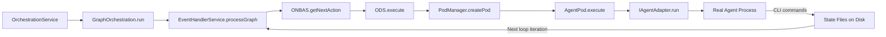

# Research Report: Real Agent Pods

**Generated**: 2026-02-11T04:35:00Z
**Research Query**: "Pods that work - making work unit pods run real agents"
**Mode**: Plan-Associated (033-real-agent-pods)
**Location**: docs/plans/033-real-agent-pods/research-dossier.md
**FlowSpace**: Available
**Findings**: 75+ across 7 subagents

## Executive Summary

### What It Does
The positional orchestrator (Plan 030) provides a Settle-Decide-Act loop that walks a positional graph, starts pods for ready nodes, and processes events to advance graph state. Plan 019 provides the agent management system (AgentManagerService, AgentInstance, adapters for Claude Code and Copilot). Plan 032 provides the node event system for agent-orchestrator communication. **None of these systems are currently wired together for real agent execution.** Plan 033 bridges this gap.

### Business Purpose
Enable the orchestration system to run real AI agents (Claude Code, Copilot) inside work unit pods, with full lifecycle tracking (start, accept, work, question, answer, resume, complete, error), session persistence, and parallel execution support. This is the foundational capability that makes the workflow system actually do work.

### Key Insights
1. **Two parallel agent systems exist** - AgentManagerService (019, web/UI-focused) and AgentPod (030, orchestration-focused) are completely decoupled. The pod bypasses the manager entirely and works directly with IAgentAdapter.
2. **The fire-and-forget model is the core design** - ODS calls `pod.execute()` without awaiting. Real agents communicate back via CLI commands that raise events. The orchestration loop re-runs to detect changes.
3. **The node-starter-prompt.md is the integration contract** - Currently a 24-line placeholder. Real agents need: graph/node IDs, CLI command syntax, two-phase handshake instructions, input discovery, output saving, and question protocol.
4. **15 prior learnings provide critical gotchas** - Storage-first events, subscribe-before-send, concept drift checks, Copilot message synthesis, session destruction races, and more.

### Quick Stats
- **Components**: ~40 files across 3 packages (shared, positional-graph, cli)
- **Dependencies**: IAgentAdapter, IProcessManager, IFileSystem, INodeEventRegistry, IEventHandlerService
- **Test Coverage**: Extensive unit/integration for fakes; zero coverage for real agent pod execution
- **Complexity**: High - bridges 3 plan systems (019, 030, 032)
- **Prior Learnings**: 15 relevant discoveries from previous implementations

## How It Currently Works

### Entry Points

| Entry Point | Type | Location | Purpose |
|------------|------|----------|---------|
| `OrchestrationService.get(graphSlug)` | Service | `packages/positional-graph/src/features/030-orchestration/orchestration-service.ts` | Creates per-graph orchestration handle |
| `GraphOrchestration.run()` | Method | `graph-orchestration.ts:69-123` | The Settle-Decide-Act loop |
| `ODS.execute(request)` | Method | `ods.ts:54-146` | Dispatches start-node/resume-node requests |
| `AgentPod.execute(options)` | Method | `pod.agent.ts:53-77` | Runs the agent adapter |
| `cg wf node accept/end/ask/answer` | CLI | `apps/cli/src/commands/positional-graph.command.ts` | Agent-side communication |

### Core Execution Flow

```
1. OrchestrationService.get(graphSlug) → IGraphOrchestration handle
2. handle.run() enters the loop:
   a. SETTLE: eventHandlerService.processGraph(state) — stamps pending events
   b. SNAPSHOT: buildPositionalGraphReality(state) — creates immutable reality
   c. DECIDE: ONBAS.getNextAction(reality) — walks lines/nodes → OrchestrationRequest
   d. EXIT CHECK: if no-action, return
   e. ACT: ODS.execute(request) → handles start-node
      i.   graphService.startNode() → pending → starting
      ii.  contextService.getContextSource() → new | inherit
      iii. podManager.createPod(nodeId, { adapter }) → AgentPod
      iv.  pod.execute() — FIRE AND FORGET (not awaited!)
   f. RECORD action and loop
3. Agent (real or simulated) runs independently:
   a. Reads node-starter-prompt.md
   b. Calls `cg wf node accept <graph> <node>` → raises node:accepted event
   c. Does work (using unit's prompt_template and inputs)
   d. Calls `cg wf node save-output-data <graph> <node> <name> <value>`
   e. Calls `cg wf node end <graph> <node>` → raises node:completed event
   f. OR calls `cg wf node raise-event question:ask` → raises question event
4. Next handle.run() invocation:
   a. SETTLE processes the agent's events → state transitions
   b. ONBAS detects completed/questioning/errored nodes
   c. ODS dispatches next actions
```

### Data Flow


### State Management

**Node execution states** (8-value `ExecutionStatus`):
```
pending → ready → starting → agent-accepted → waiting-question → restart-pending → ready (loop)
                                             → blocked-error
                                             → complete
```

**Agent instance states** (3-value `AgentInstanceStatus` from Plan 019):
```
stopped → working → stopped | error
```

**Session persistence**: `pod-sessions.json` at `.chainglass/graphs/<slug>/pod-sessions.json` - atomic write pattern, survives pod destruction and server restarts.

## Architecture & Design

### Component Map

#### Core Components (Plan 030 - Orchestration)
- **GraphOrchestration** (`graph-orchestration.ts`) - Per-graph orchestration loop
- **ONBAS** (`onbas.ts`) - Pure, stateless next-action decision engine
- **ODS** (`ods.ts`) - Action dispatcher, creates pods, handles start/resume
- **PodManager** (`pod-manager.ts`) - Pod lifecycle + session persistence
- **AgentPod** (`pod.agent.ts`) - Execution container for agent work units
- **AgentContextService** (`agent-context.ts`) - 5-rule session inheritance algorithm

#### Core Components (Plan 019 - Agent System)
- **AgentManagerService** (`agent-manager.service.ts`) - Central agent registry (web/UI focused)
- **AgentInstance** (`agent-instance.ts`) - Self-contained agent with status, events, session
- **ClaudeCodeAdapter** (`claude-code.adapter.ts`) - Spawns `claude` CLI via IProcessManager
- **SdkCopilotAdapter** (`sdk-copilot-adapter.ts`) - Wraps Copilot SDK client
- **FakeAgentAdapter** (`fake-agent-adapter.ts`) - Test double with configurable behavior

#### Core Components (Plan 032 - Events)
- **NodeEventRegistry** (`node-event-registry.ts`) - 7 core event types
- **raiseEvent()** (`raise-event.ts`) - Validates + persists events
- **EventHandlerService** (`event-handler-service.ts`) - Stamps + processes events
- **Core event types**: `node:accepted`, `node:completed`, `node:error`, `question:ask`, `question:answer`, `progress:update`, `node:restart`

### Design Patterns Identified
1. **Strategy Pattern**: IAgentAdapter with ClaudeCodeAdapter/SdkCopilotAdapter implementations
2. **Factory Pattern**: AdapterFactory `(type: AgentType) => IAgentAdapter` for runtime selection
3. **DI Token Constants**: tsyringe with `ORCHESTRATION_DI_TOKENS`, `useFactory` registration
4. **Discriminated Unions**: OrchestrationRequest (4 variants), WorkUnit (3 variants), AgentEvent (9 variants)
5. **Settle-Decide-Act Loop**: Event-driven orchestration pattern
6. **Fire-and-Forget**: ODS does not await pod.execute()
7. **Two-Phase Handshake**: starting → agent-accepted (agent must call `accept` first)
8. **Storage-First Events**: Persist before broadcast
9. **Contract Test Parity**: Same tests run against Fake and Real implementations
10. **Result Pattern**: BaseResult with `errors: ResultError[]` instead of exceptions

### System Boundaries
- **Internal**: Orchestration loop is entirely in-process (packages/positional-graph)
- **External**: Agent processes are external (spawned CLI or SDK calls)
- **Communication**: Agents communicate via CLI → state files on disk → orchestration loop reads
- **Web/SSE**: Out of scope for Plan 033 — events stay within the orchestration system

## Dependencies & Integration

### What This Depends On

#### Internal Dependencies
| Dependency | Type | Purpose | Risk if Changed |
|------------|------|---------|-----------------|
| IAgentAdapter | Required | Bridge to real agents | Critical - primary integration point |
| IProcessManager | Required | Spawns Claude CLI processes | High - needed for ClaudeCodeAdapter |
| IFileSystem | Required | State persistence, session storage | High - data integrity |
| INodeEventRegistry | Required | Event type validation | Medium - stable interface |
| IEventHandlerService | Required | Settles events into state | Medium - stable interface |
| IPositionalGraphService | Required | Graph state management | Medium - stable interface |
| AgentContextService | Required | Session inheritance rules | Low - fully implemented |

#### External Dependencies
| Service/Library | Version | Purpose | Criticality |
|-----------------|---------|---------|-------------|
| Claude Code CLI (`claude`) | Latest | Real agent execution | Critical |
| Copilot SDK | Latest | Alternative agent | Medium |
| tsyringe | ^4 | Dependency injection | Low |
| Zod | ^3 | Schema validation | Low |

### What Depends on This (Future)
- **Web UI** - Will display agent lifecycle state, questions, errors
- **SSE Broadcast** - Will stream agent events to browser (out of scope)
- **Graph Dashboard** - Will show node execution progress

## Quality & Testing

### Current Test Coverage
- **Unit Tests**: Comprehensive for all Plan 030/032 components with fakes (~3700 tests pass)
- **Contract Tests**: IAgentAdapter contract verified across Fake, ClaudeCode (FakeProcessManager), Copilot (FakeCopilotClient)
- **Integration Tests**: Event handler service, acceptance tests for AgentInstance
- **E2E Tests**: 3 scripts (execution lifecycle 1539 lines, event system visual, orchestration) - all use simulated agents
- **Real Agent Tests**: `real-agent-multi-turn.test.ts` exists but is `describe.skip` (requires auth, slow)

### Critical Test Gaps for Real Agent Pods
1. **Pod-to-real-adapter integration** - AgentPod.execute() with real ClaudeCodeAdapter (takes 10-60+ seconds)
2. **Concurrent pod execution** - Multiple real agents running simultaneously, competing for filesystem access
3. **Agent timeout/cancellation** - What happens when a real agent hangs?
4. **Session resumption roundtrip** - Loaded session ID actually works with real adapter's `--resume`
5. **Event pipeline under real load** - Real agents emit hundreds of events
6. **Error recovery** - Auth failures, rate limiting, network timeouts, process crashes
7. **ODS fire-and-forget lifecycle** - Pod still executing when next `handle.run()` is called
8. **End-to-end Q&A with real agents** - Agent actually asks questions and processes answers

### Known Issues & Technical Debt
| Issue | Severity | Location | Impact |
|-------|----------|----------|--------|
| node-starter-prompt.md is placeholder | High | pod.agent.ts:56 | Agent has no real instructions |
| onEvent not wired to adapter | High | pod.agent.ts:60-64 | Pod ignores streaming events |
| resume-node returns error | Medium | ods.ts:~140 | Cannot resume agents after Q&A |
| question-pending returns error | Medium | ods.ts:~143 | Cannot handle pending questions |
| No graph-level agent type setting | Medium | graph.schema.ts | All nodes use same adapter |
| Single adapter per graph | Medium | ods.ts:55 | Cannot mix Claude/Copilot in one graph |
| No agent session sharing | Medium | pod-manager.ts | Same session ID doesn't return same adaptor |
| No stuck-node detection | Medium | onbas.ts | Agent crash leaves node in `starting` forever |

## Modification Considerations

### Safe to Modify
1. **node-starter-prompt.md** - Explicitly deferred to this plan (DYK-P4#5)
2. **AgentPod.execute()** - Needs prompt composition and event forwarding
3. **PodManager** - May need session-to-adaptor mapping
4. **DI container registration** - Add real adapter registration

### Modify with Caution
1. **ODS.execute()** - Must maintain fire-and-forget model; add resume-node handling
2. **OrchestrationRequest schema** - Adding new request types requires Zod schema + type guard changes
3. **GraphOrchestration.run()** - Loop timing/re-run mechanism for agent completion detection

### Danger Zones
1. **ONBAS walk algorithm** - Pure, stateless, well-tested; changes risk breaking all orchestration
2. **raiseEvent()** - Core event validation; changes affect all event producers
3. **State schemas** - Any status enum changes cascade through the entire system

### Extension Points
1. **AgentConfigSchema** - `supported_agents: ['claude-code', 'copilot']` already exists on work units
2. **GraphOrchestratorSettingsSchema** - Has `catchAll` for arbitrary settings (agent type selection)
3. **PodCreateParams** - Discriminated union ready for new pod types
4. **ORCHESTRATION_DI_TOKENS** - Add new tokens for real adapter factories

## Prior Learnings (From Previous Implementations)

### PL-01: Storage-First Event Persistence
**Source**: Plan 019 (from Plan 015 Phase 1)
**Type**: decision
**Action**: Ensure adapter events persist to disk BEFORE any notification. Test ordering explicitly.

### PL-02: Two-Domain Boundary (Graph vs Event Domain)
**Source**: Plan 030 Subtask 001 Concept Drift Remediation
**Type**: gotcha
**Action**: Pod returns results that ODS interprets. Pod NEVER directly modifies graph state. Events are record-only; ONBAS/ODS own state transitions.

### PL-03: Subscribe Before Send (Event Registration Timing)
**Source**: Plan 006 Phase 2
**Type**: gotcha
**Action**: Wire ALL event handlers BEFORE calling `adapter.run()`. Events start immediately with streaming adapters.

### PL-04: AgentPod Prompt Is Bootstrap Only
**Source**: Plan 030 Phase 4 DYK-P4#1, DYK-P4#5
**Type**: decision
**Action**: Plan 033 is where real prompt crafting happens. Design node-starter-prompt.md with: (1) accept instruction, (2) CLI command syntax, (3) input discovery, (4) output saving, (5) question protocol.

### PL-05: Session Destruction Race in Copilot compact()
**Source**: Plan 015 Phase 2
**Type**: gotcha
**Action**: Add defensive session-validity checks in every pod method that touches a real adapter. Test "resume after session destroyed" edge case.

### PL-06: Contract Test Parity
**Source**: Plans 015, 019
**Type**: decision
**Action**: Same contract tests must pass against real adapters (with describe.skip + auth guards).

### PL-07: Turbo Build Cache Staleness
**Source**: Plan 030 Subtask 001
**Type**: gotcha
**Action**: Always `pnpm build --filter=@chainglass/cli --force` before E2E tests. Document in test commands.

### PL-08: Claude vs Copilot Event Model Differences
**Source**: Plans 015, 018
**Type**: unexpected-behavior
**Action**: Claude emits 3-5 events/turn; Copilot emits 19-34. Copilot requires message synthesis. Test with both adapters.

### PL-09: Concept Drift Is Real
**Source**: Plans 003, 010, 026, 030, 032
**Type**: insight
**Action**: After first real agent runs through a pod, conduct a mini concept drift audit comparing observed vs expected behavior.

### PL-10: Two-Phase Handshake Is Mandatory
**Source**: Plans 030, 032
**Type**: decision
**Action**: Bootstrap prompt MUST instruct agent to call `cg wf node accept` first. Without acceptance, node stays `starting` forever.

### PL-11: Fire-and-Forget Requires Timeout Detection
**Source**: Plan 030 Phase 6
**Type**: insight
**Action**: Implement stuck-node detection for agents that crash silently. Consider health monitoring and max execution time.

### PL-12: AdapterFactory Pattern
**Source**: Plan 019 Phase 1
**Type**: decision
**Action**: Verify factory chain: WorkUnit.supported_agents → ODS adapter resolution → PodManager.createPod → AgentPod.execute → real adapter.

### PL-13: E2E Hybrid Model (In-Process + CLI)
**Source**: Plan 032 Workshop 13
**Type**: decision
**Action**: Real agent tests use same hybrid model: orchestration in-process, agent via CLI.

### PL-14: Real Agent Tests Use describe.skip
**Source**: Plan 015 Phase 5
**Type**: decision
**Action**: Real agent pod tests wrapped in `describe.skip`. Manual opt-in. Log all events for diagnostics.

### PL-15: TypeScript Strict Mode Guards
**Source**: Plan 030 Phase 3
**Type**: gotcha
**Action**: Use `'field' in obj` guard when extending existing types. Run `pnpm typecheck` after every type extension.

### Prior Learnings Summary

| ID | Type | Source Plan | Key Insight | Action |
|----|------|-------------|-------------|--------|
| PL-01 | decision | 015/019 | Events persist before broadcast | Test ordering |
| PL-02 | gotcha | 030 | Pod never modifies graph state directly | ODS interprets results |
| PL-03 | gotcha | 006 | Register handlers before run() | Wire events first |
| PL-04 | decision | 030 | Prompt crafting deferred to 033 | Build real bootstrap prompt |
| PL-05 | gotcha | 015 | Copilot session destruction race | Defensive checks |
| PL-06 | decision | 015/019 | Contract parity fake vs real | Same tests both |
| PL-07 | gotcha | 030 | Turbo cache staleness | Force rebuild before E2E |
| PL-08 | unexpected | 015/018 | Claude/Copilot event differences | Test both adapters |
| PL-09 | insight | multiple | Concept drift happens | Audit after first run |
| PL-10 | decision | 030/032 | Agent must accept first | Bootstrap prompt mandatory |
| PL-11 | insight | 030 | Fire-and-forget needs timeout | Stuck-node detection |
| PL-12 | decision | 019 | Factory pattern for adapters | Verify full chain |
| PL-13 | decision | 032 | Hybrid test model | In-process + CLI |
| PL-14 | decision | 015 | describe.skip for real tests | Manual opt-in |
| PL-15 | gotcha | 030 | TS strict mode guards | `'field' in obj` pattern |

## Critical Discoveries

### Discovery 01: Two Disconnected Agent Systems
**Impact**: Critical
**What**: Plan 019's AgentManagerService and Plan 030's AgentPod are completely decoupled. AgentPod uses IAgentAdapter directly; AgentManagerService wraps adapters in AgentInstance with status tracking, event capture, and SSE broadcasting. The positional graph DI container has no token for IAgentManagerService.
**Why It Matters**: For real agent pods, we need to decide: (a) have AgentPod use AgentManagerService for unified lifecycle management, or (b) keep them separate and have AgentPod handle lifecycle independently via the 032 event system. Option (b) is simpler and aligns with the user's direction (no web constructs).
**Required Action**: Choose option (b) - AgentPod uses IAgentAdapter directly + 032 events for lifecycle. AgentManagerService remains web/UI only. Document this decision.

### Discovery 02: node-starter-prompt.md Is the Make-or-Break Artifact
**Impact**: Critical
**What**: The current prompt is a 24-line placeholder with no actionable instructions. Real agents need specific CLI commands, graph/node context, and protocol instructions. The old `wf.md` system (133 lines) was much richer but is from the legacy workgraph system.
**Why It Matters**: Without a proper bootstrap prompt, real agents will not know: (a) which graph/node they're working on, (b) how to accept the assignment, (c) where to find inputs, (d) how to save outputs, (e) how to ask questions, (f) how to report completion/errors.
**Required Action**: Design and build the real node-starter-prompt.md with all necessary CLI instructions. This prompt must be parameterized with graph slug, node ID, and available CLI commands.

### Discovery 03: Event Forwarding Gap in AgentPod
**Impact**: Critical
**What**: `PodExecuteOptions` declares an `onEvent` callback, but `AgentPod.execute()` does NOT pass it through to `agentAdapter.run()`. Events from the real agent are silently dropped by the pod layer.
**Why It Matters**: Without event forwarding, the orchestration system cannot track agent progress, detect questions, or monitor for errors during execution.
**Required Action**: Wire `options.onEvent` through to `agentAdapter.run({ onEvent })`. Also connect agent events to 032 node events where applicable.

### Discovery 04: resume-node and question-pending Are Dead Code
**Impact**: High
**What**: ODS has `resume-node` and `question-pending` request type handlers but they return defensive errors ("not implemented"). ONBAS can emit these request types but ODS cannot handle them.
**Why It Matters**: Real agents will ask questions (via `question:ask` events). The orchestrator needs to detect `waiting-question` state, present the question to the human, receive an answer, and resume the agent. Without resume-node support, the Q&A lifecycle is broken.
**Required Action**: Implement `handleResumeNode()` in ODS: find existing pod, call `pod.resumeWithAnswer(questionId, answer, options)`.

### Discovery 05: No Graph-Level Agent Type Setting
**Impact**: Medium
**What**: `GraphOrchestratorSettingsSchema` and `NodeOrchestratorSettingsSchema` exist with open `catchAll` fields, but no `agentType` setting is defined. Work units have `supported_agents: ['claude-code', 'copilot']` at the unit level, but there's no graph-level default.
**Why It Matters**: User requirement: "graph will need a setting about which agent type (copilot default, claude code optional) that all agentic nodes will use."
**Required Action**: Add `agentType` to `GraphOrchestratorSettingsSchema`. ODS resolves the adapter: graph-level setting → work unit's `supported_agents` → default (claude-code).

### Discovery 06: Single Adapter Per Graph (No Per-Session Sharing)
**Impact**: Medium
**What**: ODS receives a single `IAgentAdapter` instance and passes the same one to every pod. There is no mechanism for session-based adapter sharing (same session ID → same adapter instance).
**Why It Matters**: User requirement: "agent adaptor should be a shared instance for a given session ID." When sessions are inherited across nodes (context service rule), the same adapter instance should be reused.
**Required Action**: Add an adapter registry/cache to PodManager or ODS keyed by session ID. When a pod inherits a session, it gets the same adapter instance.

## Recommendations

### Testing Strategy for Real Agent Pods

Based on the analysis, a layered testing approach:

**Layer 1: Unit tests (fast, fake adapters)**
- Existing pod/podManager/ODS tests remain as-is
- Add new tests for prompt composition, event forwarding, adapter resolution
- Continue using FakeAgentAdapter

**Layer 2: Integration tests (medium, real adapters + FakeProcessManager)**
- Contract test parity for real adapters
- Session resumption through full pod chain
- Event forwarding pipeline
- Use `FakeProcessManager` to simulate process behavior without real CLI

**Layer 3: Real agent E2E tests (slow, describe.skip)**
- `real-agent-pod.test.ts` with `describe.skip` for CI safety
- Single-turn agent pod execution (verify accept → work → complete)
- Multi-turn with session resumption
- Question/answer cycle
- Error handling (agent crash, invalid output)
- Parallel execution (2+ agents simultaneously)
- Pattern: hybrid in-process orchestration + real CLI agent

**Layer 4: Visual E2E scripts (manual validation)**
- Following the plan 032 `node-event-system-visual-e2e.ts` pattern
- Human-readable console output at every step
- Full lifecycle with real agents

### If Modifying This System
1. Always force-rebuild CLI before E2E tests (`pnpm build --filter=@chainglass/cli --force`)
2. Wire event handlers before calling adapter.run()
3. Use `describe.skip` for any test requiring real agent auth
4. Run `just fft` to ensure no regressions in the 3700+ existing tests

### If Extending This System
1. Follow the Zod-first pattern (ADR-0003) for any new types
2. Use discriminated unions for new request types
3. Register new DI tokens in ORCHESTRATION_DI_TOKENS
4. Add contract test parity for any new fake implementations

## External Research Opportunities

### Research Opportunity 1: Claude Code CLI Process Management for Long-Running Agents

**Why Needed**: Real agents may run for minutes. Need to understand: process health monitoring, graceful shutdown, signal handling, and timeout patterns for Claude Code CLI processes.
**Impact on Plan**: Determines how PodManager detects agent completion/crash.
**Source Findings**: IA-04 (fire-and-forget model), PL-11 (timeout detection)

**Ready-to-use prompt:**
```
/deepresearch "Claude Code CLI process management: How does the `claude` CLI handle process lifecycle? What signals does it respond to? How do we detect if a Claude Code process has crashed vs is still working? What is the --resume flag behavior? How do we set timeouts? What happens to the session if the process is killed?"
```

### Research Opportunity 2: Parallel Agent Process Coordination

**Why Needed**: Multiple real agents writing to the same filesystem (.chainglass/graphs/*/state.json) could cause data corruption.
**Impact on Plan**: Determines whether we need file locking, per-node state files, or other coordination.
**Source Findings**: QT-07 (no parallel tests), PL-11 (fire-and-forget)

**Ready-to-use prompt:**
```
/deepresearch "Filesystem coordination for parallel agent processes: Multiple processes reading/writing JSON state files simultaneously. Options for preventing corruption: file locking (flock), atomic writes, per-entity files, event sourcing. Best practices for Node.js concurrent file access patterns."
```

---

**After External Research:**
- Run the `/deepresearch` commands above, save results to `docs/plans/033-real-agent-pods/external-research/`
- Or proceed to `/plan-1b-specify` (unresolved opportunities noted as soft warning)

## Appendix: Key File Inventory

### Core Files
| File | Purpose | Lines |
|------|---------|-------|
| `packages/positional-graph/src/features/030-orchestration/pod.agent.ts` | AgentPod execution container | 149 |
| `packages/positional-graph/src/features/030-orchestration/pod-manager.ts` | Pod lifecycle + sessions | 94 |
| `packages/positional-graph/src/features/030-orchestration/ods.ts` | Action dispatcher | 146 |
| `packages/positional-graph/src/features/030-orchestration/graph-orchestration.ts` | Settle-Decide-Act loop | 148 |
| `packages/positional-graph/src/features/030-orchestration/onbas.ts` | Next-action decision | 162 |
| `packages/positional-graph/src/features/030-orchestration/agent-context.ts` | Session inheritance | 128 |
| `packages/positional-graph/src/features/030-orchestration/node-starter-prompt.md` | Agent bootstrap prompt | 24 |
| `packages/shared/src/interfaces/agent-adapter.interface.ts` | IAgentAdapter contract | 51 |
| `packages/shared/src/adapters/claude-code.adapter.ts` | Claude Code CLI adapter | ~200 |
| `packages/shared/src/adapters/sdk-copilot-adapter.ts` | Copilot SDK adapter | ~200 |
| `packages/shared/src/features/019-agent-manager-refactor/agent-manager.service.ts` | Agent registry (web) | 277 |
| `packages/shared/src/features/019-agent-manager-refactor/agent-instance.ts` | Agent lifecycle wrapper | 426 |
| `packages/positional-graph/src/features/032-node-event-system/raise-event.ts` | Event validation + persist | 161 |
| `packages/positional-graph/src/features/032-node-event-system/core-event-types.ts` | 7 core event types | 88 |
| `packages/positional-graph/src/features/029-agentic-work-units/workunit.schema.ts` | WorkUnit with AgentConfig | 220 |
| `packages/positional-graph/src/container.ts` | DI container registration | 117 |
| `apps/cli/src/commands/positional-graph.command.ts` | CLI commands (46 subcommands) | 2021 |

### Test Files
| File | Purpose | Lines |
|------|---------|-------|
| `test/unit/.../030-orchestration/pod.test.ts` | Pod unit tests | 352 |
| `test/unit/.../030-orchestration/pod-manager.test.ts` | PodManager unit tests | 357 |
| `test/unit/.../030-orchestration/ods.test.ts` | ODS unit tests | ~400 |
| `test/e2e/positional-graph-execution-e2e.test.ts` | Full execution lifecycle E2E | 1539 |
| `test/e2e/node-event-system-visual-e2e.ts` | Event system visual E2E | ~600 |
| `test/e2e/positional-graph-orchestration-e2e.ts` | Orchestration E2E | ~400 |
| `test/integration/real-agent-multi-turn.test.ts` | Real agent tests (describe.skip) | 365 |
| `test/contracts/agent-adapter.contract.ts` | Adapter contract tests | ~100 |

### Key Documentation
| File | Purpose |
|------|---------|
| `docs/plans/030-positional-orchestrator/workshops/03-agent-context-service.md` | Session resumption rules |
| `docs/plans/030-positional-orchestrator/workshops/04-work-unit-pods.md` | Pod design |
| `docs/plans/030-positional-orchestrator/workshops/08-ods-orchestrator-agent-handover.md` | Agent handover protocol |
| `docs/plans/030-positional-orchestrator/workshops/13-phase-8-e2e-design.md` | E2E test design |
| `docs/plans/032-node-event-system/e2e-event-system-sample-flow.ts` | Event system sample |
| `docs/how/dev/workgraph-run/e2e-sample-flow.ts` | Old agent execution pattern (720 lines) |
| `docs/plans/019-agent-manager-refactor/prior-learnings.md` | Agent system prior learnings |

## Next Steps

1. Optionally run `/deepresearch` prompts above for external knowledge gaps
2. Run `/plan-1b-specify "Real Agent Pods"` to create specification
3. Workshop key design decisions (prompt design, adapter sharing, testing strategy)

---

**Research Complete**: 2026-02-11T04:35:00Z
**Report Location**: docs/plans/033-real-agent-pods/research-dossier.md
