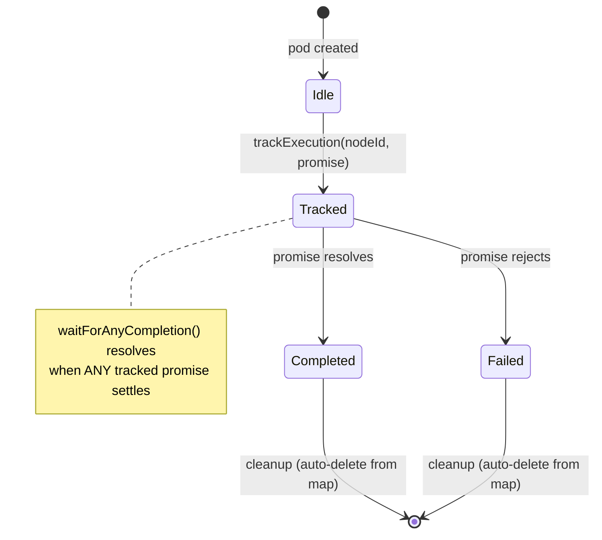

# Workshop: PodManager Execution Tracking

**Type**: State Machine
**Plan**: 033-real-agent-pods
**Spec**: [real-agent-pods-spec.md](../real-agent-pods-spec.md) (AC-27 through AC-30)
**Created**: 2026-02-16
**Status**: Draft

**Related Documents**:
- [Workshop 03: CLI-First Real Agent Execution](03-cli-first-real-agents.md) (driver loop design, `waitForAnyCompletion`)
- [Workshop 02: Unified AgentInstance / AgentManagerService Design](02-unified-agent-design.md) (AgentPod wraps IAgentInstance)
- `packages/positional-graph/src/features/030-orchestration/pod-manager.ts` (current implementation)
- `packages/positional-graph/src/features/030-orchestration/ods.ts` (fire-and-forget call site)
- `packages/positional-graph/src/features/030-orchestration/graph-orchestration.ts` (settle-decide-act loop)

---

## Purpose

Define how PodManager tracks fire-and-forget execution Promises so that the CLI driver loop (`cg wf run`) knows when agents complete and can re-enter the orchestration loop. This addresses timing between agent completion, session sync, and the next settle-decide-act iteration.

## Key Questions Addressed

- Q1: How does PodManager track promises from fire-and-forget `pod.execute()` calls?
- Q2: What happens when two pods complete simultaneously?
- Q3: When exactly does session sync happen relative to the settle-decide-act loop?
- Q4: How does `waitForAnyCompletion` interact with the driver loop?
- Q5: What about error handling in tracked promises?
- Q6: Who calls `trackExecution` — ODS or the driver loop?

---

## Current State: No Execution Tracking

Today, ODS fires `pod.execute()` without awaiting (line 121-127 of `ods.ts`):

```typescript
// 4. Fire and forget — DO NOT await
pod.execute({
  inputs: request.inputs,
  contextSessionId,
  ctx: { worktreePath: ctx.worktreePath },
  graphSlug: request.graphSlug,
});
```

The Promise is **discarded**. Results are discovered indirectly:
1. Agent raises events via CLI commands (`cg wf node accept`, `cg wf node end`)
2. Events are persisted to `state.json` on disk
3. Next `handle.run()` → settle phase reads `state.json` → state transitions
4. ONBAS sees new status and decides next action

**This works for fake agents** (they complete synchronously or near-instantly). **It does NOT work for real agents** that take 30-120+ seconds. The driver loop needs to know when to re-enter `handle.run()` — it can't just busy-loop.

---

## Execution State Diagram



**States per execution**:

| State | Meaning | In Map? |
|-------|---------|---------|
| Idle | Pod exists but not executing | No |
| Tracked | `execute()` Promise is being tracked | Yes |
| Completed | Promise resolved | Removed (via `.finally()`) |
| Failed | Promise rejected | Removed (via `.finally()`) |

---

## API Design

### New Methods on IPodManager

```typescript
export interface IPodManager {
  // ... existing methods ...

  /** Track a fire-and-forget execution promise. Auto-cleans on settle. */
  trackExecution(nodeId: string, promise: Promise<PodExecuteResult>): void;

  /** True if any tracked executions are in-flight. */
  hasRunningExecutions(): boolean;

  /** Resolves when any tracked execution settles. Returns the nodeId. */
  waitForAnyCompletion(): Promise<string | undefined>;

  /** Resolves when all tracked executions settle. For shutdown/cleanup. */
  waitForAllCompletions(): Promise<void>;
}
```

### Implementation

```typescript
export class PodManager implements IPodManager {
  // ... existing fields ...
  private readonly _runningExecutions = new Map<string, Promise<PodExecuteResult>>();

  trackExecution(nodeId: string, promise: Promise<PodExecuteResult>): void {
    this._runningExecutions.set(
      nodeId,
      promise.finally(() => {
        this._runningExecutions.delete(nodeId);
      }),
    );
  }

  hasRunningExecutions(): boolean {
    return this._runningExecutions.size > 0;
  }

  async waitForAnyCompletion(): Promise<string | undefined> {
    if (this._runningExecutions.size === 0) return undefined;

    const entries = [...this._runningExecutions.entries()];
    const result = await Promise.race(
      entries.map(async ([nodeId, promise]) => {
        await promise.catch(() => {}); // swallow — we just want to know it settled
        return nodeId;
      }),
    );
    return result;
  }

  async waitForAllCompletions(): Promise<void> {
    if (this._runningExecutions.size === 0) return;
    await Promise.allSettled([...this._runningExecutions.values()]);
  }
}
```

---

## Who Calls `trackExecution`?

**ODS** — immediately after fire-and-forget:

```typescript
// In ODS.handleAgentOrCode():

// 4. Fire and forget — DO NOT await, but TRACK
const executePromise = pod.execute({
  inputs: request.inputs,
  ctx: { worktreePath: ctx.worktreePath },
  graphSlug: request.graphSlug,
});
this.deps.podManager.trackExecution(nodeId, executePromise);
```

**Why ODS and not the driver loop?** ODS is where the Promise is created. The driver loop doesn't have access to it — `handle.run()` returns an `OrchestrationRunResult`, not the raw execute promises. ODS is the right place because it owns the fire-and-forget call.

---

## Driver Loop Integration

```
┌──────────────────────────────────────────────────────────┐
│ CLI Driver Loop (cg wf run)                               │
│                                                           │
│   while (iteration < maxIterations) {                     │
│     1. result = handle.run()  // settle-decide-act        │
│                                                           │
│     2. Check stopReason:                                  │
│        graph-complete → exit 0                            │
│        graph-failed  → exit 1                             │
│                                                           │
│     3. Wait for agents:                                   │
│        if (podManager.hasRunningExecutions()) {           │
│          nodeId = podManager.waitForAnyCompletion()       │
│          // sync session                                  │
│          pod = podManager.getPod(nodeId)                  │
│          if (pod?.sessionId) {                            │
│            podManager.setSessionId(nodeId, pod.sessionId) │
│          }                                                │
│          podManager.persistSessions(ctx, slug)            │
│        } else {                                           │
│          // Nothing running — graph is idle               │
│          await sleep(2000)                                │
│        }                                                  │
│                                                           │
│     4. Go to 1.                                           │
│   }                                                       │
└──────────────────────────────────────────────────────────┘
```

### Timing Sequence

```
t0  handle.run() → settle (nothing new) → decide → act
    ODS fires pod.execute() for node A (agent starts)
    ODS calls podManager.trackExecution('A', promise)
    handle.run() returns (action: started node A)

t1  Driver checks: podManager.hasRunningExecutions() → true
    Driver awaits: podManager.waitForAnyCompletion()
    ... agent runs for 30-120 seconds ...

t2  Agent calls: cg wf node accept my-graph A
    → Events written to state.json on disk

t3  Agent calls: cg wf node end my-graph A --message "Done"
    → More events written to state.json

t4  Agent process exits → adapter.run() resolves → pod.execute() resolves
    → trackExecution's .finally() removes 'A' from map
    → waitForAnyCompletion() resolves with 'A'

t5  Driver syncs session:
    podManager.setSessionId('A', pod.sessionId)
    podManager.persistSessions(ctx, slug)

t6  handle.run() → settle reads state.json → processes events
    → node A transitions starting → agent-accepted → complete
    → decide: ONBAS sees A complete, starts node B
    → act: ODS fires pod.execute() for node B
```

**Key insight**: Between t2-t3, the agent writes events to disk. Between t4-t6, the driver syncs sessions and re-enters the loop. The settle phase at t6 processes ALL events that accumulated since the last settle. This is safe because events are on disk — they can't be lost even if there's a gap between t3 and t6.

---

## Edge Cases

### Two Pods Complete Simultaneously

```
t0  handle.run() starts nodes A and B (parallel)
    trackExecution('A', promiseA)
    trackExecution('B', promiseB)

t1  waitForAnyCompletion() → races both promises

t2  Agent A finishes → promiseA resolves → returns 'A'
    Agent B finishes → promiseB resolves (but nobody awaited it yet)

t3  Driver syncs session for A
    Driver calls handle.run() again

t4  Settle processes events from BOTH A and B (both on disk)
    ONBAS sees both complete, starts successors

t5  But wait — B's promise resolved at t2, removed from map at t2
    podManager.hasRunningExecutions() → false (B already cleaned up)
    Driver does NOT need to wait again
```

**This is correct.** When B's promise resolves, `.finally()` removes it from the map. The next `handle.run()` settle phase picks up B's events from disk regardless of whether the driver explicitly waited for B. The Promise tracking is for WAITING, not for event discovery.

### Pod.execute() Throws

```typescript
trackExecution(nodeId: string, promise: Promise<PodExecuteResult>): void {
  this._runningExecutions.set(
    nodeId,
    promise.finally(() => {
      this._runningExecutions.delete(nodeId);  // cleanup on both resolve AND reject
    }),
  );
}
```

`.finally()` fires on both resolve and reject. The execution is removed from the map either way. `waitForAnyCompletion` uses `.catch(() => {})` to swallow the rejection — it just needs to know the promise settled, not whether it succeeded.

The settle phase handles the error case: if the agent crashed without raising events, the node stays in `starting` or `agent-accepted` state. A future stuck-node detector (out of scope for Plan 033) would handle this.

### No Running Executions (Idle Graph)

```typescript
if (podManager.hasRunningExecutions()) {
  await podManager.waitForAnyCompletion();
} else {
  // Graph is idle — waiting for external input
  // (user-input nodes, human answering questions)
  await sleep(2000);
}
```

When nothing is running, the driver polls every 2 seconds. This handles:
- User-input nodes waiting for `cg wf node end` from another terminal
- Agents paused for questions waiting for `cg wf node answer`

### trackExecution Called Twice for Same NodeId

```typescript
trackExecution(nodeId: string, promise: Promise<PodExecuteResult>): void {
  // Overwrites — the old promise's .finally() still fires but
  // it deletes the key that now points to the new promise.
  // This is safe because the old execution is abandoned.
  this._runningExecutions.set(nodeId, promise.finally(...));
}
```

This shouldn't happen in normal flow (a node doesn't execute twice simultaneously). If it does, the latest promise wins. The old promise's `.finally()` deletes the entry, but the Map already points to the new promise — a subtle race. **Mitigation**: guard in ODS that checks if the node already has a tracked execution before starting a new one.

---

## Session Sync Ordering

Session sync must happen AFTER the promise resolves (agent finished → sessionId available) and BEFORE the next `handle.run()` (so successor nodes can inherit).

```
Promise resolves → .finally() cleans tracking map
                 → waitForAnyCompletion() resolves
                 → Driver reads pod.sessionId (set by AgentInstance.run())
                 → podManager.setSessionId(nodeId, sessionId)
                 → podManager.persistSessions() → pod-sessions.json updated
                 → handle.run() → settle → decide → inherit session
```

**Race-free because**: The driver is single-threaded (Node.js event loop). Between `waitForAnyCompletion()` resolving and the next `handle.run()`, the driver synchronously syncs the session. No other code runs in between.

---

## Testing Strategy

### Unit Tests for PodManager Execution Tracking

```typescript
describe('PodManager execution tracking', () => {
  it('trackExecution adds to running map', () => {
    const pm = new PodManager(nodeFs);
    const promise = new Promise<PodExecuteResult>(() => {}); // never resolves
    pm.trackExecution('node-a', promise);
    expect(pm.hasRunningExecutions()).toBe(true);
  });

  it('hasRunningExecutions returns false when empty', () => {
    const pm = new PodManager(nodeFs);
    expect(pm.hasRunningExecutions()).toBe(false);
  });

  it('execution removed from map on resolve', async () => {
    const pm = new PodManager(nodeFs);
    let resolve!: (value: PodExecuteResult) => void;
    const promise = new Promise<PodExecuteResult>((r) => { resolve = r; });
    pm.trackExecution('node-a', promise);

    resolve({ outcome: 'completed', sessionId: 'ses-1' });
    await promise;
    // Allow .finally() microtask to run
    await new Promise((r) => setTimeout(r, 0));

    expect(pm.hasRunningExecutions()).toBe(false);
  });

  it('execution removed from map on reject', async () => {
    const pm = new PodManager(nodeFs);
    let reject!: (reason: Error) => void;
    const promise = new Promise<PodExecuteResult>((_, r) => { reject = r; });
    pm.trackExecution('node-a', promise);

    reject(new Error('agent crashed'));
    await promise.catch(() => {});
    await new Promise((r) => setTimeout(r, 0));

    expect(pm.hasRunningExecutions()).toBe(false);
  });

  it('waitForAnyCompletion resolves with nodeId', async () => {
    const pm = new PodManager(nodeFs);
    let resolve!: (value: PodExecuteResult) => void;
    const promise = new Promise<PodExecuteResult>((r) => { resolve = r; });
    pm.trackExecution('node-a', promise);

    // Resolve in next tick
    setTimeout(() => resolve({ outcome: 'completed', sessionId: 'ses-1' }), 10);

    const nodeId = await pm.waitForAnyCompletion();
    expect(nodeId).toBe('node-a');
  });

  it('waitForAnyCompletion returns first to complete', async () => {
    const pm = new PodManager(nodeFs);
    let resolveA!: (value: PodExecuteResult) => void;
    let resolveB!: (value: PodExecuteResult) => void;
    const promiseA = new Promise<PodExecuteResult>((r) => { resolveA = r; });
    const promiseB = new Promise<PodExecuteResult>((r) => { resolveB = r; });
    pm.trackExecution('node-a', promiseA);
    pm.trackExecution('node-b', promiseB);

    // B finishes first
    setTimeout(() => resolveB({ outcome: 'completed', sessionId: 'ses-2' }), 10);
    setTimeout(() => resolveA({ outcome: 'completed', sessionId: 'ses-1' }), 50);

    const nodeId = await pm.waitForAnyCompletion();
    expect(nodeId).toBe('node-b');
  });

  it('waitForAnyCompletion returns undefined when no executions', async () => {
    const pm = new PodManager(nodeFs);
    const result = await pm.waitForAnyCompletion();
    expect(result).toBeUndefined();
  });

  it('waitForAllCompletions waits for everything', async () => {
    const pm = new PodManager(nodeFs);
    let resolveA!: (value: PodExecuteResult) => void;
    let resolveB!: (value: PodExecuteResult) => void;
    const promiseA = new Promise<PodExecuteResult>((r) => { resolveA = r; });
    const promiseB = new Promise<PodExecuteResult>((r) => { resolveB = r; });
    pm.trackExecution('node-a', promiseA);
    pm.trackExecution('node-b', promiseB);

    setTimeout(() => resolveA({ outcome: 'completed', sessionId: 'ses-1' }), 10);
    setTimeout(() => resolveB({ outcome: 'completed', sessionId: 'ses-2' }), 20);

    await pm.waitForAllCompletions();
    expect(pm.hasRunningExecutions()).toBe(false);
  });
});
```

---

## Open Questions

### Q1: Should `waitForAnyCompletion` return the PodExecuteResult?

**OPEN**: Currently returns `string | undefined` (nodeId). Returning the result too would save a lookup:

```typescript
async waitForAnyCompletion(): Promise<{ nodeId: string; result: PodExecuteResult } | undefined>
```

**Recommendation**: Just return nodeId. The driver reads `pod.sessionId` after, which comes from the AgentInstance, not from PodExecuteResult. The result is useful for logging but not required for session sync.

### Q2: Should PodManager auto-sync sessions on completion?

**OPEN**: Instead of the driver manually calling `setSessionId` after each completion, PodManager could auto-sync:

```typescript
trackExecution(nodeId: string, promise: Promise<PodExecuteResult>): void {
  this._runningExecutions.set(nodeId, promise.then((result) => {
    if (result.sessionId) this.setSessionId(nodeId, result.sessionId);
    return result;
  }).finally(() => this._runningExecutions.delete(nodeId)));
}
```

**Recommendation**: No — keep session sync explicit in the driver. Auto-sync hides a side effect inside `trackExecution` and makes testing harder. The driver's sync logic is 3 lines and clearly documents when sessions are persisted.

---

## Quick Reference

```typescript
// ODS: Track the fire-and-forget promise
const promise = pod.execute(options);
podManager.trackExecution(nodeId, promise);

// Driver loop: Wait for agents
if (podManager.hasRunningExecutions()) {
  const nodeId = await podManager.waitForAnyCompletion();
  // Sync session
  const pod = podManager.getPod(nodeId);
  if (pod?.sessionId) podManager.setSessionId(nodeId, pod.sessionId);
  await podManager.persistSessions(ctx, slug);
}

// Cleanup: Wait for everything
await podManager.waitForAllCompletions();
```
