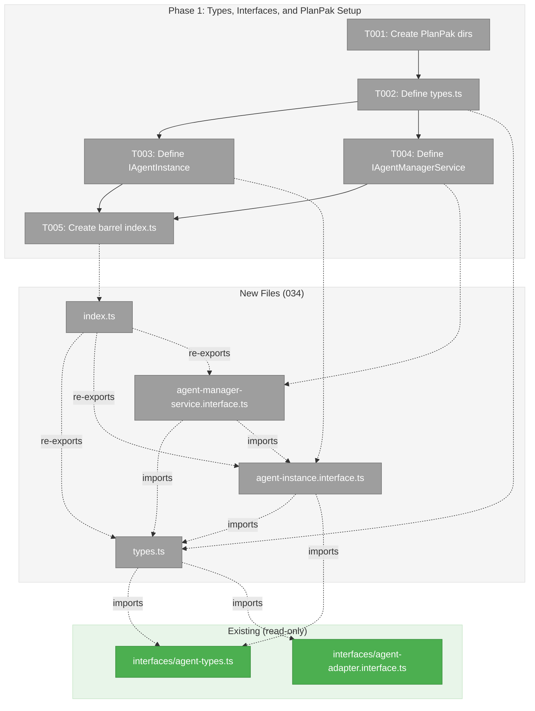
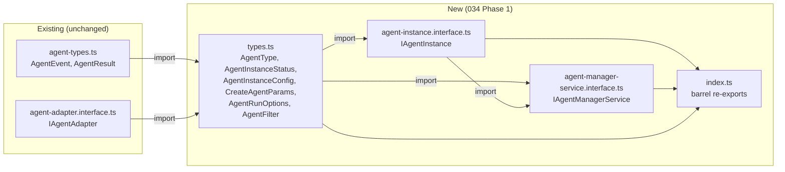
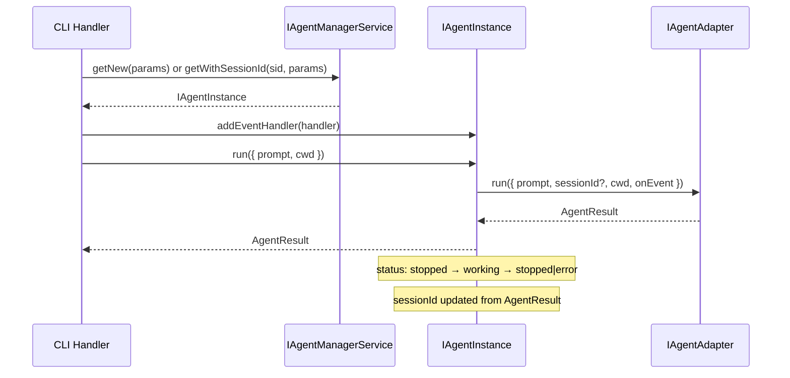

# Phase 1: Types, Interfaces, and PlanPak Setup – Tasks & Alignment Brief

**Spec**: [agentic-cli-spec.md](../../agentic-cli-spec.md)
**Plan**: [agentic-cli-plan.md](../../agentic-cli-plan.md)
**Date**: 2026-02-16

---

## Executive Briefing

### Purpose

This phase defines all type contracts and creates the PlanPak directory structure for Plan 034's agent system redesign. It establishes the foundational interfaces — `IAgentInstance` and `IAgentManagerService` — that every subsequent phase builds on. Nothing is implemented; everything compiles.

### What We're Building

A complete type-level contract for the redesigned agent system:
- `IAgentInstance`: domain-agnostic agent wrapper with event pass-through, freeform metadata, 3-state status model, and `compact()` support
- `IAgentManagerService`: agent lifecycle manager with `getNew()` / `getWithSessionId()` API and same-instance guarantee
- Supporting types: `AgentInstanceConfig`, `CreateAgentParams`, `AgentRunOptions` (instance-level), `AgentEventHandler`, `AgentInstanceStatus`, `AgentFilter`, `AgentType`

### User Value

These interfaces are the shared contract that enables the CLI, orchestration system, and future web UI to all work with agents through one cohesive API. Getting the types right here prevents rework across all five phases.

### Example

```typescript
// After Phase 1, this compiles but has no implementation:
import { IAgentInstance, IAgentManagerService, CreateAgentParams } from '@features/034-agentic-cli';

function useAgent(manager: IAgentManagerService): IAgentInstance {
  return manager.getNew({ name: 'demo', type: 'claude-code', workspace: '/tmp' });
}
```

---

## Objectives & Scope

### Objective

Define all type contracts for the redesigned agent system per Workshop 02 specification. Establish PlanPak directory structure. Ensure everything compiles (`tsc --noEmit`). Express AC-01, AC-02, AC-03, AC-10, AC-13 as type definitions.

### Goals

- ✅ Create PlanPak feature folders (shared, cli, test)
- ✅ Define `AgentType`, `AgentInstanceStatus`, `AgentEventHandler`, `AgentInstanceConfig`, `CreateAgentParams`, `AgentRunOptions`, `AgentFilter`
- ✅ Define `IAgentInstance` with all properties and methods per AC-01 (no `getEvents`/`setIntent` per AC-02)
- ✅ Define `IAgentManagerService` with `getNew`, `getWithSessionId`, `getAgent`, `getAgents`, `terminateAgent`, `initialize`
- ✅ Create barrel exports so all types are importable from the feature folder

### Non-Goals

- ❌ Implementation code (Phase 2)
- ❌ Fakes (`FakeAgentInstance`, `FakeAgentManagerService`) — only the `fakes/` directory is created (Phase 2)
- ❌ Tests — no tests needed for interfaces-only phase
- ❌ DI container registration or token constants (Phase 3)
- ❌ Package-level barrel exports from `@chainglass/shared` (Phase 5)
- ❌ Modifying any Plan 019 files — old interfaces stay as-is
- ❌ `AdapterFactory` type — already exported from Plan 019, reuse via import

---

## Pre-Implementation Audit

### Summary

| File | Action | Origin | Modified By | Recommendation |
|------|--------|--------|-------------|----------------|
| `packages/shared/src/features/034-agentic-cli/` | Create dir | 034 | — | keep-as-is |
| `packages/shared/src/features/034-agentic-cli/fakes/` | Create dir | 034 | — | keep-as-is |
| `apps/cli/src/features/034-agentic-cli/` | Create dir | 034 | — | keep-as-is |
| `test/unit/features/034-agentic-cli/` | Create dir | 034 | — | keep-as-is |
| `packages/shared/src/features/034-agentic-cli/types.ts` | Create | 034 | — | See duplication notes |
| `packages/shared/src/features/034-agentic-cli/agent-instance.interface.ts` | Create | 034 | — | Intentional redesign of 019 |
| `packages/shared/src/features/034-agentic-cli/agent-manager-service.interface.ts` | Create | 034 | — | Intentional redesign of 019 |
| `packages/shared/src/features/034-agentic-cli/index.ts` | Create | 034 | — | Standard barrel |

### Per-File Detail

#### `types.ts` — Duplication Findings

| Planned Type | Existing Location | Overlap | Decision |
|---|---|---|---|
| `AgentType` | `019/agent-instance.interface.ts:19` | Identical `'claude-code' \| 'copilot'` | Re-define in 034 (PlanPak isolation) |
| `AgentInstanceStatus` | `019/agent-instance.interface.ts:29` | Identical 3-state model | Re-define in 034 (PlanPak isolation) |
| `AgentEventHandler` | `interfaces/agent-types.ts:217` | Exact `(event: AgentEvent) => void` | Re-export from `interfaces/agent-types.ts` |
| `AgentInstanceConfig` | `019/agent-instance.ts:35` | Partial — 034 adds `sessionId`, `metadata`; removes `adapter` (separate constructor dep per DYK-P5#2) | New definition (different shape) |
| `CreateAgentParams` | `019/agent-manager.interface.ts:19` | Partial — 034 may differ | New definition |
| `AgentRunOptions` | `interfaces/agent-types.ts:57` + `019/...` | 034 removes `sessionId`, adds `timeoutMs` | New definition (instance-level) |
| `AgentFilter` | `019/agent-manager.interface.ts:33` | Likely identical `{workspace?}` | New definition (PlanPak isolation) |

**Strategy**: Types that are semantically new or have different shapes get fresh definitions. `AgentEventHandler` is re-exported from the existing shared location to avoid two identical definitions. All new types import `AgentEvent` and `AgentResult` from `../../interfaces/agent-types.js`. `IAgentAdapter` is NOT imported in types.ts — the adapter is a constructor dependency passed separately to `AgentInstance`/`FakeAgentInstance` (not part of `AgentInstanceConfig`). Config = identity + settings (serializable). Dependencies = collaborators (separate params). Per DYK-P5#2.

#### `agent-instance.interface.ts` / `agent-manager-service.interface.ts` — Intentional Redesign

These are deliberate replacements of the Plan 019 interfaces per Workshop 02 design. The 019 files remain untouched; consumers choose which feature folder to import from. TypeScript will flag web consumers that still import the old 019 interface when the shape changes (deliberate per spec Q6).

### Compliance Check

| ADR | Requirement | Status | Notes |
|-----|-------------|--------|-------|
| ADR-0011 | Interface + fake layering | ✅ | Interfaces in Phase 1; fakes planned for Phase 2 |
| ADR-0004 | Decorator-free DI | ✅ | Phase 1 is interfaces-only; no DI registration needed |
| PlanPak | All new files in `features/034-agentic-cli/` | ✅ | All paths verified |

No violations found.

---

## Requirements Traceability

### Coverage Matrix

| AC | Description | Flow Summary | Files in Flow | Tasks | Status |
|----|-------------|-------------|---------------|-------|--------|
| AC-01 | IAgentInstance exposes id, name, type, workspace, status, isRunning, sessionId, createdAt, updatedAt, metadata, setMetadata, addEventHandler, removeEventHandler, run, compact, terminate | types.ts (AgentType, AgentInstanceStatus, AgentRunOptions, AgentEventHandler) → agent-instance.interface.ts (IAgentInstance) → index.ts | 3 | T002, T003, T005 | ✅ Complete |
| AC-02 | IAgentInstance does NOT expose getEvents, setIntent, notifier, storage | Verified by absence in T003 | 1 | T003 | ✅ Complete |
| AC-03 | Status model has exactly 3 states: working, stopped, error | AgentInstanceStatus in types.ts → referenced by IAgentInstance.status | 2 | T002, T003 | ✅ Complete |
| AC-10 | metadata is `Readonly<Record<string, unknown>>`, settable at creation, updatable via setMetadata | IAgentInstance.metadata + setMetadata in T003, AgentInstanceConfig.metadata in T002 | 2 | T002, T003 | ✅ Complete |
| AC-13 | AgentInstanceConfig accepts optional sessionId and metadata | AgentInstanceConfig in types.ts | 1 | T002 | ✅ Complete |

### Gaps Found

**Gap 1 (resolved)**: `AgentType` was not in original plan task 1.1 success criteria. Added to T002 deliverables — without it, `CreateAgentParams.type`, `AgentInstanceConfig.type`, and `IAgentInstance.type` cannot compile.

**Gap 2 (documented)**: Three `AgentRunOptions` exist across the codebase. The 034 version is instance-level (no `sessionId`, adds `timeoutMs`). JSDoc comments will disambiguate.

### Orphan Files

None. All files map to at least one AC flow.

### Import Chain

```
EXISTING (unchanged, imported by 034):
  interfaces/agent-types.ts → AgentResult, AgentEvent, AgentEventHandler, TokenMetrics
  interfaces/agent-adapter.interface.ts → IAgentAdapter

NEW (034 Phase 1):
  types.ts ──imports──→ agent-types.ts (AgentEvent, AgentResult, AgentEventHandler)
           ──defines──→ AgentType, AgentInstanceStatus, AgentInstanceConfig,
                        CreateAgentParams, AgentRunOptions, AgentCompactOptions, AgentFilter

  agent-instance.interface.ts ──imports──→ types.ts (local types)
                              ──imports──→ agent-types.ts (AgentResult)
                              ──defines──→ IAgentInstance

  agent-manager-service.interface.ts ──imports──→ types.ts (CreateAgentParams, AgentFilter)
                                     ──imports──→ agent-instance.interface.ts (IAgentInstance)
                                     ──defines──→ IAgentManagerService

  index.ts ──re-exports──→ all of the above
```

---

## Architecture Map

### Component Diagram

<!-- Status: grey=pending, orange=in-progress, green=completed, red=blocked -->
<!-- Updated by plan-6 during implementation -->



### Task-to-Component Mapping

<!-- Status: ⬜ Pending | 🟧 In Progress | ✅ Complete | 🔴 Blocked -->

| Task | Component(s) | Files | Status | Comment |
|------|-------------|-------|--------|---------|
| T001 | Directory Structure | 4 directories | ⬜ Pending | PlanPak feature folders for shared, cli, test, fakes |
| T002 | Type Definitions | types.ts | ⬜ Pending | All supporting types + re-exports |
| T003 | Agent Instance Interface | agent-instance.interface.ts | ⬜ Pending | IAgentInstance per Workshop 02 |
| T004 | Agent Manager Interface | agent-manager-service.interface.ts | ⬜ Pending | IAgentManagerService with getNew/getWithSessionId |
| T005 | Barrel Exports | index.ts | ⬜ Pending | Re-exports all types and interfaces |

---

## Tasks

| Status | ID | Task | CS | Type | Dependencies | Absolute Path(s) | Validation | Subtasks | Notes |
|--------|------|------|-----|------|-------------|-------------------|------------|----------|-------|
| [ ] | T001 | Create PlanPak feature folder structure: `packages/shared/src/features/034-agentic-cli/`, `packages/shared/src/features/034-agentic-cli/fakes/`, `apps/cli/src/features/034-agentic-cli/`, `test/unit/features/034-agentic-cli/` | 1 | Setup | – | `/home/jak/substrate/033-real-agent-pods/packages/shared/src/features/034-agentic-cli/`, `/home/jak/substrate/033-real-agent-pods/packages/shared/src/features/034-agentic-cli/fakes/`, `/home/jak/substrate/033-real-agent-pods/apps/cli/src/features/034-agentic-cli/`, `/home/jak/substrate/033-real-agent-pods/test/unit/features/034-agentic-cli/` | All 4 directories exist | – | plan-scoped; maps to plan task 1.0 |
| [ ] | T002 | Define `types.ts` with: `AgentType`, `AgentInstanceStatus` (3-state: working/stopped/error), `AgentEventHandler` (re-export from `interfaces/agent-types.ts`), `AgentInstanceConfig` (id, name, type, workspace, sessionId?, metadata? — NO adapter; adapter is a separate constructor dependency per DYK-P5#2), `CreateAgentParams` (name, type, workspace, metadata?), `AgentRunOptions` (instance-level: prompt, cwd?, onEvent?, timeoutMs?), `AgentCompactOptions` (timeoutMs?), `AgentFilter` (type?, workspace?). Import `AgentEvent`, `AgentResult` from `../../interfaces/agent-types.js`. | 2 | Core | T001 | `/home/jak/substrate/033-real-agent-pods/packages/shared/src/features/034-agentic-cli/types.ts` | All 8 types compile; `tsc --noEmit` passes; JSDoc distinguishes instance-level `AgentRunOptions` from adapter-level; `AgentInstanceConfig` does NOT include adapter | – | plan-scoped; maps to plan task 1.1; AgentType added per requirements tracing Gap 1; timeoutMs per Discovery 09; AgentCompactOptions per DYK-P5#1; adapter removed from config per DYK-P5#2 |
| [ ] | T003 | Define `IAgentInstance` interface with: readonly props (id, name, type, workspace, status, isRunning, sessionId, createdAt, updatedAt, metadata), methods (setMetadata, addEventHandler, removeEventHandler, run, compact, terminate). `run(options)` returns `Promise<AgentResult>`, `compact(options?)` returns `Promise<AgentResult>` (accepts optional `AgentCompactOptions` for timeoutMs), `terminate()` returns `Promise<AgentResult>`. NO `getEvents()`, `setIntent()`, notifier, or storage. | 2 | Core | T002 | `/home/jak/substrate/033-real-agent-pods/packages/shared/src/features/034-agentic-cli/agent-instance.interface.ts` | Interface compiles; exposes exactly the members per AC-01; does NOT expose AC-02 members; `isRunning` is `boolean` (AC-11); `metadata` is `Readonly<Record<string, unknown>>` (AC-10); `compact()` accepts optional `AgentCompactOptions` per DYK-P5#1 | – | plan-scoped; maps to plan task 1.2; per ADR-0011 interface-first |
| [ ] | T004 | Define `IAgentManagerService` interface with: `getNew(params)`, `getWithSessionId(sessionId, params)`, `getAgent(agentId)`, `getAgents(filter?)`, `terminateAgent(agentId)`, `initialize()`. JSDoc on `getWithSessionId` documents same-instance guarantee. Constructor constraint documented: accepts only `AdapterFactory`. | 2 | Core | T002, T003 | `/home/jak/substrate/033-real-agent-pods/packages/shared/src/features/034-agentic-cli/agent-manager-service.interface.ts` | Interface compiles; all 6 methods present; JSDoc documents same-instance guarantee (AC-16); no notifier/storage params (AC-21) | – | plan-scoped; maps to plan task 1.3; per ADR-0011 interface-first |
| [ ] | T005 | Create barrel `index.ts` re-exporting all types from `./types.js`, `IAgentInstance` from `./agent-instance.interface.js`, `IAgentManagerService` from `./agent-manager-service.interface.js`. | 1 | Core | T002, T003, T004 | `/home/jak/substrate/033-real-agent-pods/packages/shared/src/features/034-agentic-cli/index.ts` | All types and interfaces importable via `from '../features/034-agentic-cli/index.js'`; `tsc --noEmit` passes on the full project | – | plan-scoped; maps to plan task 1.4 |

---

## Alignment Brief

### Critical Findings Affecting This Phase

| Finding | Constraint | Addressed By |
|---------|-----------|-------------|
| Discovery 01: AgentInstance 425 lines of web-coupled code | New `IAgentInstance` must NOT include notifier, storage, or event storage | T003 (AC-02 explicitly verified) |
| Discovery 09: Timeout Enforcement Gap | `AgentRunOptions` must include optional `timeoutMs` field | T002 (timeoutMs in AgentRunOptions) |
| Discovery 10: Compact Differs Between Adapters | `IAgentInstance` must include `compact()` returning `Promise<AgentResult>` | T003 (compact method on interface) |

### ADR Decision Constraints

| ADR | Decision | Phase 1 Constraint | Addressed By |
|-----|----------|-------------------|-------------|
| ADR-0011 | First-class domain concepts with interface + fake | Define interfaces first; fakes follow in Phase 2 | T003, T004 |
| ADR-0004 | Decorator-free DI, token constants | No DI registration in Phase 1 (interfaces only); token constants deferred to Phase 3 | N/A for Phase 1 |
| ADR-0006 | CLI-based orchestration | `AgentRunOptions` excludes `sessionId` (instance owns it), CWD via `cwd?` option | T002 |
| ADR-0010 | AgentNotifierService removal documented | `IAgentInstance` does not depend on notifier | T003 |

### PlanPak Placement Rules

- **Plan-scoped files** → `features/034-agentic-cli/` (flat, descriptive names)
- **Cross-cutting files** → not applicable in Phase 1
- **Dependency direction**: 034 types import from `interfaces/` (shared) — never the reverse
- **Test location**: `test/unit/features/034-agentic-cli/` (directory created, no tests in Phase 1)

### Invariants & Guardrails

- `IAgentAdapter` interface is **unchanged** (AC-48) — import only, never modify
- `AgentEvent` discriminated union is reused from `interfaces/agent-types.ts` — no new event types
- `AgentResult` is reused from `interfaces/agent-types.ts` — no shape changes
- Plan 019 files are **not modified** — old and new interfaces coexist
- Web compile errors from this change are **deliberate** (spec Q6)

### Inputs to Read

| File | Why |
|------|-----|
| `/home/jak/substrate/033-real-agent-pods/packages/shared/src/interfaces/agent-types.ts` | Source of `AgentEvent`, `AgentResult`, `AgentEventHandler` |
| `/home/jak/substrate/033-real-agent-pods/packages/shared/src/interfaces/agent-adapter.interface.ts` | Source of `IAgentAdapter` |
| `/home/jak/substrate/033-real-agent-pods/packages/shared/src/features/019-agent-manager-refactor/agent-instance.interface.ts` | Reference for redesign (what to keep vs remove) |
| `/home/jak/substrate/033-real-agent-pods/packages/shared/src/features/019-agent-manager-refactor/agent-manager.interface.ts` | Reference for redesign (what to keep vs remove) |
| `/home/jak/substrate/033-real-agent-pods/docs/plans/033-real-agent-pods/workshops/02-unified-agent-design.md` | Authoritative interface design |

### Visual Alignment: System Flow



### Sequence: How Interfaces Will Be Used (Phase 2+)



### Test Plan

**Phase 1 has no tests.** Interfaces-only phase — validation is via `tsc --noEmit`. Tests begin in Phase 2 (TDD: write tests first, then implement).

The `test/unit/features/034-agentic-cli/` directory is created empty as a placeholder for Phase 2.

### Step-by-Step Implementation Outline

1. **T001**: `mkdir -p` for all 4 PlanPak directories
2. **T002**: Create `types.ts`:
   - Import `AgentEvent`, `AgentResult` from `../../interfaces/agent-types.js`
   - Re-export `AgentEventHandler` from `../../interfaces/agent-types.js`
   - Define `AgentType = 'claude-code' | 'copilot'`
   - Define `AgentInstanceStatus = 'working' | 'stopped' | 'error'`
   - Define `AgentInstanceConfig` with id, name, type, workspace, sessionId?, metadata? (NO adapter — separate constructor dep)
   - Define `AgentCompactOptions` with timeoutMs?
   - Define `CreateAgentParams` with name, type, workspace, metadata?
   - Define `AgentRunOptions` (instance-level) with prompt, cwd?, onEvent?, timeoutMs?
   - Define `AgentFilter` with type?, workspace?
3. **T003**: Create `agent-instance.interface.ts`:
   - Import local types from `./types.js`
   - Import `AgentResult` from `../../interfaces/agent-types.js`
   - Define `IAgentInstance` per AC-01 (see Workshop 02 § The AgentInstance Entity)
   - Verify AC-02 exclusions (no getEvents, setIntent, notifier, storage)
4. **T004**: Create `agent-manager-service.interface.ts`:
   - Import `CreateAgentParams`, `AgentFilter` from `./types.js`
   - Import `IAgentInstance` from `./agent-instance.interface.js`
   - Define `IAgentManagerService` with getNew, getWithSessionId, getAgent, getAgents, terminateAgent, initialize
   - JSDoc documenting same-instance guarantee on `getWithSessionId`
5. **T005**: Create `index.ts`:
   - `export * from './types.js'`
   - `export type { IAgentInstance } from './agent-instance.interface.js'`
   - `export type { IAgentManagerService } from './agent-manager-service.interface.js'`

### Commands to Run

```bash
# After implementation — verify compilation
cd /home/jak/substrate/033-real-agent-pods
pnpm exec tsc --noEmit

# Full quality check
just fft
```

### Risks & Unknowns

| Risk | Severity | Mitigation |
|------|----------|------------|
| Type naming conflicts with Plan 019 | Medium | Use distinct imports from 034 feature folder; 019 stays as-is |
| `AgentRunOptions` cognitive collision (3 versions across codebase) | Low | JSDoc comments disambiguate; instance-level vs adapter-level |
| `.js` extension in TypeScript imports | Low | Follow existing project convention (check existing feature barrels) |

### Ready Check

- [x] ADR constraints mapped to tasks (ADR-0011 → T003/T004, ADR-0004 → N/A, ADR-0006 → T002, ADR-0010 → T003)
- [x] All Phase 1 acceptance criteria traced to tasks
- [x] Pre-implementation audit complete — no violations
- [x] Requirements flow — all gaps resolved (AgentType added to T002)
- [x] PlanPak paths verified for all new files
- [ ] **Awaiting human GO/NO-GO**

---

## Phase Footnote Stubs

_Empty — populated by plan-6 during implementation._

| Footnote | Task | Description | Reference |
|----------|------|-------------|-----------|
| | | | |

---

## Evidence Artifacts

- **Execution log**: `docs/plans/034-agentic-cli/tasks/phase-1-types-interfaces-and-planpak-setup/execution.log.md` (created by plan-6)
- **Flight plan**: `docs/plans/034-agentic-cli/tasks/phase-1-types-interfaces-and-planpak-setup/tasks.fltplan.md` (generated next)

---

## Discoveries & Learnings

_Populated during implementation by plan-6. Log anything of interest to your future self._

| Date | Task | Type | Discovery | Resolution | References |
|------|------|------|-----------|------------|------------|
| | | | | | |

**Types**: `gotcha` | `research-needed` | `unexpected-behavior` | `workaround` | `decision` | `debt` | `insight`

**What to log**:
- Things that didn't work as expected
- External research that was required
- Implementation troubles and how they were resolved
- Gotchas and edge cases discovered
- Decisions made during implementation
- Technical debt introduced (and why)
- Insights that future phases should know about

_See also: `execution.log.md` for detailed narrative._

---

## Directory Layout

```
docs/plans/034-agentic-cli/
  ├── agentic-cli-plan.md
  ├── agentic-cli-spec.md
  ├── workshops/
  │   └── 01-cli-agent-run-and-e2e-testing.md
  └── tasks/
      └── phase-1-types-interfaces-and-planpak-setup/
          ├── tasks.md                 ← this file
          ├── tasks.fltplan.md         # generated by /plan-5b
          └── execution.log.md         # created by /plan-6
```
