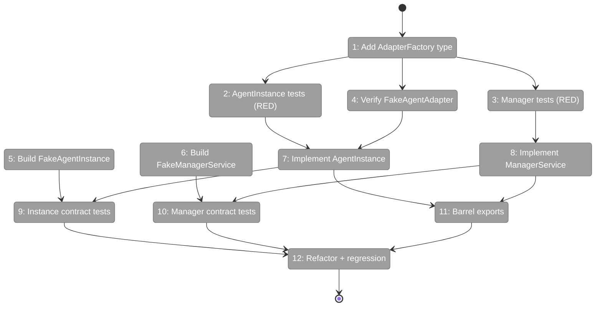
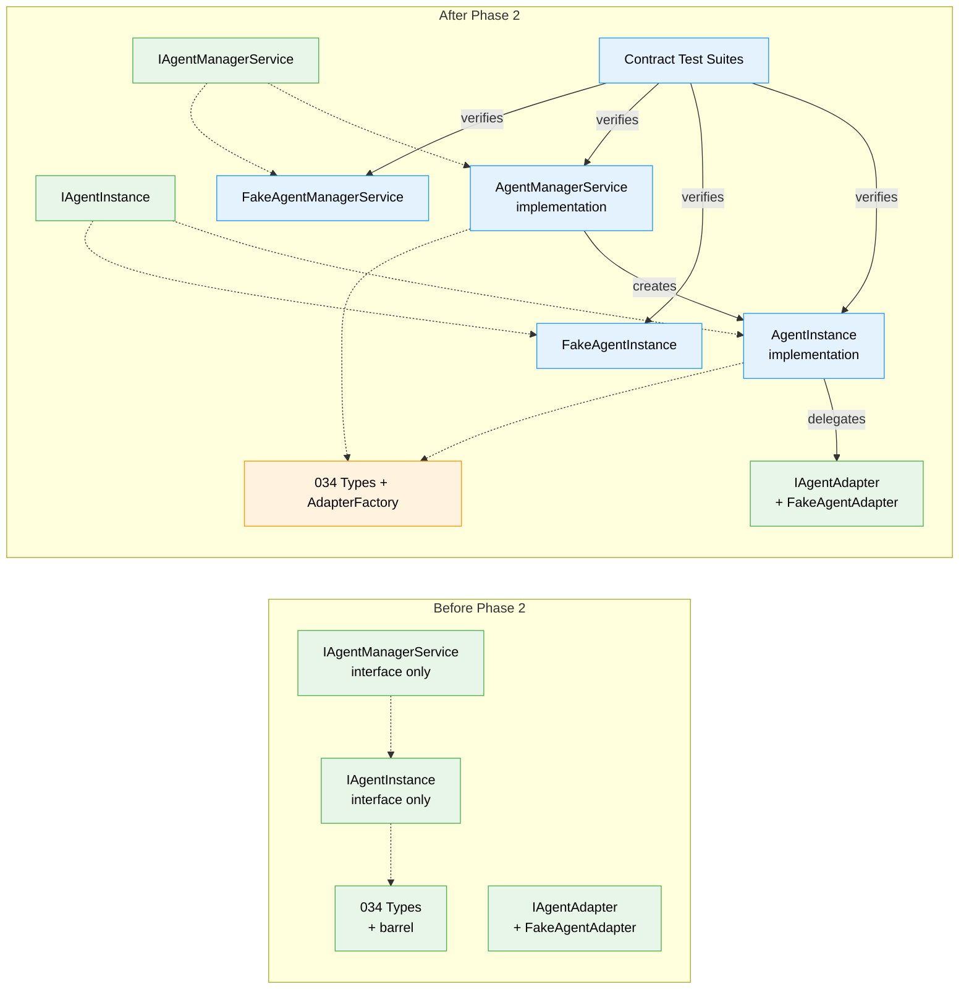

# Flight Plan: Phase 2 — Core Implementation with TDD

**Plan**: [agentic-cli-plan.md](../../agentic-cli-plan.md)
**Phase**: Phase 2: Core Implementation with TDD
**Generated**: 2026-02-16
**Status**: Ready for takeoff

---

## Departure → Destination

**Where we are**: Phase 1 established the type-level contracts — `IAgentInstance`, `IAgentManagerService`, and all supporting types compile but have zero implementation behind them. The PlanPak directories exist and the barrel exports work, but you can't create, run, or manage any agents yet.

**Where we're going**: By the end of this phase, a developer can create an `AgentInstance`, run prompts through it, compact sessions, terminate agents, and register event handlers — all backed by real implementations with full TDD coverage. An `AgentManagerService` will manage agent lifecycles with a session index and same-instance guarantee. Matching fakes (`FakeAgentInstance`, `FakeAgentManagerService`) will let consumers write fast, deterministic tests. Contract test suites will prove the fakes behave identically to the real implementations.

---

## Flight Status

<!-- Updated by /plan-6: pending → active → done. Use blocked for problems/input needed. -->

**Legend**: grey = pending | yellow = active | red = blocked/needs input | green = done

---

## Stages

<!-- Updated by /plan-6 during implementation: [ ] → [~] → [x] -->

- [ ] **Stage 1: Add AdapterFactory type** — define the factory type in `types.ts` and re-export from the barrel (`034-agentic-cli/types.ts`, `034-agentic-cli/index.ts`)
- [ ] **Stage 2: Write AgentInstance unit tests** — RED phase: ~20 tests covering status transitions, event dispatch, compact, terminate — all fail initially (`agent-instance.test.ts` — new file)
- [ ] **Stage 3: Write AgentManagerService unit tests** — RED phase: ~12 tests covering getNew, getWithSessionId, same-instance guarantee, session index — all fail initially (`agent-manager-service.test.ts` — new file)
- [ ] **Stage 4: Verify FakeAgentAdapter compact support** — confirm compact() works and document per-test adapter creation patterns (read-only: `fakes/fake-agent-adapter.ts`)
- [ ] **Stage 5: Build FakeAgentInstance** — test double with helpers: setStatus, assertRunCalled, reset (`034-agentic-cli/fakes/fake-agent-instance.ts` — new file)
- [ ] **Stage 6: Build FakeAgentManagerService** — test double with same-instance guarantee and helpers: addAgent, getCreatedAgents, reset (`034-agentic-cli/fakes/fake-agent-manager-service.ts` — new file)
- [ ] **Stage 7: Implement AgentInstance** — GREEN phase: make all unit tests pass — status model, event pass-through, metadata, compact, terminate (`034-agentic-cli/agent-instance.ts` — new file)
- [ ] **Stage 8: Implement AgentManagerService** — GREEN phase: make all unit tests pass — session index, same-instance guarantee, internal post-run callback (`034-agentic-cli/agent-manager-service.ts` — new file)
- [ ] **Stage 9: Write IAgentInstance contract tests** — shared test suite running against both AgentInstance (with FakeAgentAdapter) and FakeAgentInstance (`agent-instance-contract.test.ts` — new file)
- [ ] **Stage 10: Write IAgentManagerService contract tests** — shared test suite running against both real and fake managers (`agent-manager-contract.test.ts` — new file)
- [ ] **Stage 11: Update barrel exports** — create fakes barrel, add implementations and fakes to feature barrel (`034-agentic-cli/fakes/index.ts` — new file, `034-agentic-cli/index.ts`)
- [ ] **Stage 12: Refactor and regression check** — clean up code quality, run `just fft` to verify zero regressions

---

## Acceptance Criteria

- [ ] AgentInstance: run() transitions stopped→working→stopped|error (AC-04)
- [ ] AgentInstance: double-run guard throws (AC-05)
- [ ] AgentInstance: event handlers receive all adapter events (AC-06, AC-07, AC-08)
- [ ] AgentInstance: per-run onEvent works alongside registered handlers (AC-09)
- [ ] AgentInstance: metadata readable, writable via setMetadata (AC-10)
- [ ] AgentInstance: isRunning = true iff working (AC-11)
- [ ] AgentInstance: terminate always→stopped (AC-12)
- [ ] AgentInstance: compact transitions, guards, token metrics (AC-12a–AC-12d)
- [ ] AgentManagerService: getNew creates null-session instance (AC-14)
- [ ] AgentManagerService: getWithSessionId pre-sets session (AC-15)
- [ ] AgentManagerService: same-instance guarantee (AC-16, AC-17)
- [ ] AgentManagerService: getAgent, getAgents, terminateAgent (AC-18–AC-20)
- [ ] AgentManagerService: constructor accepts only AdapterFactory (AC-21)
- [ ] AgentManagerService: session index updated after run (AC-22)
- [ ] FakeAgentInstance implements IAgentInstance with test helpers (AC-23, AC-25)
- [ ] FakeAgentManagerService implements IAgentManagerService with helpers (AC-24, AC-25)
- [ ] Contract tests run against both real and fake (AC-26, AC-27, AC-28)
- [ ] All existing tests pass — just fft green (AC-47)

---

## Goals & Non-Goals

**Goals**:
- AgentInstance with status transitions, event pass-through, metadata, compact, terminate
- AgentManagerService with getNew/getWithSessionId, session index, same-instance guarantee
- FakeAgentInstance and FakeAgentManagerService with test helpers
- Contract test suites proving fake↔real parity
- Full TDD: RED tests first, then GREEN implementations
- `just fft` passes with no regressions

**Non-Goals**:
- CLI command updates (Phase 3)
- DI container registration (Phase 3)
- Real agent integration tests (Phase 4)
- Package-level barrel exports from @chainglass/shared (Phase 5)
- Modifying Plan 019 files or FakeAgentAdapter
- Timeout enforcement (timeoutMs accepted but not enforced until Phase 3)

---

## Architecture: Before & After

**Legend**: existing (green, unchanged) | changed (orange, modified) | new (blue, created)

---

## Checklist

- [ ] T001: Add AdapterFactory type to types.ts (CS-1)
- [ ] T002: Write AgentInstance unit tests — RED (CS-2)
- [ ] T003: Write AgentManagerService unit tests — RED (CS-2)
- [ ] T004: Verify FakeAgentAdapter compact support (CS-1)
- [ ] T005: Implement FakeAgentInstance (CS-2)
- [ ] T006: Implement FakeAgentManagerService (CS-2)
- [ ] T007: Implement AgentInstance — GREEN (CS-3)
- [ ] T008: Implement AgentManagerService — GREEN (CS-3)
- [ ] T009: Write IAgentInstance contract test suite (CS-2)
- [ ] T010: Write IAgentManagerService contract test suite (CS-2)
- [ ] T011: Update fakes barrel + feature barrel exports (CS-1)
- [ ] T012: Refactor pass + just fft regression (CS-1)

---

## PlanPak

Active — files organized under `features/034-agentic-cli/` with tests in `test/unit/features/034-agentic-cli/`.
