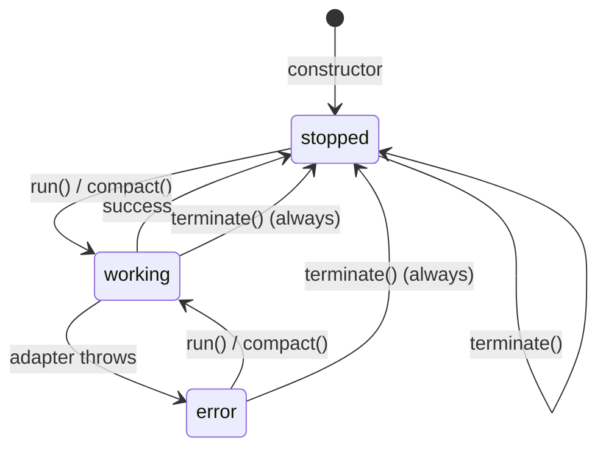
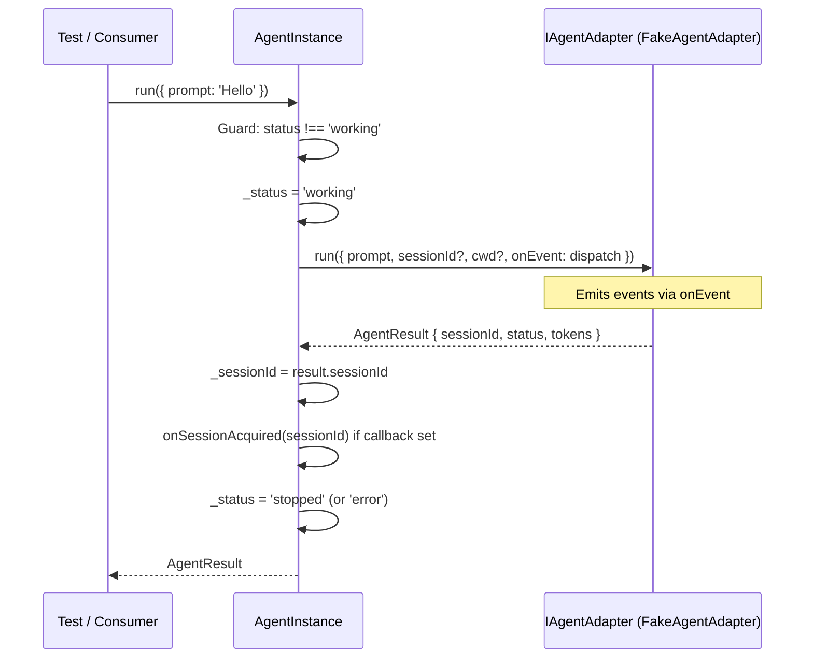
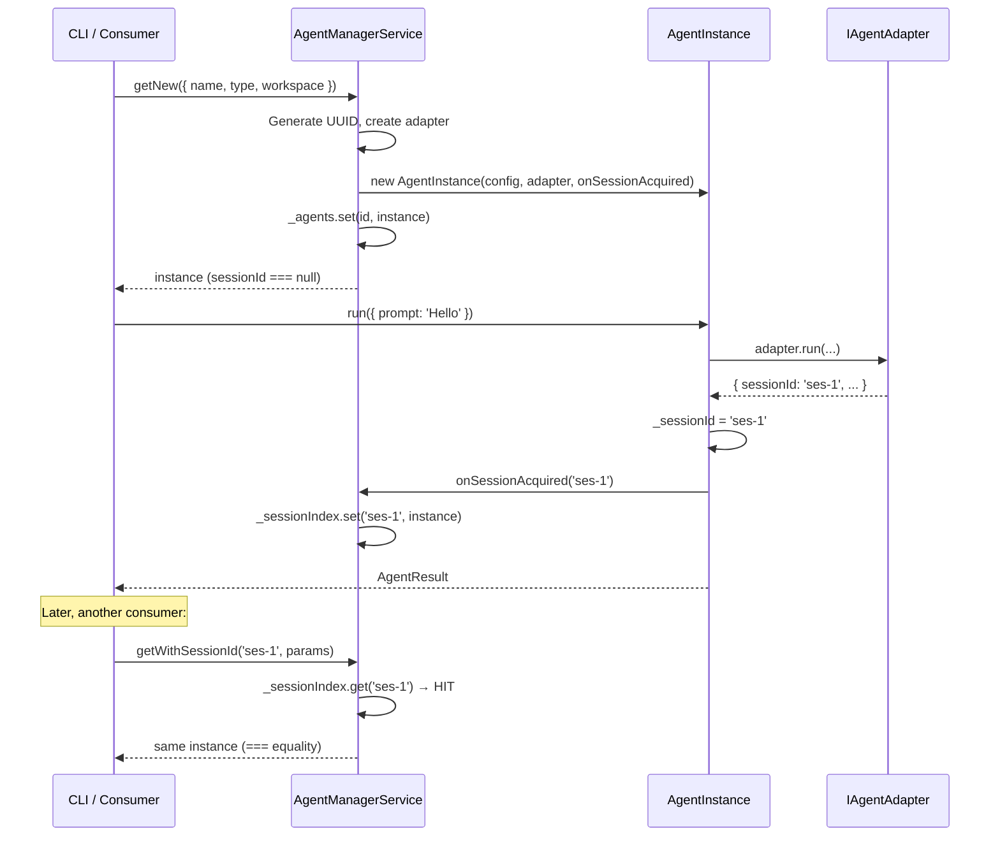

# Phase 2: Core Implementation with TDD – Tasks & Alignment Brief

**Spec**: [agentic-cli-spec.md](../../agentic-cli-spec.md)
**Plan**: [agentic-cli-plan.md](../../agentic-cli-plan.md)
**Date**: 2026-02-16

---

## Executive Briefing

### Purpose

This phase implements the core agent system: `AgentInstance`, `AgentManagerService`, and their matching fakes. It is the beating heart of Plan 034 — every subsequent phase (CLI commands, real agent tests, exports) depends on these implementations being correct and fully tested via TDD.

### What We're Building

Four concrete classes that bring the Phase 1 interfaces to life:

- **`AgentInstance`** (~120 lines): Domain-agnostic agent wrapper with 3-state status model (`working`/`stopped`/`error`), event pass-through via `Set<AgentEventHandler>`, freeform metadata bag, `run()`/`compact()`/`terminate()` lifecycle, and double-invocation guard.
- **`AgentManagerService`** (~80 lines): Agent registry with `getNew()`/`getWithSessionId()` API, session index (`Map<string, IAgentInstance>`), same-instance guarantee for repeated session lookups, and internal handler that updates the session index after `run()`.
- **`FakeAgentInstance`**: Test double implementing `IAgentInstance` with helpers (`setStatus()`, `assertRunCalled()`, `reset()`).
- **`FakeAgentManagerService`**: Test double implementing `IAgentManagerService` with same-instance guarantee and helpers (`addAgent()`, `getCreatedAgents()`, `reset()`).

Plus four test suites: unit tests for both implementations (RED-first), and contract test suites proving fake↔real parity.

### User Value

Consumers (CLI, orchestrator, future web UI) can create, run, compact, and terminate agents through one cohesive API. Fakes enable fast, deterministic testing without mocks or real adapters.

### Example

```typescript
// After Phase 2, this works end-to-end:
const manager = new AgentManagerService(adapterFactory);

// New session
const agent = manager.getNew({ name: 'demo', type: 'claude-code', workspace: '/tmp' });
agent.addEventHandler((e) => console.log(e.type));
const result = await agent.run({ prompt: 'Hello' });
console.log(agent.sessionId); // 'ses-abc123'

// Resume session (same-instance guarantee)
const same = manager.getWithSessionId('ses-abc123', { name: 'demo', type: 'claude-code', workspace: '/tmp' });
console.log(same === agent); // true — same object reference
```

---

## Objectives & Scope

### Objective

Implement `AgentInstance`, `AgentManagerService`, and their fakes using Full TDD (RED-GREEN-REFACTOR). Write contract tests that verify fake↔real parity. Satisfy AC-04 through AC-28 and AC-47.

### Goals

- ✅ `AgentInstance` with status transitions, event pass-through, metadata, compact, terminate
- ✅ `AgentManagerService` with `getNew`/`getWithSessionId`, session index, same-instance guarantee
- ✅ `FakeAgentInstance` with test helpers matching full `IAgentInstance` contract
- ✅ `FakeAgentManagerService` with test helpers matching full `IAgentManagerService` contract
- ✅ Contract test suites running against both real and fake implementations
- ✅ All unit tests pass via TDD (RED first, then GREEN)
- ✅ `just fft` passes (no regressions)

### Non-Goals

- ❌ CLI command updates (`cg agent run`, `cg agent compact`) — Phase 3
- ❌ DI container registration or token constants — Phase 3
- ❌ Terminal event handlers — Phase 3
- ❌ Real agent integration tests (Claude Code, Copilot SDK) — Phase 4
- ❌ Package-level barrel exports from `@chainglass/shared` — Phase 5
- ❌ Modifying any Plan 019 files — old implementations stay as-is
- ❌ Modifying `FakeAgentAdapter` — it already has compact support; tests create instances with desired options
- ❌ Web UI reconnection — separate plan (deliberate breakage per spec Q6)
- ❌ Timeout enforcement implementation — `timeoutMs` is on the interface; actual `Promise.race` wrapping is deferred to CLI handler (Phase 3)

---

## Pre-Implementation Audit

### Summary

| File | Action | Origin | Modified By | Recommendation |
|------|--------|--------|-------------|----------------|
| `features/034-agentic-cli/types.ts` | Modify | 034 Phase 1 | 034 only | keep-as-is — add `AdapterFactory` |
| `features/034-agentic-cli/agent-instance.ts` | Create | — | — | keep-as-is — intentional redesign of 019 |
| `features/034-agentic-cli/agent-manager-service.ts` | Create | — | — | keep-as-is — intentional redesign of 019 |
| `features/034-agentic-cli/fakes/fake-agent-instance.ts` | Create | — | — | keep-as-is — new fake for 034 shape |
| `features/034-agentic-cli/fakes/fake-agent-manager-service.ts` | Create | — | — | keep-as-is — new fake for 034 shape |
| `features/034-agentic-cli/fakes/index.ts` | Create | — | — | keep-as-is — standard barrel |
| `features/034-agentic-cli/index.ts` | Modify | 034 Phase 1 | 034 only | keep-as-is — add impl + fakes exports |
| `test/unit/features/034-agentic-cli/agent-instance.test.ts` | Create | — | — | keep-as-is |
| `test/unit/features/034-agentic-cli/agent-manager-service.test.ts` | Create | — | — | keep-as-is |
| `test/unit/features/034-agentic-cli/agent-instance-contract.test.ts` | Create | — | — | keep-as-is |
| `test/unit/features/034-agentic-cli/agent-manager-contract.test.ts` | Create | — | — | keep-as-is |

### Per-File Detail

#### `types.ts` — AdapterFactory Duplication

`AdapterFactory` already exists in two locations:
- `services/agent.service.ts:27` — `(agentType: string) => IAgentAdapter` (uses `string`)
- `features/019-agent-manager-refactor/agent-instance.interface.ts:39` — `(type: AgentType) => IAgentAdapter` (uses `AgentType`)

The 034 version uses `AgentType` (typed, not raw string), consistent with the 034 type system. This is an intentional PlanPak-isolated definition. Phase 5 should consolidate.

#### `agent-instance.ts` — Intentional Redesign

Existing `019-agent-manager-refactor/agent-instance.ts` (426 lines) is the predecessor. Key differences:
- **No notifier/storage** — 034 has no `_notifier`, `_storage`, `broadcastStatus()`, `_persistInstance()`
- **No event storage** — 034 uses `Set<AgentEventHandler>` pass-through, not `_events[]`
- **Adds compact()** — new operation (AC-12a through AC-12d)
- **Adds metadata bag** — `setMetadata(key, value)` (AC-10)
- **Constructor takes adapter directly** — not via factory call inside constructor

#### `fakes/fake-agent-instance.ts` — Not Reusable from 019

Existing `019-agent-manager-refactor/fake-agent-instance.ts` (369 lines) implements the 019 interface shape (`setIntent()`, `getEvents()`). The 034 fake implements a different interface (`compact()`, `addEventHandler()`, `setMetadata()`, `isRunning`). Not reusable.

### Compliance Check

| ADR/Rule | Status | Notes |
|----------|--------|-------|
| ADR-0011 (interface+fake+contract) | ✅ | Interfaces from Phase 1; fakes + contracts + impls in this phase |
| ADR-0004 (decorator-free DI) | ✅ | `AdapterFactory` is plain function; constructor injection |
| ADR-0010 (no notifier dependency) | ✅ | `AgentInstance` has no `IAgentNotifierService` |
| PlanPak (plan-scoped files) | ✅ | All source in `features/034-agentic-cli/`, tests in `test/unit/features/034-agentic-cli/` |

No violations found.

---

## Requirements Traceability

### Coverage Matrix

| AC | Description | Flow Summary | Files in Flow | Tasks | Status |
|----|-------------|-------------|---------------|-------|--------|
| AC-04 | run() transitions stopped→working→stopped\|error, updates sessionId | instance.run() → status guard → set 'working' → adapter.run() → set 'stopped' + sessionId | agent-instance.ts, types.ts, agent-instance.test.ts | T002, T007 | ✅ Complete |
| AC-05 | run() throws if status==='working' | run() checks _status, throws /already running/ | agent-instance.ts, agent-instance.test.ts | T002, T007 | ✅ Complete |
| AC-06 | addEventHandler() registers handler receiving adapter events | Set\<handler\>.add(); dispatch loop in run() | agent-instance.ts, agent-instance.test.ts | T002, T007 | ✅ Complete |
| AC-07 | Multiple handlers all receive same events | Set iteration dispatches to all | agent-instance.ts, agent-instance.test.ts | T002, T007 | ✅ Complete |
| AC-08 | removeEventHandler() stops delivery | Set.delete(); removed handler skipped | agent-instance.ts, agent-instance.test.ts | T002, T007 | ✅ Complete |
| AC-09 | Per-run onEvent receives events alongside handlers | opts.onEvent called in dispatch loop | agent-instance.ts, agent-instance.test.ts | T002, T007 | ✅ Complete |
| AC-10 | metadata is Readonly\<Record\>, updatable via setMetadata | _metadata object + readonly getter + setMetadata(k,v) | agent-instance.ts, agent-instance.test.ts | T002, T007 | ✅ Complete |
| AC-11 | isRunning = true iff status==='working' | Getter: `this._status === 'working'` | agent-instance.ts, agent-instance.test.ts | T002, T007 | ✅ Complete |
| AC-12 | terminate() delegates to adapter, transitions to stopped | adapter.terminate() → always set 'stopped' | agent-instance.ts, agent-instance.test.ts | T002, T007 | ✅ Complete |
| AC-12a | compact() delegates to adapter.compact(sessionId) | Guard sessionId + status → set 'working' → adapter.compact() → set 'stopped' | agent-instance.ts, fake-agent-adapter.ts(R), agent-instance.test.ts | T002, T004, T007 | ✅ Complete |
| AC-12b | compact() throws if sessionId null | Guard: `if (!sessionId) throw` | agent-instance.ts, agent-instance.test.ts | T002, T007 | ✅ Complete |
| AC-12c | compact() throws if status==='working' | Guard: same as run() double-invocation | agent-instance.ts, agent-instance.test.ts | T002, T007 | ✅ Complete |
| AC-12d | compact() updates token metrics in metadata | If result.tokens, call setMetadata('tokens', result.tokens) | agent-instance.ts, agent-instance.test.ts | T002, T007 | ✅ Complete |
| AC-13 | AgentInstanceConfig accepts optional sessionId, metadata | Phase 1 types.ts (read-only) | types.ts(R) | Phase 1 | ✅ Delivered |
| AC-14 | getNew() creates instance with sessionId===null | Manager generates ID, calls adapterFactory, constructs AgentInstance | agent-manager-service.ts, agent-manager-service.test.ts | T003, T008 | ✅ Complete |
| AC-15 | getWithSessionId() creates instance with sessionId pre-set | Check _sessionIndex → miss → create with sessionId in config | agent-manager-service.ts, agent-manager-service.test.ts | T003, T008 | ✅ Complete |
| AC-16 | getWithSessionId same sessionId = same object | _sessionIndex.get() hit → return existing | agent-manager-service.ts, agent-manager-service.test.ts | T003, T008 | ✅ Complete |
| AC-17 | Different sessionId = different object | Different key, new instance | agent-manager-service.ts, agent-manager-service.test.ts | T003, T008 | ✅ Complete |
| AC-18 | getAgent(id) returns instance or null | _agents.get(id) ?? null | agent-manager-service.ts, agent-manager-service.test.ts | T003, T008 | ✅ Complete |
| AC-19 | getAgents(filter?) returns filtered list | Iterate _agents, filter by type/workspace | agent-manager-service.ts, agent-manager-service.test.ts | T003, T008 | ✅ Complete |
| AC-20 | terminateAgent() removes from agents + session index | Find instance → terminate() → delete from both maps | agent-manager-service.ts, agent-manager-service.test.ts | T003, T008 | ✅ Complete |
| AC-21 | Constructor accepts only AdapterFactory | constructor(adapterFactory: AdapterFactory) | agent-manager-service.ts, types.ts | T001, T008 | ✅ Complete |
| AC-22 | Session index updated after getNew() instance runs | Manager attaches internal post-run callback at creation | agent-manager-service.ts, agent-instance.ts | T003, T007, T008 | ⚠️ See Design Note 1 |
| AC-23 | FakeAgentInstance implements IAgentInstance | Full contract with configurable behavior | fakes/fake-agent-instance.ts | T005 | ✅ Complete |
| AC-24 | FakeAgentManagerService implements IAgentManagerService | Same-instance guarantee in fake | fakes/fake-agent-manager-service.ts | T006 | ✅ Complete |
| AC-25 | Both fakes provide test helpers | setStatus, assertRunCalled, reset, addAgent, etc. | fakes/*.ts | T005, T006 | ✅ Complete |
| AC-26 | Contract suite: AgentInstance + FakeAgentAdapter vs FakeAgentInstance | Shared test function, two factory params | agent-instance-contract.test.ts | T009 | ✅ Complete |
| AC-27 | Contract suite: AgentManagerService vs FakeAgentManagerService | Shared test function, two factory params | agent-manager-contract.test.ts | T010 | ✅ Complete |
| AC-28 | Contract tests cover all behaviors | Meta-AC on contract test content | contract test files | T009, T010 | ✅ Complete |
| AC-47 | just fft green | Verification step | — | T012 | ✅ Complete |

### Design Note 1: Session Index Post-Run Update (AC-22)

The manager must update `_sessionIndex` when a `getNew()` instance acquires a sessionId after `run()`. The `addEventHandler()` contract dispatches adapter events **during** run, but `sessionId` is set **after** the adapter resolves.

**Chosen approach**: `AgentInstance` constructor accepts an optional internal `onSessionAcquired?: (sessionId: string) => void` callback (not on the interface). The manager passes a closure that updates `_sessionIndex`. This is invisible to consumers — the callback is a private implementation detail between `AgentInstance` and `AgentManagerService`.

### Gaps Found

All gaps resolved during dossier generation:
- **GAP-1 (AC-22)**: Session index update resolved via internal `onSessionAcquired` callback (see Design Note 1)
- **GAP-2 (FakeAgentAdapter helpers)**: Plan test examples reference `setNextResult()`/`setRunDelay()` which don't exist on `FakeAgentAdapter`. Resolution: create new `FakeAgentAdapter` instances per test with different constructor options (`FakeAgentAdapterOptions`). This is the existing test pattern and requires no modification to the shared fake.
- **GAP-3 (AdapterFactory)**: Phase 1 didn't define `AdapterFactory`. Added as T001 prerequisite.

### Orphan Files

None. All 11 files map to at least one AC flow.

---

## Architecture Map

### Component Diagram

```mermaid
flowchart TD
    classDef pending fill:#9E9E9E,stroke:#757575,color:#fff
    classDef inprogress fill:#FF9800,stroke:#F57C00,color:#fff
    classDef completed fill:#4CAF50,stroke:#388E3C,color:#fff
    classDef blocked fill:#F44336,stroke:#D32F2F,color:#fff

    style Phase fill:#F5F5F5,stroke:#E0E0E0
    style Impls fill:#F5F5F5,stroke:#E0E0E0
    style Fakes fill:#F5F5F5,stroke:#E0E0E0
    style Tests fill:#F5F5F5,stroke:#E0E0E0
    style Existing fill:#E8F5E9,stroke:#C8E6C9

    subgraph Phase["Phase 2: Core Implementation with TDD"]
        T001["T001: Add AdapterFactory type ✓"]:::completed
        T002["T002: AgentInstance tests (RED) ✓"]:::completed
        T003["T003: AgentManagerService tests (RED) ✓"]:::completed
        T004["T004: Verify FakeAgentAdapter compact ✓"]:::completed
        T005["T005: FakeAgentInstance ✓"]:::completed
        T006["T006: FakeAgentManagerService ✓"]:::completed
        T007["T007: AgentInstance (GREEN) ✓"]:::completed
        T008["T008: AgentManagerService (GREEN) ✓"]:::completed
        T009["T009: IAgentInstance contract tests ✓"]:::completed
        T010["T010: IAgentManagerService contract tests ✓"]:::completed
        T011["T011: Barrel exports ✓"]:::completed
        T012["T012: Refactor + regression ✓"]:::completed

        T001 --> T002
        T001 --> T003
        T002 --> T007
        T003 --> T008
        T004 --> T007
        T005 --> T009
        T006 --> T010
        T007 --> T009
        T007 --> T011
        T008 --> T010
        T008 --> T011
        T009 --> T012
        T010 --> T012
        T011 --> T012
    end

    subgraph Impls["Implementation Files"]
        F1["types.ts (modify) ✓"]:::completed
        F2["agent-instance.ts ✓"]:::completed
        F3["agent-manager-service.ts ✓"]:::completed
        F7["index.ts (modify) ✓"]:::completed
    end

    subgraph Fakes["Fake Files"]
        F4["fakes/fake-agent-instance.ts ✓"]:::completed
        F5["fakes/fake-agent-manager-service.ts ✓"]:::completed
        F6["fakes/index.ts ✓"]:::completed
    end

    subgraph Tests["Test Files"]
        F8["agent-instance.test.ts ✓"]:::completed
        F9["agent-manager-service.test.ts ✓"]:::completed
        F10["agent-instance-contract.test.ts ✓"]:::completed
        F11["agent-manager-contract.test.ts ✓"]:::completed
    end

    subgraph Existing["Existing (read-only)"]
        E1["interfaces/agent-adapter.interface.ts"]
        E2["interfaces/agent-types.ts"]
        E3["fakes/fake-agent-adapter.ts"]
        E4["034/agent-instance.interface.ts"]
        E5["034/agent-manager-service.interface.ts"]
    end

    T001 -.-> F1
    T002 -.-> F8
    T003 -.-> F9
    T005 -.-> F4
    T006 -.-> F5
    T007 -.-> F2
    T008 -.-> F3
    T009 -.-> F10
    T010 -.-> F11
    T011 -.-> F6
    T011 -.-> F7

    F2 -.->|imports| E1
    F2 -.->|imports| E2
    F2 -.->|imports| E4
    F3 -.->|imports| E5
    F8 -.->|imports| E3
    F9 -.->|imports| E3
```

<!-- Status: grey=pending, orange=in-progress, green=completed, red=blocked -->
<!-- Updated by plan-6 during implementation -->



### Task-to-Component Mapping

<!-- Status: ⬜ Pending | 🟧 In Progress | ✅ Complete | 🔴 Blocked -->

| Task | Component(s) | Files | Status | Comment |
|------|-------------|-------|--------|---------|
| T001 | Type Definition | types.ts, index.ts | ✅ Complete | Added AdapterFactory type + re-export |
| T002 | Unit Tests | agent-instance.test.ts | ✅ Complete | 29 tests covering AC-04 through AC-12d |
| T003 | Unit Tests | agent-manager-service.test.ts | ✅ Complete | 15 tests covering AC-14 through AC-22 |
| T004 | Verification | (read-only: fake-agent-adapter.ts) | ✅ Complete | compact() confirmed, test patterns documented |
| T005 | Fake | fakes/fake-agent-instance.ts | ✅ Complete | Test double with helpers (AC-23, AC-25) |
| T006 | Fake | fakes/fake-agent-manager-service.ts | ✅ Complete | Test double with same-instance guarantee (AC-24, AC-25) |
| T007 | Core Implementation | agent-instance.ts | ✅ Complete | 29 unit tests pass (AC-04 through AC-12d) |
| T008 | Core Implementation | agent-manager-service.ts | ✅ Complete | 15 unit tests pass (AC-14 through AC-22) |
| T009 | Contract Tests | agent-instance-contract.test.ts | ✅ Complete | 22 contract tests: real vs fake (AC-26, AC-28) |
| T010 | Contract Tests | agent-manager-contract.test.ts | ✅ Complete | 24 contract tests: real vs fake (AC-27) |
| T011 | Barrel Exports | fakes/index.ts, index.ts | ✅ Complete | All impls + fakes importable from barrel |
| T012 | Quality | (all files) | ✅ Complete | just fft: 3820 tests pass, 0 failures |

---

## Tasks

| Status | ID | Task | CS | Type | Dependencies | Absolute Path(s) | Validation | Subtasks | Notes |
|--------|------|------|-----|------|-------------|-------------------|------------|----------|-------|
| [x] | T001 | Add `AdapterFactory` type to `types.ts`: `export type AdapterFactory = (type: AgentType) => IAgentAdapter;` — import `IAgentAdapter` from `../../interfaces/agent-adapter.interface.js`. Re-export from barrel `index.ts`. | 1 | Setup | – | `/home/jak/substrate/033-real-agent-pods/packages/shared/src/features/034-agentic-cli/types.ts`, `/home/jak/substrate/033-real-agent-pods/packages/shared/src/features/034-agentic-cli/index.ts` | `AdapterFactory` compiles and is importable from feature barrel; `tsc --noEmit` passes | – | plan-scoped; Phase 1 gap — needed for AgentManagerService constructor |
| [x] | T002 | Write `AgentInstance` unit tests (RED). Cover: initial status=stopped (AC-03), run() transitions stopped→working→stopped (AC-04), run() updates sessionId (AC-04), double-run guard throws (AC-05), addEventHandler receives events (AC-06), multiple handlers same events (AC-07), removeEventHandler stops delivery (AC-08), per-run onEvent (AC-09), metadata read/write (AC-10), isRunning getter (AC-11), terminate delegates + always stopped (AC-12), compact transitions (AC-12a), compact no-session throws (AC-12b), compact working throws (AC-12c), compact token metrics (AC-12d), run() with adapter error → status=error, compact() with adapter error → status=error, terminate with no sessionId (graceful), handler throws doesn't break others, setMetadata preserves existing keys, removeEventHandler with unregistered handler (no-op). All tests MUST fail initially. | 2 | Test | T001 | `/home/jak/substrate/033-real-agent-pods/test/unit/features/034-agentic-cli/agent-instance.test.ts` | All tests exist, all fail (RED). Import paths compile. Test names follow Given/When/Then. | – | plan-scoped; maps to plan task 2.1; create FakeAgentAdapter instances per test with constructor options |
| [x] | T003 | Write `AgentManagerService` unit tests (RED). Cover: getNew creates instance with null sessionId (AC-14), getWithSessionId pre-sets sessionId (AC-15), same-instance guarantee === (AC-16), different session different instance (AC-17), getAgent by ID (AC-18), getAgent unknown returns null, getAgents no filter (AC-19), getAgents with type filter, getAgents with workspace filter, terminateAgent cleanup from both maps (AC-20), constructor accepts only adapterFactory (AC-21), session index update after getNew().run() (AC-22). All tests MUST fail initially. | 2 | Test | T001 | `/home/jak/substrate/033-real-agent-pods/test/unit/features/034-agentic-cli/agent-manager-service.test.ts` | All tests exist, all fail (RED). Import paths compile. | – | plan-scoped; maps to plan task 2.2; uses FakeAgentAdapter for adapter factory |
| [x] | T004 | Verify `FakeAgentAdapter` supports compact and document test patterns. Confirm: `compact(sessionId)` method exists and returns `AgentResult`, `assertCompactCalled(sessionId)` helper works, constructor options allow configuring results. Document: how to create per-test adapters with different results (no `setNextResult` — use constructor options). | 1 | Setup | – | (read-only: `/home/jak/substrate/033-real-agent-pods/packages/shared/src/fakes/fake-agent-adapter.ts`) | compact() confirmed, test pattern documented in execution log | – | plan-scoped; maps to plan task 2.3; Discovery 12 — compact already exists |
| [x] | T005 | Implement `FakeAgentInstance`. Implements `IAgentInstance` with: configurable initial status/sessionId/metadata via constructor, `setStatus()` override, `setSessionId()` override, `assertRunCalled()`/`assertCompactCalled()`/`assertTerminateCalled()` assertion helpers, `getRunHistory()`/`getCompactHistory()` for inspection, `reset()` to clear state. `run()`/`compact()`/`terminate()` record calls and simulate transitions. Event handler support (`addEventHandler`/`removeEventHandler`) delegates to internal Set. | 2 | Core | T001 | `/home/jak/substrate/033-real-agent-pods/packages/shared/src/features/034-agentic-cli/fakes/fake-agent-instance.ts` | Implements IAgentInstance; all properties and methods present; test helpers work | – | plan-scoped; maps to plan task 2.4; per ADR-0011 layer 2 |
| [x] | T006 | Implement `FakeAgentManagerService`. Implements `IAgentManagerService` with: same-instance guarantee on `getWithSessionId()`, session index, `addAgent()` to pre-populate, `getCreatedAgents()` for inspection, `reset()` to clear state. Uses `FakeAgentInstance` internally for created agents. | 2 | Core | T005 | `/home/jak/substrate/033-real-agent-pods/packages/shared/src/features/034-agentic-cli/fakes/fake-agent-manager-service.ts` | Implements IAgentManagerService; same-instance guarantee verified; test helpers work | – | plan-scoped; maps to plan task 2.5; per ADR-0011 layer 2 |
| [x] | T007 | Implement `AgentInstance` (GREEN). Constructor: `(config: AgentInstanceConfig, adapter: IAgentAdapter, onSessionAcquired?: (sessionId: string) => void)`. Status model: working/stopped/error. Event pass-through via `Set<AgentEventHandler>`. `run()`: double-run guard → set working → build adapter-level options → call adapter.run() → update sessionId → call onSessionAcquired if new session → set stopped/error → return result. `compact()`: no-session guard + double-invocation guard → set working → adapter.compact(sessionId) → update token metadata → set stopped/error. `terminate()`: adapter.terminate() → always set stopped. Dispatch events to all handlers + per-run onEvent during adapter operations. | 3 | Core | T002, T004 | `/home/jak/substrate/033-real-agent-pods/packages/shared/src/features/034-agentic-cli/agent-instance.ts` | All T002 tests pass (GREEN). Status transitions correct. Event dispatch works. Compact delegates properly. | – | plan-scoped; maps to plan task 2.6; AC-04 through AC-12d; adapter is separate constructor param per DYK-P5#2 |
| [x] | T008 | Implement `AgentManagerService` (GREEN). Constructor: `(adapterFactory: AdapterFactory)`. Internal maps: `_agents: Map<string, AgentInstance>`, `_sessionIndex: Map<string, AgentInstance>`. `getNew()`: generate UUID → create adapter → construct AgentInstance with onSessionAcquired callback → store in _agents → return. `getWithSessionId()`: check _sessionIndex → if hit return same reference → if miss create with sessionId in config + add to both maps. `terminateAgent()`: find → terminate → delete from both maps. Session index update: onSessionAcquired callback from getNew() instances updates _sessionIndex when sessionId first appears. | 3 | Core | T003, T007 | `/home/jak/substrate/033-real-agent-pods/packages/shared/src/features/034-agentic-cli/agent-manager-service.ts` | All T003 tests pass (GREEN). Same-instance guarantee verified (=== equality). Session index updated after run(). | – | plan-scoped; maps to plan task 2.7; AC-14 through AC-22; session index per DEC-session-idx |
| [x] | T009 | Write `IAgentInstance` contract test suite. Shared test function accepting a factory: `(name: string, factory: () => { instance: IAgentInstance, adapter: FakeAgentAdapter }) => void`. Run against: (1) `AgentInstance` with `FakeAgentAdapter`, (2) `FakeAgentInstance` wrapping `FakeAgentAdapter`. Cover: status transitions, double-run guard, compact guard, session tracking, metadata, event pass-through, isRunning. | 2 | Test | T005, T007 | `/home/jak/substrate/033-real-agent-pods/test/unit/features/034-agentic-cli/agent-instance-contract.test.ts` | Contract tests pass for both real and fake (AC-26, AC-28) | – | plan-scoped; maps to plan task 2.8 |
| [x] | T010 | Write `IAgentManagerService` contract test suite. Shared test function accepting a factory: `(name: string, factory: () => IAgentManagerService) => void`. Run against: (1) `AgentManagerService`, (2) `FakeAgentManagerService`. Cover: getNew, getWithSessionId same-instance, getAgent, getAgents, terminateAgent. | 2 | Test | T006, T008 | `/home/jak/substrate/033-real-agent-pods/test/unit/features/034-agentic-cli/agent-manager-contract.test.ts` | Contract tests pass for both real and fake (AC-27) | – | plan-scoped; maps to plan task 2.9 |
| [x] | T011 | Update barrel exports. Create `fakes/index.ts` exporting `FakeAgentInstance` and `FakeAgentManagerService`. Update feature `index.ts` to export `AgentInstance`, `AgentManagerService`, and re-export fakes barrel. | 1 | Core | T007, T008 | `/home/jak/substrate/033-real-agent-pods/packages/shared/src/features/034-agentic-cli/fakes/index.ts`, `/home/jak/substrate/033-real-agent-pods/packages/shared/src/features/034-agentic-cli/index.ts` | All types, interfaces, implementations, and fakes importable from feature barrel | – | plan-scoped; maps to plan task 2.10 |
| [x] | T012 | Refactor pass: review code quality, check naming consistency, verify JSDoc, run `just fft`. All existing + new tests pass. No unnecessary complexity. | 1 | Quality | T009, T010, T011 | (all Phase 2 files) | `just fft` passes (AC-47). No lint errors. Code follows idioms. | – | maps to plan task 2.11; REFACTOR step of TDD |

---

## Alignment Brief

### Prior Phases Review

#### Phase 1: Types, Interfaces, and PlanPak Setup (Complete)

**A. Deliverables Created:**
- `packages/shared/src/features/034-agentic-cli/types.ts` (78 lines) — 8 type exports: `AgentType`, `AgentInstanceStatus`, `AgentEventHandler` (re-export), `AgentInstanceConfig`, `CreateAgentParams`, `AgentRunOptions`, `AgentCompactOptions`, `AgentFilter`. Plus re-exports of `AgentEvent` and `AgentResult`.
- `packages/shared/src/features/034-agentic-cli/agent-instance.interface.ts` (88 lines) — `IAgentInstance` with 10 readonly props, 6 methods
- `packages/shared/src/features/034-agentic-cli/agent-manager-service.interface.ts` (52 lines) — `IAgentManagerService` with 6 methods
- `packages/shared/src/features/034-agentic-cli/index.ts` (23 lines) — barrel re-exports
- PlanPak directories: `packages/shared/src/features/034-agentic-cli/fakes/`, `apps/cli/src/features/034-agentic-cli/`, `test/unit/features/034-agentic-cli/`

**B. Lessons Learned:**
- `.js` extensions required in all relative imports (project convention)
- Biome enforces spaces (not tabs) — run `just format` after writing files
- `just typecheck` has pre-existing errors from `@chainglass/workflow` — not 034-related

**C. Technical Discoveries (DYK from Phase 1 planning):**
- **DYK-P5#1**: `compact()` needs `AgentCompactOptions` with `timeoutMs?` — added
- **DYK-P5#2**: Adapter must NOT be on `AgentInstanceConfig` — config=data, deps=separate constructor params — adopted
- **DYK-P5#5**: All 5 adapter implementations confirm `terminate()` never throws, always returns `'killed'` status

**D. Dependencies Exported for Phase 2:**
- `IAgentInstance` interface (import from `./agent-instance.interface.js`)
- `IAgentManagerService` interface (import from `./agent-manager-service.interface.js`)
- All supporting types from `./types.js`
- Feature barrel from `./index.js`

**E. Incomplete Items:** None — all 5 tasks complete.

**F. Test Infrastructure:** `test/unit/features/034-agentic-cli/` directory created (empty).

**G. Technical Debt:** None identified.

**H. Key Log References:** `execution.log.md` — T001-T005 entries, `just fft` evidence (3730 tests pass).

### Critical Findings Affecting This Phase

| Finding | Constraint | Addressed By |
|---------|-----------|-------------|
| Discovery 01: AgentInstance 425 lines of web-coupled code | 034 AgentInstance must be ~120 lines, no notifier/storage | T007 (lean implementation) |
| Discovery 08: Session index update timing | Manager attaches internal handler at creation time | T008 (onSessionAcquired callback) |
| Discovery 09: Timeout enforcement gap | `timeoutMs` on AgentRunOptions but actual enforcement deferred to CLI | T007 (accepts field but doesn't enforce — Phase 3) |
| Discovery 10: Compact differs between adapters | compact() delegates to adapter; AgentInstance doesn't interpret result shape | T007 (compact method) |
| Discovery 12: FakeAgentAdapter compact support | FakeAgentAdapter already has compact() + assertCompactCalled() | T004 (verification only) |

### ADR Decision Constraints

| ADR | Decision | Phase 2 Constraint | Addressed By |
|-----|----------|-------------------|-------------|
| ADR-0011 | First-class domain concepts with interface + fake + contract | Phase 2 delivers fakes (layer 2) + implementations (layer 4) + contract tests (layer 5) | T005-T010 |
| ADR-0004 | Decorator-free DI, useFactory pattern | `AgentManagerService` constructor takes `AdapterFactory` function, not decorators. No DI registration in Phase 2 (deferred to Phase 3). | T008 |
| ADR-0010 | AgentNotifierService removal documented | `AgentInstance` has no notifier dependency. Event pass-through replaces broadcast. | T007 |
| ADR-0006 | CLI-based orchestration | AgentRunOptions.cwd passes through to adapter. No session handling in instance — delegated to manager. | T007 |

### PlanPak Placement Rules

- **Plan-scoped implementation** → `features/034-agentic-cli/agent-instance.ts`, `agent-manager-service.ts`
- **Plan-scoped fakes** → `features/034-agentic-cli/fakes/`
- **Plan-scoped tests** → `test/unit/features/034-agentic-cli/`
- **Cross-cutting files** → not applicable in Phase 2 (no DI wiring)
- **Dependency direction**: 034 imports from `interfaces/` (shared) — never the reverse

### Invariants & Guardrails

- `IAgentAdapter` interface is **unchanged** (AC-48) — import only, never modify
- `FakeAgentAdapter` is **not modified** — create instances with constructor options per test
- Plan 019 files are **not modified** — old and new implementations coexist
- Web compile errors from this change are **deliberate** (spec Q6)
- No mocks (`vi.fn`, `vi.mock`) — fakes only (spec Q3)
- Constructor signature: `AgentInstance(config: AgentInstanceConfig, adapter: IAgentAdapter, onSessionAcquired?: (sid: string) => void)`

### Inputs to Read

| File | Why |
|------|-----|
| `packages/shared/src/features/034-agentic-cli/types.ts` | Phase 1 types to import |
| `packages/shared/src/features/034-agentic-cli/agent-instance.interface.ts` | Interface to implement |
| `packages/shared/src/features/034-agentic-cli/agent-manager-service.interface.ts` | Interface to implement |
| `packages/shared/src/interfaces/agent-adapter.interface.ts` | `IAgentAdapter` — the adapter contract |
| `packages/shared/src/interfaces/agent-types.ts` | `AgentResult`, `AgentEvent`, `AgentRunOptions` (adapter-level) |
| `packages/shared/src/fakes/fake-agent-adapter.ts` | Test double for adapters — understand API |
| `docs/plans/033-real-agent-pods/workshops/02-unified-agent-design.md` | Authoritative implementation walk-throughs |

### Visual Alignment: AgentInstance Lifecycle



### Sequence: AgentInstance.run() Flow



### Sequence: AgentManagerService Session Index Update (AC-22)



### Test Plan (Full TDD)

**Testing approach**: Full TDD with RED-GREEN-REFACTOR loop.

**Mock usage**: Fakes only — `FakeAgentAdapter` (existing), `FakeAgentInstance` (new), `FakeAgentManagerService` (new). No `vi.fn`/`vi.mock`.

#### T002: AgentInstance Unit Tests (~20 tests)

| Test | AC | What It Proves |
|------|----|---------------|
| starts with status stopped | AC-03 | Initial state contract |
| run() transitions stopped→working→stopped | AC-04 | Core lifecycle |
| run() updates sessionId from result | AC-04 | Session tracking |
| run() throws on double-run | AC-05 | Concurrency guard |
| addEventHandler receives events | AC-06 | Event registration |
| multiple handlers get same events | AC-07 | Multi-handler dispatch |
| removeEventHandler stops delivery | AC-08 | Handler removal |
| per-run onEvent receives events | AC-09 | Per-run handler |
| metadata readable after creation | AC-10 | Initial metadata |
| setMetadata updates key | AC-10 | Metadata mutation |
| setMetadata preserves existing keys | AC-10 | Non-destructive update |
| isRunning true when working | AC-11 | Convenience getter |
| terminate delegates to adapter | AC-12 | Termination |
| terminate always transitions to stopped | AC-12 | Never-throw guarantee |
| compact transitions stopped→working→stopped | AC-12a | Compact lifecycle |
| compact throws if no session | AC-12b | Guard |
| compact throws if working | AC-12c | Guard |
| compact updates token metrics | AC-12d | Token metadata |
| run() with adapter error → status error | AC-04 | Error path |
| compact() with adapter error → status error | AC-12a | Error path |
| handler throw doesn't break other handlers | AC-07 | Robustness |

**Fixture pattern**: Create `FakeAgentAdapter` per test with desired options:
```typescript
const adapter = new FakeAgentAdapter({ sessionId: 'ses-1', status: 'completed' });
const instance = new AgentInstance(
  { id: 'test-1', name: 'agent', type: 'claude-code', workspace: '/tmp' },
  adapter
);
```

#### T003: AgentManagerService Unit Tests (~12 tests)

| Test | AC | What It Proves |
|------|----|---------------|
| getNew creates with null sessionId | AC-14 | Fresh instance |
| getWithSessionId pre-sets sessionId | AC-15 | Session resumption |
| getWithSessionId same session = same object | AC-16 | Same-instance guarantee |
| getWithSessionId different session = different object | AC-17 | Isolation |
| getAgent by ID | AC-18 | Lookup |
| getAgent unknown returns null | AC-18 | Null safety |
| getAgents returns all | AC-19 | List |
| getAgents filters by type | AC-19 | Type filter |
| getAgents filters by workspace | AC-19 | Workspace filter |
| terminateAgent removes from both maps | AC-20 | Cleanup |
| session index updated after run | AC-22 | Post-run callback |
| initialize is a no-op | — | Interface contract |

#### T009/T010: Contract Tests

Shared function pattern:
```typescript
function agentInstanceContractTests(
  name: string,
  factory: () => { instance: IAgentInstance; triggerRun: () => Promise<void> }
) {
  describe(`IAgentInstance contract: ${name}`, () => {
    it('starts stopped', () => { /* ... */ });
    it('transitions on run', async () => { /* ... */ });
    // ... all behavioral contracts
  });
}

// Run against both implementations:
agentInstanceContractTests('AgentInstance (real)', () => {
  const adapter = new FakeAgentAdapter({ sessionId: 'ses-1' });
  return { instance: new AgentInstance(config, adapter), triggerRun: ... };
});

agentInstanceContractTests('FakeAgentInstance', () => {
  return { instance: new FakeAgentInstance(config), triggerRun: ... };
});
```

### Step-by-Step Implementation Outline

1. **T001** (Setup): Add `AdapterFactory` to `types.ts`, update barrel
2. **T002** (RED): Write ~20 AgentInstance unit tests — all fail
3. **T003** (RED): Write ~12 AgentManagerService unit tests — all fail
4. **T004** (Setup): Verify FakeAgentAdapter compact, document test patterns
5. **T005** (Fake): Implement FakeAgentInstance with test helpers
6. **T006** (Fake): Implement FakeAgentManagerService with test helpers
7. **T007** (GREEN): Implement AgentInstance — make T002 tests pass
8. **T008** (GREEN): Implement AgentManagerService — make T003 tests pass
9. **T009** (Contract): Write IAgentInstance contract tests against both impls
10. **T010** (Contract): Write IAgentManagerService contract tests against both impls
11. **T011** (Barrel): Create fakes barrel, update feature barrel
12. **T012** (Refactor): Clean up, run `just fft`, verify zero regressions

### Commands to Run

```bash
cd /home/jak/substrate/033-real-agent-pods

# After each test/implementation step:
pnpm exec vitest run test/unit/features/034-agentic-cli/ --reporter verbose

# After all tests pass:
just fft

# TypeScript verification:
pnpm exec tsc --noEmit
```

### Risks & Unknowns

| Risk | Severity | Mitigation |
|------|----------|------------|
| Session index callback mechanism (AC-22) | Medium | Design Note 1 settled on onSessionAcquired callback — implement per plan |
| Plan test examples use non-existent FakeAgentAdapter methods | Low | Create new adapter instances per test with constructor options |
| AdapterFactory triple definition across codebase | Low | PlanPak isolation; consolidate in Phase 5 |
| Contract test design for async behaviors | Medium | Factory returns both instance and a trigger function for controlled execution |

### Ready Check

- [ ] ADR constraints mapped to tasks (ADR-0011 → T005-T010, ADR-0004 → T008, ADR-0010 → T007, ADR-0006 → T007)
- [ ] All Phase 2 acceptance criteria traced to tasks (AC-04 through AC-28, AC-47)
- [ ] Pre-implementation audit complete — no violations
- [ ] Requirements flow — all gaps resolved (AdapterFactory via T001, session index via Design Note 1, test patterns via T004)
- [ ] PlanPak paths verified for all files
- [ ] Phase 1 review complete — all deliverables available
- [ ] **Awaiting human GO/NO-GO**

---

## Phase Footnote Stubs

_Empty — populated by plan-6 during implementation._

| Footnote | Task | Description | Reference |
|----------|------|-------------|-----------|
| | | | |

---

## Evidence Artifacts

- **Execution log**: `docs/plans/034-agentic-cli/tasks/phase-2-core-implementation-with-tdd/execution.log.md` (created by plan-6)
- **Flight plan**: `docs/plans/034-agentic-cli/tasks/phase-2-core-implementation-with-tdd/tasks.fltplan.md` (generated next)

---

## Discoveries & Learnings

_Populated during implementation by plan-6. Log anything of interest to your future self._

| Date | Task | Type | Discovery | Resolution | References |
|------|------|------|-----------|------------|------------|
| | | | | | |

**Types**: `gotcha` | `research-needed` | `unexpected-behavior` | `workaround` | `decision` | `debt` | `insight`

**What to log**:
- Things that didn't work as expected
- External research that was required
- Implementation troubles and how they were resolved
- Gotchas and edge cases discovered
- Decisions made during implementation
- Technical debt introduced (and why)
- Insights that future phases should know about

_See also: `execution.log.md` for detailed narrative._

---

## Directory Layout

```
docs/plans/034-agentic-cli/
  ├── agentic-cli-plan.md
  ├── agentic-cli-spec.md
  ├── workshops/
  │   └── 01-cli-agent-run-and-e2e-testing.md
  └── tasks/
      ├── phase-1-types-interfaces-and-planpak-setup/
      │   ├── tasks.md
      │   ├── tasks.fltplan.md
      │   └── execution.log.md
      └── phase-2-core-implementation-with-tdd/
          ├── tasks.md                 ← this file
          ├── tasks.fltplan.md         # generated by /plan-5b
          └── execution.log.md         # created by /plan-6
```
