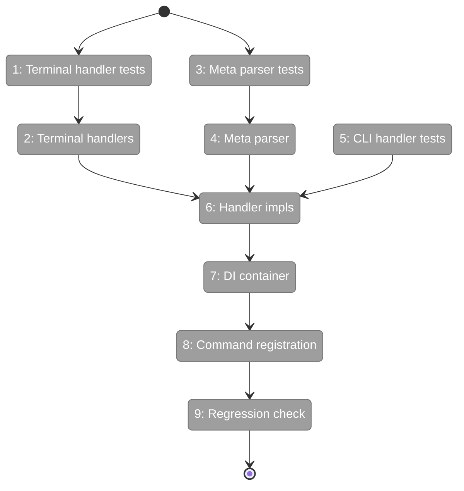

# Flight Plan: Phase 3 — CLI Command Update with TDD

**Plan**: [agentic-cli-plan.md](../../agentic-cli-plan.md)
**Phase**: Phase 3: CLI Command Update with TDD
**Generated**: 2026-02-16
**Status**: Ready for takeoff

---

## Departure → Destination

**Where we are**: Phases 1-2 delivered types, interfaces, `AgentInstance`, `AgentManagerService`, fakes, and 90 contract+unit tests. But the CLI still uses the old `AgentService` path — `cg agent run` resolves `AgentService` from DI, calls `service.run()` with a callback, and outputs raw JSON. No human-readable output, no instance lifecycle, no metadata support.

**Where we're going**: The CLI agent commands (`cg agent run`, `cg agent compact`) will create and manage `AgentInstance` objects through `AgentManagerService`. Terminal output becomes human-readable by default with `[name]` prefixes and event formatting. New options (`--name`, `--meta`, `--verbose`, `--quiet`) enrich the experience. The DI container swaps `AgentService` for `AgentManagerService`.

---

## Flight Status

---

## Stages

- [ ] **Stage 1: Terminal handler tests (RED)** — test human-readable, verbose, NDJSON output modes
- [ ] **Stage 2: Terminal handlers (GREEN)** — createTerminalEventHandler + ndjsonEventHandler
- [ ] **Stage 3: Meta parser tests (RED)** — test key=value parsing
- [ ] **Stage 4: Meta parser (GREEN)** — parseMetaOptions function
- [ ] **Stage 5: CLI handler tests (RED)** — test handleAgentRun + handleAgentCompact with FakeAgentManagerService
- [ ] **Stage 6: Handler implementations (GREEN)** — pure functions accepting deps for testability
- [ ] **Stage 7: DI container update** — AGENT_MANAGER token, remove AGENT_SERVICE
- [ ] **Stage 8: Command registration** — new options, new handler wiring
- [ ] **Stage 9: Regression check** — just fft passes

---

## Acceptance Criteria

- [ ] `cg agent run -t -p` uses AgentManagerService.getNew() (AC-29)
- [ ] `cg agent run -s` uses getWithSessionId() (AC-30)
- [ ] Default terminal output: human-readable with `[name]` prefix (AC-31)
- [ ] --stream: NDJSON event output (AC-32)
- [ ] Session ID printed on completion (AC-33)
- [ ] Exit code 0 completed, 1 failed (AC-34)
- [ ] `cg agent compact -s` uses getWithSessionId + compact() (AC-34a, AC-34b)
- [ ] just fft passes (AC-47)

---

## Checklist

- [ ] T001: Terminal handler tests — RED (CS-2)
- [ ] T002: Terminal handlers — GREEN (CS-2)
- [ ] T003: Meta parser tests — RED (CS-1)
- [ ] T004: Meta parser — GREEN (CS-1)
- [ ] T005: CLI handler tests — RED (CS-2)
- [ ] T006: Handler implementations — GREEN (CS-2)
- [ ] T007: DI container update (CS-2)
- [ ] T008: Command registration update (CS-1)
- [ ] T009: Regression check (CS-1)

---

## PlanPak

Active — new handler files in `apps/cli/src/features/034-agentic-cli/`, tests in `test/unit/features/034-agentic-cli/`, cross-cutting edits to `container.ts` and `agent.command.ts`.
