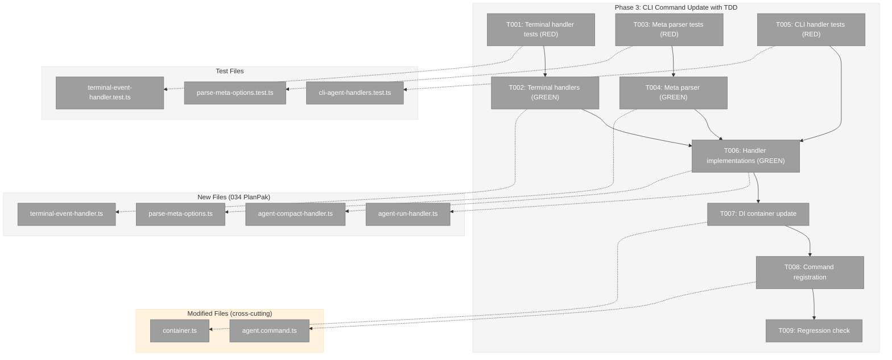
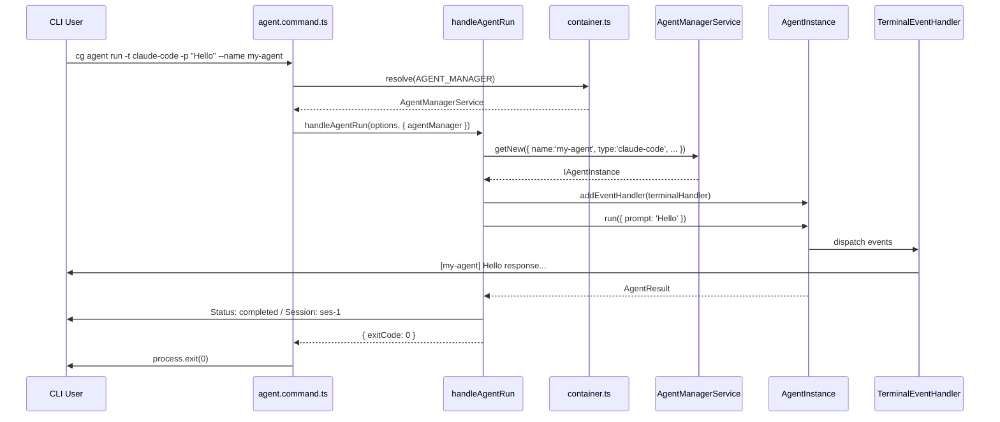

# Phase 3: CLI Command Update with TDD – Tasks & Alignment Brief

**Spec**: [agentic-cli-spec.md](../../agentic-cli-spec.md)
**Plan**: [agentic-cli-plan.md](../../agentic-cli-plan.md)
**Date**: 2026-02-16

---

## Executive Briefing

### Purpose

This phase rewires the `cg agent run` and `cg agent compact` CLI commands to use the new `AgentManagerService` / `AgentInstance` from Phase 2. It replaces the old `AgentService` path with a cohesive instance-based approach — every operation creates or resumes an `AgentInstance`, attaches event handlers for terminal output, and runs through the same lifecycle.

### What We're Building

- **Terminal event handlers**: Human-readable, verbose, NDJSON, and quiet output modes for agent events
- **Meta option parser**: `--meta key=value` flag for freeform metadata
- **Updated `handleAgentRun`**: Creates instance via `agentManager.getNew()` or `.getWithSessionId()`, attaches event handler, calls `instance.run()`
- **Updated `handleAgentCompact`**: Creates instance via `agentManager.getWithSessionId()`, calls `instance.compact()`
- **DI container update**: `AgentManagerService` registered under `CLI_DI_TOKENS.AGENT_MANAGER`; `AgentService` no longer registered
- **New CLI options**: `--name`, `--meta`, `--verbose`, `--quiet`

### User Value

Users get human-readable agent output by default (no more raw JSON). Verbose mode shows thinking/tool details. Quiet mode for scripts. Session chaining works via `--session` with the same-instance guarantee backing it.

### Example

```bash
# Default: JSON result (backward-compatible, scriptable)
$ cg agent run -t claude-code -p "Hello"
{"output":"Hi!","sessionId":"ses-1","status":"completed","exitCode":0,"tokens":{...}}

# Verbose: human-readable events during run + JSON result
$ cg agent run -t claude-code -p "Hello" --verbose
[agent-claude-code] Hi!

---
{"output":"Hi!","sessionId":"ses-1","status":"completed","exitCode":0,"tokens":{...}}

# Stream: NDJSON events (unchanged from current --stream behavior)
$ cg agent run -t claude-code -p "Hello" --stream
{"type":"text_delta","timestamp":"...","data":{"content":"Hi!"}}
{"output":"Hi!","sessionId":"ses-1","status":"completed",...}
```

---

## Objectives & Scope

### Objective

Replace `AgentService` CLI path with `AgentManagerService` / `AgentInstance` path. Add terminal output modes. All agent CLI operations go through one cohesive system.

### Goals

- ✅ Terminal event handlers (human-readable, verbose, NDJSON, quiet)
- ✅ `--meta key=value` parser
- ✅ `handleAgentRun` uses `AgentManagerService.getNew()` / `.getWithSessionId()`
- ✅ `handleAgentCompact` uses `AgentManagerService.getWithSessionId()` / `.compact()`
- ✅ DI container updated: `AGENT_MANAGER` token registered, `AGENT_SERVICE` removed
- ✅ Command registration updated with new options
- ✅ Unit tests for all CLI components
- ✅ `just fft` passes

### Non-Goals

- ❌ Real agent integration tests (Phase 4)
- ❌ E2E CLI tests spawning actual processes (Phase 4)
- ❌ Package-level barrel exports (Phase 5)
- ❌ `cg agent status` or `cg agent kill` commands (Plan 033 Phase B)
- ❌ Timeout enforcement via `Promise.race` (deferred — `timeoutMs` accepted but not enforced)
- ❌ TUI or interactive terminal
- ❌ Modifying `AgentService` module (AC-49 — unchanged, just not registered in CLI DI)

---

## Pre-Implementation Audit

### Summary

| File | Action | Origin | Modified By | Recommendation |
|------|--------|--------|-------------|----------------|
| `cli/src/features/034-agentic-cli/terminal-event-handler.ts` | Create | — | — | keep-as-is |
| `cli/src/features/034-agentic-cli/parse-meta-options.ts` | Create | — | — | keep-as-is |
| `cli/src/features/034-agentic-cli/agent-run-handler.ts` | Create | — | — | keep-as-is |
| `cli/src/features/034-agentic-cli/agent-compact-handler.ts` | Create | — | — | keep-as-is |
| `cli/src/lib/container.ts` | Modify | Plan 003/010 | Many plans | cross-cutting |
| `cli/src/commands/agent.command.ts` | Modify | Plan 010 | Plan 010 | cross-cutting |
| `test/unit/features/034-agentic-cli/terminal-event-handler.test.ts` | Create | — | — | keep-as-is |
| `test/unit/features/034-agentic-cli/parse-meta-options.test.ts` | Create | — | — | keep-as-is |
| `test/unit/features/034-agentic-cli/cli-agent-handlers.test.ts` | Create | — | — | keep-as-is |

### Per-File Detail

#### `container.ts` — Cross-Cutting (Many Plans)

Most-modified file in the CLI. Contains DI registration for all services. Phase 3 changes:
- Add `CLI_DI_TOKENS.AGENT_MANAGER` token
- Register `AgentManagerService` with `AdapterFactory` (reuse existing adapter factory pattern)
- Remove `CLI_DI_TOKENS.AGENT_SERVICE` registration (AC-49: module stays, registration removed)
- Update test container to register `FakeAgentManagerService`

**Risk**: This file is touched by many plans. Changes must be surgical.

#### `agent.command.ts` — Cross-Cutting (Plan 010)

Current implementation uses `AgentService` directly. Phase 3 replaces handler functions with new ones from PlanPak feature folder. Command registration updated with new options.

### Compliance Check

| ADR/Rule | Status | Notes |
|----------|--------|-------|
| ADR-0004 (DI container) | ✅ | useFactory pattern for AgentManagerService; no direct instantiation |
| ADR-0006 (CLI orchestration) | ✅ | cg agent run/compact commands preserved |
| ADR-0009 (module registration) | ✅ | Registration follows existing module pattern |
| PlanPak | ✅ | New handler files in features/034-agentic-cli/; container.ts is cross-cutting |

No violations found.

---

## Requirements Traceability

### Coverage Matrix

| AC | Description | Flow Summary | Files in Flow | Tasks | Status |
|----|-------------|-------------|---------------|-------|--------|
| AC-29 | `cg agent run -t -p` uses getNew() | agent.command.ts → agent-run-handler.ts → AgentManagerService.getNew() | 3 | T005, T006, T008 | ✅ |
| AC-30 | `cg agent run -s` uses getWithSessionId() | agent.command.ts → agent-run-handler.ts → AgentManagerService.getWithSessionId() | 3 | T005, T006, T008 | ✅ |
| AC-31 | Default terminal event output | terminal-event-handler.ts → instance.addEventHandler() | 2 | T001, T002, T006 | ✅ |
| AC-32 | --stream outputs NDJSON | terminal-event-handler.ts (ndjsonEventHandler) → instance.addEventHandler() | 2 | T001, T002, T006 | ✅ |
| AC-33 | Session ID printed on completion | agent-run-handler.ts → printSessionInfo() | 1 | T005, T006 | ✅ |
| AC-34 | Exit code 0/1 | agent-run-handler.ts → process.exit() | 1 | T005, T006 | ✅ |
| AC-34a | `cg agent compact -s` uses getWithSessionId + compact() | agent.command.ts → agent-compact-handler.ts → instance.compact() | 3 | T005, T006, T008 | ✅ |
| AC-34b | compact uses AgentManagerService (not AgentService) | container.ts → AGENT_MANAGER token | 2 | T006, T007 | ✅ |
| AC-47 | just fft green | Verification | — | T009 | ✅ |
| AC-49 | AgentService module unchanged | No edits to agent.service.ts | 0 | — | ✅ (no action) |

### Gaps Found

None — all ACs have complete file coverage.

---

## Architecture Map

### Component Diagram



### Task-to-Component Mapping

| Task | Component(s) | Files | Status | Comment |
|------|-------------|-------|--------|---------|
| T001 | Terminal Event Handler Tests | terminal-event-handler.test.ts | ⬜ Pending | RED: human-readable, verbose, NDJSON, quiet modes |
| T002 | Terminal Event Handlers | terminal-event-handler.ts | ⬜ Pending | GREEN: createTerminalEventHandler + ndjsonEventHandler |
| T003 | Meta Parser Tests | parse-meta-options.test.ts | ⬜ Pending | RED: key=value parsing, edge cases |
| T004 | Meta Parser | parse-meta-options.ts | ⬜ Pending | GREEN: parseMetaOptions function |
| T005 | CLI Handler Tests | cli-agent-handlers.test.ts | ⬜ Pending | RED: run/compact handlers with FakeAgentManagerService |
| T006 | CLI Handlers | agent-run-handler.ts, agent-compact-handler.ts | ⬜ Pending | GREEN: handleAgentRun + handleAgentCompact |
| T007 | DI Container | container.ts | ⬜ Pending | AGENT_MANAGER registered, AGENT_SERVICE removed |
| T008 | Command Registration | agent.command.ts | ⬜ Pending | New options, new handler wiring |
| T009 | Regression | (all) | ⬜ Pending | just fft passes |

---

## Tasks

| Status | ID | Task | CS | Type | Dependencies | Absolute Path(s) | Validation | Subtasks | Notes |
|--------|------|------|-----|------|-------------|-------------------|------------|----------|-------|
| [ ] | T001 | Write terminal event handler tests (RED). Cover: `createTerminalEventHandler` verbose mode — text_delta with `[name]` prefix, message with prefix, tool_call with tool name, tool_result error shown, tool_result shown in verbose, thinking shown in verbose. Default mode (no handler attached — JSON only, no events displayed). `ndjsonEventHandler` — outputs raw JSON per event. | 2 | Test | – | `/home/jak/substrate/033-real-agent-pods/test/unit/features/034-agentic-cli/terminal-event-handler.test.ts` | All tests exist, all fail initially | – | plan-scoped; maps to plan task 3.1; per DYK-P3#1 JSON default means handler only attached for --verbose/--stream |
| [ ] | T002 | Implement `createTerminalEventHandler(name, options?)` and `ndjsonEventHandler`. `createTerminalEventHandler` returns an `AgentEventHandler` that formats events per Workshop 01 § Event Handler Implementation. Accepts `options: { verbose?: boolean, write?: (s: string) => void }` for testability (default `write` = `process.stdout.write`). `ndjsonEventHandler` outputs `JSON.stringify(event)` per line. Also export a `truncate(s, maxLen)` utility. | 2 | Core | T001 | `/home/jak/substrate/033-real-agent-pods/apps/cli/src/features/034-agentic-cli/terminal-event-handler.ts` | All T001 tests pass | – | plan-scoped; maps to plan task 3.2; per Workshop 01 |
| [ ] | T003 | Write parse-meta-options tests (RED). Cover: single `key=value`, multiple metas `['a=1','b=2']`, key with no `=` throws or returns undefined, empty value `key=`, nested value `key=a=b` (value includes `=`). | 1 | Test | – | `/home/jak/substrate/033-real-agent-pods/test/unit/features/034-agentic-cli/parse-meta-options.test.ts` | All tests exist, all fail initially | – | plan-scoped; maps to plan task 3.3 |
| [ ] | T004 | Implement `parseMetaOptions(meta?: string[])` → `Record<string, unknown> \| undefined`. Splits each entry on first `=`. Returns undefined if no meta provided. | 1 | Core | T003 | `/home/jak/substrate/033-real-agent-pods/apps/cli/src/features/034-agentic-cli/parse-meta-options.ts` | All T003 tests pass | – | plan-scoped; maps to plan task 3.4 |
| [ ] | T005 | Write CLI agent handler tests (RED). Tests receive `FakeAgentManagerService` as a dependency parameter. Cover: `handleAgentRun` — creates via getNew when no --session (AC-29), creates via getWithSessionId when --session (AC-30), attaches NO event handler by default (JSON-only per DYK-P3#1), attaches human-readable handler when --verbose (AC-31), attaches ndjsonEventHandler when --stream (AC-32), no handler when --quiet, rejects when multiple output modes set (DYK-P3#2), prints session ID on completion (AC-33), returns exit code 0 on completed / 1 on failed (AC-34), passes --meta to CreateAgentParams, passes --name to CreateAgentParams. `handleAgentCompact` — uses getWithSessionId (AC-34a), calls compact() on instance (AC-34b), returns exit code 0/1. | 2 | Test | T002, T004 | `/home/jak/substrate/033-real-agent-pods/test/unit/features/034-agentic-cli/cli-agent-handlers.test.ts` | All tests exist, all fail initially | – | plan-scoped; maps to plan task 3.5; uses FakeAgentManagerService |
| [ ] | T006 | Implement `handleAgentRun` and `handleAgentCompact` as pure functions accepting dependencies: `(options, deps: { agentManager, fileSystem?, pathResolver?, write? })`. `handleAgentRun`: validate type → resolve prompt → create instance via getNew/getWithSessionId → set metadata → attach event handler per mode → run → print session info → return exit code. `handleAgentCompact`: validate type → getWithSessionId → compact → print result → return exit code. Both return `Promise<{ exitCode: number }>` for testability (no direct `process.exit`). | 2 | Core | T005 | `/home/jak/substrate/033-real-agent-pods/apps/cli/src/features/034-agentic-cli/agent-run-handler.ts`, `/home/jak/substrate/033-real-agent-pods/apps/cli/src/features/034-agentic-cli/agent-compact-handler.ts` | All T005 tests pass | – | plan-scoped; maps to plan task 3.6; per Workshop 01 handler code |
| [ ] | T007 | Update DI container. Add `CLI_DI_TOKENS.AGENT_MANAGER = 'IAgentManagerService'`. In `createCliProductionContainer()`: register `AgentManagerService` with existing `AdapterFactory` pattern (reuse processManager, copilotClient, logger). Remove `CLI_DI_TOKENS.AGENT_SERVICE` registration. In `createCliTestContainer()`: register `FakeAgentManagerService`. | 2 | Core | T006 | `/home/jak/substrate/033-real-agent-pods/apps/cli/src/lib/container.ts` | Container builds, resolves AGENT_MANAGER, no errors on AGENT_SERVICE removal | – | cross-cutting; maps to plan task 3.7; per ADR-0004 |
| [ ] | T008 | Update `agent.command.ts`. Import new handlers from `features/034-agentic-cli/`. Add new options: `--name <name>`, `--meta <key=value>` (repeatable), `--verbose`, `--quiet`. Add mutual exclusivity: `--stream`, `--verbose`, `--quiet` conflict with each other (use Commander `.conflicts()` or handler validation per DYK-P3#2). Wire action to: resolve `AgentManagerService` from container → call `handleAgentRun(options, { agentManager, ... })`. Remove old `getAgentService()` / `handleAgentRun()` / `handleAgentCompact()` functions. | 1 | Core | T007 | `/home/jak/substrate/033-real-agent-pods/apps/cli/src/commands/agent.command.ts` | Commands work with new options, old functions removed, conflicting flags rejected | – | cross-cutting; maps to plan task 3.8; DYK-P3#2 mutual exclusivity |
| [ ] | T009 | Run `just fft` and verify zero regressions. Fix any lint/format issues. | 1 | Quality | T008 | (all Phase 3 files) | `just fft` passes (AC-47) | – | maps to plan task 3.9 |

---

## Alignment Brief

### Prior Phases Review

#### Phase 1: Types, Interfaces, and PlanPak Setup (Complete)

**Deliverables for Phase 3**: All types and interfaces importable from `features/034-agentic-cli/index.js`:
- `IAgentInstance`, `IAgentManagerService` interfaces
- `AgentType`, `AgentInstanceConfig`, `CreateAgentParams`, `AgentRunOptions`, `AgentEventHandler`, `AdapterFactory`, `AgentFilter`

**Key Decision**: Adapter is separate constructor param, not in config (DYK-P5#2).

#### Phase 2: Core Implementation with TDD (Complete)

**Deliverables for Phase 3**:
- `AgentInstance` class — constructor `(config, adapter, onSessionAcquired?)`
- `AgentManagerService` class — constructor `(adapterFactory: AdapterFactory)`
- `FakeAgentInstance` with `setNextRunResult()`, `assertRunCalled()`, `getRunHistory()`
- `FakeAgentManagerService` with `getCreatedAgents()`, `addAgent()`
- All exported from `features/034-agentic-cli/index.js`

**Lessons**:
- `addEventHandler` JSDoc corrected: events only during `run()`, not `compact()` (DYK fix)
- `terminate()` with null sessionId returns synthetic result (DYK fix)
- FakeAgentAdapter: create new instances per test with constructor options (no setNextResult)
- Biome import ordering needs `just format` + `biome check --fix --unsafe`

### Critical Findings Affecting This Phase

| Finding | Constraint | Addressed By |
|---------|-----------|-------------|
| Discovery 09: Timeout enforcement gap | `timeoutMs` accepted but not enforced in AgentInstance — CLI handler could wrap with Promise.race | T006 (deferred — noted in non-goals) |
| DYK #2 (Plan 010): Always output AgentResult JSON | Phase 3 changes default to human-readable — JSON only in --stream mode | T002, T006 |
| DYK #5 (Plan 010): No --timeout option | Timeout stays config-based; no new --timeout flag | N/A |

### ADR Decision Constraints

| ADR | Decision | Phase 3 Constraint | Addressed By |
|-----|----------|-------------------|-------------|
| ADR-0004 | Decorator-free DI, useFactory | AgentManagerService registered via useFactory. No direct instantiation in handlers. | T007 |
| ADR-0006 | CLI-based orchestration | cg agent run/compact preserved with same session semantics | T006, T008 |
| ADR-0009 | Module registration pattern | Registration follows existing module pattern in container.ts | T007 |

### PlanPak Placement Rules

- **Plan-scoped** → `apps/cli/src/features/034-agentic-cli/` (handlers, terminal handler, meta parser)
- **Cross-cutting** → `apps/cli/src/lib/container.ts` (DI wiring), `apps/cli/src/commands/agent.command.ts` (command registration)
- **Tests** → `test/unit/features/034-agentic-cli/`

### Invariants & Guardrails

- `AgentService` module is **unchanged** (AC-49) — only the DI registration is removed
- Existing `--prompt`, `--prompt-file`, `--session`, `--cwd`, `--stream` options keep same semantics
- `process.exit()` called by the command action wrapper, not by the handler (handler returns exit code)
- Handler functions are pure: accept dependencies as parameters for testability

### Inputs to Read

| File | Why |
|------|-----|
| `apps/cli/src/commands/agent.command.ts` | Current command implementation to replace |
| `apps/cli/src/lib/container.ts` | DI container to update |
| `packages/shared/src/features/034-agentic-cli/index.ts` | Phase 2 exports |
| `packages/shared/src/fakes/fake-agent-adapter.ts` | Adapter test double API |
| `docs/plans/034-agentic-cli/workshops/01-cli-agent-run-and-e2e-testing.md` | Handler code, terminal output modes, DI changes |

### Visual Alignment: Command Flow



### Test Plan (Full TDD)

**Testing approach**: Full TDD. Write tests first (RED), then implement (GREEN).

**Mock usage**: Fakes only — `FakeAgentManagerService` (Phase 2). No `vi.fn`/`vi.mock`.

**Handler testability pattern**: Handlers accept dependencies as parameters:
```typescript
interface HandlerDeps {
  agentManager: IAgentManagerService;
  fileSystem?: IFileSystem;
  pathResolver?: IPathResolver;
  write?: (s: string) => void;  // captures output for testing
}
```

Tests create `FakeAgentManagerService`, call handler, assert on created agents and output.

### Commands to Run

```bash
cd /home/jak/substrate/033-real-agent-pods

# After each TDD cycle:
pnpm exec vitest run test/unit/features/034-agentic-cli/ --reporter verbose

# Full regression:
just fft
```

### Risks & Unknowns

| Risk | Severity | Mitigation |
|------|----------|------------|
| container.ts is touched by many plans — merge conflicts | Medium | Surgical edit: add AGENT_MANAGER, remove AGENT_SERVICE, minimal diff |
| Timeout enforcement lost (DYK-P3#3) | Low | Intentional — agents run for hours; timeoutMs is opt-in |
| Conflicting output flags (DYK-P3#2) | Medium | Commander `.conflicts()` or handler validation |
| CopilotClient singleton registration | Low | Keep existing pattern; AgentManagerService reuses same adapter factory |
| process.exit prevents test cleanup | Medium | Handler returns exit code; process.exit called by command action only |

### Ready Check

- [ ] ADR constraints mapped (ADR-0004 → T007, ADR-0006 → T006/T008, ADR-0009 → T007)
- [ ] All Phase 3 ACs traced (AC-29 through AC-34b, AC-47, AC-49)
- [ ] Pre-implementation audit complete — no violations
- [ ] Requirements flow — no gaps
- [ ] PlanPak paths verified
- [ ] Phase 1+2 review complete — all deliverables available
- [ ] **Awaiting human GO/NO-GO**

---

## Phase Footnote Stubs

_Empty — populated by plan-6 during implementation._

| Footnote | Task | Description | Reference |
|----------|------|-------------|-----------|
| | | | |

---

## Evidence Artifacts

- **Execution log**: `docs/plans/034-agentic-cli/tasks/phase-3-cli-command-update-with-tdd/execution.log.md`
- **Flight plan**: `docs/plans/034-agentic-cli/tasks/phase-3-cli-command-update-with-tdd/tasks.fltplan.md`

---

## Discoveries & Learnings

_Populated during implementation by plan-6._

| Date | Task | Type | Discovery | Resolution | References |
|------|------|------|-----------|------------|------------|
| 2026-02-16 | Pre-T001 | decision | **DYK-P3#1: JSON output stays as default.** Workshop 01 proposed human-readable as default output for `cg agent run`. User decided JSON output is preferred default — it's scriptable and backward-compatible. Human-readable event display becomes opt-in via `--verbose`. Output modes: Default = no events + JSON result; `--stream` = NDJSON events + JSON result; `--verbose` = human-readable events with `[name]` prefix + JSON result; `--quiet` = no events + no result. | Updated T001/T002/T005/T006 descriptions. Default mode = JSON result only (current behavior preserved). `--verbose` is the human-readable event mode. | DYK session 2026-02-16 |
| 2026-02-16 | Pre-T008 | gotcha | **DYK-P3#2: `--stream`, `--verbose`, `--quiet` are mutually exclusive but Commander doesn't enforce this.** If a user passes `--stream --verbose`, both handlers would be attached, producing garbled output (NDJSON lines mixed with human-readable `[name]` prefixed text). Commander's `.conflicts()` method or explicit validation in the handler must enforce mutual exclusivity. | Add `.conflicts('stream', 'quiet')` to `--verbose`, `.conflicts('verbose', 'quiet')` to `--stream`, `.conflicts('stream', 'verbose')` to `--quiet` in command registration (T008). Alternatively validate in handler (T006) with early error if multiple modes set. | DYK session 2026-02-16 |
| 2026-02-16 | Pre-T007 | decision | **DYK-P3#3: Removing AgentService loses 10-minute timeout enforcement — intentional.** `AgentService` enforced a configurable timeout via `Promise.race()` + `terminate()`. `AgentManagerService` has no timeout logic. By swapping the DI registration, timeout protection is dropped. This is **intentional** — real agents legitimately run for hours on complex tasks. `timeoutMs` remains on `AgentRunOptions` as opt-in for callers who need a ceiling (e.g., CI pipelines). No default timeout added. | Accepted as conscious decision. Document in Phase 5 developer guide that timeout is caller's responsibility via `timeoutMs`. | DYK session 2026-02-16; AgentService timeout at `packages/shared/src/services/agent.service.ts:80-136` |

**Types**: `gotcha` | `research-needed` | `unexpected-behavior` | `workaround` | `decision` | `debt` | `insight`

---

## Directory Layout

```
docs/plans/034-agentic-cli/
  ├── agentic-cli-plan.md
  ├── agentic-cli-spec.md
  ├── workshops/
  │   └── 01-cli-agent-run-and-e2e-testing.md
  └── tasks/
      ├── phase-1-types-interfaces-and-planpak-setup/
      ├── phase-2-core-implementation-with-tdd/
      └── phase-3-cli-command-update-with-tdd/
          ├── tasks.md                 ← this file
          ├── tasks.fltplan.md         # generated by /plan-5b
          └── execution.log.md         # created by /plan-6
```
