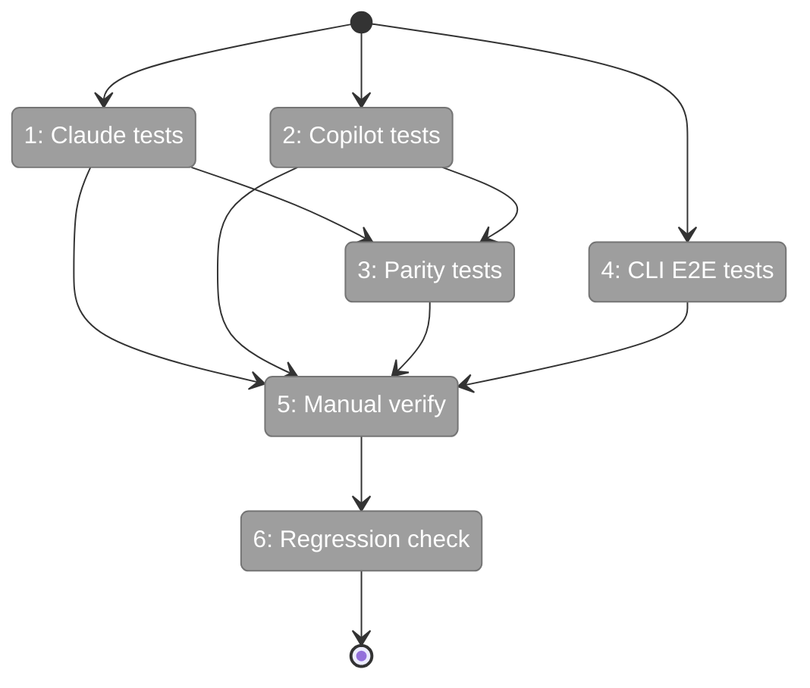
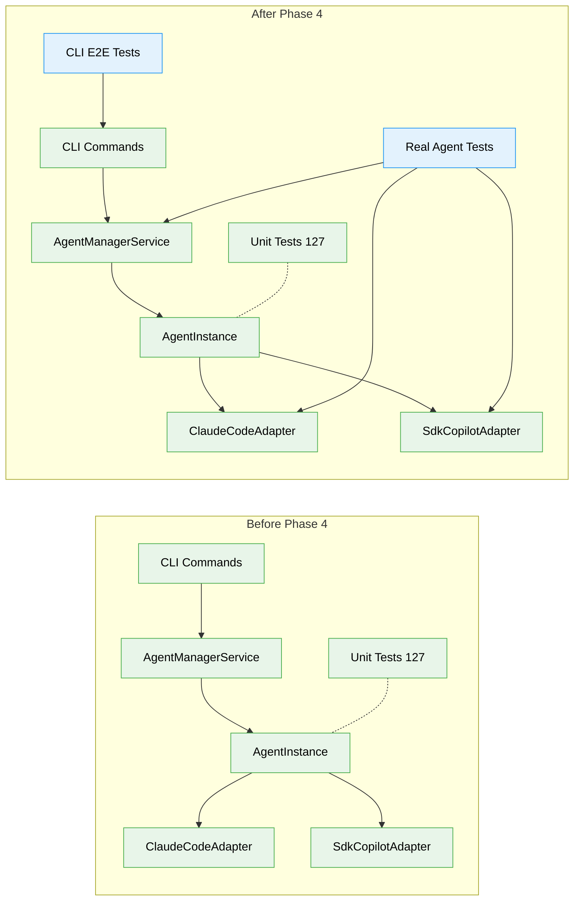

# Flight Plan: Phase 4 — Real Agent Integration Tests

**Plan**: [agentic-cli-plan.md](../../agentic-cli-plan.md)
**Phase**: Phase 4: Real Agent Integration Tests
**Generated**: 2026-02-16
**Status**: Ready for takeoff

---

## Departure → Destination

**Where we are**: Phases 1–3 delivered a complete agent system: redesigned `AgentInstance` with 3-state lifecycle, `AgentManagerService` with session index and same-instance guarantee, matching fakes, 127 unit/contract tests, and rewired CLI commands (`cg agent run`, `cg agent compact`). Everything works with `FakeAgentAdapter` — but we haven't proven it works with real Claude Code CLI or Copilot SDK.

**Where we're going**: By the end of this phase, integration tests prove the agent system works end-to-end with both real adapters. A developer can run `npx vitest run test/integration/agent-instance-real.test.ts` and see session creation, resumption, multi-handler event delivery, parallel execution, and compact all succeed with real agents. CLI E2E tests prove `cg agent run` and `cg agent compact` work as documented.

---

## Flight Status

<!-- Updated by /plan-6: pending → active → done. Use blocked for problems/input needed. -->

**Legend**: grey = pending | yellow = active | red = blocked/needs input | green = done

---

## Stages

<!-- Updated by /plan-6 during implementation: [ ] → [~] → [x] -->

- [x] **Stage 1: Write Claude Code integration tests** — new session, resume, multi-handler, parallel, compact+resume with real `ClaudeCodeAdapter` (`test/integration/agent-instance-real.test.ts` — new file)
- [x] **Stage 2: Write Copilot SDK integration tests** — same 5 tests with real `SdkCopilotAdapter`, `CopilotClient` lifecycle management (same file)
- [x] **Stage 3: Write cross-adapter parity tests** — event type intersection, resume parity, compact parity requiring both adapters simultaneously (same file)
- [x] **Stage 4: Write CLI E2E tests** — spawn `cg agent run` and `cg agent compact` as subprocesses, verify JSON output, exit codes, session chaining, NDJSON stream (`test/e2e/agent-cli-e2e.test.ts` — new file)
- [x] **Stage 5: Run real tests manually** — execute with available adapters, document results in execution log
- [x] **Stage 6: Verify CI skip and regression** — `just fft` passes with real tests skipped, zero regressions

---

## Acceptance Criteria

- [ ] Claude Code: new session, resume, handlers, parallel, compact (AC-35 through AC-38a)
- [ ] Copilot SDK: same test suite (AC-40 through AC-43a)
- [ ] Cross-adapter parity validated (AC-45, AC-46, AC-46a)
- [ ] CLI E2E: session chaining, compact, stream mode
- [ ] All tests have `describe.skipIf` for CI safety (AC-39, AC-44)
- [ ] `just fft` passes with real tests skipped (AC-47)

---

## Goals & Non-Goals

**Goals**:
- Prove AgentInstance works with real Claude Code CLI and Copilot SDK
- Validate session chaining, compaction, event handlers, and parallel execution
- Prove CLI commands work end-to-end via subprocess E2E tests
- Maintain CI safety with skip guards on all real agent tests

**Non-Goals**:
- Content assertions on LLM output (non-deterministic)
- Performance benchmarking or timing assertions
- Adapter-level testing (covered by existing `real-agent-multi-turn.test.ts`)
- Extracting shared test utilities from existing files
- Web UI integration or SSE testing

---

## Architecture: Before & After

**Legend**: existing (green, unchanged) | changed (orange, modified) | new (blue, created)

---

## Checklist

- [ ] T001: Write Claude Code integration tests — 5 tests covering AC-35 through AC-39 (CS-2)
- [ ] T002: Write Copilot SDK integration tests — 5 tests covering AC-40 through AC-44 (CS-2)
- [ ] T003: Write cross-adapter parity tests — 3 tests covering AC-45, AC-46, AC-46a (CS-2)
- [ ] T004: Write CLI E2E tests — 4 tests for session, chaining, compact, stream (CS-2)
- [ ] T005: Run real agent tests manually and document results (CS-1)
- [ ] T006: Verify CI skip behavior and `just fft` regression (CS-1)

---

## PlanPak

Active — test files placed per File Placement Manifest:
- `test/integration/agent-instance-real.test.ts` (plan-scoped)
- `test/e2e/agent-cli-e2e.test.ts` (plan-scoped)
