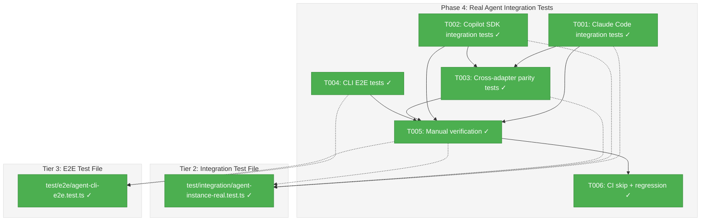
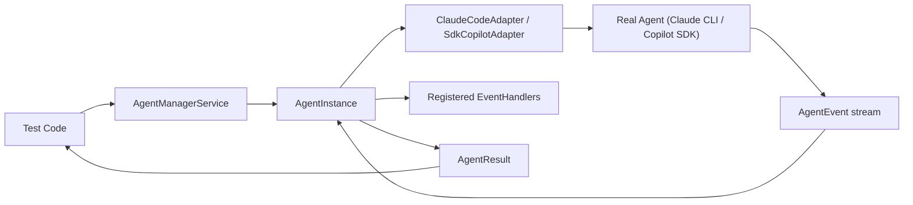
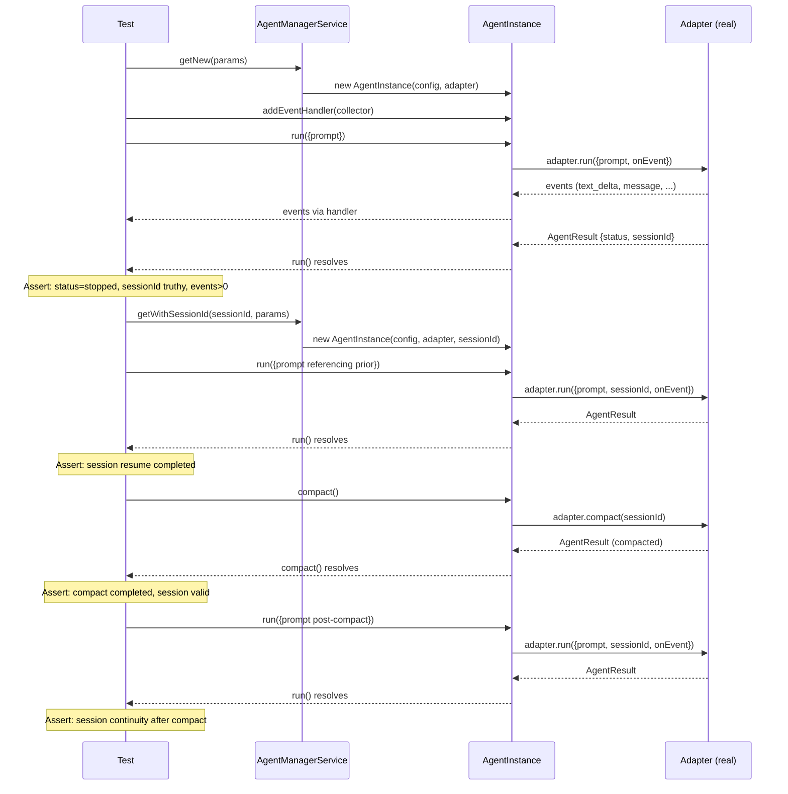

# Phase 4: Real Agent Integration Tests – Tasks & Alignment Brief

**Spec**: [agentic-cli-spec.md](../../agentic-cli-spec.md)
**Plan**: [agentic-cli-plan.md](../../agentic-cli-plan.md)
**Date**: 2026-02-16

---

## Executive Briefing

### Purpose

This phase proves the redesigned AgentInstance and AgentManagerService work with real Claude Code CLI and Copilot SDK agents. Without real agent validation, we have only unit-test confidence — the actual adapter-to-instance wiring, session chaining, event pass-through, parallel execution, and compact behavior remain untested against real infrastructure.

### What We're Building

Two test files that exercise the 034 agent system against real adapters:

1. **Tier 2: Real Agent Integration Tests** (`test/integration/agent-instance-real.test.ts`) — Tests `AgentInstance` wrapping real `ClaudeCodeAdapter` and `SdkCopilotAdapter`, plus cross-adapter parity assertions
2. **Tier 3: CLI E2E Tests** (`test/e2e/agent-cli-e2e.test.ts`) — Spawns actual `cg agent run` and `cg agent compact` CLI processes, verifying stdout/exit codes and session chaining across invocations

### User Value

Developers can trust that the agent system works end-to-end with real agents. These tests serve as living documentation of real agent behavior patterns (session IDs, event shapes, compact semantics).

### Example

**Tier 2**: `AgentManagerService(factory).getNew(params).run({prompt})` → status `'stopped'`, sessionId truthy, events array non-empty
**Tier 3**: `cg agent run -t claude-code -p "What is 2+2?" --quiet` → stdout contains JSON with `"status":"completed"`, exit code 0

---

## Objectives & Scope

### Objective

Validate the Plan 034 agent system with real Claude Code CLI and Copilot SDK. Satisfy ACs 35–46a (real agent integration) plus AC-47 (regression safety).

### Goals

- ✅ Claude Code: new session, resume, multi-handler events, parallel execution, compact+resume (AC-35 through AC-38a)
- ✅ Copilot SDK: identical test suite (AC-40 through AC-43a)
- ✅ Cross-adapter parity: both produce text events, both resume, both compact (AC-45, AC-46, AC-46a)
- ✅ CLI E2E: session chaining, compact, stream NDJSON across CLI invocations
- ✅ All tests guarded with `describe.skip` (hardcoded) for CI safety (AC-39, AC-44 intent — per DYK-P4#2)
- ✅ `just fft` green with all real tests skipped (AC-47)

### Non-Goals

- ❌ Content assertions on LLM output (non-deterministic — structural assertions only)
- ❌ Performance benchmarking or timing assertions
- ❌ Adapter-level testing (already covered by `real-agent-multi-turn.test.ts` and `sdk-copilot-adapter.test.ts`)
- ❌ Web UI integration or SSE testing (separate plan)
- ❌ Extracting shared test utilities (`hasClaudeCli()`, etc.) from existing test files — follow existing pattern of local definitions

---

## Pre-Implementation Audit

### Summary

| File | Action | Origin | Modified By | Recommendation |
|------|--------|--------|-------------|----------------|
| `test/integration/agent-instance-real.test.ts` | Created | Plan 034 | — | keep-as-is |
| `test/e2e/agent-cli-e2e.test.ts` | Created | Plan 034 | — | keep-as-is |
| `test/integration/real-agent-multi-turn.test.ts` | Read-only ref | Plan 015 | — | reuse-existing patterns |

### Per-File Detail

#### `test/integration/agent-instance-real.test.ts` (NEW)

- **Duplication check**: `hasClaudeCli()` exists in 3 other test files as local definitions. `hasCopilotSdk()` exists in `sdk-copilot-adapter.test.ts`. Following codebase convention, define locally (not extracted to shared). `EventCollector` class exists in `real-agent-multi-turn.test.ts` but plan examples use simpler `events[]` pattern — no duplication.
- **Compliance**: PlanPak file manifest places this in `test/integration/`. No ADR violations.

#### `test/e2e/agent-cli-e2e.test.ts` (NEW)

- **Duplication check**: No existing agent CLI E2E tests. Existing E2E tests cover positional graphs only.
- **Compliance**: Correct placement in `test/e2e/`. CLI must be built before running.

### Compliance Check

No violations found. Advisory: skip-guard functions are defined locally per existing codebase convention (3 prior copies of `hasClaudeCli()`).

---

## Requirements Traceability

### Coverage Matrix

| AC | Description | Flow Summary | Files in Flow | Tasks | Status |
|----|-------------|-------------|---------------|-------|--------|
| AC-35 | Claude: new session → completed + sessionId | `manager.getNew() → instance.run()` → assert status/sessionId/events | agent-instance-real.test.ts, agent-manager-service.ts, agent-instance.ts, claude-code.adapter.ts | T001 | ✅ Complete |
| AC-36 | Claude: resume session with context | Run → capture sessionId → `getWithSessionId()` → run again | Same + getWithSessionId path | T001 | ✅ Complete |
| AC-37 | Claude: two handlers receive same events | Register 2 handlers → run → assert length match | Same + `_dispatch()` method | T001 | ✅ Complete |
| AC-38 | Claude: parallel instances, different sessionIds | 2x `getNew()` → `Promise.all()` → assert different sessionIds | Same | T001 | ✅ Complete |
| AC-38a | Claude: compact+resume preserves session | `run()` → `compact()` → `run()` → assert continuity | Same + `compact()` method | T001 | ✅ Complete |
| AC-39 | Claude tests skipIf guard | `describe.skipIf(!hasClaudeCli())` | agent-instance-real.test.ts | T001 | ✅ Complete |
| AC-40 | Copilot: new session | Same as AC-35 with SdkCopilotAdapter | agent-instance-real.test.ts, sdk-copilot-adapter.ts, @github/copilot-sdk | T002 | ✅ Complete |
| AC-41 | Copilot: resume session | Same as AC-36 with SdkCopilotAdapter | Same | T002 | ✅ Complete |
| AC-42 | Copilot: two handlers | Same as AC-37 with SdkCopilotAdapter | Same | T002 | ✅ Complete |
| AC-43 | Copilot: parallel instances | Same as AC-38 with SdkCopilotAdapter | Same | T002 | ✅ Complete |
| AC-43a | Copilot: compact+resume | Same as AC-38a with SdkCopilotAdapter | Same | T002 | ✅ Complete |
| AC-44 | Copilot tests skipIf guard | `describe.skipIf(!hasCopilotSdk())` | agent-instance-real.test.ts | T002 | ✅ Complete |
| AC-45 | Cross-adapter: same event type set | Run same prompt on both → assert event type intersection | agent-instance-real.test.ts, both adapters | T003 | ✅ Complete |
| AC-46 | Cross-adapter: both support resume | Run → resume on both → assert completion | Same | T003 | ✅ Complete |
| AC-46a | Cross-adapter: both support compact | Run → compact → resume on both → assert continuity | Same | T003 | ✅ Complete |
| AC-47 | All existing tests pass | `just fft` with real tests skipped | All project files | T006 | ✅ Complete |

### Gaps Found

None — all acceptance criteria have complete file coverage.

### Import Notes

- `AgentManagerService`, `AgentInstance`, `FakeLogger`, `UnixProcessManager` — import from `@chainglass/shared`
- `ClaudeCodeAdapter` — import from `@chainglass/shared` (exported from main barrel)
- `SdkCopilotAdapter` — import from `@chainglass/shared/adapters` (subpath export)
- `CopilotClient` — import directly from `@github/copilot-sdk` (workspace hoisted)
- `AdapterFactory` — two exist! Use inline factory functions to avoid naming collision. The test constructs `AdapterFactory` closures directly: `() => new ClaudeCodeAdapter(...)`.

---

## Architecture Map

### Component Diagram

<!-- Status: grey=pending, orange=in-progress, green=completed, red=blocked -->
<!-- Updated by plan-6 during implementation -->



### Task-to-Component Mapping

<!-- Status: ⬜ Pending | 🟧 In Progress | ✅ Complete | 🔴 Blocked -->

| Task | Component(s) | Files | Status | Comment |
|------|-------------|-------|--------|---------|
| T001 | Claude Code integration | test/integration/agent-instance-real.test.ts | ✅ Complete | 5 tests: new session, resume, handlers, parallel, compact |
| T002 | Copilot SDK integration | test/integration/agent-instance-real.test.ts | ✅ Complete | 5 tests mirroring Claude Code suite |
| T003 | Cross-adapter parity | test/integration/agent-instance-real.test.ts | ✅ Complete | 3 tests: event types, resume, compact |
| T004 | CLI E2E | test/e2e/agent-cli-e2e.test.ts | ✅ Complete | 4 tests: new session, chaining, compact, stream |
| T005 | Manual verification | all test files | ✅ Complete | Run real tests, document results |
| T006 | CI skip + regression | all test files | ⬜ Pending | Verify skip guards + `just fft` green |

---

## Tasks

| Status | ID | Task | CS | Type | Dependencies | Absolute Path(s) | Validation | Subtasks | Notes |
|--------|------|------|----|------|--------------|-------------------|------------|----------|-------|
| [x] | T001 | Write Claude Code integration tests: new session (AC-35), session resume (AC-36), multiple event handlers (AC-37), parallel agents (AC-38), compact+resume (AC-38a). Use `describe.skip` (hardcoded, per DYK-P4#2 — matches `real-agent-multi-turn.test.ts` pattern). Remove `.skip` manually to run. Use `AgentManagerService` with `ClaudeCodeAdapter` via inline factory closure. Structural assertions only. 120s timeout per describe block. | 2 | Test | – | `/home/jak/substrate/033-real-agent-pods/test/integration/agent-instance-real.test.ts` | 5 tests written, all skipped by default. AC-35 through AC-38a tested when unskipped. AC-39 satisfied via hardcoded skip. | – | plan-scoped. Per Workshop 01 Tier 2 pattern. Per Discovery 10: compact delegates to adapter. DYK-P4#2: `describe.skip` not `describe.skipIf`. |
| [x] | T002 | Write Copilot SDK integration tests: same 5 tests as T001 but with `SdkCopilotAdapter`. Import `CopilotClient` from `@github/copilot-sdk`, `SdkCopilotAdapter` from `@chainglass/shared/adapters`. `afterAll` calls `copilotClient.stop()`. Use `describe.skip` (hardcoded, per DYK-P4#2). | 2 | Test | – | `/home/jak/substrate/033-real-agent-pods/test/integration/agent-instance-real.test.ts` | 5 tests written, all skipped by default. AC-40 through AC-43a tested when unskipped. AC-44 satisfied via hardcoded skip. | – | plan-scoped. Per existing `sdk-copilot-adapter.test.ts` patterns. DYK-P4#2. |
| [x] | T003 | Write cross-adapter parity tests: event type intersection (AC-45), resume parity (AC-46), compact parity (AC-46a). Requires both adapters simultaneously. Use `describe.skip` (hardcoded, per DYK-P4#2). | 2 | Test | T001, T002 | `/home/jak/substrate/033-real-agent-pods/test/integration/agent-instance-real.test.ts` | 3 tests written, all skipped by default. AC-45, AC-46, AC-46a tested when unskipped. | – | plan-scoped. Per AC-45, AC-46, AC-46a. DYK-P4#2. |
| [x] | T004 | Write CLI E2E tests: new session via CLI (exit 0, JSON output), session chaining across invocations, compact via CLI, `--stream` NDJSON output. Shell out to `node apps/cli/dist/cli.cjs agent ...`. Use `describe.skip` (hardcoded). Session chaining uses default mode (no flags) to get JSON output, parse `JSON.parse(stdout)` for sessionId (per DYK-P4#3 — `--quiet` suppresses all output). Add `just test-e2e` command to justfile (per DYK-P4#1 — `test/e2e/**` excluded from vitest). CLI must be pre-built. | 2 | Test | – | `/home/jak/substrate/033-real-agent-pods/test/e2e/agent-cli-e2e.test.ts` | 4 tests written. Session chaining works. NDJSON parseable. Exit codes correct. `just test-e2e` command added. | – | plan-scoped. Per Workshop 01 Tier 3 pattern. CLI binary at `apps/cli/dist/cli.cjs`. DYK-P4#1, DYK-P4#3. |
| [x] | T005 | Run real agent tests manually: execute `agent-instance-real.test.ts` with Claude CLI and/or Copilot SDK available. Execute `agent-cli-e2e.test.ts` with built CLI. Document results (pass/fail, event counts, durations) in execution log. | 1 | Verification | T001, T002, T003, T004 | `/home/jak/substrate/033-real-agent-pods/test/integration/agent-instance-real.test.ts`, `/home/jak/substrate/033-real-agent-pods/test/e2e/agent-cli-e2e.test.ts` | Test output documented in execution log with counts and timings. | – | Manual verification step. |
| [x] | T006 | Verify CI skip behavior and regression safety: run `just fft` to confirm all real tests are properly skipped when adapters are unavailable and no regressions in existing suite. | 1 | Verification | T005 | All project files | `just fft` passes. Real tests skipped (not errored). AC-39, AC-44, AC-47 satisfied. | – | AC-39, AC-44, AC-47. |

---

## Alignment Brief

### Prior Phases Review

#### Phase 1: Types, Interfaces, and PlanPak Setup

**Deliverables**: All type contracts (`IAgentInstance`, `IAgentManagerService`, supporting types) and PlanPak directory scaffold. 5 tasks, 0 tests (interfaces only).

**Dependencies exported for Phase 4**: `AgentInstanceConfig`, `CreateAgentParams`, `AgentRunOptions`, `AgentEventHandler`, `AgentFilter`, `IAgentInstance`, `IAgentManagerService`. All are consumed by the integration tests indirectly via `AgentInstance` and `AgentManagerService`.

**Lessons learned**: `AdapterFactory` was a Phase 1 gap (fixed in Phase 2). Three `AgentRunOptions` variants exist across the codebase — tests should use inline factory closures to avoid import confusion.

**Architectural decisions**: Config = serializable identity (no adapter in config). 3-state model (`working`/`stopped`/`error`). Event pass-through (not storage). Same-instance guarantee via session index.

#### Phase 2: Core Implementation with TDD

**Deliverables**: `AgentInstance` (194 lines), `AgentManagerService` (109 lines), `FakeAgentInstance` (255 lines), `FakeAgentManagerService` (127 lines). 90 new tests (29 unit + 15 unit + 22 contract + 24 contract).

**Dependencies exported for Phase 4**: `AgentInstance` and `AgentManagerService` classes are the primary subjects under test. The fakes provide baseline behavioral expectations that real adapters must match. `FakeLogger` and `UnixProcessManager` are needed for Claude Code adapter construction.

**Key patterns Phase 4 inherits**:
- `AgentManagerService(adapterFactory)` constructor pattern
- `manager.getNew(params)` → instance with `sessionId === null`
- `manager.getWithSessionId(sessionId, params)` → instance with session pre-set
- `instance.addEventHandler(handler)` → handler receives events during `run()`
- `instance.compact()` → requires existing sessionId, delegates to adapter
- `onSessionAcquired` internal callback — Phase 4 doesn't interact with this directly

**Discoveries**: Event dispatch uses try/catch per handler (robust). `terminate()` always lands in `stopped`. ID generation is `Date.now()` + counter.

#### Phase 3: CLI Command Update with TDD

**Deliverables**: `handleAgentRun()`, `handleAgentCompact()`, `createTerminalEventHandler()`, `ndjsonEventHandler()`, `parseMetaOptions()`. 37 new tests. CLI fully rewritten with new DI token `AGENT_MANAGER`.

**Dependencies exported for Phase 4**:
- CLI binary at `apps/cli/dist/cli.cjs` — E2E tests spawn this
- Command structure: `cg agent run -t <type> -p <prompt> [-s <session>] [--stream|--verbose|--quiet]`
- Default output: single-line JSON `AgentResult` to stdout
- `--stream`: NDJSON events then final result JSON
- `--quiet`: no stdout
- Exit codes: 0 = completed, 1 = failed

**DYK decisions affecting Phase 4**:
- **DYK-P3#1**: JSON is default output (not human-readable). E2E tests parse JSON from stdout.
- **DYK-P3#2**: `--stream`/`--verbose`/`--quiet` are mutually exclusive. E2E tests use `--quiet` for clean assertions and `--stream` for NDJSON validation.
- **DYK-P3#3**: No timeout enforcement. Real agent tests should NOT expect timeout behavior.

### Cross-Phase Synthesis

**Cumulative state**: Phases 1-3 delivered a complete agent system (interfaces → implementations → fakes → contract tests → CLI commands → DI wiring). 127 new tests added. Phase 4 adds the final validation layer with real agents.

**Pattern evolution**: Phase 1 established interfaces. Phase 2 proved behavior with fakes. Phase 3 proved CLI wiring with handler tests. Phase 4 closes the loop by proving everything works with real adapters.

**Reusable infrastructure**: `FakeLogger` (for adapter construction), `UnixProcessManager` (for Claude adapter), existing `real-agent-multi-turn.test.ts` patterns (skip guards, structural assertions, event collection).

### Critical Findings Affecting This Phase

| Finding | Constraint | Tasks |
|---------|-----------|-------|
| Discovery 10: Compact differs between adapters | Claude uses `/compact` as prompt; Copilot keeps session alive. `instance.compact()` abstracts this. | T001 (AC-38a), T002 (AC-43a), T003 (AC-46a) |
| DYK-P3#1: JSON default output | E2E tests parse JSON from stdout, not human-readable text. | T004 |
| DYK-P3#3: No timeout enforcement | Tests set 120s timeout on `describe` block, not relying on `AgentInstance.run()` timeout. | All |

### ADR Decision Constraints

- **ADR-0006 (CLI-Based Orchestration)**: CLI commands are the primary interface. E2E tests validate this by spawning actual CLI processes.
- **ADR-0010 (Central Domain Event Notification)**: AgentInstance has no notifier dependency. Real tests validate event pass-through without any SSE/notification layer.
- **ADR-0011 (First-Class Domain Concepts)**: Tests validate the interface-first service pattern by exercising `IAgentInstance` through `AgentManagerService`.

### PlanPak Placement Rules

- `test/integration/agent-instance-real.test.ts` → plan-scoped (test file for 034 feature)
- `test/e2e/agent-cli-e2e.test.ts` → plan-scoped (test file for 034 feature)
- No cross-cutting files modified in this phase

### Invariants & Guardrails

- **Structural assertions only**: Status (`stopped`/`error`), sessionId (truthy/falsy), event count (> 0), event types (includes `text_delta` or `message`). NEVER assert specific content.
- **Timeout**: 120_000ms per describe block. Individual tests inherit this.
- **Independence**: Each test creates fresh instances. No shared state between tests.
- **CI safety**: All real agent tests behind `describe.skip` (hardcoded, per DYK-P4#2). `just fft` passes with them always skipped. Remove `.skip` manually when validating.

### Visual Alignment Aids

#### System Flow: Real Agent Integration Test



#### Sequence: New Session → Resume → Compact → Resume



### Test Plan (Full TDD — Real Agent Tier)

**Philosophy**: These are integration tests, not unit tests. The "RED" step is writing tests that structurally assert real adapter behavior. The "GREEN" step is verifying they pass with real agents. There is no implementation code to write — Phase 4 is test-only.

| Test | File | AC | Assertion Pattern |
|------|------|----|-------------------|
| Claude: new session | agent-instance-real.test.ts | AC-35 | `status === 'stopped'`, `sessionId` truthy, `events.length > 0` |
| Claude: resume | agent-instance-real.test.ts | AC-36 | Both turns complete, sessionId truthy on both |
| Claude: multi-handler | agent-instance-real.test.ts | AC-37 | `handler1.length === handler2.length`, same objects |
| Claude: parallel | agent-instance-real.test.ts | AC-38 | Both complete, different sessionIds |
| Claude: compact+resume | agent-instance-real.test.ts | AC-38a | Compact completes, resume succeeds |
| Copilot: new session | agent-instance-real.test.ts | AC-40 | Same assertions as Claude |
| Copilot: resume | agent-instance-real.test.ts | AC-41 | Same |
| Copilot: multi-handler | agent-instance-real.test.ts | AC-42 | Same |
| Copilot: parallel | agent-instance-real.test.ts | AC-43 | Same |
| Copilot: compact+resume | agent-instance-real.test.ts | AC-43a | Same |
| Parity: event types | agent-instance-real.test.ts | AC-45 | Both produce `text_delta` or `message` |
| Parity: resume | agent-instance-real.test.ts | AC-46 | Both complete on resume |
| Parity: compact | agent-instance-real.test.ts | AC-46a | Both complete on compact |
| CLI: new session | agent-cli-e2e.test.ts | — | Exit 0, JSON output with sessionId |
| CLI: session chaining | agent-cli-e2e.test.ts | — | Turn 2 completes with Turn 1's sessionId |
| CLI: compact | agent-cli-e2e.test.ts | — | Compact completes, resume works |
| CLI: stream NDJSON | agent-cli-e2e.test.ts | — | Each line valid JSON, has text events |

### Implementation Outline

1. **T001**: Create `test/integration/agent-instance-real.test.ts`. Define `hasClaudeCli()`. Create Claude describe block with `beforeAll` (import `ClaudeCodeAdapter`, `UnixProcessManager`, `FakeLogger`, construct `AgentManagerService`). Write 5 tests per Workshop 01 examples: new session, resume, multi-handler, parallel, compact+resume.

2. **T002**: In same file, define `hasCopilotSdk()`. Create Copilot describe block with `beforeAll` (dynamic import `SdkCopilotAdapter`, `CopilotClient`, construct manager). `afterAll` calls `copilotClient.stop()`. Write 5 identical tests.

3. **T003**: In same file, create cross-adapter parity describe block guarded by both skip-guards. Write 3 tests: event type intersection, resume parity, compact parity.

4. **T004**: Create `test/e2e/agent-cli-e2e.test.ts`. Define `runAgentCli()` helper using `execSync`. Guard with `existsSync(CLI_PATH) && hasClaudeCli()`. Write 4 tests: new session, chaining, compact, stream.

5. **T005**: Run tests manually. Document pass/fail, event counts, durations.

6. **T006**: Run `just fft`. Confirm skip behavior. Confirm zero regressions.

### Commands to Run

```bash
# Build CLI (prerequisite for E2E tests)
pnpm --filter @chainglass/shared build && pnpm --filter @chainglass/cli build

# Run Tier 2 integration tests (requires Claude CLI / Copilot SDK)
npx vitest run test/integration/agent-instance-real.test.ts --no-file-parallelism

# Run Tier 3 E2E tests (requires built CLI + Claude CLI)
npx vitest run test/e2e/agent-cli-e2e.test.ts --no-file-parallelism

# Regression check
just fft
```

### Risks & Unknowns

| Risk | Severity | Mitigation |
|------|----------|------------|
| Claude CLI not authenticated | Medium | `describe.skipIf` guard; manual test requires auth setup |
| Copilot SDK not authenticated | Medium | `describe.skipIf` guard; may not be available on all dev machines |
| Tests slow (30-120s each) | Low | Minimal prompts, `--no-file-parallelism`, documented expected durations |
| Non-deterministic output | Low | Structural assertions only — no content checks |
| CLI binary stale | Low | E2E tests document build prerequisite; test helper checks `existsSync` |
| `@github/copilot-sdk` import resolution | Low | Workspace-hoisted from `@chainglass/shared` dependency |

### Ready Check

- [ ] Prior phases reviewed (Phases 1-3 complete)
- [ ] ADR constraints mapped to tasks
- [ ] Import paths verified (`@chainglass/shared`, `@chainglass/shared/adapters`, `@github/copilot-sdk`)
- [ ] CLI binary path confirmed (`apps/cli/dist/cli.cjs`)
- [ ] Non-goals documented (no content assertions, no adapter-level testing)

---

## Phase Footnote Stubs

| Footnote | Description |
|----------|-------------|
| [^6] | Tasks 4.1-4.3: Real agent integration tests — `file:test/integration/agent-instance-real.test.ts` |
| [^7] | Task 4.4: CLI E2E tests — `file:test/e2e/agent-cli-e2e.test.ts`, `file:vitest.e2e.config.ts`, `file:justfile` |

---

## Evidence Artifacts

- **Execution log**: `docs/plans/034-agentic-cli/tasks/phase-4-real-agent-integration-tests/execution.log.md`
- **Test output**: Captured in execution log (pass/fail, event counts, durations)

---

## Discoveries & Learnings

_Populated during implementation by plan-6. Log anything of interest to your future self._

| Date | Task | Type | Discovery | Resolution | References |
|------|------|------|-----------|------------|------------|
| 2026-02-16 | T001-T003 | decision | DYK-P4#1: `test/e2e/**` excluded from vitest config (line 38). CLI E2E tests won't run via `just fft` — need separate justfile command. | Add `just test-e2e` command to justfile during T004. E2E tests run separately from main suite. | vitest.config.ts:38, justfile |
| 2026-02-16 | T001-T003 | decision | DYK-P4#2: Spec ACs 39/44 say `describe.skipIf(!hasClaudeCli())` but existing real agent tests use hardcoded `describe.skip` (real-agent-multi-turn.test.ts:136). Auto-running 30-120s tests on every `just fft` is undesirable — tests are documentation/validation, manually unskipped when needed. | Use `describe.skip` (hardcoded) matching existing codebase pattern. Deviation from spec AC-39/AC-44 wording but satisfies CI safety intent. | real-agent-multi-turn.test.ts:136, sdk-copilot-adapter.test.ts:71 |
| 2026-02-16 | T004 | decision | DYK-P4#3: Workshop 01 E2E examples use `--quiet` then parse `Session:` from output — but after DYK-P3#1, `--quiet` suppresses ALL output (agent-run-handler.ts:116-118). Session chaining tests can't extract sessionId from empty stdout. | E2E session chaining tests use default mode (no flags) which outputs single-line JSON AgentResult. Parse `JSON.parse(stdout)` to extract `sessionId`. `--quiet` only for "suppress output" assertion test. | agent-run-handler.ts:116-118, DYK-P3#1 |
| 2026-02-16 | T004 | insight | DYK-P4#4: In `--stream` mode, NDJSON event lines come from `console.log` (terminal-event-handler.ts:83) and final result from `process.stdout.write` (agent-run-handler.ts:118). Both hit stdout but with different JSON shapes — events have `type` field, result has `status` field. | Implementer awareness: E2E stream test must handle mixed shapes. No dossier change. | terminal-event-handler.ts:83, agent-run-handler.ts:118 |

**Types**: `gotcha` | `research-needed` | `unexpected-behavior` | `workaround` | `decision` | `debt` | `insight`

**What to log**:
- Things that didn't work as expected
- External research that was required
- Implementation troubles and how they were resolved
- Gotchas and edge cases discovered
- Decisions made during implementation
- Technical debt introduced (and why)
- Insights that future phases should know about

_See also: `execution.log.md` for detailed narrative._

---

## Directory Layout

```
docs/plans/034-agentic-cli/
  ├── agentic-cli-plan.md
  ├── agentic-cli-spec.md
  └── tasks/phase-4-real-agent-integration-tests/
      ├── tasks.md              ← this file
      ├── tasks.fltplan.md      ← generated by /plan-5b
      └── execution.log.md     ← created by /plan-6
```
