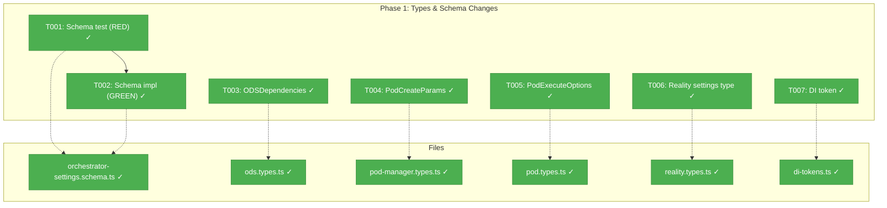

# Phase 1: Types, Interfaces, and Schema Changes – Tasks & Alignment Brief

**Spec**: [agent-orchestration-wiring-spec.md](../../agent-orchestration-wiring-spec.md)
**Plan**: [agent-orchestration-wiring-plan.md](../../agent-orchestration-wiring-plan.md)
**Date**: 2026-02-17

---

## Executive Briefing

### Purpose
This phase updates all type definitions and schemas so the orchestration system compiles against the new `IAgentManagerService` / `IAgentInstance` interfaces from Plan 034. No implementations change — only types, interfaces, schemas, and DI tokens. Downstream compile errors are expected and resolved in Phase 2-3.

### What We're Building
Type-level changes across 6 files:
- `ODSDependencies` gets `agentManager: IAgentManagerService` replacing `agentAdapter: IAgentAdapter`
- `PodCreateParams` agent variant gets `agentInstance: IAgentInstance` replacing `adapter: IAgentAdapter`
- `PodExecuteOptions` loses `contextSessionId` (session baked into instance)
- `GraphOrchestratorSettingsSchema` gains `agentType` field
- `PositionalGraphReality` gains `settings` field for ODS to read agent type
- `ORCHESTRATION_DI_TOKENS` gains `AGENT_MANAGER` token

### User Value
Foundational type safety for the orchestration wiring. Once these types are in place, Phase 2 can implement the ODS/AgentPod rewiring with full compiler assistance.

---

## Objectives & Scope

### Objective
Update all type definitions so Phase 2 implementation compiles against `IAgentManagerService` and `IAgentInstance`.

### Goals

- ✅ `ODSDependencies.agentManager: IAgentManagerService` replaces `agentAdapter`
- ✅ `PodCreateParams` agent variant uses `agentInstance: IAgentInstance`
- ✅ `PodExecuteOptions.contextSessionId` removed
- ✅ `GraphOrchestratorSettingsSchema` validates `agentType` field
- ✅ `PositionalGraphReality.settings` field added (type only)
- ✅ `ORCHESTRATION_DI_TOKENS.AGENT_MANAGER` token defined

### Non-Goals

- ❌ Implementing ODS.handleAgentOrCode() changes (Phase 2)
- ❌ Implementing AgentPod constructor changes (Phase 2)
- ❌ Updating any test files (Phase 3)
- ❌ DI container registration changes (Phase 3)
- ❌ Reality builder implementation to populate settings (Phase 2)
- ❌ Fixing downstream compile errors caused by type changes (Phase 2-3)

---

## Pre-Implementation Audit

### Summary
| File | Action | Origin | Modified By | Recommendation |
|------|--------|--------|-------------|----------------|
| `.../030-orchestration/ods.types.ts` | Modified | Plan 030 Phase 6 | Plan 030 only | ✅ Proceed |
| `.../030-orchestration/pod-manager.types.ts` | Modified | Plan 030 Phase 4 | Plan 030 only | ✅ Proceed |
| `.../030-orchestration/pod.types.ts` | Modified | Plan 030 Phase 4 | Plan 030 only | ✅ Proceed |
| `.../schemas/orchestrator-settings.schema.ts` | Modified | Plan 030 | Plan 030 only | ✅ Proceed |
| `.../030-orchestration/reality.types.ts` | Modified | Plan 030 | Plan 030 only | ✅ Proceed |
| `packages/shared/src/di-tokens.ts` | Modified (additive) | Plan 003 | Plans 019,023,026,027,029,030 | ⚠️ Proceed — add JSDoc cross-ref |

### Compliance Check
| Severity | File | Rule/ADR | Issue | Fix |
|----------|------|----------|-------|-----|
| LOW | `di-tokens.ts` | ADR-0004 | Three tokens across SHARED/CLI/ORCHESTRATION resolve to same `'IAgentManagerService'` string | Add JSDoc noting alias relationship |

**Note**: Plan originally listed `pod.schema.ts` and `graph.schema.ts` — both were WRONG files. Corrected to `pod.types.ts` and `orchestrator-settings.schema.ts` per audit findings.

---

## Requirements Traceability

### Coverage Matrix
| AC | Description | Files in Flow | Tasks | Status |
|----|-------------|---------------|-------|--------|
| AC-01 | ODSDependencies: `agentAdapter` → `agentManager` | `ods.types.ts` | T003 | ✅ Covered |
| AC-08 | PodCreateParams: `adapter` → `agentInstance` | `pod-manager.types.ts` | T004 | ✅ Covered |
| AC-09 | Remove `contextSessionId` from PodExecuteOptions | `pod.types.ts` | T005 | ✅ Covered |
| AC-10 | GraphOrchestratorSettingsSchema adds `agentType` | `orchestrator-settings.schema.ts` | T001, T002 | ✅ Covered |
| AC-11 (prep) | `reality.settings.agentType` readable by ODS | `reality.types.ts` | T006 | ✅ Covered |
| AC-12 | `ORCHESTRATION_DI_TOKENS.AGENT_MANAGER` | `di-tokens.ts` | T007 | ✅ Covered |

### Gaps Found
None after corrections. Original plan had 2 wrong file paths (pod.schema.ts → pod.types.ts, graph.schema.ts → orchestrator-settings.schema.ts) — corrected in this dossier.

---

## Architecture Map

### Component Diagram
<!-- Status: grey=pending, orange=in-progress, green=completed, red=blocked -->
<!-- Updated by plan-6 during implementation -->



### Task-to-Component Mapping

| Task | Component(s) | Files | Status | Comment |
|------|-------------|-------|--------|---------|
| T001 | Schema test | orchestrator-settings.schema.ts | ✅ Complete | RED: write failing test for agentType |
| T002 | Schema impl | orchestrator-settings.schema.ts | ✅ Complete | GREEN: add agentType to schema |
| T003 | ODS types | ods.types.ts | ✅ Complete | Replace agentAdapter with agentManager |
| T004 | Pod types | pod-manager.types.ts | ✅ Complete | Replace adapter with agentInstance |
| T005 | Pod options | pod.types.ts | ✅ Complete | Remove contextSessionId |
| T006 | Reality types | reality.types.ts | ✅ Complete | Add settings field |
| T007 | DI tokens | di-tokens.ts | ✅ Complete | Add AGENT_MANAGER token |

---

## Tasks

| Status | ID | Task | CS | Type | Dependencies | Absolute Path(s) | Validation | Subtasks | Notes |
|--------|------|------|-----|------|------------|-------------------|------------|----------|-------|
| [x] | T001 | Write unit tests for `GraphOrchestratorSettingsSchema` with `agentType` field: accepts `'claude-code'`, accepts `'copilot'`, rejects invalid strings, `.default('copilot')` applied (`.parse({})` returns `{ agentType: 'copilot' }`), explicit value preserved | 1 | Test | – | `/home/jak/substrate/033-real-agent-pods/test/unit/schemas/orchestrator-settings.schema.test.ts` | Tests exist and FAIL (RED) — schema doesn't have agentType yet | – | cross-plan-edit [^1] |
| [x] | T002 | Add `agentType: z.enum(['claude-code', 'copilot']).default('copilot')` to `GraphOrchestratorSettingsSchema` `.extend({})` block | 1 | Core | T001 | `/home/jak/substrate/033-real-agent-pods/packages/positional-graph/src/schemas/orchestrator-settings.schema.ts` | Tests from T001 pass (GREEN). Schema accepts/rejects correctly. `parse({})` returns `{ agentType: 'copilot' }`. | – | cross-plan-edit [^1] |
| [x] | T003 | Update `ODSDependencies` interface: replace `readonly agentAdapter: IAgentAdapter` with `readonly agentManager: IAgentManagerService`. Add import for `IAgentManagerService` from `@chainglass/shared`. | 1 | Core | – | `/home/jak/substrate/033-real-agent-pods/packages/positional-graph/src/features/030-orchestration/ods.types.ts` | Interface compiles. Downstream `ods.ts` has compile errors (expected). | – | cross-plan-edit. Per ADR-0011 [^2] |
| [x] | T004 | Update `PodCreateParams` agent variant: replace `readonly adapter: IAgentAdapter` with `readonly agentInstance: IAgentInstance`. Add import for `IAgentInstance` from `@chainglass/shared`. | 1 | Core | – | `/home/jak/substrate/033-real-agent-pods/packages/positional-graph/src/features/030-orchestration/pod-manager.types.ts` | Type compiles. Downstream `pod-manager.ts`, `ods.ts` have compile errors (expected). | – | cross-plan-edit [^3] |
| [x] | T005 | Remove `readonly contextSessionId?: string` from `PodExecuteOptions` interface | 1 | Core | – | `/home/jak/substrate/033-real-agent-pods/packages/positional-graph/src/features/030-orchestration/pod.types.ts` | Field removed. Downstream `pod.agent.ts`, `ods.ts` have compile errors (expected). | – | cross-plan-edit [^3] |
| [x] | T006 | Add `readonly settings?: GraphOrchestratorSettings` field (optional) to `PositionalGraphReality` interface. Add import for `GraphOrchestratorSettings` from schemas. | 1 | Core | T002 | `/home/jak/substrate/033-real-agent-pods/packages/positional-graph/src/features/030-orchestration/reality.types.ts` | Interface compiles. No downstream breakage (optional field). Reality builder populates in Phase 2. | – | cross-plan-edit. Enables AC-11 [^4] |
| [x] | T007 | Add `AGENT_MANAGER: SHARED_DI_TOKENS.AGENT_MANAGER_SERVICE` to `ORCHESTRATION_DI_TOKENS` (reference, not duplicate string). JSDoc: `/** Orchestration alias — references SHARED_DI_TOKENS.AGENT_MANAGER_SERVICE. See also CLI_DI_TOKENS.AGENT_MANAGER */` | 1 | Core | – | `/home/jak/substrate/033-real-agent-pods/packages/shared/src/di-tokens.ts` | Token exists. Value references shared token (not hardcoded string). | – | cross-cutting. Per ADR-0004 [^4] |

---

## Alignment Brief

### Critical Findings Affecting This Phase

| Finding | Constraint | Tasks |
|---------|-----------|-------|
| #02: PodCreateParams is a discriminated union | Changing `adapter` to `agentInstance` breaks callers | T004 |
| #03: contextSessionId threaded through PodExecuteOptions | Removing it breaks `pod.agent.ts` and `ods.ts` | T005 |
| #07: GraphOrchestratorSettingsSchema is empty | Additive change — non-breaking. ODS fallback is `'copilot'` | T001, T002 |
| #04: registerOrchestrationServices resolves IAgentAdapter | Token change needed first | T007 |

**New finding from audit**: `PositionalGraphReality` has no `settings` field. AC-11 requires ODS to read `reality.settings.agentType`. Added T006 to surface settings in the reality type. The builder implementation (populating the field from graph state) is Phase 2 scope.

### ADR Decision Constraints

- **ADR-0004** (DI Container Architecture): Token naming convention → `AGENT_MANAGER: 'IAgentManagerService'`. Constrains T007.
- **ADR-0011** (First-Class Domain Concepts): Interface-first design → type changes before implementation. Constrains overall phase approach.

### PlanPak Placement Rules

All files in this phase are **cross-plan-edit** — modifying existing Plan 030 types. No new feature folder needed.

### Invariants

- All type changes are additive or replacement — no new runtime behavior
- Downstream compile errors are EXPECTED and documented (resolved in Phase 2-3)
- No barrel export changes needed (same type names, different field contents)
- No test changes in this phase

### Test Plan (TDD)

| Test | File | What It Proves | Fixtures |
|------|------|---------------|----------|
| `agentType accepts claude-code` | `orchestrator-settings.schema.test.ts` | Schema validates correctly | `{ agentType: 'claude-code' }` |
| `agentType accepts copilot` | Same | Both valid values accepted | `{ agentType: 'copilot' }` |
| `agentType rejects invalid` | Same | Schema rejects bad input | `{ agentType: 'invalid' }` |
| `agentType defaults to copilot` | Same | Schema-level default | `{}` → `{ agentType: 'copilot' }` |
| `explicit value preserved` | Same | Default doesn't override | `{ agentType: 'claude-code' }` stays |

### Implementation Outline

1. **T001** (RED): Write schema tests in new test file
2. **T002** (GREEN): Add `agentType` to schema — tests pass
3. **T003-T005** (parallel, no deps): Update three type definitions
4. **T006**: Add settings to reality type (depends on T002 for import)
5. **T007**: Add DI token (independent)

### Commands to Run

```bash
# After T001 (expect RED):
pnpm vitest run test/unit/schemas/orchestrator-settings.schema.test.ts
# Should FAIL — schema doesn't have agentType yet

# After T002 (expect GREEN):
pnpm vitest run test/unit/schemas/orchestrator-settings.schema.test.ts
# Should PASS

# After all tasks (expect compile errors in downstream files):
pnpm tsc --noEmit 2>&1 | grep -c "error TS"
# Expected: several errors in ods.ts, pod.agent.ts, pod-manager.ts, reality.builder.ts, tests
# These are resolved in Phase 2-3
```

### Risks

| Risk | Severity | Mitigation |
|------|----------|------------|
| Compile errors cascade unpredictably | Low | All downstream consumers identified in audit. Phase 2-3 has exact file list. |
| Schema default behavior changes | Low | `agentType` is optional — existing graphs parse identically (`{}` still valid) |

### Ready Check

- [x] ADR constraints mapped to tasks (ADR-0004 → T007, ADR-0011 → all)
- [x] File paths verified via pre-implementation audit (2 corrections applied)
- [x] Requirements traceability complete (all ACs covered)
- [x] TDD tests defined before implementation tasks
- [x] **GO — Phase 1 Complete**

---

## Phase Footnote Stubs

_To be populated by plan-6 during implementation._

| Footnote | Phase | Summary |
|----------|-------|---------|
| [^1] | Phase 1 | Tasks 1.1-1.2 — Schema TDD: `orchestrator-settings.schema.ts` + test file |
| [^2] | Phase 1 | Task 1.3 — ODSDependencies: `ods.types.ts` |
| [^3] | Phase 1 | Tasks 1.4-1.5 — Pod types: `pod-manager.types.ts`, `pod.types.ts` |
| [^4] | Phase 1 | Task 1.6 + T006 — Reality type + DI token: `reality.types.ts`, `di-tokens.ts` |

---

## Evidence Artifacts

- **Execution Log**: `docs/plans/035-agent-orchestration-wiring/tasks/phase-1-types-interfaces-and-schema-changes/execution.log.md`
- **Flight Plan**: `docs/plans/035-agent-orchestration-wiring/tasks/phase-1-types-interfaces-and-schema-changes/tasks.fltplan.md`
- **Schema Test**: `test/unit/schemas/orchestrator-settings.schema.test.ts` (5 tests, all GREEN)

---

## Discoveries & Learnings

_Populated during implementation by plan-6. Log anything of interest to your future self._

| Date | Task | Type | Discovery | Resolution | References |
|------|------|------|-----------|------------|------------|
| 2026-02-17 | T002 | decision | `.default('copilot')` enriches `parse({})` output to `{ agentType: 'copilot' }`. Breaks `properties-and-orchestrator.test.ts` which asserts schema is empty. Also affects E2E if stale CLI build. | Expected — Phase 3 test updates resolve. Schema design is correct (DYK #4). | log#task-t002 |
| 2026-02-17 | T006 | decision | Made `settings` optional (`settings?:`) per DYK #1 to avoid 38+ file blast radius. ODS in Phase 2 uses `reality.settings?.agentType ?? 'copilot'`. | Correct — no downstream breakage. | log#task-t006 |
| 2026-02-17 | T007 | insight | `ORCHESTRATION_DI_TOKENS.AGENT_MANAGER` references `SHARED_DI_TOKENS.AGENT_MANAGER_SERVICE` (not duplicate string) per DYK #3. Prevents silent divergence. | Applied. JSDoc documents alias chain. | log#task-t007 |

**Types**: `gotcha` | `research-needed` | `unexpected-behavior` | `workaround` | `decision` | `debt` | `insight`

_See also: `execution.log.md` for detailed narrative._

---

## Directory Layout

```
docs/plans/035-agent-orchestration-wiring/
  ├── agent-orchestration-wiring-plan.md
  ├── agent-orchestration-wiring-spec.md → ../033-real-agent-pods/spec-a-orchestration-wiring.md
  ├── workshops/
  │   └── 01-e2e-wiring-with-real-agents.md
  └── tasks/
      └── phase-1-types-interfaces-and-schema-changes/
          ├── tasks.md                 ← this file
          ├── tasks.fltplan.md         ← generated by /plan-5b
          └── execution.log.md         ← created by /plan-6
```
