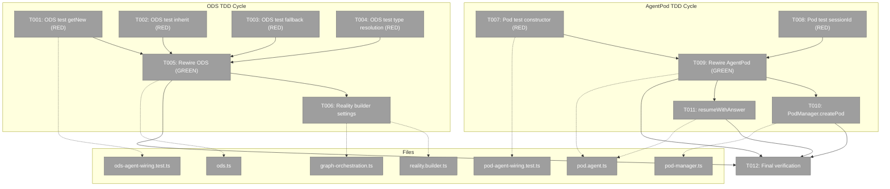
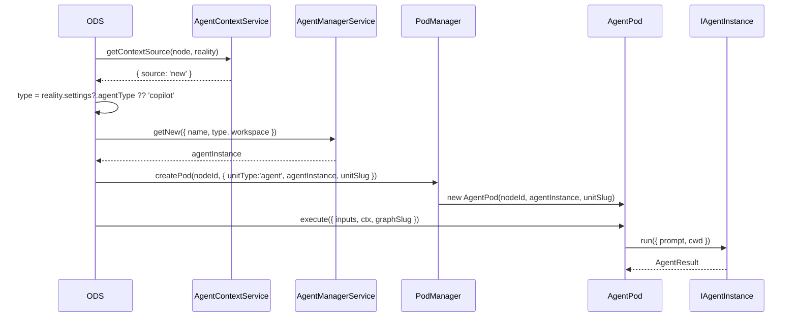

# Phase 2: ODS and AgentPod Rewiring with TDD – Tasks & Alignment Brief

**Spec**: [agent-orchestration-wiring-spec.md](../../agent-orchestration-wiring-spec.md)
**Plan**: [agent-orchestration-wiring-plan.md](../../agent-orchestration-wiring-plan.md)
**Date**: 2026-02-17

---

## Executive Briefing

### Purpose
This phase rewires ODS and AgentPod to use `AgentManagerService` and `IAgentInstance` instead of raw `IAgentAdapter`. Phase 1 changed the types; this phase changes the implementations. After this phase, ODS creates agents through the manager (getNew/getWithSessionId), and AgentPod wraps an instance with lifecycle tracking.

### What We're Building
- ODS.handleAgentOrCode() calls `agentManager.getNew()` / `.getWithSessionId()` based on AgentContextService outcomes
- ODS resolves agent type from `reality.settings.agentType` (default: `'copilot'`)
- AgentPod constructor accepts `(nodeId, agentInstance, unitSlug)` — delegates run/terminate to instance
- AgentPod reads sessionId from instance (no internal `_sessionId`)
- PodManager.createPod passes `agentInstance` to AgentPod
- Reality builder populates `settings` from graph orchestrator settings

### User Value
The orchestration system gains per-node agent lifecycle tracking, session management, and event pass-through — all for free via `IAgentInstance`. This is the core wiring that enables pods to run real AI agents.

### Example
**Before**: `ODS → buildPodParams() → { adapter: this.deps.agentAdapter } → pod.execute({ contextSessionId })`
**After**: `ODS → agentManager.getNew(params) → { agentInstance } → pod.execute({ /* no session */ })`

---

## Objectives & Scope

### Objective
Rewire ODS and AgentPod implementations with full TDD coverage for every code path.

### Goals

- ✅ ODS creates agents via `agentManager.getNew()` for new nodes
- ✅ ODS creates agents via `agentManager.getWithSessionId()` for inherited sessions
- ✅ ODS falls back to `getNew()` when inherit source has no session
- ✅ ODS resolves agent type from `reality.settings?.agentType`
- ✅ AgentPod wraps `IAgentInstance` (constructor, delegation, sessionId)
- ✅ AgentPod.resumeWithAnswer delegates to `agentInstance.run()`
- ✅ PodManager.createPod uses `agentInstance` from params
- ✅ Reality builder populates `settings` from graph state

### Non-Goals

- ❌ Updating existing test files (ods.test.ts, pod.test.ts) — Phase 3
- ❌ DI container registration changes — Phase 3
- ❌ Plan 030 E2E script updates — Phase 3
- ❌ Real agent wiring tests — Phase 4
- ❌ Prompt construction (Spec B)

---

## Pre-Implementation Audit

### Summary
| File | Action | Origin | Modified By | Recommendation |
|------|--------|--------|-------------|----------------|
| `.../030-orchestration/ods.ts` | Modified | Plan 030 | Plan 030 only | ✅ Proceed (3 compile errors from Phase 1) |
| `.../030-orchestration/pod.agent.ts` | Modified | Plan 030 | Plan 030 only | ✅ Proceed (1 compile error from Phase 1) |
| `.../030-orchestration/pod-manager.ts` | Modified | Plan 030 | Plan 030 only | ✅ Proceed (1 compile error from Phase 1) |
| `.../030-orchestration/reality.builder.ts` | Modified | Plan 030 | Plan 030 only | ⚠️ Proceed — add settings pass-through |
| `.../030-orchestration/graph-orchestration.ts` | Modified | Plan 030 | Plan 030, 032 | ⚠️ GAP — must pass settings to builder |
| `test/.../ods-agent-wiring.test.ts` | New | — | — | ✅ Proceed (no duplication) |
| `test/.../pod-agent-wiring.test.ts` | New | — | — | ✅ Proceed (no duplication) |

### Compliance Check
| Severity | File | Rule/ADR | Issue | Fix |
|----------|------|----------|-------|-----|
| LOW | `ods.types.ts` L48 | JSDoc | Stale comment says "agentAdapter" | Fix opportunistically in T005 |
| INFO | `pod.agent.ts` | Type bridge | `IAgentInstance.sessionId` is `string|null`, `IWorkUnitPod.sessionId` is `string|undefined` | Map `null → undefined` in T009 getter |

### Gap Resolution
**G1**: `graph-orchestration.ts` added as T006 — passes `settings` from graph definition into reality builder.

---

## Requirements Traceability

### Coverage Matrix
| AC | Description | Files in Flow | Tasks | Status |
|----|-------------|---------------|-------|--------|
| AC-02 | ODS getNew for source='new' | `ods.ts`, `pod-manager.ts`, `pod.agent.ts` | T001, T005, T010 | ✅ Covered |
| AC-03 | ODS getWithSessionId for inherit | `ods.ts` | T002, T005 | ✅ Covered |
| AC-04 | ODS fallback to getNew (no session) | `ods.ts` | T003, T005 | ✅ Covered |
| AC-05 | AgentPod wraps IAgentInstance | `pod.agent.ts`, `pod-manager.ts` | T007, T009, T010 | ✅ Covered |
| AC-06 | AgentPod sessionId from instance | `pod.agent.ts` | T008, T009 | ✅ Covered |
| AC-07 | AgentPod delegates run/terminate | `pod.agent.ts` | T007, T009, T011 | ✅ Covered |
| AC-11 | ODS agent type from reality.settings | `ods.ts`, `reality.builder.ts`, `graph-orchestration.ts` | T004, T005, T006 | ✅ Covered (after G1 fix) |

### Gaps Found
All resolved — G1 (`graph-orchestration.ts`) added as T006.

---

## Architecture Map

### Component Diagram
<!-- Status: grey=pending, orange=in-progress, green=completed, red=blocked -->
<!-- Updated by plan-6 during implementation -->



### Task-to-Component Mapping

| Task | Component(s) | Files | Status | Comment |
|------|-------------|-------|--------|---------|
| T001 | ODS test | ods-agent-wiring.test.ts | ⬜ Pending | RED: getNew path |
| T002 | ODS test | ods-agent-wiring.test.ts | ⬜ Pending | RED: getWithSessionId path |
| T003 | ODS test | ods-agent-wiring.test.ts | ⬜ Pending | RED: inherit fallback |
| T004 | ODS test | ods-agent-wiring.test.ts | ⬜ Pending | RED: agent type resolution |
| T005 | ODS impl | ods.ts | ⬜ Pending | GREEN: rewire handleAgentOrCode |
| T006 | Reality builder | reality.builder.ts, graph-orchestration.ts | ⬜ Pending | Populate settings in reality |
| T007 | AgentPod test | pod-agent-wiring.test.ts | ⬜ Pending | RED: constructor + delegation |
| T008 | AgentPod test | pod-agent-wiring.test.ts | ⬜ Pending | RED: sessionId from instance |
| T009 | AgentPod impl | pod.agent.ts | ⬜ Pending | GREEN: rewire AgentPod |
| T010 | PodManager | pod-manager.ts | ⬜ Pending | Use agentInstance in createPod |
| T011 | AgentPod resume | pod.agent.ts | ⬜ Pending | resumeWithAnswer via instance |
| T012 | Verification | all | ⬜ Pending | All Phase 2 tests pass |

---

## Tasks

| Status | ID | Task | CS | Type | Dependencies | Absolute Path(s) | Validation | Subtasks | Notes |
|--------|------|------|-----|------|------------|-------------------|------------|----------|-------|
| [ ] | T001 | Write ODS unit test: `getNew` path — when context source='new', ODS calls `agentManager.getNew({ name, type, workspace, metadata })` with correct params. Uses `FakeAgentManagerService` + `FakeAgentContextService` | 2 | Test | – | `/home/jak/substrate/033-real-agent-pods/test/unit/positional-graph/features/030-orchestration/ods-agent-wiring.test.ts` | Test exists and FAILS (RED) | – | cross-plan-edit. Plan 2.1 |
| [ ] | T002 | Write ODS unit test: `getWithSessionId` path — when context source='inherit' and session exists, ODS calls `agentManager.getWithSessionId(sessionId, params)`. Verify sessionId from `podManager.getSessionId(fromNodeId)` | 2 | Test | – | `/home/jak/substrate/033-real-agent-pods/test/unit/positional-graph/features/030-orchestration/ods-agent-wiring.test.ts` | Test exists and FAILS (RED) | – | cross-plan-edit. Plan 2.2 |
| [ ] | T003 | Write ODS unit test: inherit fallback — when context source='inherit' but `podManager.getSessionId()` returns undefined, ODS calls `agentManager.getNew()` instead of `getWithSessionId()` | 1 | Test | – | `/home/jak/substrate/033-real-agent-pods/test/unit/positional-graph/features/030-orchestration/ods-agent-wiring.test.ts` | Test exists and FAILS (RED) | – | cross-plan-edit. Plan 2.3 |
| [ ] | T004 | Write ODS unit test: agent type resolution — ODS reads `reality.settings?.agentType` and passes to `getNew`/`getWithSessionId`. Test with explicit `'claude-code'`, test fallback to `'copilot'` when settings missing | 2 | Test | – | `/home/jak/substrate/033-real-agent-pods/test/unit/positional-graph/features/030-orchestration/ods-agent-wiring.test.ts` | Test exists and FAILS (RED) | – | cross-plan-edit. Plan 2.4 |
| [ ] | T005 | Rewire `ODS.handleAgentOrCode()`: branch on `node.unitType` — agent path calls `this.deps.agentManager.getNew({ name: node.unitSlug, type: agentType, workspace: ctx.worktreePath })` or `.getWithSessionId()`. Resolve `agentType` from `reality.settings?.agentType ?? 'copilot'`. Code path preserved as-is (runner pass-through). Remove `contextSessionId` from execute options. Fix stale JSDoc on ODSDependencies. | 3 | Core | T001, T002, T003, T004 | `/home/jak/substrate/033-real-agent-pods/packages/positional-graph/src/features/030-orchestration/ods.ts` | All T001-T004 tests pass (GREEN). 3 compile errors resolved. | – | cross-plan-edit. Plan 2.5, Critical Finding #01 |
| [ ] | T006 | Populate `settings` in reality builder: add `settings?: GraphOrchestratorSettings` to `BuildRealityOptions`, pass through in `buildPositionalGraphReality()` return object. Update `graph-orchestration.ts` `buildReality()` to add `graphService.loadGraphDefinition()` to the `Promise.all` and pass `definition.orchestratorSettings` as settings. Load every cycle (no caching). | 2 | Core | T005 | `/home/jak/substrate/033-real-agent-pods/packages/positional-graph/src/features/030-orchestration/reality.builder.ts`, `/home/jak/substrate/033-real-agent-pods/packages/positional-graph/src/features/030-orchestration/graph-orchestration.ts` | `reality.settings.agentType` is defined in production path. | – | cross-plan-edit. Gap G1 fix |
| [ ] | T007 | Write AgentPod unit tests: constructor accepts `(nodeId, agentInstance: IAgentInstance, unitSlug)`, `run()` delegates to `agentInstance.run()`, `terminate()` delegates to `agentInstance.terminate()`. Uses `FakeAgentInstance`. | 2 | Test | – | `/home/jak/substrate/033-real-agent-pods/test/unit/positional-graph/features/030-orchestration/pod-agent-wiring.test.ts` | Tests exist and FAIL (RED) | – | cross-plan-edit. Plan 2.6 |
| [ ] | T008 | Write AgentPod unit tests: `sessionId` reads from `agentInstance.sessionId` (not internal `_sessionId`), `execute()` does NOT pass `contextSessionId`, session comes from instance. Verify `null→undefined` bridge. | 1 | Test | – | `/home/jak/substrate/033-real-agent-pods/test/unit/positional-graph/features/030-orchestration/pod-agent-wiring.test.ts` | Tests exist and FAIL (RED) | – | cross-plan-edit. Plan 2.7 |
| [ ] | T009 | Rewire AgentPod: constructor `(nodeId, agentInstance: IAgentInstance, unitSlug)`, remove `_sessionId` field, `get sessionId()` → `agentInstance.sessionId ?? undefined`, `execute()` → `agentInstance.run({ prompt, cwd })`, `terminate()` → `agentInstance.terminate()`. | 2 | Core | T007, T008 | `/home/jak/substrate/033-real-agent-pods/packages/positional-graph/src/features/030-orchestration/pod.agent.ts` | All T007-T008 tests pass (GREEN). 1 compile error resolved. | – | cross-plan-edit. Plan 2.8 |
| [ ] | T010 | Update `PodManager.createPod()`: change `new AgentPod(nodeId, params.adapter)` to `new AgentPod(nodeId, params.agentInstance, params.unitSlug)` | 1 | Core | T009 | `/home/jak/substrate/033-real-agent-pods/packages/positional-graph/src/features/030-orchestration/pod-manager.ts` | 1 compile error resolved. createPod passes agentInstance. | – | cross-plan-edit. Plan 2.9 |
| [ ] | T011 | Update `AgentPod.resumeWithAnswer()`: delegate to `agentInstance.run({ prompt: resumePrompt, cwd })` instead of `agentAdapter.run()`. Preserve guard logic using `agentInstance.sessionId`. | 1 | Core | T009 | `/home/jak/substrate/033-real-agent-pods/packages/positional-graph/src/features/030-orchestration/pod.agent.ts` | resumeWithAnswer delegates to instance. | – | cross-plan-edit. Plan 2.10 |
| [ ] | T012 | Refactor and verify: run all Phase 2 tests together. Verify 0 compile errors in modified files. Run `pnpm vitest run test/unit/positional-graph/features/030-orchestration/ods-agent-wiring.test.ts test/unit/positional-graph/features/030-orchestration/pod-agent-wiring.test.ts`. | 1 | Integration | T005, T006, T009, T010, T011 | All Phase 2 files | All Phase 2 tests pass. No compile errors in modified files. | – | Plan 2.11 |

---

## Alignment Brief

### Prior Phases Review

#### Phase 1: Types, Interfaces, and Schema Changes — COMPLETE

**Deliverables Created** (7 files):
1. `orchestrator-settings.schema.ts` — Added `agentType: z.enum(['claude-code','copilot']).default('copilot')`
2. `ods.types.ts` — `agentAdapter: IAgentAdapter` → `agentManager: IAgentManagerService`
3. `pod-manager.types.ts` — `adapter: IAgentAdapter` → `agentInstance: IAgentInstance`
4. `pod.types.ts` — Removed `contextSessionId`
5. `reality.types.ts` — Added `settings?: GraphOrchestratorSettings`
6. `di-tokens.ts` — Added `ORCHESTRATION_DI_TOKENS.AGENT_MANAGER`
7. `orchestrator-settings.schema.test.ts` — 5 schema tests (all GREEN)

**Dependencies Exported to Phase 2**:
- `ODSDependencies.agentManager: IAgentManagerService` → T005 rewires ODS to use it
- `PodCreateParams { agentInstance: IAgentInstance }` → T010 updates PodManager
- `PodExecuteOptions` (no `contextSessionId`) → T005, T009 remove session threading
- `PositionalGraphReality.settings?: GraphOrchestratorSettings` → T005 reads, T006 populates
- `ORCHESTRATION_DI_TOKENS.AGENT_MANAGER` → Phase 3 (DI registration)

**Technical Discoveries**:
- `.default('copilot')` enriches `parse({})` → breaks `properties-and-orchestrator.test.ts` (Phase 3 fix)
- Optional `settings?` avoids 38+ file blast radius — use `?.` accessor pattern
- Token aliasing via reference prevents string divergence
- `.strict()` chain: field must go inside `.extend()` before `.strict()`

**Compile Errors Created** (all resolved by Phase 2):
```
ods.ts(137): agentAdapter → agentManager
ods.ts(119): adapter → agentInstance in PodCreateParams
ods.ts(124): contextSessionId removed
pod-manager.ts(33): adapter → agentInstance
pod.agent.ts(54): contextSessionId removed
```

**Footnotes**: [^1] Schema TDD, [^2] ODS types, [^3] Pod types, [^4] Reality + DI token

### Critical Findings Affecting This Phase

| Finding | Constraint | Tasks |
|---------|-----------|-------|
| #01: ODS uses single shared adapter | Must replace with per-node instance creation via manager | T005 |
| #02: PodCreateParams is discriminated union | Callers must pass `agentInstance` in agent variant | T010 |
| #03: contextSessionId threaded through | Remove from execute options, session from instance | T005, T009 |
| #06: AgentPod has resumeWithAnswer | Must update to use `agentInstance.run()` | T011 |

### ADR Decision Constraints

- **ADR-0011** (First-Class Domain Concepts): ODS rewires to `IAgentManagerService` interface — T005
- **ADR-0006** (CLI-Based Orchestration): Phase 2 is "Phase B wiring" per ADR vision

### PlanPak Placement Rules

All files are **cross-plan-edit** (modifying Plan 030 code). New test files are **test-infrastructure**.

### Invariants

- `FakeAgentManagerService` and `FakeAgentInstance` from `@chainglass/shared` — no mocks
- AgentPod.sessionId must bridge `null` → `undefined` (IAgentInstance returns `string|null`, IWorkUnitPod expects `string|undefined`)
- ODS must use `reality.settings?.agentType ?? 'copilot'` (optional chaining + schema default)
- Existing tests (ods.test.ts, pod.test.ts) will NOT compile — Phase 3 fixes them

### Test Plan (TDD, Fakes Only)

**ODS Wiring Tests** (`ods-agent-wiring.test.ts`):

| Test | Fixture | Expected |
|------|---------|----------|
| `getNew path: calls agentManager.getNew with correct params` | FakeAgentContextService returns `{ source: 'new' }` | `getNew()` called with `{ name, type: 'copilot', workspace }` |
| `getWithSessionId path: calls with session when inherit + session exists` | FakeContext `{ source: 'inherit', fromNodeId }`, FakePodManager has session | `getWithSessionId(sessionId, params)` called |
| `inherit fallback: calls getNew when no session` | FakeContext `{ source: 'inherit' }`, no session in PodManager | `getNew()` called (not getWithSessionId) |
| `type resolution: uses reality.settings.agentType` | reality with `settings: { agentType: 'claude-code' }` | params.type = 'claude-code' |
| `type resolution: defaults to copilot when settings missing` | reality without settings | params.type = 'copilot' |

**AgentPod Wiring Tests** (`pod-agent-wiring.test.ts`):

| Test | Fixture | Expected |
|------|---------|----------|
| `constructor accepts IAgentInstance` | `new AgentPod(nodeId, fakeInstance, unitSlug)` | No errors |
| `run delegates to agentInstance.run` | call execute() | `fakeInstance.run()` called with `{ prompt, cwd }` |
| `terminate delegates to agentInstance.terminate` | call terminate() | `fakeInstance.terminate()` called |
| `sessionId reads from instance` | fakeInstance with sessionId='abc' | pod.sessionId === 'abc' |
| `sessionId bridges null to undefined` | fakeInstance with sessionId=null | pod.sessionId === undefined |
| `execute does not pass contextSessionId` | call execute() | no contextSessionId in run params |

### Implementation Outline

1. **T001-T004** (RED): Write all ODS wiring tests in `ods-agent-wiring.test.ts`
2. **T005** (GREEN): Rewire `ODS.handleAgentOrCode()` — resolve all 3 compile errors + new behavior
3. **T006**: Populate `settings` in reality builder + graph-orchestration caller
4. **T007-T008** (RED): Write all AgentPod wiring tests in `pod-agent-wiring.test.ts`
5. **T009** (GREEN): Rewire `AgentPod` — resolve compile error + new constructor/delegation
6. **T010**: Update `PodManager.createPod()` — one-line fix
7. **T011**: Update `resumeWithAnswer()` — delegate to instance
8. **T012**: Run all Phase 2 tests, verify 0 compile errors in modified files

### Sequence Diagram



### Commands to Run

```bash
# After T001-T004 (expect RED):
pnpm vitest run test/unit/positional-graph/features/030-orchestration/ods-agent-wiring.test.ts
# Should FAIL

# After T005 (expect GREEN):
pnpm vitest run test/unit/positional-graph/features/030-orchestration/ods-agent-wiring.test.ts
# Should PASS

# After T007-T008 (expect RED):
pnpm vitest run test/unit/positional-graph/features/030-orchestration/pod-agent-wiring.test.ts
# Should FAIL

# After T009-T011 (expect GREEN):
pnpm vitest run test/unit/positional-graph/features/030-orchestration/pod-agent-wiring.test.ts
# Should PASS

# After T012 (final gate):
pnpm vitest run test/unit/positional-graph/features/030-orchestration/ods-agent-wiring.test.ts test/unit/positional-graph/features/030-orchestration/pod-agent-wiring.test.ts
npx tsc --noEmit --pretty false 2>&1 | grep -E "ods\.ts|pod\.agent\.ts|pod-manager\.ts|reality\.builder\.ts|graph-orchestration\.ts"
# Should show 0 errors in modified files
```

### Risks

| Risk | Severity | Mitigation |
|------|----------|------------|
| ODS code paths interleave with other ODS handlers | Medium | Only modify `handleAgentOrCode()` and `buildPodParams()` — other handlers untouched |
| AgentPod resumeWithAnswer guard logic changes | Medium | Test resume path explicitly (T011) |
| FakeAgentManagerService API mismatch | Low | Import directly from `@chainglass/shared` — Plan 034 stable |
| Reality builder settings pass-through misses graph-orchestration caller | Medium | T006 explicitly covers both builder AND caller (Gap G1) |

### Ready Check

- [x] ADR constraints mapped to tasks (ADR-0011 → T005, ADR-0006 → all)
- [x] Prior phase review complete (Phase 1: 7/7 tasks, all exports documented)
- [x] Pre-implementation audit complete (6 files, 1 gap resolved)
- [x] Requirements traceability complete (7 ACs, 1 gap resolved as T006)
- [x] TDD tests defined before implementation tasks
- [ ] **Awaiting GO/NO-GO**

---

## Phase Footnote Stubs

_To be populated by plan-6 during implementation._

| Footnote | Phase | Summary |
|----------|-------|---------|
| | | |

---

## Evidence Artifacts

- **Execution Log**: `docs/plans/035-agent-orchestration-wiring/tasks/phase-2-ods-and-agentpod-rewiring-with-tdd/execution.log.md`
- **Flight Plan**: `docs/plans/035-agent-orchestration-wiring/tasks/phase-2-ods-and-agentpod-rewiring-with-tdd/tasks.fltplan.md`
- **ODS Wiring Tests**: `test/unit/positional-graph/features/030-orchestration/ods-agent-wiring.test.ts`
- **AgentPod Wiring Tests**: `test/unit/positional-graph/features/030-orchestration/pod-agent-wiring.test.ts`

---

## Discoveries & Learnings

_Populated during implementation by plan-6. Log anything of interest to your future self._

| Date | Task | Type | Discovery | Resolution | References |
|------|------|------|-----------|------------|------------|
| | | | | | |

**Types**: `gotcha` | `research-needed` | `unexpected-behavior` | `workaround` | `decision` | `debt` | `insight`

_See also: `execution.log.md` for detailed narrative._

---

## Directory Layout

```
docs/plans/035-agent-orchestration-wiring/
  ├── agent-orchestration-wiring-plan.md
  ├── agent-orchestration-wiring-spec.md → ../033-real-agent-pods/spec-a-orchestration-wiring.md
  ├── workshops/
  │   └── 01-e2e-wiring-with-real-agents.md
  └── tasks/
      ├── phase-1-types-interfaces-and-schema-changes/
      │   ├── tasks.md                 ← Phase 1 (COMPLETE)
      │   ├── tasks.fltplan.md
      │   └── execution.log.md
      └── phase-2-ods-and-agentpod-rewiring-with-tdd/
          ├── tasks.md                 ← this file
          ├── tasks.fltplan.md         ← generated by /plan-5b
          └── execution.log.md         ← created by /plan-6
```
