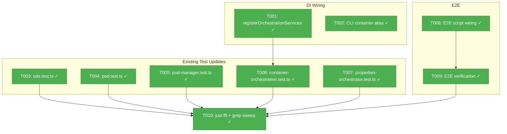

# Phase 3: DI Container and Existing Test Updates – Tasks & Alignment Brief

**Spec**: [agent-orchestration-wiring-spec.md](../../agent-orchestration-wiring-spec.md)
**Plan**: [agent-orchestration-wiring-plan.md](../../agent-orchestration-wiring-plan.md)
**Date**: 2026-02-17

---

## Executive Briefing

### Purpose
This phase aligns the DI container and updates all existing tests so the full codebase compiles and passes with the new `IAgentManagerService` wiring from Phases 1-2. After this phase, `just fft` passes with zero `agentAdapter`/`FakeAgentAdapter` references remaining in orchestration code.

### What We're Building
- DI container resolves `IAgentManagerService` for ODS (replacing `IAgentAdapter`)
- CLI container registers same `AgentManagerService` instance for orchestration token
- All existing orchestration tests updated: `ods.test.ts`, `pod.test.ts`, `pod-manager.test.ts`, container tests
- Schema test fixed (`GraphOrchestratorSettingsSchema` no longer empty)
- Plan 030 E2E script updated (4-line FakeAgentAdapter → FakeAgentManagerService swap)

### User Value
Clean codebase: 3858+ tests pass, zero stale interface references, DI container correctly wired for production orchestration.

---

## Objectives & Scope

### Objective
Wire DI container and update all existing tests for the new `IAgentManagerService`-based orchestration.

### Goals

- ✅ `registerOrchestrationServices()` resolves `AGENT_MANAGER` token
- ✅ CLI container shares same `AgentManagerService` instance for orchestration
- ✅ All existing ODS, pod, pod-manager tests updated and passing
- ✅ Schema assertion test fixed
- ✅ Plan 030 E2E script passes with new wiring (58 steps)
- ✅ `just fft` passes (3858+ tests)
- ✅ Zero `agentAdapter`/`FakeAgentAdapter` references in orchestration code/tests

### Non-Goals

- ❌ Writing new tests (Phase 2 did that)
- ❌ Real agent wiring tests (Phase 4)
- ❌ Any implementation changes beyond DI wiring
- ❌ Prompt construction (Spec B)

---

## Pre-Implementation Audit

### Summary
| File | Action | Origin | Modified By | Recommendation |
|------|--------|--------|-------------|----------------|
| `packages/positional-graph/src/container.ts` | Modified | Plan 030 Phase 7 | Plan 030 | ✅ Proceed — DI registration |
| `apps/cli/src/lib/container.ts` | Modified | Plan 034 | Plans 010,014,034 | ✅ Proceed — add token alias |
| `test/.../ods.test.ts` | Modified | Plan 030 Phase 6 | Plan 030 | ✅ Proceed — replace stubAdapter |
| `test/.../pod.test.ts` | Modified | Plan 030 Phase 4 | Plan 030 | ✅ Proceed — replace FakeAgentAdapter |
| `test/.../pod-manager.test.ts` | Modified | Plan 030 Phase 4 | Plan 030 | ✅ Proceed — replace adapter param |
| `test/.../container-orchestration.test.ts` | Modified | Plan 030 Phase 7 | Plan 030 | ✅ Proceed — update token resolution |
| `test/.../properties-and-orchestrator.test.ts` | Modified | Plan 030 Phase 1 | Plan 030 | ✅ Proceed — fix schema assertion |
| `test/e2e/positional-graph-orchestration-e2e.ts` | Modified | Plan 030 Phase 8 | Plan 030 | ✅ Proceed — 4-line swap |

### Compliance Check
No violations. All files are cross-plan-edit (modifying Plan 030 code).

---

## Requirements Traceability

### Coverage Matrix
| AC | Description | Files in Flow | Tasks | Status |
|----|-------------|---------------|-------|--------|
| AC-12 | DI container has ORCHESTRATION_DI_TOKENS.AGENT_MANAGER, CLI shares instance | `container.ts` (pkg+cli) | T001, T002 | ✅ Covered |
| AC-31 | E2E script uses FakeAgentManagerService | E2E script | T008 | ✅ Covered |
| AC-32 | E2E behavior unchanged after wiring update | E2E script | T009 | ✅ Covered |
| AC-33 | All existing orchestration tests updated and pass | ods/pod/pod-manager/container tests | T003-T007 | ✅ Covered |
| AC-40 | All existing tests continue to pass (3858+) | All | T010 | ✅ Covered |

### Gaps Found
None — all acceptance criteria covered.

---

## Architecture Map

### Component Diagram



### Task-to-Component Mapping

| Task | Component(s) | Files | Status | Comment |
|------|-------------|-------|--------|---------|
| T001 | DI container | container.ts (pkg) | ✅ Complete | Resolve AGENT_MANAGER for ODS |
| T002 | CLI container | container.ts (cli) | ✅ Complete | Register orchestration token alias |
| T003 | ODS tests | ods.test.ts | ✅ Complete | Replace stubAdapter → FakeAgentManagerService |
| T004 | Pod tests | pod.test.ts | ✅ Complete | Replace FakeAgentAdapter → FakeAgentInstance |
| T005 | PodManager tests | pod-manager.test.ts | ✅ Complete | Replace adapter → agentInstance |
| T006 | Container tests | container-orchestration.test.ts | ✅ Complete | AGENT_MANAGER token resolution |
| T007 | Schema tests | properties-and-orchestrator.test.ts | ✅ Complete | Fix "schema is empty" assertion |
| T008 | E2E script | positional-graph-orchestration-e2e.ts | ✅ Complete | 4-line FakeAgentAdapter swap |
| T009 | E2E verify | E2E script | ✅ Complete | 58-step pipeline passes |
| T010 | Full suite | all | ✅ Complete | just fft + grep sweep |

---

## Tasks

| Status | ID | Task | CS | Type | Dependencies | Absolute Path(s) | Validation | Subtasks | Notes |
|--------|------|------|-----|------|------------|-------------------|------------|----------|-------|
| [x] | T001 | Update `registerOrchestrationServices()`: resolve `IAgentManagerService` from `ORCHESTRATION_DI_TOKENS.AGENT_MANAGER` instead of `IAgentAdapter` from `AGENT_ADAPTER`. Pass as `agentManager` to ODS constructor. Update import + prerequisite JSDoc. | 2 | Core | – | `/home/jak/substrate/033-real-agent-pods/packages/positional-graph/src/container.ts` | Container compiles. ODS receives `agentManager`. | – | cross-plan-edit. Per ADR-0004, ADR-0009 [^9] |
| [x] | T002 | Verify `ORCHESTRATION_DI_TOKENS.AGENT_MANAGER` resolves to same instance as `CLI_DI_TOKENS.AGENT_MANAGER` in CLI container — both tokens equal `'IAgentManagerService'`, existing registration covers both. No code change needed. | 1 | Test | T001 | `/home/jak/substrate/033-real-agent-pods/apps/cli/src/lib/container.ts` | Assert both tokens resolve to same `AgentManagerService` instance. | – | No-op per DYK #1 — tokens share string [^9] |
| [x] | T003 | Update `ods.test.ts`: replace `stubAdapter: IAgentAdapter` with `FakeAgentManagerService`, replace `agentAdapter: stubAdapter` with `agentManager: new FakeAgentManagerService()` in all 3 `beforeEach` blocks. Remove `IAgentAdapter` import, add `FakeAgentManagerService` import. | 2 | Test | – | `/home/jak/substrate/033-real-agent-pods/test/unit/positional-graph/features/030-orchestration/ods.test.ts` | All existing ODS tests pass. | – | cross-plan-edit. Plan 3.3 [^10] |
| [x] | T004 | Update `pod.test.ts`: replace `FakeAgentAdapter` with `FakeAgentInstance` (11 occurrences). Update `AgentPod` constructor calls to `(nodeId, instance, unitSlug)`. Remove `contextSessionId` from `makeOptions()`. | 2 | Test | – | `/home/jak/substrate/033-real-agent-pods/test/unit/positional-graph/features/030-orchestration/pod.test.ts` | All existing pod tests pass. | – | cross-plan-edit. Plan 3.4 [^10] |
| [x] | T005 | Update `pod-manager.test.ts`: replace `adapter: new FakeAgentAdapter()` with `agentInstance: new FakeAgentInstance(...)` in `makeAgentParams()`. Update import. | 1 | Test | – | `/home/jak/substrate/033-real-agent-pods/test/unit/positional-graph/features/030-orchestration/pod-manager.test.ts` | All existing pod-manager tests pass. | – | cross-plan-edit. Plan 3.5 [^10] |
| [x] | T006 | Update `container-orchestration.test.ts`: change `AGENT_ADAPTER` token resolution to `AGENT_MANAGER`. Update any assertions on resolved types. | 1 | Test | T001 | `/home/jak/substrate/033-real-agent-pods/test/unit/positional-graph/features/030-orchestration/container-orchestration.test.ts` | DI resolution tests pass. | – | cross-plan-edit. Plan 3.6 [^10] |
| [x] | T007 | Fix `properties-and-orchestrator.test.ts`: update "GraphOrchestratorSettingsSchema is empty" assertion. `parse({})` now returns `{ agentType: 'copilot' }` due to `.default('copilot')`. | 1 | Test | – | `/home/jak/substrate/033-real-agent-pods/test/unit/positional-graph/properties-and-orchestrator.test.ts` | Schema test passes. | – | cross-plan-edit. Phase 1 debt [^10] |
| [x] | T008 | Update E2E script: replace `FakeAgentAdapter` with `FakeAgentManagerService` in `createOrchestrationStack()`. Replace `agentAdapter` in ODS deps with `agentManager`. ~4-line change per Workshop 06. | 1 | Integration | T001 | `/home/jak/substrate/033-real-agent-pods/test/e2e/positional-graph-orchestration-e2e.ts` | E2E script compiles. | – | cross-plan-edit. Plan 3.7, Critical Finding #08 [^11] |
| [x] | T009 | Verify E2E: run E2E script, confirm 58 steps complete, exit 0. Output structure matches pre-change behavior. | 1 | Integration | T008 | `/home/jak/substrate/033-real-agent-pods/test/e2e/positional-graph-orchestration-e2e.ts` | Exit 0. 58 steps. | – | Plan 3.8 [^11] |
| [x] | T010 | Run `just fft` — full test suite. Verify 3858+ tests pass, 0 failures. Run `grep -rn 'agentAdapter\|FakeAgentAdapter' test/ packages/positional-graph/src/features/030-orchestration/` — 0 hits in orchestration code/tests. | 1 | Integration | T003-T009 | All | 3858+ pass. grep returns 0. | – | Plan 3.9. Gate check |

---

## Alignment Brief

### Prior Phases Review

**Phase 1 → Phase 2 → Phase 3 Evolution**:
1. Phase 1 changed types (interfaces, schemas, DI tokens) — created 5 compile errors
2. Phase 2 rewired implementations (ODS, AgentPod, PodManager, reality builder) — resolved all 5 compile errors, added 11 new tests
3. Phase 3 completes the circuit: DI container wiring + existing test updates + E2E verification

**Cumulative deliverables available to Phase 3**:
- From Phase 1: `ORCHESTRATION_DI_TOKENS.AGENT_MANAGER` token (references `SHARED_DI_TOKENS.AGENT_MANAGER_SERVICE`)
- From Phase 2: ODS accepts `agentManager: IAgentManagerService` in deps; AgentPod takes `(nodeId, IAgentInstance, unitSlug)`; `FakeAgentManagerService` + `FakeAgentInstance` proven in 11 tests

**Technical debt resolved by this phase**:
- `properties-and-orchestrator.test.ts` "schema is empty" assertion (Phase 1 debt)
- All existing test files that still reference `agentAdapter`/`FakeAgentAdapter`/`contextSessionId`
- DI container still resolves `AGENT_ADAPTER` for ODS (should be `AGENT_MANAGER`)

### Critical Findings Affecting This Phase

| Finding | Constraint | Tasks |
|---------|-----------|-------|
| #04: registerOrchestrationServices resolves IAgentAdapter | Must change to AGENT_MANAGER | T001 |
| #05: CLI container doesn't register orchestration AGENT_MANAGER | Must alias to same instance | T002 |
| #08: E2E script has 4 FakeAgentAdapter references | 4-line swap per Workshop 06 | T008 |

### ADR Decision Constraints

- **ADR-0004** (DI Container Architecture): Token registration in `registerOrchestrationServices()` — T001
- **ADR-0009** (Module Registration Pattern): `registerOrchestrationServices()` follows the pattern — T001

### PlanPak Placement Rules

All files are **cross-plan-edit** (modifying Plan 030 code/tests). No new files.

### Test Plan

No new tests — this phase updates existing tests to use new interfaces. Validation is: all existing tests pass with updated fixtures.

| Test File | Changes | Expected Result |
|-----------|---------|-----------------|
| `ods.test.ts` | stubAdapter → FakeAgentManagerService | Same assertions pass |
| `pod.test.ts` | FakeAgentAdapter → FakeAgentInstance, remove contextSessionId | Same assertions pass |
| `pod-manager.test.ts` | adapter → agentInstance | Same assertions pass |
| `container-orchestration.test.ts` | AGENT_ADAPTER → AGENT_MANAGER | Token resolution passes |
| `properties-and-orchestrator.test.ts` | `{}` → `{ agentType: 'copilot' }` | Schema assertion passes |

### Commands to Run

```bash
# After T001-T007 (individual test files):
pnpm vitest run test/unit/positional-graph/features/030-orchestration/ods.test.ts
pnpm vitest run test/unit/positional-graph/features/030-orchestration/pod.test.ts
pnpm vitest run test/unit/positional-graph/features/030-orchestration/pod-manager.test.ts
pnpm vitest run test/unit/positional-graph/features/030-orchestration/container-orchestration.test.ts
pnpm vitest run test/unit/positional-graph/properties-and-orchestrator.test.ts

# After T009 (E2E):
pnpm build --filter=@chainglass/cli --force && npx tsx test/e2e/positional-graph-orchestration-e2e.ts

# After T010 (final gate):
just fft
grep -rn 'agentAdapter\|FakeAgentAdapter' test/ packages/positional-graph/src/features/030-orchestration/
```

### Risks

| Risk | Severity | Mitigation |
|------|----------|------------|
| Missed test file with old references | Medium | T010 grep sweep catches stragglers |
| E2E output differs after wiring change | Low | Workshop 06 confirmed identical behavior |
| CLI build required for E2E | Low | `pnpm build --filter=@chainglass/cli` before E2E run |

### Ready Check

- [x] ADR constraints mapped (ADR-0004 → T001, ADR-0009 → T001)
- [x] Prior phases review complete (Phase 1+2 deliverables documented)
- [x] Pre-implementation audit complete (8 files, all cross-plan-edit)
- [x] Requirements traceability complete (5 ACs covered)
- [x] **GO — Phase 3 Complete**

---

## Phase Footnote Stubs

| Footnote | Phase | Summary |
|----------|-------|---------|
| [^9] | Phase 3 | T001-T002 — DI container wiring: `container.ts` (pkg + cli) |
| [^10] | Phase 3 | T003-T007 — Existing test updates: ods/pod/pod-manager/container/schema tests |
| [^11] | Phase 3 | T008-T009 — E2E script wiring: `positional-graph-orchestration-e2e.ts` |

---

## Evidence Artifacts

- **Execution Log**: `docs/plans/035-agent-orchestration-wiring/tasks/phase-3-di-container-and-existing-test-updates/execution.log.md`
- **Flight Plan**: `docs/plans/035-agent-orchestration-wiring/tasks/phase-3-di-container-and-existing-test-updates/tasks.fltplan.md`

---

## Discoveries & Learnings

_Populated during implementation by plan-6. Log anything of interest to your future self._

| Date | Task | Type | Discovery | Resolution | References |
|------|------|------|-----------|------------|------------|
| | | | | | |

**Types**: `gotcha` | `research-needed` | `unexpected-behavior` | `workaround` | `decision` | `debt` | `insight`

_See also: `execution.log.md` for detailed narrative._

---

## Directory Layout

```
docs/plans/035-agent-orchestration-wiring/
  └── tasks/
      ├── phase-1-types-interfaces-and-schema-changes/ (COMPLETE)
      ├── phase-2-ods-and-agentpod-rewiring-with-tdd/ (COMPLETE)
      └── phase-3-di-container-and-existing-test-updates/
          ├── tasks.md                 ← this file
          ├── tasks.fltplan.md         ← generated by /plan-5b
          └── execution.log.md         ← created by /plan-6
```
