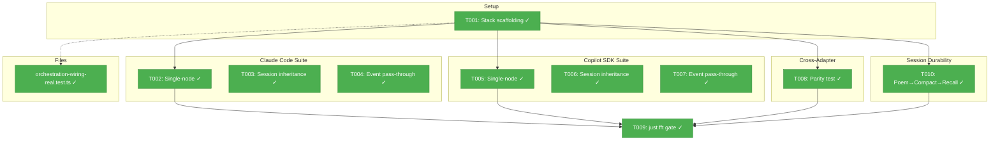

# Phase 4: Real Agent Wiring Integration Tests – Tasks & Alignment Brief

**Spec**: [agent-orchestration-wiring-spec.md](../../agent-orchestration-wiring-spec.md)
**Plan**: [agent-orchestration-wiring-plan.md](../../agent-orchestration-wiring-plan.md)
**Date**: 2026-02-17

---

## Executive Briefing

### Purpose
This phase proves the ODS → AgentManagerService → IAgentInstance → real adapter chain works end-to-end with both Claude Code and Copilot SDK. All tests use `describe.skip` — they're documentation/validation tests manually unskipped when needed.

### What We're Building
A single integration test file (`orchestration-wiring-real.test.ts`) with 3 suites:
- **Claude Code wiring**: single-node execution, session inheritance, event pass-through
- **Copilot SDK wiring**: same 3 tests with Copilot adapter
- **Cross-adapter parity**: both adapters produce sessionId and events through same chain

### User Value
Proves the entire orchestration wiring works with real AI agents. When manually unskipped and run, these tests validate that ODS creates real agent instances, pods execute with real adapters, sessions are inherited correctly, and events flow end-to-end.

---

## Objectives & Scope

### Objective
Write `describe.skip` integration tests proving real adapter wiring through the complete ODS → pod → instance → adapter chain.

### Goals

- ✅ Real orchestration stack construction with both adapter types
- ✅ Single-node wiring proven for both adapters (sessionId acquired)
- ✅ Session inheritance proven for both adapters (fork sessionId differs)
- ✅ Event pass-through proven for both adapters (events reach handlers)
- ✅ Cross-adapter parity verified
- ✅ All tests use `describe.skip` (not `skipIf`)
- ✅ All assertions are structural (no content assertions)

### Non-Goals

- ❌ Running tests in CI (they cost money and need auth)
- ❌ Testing prompt content (Spec B)
- ❌ Testing full WF protocol pipeline (Spec C)
- ❌ Execution tracking / `waitForAnyCompletion` (Spec B)
- ❌ Performance benchmarking

---

## Pre-Implementation Audit

### Summary
| File | Action | Origin | Modified By | Recommendation |
|------|--------|--------|-------------|----------------|
| `test/integration/orchestration-wiring-real.test.ts` | New | — | — | ✅ Proceed |

### Compliance Check
No violations. Single new file following test conventions. `describe.skip` per AC-55.

### Duplication Check
- `test/integration/agent-instance-real.test.ts` (Plan 034) — tests agent instance with real adapters. Phase 4 tests ORCHESTRATION wiring (ODS → pod → instance). Different scope, different file. No overlap.

---

## Requirements Traceability

### Coverage Matrix
| AC | Description | Tasks | Status |
|----|-------------|-------|--------|
| AC-50 | Real orchestration stack with both adapters | T001 | ✅ Covered |
| AC-51 | Single-node wiring (both adapters) | T002, T005 | ✅ Covered |
| AC-52 | Session inheritance wiring (both adapters) | T003, T006 | ✅ Covered |
| AC-53 | Event pass-through wiring (both adapters) | T004, T007 | ✅ Covered |
| AC-54 | Cross-adapter parity | T008 | ✅ Covered |
| AC-55 | All tests use `describe.skip` | All | ✅ Covered |

### Gaps Found
None.

---

## Architecture Map

### Component Diagram



### Task-to-Component Mapping

| Task | Component(s) | Status | Comment |
|------|-------------|--------|---------|
| T001 | Test scaffolding | ✅ Complete | createRealOrchestrationStack + helpers |
| T002 | Claude single-node | ✅ Complete | describe.skip, 120s timeout |
| T003 | Claude inheritance | ✅ Complete | describe.skip, manual node completion |
| T004 | Claude events | ✅ Complete | describe.skip, event collector |
| T005 | Copilot single-node | ✅ Complete | describe.skip |
| T006 | Copilot inheritance | ✅ Complete | describe.skip |
| T007 | Copilot events | ✅ Complete | describe.skip |
| T008 | Cross-adapter parity | ✅ Complete | describe.skip |
| T010 | Session durability | ✅ Complete | Workshop 02: poem→compact→recall |
| T009 | Gate check | ✅ Complete | just fft |

---

## Tasks

| Status | ID | Task | CS | Type | Dependencies | Absolute Path(s) | Validation | Subtasks | Notes |
|--------|------|------|-----|------|------------|-------------------|------------|----------|-------|
| [x] | T001 | Write test scaffolding: `createRealOrchestrationStack(service, ctx, adapterType)` with dynamic imports for `ClaudeCodeAdapter`/`UnixProcessManager` and `SdkCopilotAdapter`/`CopilotClient`. Helper `waitForPodSession(pod, timeoutMs)` polls sessionId every 1s. Helper `completeNodeManually()` for session inheritance. Follow Plan 034 dynamic import pattern. | 2 | Setup | – | `/home/jak/substrate/033-real-agent-pods/test/integration/orchestration-wiring-real.test.ts` | File compiles, helpers resolve adapters. | – | plan-scoped. Plan 4.1, Critical Finding #09 [^12] |
| [x] | T002 | Write Claude Code single-node wiring test: ODS creates instance via `getNew`, pod executes, real Claude spawns, pod acquires sessionId. `describe.skip`, 120s timeout. Structural assertions only. | 2 | Test | T001 | `/home/jak/substrate/033-real-agent-pods/test/integration/orchestration-wiring-real.test.ts` | Test exists in `describe.skip`. | – | Plan 4.2 [^13] |
| [x] | T003 | Write Claude Code session inheritance test: node-b inherits node-a's session via `getWithSessionId`. Manual node-a completion. Assert fork sessionId differs from source. `describe.skip`. | 2 | Test | T001 | `/home/jak/substrate/033-real-agent-pods/test/integration/orchestration-wiring-real.test.ts` | Test exists in `describe.skip`. | – | Plan 4.3 [^13] |
| [x] | T004 | Write Claude Code event pass-through test: events from real adapter flow through instance handlers to test collector. Assert `text_delta` or `message` events received. `describe.skip`. | 2 | Test | T001 | `/home/jak/substrate/033-real-agent-pods/test/integration/orchestration-wiring-real.test.ts` | Test exists in `describe.skip`. | – | Plan 4.4 [^13] |
| [x] | T005 | Write Copilot SDK single-node wiring test. Same as T002 with Copilot adapter. `describe.skip`. | 2 | Test | T001 | `/home/jak/substrate/033-real-agent-pods/test/integration/orchestration-wiring-real.test.ts` | Test exists in `describe.skip`. | – | Plan 4.5 [^14] |
| [x] | T006 | Write Copilot SDK session inheritance test. Same as T003 with Copilot. `describe.skip`. | 2 | Test | T001 | `/home/jak/substrate/033-real-agent-pods/test/integration/orchestration-wiring-real.test.ts` | Test exists in `describe.skip`. | – | Plan 4.6 [^14] |
| [x] | T007 | Write Copilot SDK event pass-through test. Same as T004 with Copilot. `describe.skip`. | 2 | Test | T001 | `/home/jak/substrate/033-real-agent-pods/test/integration/orchestration-wiring-real.test.ts` | Test exists in `describe.skip`. | – | Plan 4.7 [^14] |
| [x] | T008 | Write cross-adapter parity test: both Claude and Copilot produce sessionId and emit text events through same ODS → pod wiring chain. `describe.skip`. | 2 | Test | T001 | `/home/jak/substrate/033-real-agent-pods/test/integration/orchestration-wiring-real.test.ts` | Test exists in `describe.skip`. | – | Plan 4.8 [^15] |
| [x] | T009 | Verify `just fft` still passes (skipped tests don't interfere). 3873+ tests pass. | 1 | Integration | T001-T010 | All | 3873+ pass, 0 failures from skipped tests. | – | Plan 4.9. Gate check |
| [x] | T010 | Write multi-turn session durability test per Workshop 02: full-stack ODS setup → wait for pod sessionId → get instance via `getWithSessionId()` (assert same-instance guarantee) → poem prompt → compact → recall prompt. Assert same sessionId throughout, output non-empty. `describe.skip`. | 2 | Test | T001 | `/home/jak/substrate/033-real-agent-pods/test/integration/orchestration-wiring-real.test.ts` | Test exists in `describe.skip`. | – | Workshop 02. Claude only (Copilot has no compact) [^15] |

---

## Alignment Brief

### Prior Phases Review

**Phase 1** (COMPLETE): Types, interfaces, schema — 7 tasks. Created `ORCHESTRATION_DI_TOKENS.AGENT_MANAGER`, updated all type definitions. 5 schema tests.

**Phase 2** (COMPLETE): ODS and AgentPod rewiring — 12 tasks. ODS uses `agentManager.getNew()`/`.getWithSessionId()`, AgentPod wraps `IAgentInstance`, reality builder populates settings. 11 new wiring tests.

**Phase 3** (COMPLETE): DI container + existing test updates — 10 tasks. Container resolves `AGENT_MANAGER`, all orchestration tests updated to use `FakeAgentManagerService`/`FakeAgentInstance`. 3873 tests pass, zero stale references.

**Foundation for Phase 4**: The complete wiring chain is proven with fakes. Phase 4 replaces fakes with real adapters to validate the same chain end-to-end.

### Critical Findings Affecting This Phase

| Finding | Constraint | Tasks |
|---------|-----------|-------|
| #09: Real adapters need dynamic imports | `await import()` in beforeAll per Plan 034 pattern | T001 |
| #10: No execution tracking (Spec B) | Poll `pod.sessionId` with timeout; manual node completion | T001, T003, T006 |

### PlanPak Placement Rules

Single new file: `test/integration/orchestration-wiring-real.test.ts` — **plan-scoped** test infrastructure.

### Test Plan

All tests use `describe.skip`. Fakes only for `IScriptRunner` (code pods). Real adapters for agent pods.

| Test | Suite | Adapter | Assertion |
|------|-------|---------|-----------|
| Single-node wiring | Claude | ClaudeCodeAdapter | `pod.sessionId` truthy after execution |
| Session inheritance | Claude | ClaudeCodeAdapter | `nodeB.sessionId !== nodeA.sessionId` |
| Event pass-through | Claude | ClaudeCodeAdapter | `events.length > 0`, type check |
| Single-node wiring | Copilot | SdkCopilotAdapter | `pod.sessionId` truthy |
| Session inheritance | Copilot | SdkCopilotAdapter | sessionId differs |
| Event pass-through | Copilot | SdkCopilotAdapter | events received |
| Cross-adapter parity | Both | Both | Both produce sessionId + events |

### Commands to Run

```bash
# After all tasks (verify skipped tests don't interfere):
just fft
# Should pass 3873+ tests, skipped tests don't count

# To manually validate (costs $, needs auth):
npx vitest run test/integration/orchestration-wiring-real.test.ts --no-file-parallelism
# Must unskip describe.skip → describe first
```

### Risks

| Risk | Severity | Mitigation |
|------|----------|------------|
| Real agent tests slow (30-120s each) | Low | `describe.skip` — never in CI |
| Claude CLI not available in env | Low | `describe.skip` — manual unskip only |
| Non-deterministic agent output | Low | Structural assertions only |
| Dynamic import fails at test parse | Low | Follow proven Plan 034 pattern |

### Ready Check

- [x] Prior phases reviewed (Phases 1-3 all COMPLETE)
- [x] Critical Findings mapped (#09 → T001, #10 → T001/T003/T006)
- [x] Pre-implementation audit complete (1 new file)
- [x] Requirements traceability complete (6 ACs covered)
- [x] **GO — Phase 4 Complete**

---

## Phase Footnote Stubs

| Footnote | Phase | Summary |
|----------|-------|---------|
| [^12] | Phase 4 | T001 — Test scaffolding: `createRealOrchestrationStack`, helpers |
| [^13] | Phase 4 | T002-T004 — Claude Code wiring tests |
| [^14] | Phase 4 | T005-T007 — Copilot SDK wiring tests |
| [^15] | Phase 4 | T008, T010 — Cross-adapter parity + session durability |

---

## Evidence Artifacts

- **Execution Log**: `docs/plans/035-agent-orchestration-wiring/tasks/phase-4-real-agent-wiring-integration-tests/execution.log.md`
- **Flight Plan**: `docs/plans/035-agent-orchestration-wiring/tasks/phase-4-real-agent-wiring-integration-tests/tasks.fltplan.md`
- **Test File**: `test/integration/orchestration-wiring-real.test.ts`

---

## Discoveries & Learnings

_Populated during implementation by plan-6. Log anything of interest to your future self._

| Date | Task | Type | Discovery | Resolution | References |
|------|------|------|-----------|------------|------------|
| | | | | | |

**Types**: `gotcha` | `research-needed` | `unexpected-behavior` | `workaround` | `decision` | `debt` | `insight`

_See also: `execution.log.md` for detailed narrative._

---

## Directory Layout

```
docs/plans/035-agent-orchestration-wiring/
  └── tasks/
      ├── phase-1-types-interfaces-and-schema-changes/ (COMPLETE)
      ├── phase-2-ods-and-agentpod-rewiring-with-tdd/ (COMPLETE)
      ├── phase-3-di-container-and-existing-test-updates/ (COMPLETE)
      └── phase-4-real-agent-wiring-integration-tests/
          ├── tasks.md                 ← this file
          ├── tasks.fltplan.md         ← generated by /plan-5b
          └── execution.log.md         ← created by /plan-6
```
