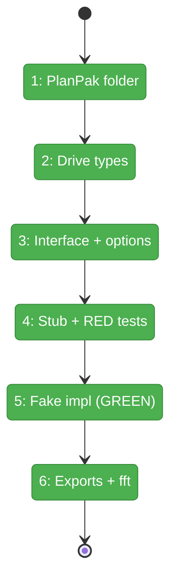
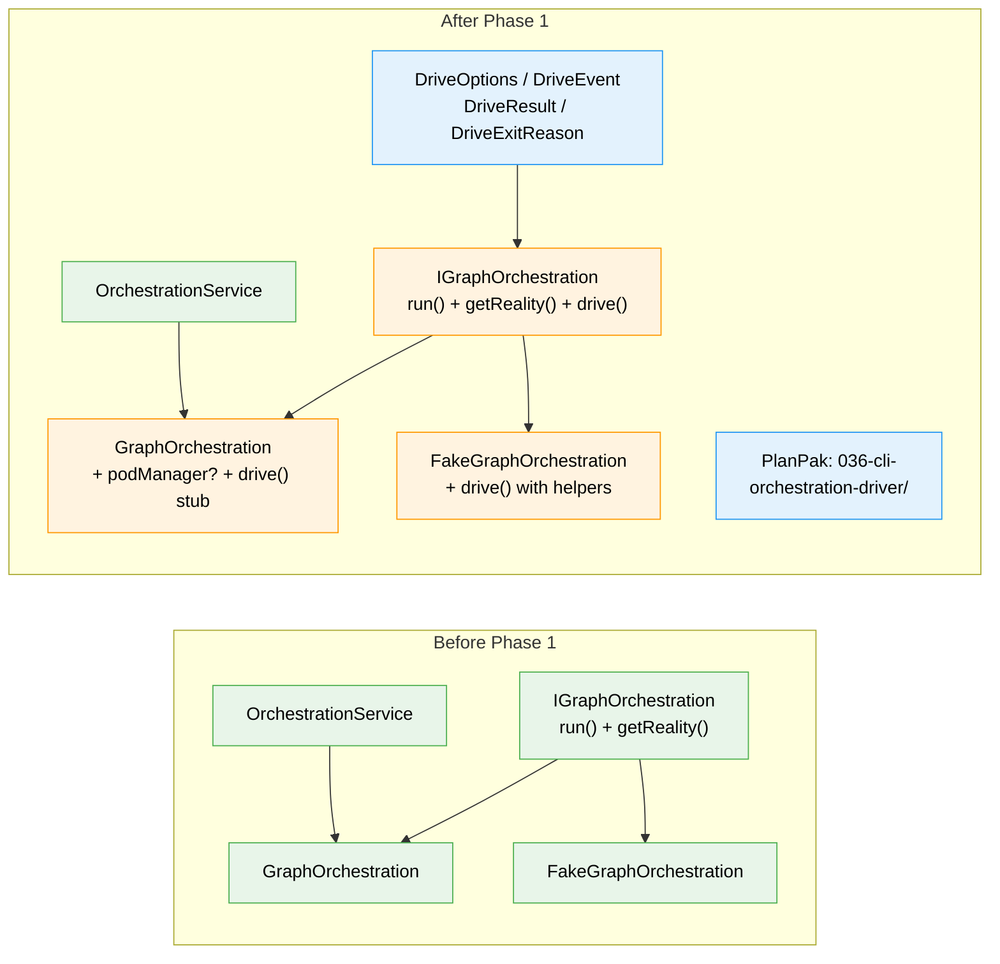

# Flight Plan: Phase 1 — Types, Interfaces, and PlanPak Setup

**Plan**: [cli-orchestration-driver-plan.md](../../cli-orchestration-driver-plan.md)
**Phase**: Phase 1: Types, Interfaces, and PlanPak Setup
**Generated**: 2026-02-17
**Status**: Complete ✅

---

## Departure → Destination

**Where we are**: The orchestration engine (Plan 030) can `run()` a single pass — settle events, build reality, decide next action, execute it, return. But there's no way to keep running until a graph completes. Real agents take minutes to hours, and the system has no persistent loop, no drive types, and no CLI command to kick it all off.

**Where we're going**: By the end of this phase, the `drive()` contract exists on `IGraphOrchestration` with full type definitions (`DriveOptions`, `DriveEvent`, `DriveResult`), a working fake with test helpers, and a PlanPak folder ready for the CLI handler. A developer can write `const result = await handle.drive()` and TypeScript will compile — the actual loop logic comes in Phase 4.

---

## Flight Status

<!-- Updated by /plan-6: pending → active → done. Use blocked for problems/input needed. -->

**Legend**: grey = pending | yellow = active | red = blocked/needs input | green = done

---

## Stages

<!-- Updated by /plan-6 during implementation: [ ] → [~] → [x] -->

- [x] **Stage 1: Create PlanPak feature folder** — empty directory with `.gitkeep` for CLI handler in Phase 5 (`apps/cli/src/features/036-cli-orchestration-driver/`)
- [ ] **Stage 2: Define drive types** — `DriveOptions`, `DriveEvent` (4 orchestration-only types), `DriveResult`, `DriveExitReason` (`orchestration-service.types.ts`)
- [ ] **Stage 3: Extend interface and options** — add `drive()` to `IGraphOrchestration`, add optional `podManager` to `GraphOrchestrationOptions`, add `drive()` stub to `GraphOrchestration` (`orchestration-service.types.ts`, `graph-orchestration.ts`)
- [ ] **Stage 4: Write failing tests for fake** — RED tests validating configured results, FIFO order, call tracking, default behavior (`fake-drive.test.ts` — new file)
- [ ] **Stage 5: Implement fake drive()** — `setDriveResult()`, `getDriveHistory()` helpers on `FakeGraphOrchestration` make tests green (`fake-orchestration-service.ts`)
- [ ] **Stage 6: Export and validate** — barrel re-exports at feature and package level, then `just fft` for full green (`index.ts` × 2)

---

## Acceptance Criteria

- [x] `drive()` is on `IGraphOrchestration` (interface extension)
- [x] `DriveEvent` has exactly 4 types: iteration, idle, status, error (no agent events — ADR-0012)
- [x] `FakeGraphOrchestration` implements `drive()` with test helpers
- [x] `GraphOrchestrationOptions` includes optional `podManager`
- [x] `just fft` clean (lint, format, test all pass)

---

## Goals & Non-Goals

**Goals**:
- Define `DriveOptions`, `DriveEvent`, `DriveResult`, `DriveExitReason` types
- Add `drive()` to `IGraphOrchestration` interface
- Add optional `podManager` to `GraphOrchestrationOptions`
- Implement `FakeGraphOrchestration.drive()` with test helpers
- Create PlanPak feature folder
- `just fft` clean

**Non-Goals**:
- Implementing `drive()` logic (Phase 4)
- Prompt templates or AgentPod changes (Phase 2)
- `formatGraphStatus()` (Phase 3)
- CLI command registration (Phase 5)
- Making `podManager` required (Phase 4 promotes it)
- Updating DI container or OrchestrationService (not needed — podManager is optional)

---

## Architecture: Before & After

**Legend**: existing (green, unchanged) | changed (orange, modified) | new (blue, created)

---

## Checklist

- [x] T001: Create PlanPak feature folder (CS-1)
- [x] T002: Define DriveOptions, DriveEvent, DriveResult, DriveExitReason types (CS-2)
- [x] T003: Add drive() to IGraphOrchestration interface (CS-1)
- [x] T004: Add optional podManager to GraphOrchestrationOptions (CS-1)
- [x] T005: Add drive() stub to GraphOrchestration (CS-1)
- [x] T006: Write RED tests for FakeGraphOrchestration.drive() (CS-2)
- [x] T007: Implement FakeGraphOrchestration.drive() with helpers (CS-2)
- [x] T008: Update barrel exports + just fft (CS-1)

---

## PlanPak

Active — CLI handler files organized under `apps/cli/src/features/036-cli-orchestration-driver/`. Orchestration changes are cross-plan-edits to `030-orchestration/`.
